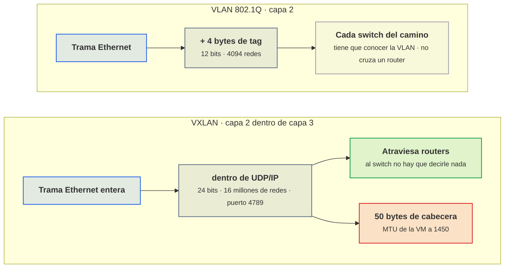
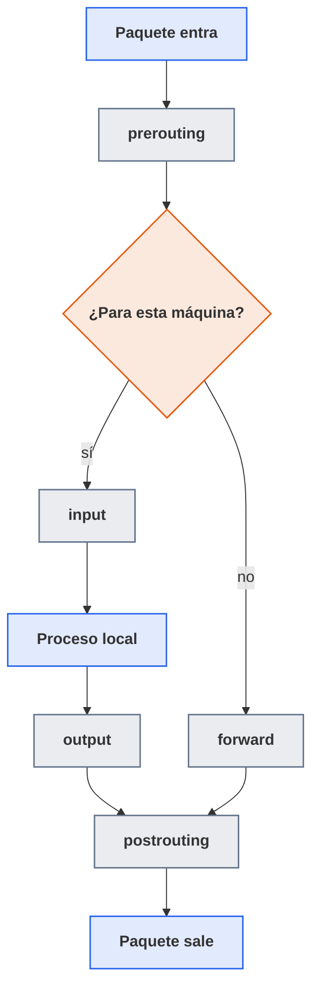

# Para ampliar

Esta página recoge, unidad por unidad, dos cosas que no caben en las sesiones: los apartados que van más allá de lo que se hace en clase (no se explican ni los necesita ninguna hoja de práctica, pero son lo que aparece en el día a día de una empresa) y los enlaces para seguir por cuenta propia. Las unidades quedan así con lo que se da en cada sesión, y esto está aquí para ir más lejos y para situar lo que suene durante la formación en empresa.

## UT1 · Virtualización e hipervisores

Material que va más allá de lo que se hace en clase en la [UT1](ut/ut1-virtualizacion.md): el clúster de Proxmox con migración en vivo, que no se monta en el laboratorio, el interior de KVM y QEMU y los enlaces de referencia de la unidad.

### Clúster y migración en vivo

No se monta en el laboratorio (haría falta un segundo nodo con la misma red y, para que tenga sentido, almacenamiento compartido), pero es lo primero que aparece en una empresa y explica varias decisiones de diseño de esta unidad.

<figure markdown="span">
  { width="640" }
  <figcaption>Resumen de un clúster de tres nodos en Proxmox VE 8. Fuente: Proxmox Server Solutions GmbH, dominio público, vía Wikimedia Commons.</figcaption>
</figure>

Varios nodos Proxmox se unen en un clúster (`pvecm create`, `pvecm add`) que comparte `/etc/pve` a través de corosync, un protocolo de mensajería con quórum: para que el clúster tome decisiones necesita mayoría de nodos (por eso los clústeres son de tres o cinco, no de dos; con dos, si cae uno el otro se queda sin quórum y no deja ni arrancar VM). Desde una sola consola web se administran todos los nodos.

La migración en vivo (`qm migrate 101 pve2 --online`) mueve una VM encendida de un nodo a otro sin que los usuarios lo noten: QEMU copia la RAM al destino mientras la VM sigue trabajando, va recopiando las páginas que se ensucian, y cuando queda poco por copiar pausa la VM unas decenas de milisegundos, transfiere el resto y el estado de la CPU, y la reanuda en el destino. Con almacenamiento compartido (NFS, Ceph, iSCSI) el disco no se mueve; con almacenamiento local Proxmox también puede copiarlo (`--with-local-disks`), pero tardará lo que tarde el disco. Aquí es donde el tipo de CPU importa: si la VM es `host` y los dos nodos tienen CPU distintas, la migración se rechaza o el invitado se rompe al llegar. Y sobre el clúster se monta la alta disponibilidad (HA): si un nodo muere, sus VM marcadas como HA se arrancan automáticamente en otro, cosa que también exige almacenamiento compartido y, en Proxmox, *fencing* por watchdog para asegurarse de que el nodo caído no siga escribiendo.

### Dentro de KVM y QEMU

Detalle de [Cómo funciona KVM/QEMU por debajo](ut/ut1-virtualizacion.md#como-funciona-kvmqemu-por-debajo), en la sesión 4. Nada de esto cambia una decisión de configuración, pero explica de dónde sale el coste de cada salida de la VM.

**El modo invitado de la CPU.** Se dice a menudo que el hipervisor corre en "ring -1": la CPU tiene un modo adicional (VMX root en Intel) en el que corre el kernel del host con KVM, y un modo invitado (VMX non-root) en el que corre la VM con sus propios anillos 0 a 3. El kernel del invitado cree que está en ring 0 y ejecuta instrucciones privilegiadas con normalidad; cuando hace algo que el hipervisor necesita controlar (tocar una tabla de páginas, acceder a un puerto de E/S, ejecutar `cpuid`, recibir una interrupción) la CPU sale del modo invitado, KVM atiende la petición y vuelve a entrar.

**La memoria.** La traducción de las direcciones del invitado a direcciones físicas se hace con tablas de páginas anidadas (EPT en Intel, NPT o RVI en AMD): la unidad de gestión de memoria de la CPU resuelve los dos niveles en hardware, sin intervención del hipervisor. Sin ellas, cada vez que el invitado tocara sus tablas de páginas habría una salida más.

**La conversación entre QEMU y el kernel.** QEMU abre `/dev/kvm`, crea la VM y sus vCPU mediante `ioctl()` (la llamada con la que un proceso da órdenes a un driver del kernel) y lanza un hilo por vCPU que se pasa la vida dentro de una llamada `KVM_RUN`. Mientras la VM ejecuta código corriente, ese hilo está bloqueado dentro del kernel y el proceso QEMU no consume nada. Cuando se produce una salida que KVM no resuelve solo, la llamada retorna, QEMU emula el dispositivo que corresponda y vuelve a entrar.

**Hasta dónde llega la emulación.** QEMU imita una tarjeta Intel e1000 con tal fidelidad que el driver original de Windows XP la reconoce y funciona sin instalar nada. Es un buen ejemplo de lo que se gana y de lo que se paga: compatibilidad con sistemas que nunca oyeron hablar de virtio, a cambio de que cada acceso del driver a un registro de esa tarjeta ficticia sea una salida de la VM y una vuelta a espacio de usuario.

### Enlaces

- [Proxmox VE Administration Guide](https://pve.proxmox.com/pve-docs/pve-admin-guide.html): la referencia completa; los capítulos de Qemu/KVM Virtual Machines, Network Configuration y Storage cubren toda esta unidad con más detalle.
- [Wiki de Proxmox: Cloud-Init Support](https://pve.proxmox.com/wiki/Cloud-Init_Support): cómo integra Proxmox el datasource NoCloud, opciones de `qm set` y ejemplos de snippets con `cicustom`.
- [Wiki de Proxmox: Package Repositories](https://pve.proxmox.com/wiki/Package_Repositories): los repositorios enterprise, no-subscription y test, y el formato en cada versión.
- [Wiki de Proxmox: Nested Virtualization](https://pve.proxmox.com/wiki/Nested_Virtualization): activar la anidada en el host exterior y requisitos de la VM.
- [Documentación de cloud-init](https://cloudinit.readthedocs.io/): referencia de módulos, el datasource NoCloud, las etapas de arranque y la guía de depuración.
- [Imágenes cloud de Debian](https://cloud.debian.org/images/cloud/): variantes `generic`, `genericcloud` y `nocloud` y qué incluye cada una.
- [Documentación de KVM en el kernel](https://docs.kernel.org/virt/kvm/index.html): la API de `/dev/kvm` que usa QEMU; para entender qué es un VM exit de verdad.
- [Documentación de QEMU](https://www.qemu.org/docs/master/): dispositivos emulados, formato qcow2 y `qemu-img`.
- [Especificación virtio (OASIS)](https://docs.oasis-open.org/virtio/virtio/v1.2/virtio-v1.2.html): cómo funcionan las virtqueues; con leer la introducción se entiende por qué virtio gana a la emulación.
- [Proxmox Backup Server: documentación](https://pbs.proxmox.com/docs/): deduplicación, backups incrementales y retención, para cuando el laboratorio se convierta en algo que hay que proteger.
- [man 1 fio](https://man7.org/linux/man-pages/man1/fio.1.html) y [stress-ng](https://man7.org/linux/man-pages/man1/stress-ng.1.html): los parámetros de las herramientas de medida que se usan en la práctica.

## UT2 · Nubes privadas virtuales (VPC)

Apartados y enlaces que van más allá de lo que se hace en clase en la unidad de nubes privadas virtuales, [UT2](ut/ut2-vpc.md): las zonas de disponibilidad y la comparación completa entre VLAN y VXLAN.

### Zonas de disponibilidad

En nube, una región (eu-west-1, westeurope) tiene dos o tres zonas de disponibilidad: centros de datos físicamente separados, con alimentación y red independientes, unidos por fibra de baja latencia. La VPC abarca toda la región, pero cada subred vive en una zona concreta. Una aplicación que quiera sobrevivir a la caída de un edificio tiene que tener instancias en al menos dos subredes de zonas distintas, y un balanceador delante que reparta. Los proveedores lo cobran: el tráfico entre zonas se factura y los servicios gestionados "multi-AZ" cuestan más.

En el aula la zona de disponibilidad es el nodo Proxmox: si un nodo se apaga, caen sus VM y no las del otro. Quien tenga acceso a dos nodos en clúster lo simula con una zona VXLAN (para que la VNet exista en ambos) y una VM de cada capa en cada nodo. Quien tenga un solo nodo lo simula lógicamente: dos subredes por capa (`front-a` en `10.10.1.0/24`, `front-b` en `10.10.11.0/24`), una VM de la aplicación en cada una, y demuestra que apagar `web01` en front-a no tira el servicio porque `web02` en front-b sigue respondiendo. No es lo mismo (comparten el hardware), pero el diseño de red y el despliegue de la aplicación son exactamente los que se harían en nube, y eso es lo que se evalúa.

### VLAN frente a VXLAN

Comparación completa de los dos tipos de zona que se usan fuera del laboratorio; en la sesión 8, [VLAN 802.1Q frente a VXLAN](ut/ut2-vpc.md#vlan-8021q-frente-a-vxlan) se queda con la consecuencia práctica, la MTU.

Una VLAN añade 4 bytes a la trama Ethernet con un identificador de 12 bits: 4094 redes posibles. Es un estándar de capa 2 que entienden todos los switches gestionables, es barato de procesar y se depura con `tcpdump -e` viendo el tag. Su limitación es que la VLAN tiene que existir en cada switch por el que pasa el tráfico, así que depende de que el equipo de redes la configure, y no cruza un router (por definición de capa 2).

VXLAN ([RFC 7348](https://www.rfc-editor.org/rfc/rfc7348)) mete la trama Ethernet completa dentro de un paquete UDP/IP con un identificador de 24 bits (16 millones de redes). Como es IP, atraviesa routers y no necesita que el switch sepa nada: solo que los nodos Proxmox se alcancen entre sí por el puerto 4789. El precio son 50 bytes de cabecera extra, lo que obliga a bajar la MTU (el tamaño máximo de paquete que admite una interfaz) de las VM a 1450 si la red física va a 1500, o subir la física a 1550 o más, que es lo correcto si se puede.



<p class="pie" markdown>La VLAN es más barata de procesar pero depende del equipo de redes. VXLAN no depende de nadie y se paga en cabecera.</p>

### Enlaces

- [Proxmox VE Administration Guide, capítulo SDN](https://pve.proxmox.com/pve-docs/chapter-pvesdn.html): la referencia de zonas, VNets, subnets, IPAM y DHCP integrado; conviene leer la parte de "Simple zone" y "DHCP" antes de la sesión 8.
- [Proxmox VE API Viewer](https://pve.proxmox.com/pve-docs/api-viewer/): todas las rutas de la API con sus parámetros; es lo que `pvesh usage` muestra, pero navegable.
- [Proxmox wiki: Proxmox VE API](https://pve.proxmox.com/wiki/Proxmox_VE_API): autenticación con tickets y con tokens, y ejemplos con curl.
- [RFC 1918, Address Allocation for Private Internets](https://www.rfc-editor.org/rfc/rfc1918): cuatro páginas; explica por qué existen los rangos privados y qué obligaciones tiene quien los usa.
- [RFC 4632, CIDR](https://www.rfc-editor.org/rfc/rfc4632): la especificación del direccionamiento sin clases, por si interesa entender de dónde sale la notación /n.
- [RFC 7348, VXLAN](https://www.rfc-editor.org/rfc/rfc7348): el formato de encapsulación y el porqué de los 50 bytes de cabecera.
- [Página de manual de dnsmasq](https://thekelleys.org.uk/dnsmasq/docs/dnsmasq-man.html): larga pero es la fuente; buscad `dhcp-range`, `dhcp-host`, `expand-hosts` y `local`.
- [nftables wiki: Performing Network Address Translation](https://wiki.nftables.org/wiki-nftables/index.php/Performing_Network_Address_Translation_(NAT)): masquerade, SNAT y DNAT con ejemplos que se usan tal cual en la UT3.
- [cloud-init, Network configuration](https://cloudinit.readthedocs.io/en/latest/reference/network-config.html): cómo cloud-init traduce el `--ipconfig0` de Proxmox a la configuración de red de la VM.
- [tcpdump(8) en man7.org](https://man7.org/linux/man-pages/man8/tcpdump.8.html) y [pcap-filter(7)](https://man7.org/linux/man-pages/man7/pcap-filter.7.html): la sintaxis de los filtros (`port`, `host`, `net`, `and`, `not`).

## UT3 · Seguridad por capas: DMZ externa, DMZ interna y zona interna

Apartados que en clase solo se mencionan y la lista de enlaces de la [UT3](ut/ut3-seguridad-por-capas.md), la unidad del cortafuegos por zonas, el proxy inverso y la separación de clientes: las dos capas de inspección que hay por encima del cortafuegos, el interior de la tabla de estados y el cortafuegos entero escrito en nftables.

### IDS/IPS y WAF, dos capas más

El cortafuegos decide por puertos y direcciones. No sabe si lo que entra por el 443 es una petición legítima o un intento de explotación. Para eso hay dos capas adicionales que en el módulo solo se mencionan: OPNsense integra **Suricata** como IDS/IPS (Services → Intrusion Detection), que inspecciona el contenido de los paquetes contra reglas de firmas (ET Open, gratuitas) y puede alertar o bloquear. En la interfaz WAN de un laboratorio con tráfico cifrado ve poco; tiene más sentido en la DMZ externa, después del proxy, donde el tráfico ya va en claro. Y en el propio proxy inverso se puede añadir un **WAF** (Web Application Firewall) como ModSecurity o su reimplementación en Go, Coraza, con el conjunto de reglas OWASP CRS (Core Rule Set, la lista de patrones de ataque que mantiene la fundación OWASP), que bloquea patrones de inyección SQL, XSS (inyección de scripts en páginas web) y similares antes de que lleguen a la aplicación. Ambos generan falsos positivos; conviene no ponerlos en modo bloqueo el primer día.

### La tabla de estados por dentro

Ampliación de [Cortafuegos con estado](ut/ut3-seguridad-por-capas.md#cortafuegos-con-estado), en la sesión 14.

La tabla de estados tiene tamaño finito. En Debian `sysctl net.netfilter.nf_conntrack_max` suele valer 65536 o más según la RAM; en OPNsense el límite está en Firewall → Settings → Advanced (Firewall Maximum States). Un ataque de inundación de SYN busca precisamente llenarla; cuando se llena, el cortafuegos descarta conexiones nuevas legítimas y en el log aparece `nf_conntrack: table full, dropping packet`. Los tiempos de expiración también se configuran: una conexión TCP establecida sin tráfico vive por defecto 5 días en conntrack de Linux, y por eso una sesión SSH aguanta horas abierta sin que el cortafuegos la olvide.

### nftables: el fichero de reglas completo

El curso monta el cortafuegos con OPNsense; esto es la alternativa entera con un router Debian, para quien la prefiera o quiera entender el motor que hay debajo del firewall de Proxmox y de Docker. La unidad la presenta y dice cuándo se elige en [Alternativa: nftables en una VM Linux](ut/ut3-seguridad-por-capas.md#alternativa-nftables-en-una-vm-linux), y el paso 9 de la A3.1 enlaza aquí.

#### Tablas, cadenas, hooks y prioridades

Un ruleset de nftables se organiza en **tablas**, que son contenedores con una familia de direcciones: `ip` (IPv4), `ip6`, `inet` (las dos a la vez, la más habitual), `arp`, `bridge` y `netdev`. Dentro de una tabla hay **cadenas**, y las cadenas contienen reglas. Hay dos tipos de cadena: las **base**, que se enganchan a un hook del kernel y por las que pasa el tráfico automáticamente, y las regulares, a las que solo se llega con `jump` o `goto` desde otra cadena.

Los hooks son los puntos del recorrido de un paquete por la pila de red donde netfilter puede intervenir:



<p class="pie" markdown>Saber por qué hook pasa un paquete es lo que decide en qué cadena va la regla. El tráfico que atraviesa la máquina nunca toca `input`.</p>

Para un router entre zonas casi todo ocurre en `forward`: el tráfico que va de una zona a otra no es para el cortafuegos, así que nunca pasa por `input` ni `output`. `input` protege a la propia máquina (quién puede hacerle SSH o abrir su web) y `prerouting`/`postrouting` son donde se hace el NAT (DNAT en prerouting, antes de decidir la ruta; SNAT en postrouting, después).

La **prioridad** ordena las cadenas base que comparten hook: se evalúan de menor a mayor número. Hay nombres predefinidos: `raw` (-300), `mangle` (-150), `dstnat` (-100), `filter` (0), `security` (50), `srcnat` (100). Lo importante es que el DNAT (-100) va antes que el filtro (0) en prerouting, y por eso en la cadena `forward` se filtra con la dirección de destino ya traducida, igual que en pf. La **política** de una cadena base (`policy drop` o `policy accept`) es lo que ocurre si ninguna regla coincide; en `forward` e `input` se pone en `drop`.

#### El fichero completo y persistente

Este es el fichero `/etc/nftables.conf` para el laboratorio, con nombres de interfaz ya renombrados con systemd-networkd o udev (los dos mecanismos de Debian para dar nombre fijo a una interfaz) para que se llamen como las zonas (si no, se usan `ens18`, `ens19`… o mejor, se definen variables). Tiene tres partes: las variables con redes y servidores, la tabla `fw` con las cadenas `input` (quién llega al propio router) y `forward` (qué cruza entre zonas), y la tabla `nat`. Conviene fijarse en que las dos cadenas de filtro empiezan igual, con `established,related` e `invalid`, y terminan con un `log` seguido de `drop`; entre medias solo están los saltos permitidos, uno por línea:

```text
#!/usr/sbin/nft -f
flush ruleset

define net_dmzext = 10.10.1.0/24
define net_dmzint = 10.10.2.0/24
define net_int    = 10.10.3.0/24
define net_mgmt   = 10.10.0.0/24
define srv_web    = 10.10.1.10
define srv_app    = 10.10.2.10
define srv_db     = 10.10.3.10

table inet fw {

    chain input {
        type filter hook input priority filter; policy drop;
        ct state established,related accept
        ct state invalid drop
        iifname "lo" accept
        icmp type { echo-request, destination-unreachable, time-exceeded } accept
        iifname "mgmt" ip saddr $net_mgmt tcp dport { 22, 443 } accept
        log prefix "FW-INPUT-DROP " drop
    }

    chain forward {
        type filter hook forward priority filter; policy drop;
        ct state established,related accept
        ct state invalid drop

        # Publicación: Internet -> proxy (destino ya traducido por el DNAT)
        iifname "wan" oifname "dmzext" ip daddr $srv_web tcp dport { 80, 443 } accept

        # Capas: proxy -> app -> db
        iifname "dmzext" oifname "dmzint" ip saddr $srv_web ip daddr $srv_app tcp dport 8080 accept
        iifname "dmzint" oifname "int"    ip saddr $srv_app ip daddr $srv_db  tcp dport 5432 accept

        # Gestión llega a todo por SSH
        iifname "mgmt" ip saddr $net_mgmt tcp dport 22 accept

        # Diagnóstico: ping desde gestión
        iifname "mgmt" icmp type echo-request accept

        log prefix "FW-FWD-DROP " drop
    }

    chain output {
        type filter hook output priority filter; policy accept;
    }
}

table ip nat {
    chain prerouting {
        type nat hook prerouting priority dstnat; policy accept;
        iifname "wan" tcp dport { 80, 443 } dnat to $srv_web
    }
    chain postrouting {
        type nat hook postrouting priority srcnat; policy accept;
        oifname "wan" ip saddr $net_dmzext masquerade
    }
}
```

El `masquerade` solo cubre la DMZ externa: la DMZ interna y la zona interna no tienen salida a Internet. Si app01 necesita instalar paquetes, se hace por un proxy APT en MGMT o se abre una regla temporal y documentada.

Para probarlo sin cargarlo, `nft -c -f /etc/nftables.conf` valida la sintaxis. Se carga con `nft -f /etc/nftables.conf` y se persiste activando el servicio: `systemctl enable --now nftables`, que en Debian lee exactamente ese fichero en cada arranque. Antes de todo hay que activar el reenvío en el kernel, `net.ipv4.ip_forward=1` en `/etc/sysctl.d/99-router.conf`, porque sin eso el router descarta todo lo que no es para él aunque nftables lo permita. `nft list ruleset` muestra lo cargado, y `nft list ruleset -a` añade los handles de cada regla para poder borrar una concreta. Los logs salen por el kernel, `journalctl -k -f | grep FW-`, o a un fichero propio si se configura rsyslog (el servicio de logs de Debian) con un filtro por prefijo.

!!! ojo "Orden de las reglas y bloqueo remoto"
    Si el router Debian se administra por SSH desde MGMT y se carga un ruleset con `policy drop` en `input`
    sin la regla que permite ese SSH, se pierde el acceso en el acto (la sesión en curso sobrevive gracias a
    `established`, pero la siguiente no entra). Conviene dejar preparado un `at now + 5 min` (una orden
    programada que se ejecuta pasado ese tiempo) que restaure el fichero anterior, o trabajar desde la
    consola de Proxmox.

### Enlaces

- [Documentación de OPNsense: Firewall](https://docs.opnsense.org/manual/firewall.html): reglas, orden de evaluación, quick, flotantes y grupos, con capturas de cada campo.
- [Documentación de OPNsense: Aliases](https://docs.opnsense.org/manual/aliases.html): tipos de alias, incluidas las tablas URL y los aliases GeoIP.
- [Documentación de OPNsense: NAT](https://docs.opnsense.org/manual/nat.html): port forward, outbound, one-to-one y NPT, con el detalle de la regla de filtro asociada.
- [Documentación de OPNsense: Intrusion Prevention System](https://docs.opnsense.org/manual/ips.html): Suricata integrado, conjuntos de reglas y modo IPS.
- [Wiki de nftables](https://wiki.nftables.org/wiki-nftables/index.php/Main_Page): la referencia del proyecto; empezad por "Quick reference" y "Netfilter hooks".
- [nft(8) en man7.org](https://man7.org/linux/man-pages/man8/nft.8.html): sintaxis completa, familias, tipos de cadena y expresiones de conntrack.
- [Nmap Reference Guide: Port Scanning Basics](https://nmap.org/book/man-port-scanning-basics.html): la definición exacta de open, closed, filtered y los estados combinados.
- [nginx: módulo ngx_http_proxy_module](https://nginx.org/en/docs/http/ngx_http_proxy_module.html): todas las directivas proxy_*, incluidas las de cabeceras y buffers.
- [Documentación de Traefik](https://doc.traefik.io/traefik/): descubrimiento de servicios por etiquetas Docker; se usa en la UT6.
- [Let's Encrypt: cómo funciona](https://letsencrypt.org/docs/): retos HTTP-01 y DNS-01, límites de emisión y clientes ACME.
- [step-ca de Smallstep](https://smallstep.com/docs/step-ca/): CA interna con ACME para automatizar certificados en zonas que no ven Internet.
- [Proxmox VE: Network Configuration](https://pve.proxmox.com/wiki/Network_Configuration): bridges VLAN aware, tags por VM y trunks.

## UT4 · Nube pública: consola, CLI y SDK

Material que va más allá de lo que se hace en la empresa en la unidad [UT4](ut/ut4-nube-publica.md): el modelo de responsabilidad compartida, que explica qué deja de ser responsabilidad propia al pasar de Proxmox a la nube, el nivel gratuito de las cuentas nuevas, la cadena de credenciales completa de los tres proveedores y los enlaces de ampliación.

### El modelo de responsabilidad compartida

Los tres grandes lo llaman modelo de responsabilidad compartida y lo resumen igual: el proveedor es responsable de la seguridad *de* la nube (centros de datos, hardware, hipervisor, red física, los servicios gestionados por dentro) y el cliente es responsable de la seguridad *en* la nube (sistema operativo de sus VM, parches, configuración de red, cortafuegos, identidades, cifrado de sus datos, y sobre todo qué expone a Internet).

En Proxmox todo quedaba del lado del administrador: si el hipervisor se quedaba sin parchear, el problema era suyo. En la nube el hipervisor deja de serlo, pero el grupo de seguridad con `0.0.0.0/0` al puerto 22 sigue siéndolo, y también lo es la clave de acceso que alguien subió a un repositorio público. La línea se desplaza según el servicio: en una VM (EC2, Azure VM, Compute Engine) se administra el sistema operativo; en un contenedor gestionado sin servidor (Fargate, Container Apps, Cloud Run) solo se administra la imagen y su configuración; en una base de datos gestionada ni siquiera se ve el sistema operativo. Cuanto más gestionado, menos responsabilidad operativa y menos control.

### El nivel gratuito de las cuentas nuevas

Lo que sigue amplía [Free tier, presupuestos y alertas](ut/ut4-nube-publica.md#free-tier-presupuestos-y-alertas) y vale para una cuenta personal recién abierta, no para la cuenta de pago de la empresa, que es la que se usa durante la formación y en la que todo cuesta desde el primer minuto. Azure da un crédito inicial durante el primer mes y un año de ciertos servicios en cantidades limitadas. Google Cloud da un crédito durante 90 días y un nivel "siempre gratis" (una `e2-micro` en regiones de Estados Unidos, 5 GB de Cloud Storage). AWS cambió en 2025 a un modelo de créditos para cuentas nuevas que caducan a los seis meses, más un conjunto de servicios siempre gratis (1 millón de invocaciones de Lambda al mes, 25 GB de DynamoDB). Las condiciones cambian de un año para otro, así que la única fuente fiable es la página de precios del proveedor el día en que se abre la cuenta.

### La cadena de credenciales, escalón a escalón

En la unidad, [La cadena de credenciales por defecto](ut/ut4-nube-publica.md#la-cadena-de-credenciales-por-defecto) basta con saber que en el portátil la cadena se resuelve con la sesión de la CLI. Cada SDK tiene su propia lista completa, y el orden importa cuando el mismo script se ejecuta en sitios distintos.

En AWS, `boto3` prueba en este orden: parámetros escritos en el código, variables de entorno, `~/.aws/credentials` y `~/.aws/config` (incluidos SSO y `role_arn`), credenciales de contenedor (las que inyecta ECS) y, por último, el servicio de metadatos de la instancia, en la dirección `169.254.169.254`.

En Azure, `DefaultAzureCredential` prueba variables de entorno (las de un service principal), workload identity (la identidad de un pod de Kubernetes), managed identity (la identidad de la propia VM o del servicio) y, después, las credenciales de las herramientas de desarrollo: `az login`, Azure Developer CLI y PowerShell.

En Google Cloud, las Application Default Credentials miran `GOOGLE_APPLICATION_CREDENTIALS` (la ruta a un fichero JSON), luego `~/.config/gcloud/application_default_credentials.json` y luego el servidor de metadatos.

Conocer el orden es lo que permite escribir un script sin ninguna credencial dentro que funcione igual en el portátil, en una VM de la nube y en un pipeline, y es también lo que explica que una variable de entorno olvidada mande sobre el perfil que se creía estar usando.

### Enlaces

- <https://aws.amazon.com/compliance/shared-responsibility-model/>: el modelo de responsabilidad compartida explicado por AWS, con el diagrama que todo el mundo copia.
- <https://docs.aws.amazon.com/cli/latest/userguide/cli-configure-files.html>: formato de `~/.aws/config` y `~/.aws/credentials`, perfiles, `sso-session` y `role_arn`.
- <https://docs.aws.amazon.com/cli/latest/userguide/cli-usage-output-format.html>: formatos de salida y `--query` con JMESPath, con ejemplos que vale la pena copiar.
- <https://jmespath.org/tutorial.html>: el tutorial oficial de JMESPath, que sirve igual para `aws --query` y `az --query`.
- <https://docs.aws.amazon.com/IAM/latest/UserGuide/reference_policies_elements.html>: referencia de los elementos de una política IAM (Effect, Action, Resource, Condition).
- <https://boto3.amazonaws.com/v1/documentation/api/latest/guide/credentials.html>: la cadena de credenciales de boto3, en el orden exacto en que se evalúa.
- <https://learn.microsoft.com/cli/azure/azure-cli-configuration>: `az config`, ficheros de `~/.azure` y variables de entorno de la Azure CLI.
- <https://learn.microsoft.com/azure/role-based-access-control/overview>: cómo funcionan las asignaciones de rol, los ámbitos y la herencia en Azure RBAC.
- <https://learn.microsoft.com/python/api/overview/azure/identity-readme>: `DefaultAzureCredential` y el orden en que prueba cada fuente.
- <https://cloud.google.com/sdk/gcloud/reference/config/configurations>: referencia de las configurations de `gcloud`.
- <https://cloud.google.com/docs/authentication/application-default-credentials>: cómo buscan credenciales las librerías de Google (ADC) y por qué hay dos logins.
- <https://github.com/gitleaks/gitleaks>: instalación y uso de gitleaks, incluido el hook de pre-commit.

## UT5 · Infraestructura como código

Cómo se llegó a la bifurcación de Terraform y enlaces de referencia de la [UT5](ut/ut5-iac.md): documentación de OpenTofu, del provider de Proxmox, de Ansible y de los escáneres. Todo lo que se explica en clase y lo que necesitan las hojas de práctica sigue en la unidad; aquí solo está lo que va más allá.

### Del cambio de licencia de Terraform a OpenTofu

Terraform nació en 2014 con licencia MPL 2.0, libre. En agosto de 2023 HashiCorp cambió la licencia de todos sus productos a la Business Source License 1.1, que prohíbe usar el código para ofrecer un producto que compita con HashiCorp. Para un usuario final no cambiaba nada, pero para las empresas que habían construido productos sobre Terraform (Spacelift, env0, Scalr, Gruntwork y otras) era un problema serio. En semanas publicaron el manifiesto OpenTF, bifurcaron la última versión con licencia MPL y en septiembre de 2023 el proyecto entró en la Linux Foundation con el nombre OpenTofu.

La 1.6 salió en enero de 2024 y desde entonces OpenTofu evoluciona por su cuenta: cifrado del estado, evaluación temprana de variables en `backend` y en el `source` de los módulos, `for_each` en providers y la opción `-exclude` en `plan` y `apply`. En 2025 IBM completó la compra de HashiCorp, lo que no cambió la licencia de Terraform. Para lo que se hace en clase la consecuencia sigue siendo la misma: el lenguaje, los providers y los ficheros son los mismos en las dos herramientas.

### Enlaces

- https://opentofu.org/docs/language/ : referencia del lenguaje HCL (bloques, tipos, funciones, expresiones). Es la que hay que tener abierta mientras se escribe.
- https://opentofu.org/docs/cli/commands/state/ : todos los subcomandos de `tofu state`, con los avisos sobre cuándo no usarlos.
- https://opentofu.org/manifesto/ : el manifiesto OpenTF, para entender por qué existe el fork y qué se comprometieron a mantener.
- https://registry.opentofu.org/providers/bpg/proxmox/latest/docs : documentación del provider bpg/proxmox, recurso por recurso y por versión. La única fuente fiable para la sintaxis del bloque VM.
- https://pve.proxmox.com/wiki/User_Management : usuarios, roles, tokens y ACL de Proxmox; lo que necesitas para dar al token los permisos justos.
- https://docs.ansible.com/ansible/latest/playbook_guide/index.html : guía de playbooks, incluidas variables, precedencia, handlers y roles.
- https://docs.ansible.com/ansible/latest/collections/community/docker/docker_compose_v2_module.html : parámetros del módulo que despliega el compose del servicio.
- https://ansible.readthedocs.io/projects/lint/ : reglas de ansible-lint y perfiles; explica cada regla y cómo suprimirla.
- https://www.checkov.io/ y https://trivy.dev/ : documentación de los dos escáneres, con el catálogo de reglas y la sintaxis de supresión.
- https://github.com/gitleaks/gitleaks y https://github.com/getsops/sops : detección de secretos y cifrado de ficheros con age; los README son suficientes para empezar.
- https://cloudinit.readthedocs.io/ : lo que hace cloud-init en el primer arranque, para entender qué configura el bloque `initialization` y qué hacer cuando no aplica.

## UT6 · Orquestador de integración continua

Apartados que van más allá de lo que se hace en clase y enlaces para ampliar de la [UT6](ut/ut6-ci.md): el mismo pipeline traducido a GitLab CI, las equivalencias de sintaxis entre los cuatro orquestadores y la variante en la que Jenkins sirve HTTPS por su cuenta.

### El mismo pipeline en GitLab CI

Para comprobar que lo aprendido se traslada, este es el equivalente del `Jenkinsfile` en `.gitlab-ci.yml`. Las diferencias de modelo: no hay `agent`, hay `tags` que eligen runner e `image` que elige contenedor; no hay `parameters`, hay variables que se rellenan al lanzar a mano o que se fijan con `rules`; el `when` es `rules`; el `stash` no hace falta porque cada job clona el repositorio; y los informes JUnit se publican con `artifacts:reports`.

=== "Jenkinsfile"

    ```groovy
    stage('Build & Test') {
        agent { docker { image 'python:3.12'; label 'docker' } }
        steps { unstash 'src'; sh 'pip install -r requirements.txt && pytest --junitxml=report.xml' }
        post { always { junit 'report.xml' } }
    }
    ```

=== "GitLab CI"

    ```yaml
    # .gitlab-ci.yml
    stages: [test, package, deploy]

    variables:
      REGISTRY: registry.lab:5000
      IMAGE: $CI_REGISTRY_IMAGE       # o $REGISTRY/app si el registry no es el de GitLab
      DEPLOY_ENV:
        value: "dev"
        options: ["dev", "pre"]
        description: "Entorno de despliegue"

    default:
      tags: [docker]                  # runner con ejecutor docker
      interruptible: true

    test:
      stage: test
      image: python:3.12
      script:
        - pip install -r requirements.txt
        - pytest --junitxml=report.xml
      artifacts:
        when: always
        reports:
          junit: report.xml

    package:
      stage: package
      image: docker:27
      services: [docker:27-dind]
      rules:
        - if: $CI_COMMIT_BRANCH == "main"
      script:
        - echo "$REGISTRY_PASSWORD" | docker login -u "$REGISTRY_USER" --password-stdin $REGISTRY
        - docker build -t $REGISTRY/app:$CI_COMMIT_SHORT_SHA -t $REGISTRY/app:latest .
        - docker push --all-tags $REGISTRY/app

    deploy:
      stage: deploy
      tags: [terraform]               # runner con ejecutor shell en la máquina de despliegue
      rules:
        - if: $CI_COMMIT_BRANCH == "main"
          when: manual                # equivale a RUN_DEPLOY: alguien pulsa
      environment:
        name: $DEPLOY_ENV
      resource_group: $DEPLOY_ENV     # equivale a disableConcurrentBuilds por entorno
      timeout: 30m
      script:
        - cd envs/$DEPLOY_ENV && tofu init -input=false && tofu apply -auto-approve && cd -
        - ansible-playbook -i inventory/$DEPLOY_ENV.ini site.yml
        - bash test.sh
    ```

    `REGISTRY_USER`, `REGISTRY_PASSWORD` y `TF_VAR_pve_token` no van en el fichero: se crean en Settings → CI/CD → Variables marcadas como **Masked** (se ocultan en el log) y **Protected** (solo se inyectan en ramas y etiquetas protegidas, así una rama de un desarrollador no puede leer el token de Proxmox). Es el equivalente de las credenciales por carpeta de Jenkins. El `after_script` con limpieza y la notificación por fallo se hacen con integraciones del proyecto (Settings → Integrations) en vez de con un `post`.

### Equivalencias entre los cuatro orquestadores

Detalle de sintaxis y de funcionamiento interno de los cuatro orquestadores que se comparan en [Elegir el orquestador](ut/ut6-ci.md#elegir-el-orquestador). No hace falta para elegir uno, pero sirve para reconocer un repositorio ajeno o para traducir un pipeline de una herramienta a otra.

|  | **Jenkins** | **GitLab CI** | **GitHub Actions** | **Gitea Actions** |
|----|----|----|----|----|
| Definición | `Jenkinsfile` (Groovy declarativo o scripted) | `.gitlab-ci.yml` | Workflows YAML en `.github/workflows/` | Workflows YAML compatibles con Actions |
| Modelo de ejecución | Controlador + agentes (SSH, inbound, Docker, Kubernetes) | Runners registrados por proyecto, grupo o instancia; ejecutor shell, docker o kubernetes | Runners hospedados por GitHub o propios | Runners propios, ejecutor docker o host |
| Secretos | Credenciales cifradas en `jenkins_home`, con ámbito global o por carpeta | Variables de proyecto/grupo, con *protected* y *masked* | Secrets de repositorio, entorno y organización | Secrets de repositorio y organización |

### Jenkins con keystore Java

En el curso, nginx termina TLS y Jenkins habla HTTP por la red interna del compose. La alternativa es que Jenkins sirva HTTPS él mismo cargando un keystore Java, un fichero que guarda el certificado y la clave en el formato que entiende Java. Se usa cuando no hay ningún proxy delante, por ejemplo en un servidor único que no publica nada más, o cuando la política de la empresa exige TLS hasta el propio proceso Java. A cambio, cada renovación del certificado obliga a rehacer el keystore y a reiniciar Jenkins, y la contraseña del keystore hay que guardarla en algún sitio.

```yaml
# compose.yml
services:
  jenkins:
    image: jenkins/jenkins:lts-jdk21
    ports: ["8443:8443"]
    volumes:
      - jenkins_home:/var/jenkins_home
      - ./certs:/certs:ro
    environment:
      JENKINS_OPTS: "--httpPort=-1 --httpsPort=8443 --httpsKeyStore=/certs/jenkins.jks --httpsKeyStorePassword=changeit"
volumes:
  jenkins_home:
```

El keystore se construye a partir del certificado y la clave que emite la CA interna:

```bash
# Certificado + clave -> PKCS12 -> JKS
openssl pkcs12 -export -in jenkins.crt -inkey jenkins.key -certfile ca.crt \
  -name jenkins -out jenkins.p12 -passout pass:changeit
keytool -importkeystore -srckeystore jenkins.p12 -srcstoretype PKCS12 \
  -srcstorepass changeit -destkeystore jenkins.jks -deststorepass changeit
```

`--httpPort=-1` apaga el HTTP en claro. La contraseña del keystore va en claro en el compose; en el laboratorio es aceptable, en producción se pasa con un fichero `.env` fuera del repositorio o se termina TLS en el proxy inverso, que es lo que hace la instalación del curso.

### Enlaces

- [Pipeline Syntax (jenkins.io)](https://www.jenkins.io/doc/book/pipeline/syntax/): la referencia del declarativo; `when`, `parallel`, `matrix`, `post` y `options` con todos sus valores.
- [Using Docker with Pipeline](https://www.jenkins.io/doc/book/pipeline/docker/): la diferencia entre `agent { docker }`, `docker.build` y `docker.withRegistry`, con ejemplos.
- [Installing Jenkins with Docker](https://www.jenkins.io/doc/book/installing/docker/): la instalación oficial en contenedor y las opciones de `JENKINS_OPTS`.
- [Configuration as Code plugin](https://github.com/jenkinsci/configuration-as-code-plugin): documentación y una carpeta `demos/` con YAML de ejemplo para casi cada plugin.
- [Securing Jenkins](https://www.jenkins.io/doc/book/security/): CSRF, aislamiento del controlador, Agent → Controller security y cómo se publican los avisos.
- [Using credentials](https://www.jenkins.io/doc/book/using/using-credentials/): tipos, ámbitos y `withCredentials`, incluido el aviso sobre interpolación de Groovy.
- [Using Jenkins agents](https://www.jenkins.io/doc/book/using/using-agents/): SSH, inbound y el porqué de las etiquetas.
- [GitLab CI/CD YAML reference](https://docs.gitlab.com/ci/yaml/): para traducir cualquier construcción del `Jenkinsfile` a `.gitlab-ci.yml`.
- [Deploy a registry server (Distribution)](https://distribution.github.io/distribution/about/deploying/): TLS, autenticación y almacenamiento del registry.
- [Verify repository client with certificates (Docker)](https://docs.docker.com/engine/security/certificates/): el directorio `certs.d` y cómo Docker decide en quién confía.
- [Continuous Integration, Martin Fowler](https://martinfowler.com/articles/continuousIntegration.html): el texto de referencia sobre qué es CI y por qué; corto y sin herramientas.
- [User Management (Proxmox VE wiki)](https://pve.proxmox.com/wiki/User_Management): roles, tokens de API y *privilege separation* para el `jenkins@pve`.

## UT7 · Monitorización del entorno

Apartados de la [UT7](ut/ut7-monitorizacion.md) que no se explican en clase ni necesita ninguna hoja de práctica: la monitorización avanzada que se hace en la formación en empresa, la retención y el almacenamiento a largo plazo de Prometheus, el presupuesto de error con sus números y los enlaces para ampliar.

### En la empresa: monitorización avanzada

Las 12 horas de esta unidad en la formación en empresa sirven para ver la pila en un entorno que no cabe en tres VM. Lo que se espera hacer, o al menos observar con quien lo hace:

- **Alertas con enrutado y silencios reales**: árbol de rutas por equipo y severidad, guardias (PagerDuty, Opsgenie o turnos en Telegram), inhibiciones entre capas (si cae el switch, no avisan los 40 hosts detrás), silencios ligados a ventanas de mantenimiento y revisión de las alertas que nadie atiende (una alerta un mes en firing sin que nadie la mire, sobra).
- **KPI de negocio**: métricas que no son de infraestructura (pedidos por minuto, tiempo de cola, usuarios activos) expuestas por la aplicación o leídas de la base de datos, en un dashboard para gente no técnica.
- **SLI/SLO y error budget**: al menos un SLO acordado con la empresa, el SLI en PromQL que lo mide, un panel con el presupuesto restante y una alerta de burn rate.
- **Seguridad de la pila**: cómo se autentica Grafana (LDAP, OAuth), quién ve qué (carpetas y permisos por equipo), cómo llegan las credenciales a los exporters, qué retención hay y si existe Thanos, Mimir o un servicio gestionado detrás.

Evidencias para la memoria de FE (una página por punto, con capturas anonimizadas si hace falta):

- [ ] Esquema de la pila de monitorización de la empresa (qué recoge, dónde se guarda, cuánto tiempo).
- [ ] Extracto del árbol de rutas de Alertmanager (o equivalente) comentado: quién recibe qué.
- [ ] Un dashboard de KPI de negocio, con la consulta de al menos un panel explicada.
- [ ] Un SLO escrito (SLI, objetivo, ventana), con el cálculo del error budget y la alerta asociada.
- [ ] Lista de medidas de seguridad de la pila y una propuesta de mejora justificada.

### Retención y almacenamiento

Conviene saber cuánto disco y memoria va a pedir la pila y qué pasa cuando los 30 días del laboratorio se quedan cortos; aquí va el cálculo aproximado y las herramientas del largo plazo.

La TSDB de Prometheus escribe bloques de 2 h que luego compacta en bloques mayores (hasta un 10 % de la retención). La compresión (delta de deltas para timestamps, XOR para valores) deja cada muestra en 1 a 2 bytes. Cálculo aproximado de disco: `series activas × muestras por segundo por serie × bytes por muestra × segundos de retención`. Para las 7 000 series del laboratorio a 15 s y 30 días: 7 000 / 15 × 1,5 × 2 592 000 ≈ 1,8 GB, más la WAL (write-ahead log, el diario donde apunta las muestras antes de formar bloque: las últimas 2 a 3 h sin compactar) y la memoria del head, que suele limitar antes que el disco.

Dos límites que conviene tener claros. Prometheus es un servidor único: no se agrupa ni replica; la alta disponibilidad se hace con dos Prometheus idénticos leyendo los mismos targets y Alertmanager deduplicando. Y la retención de años o las consultas globales sobre varios Prometheus no son su problema: para eso existen **Thanos** y **Grafana Mimir**, que reciben los bloques o las muestras por remote write (Prometheus las reenvía a otro servidor según las escribe) y las guardan en almacenamiento de objetos (S3, MinIO). Aparecen en cualquier empresa mediana; en el curso quedan en mención.

### Error budget y burn rate

Cuando un SLO se escribe como un porcentaje, lo que sobra hasta el 100 % es el presupuesto de error: el tiempo que el servicio puede estar mal sin incumplir el compromiso. Con un SLO del 99,5 % en 30 días queda un 0,5 %, que son 216 minutos, 3 h 36 min al mes (30 × 24 × 60 × 0,005).

| Objetivo en 30 días | Presupuesto de error | Qué permite de verdad |
|----|----|----|
| 99 % | 7 h 12 min | Una ventana de mantenimiento larga al mes y algún susto |
| 99,5 % | 3 h 36 min | El objetivo razonable para un servicio interno sin guardias |
| 99,9 % | 43 min | Un reinicio planificado y poco más; obliga a despliegues sin corte |
| 99,99 % | 4 min 19 s | No da ni para reiniciar una máquina virtual; exige redundancia real |

El presupuesto es una herramienta de decisión, no un castigo. Si a mitad de mes se ha gastado el 90 %, se congelan los despliegues arriesgados y el esfuerzo se va a estabilizar; si sobra presupuesto, se asume más riesgo y se aprovecha para migrar, actualizar o probar. Esa conversación es la que evita las dos posturas estériles: la de quien no quiere desplegar nunca y la de quien despliega el viernes a las siete.

El indicador se mide desde fuera, que es como lo vive quien paga. Con una sonda de `blackbox_exporter` contra la aplicación, el SLI de disponibilidad de la ventana entera es:

```promql
avg_over_time(probe_success{job="blackbox-app"}[30d])
```

El burn rate es la velocidad a la que se gasta ese presupuesto: un burn rate de 1 lo agota justo al acabar la ventana, y uno de 14,4 lo agota en dos días. Las alertas por burn rate combinan dos ventanas, una larga para reconocer el incidente y una corta para dejar de avisar en cuanto se recupera, y comparan la tasa de error con el presupuesto multiplicado por ese factor:

```promql
(1 - avg_over_time(probe_success{job="blackbox-app"}[1h]))   > 14.4 * 0.005
and
(1 - avg_over_time(probe_success{job="blackbox-app"}[5m]))   > 14.4 * 0.005
```

Esto es lo que sustituye en la empresa a las alertas de "CPU por encima del 85 %": no avisan de que una máquina está ocupada, sino de que el servicio se está gastando el mes. El método completo, con la tabla de ventanas y factores recomendados, está en Alerting on SLOs del SRE Workbook, enlazado en los Enlaces de esta misma unidad. En el módulo 5169 se trabaja entero, con números y con la alerta montada, en la [UT4, sesión 21](https://victor-educ.github.io/apuntes-5169/ut/ut4-kpi-pruebas/#el-presupuesto-de-error-con-numeros).

### Enlaces

- [Prometheus: Overview](https://prometheus.io/docs/introduction/overview/): la documentación oficial, empezando por la arquitectura y el modelo de datos. Todo lo de esta unidad está ahí con más detalle.
- [Querying basics (PromQL)](https://prometheus.io/docs/prometheus/latest/querying/basics/) y [Functions](https://prometheus.io/docs/prometheus/latest/querying/functions/): la referencia de selectores, operadores y funciones; conviene tenerla abierta mientras se hace la A7.1.
- [Configuration (prometheus.yml)](https://prometheus.io/docs/prometheus/latest/configuration/configuration/): todas las opciones de scrape, descubrimiento (`file_sd_configs`, `docker_sd_configs`) y relabeling.
- [Alerting rules](https://prometheus.io/docs/prometheus/latest/configuration/alerting_rules/) y [Alertmanager configuration](https://prometheus.io/docs/alerting/latest/configuration/): plantillas de anotaciones, rutas, inhibiciones y todos los receptores.
- [Securing Prometheus: TLS and basic auth](https://prometheus.io/docs/guides/tls-encryption/) y [web configuration](https://prometheus.io/docs/prometheus/latest/configuration/https/): el `web.config.file` que hace falta en la práctica.
- [Prometheus storage](https://prometheus.io/docs/prometheus/latest/storage/): cómo funciona la TSDB, retención, snapshots y remote write.
- [Grafana documentation: Provisioning](https://grafana.com/docs/grafana/latest/administration/provisioning/): fuentes de datos y dashboards desde ficheros, la base para versionarlos en Git.
- [Grafana Alerting](https://grafana.com/docs/grafana/latest/alerting/): para comparar con las reglas de Prometheus.
- [Node Exporter Full (dashboard 1860)](https://grafana.com/grafana/dashboards/1860-node-exporter-full/): el dashboard que la A7.2 deja para cuando sobra tiempo, y una buena cantera de consultas.
- [Google SRE Workbook: Alerting on SLOs](https://sre.google/workbook/alerting-on-slos/): el método de burn rate y error budget que aparece en la empresa.
- [cAdvisor](https://github.com/google/cadvisor) y [node_exporter](https://github.com/prometheus/node_exporter): el README de cada uno tiene la lista de métricas y los flags de arranque (los colectores de node_exporter se activan y desactivan uno a uno).

