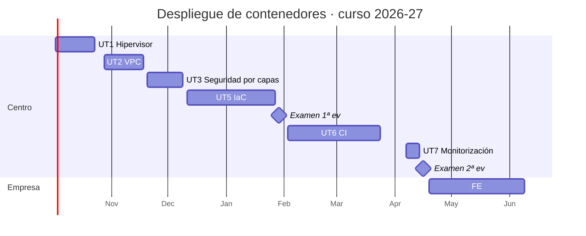

# Calendario de sesiones

Curso 2026-27 · Miércoles y viernes · 1 h 50 min por sesión · 45 sesiones (90 h) · Primera clase el 2 de octubre de 2026 · Formación en empresa del 19 de abril al 9 de junio de 2027

Las fechas están calculadas sobre el calendario escolar de Castelló 2026-27. La primera clase es el viernes 2 de octubre de 2026 y arranca con la presentación de la asignatura; la parte en el centro termina el 16 de abril de 2027, justo antes de la formación en empresa. No son lectivos el 9 y 12 de octubre, el 8 de diciembre, del 22 de diciembre al 7 de enero, del 1 al 5 de marzo (Magdalena), el 19 de marzo y la semana de Pascua (del 25 de marzo al 2 de abril). Si un día cae festivo por sorpresa, todo se corre una sesión.

Cada sesión dura 110 minutos y casi todas tienen la misma forma: una explicación corta al principio (entre 10 y 30 minutos, indicada en la columna de teoría) y el resto de laboratorio. Las sesiones marcadas como práctica no tienen explicación nueva. Las sesiones en **negrita** son evaluables.

## Vista de calendario

Cada día de clase lleva el color de su unidad. Al pasar el ratón por encima se ve qué se explica y qué se practica en esa sesión y qué se entrega; con un clic se va a esa sesión en los apuntes. Los días marcados con estrella son sesiones evaluables. Con el teclado, el tabulador recorre las sesiones y muestra el mismo detalle.

## Listado de sesiones

### Primera evaluación

| Nº | Fecha | UT | Sesión | Tipo | Se explica | Se practica |
|---:|-------|----|--------|------|------------|-------------|
| 1 | 2 oct | UT1 | Presentación e instalación del hipervisor | Teoría y práctica | Presentación del módulo, evaluación y laboratorio (20 min). Qué es virtualizar; hipervisores tipo 1 y 2; qué es Proxmox y por qué se usa (25 min). | Comprobar VT-x/AMD-V, crear la VM anidada e instalar Proxmox VE desde la ISO. Al final: consola web accesible en el puerto 8006. |
| 2 | 7 oct | UT1 | Configuración inicial de Proxmox | Teoría y práctica | Repositorios, almacenamiento (local, LVM-thin), bridges y realms de usuarios: qué es cada cosa y para qué sirve (25 min). | Cambiar repositorios y actualizar, crear usuario admin en realm pve, crear vmbr1 sin interfaz física, revisar los almacenes. |
| 3 | 14 oct | UT1 | Primera VM y plantilla | Teoría y práctica | cloud-init, plantillas y clon completo frente a enlazado (20 min). | Crear la plantilla 9000 desde la imagen cloud de Debian, clonar web01, app01 y mon01 (las dos últimas para Mantenimiento), acceder por SSH. |
| 4 | 16 oct | UT1 | VM vs LXC, snapshots y límites | Teoría y práctica | Cómo funcionan KVM/QEMU y virtio; LXC frente a VM; qué es un snapshot en LVM-thin y qué no es (25 min). | Crear un LXC y compararlo con la VM; snapshot, romper e instalar nginx, rollback; backup con vzdump. |
| 5 | 21 oct | UT1 | Redes en el hipervisor | Teoría y práctica | Bridge, VLAN-aware bridge, bond y NAT: qué resuelve cada uno (20 min). | vmbr1 VLAN aware, tres VM en dos VLAN, comprobar con ping quién ve a quién. Medir CPU, disco y red con stress-ng, fio e iperf3. |
| **6** | **23 oct** | **UT1** | **Práctica evaluable UT1** | Práctica evaluable | Aclaración del enunciado (10 min). | Desplegar app-eval desde la plantilla con los parámetros dados y redactar el informe de capacidades y limitaciones con medidas reales. |
| 7 | 28 oct | UT2 | Diseño de la VPC dev | Teoría y práctica | Qué es una VPC, CIDR y subnetting, RFC 1918, por qué /16 por entorno (25 min). | Diseñar en papel los tres entornos con tabla de direccionamiento propia (no copiar el ejemplo), justificar tamaños con ipcalc y comprobar que ningún bloque se solapa. |
| 8 | 30 oct | UT2 | Crear la VPC dev con SDN | Teoría y práctica | Zonas, VNets y subredes del SDN de Proxmox; DHCP e IPAM integrados (15 min). | Crear en SDN la zona lab y las cuatro VNets de dev con DHCP; conectar dos VM de zonas distintas y comprobar IP e IPAM. |
| 9 | 4 nov | UT2 | DHCP y DNS propios | Teoría y práctica | dnsmasq: rangos, reservas por MAC, registros y expand-hosts; por qué un router de entorno (20 min). | Sustituir el DHCP del SDN por la VM router con dnsmasq, reservar IP para web01 y db01, crear api.dev.lab y comprobar con dig. |
| 10 | 6 nov | UT2 | Comunicación entre zonas | Teoría y práctica | Enrutar frente a hacer NAT; ip_forward y nftables masquerade (15 min). | Activar el reenvío en el router, comprobar web01 a db01 con ping y nc, capturar el tráfico en el router con tcpdump. |
| 11 | 11 nov | UT2 | Segundo y tercer entorno; aislamiento | Práctica | Repaso de cinco minutos de cómo se prueba el aislamiento. | Replicar pre y pro, lanzar nmap -sn desde dev contra pre y pro, documentar cada prueba con la plantilla del apartado de pruebas. |
| 12 | 13 nov | UT2 | Automatizar con la CLI de Proxmox | Teoría y práctica | qm, pct y pvesh; la API REST con token como antesala del provider de OpenTofu (20 min). | Script que crea las tres VM de un entorno y otro que las destruye; ejecutar cada uno dos veces sin errores. |
| **13** | **18 nov** | **UT2** | **Práctica evaluable UT2** | Práctica evaluable | Aclaración del enunciado (10 min). | Cerrar la memoria: esquema, direccionamiento, configuración, scripts y las cinco pruebas documentadas. |
| 14 | 20 nov | UT3 | Modelo de seguridad por capas | Teoría y práctica | Defensa en profundidad, zonas y DMZ con uno y dos cortafuegos; cortafuegos con estado; qué es OPNsense (30 min). | Instalar OPNsense con cinco interfaces, una por VNet de dev, asignar .1 en cada zona, traspasarle el DHCP y el DNS de router-dev y acceder solo desde MGMT. |
| 15 | 25 nov | UT3 | Reglas por zona y publicación de un servicio | Teoría y práctica | Orden de evaluación de reglas, aliases, port forward y outbound NAT (25 min). | Comprobar que sin reglas nada pasa; nginx en web01; port forward WAN:443 y regla; curl desde el aula. |
| 16 | 27 nov | UT3 | DMZ interna y zona interna | Teoría y práctica | Patrón proxy inverso, aplicación, base de datos; terminación TLS y cabeceras (20 min). | app01 con API en 8080, db01 con PostgreSQL limitado a la subred back, reglas mínimas entre capas, nginx como proxy inverso; probar desde fuera. |
| 17 | 2 dic | UT3 | Separación de clientes | Teoría y práctica | Opciones de aislamiento multi-tenant y por qué se usa VLAN por cliente (15 min). | VLAN 101 y 102 sobre bridge VLAN aware, reglas que solo permiten llegar al proxy, comprobar que A no alcanza a B. |
| 18 | 4 dic | UT3 | Pruebas de seguridad | Práctica | Cómo leer open, closed y filtered en nmap (10 min). | Ejecutar la matriz de pruebas completa desde cada zona, capturar con tcpdump dos denegaciones y localizarlas en el log del firewall. |
| **19** | **9 dic** | **UT3** | **Práctica evaluable UT3** | Práctica evaluable | Aclaración del enunciado (10 min). | Cerrar el informe: diagrama, matriz de reglas justificada, matriz de pruebas, un hallazgo corregido y el procedimiento de reglas nuevas. |
| 20 | 11 dic | UT5 | IaC: conceptos y primer despliegue | Teoría y práctica | Qué es IaC, declarativo frente a imperativo, idempotencia, estado; OpenTofu y por qué existe (30 min). | Instalar OpenTofu, crear el token de terraform@pve, proyecto mínimo que clona la plantilla; init, plan, apply, plan otra vez, destroy. |
| 21 | 16 dic | UT5 | Requisitos y variables | Teoría y práctica | De los requisitos del servicio a variables tipadas con validación (20 min). | Rellenar la tabla de requisitos del servicio y escribir variables.tf con tipos, descripciones y validaciones. |
| 22 | 18 dic | UT5 | VM con OpenTofu | Teoría y práctica | El recurso VM del provider bpg/proxmox, for_each y cómo leer un plan (20 min). | Desplegar web01, app01 y db01 del entorno pre con cloud-init e IP fija; cambiar la memoria de app01 y comprobar que solo cambia ese recurso. |
| 23 | 8 ene | UT5 | Módulos y estado | Teoría y práctica | Módulos, estructura de repositorio por entornos y backend remoto con bloqueo (20 min). | Extraer el módulo vm, configurar el backend en MinIO, crear envs/dev y envs/pre. |
| 24 | 13 ene | UT5 | Ansible | Teoría y práctica | Inventario, playbooks, módulos idempotentes, roles y Vault (25 min). | Inventario desde tofu output, playbook que instala Docker y despliega el compose; ejecutarlo dos veces y capturar que la segunda no cambia nada. |
| 25 | 15 ene | UT5 | Pruebas del despliegue | Teoría y práctica | Niveles de prueba del IaC y qué es un smoke test (15 min). | Escribir test.sh que encadena apply, playbook, smoke tests y chequeo de recursos; romper algo a propósito y ver que devuelve error. |
| 26 | 20 ene | UT5 | Escaneo de seguridad | Teoría y práctica | Errores típicos del IaC; checkov, trivy config y gitleaks (15 min). | Ejecutar checkov, trivy config y gitleaks sobre el repositorio y tabular los hallazgos: id, severidad, fichero, descripción. |
| 27 | 22 ene | UT5 | Corrección de hallazgos | Teoría y práctica | Cómo se lee y se suprime un hallazgo; por qué el token no va en el código (10 min). | Corregir los hallazgos altos y críticos, justificar el resto, mover el token a variable de entorno e instalar pre-commit con gitleaks. |
| **28** | **27 ene** | **UT5** | **Práctica evaluable UT5** | Práctica evaluable | Aclaración del enunciado (10 min). | Cerrar el repositorio IaC: README, código modular con dos entornos, playbook, test.sh e informe de seguridad. |
| **29** | **29 ene** | **EX1** | **Examen 1ª evaluación** | Examen | Sin explicación nueva | Prueba teórico-práctica de UT1 a UT5 en el laboratorio. |

### Segunda evaluación

| Nº | Fecha | UT | Sesión | Tipo | Se explica | Se practica |
|---:|-------|----|--------|------|------------|-------------|
| 30 | 3 feb | UT6 | CI y elección del orquestador | Teoría y práctica | Integración, entrega y despliegue continuos; piezas de un sistema de CI; criterios para elegir orquestador (30 min). | Demo en 30 minutos de Jenkins y Gitea Actions con el mismo hola mundo; tabla comparativa y justificación de media página. |
| 31 | 5 feb | UT6 | Instalación segura | Teoría y práctica | Cómo se instala Jenkins en contenedor, TLS con CA propia, roles y hardening (20 min). | Desplegar Jenkins con TLS de la CA propia, roles admin/dev/lector, ejecutores del controlador a 0 y comprobar Agent → Controller Access Control. |
| 32 | 10 feb | UT6 | Plugins | Teoría y práctica | Qué plugins hacen falta y por qué JCasC (15 min). | Instalar los plugins con plugins.txt en una imagen propia, exportar la configuración a jenkins-config y comprobar que rearranca igual tras borrar el volumen. |
| 33 | 12 feb | UT6 | Agentes | Teoría y práctica | Controlador frente a agentes; tipos de agente y etiquetas (15 min). | VM agent01 como agente SSH, cloud Docker para agentes efímeros, un job en cada tipo y comprobar en el log dónde ha corrido. |
| 34 | 17 feb | UT6 | Proyecto y credenciales | Teoría y práctica | Tipos de proyecto, credenciales con ámbito, webhooks (15 min). | Usuario de servicio y token en Gitea, Multibranch Pipeline del servicio, webhook con secreto y primer disparo por push. |
| 35 | 19 feb | UT6 | Pipeline I: build y test | Teoría y práctica | Sintaxis del Jenkinsfile declarativo: agent, stages, steps, post (20 min). | Jenkinsfile con Checkout y Build & Test en agente Docker, informe JUnit, una prueba que falla y el estado UNSTABLE. |
| 36 | 24 feb | UT6 | Pipeline II: package | Teoría y práctica | Registry local con TLS y cómo confía Docker en una CA propia (15 min). | Levantar el registry, etapa Package que construye y sube la imagen con la etiqueta del commit, comprobar con pull y con la API. |
| 37 | 26 feb | UT6 | Parámetros, condiciones y paralelismo | Teoría y práctica | Parámetros, when, parallel y los estados de un pipeline (15 min). | Parámetros ENV y RUN_DEPLOY, etapa Lint en paralelo con Test, Package solo en main; comprobar en una rama feature/x que Package aparece saltada. |
| 38 | 10 mar | UT6 | Gestión de errores | Teoría y práctica | timeout, retry, catchError y cleanWs; notificación por Telegram o Slack (10 min). | Ejecutar los cinco casos del plan de pruebas de fallos y corregir lo que no se comporte; configurar la notificación por Telegram o Slack. |
| 39 | 12 mar | UT6 | Mínimo privilegio | Teoría y práctica | Usuarios de servicio, tokens con alcance, credenciales por carpeta (15 min). | Usuario jenkins@pve con token limitado, credenciales en carpetas dev y pre, comprobar que dev no ve las de pre, inventario de credenciales. |
| 40 | 17 mar | UT6 | Pipeline que despliega | Práctica | Repaso de cinco minutos de los tres caminos que hay que recorrer. | Etapa Deploy que ejecuta tofu, ansible y test.sh contra el entorno del parámetro; recorrer despliegue correcto, fallo en apply y fallo en smoke test. |
| **41** | **24 mar** | **UT6** | **Práctica evaluable UT6** | Práctica evaluable | Aclaración del enunciado (10 min). | Cerrar jenkins-config, el Jenkinsfile completo, el informe de pruebas del pipeline y el inventario de credenciales. |
| 42 | 7 abr | UT7 | Ingesta de métricas | Teoría y práctica | Métricas, logs y trazas; modelo pull; exporters; comparativa de gestores de ingesta (30 min). | Pila Prometheus, Alertmanager y Grafana en mon01; node_exporter, cAdvisor y el plugin de Jenkins; todos los targets en UP y las siete consultas PromQL. |
| 43 | 9 abr | UT7 | Visualización y alertas | Teoría y práctica | Repaso de PromQL, reglas, Alertmanager, Grafana y KPI, que ya se dieron en Mantenimiento (10 min). Métricas del propio orquestador: Jenkins en Prometheus (15 min). | Panel propio con cinco KPI, dashboard 1860, dos alertas y envío por correo; provocar HostDown y ver la notificación y la resolución. |
| **44** | **14 abr** | **UT7** | **Práctica evaluable UT7** | Práctica evaluable | Seguridad de la monitorización y aclaración del enunciado (15 min). | Cortafuegos que reserva los exporters a mon01, Grafana tras nginx con TLS y entrega del repositorio monitoring sin secretos. |
| **45** | **16 abr** | **EX2** | **Examen 2ª evaluación** | Examen | Sin explicación nueva | Prueba teórico-práctica de UT6 y UT7. Cierre de entregas antes de la formación en empresa. |

## Formación en empresa (19 abr a 9 jun 2027)

| UT | Título | Horas | Evidencias |
|----|--------|------:|------------|
| UT4 | Nube pública: consola, CLI y SDK | 12 | Ficha de evidencias A4.1 a A4.5 y documento de cierre |
| UT7b | Monitorización avanzada: alertas, KPI y seguridad | 12 | Reglas de alerta, panel de KPI, informe de seguridad de la pila |
| UT8 | Proyecto integrador y puesta en producción | 6 | Memoria del despliegue realizado en la empresa |

