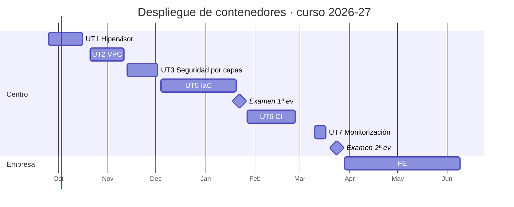

# Calendario de sesiones

Curso 2026-27 · Miércoles y viernes · 2 h por sesión · 43 sesiones (86 h) · Presentación el 25 de septiembre de 2026 · Formación en empresa del 29 de marzo al 9 de junio de 2027

Las fechas están calculadas sobre el calendario escolar de Castelló 2026-27. La presentación del curso es el viernes 25 de septiembre de 2026; las clases empiezan la semana del 28 de septiembre y la parte en el centro termina el 24 de marzo de 2027, justo antes de la formación en empresa. No son lectivos el 9 y 12 de octubre, el 8 de diciembre, del 22 de diciembre al 7 de enero, del 1 al 5 de marzo (Magdalena) y el 19 de marzo. Si un día cae festivo por sorpresa, todo se corre una sesión.

Las sesiones en **negrita** son evaluables.

## Vista de calendario

Cada día de clase lleva el color de su unidad. Pasa el ratón por encima para ver qué se hace en esa sesión y qué se entrega; haz clic para ir a la actividad correspondiente en los apuntes. Los días marcados con estrella son sesiones evaluables. Con el teclado, el tabulador recorre las sesiones y muestra el mismo detalle.

## Listado de sesiones

### Primera evaluación

| Nº | Fecha | UT | Sesión | Qué se hace |
|---:|-------|----|--------|-------------|
| 1 | 25 sep | UT1 | Presentación e instalación del hipervisor | Presentación del módulo, evaluación y laboratorio. Hipervisores tipo 1 y 2. Instalación de Proxmox VE en VM anidada. |
| 2 | 30 sep | UT1 | Configuración inicial de Proxmox | Bridge vmbr0, almacenamiento, usuarios y roles, consola web, repositorios. |
| 3 | 2 oct | UT1 | Primera VM y plantilla | VM Debian con cloud-init, conversión a plantilla, clonado linked/full, acceso SSH. |
| 4 | 7 oct | UT1 | VM vs LXC, snapshots y límites | LXC frente a VM. Snapshots y rollback. Anidada, flags de CPU, ballooning, cuotas. |
| 5 | 14 oct | UT1 | Redes en el hipervisor | NAT, bridge, VLAN-aware bridge y bonding. Dos VM en VLAN distintas. |
| **6** | **16 oct** | **UT1** | **Práctica evaluable UT1** | VM desde plantilla con parámetros dados e informe de capacidades y limitaciones. |
| 7 | 21 oct | UT2 | Diseño de la VPC | VPC, subred, zona de disponibilidad, DNS interno. Diseño de dev, pre y pro en papel. |
| 8 | 23 oct | UT2 | Proxmox SDN: zonas y VNets | Activar SDN, crear zona y VNets para dev. Conectar VM. |
| 9 | 28 oct | UT2 | IP, DHCP y DNS interno | VM router con dnsmasq: rangos, reservas, nombres. |
| 10 | 30 oct | UT2 | Comunicación entre zonas | Enrutado front a back dentro de dev. Conectividad y trazas. |
| 11 | 4 nov | UT2 | Segundo y tercer entorno; aislamiento | Replicar pre y pro. Comprobar con ping y nmap que no se ven. |
| 12 | 6 nov | UT2 | Automatizar con la CLI de Proxmox | qm, pct y pvesh por script. Antesala del IaC. |
| **13** | **11 nov** | **UT2** | **Práctica evaluable UT2** | Tres VPC documentadas: esquema, direccionamiento, scripts, evidencias de aislamiento. |
| 14 | 13 nov | UT3 | Modelo de seguridad por capas | DMZ externa, DMZ interna y zona interna. OPNsense entre las zonas. |
| 15 | 18 nov | UT3 | Reglas por zona y publicación de un servicio | Política deny por defecto; web en DMZ externa con port forward. |
| 16 | 20 nov | UT3 | DMZ interna y zona interna | API en DMZ interna, BD en zona interna, reglas mínimas, registro de tráfico. |
| 17 | 25 nov | UT3 | Separación de clientes | Dos clientes en VLAN distintas con reglas propias. |
| 18 | 27 nov | UT3 | Pruebas de seguridad | nmap y tcpdump desde cada zona; matriz origen/destino/puerto. |
| **19** | **2 dic** | **UT3** | **Práctica evaluable UT3** | Informe con matriz de reglas, pruebas de aislamiento y separación de clientes. |
| 20 | 4 dic | UT5 | IaC: conceptos y primer despliegue | Estado, idempotencia, declarativo frente a imperativo. OpenTofu con provider Proxmox. |
| 21 | 9 dic | UT5 | Requisitos del servicio | De los requisitos (cómputo, memoria, disco, red) a variables.tf y tfvars. |
| 22 | 11 dic | UT5 | VM con Terraform | Clonar plantilla con cloud-init desde código; outputs con IP; destroy y recreate. |
| 23 | 16 dic | UT5 | Módulos y estado | Módulo reutilizable; backend de estado compartido; entornos dev/pre/pro. |
| 24 | 18 dic | UT5 | Ansible: configuración post-despliegue | Inventario desde outputs; playbook que instala Docker y despliega el servicio. |
| 25 | 8 ene | UT5 | Pruebas del despliegue | Terraform + Ansible encadenados; smoke tests y chequeo de configuración. |
| 26 | 13 ene | UT5 | Seguridad del IaC | checkov, tfsec, trivy config; secretos fuera del código. |
| 27 | 15 ene | UT5 | Corrección de hallazgos | Corregir el escaneo, documentar lo aplicado y lo que no. |
| **28** | **20 ene** | **UT5** | **Práctica evaluable UT5** | Repositorio IaC que levanta VPC + VM + servicio, con pruebas y escaneo limpio. |
| **29** | **22 ene** | **EX1** | **Examen 1ª evaluación** | Prueba teórico-práctica de UT1 a UT5 en el laboratorio. |

### Segunda evaluación

| Nº | Fecha | UT | Sesión | Qué se hace |
|---:|-------|----|--------|-------------|
| 30 | 27 ene | UT6 | CI y elección del orquestador | Conceptos CI/CD. Comparativa Jenkins, GitLab CI, Gitea Actions. Justificar la elección. |
| 31 | 29 ene | UT6 | Instalar el orquestador y plugins | Jenkins en contenedor; TLS con certificado propio; usuarios, roles y permisos. Plugins: Git, Docker Pipeline, Credentials, Pipeline; configuración global. |
| 32 | 3 feb | UT6 | Agentes | Agente Docker; etiquetas; ejecutar en el agente y no en el controlador. |
| 33 | 5 feb | UT6 | Proyecto y credenciales | Proyecto, token de acceso al repositorio, primer job. |
| 34 | 10 feb | UT6 | Pipeline declarativo I | Jenkinsfile: checkout, build y test. |
| 35 | 12 feb | UT6 | Pipeline declarativo II | Package (imagen Docker) y push a registry local. Artefactos. |
| 36 | 17 feb | UT6 | Tareas, condiciones y gestión de errores | Parámetros, when, paralelismo, webhooks. post, retry, timeout, notificaciones; provocar fallos y verificar. |
| 37 | 19 feb | UT6 | Mínimo privilegio | Usuario de servicio, tokens limitados, secretos en el orquestador. |
| 38 | 24 feb | UT6 | Pipeline que despliega | Etapa deploy con el IaC de la UT5 contra dev. Recorrer todos los caminos. |
| **39** | **26 feb** | **UT6** | **Práctica evaluable UT6** | Pipeline build → test → package → deploy con caminos de error probados. |
| 40 | 10 mar | UT7 | Ingesta de métricas | Prometheus, node_exporter y cAdvisor en compose; scrape del servicio y del orquestador. |
| 41 | 12 mar | UT7 | Visualización y alertas | Grafana: fuente de datos, panel con cinco KPI, una alerta con envío. |
| **42** | **17 mar** | **UT7** | **Práctica evaluable UT7** | Asegurar la monitorización y entregar panel y alerta funcionando. |
| **43** | **24 mar** | **EX2** | **Examen 2ª evaluación** | Prueba teórico-práctica de UT6 y UT7. Cierre de entregas antes de la FE. |

## Formación en empresa (29 mar a 9 jun 2027)

| UT | Título | Horas | Evidencias |
|----|--------|------:|------------|
| UT4 | Nube pública: consola, CLI y SDK | 12 | Ficha de evidencias A4.1 a A4.5 y documento de cierre |
| UT7b | Monitorización avanzada: alertas, KPI y seguridad | 12 | Reglas de alerta, panel de KPI, informe de seguridad de la pila |
| UT8 | Proyecto integrador y puesta en producción | 6 | Memoria del despliegue realizado en la empresa |

