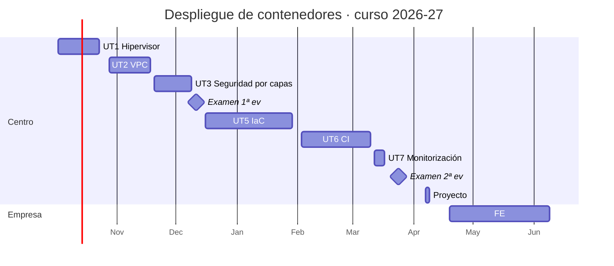

# Calendario de sesiones

Curso 2026-27 · Miércoles y viernes · 1 h 50 min por sesión · 43 sesiones (86 h) · Primera clase el 2 de octubre de 2026, examen de la 2ª evaluación el 24 de marzo y última clase el 9 de abril de 2027 · Formación en empresa del 19 de abril al 9 de junio de 2027

Las fechas están calculadas sobre el calendario escolar de Castelló 2026-27. La primera clase es el viernes 2 de octubre de 2026 y arranca con la presentación de la asignatura. **La teoría y los exámenes terminan antes de Pascua**: la última sesión con explicación es la 40 (17 de marzo) y el examen de la 2ª evaluación es el 24 de marzo. Las dos sesiones posteriores a Pascua (7 y 9 de abril) se dedican al [proyecto entre asignaturas](#proyecto-entre-asignaturas), y el 9 de abril termina la parte en el centro, justo antes de la formación en empresa. No son lectivos el 9 y 12 de octubre, el 8 de diciembre, del 22 de diciembre al 7 de enero, del 1 al 5 de marzo (Magdalena), el 19 de marzo y la semana de Pascua (del 25 de marzo al 2 de abril); la semana del 12 al 16 de abril tampoco tiene clase, porque el curso en el centro cierra el 9. Si un día cae festivo por sorpresa, todo se corre una sesión.

Cada sesión dura 110 minutos y casi todas tienen la misma forma: una explicación corta al principio (entre 10 y 30 minutos, indicada en la columna de teoría) y el resto de laboratorio. Las sesiones marcadas como práctica no tienen explicación nueva. Las sesiones en **negrita** son evaluables. La práctica evaluable de la UT7 no tiene sesión propia: es una entrega que se cierra en la sesión 40 y se sube por Aules antes del examen del 24 de marzo.

## Vista de calendario

Cada día de clase lleva el color de su unidad. Al pasar el ratón por encima se ve qué se explica y qué se practica en esa sesión y qué se entrega; con un clic se va a esa sesión en los apuntes. Los días marcados con estrella son sesiones evaluables. Con el teclado, el tabulador recorre las sesiones y muestra el mismo detalle.

## Listado de sesiones

### Primera evaluación

| Nº | Fecha | UT | Sesión | Tipo | Se explica | Se practica |
|---:|-------|----|--------|------|------------|-------------|
| 1 | 2 oct | UT1 | Presentación e instalación del hipervisor | Teoría y práctica | Presentación del módulo, evaluación y laboratorio (20 min). Qué es virtualizar; hipervisores tipo 1 y 2; qué es Proxmox y por qué se usa (25 min). | Comprobar VT-x/AMD-V, crear la VM anidada e instalar Proxmox VE desde la ISO. Al final: consola web accesible en el puerto 8006. |
| 2 | 7 oct | UT1 | Configuración inicial de Proxmox | Teoría y práctica | Repositorios, almacenamiento (local, LVM-thin), bridges y realms de usuarios: qué es cada cosa y para qué sirve (25 min). | Cambiar repositorios y actualizar, crear usuario admin en realm pve, crear vmbr1 sin interfaz física, revisar los almacenes y dejar descargada la imagen cloud de la sesión 3. |
| 3 | 14 oct | UT1 | Primera VM y plantilla | Teoría y práctica | cloud-init, plantillas y clon completo frente a enlazado (20 min). | Crear la plantilla 9000 desde la imagen cloud de Debian con el agente QEMU y node_exporter dentro y las claves SSH del puesto y del nodo, clonar web01, app01 y mon01 (las dos últimas, con Docker, para Mantenimiento) y entrar por SSH desde el puesto. |
| 4 | 16 oct | UT1 | VM vs LXC, snapshots y límites | Teoría y práctica | Cómo funcionan KVM/QEMU y virtio; LXC frente a VM; qué es un snapshot en LVM-thin y qué no es (25 min). | Crear un LXC y compararlo con la VM; snapshot, romper e instalar nginx, rollback; backup con vzdump. |
| 5 | 21 oct | UT1 | Redes en el hipervisor | Teoría y práctica | Bridge, VLAN-aware bridge, bond y NAT: qué resuelve cada uno (20 min). | vmbr1 VLAN aware, tres clones enlazados en dos VLAN (uno con ballooning y puerta de enlace), comprobar con ping quién ve a quién. Medir CPU, disco y red con stress-ng, fio e iperf3. |
| **6** | **23 oct** | **UT1** | **Práctica evaluable UT1** | Práctica evaluable | Aclaración del enunciado (10 min). | Desplegar app-eval desde la plantilla con los parámetros dados y redactar el informe de capacidades y limitaciones con las medidas tomadas en las hojas. |
| 7 | 28 oct | UT2 | Diseño de la VPC dev | Teoría y práctica | Qué es una VPC, CIDR y subnetting, RFC 1918, por qué /16 por entorno (25 min). | Diseñar en papel los tres entornos con tabla de direccionamiento propia (no copiar el ejemplo), justificar tamaños con ipcalc, comprobar que ningún bloque se solapa y crear el repositorio de entregas. |
| 8 | 30 oct | UT2 | Crear la VPC dev con SDN | Teoría y práctica | Zonas, VNets y subredes del SDN de Proxmox; DHCP e IPAM integrados (15 min). | Crear en SDN la zona lab y las cuatro VNets de dev con DHCP; conectar dos VM de zonas distintas y comprobar IP e IPAM. |
| 9 | 4 nov | UT2 | DHCP y DNS propios | Teoría y práctica | Por qué un router de entorno; enrutar frente a hacer NAT; dnsmasq: rangos, reservas por MAC, registros y expand-hosts (20 min). | Sustituir el DHCP del SDN por la VM router con dnsmasq, reservar IP para web01 y db01, crear api.dev.lab y comprobar con dig. |
| 10 | 6 nov | UT2 | Comunicación entre zonas | Teoría y práctica | Cómo se prueba una red: qué demuestran ping, traceroute, dig, nmap y tcpdump, cómo se leen y la plantilla de pruebas (15 min). | Crear el puesto de administración en la subred de gestión, activar el reenvío en el router, comprobar web01 a db01 con ping y nc, capturar el tráfico en el router con tcpdump. |
| 11 | 11 nov | UT2 | Segundo y tercer entorno; aislamiento | Práctica | Aislamiento por construcción y rutas blackhole (5 min). | Montar pre como dev y la red de pro, poner las rutas blackhole, probar desde dev con nmap, ping y traceroute que no se llega a pre ni a pro y documentarlo con la plantilla de pruebas. |
| 12 | 13 nov | UT2 | Automatizar con la CLI de Proxmox | Teoría y práctica | qm, pct y pvesh; la API REST con token como antesala del provider de OpenTofu (20 min). | Script que crea la red y las tres VM de un entorno y otro que las destruye, ejecutados dos veces sin errores; una lectura y una creación con curl y el token de un usuario de prácticas. |
| **13** | **18 nov** | **UT2** | **Práctica evaluable UT2** | Práctica evaluable | Aclaración del enunciado (10 min). | Cerrar la memoria: esquema, direccionamiento, configuración, scripts y las cinco pruebas documentadas. |
| 14 | 20 nov | UT3 | Modelo de seguridad por capas | Teoría y práctica | Defensa en profundidad y zonas (10 min); DMZ con uno y con dos cortafuegos (5 min); cortafuegos con estado (10 min). | Configurar el OPNsense que se trae instalado de casa: sus cinco interfaces con el .1 de cada zona, el DHCP y el DNS de router-dev traspasados, la regla 0 de todas las zonas y la consola accesible solo desde MGMT. |
| 15 | 25 nov | UT3 | Reglas por zona y publicación de un servicio | Teoría y práctica | Aliases (5 min); reglas y orden de evaluación (5 min); port forward y outbound NAT (5 min); la CA del curso con openssl ca y certificados con SAN (10 min). | Comprobar que sin reglas nada pasa; crear la CA del curso y el certificado del proxy; nginx en web01; reglas de gestión, port forward WAN:443 y curl desde el aula. |
| 16 | 27 nov | UT3 | DMZ interna y zona interna | Teoría y práctica | Patrón proxy inverso, aplicación y base de datos; terminación TLS y cabeceras (10 min); matriz de reglas y procedimiento de cambios (5 min). | app01 y mon01 a la VPC y el disco /data de db01, preparados antes de clase; en db01, la base servicio y postgres_exporter; la API contra db01; reglas mínimas entre capas y nginx como proxy inverso de la API; probar desde fuera. |
| 17 | 2 dic | UT3 | Separación de clientes | Teoría y práctica | Opciones de aislamiento multi-tenant y por qué se usa una VLAN por cliente (15 min). | Dos clientes en las VLAN 101 y 102 sobre el bridge VLAN aware, reglas que solo les dejan llegar al proxy, comprobar que A no alcanza a B. |
| 18 | 4 dic | UT3 | Pruebas de seguridad | Práctica | Repaso de nmap y tcpdump de la sesión 10; lo nuevo: filtered frente a closed detrás del cortafuegos, captura en las dos interfaces y la matriz de pruebas (10 min). | Ejecutar la matriz de pruebas desde cada zona, capturar con tcpdump dos denegaciones y localizarlas en el log, tramitar un hallazgo con el procedimiento de cambios y dejar hecho el diagrama de zonas. |
| **19** | **9 dic** | **UT3** | **Práctica evaluable UT3** | Práctica evaluable | Aclaración del enunciado (10 min). | Cerrar el informe: diagrama, matriz de reglas justificada, matriz de pruebas, un hallazgo corregido y el procedimiento de reglas nuevas; al entregar, destruir router-dev y los dos clientes. |
| **20** | **11 dic** | **EX1** | **Examen 1ª evaluación** | Examen | Sin explicación nueva | Prueba teórico-práctica de UT1 a UT3 en el laboratorio. |

### Segunda evaluación

| Nº | Fecha | UT | Sesión | Tipo | Se explica | Se practica |
|---:|-------|----|--------|------|------------|-------------|
| 21 | 16 dic | UT5 | IaC: conceptos y primer despliegue | Teoría y práctica | Qué es IaC, declarativo frente a imperativo e idempotencia (15 min); OpenTofu, el ciclo init, plan, apply, cómo leer un plan y el proyecto mínimo (15 min). | En el puesto de administración: instalar OpenTofu, crear terraform@pve con su token, iniciar iac-lab con su remoto en Gitea y un proyecto mínimo que clona la plantilla; init, plan, apply, plan otra vez, destroy. |
| 22 | 18 dic | UT5 | Requisitos y variables | Teoría y práctica | De los requisitos del servicio a variables tipadas con validación (15 min). | Montar MinIO en mon01 para el estado y las copias; rellenar la tabla de requisitos del servicio y escribir variables.tf con tipos, descripciones y validaciones. |
| 23 | 8 ene | UT5 | VM con OpenTofu | Teoría y práctica | El lenguaje HCL: tipos, for_each y funciones (10 min); el provider bpg/proxmox con una VM completa y el camino de gestión a pre (10 min). | Abrir el camino de gestión a pre por router-pre; desplegar web01, app01 y db01 de pre con cloud-init, IP fija y prevent_destroy; comprobar en el plan que cambiar la memoria de app01 solo toca ese recurso. |
| 24 | 13 ene | UT5 | Módulos y estado | Teoría y práctica | Módulos y estructura del repositorio por entornos (5 min); el estado, el backend remoto en MinIO con bloqueo y cómo mover recursos (15 min). | Extraer el módulo vm, configurar el backend en MinIO, crear envs/dev y envs/pre. |
| 25 | 15 ene | UT5 | Ansible | Teoría y práctica | Inventario, playbooks, módulos idempotentes, roles y Vault (25 min). | Inventario desde tofu output, playbook que deja PostgreSQL en db01 y el servicio en app01 de pre; ejecutarlo dos veces y capturar que la segunda no cambia nada. |
| 26 | 20 ene | UT5 | Pruebas del despliegue | Teoría y práctica | Niveles de prueba del IaC, smoke tests y el test.sh de la unidad (15 min). | Poner en marcha test.sh, que encadena apply, playbook, smoke tests y chequeo de configuración; bajar la vCPU de db01 y parar el servicio para ver que devuelve error. |
| 27 | 22 ene | UT5 | Escaneo de seguridad | Teoría y práctica | Errores típicos del IaC; checkov, trivy config y gitleaks; cómo leer y suprimir un hallazgo (15 min). | Ejecutar checkov, trivy config y gitleaks sobre el repositorio, clasificar los hallazgos, comprobar con fallos provocados que los escáneres los ven, y tabularlos con su riesgo y la corrección prevista. |
| 28 | 27 ene | UT5 | Corrección de hallazgos | Teoría y práctica | Dónde viven los secretos (entorno, Ansible Vault, sops, Vault); qué hacer cuando gitleaks encuentra uno; .gitignore y pre-commit (10 min). | Corregir los hallazgos altos y críticos, justificar el resto, rotar el token si gitleaks lo encuentra en el historial e instalar pre-commit con gitleaks. |
| **29** | **29 ene** | **UT5** | **Práctica evaluable UT5** | Práctica evaluable | Aclaración del enunciado (10 min). | Cerrar el repositorio IaC: README, código modular con dos entornos, playbook, test.sh e informe de seguridad. |
| 30 | 3 feb | UT6 | CI y elección del orquestador | Teoría y práctica | Integración, entrega y despliegue continuos; piezas de un sistema de CI; criterios para elegir orquestador (30 min). | Demo en 30 minutos de Jenkins y Gitea Actions con el mismo hola mundo; tabla comparativa y justificación de media página. |
| 31 | 5 feb | UT6 | Instalación segura y plugins | Teoría y práctica | Cómo se instala Jenkins en contenedor, TLS con CA propia, roles y hardening (15 min); qué plugins hacen falta y por qué JCasC (10 min). | Desplegar Jenkins con TLS de la CA propia, roles admin/dev/lector y ejecutores del controlador a 0; revisar tres plugins antes de instalarlos, fijar las versiones en plugins.txt y dejar imagen, YAML y README en jenkins-config. |
| 32 | 10 feb | UT6 | Agentes | Teoría y práctica | Controlador frente a agentes; tipos de agente y etiquetas (15 min). | VM agent01 como agente SSH, cloud Docker para agentes efímeros, un job en cada tipo y comprobar en el log dónde ha corrido. |
| 33 | 12 feb | UT6 | Proyecto y credenciales | Teoría y práctica | Tipos de proyecto, credenciales con ámbito, webhooks (15 min). | Mudar Gitea a gitea01, usuario de servicio y token, Multibranch Pipeline del servicio, webhook con secreto y primer disparo por push. |
| 34 | 17 feb | UT6 | Pipeline I: build y test | Teoría y práctica | Sintaxis del Jenkinsfile declarativo: agent, stages, steps, post (20 min). | Jenkinsfile con Checkout y Build & Test en agente Docker, Dockerfile del servicio construido y probado a mano, informe JUnit, comprobación de stash y de options, una prueba que falla y el estado UNSTABLE. |
| 35 | 19 feb | UT6 | Pipeline II: package y ejecución condicional | Teoría y práctica | Registry local con TLS y cómo confía Docker en una CA propia (10 min); when, parallel, matrix e input (15 min). | Levantar el registry, etapa Package que sube la imagen etiquetada con el commit, parámetros ENV y RUN_DEPLOY usados de verdad, Lint en paralelo con Test, Package solo en main y Deploy provisional; recorrer la tabla de verdad de las cuatro combinaciones. |
| 36 | 24 feb | UT6 | Gestión de errores | Teoría y práctica | timeout, retry, catchError y cleanWs; notificación por Telegram o Slack (10 min). | Ejecutar uno a uno los cinco casos del plan de pruebas de fallos con su ficha de evidencias, corregir lo que no se comporte y repetirlo; configurar la notificación por Telegram o Slack. |
| 37 | 26 feb | UT6 | Mínimo privilegio y despliegue | Teoría y práctica | Usuarios de servicio, tokens con alcance y credenciales por carpeta (10 min); el despliegue a pre desde un job con su propia credencial (10 min). | Credencial ssh-pre solo en la carpeta pre y comprobar que un job de dev no la ve; inventario de credenciales; etapa Deploy que lleva la imagen a app01 de pre, ejecuta el playbook y test.sh, y recorrer sus dos caminos: despliegue correcto y fallo en el smoke test. |
| **38** | **10 mar** | **UT6** | **Práctica evaluable UT6** | Práctica evaluable | Aclaración del enunciado (10 min). | Cerrar jenkins-config, el Jenkinsfile completo, el informe de pruebas del pipeline y el inventario de credenciales, con las evidencias del 26 de febrero y sin desplegar. |
| 39 | 12 mar | UT7 | Ingesta de métricas | Teoría y práctica | Métricas, logs y trazas (5 min); elegir el gestor de ingesta y el modelo pull (5 min); la pila del curso en mon01 y lo que le añade la unidad (10 min). | Targets de node_exporter generados con Ansible desde el inventario, plugin de Jenkins con su versión y su job; todos los targets de dev en UP, una consulta por fuente y la justificación del gestor de ingesta. |
| 40 | 17 mar | UT7 | Visualización, alertas y seguridad | Teoría y práctica | Métricas del orquestador de CI (10 min); seguridad de lo que añade la unidad (10 min). El repaso de PromQL, reglas, Alertmanager y Grafana se lee antes de clase. | Panel de KPI de la plataforma con tres paneles en Git, reglas propias y la alerta JenkinsDown en Mailpit; métricas de Jenkins solo para mon01, comprobación de lo que dejó Mantenimiento y repositorio sin secretos con su etiqueta de entrega. |
| **41** | **24 mar** | **EX2** | **Examen 2ª evaluación** | Examen | Sin explicación nueva | Prueba teórico-práctica de UT5 a UT7 en el laboratorio. |

### Proyecto entre asignaturas

Las dos sesiones que quedan después de Pascua se dedican a un proyecto conjunto con el resto de asignaturas del curso, que se plantea aparte. No tienen explicación nueva ni hoja en ninguna unidad.

| Nº | Fecha | UT | Sesión | Tipo | Se explica | Se practica |
|---:|-------|----|--------|------|------------|-------------|
| 42 | 7 abr | PRO | Proyecto entre asignaturas | Proyecto | Sin explicación nueva | Trabajo en el proyecto conjunto con el resto de asignaturas del curso, que se plantea aparte. |
| 43 | 9 abr | PRO | Proyecto entre asignaturas | Proyecto | Sin explicación nueva | Trabajo en el proyecto conjunto con el resto de asignaturas del curso, que se plantea aparte. |

## Formación en empresa (19 abr a 9 jun 2027)

| UT | Título | Horas | Evidencias |
|----|--------|------:|------------|
| UT4 | Nube pública: consola, CLI y SDK | 12 | Ficha de evidencias A4.1 a A4.5 y documento de cierre |
| UT7b | Monitorización avanzada: alertas, KPI y seguridad | 12 | Esquema de la pila de monitorización de la empresa, árbol de rutas de alertas comentado, dashboard de KPI de negocio, un SLO con su error budget y su alerta, y medidas de seguridad de la pila con una propuesta de mejora ([detalle](ampliacion.md#en-la-empresa-monitorizacion-avanzada)) |
| UT8 | Proyecto integrador y puesta en producción | 6 | Memoria del despliegue realizado en la empresa |

```mermaid
gantt
    title Despliegue de contenedores · curso 2026-27
    dateFormat  YYYY-MM-DD
    axisFormat  %b
    section Centro
    UT1 Hipervisor            :2026-10-02, 2026-10-23
    UT2 VPC                   :2026-10-28, 2026-11-18
    UT3 Seguridad por capas   :2026-11-20, 2026-12-09
    Examen 1ª ev              :milestone, 2026-12-11, 0d
    UT5 IaC                   :2026-12-16, 2027-01-29
    UT6 CI                    :2027-02-03, 2027-03-10
    UT7 Monitorización        :2027-03-12, 2027-03-17
    Examen 2ª ev              :milestone, 2027-03-24, 0d
    Proyecto                  :2027-04-07, 2027-04-09
    section Empresa
    FE                        :2027-04-19, 2027-06-09
```
