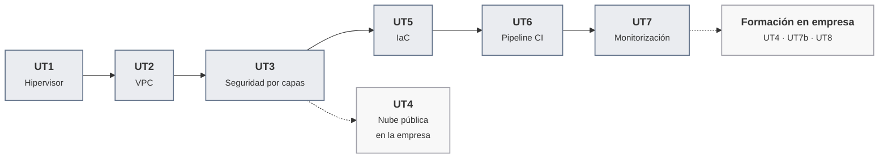

# Despliegue de plataformas de contenedores

Apuntes de la asignatura · Curso de especialización · 120 h (90 en el centro, 30 en empresa) · Curso 2026-27

Aquí están los apuntes de toda la asignatura, unidad por unidad, con las actividades de cada sesión y las prácticas evaluables. Es el mismo material que se trabaja en clase, ampliado con lo que no cabe en dos horas y con enlaces a la documentación oficial para no quedarse en lo que se explica en clase. La asignatura hermana, [Mantenimiento del sistema de contenedores](https://victor-educ.github.io/apuntes-5169/), tiene su propio sitio con la misma estructura.

## De qué va la asignatura

Un contenedor no corre en el aire. Debajo hay una máquina virtual, debajo de la máquina virtual un hipervisor, alrededor una red con subredes y cortafuegos, y por encima algo que decide cuándo se despliega una versión nueva y avisa si ha ido mal. Esta asignatura se ocupa de todo eso: de la plataforma sobre la que se ejecutan los contenedores, no de los contenedores en sí. Todo eso se monta desde cero, pieza a pieza, hasta llegar a un entorno completo que se despliega solo.

Estos son los conceptos que vertebran el curso, en el orden en que aparecen:

- **Virtualización.** Qué hace un hipervisor, cómo KVM reparte CPU, memoria y disco entre máquinas virtuales, y cómo se crea una VM en veinte segundos a partir de una plantilla con cloud-init. Se trabaja con Proxmox VE.
- **Redes privadas virtuales.** Diseñar el direccionamiento de varios entornos (dev, pre, pro) que no se solapen ni se vean entre sí, con sus subredes por capa, su router, su DHCP y su DNS interno.
- **Seguridad por capas.** DMZ externa, DMZ interna y zona interna separadas por un cortafuegos con política de denegar por defecto, un proxy inverso que publica el servicio y pruebas que demuestran que el aislamiento funciona.
- **Nube pública.** La misma infraestructura alquilada por horas: consola, línea de comandos y SDK de AWS, Azure o Google Cloud. Se trabaja en la empresa.
- **Infraestructura como código.** Todo lo anterior escrito en ficheros que OpenTofu y Ansible aplican de forma reproducible, versionado en Git, probado y escaneado en busca de errores de seguridad.
- **Integración continua.** Un orquestador (Jenkins) que, con cada cambio en el repositorio, construye, prueba, empaqueta y despliega el servicio, con gestión de errores y mínimo privilegio.
- **Monitorización.** Prometheus recogiendo métricas de hosts, contenedores y del propio orquestador, Grafana mostrándolas y una alerta que llega al móvil cuando algo se cae.

Cada unidad se apoya en la anterior. Las de trazo discontinuo se cursan en la empresa.

Cada unidad se apoya en la anterior: la red de la UT2 es donde la UT3 pone el cortafuegos, la UT5 recrea esa red desde código y la UT6 ejecuta ese código desde un pipeline. No conviene saltarse ninguna.

## Qué hay en esta web

-   :material-book-open-page-variant: **[Unidades](ut/ut1-virtualizacion.md)**

    ---

    Los apuntes de las siete unidades. Cada una empieza con una introducción (qué hay que saber hacer al terminar, los conceptos y herramientas que aparecen, el plan de sesiones) y sigue con las sesiones en orden: en cada una, la teoría que se explica ese día y, a continuación, su hoja de práctica. La práctica evaluable cierra la unidad con su rúbrica.

-   :material-calendar-month: **[Calendario de sesiones](calendario.md)**

    ---

    Las 45 sesiones del curso con fecha, unidad y lo que se hace en cada una. La vista de calendario muestra el detalle al pasar el ratón y lleva a la actividad con un clic. Incluye festivos y el periodo de formación en empresa.

-   :material-school: **[Presentación y evaluación](modulo.md)**

    ---

    Resultados de aprendizaje y criterios de evaluación con la unidad donde se trabaja cada uno, cómo se calcula la nota, las herramientas de la asignatura y la metodología de las sesiones.

-   :material-flask: **[Laboratorio](laboratorio.md)**

    ---

    Cómo queda el entorno que se construye durante el curso, requisitos de cada puesto, convenciones de nombres y direcciones, repositorios que hay que crear y qué hacer cuando algo se rompe.

-   :material-console: **[Chuleta de comandos](chuleta.md)**

    ---

    Lo que se teclea una y otra vez: Proxmox, red y diagnóstico, OpenTofu, Ansible, escáneres de seguridad, Docker, certificados, Jenkins, Prometheus y Git.

-   :material-book-alphabet: **[Glosario](glosario.md)**

    ---

    Los términos de la asignatura en una o dos frases, con la unidad donde se explican a fondo. Para cuando un término suene pero no se sitúe.

-   :material-book-plus: **[Para ampliar](ampliacion.md)**

    ---

    Los apartados de cada unidad que van más allá de lo que se hace en clase y los enlaces para seguir por cuenta propia, ordenados por unidad.

-   :material-link-variant: **[Bibliografía y enlaces](recursos.md)**

    ---

    Documentación oficial de cada herramienta, libros que merecen la pena, sitios donde practicar fuera del aula y los créditos de las imágenes.

-   :material-wrench-cog: **[Mantenimiento del sistema de contenedores](https://victor-educ.github.io/apuntes-5169/)**

    ---

    La asignatura hermana, que se cursa a la vez los martes y jueves. Sobre el laboratorio que se monta aquí, allí se vigila, se prueba, se actualiza, se copia y se retira el servicio.

## Unidades

| UT | Título | Horas | Dónde | RA · CE |
|----|--------|------:|-------|---------|
| [UT1](ut/ut1-virtualizacion.md) | Virtualización e hipervisores | 12 | Centro | RA1 a |
| [UT2](ut/ut2-vpc.md) | Nubes privadas virtuales (VPC) | 14 | Centro | RA1 b, c |
| [UT3](ut/ut3-seguridad-por-capas.md) | Seguridad por capas: DMZ externa, DMZ interna y zona interna | 12 | Centro | RA1 d |
| [UT4](ut/ut4-nube-publica.md) | Nube pública: consola, CLI y SDK | 12 | Empresa | RA2 a–e |
| [UT5](ut/ut5-iac.md) | Infraestructura como código (OpenTofu + Ansible) | 18 | Centro | RA3 a–d |
| [UT6](ut/ut6-ci.md) | Orquestador de integración continua (Jenkins / GitLab CI) | 24 | Centro | RA4 a–h |
| [UT7](ut/ut7-monitorizacion.md) | Monitorización: Prometheus + Grafana | 6 + 12 | Centro + Empresa | RA4 i, j, k |
| UT8 | Proyecto integrador y puesta en producción | 6 | Empresa | Todos |

Los exámenes de evaluación van después de la UT5 (primera evaluación, 29 de enero de 2027) y después de la UT7 (segunda evaluación, 16 de abril de 2027); las dos sesiones de examen son las 4 h que faltan para las 120 del módulo.

## Cómo usar estos apuntes

- Conviene leer la sesión antes de clase. Cada unidad está ordenada por sesiones, con la teoría de ese día seguida de su hoja de práctica. En clase la explicación es corta y el laboratorio largo; los apuntes cubren lo que no da tiempo a explicar.
- Los comandos están pensados para copiarlos en el laboratorio. Si algo no funciona igual en la versión instalada, el primer sitio donde mirar es la sección "Errores frecuentes" de la unidad.
- Las hojas de práctica numeradas (A1.1, A1.2...) se hacen en la sesión que se indica. La práctica evaluable cierra la unidad y se entrega por Aules. Lo que va más allá de lo que se hace en clase está apartado en [Para ampliar](ampliacion.md), para no cargar las unidades.
- Conviene documentar sobre la marcha: una captura con fecha, la salida de un comando, el fichero de configuración. Al final de la unidad eso es la práctica.

## Antes de empezar

Se dan por sabidos el manejo de la terminal de Linux con soltura, qué es una dirección IP con su máscara y una puerta de enlace, y el uso de Docker al menos para levantar un contenedor y leer sus logs. Si algo de eso no está fresco, la página de [laboratorio](laboratorio.md) tiene un apartado de repaso con enlaces.

Todo el software es libre o tiene una versión gratuita suficiente: Proxmox VE, OPNsense, OpenTofu, Ansible, Jenkins, Gitea, Prometheus y Grafana. No hace falta pagar nada, y en la UT4, que es la única que toca nube de pago, la plataforma la pone la empresa.

## Sobre estos apuntes

Este material lo ha escrito Víctor Sellés para la asignatura con el apoyo de Claude; la nota completa sobre cómo se ha elaborado está en la [página del módulo](modulo.md). Los errores y los comandos que hayan dejado de funcionar se pueden comunicar en clase o abrir como issue en el [repositorio](https://github.com/victor-educ/apuntes-5166). El texto se publica con licencia [CC BY-SA 4.0](https://creativecommons.org/licenses/by-sa/4.0/deed.es); las imágenes de terceros llevan su atribución al pie. La versión publicada aparece en el pie de cada página.
