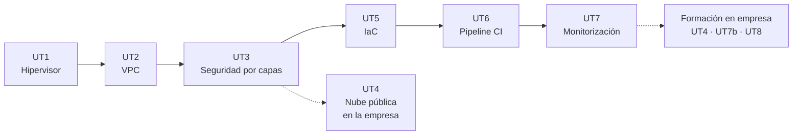

# Despliegue de plataformas de contenedores

Apuntes de la asignatura · Curso de especialización · 120 h (90 en el centro, 30 en empresa) · Curso 2026-27

Aquí están los apuntes de toda la asignatura, unidad por unidad, con las actividades de cada sesión y las prácticas evaluables. Es el mismo material que se trabaja en clase, ampliado con lo que no cabe en dos horas y con enlaces a la documentación oficial para que no os quedéis en lo que yo cuento.

## De qué va la asignatura

Un contenedor no corre en el aire. Debajo hay una máquina virtual, debajo de la máquina virtual un hipervisor, alrededor una red con subredes y cortafuegos, y por encima algo que decide cuándo se despliega una versión nueva y avisa si ha ido mal. Esta asignatura se ocupa de todo eso: de la plataforma sobre la que se ejecutan los contenedores, no de los contenedores en sí. Lo montáis desde cero, con vuestras manos, y al final del curso tenéis un entorno completo que se despliega solo.

Estos son los conceptos que vertebran el curso, en el orden en que aparecen:

- **Virtualización.** Qué hace un hipervisor, cómo KVM reparte CPU, memoria y disco entre máquinas virtuales, y cómo se crea una VM en veinte segundos a partir de una plantilla con cloud-init. Trabajamos con Proxmox VE.
- **Redes privadas virtuales.** Diseñar el direccionamiento de varios entornos (dev, pre, pro) que no se solapen ni se vean entre sí, con sus subredes por capa, su router, su DHCP y su DNS interno.
- **Seguridad por capas.** DMZ externa, DMZ interna y zona interna separadas por un cortafuegos con política de denegar por defecto, un proxy inverso que publica el servicio y pruebas que demuestran que el aislamiento funciona.
- **Nube pública.** La misma infraestructura alquilada por horas: consola, línea de comandos y SDK de AWS, Azure o Google Cloud. Se trabaja en la empresa.
- **Infraestructura como código.** Todo lo anterior escrito en ficheros que OpenTofu y Ansible aplican de forma reproducible, versionado en Git, probado y escaneado en busca de errores de seguridad.
- **Integración continua.** Un orquestador (Jenkins) que, con cada cambio en el repositorio, construye, prueba, empaqueta y despliega el servicio, con gestión de errores y mínimo privilegio.
- **Monitorización.** Prometheus recogiendo métricas de hosts, contenedores y del propio orquestador, Grafana mostrándolas y una alerta que llega al móvil cuando algo se cae.

Cada unidad se apoya en la anterior: la red de la UT2 es donde la UT3 pone el cortafuegos, la UT5 recrea esa red desde código y la UT6 ejecuta ese código desde un pipeline. No conviene saltarse ninguna.

## Qué hay en esta web

-   :material-book-open-page-variant: **[Unidades](ut/ut1-virtualizacion.md)**

    ---

    Los apuntes de las siete unidades. Cada una empieza con lo que tienes que saber hacer al terminar, desarrolla el contenido con ejemplos y comandos, y cierra con las actividades de cada sesión, la práctica evaluable y su rúbrica.

-   :material-calendar-month: **[Calendario de sesiones](calendario.md)**

    ---

    Las 45 sesiones del curso con fecha, unidad y lo que se hace en cada una. La vista de calendario muestra el detalle al pasar el ratón y lleva a la actividad con un clic. Incluye festivos y el periodo de formación en empresa.

-   :material-school: **[Presentación y evaluación](modulo.md)**

    ---

    Resultados de aprendizaje y criterios de evaluación con la unidad donde se trabaja cada uno, cómo se calcula la nota, las herramientas de la asignatura y la metodología de las sesiones.

-   :material-flask: **[Laboratorio](laboratorio.md)**

    ---

    Cómo queda el entorno que construís durante el curso, requisitos de cada puesto, convenciones de nombres y direcciones, repositorios que vais a crear y qué hacer cuando algo se rompe.

-   :material-console: **[Chuleta de comandos](chuleta.md)**

    ---

    Lo que se teclea una y otra vez: Proxmox, red y diagnóstico, OpenTofu, Ansible, escáneres de seguridad, Docker, certificados, Jenkins, Prometheus y Git.

-   :material-book-alphabet: **[Glosario](glosario.md)**

    ---

    Los términos de la asignatura en una o dos frases, con la unidad donde se explican a fondo. Para cuando algo te suene pero no lo sitúes.

-   :material-link-variant: **[Bibliografía y enlaces](recursos.md)**

    ---

    Documentación oficial de cada herramienta, libros que merecen la pena, sitios donde practicar fuera del aula y los créditos de las imágenes.

## Unidades

| UT | Título | Horas | Dónde | RA · CE |
|----|--------|------:|-------|---------|
| [UT1](ut/ut1-virtualizacion.md) | Virtualización e hipervisores | 12 | Centro | RA1 a |
| [UT2](ut/ut2-vpc.md) | Nubes privadas virtuales (VPC) | 14 | Centro | RA1 b, c |
| [UT3](ut/ut3-seguridad-por-capas.md) | Seguridad por capas: DMZ externa, DMZ interna y zona interna | 12 | Centro | RA1 d |
| [UT4](ut/ut4-nube-publica.md) | Nube pública: consola, CLI y SDK | 12 | Empresa | RA2 a–e |
| [UT5](ut/ut5-iac.md) | Infraestructura como código (OpenTofu + Ansible) | 18 | Centro | RA3 a–d |
| [UT6](ut/ut6-ci.md) | Orquestador de integración continua (Jenkins / GitLab CI) | 24 | Centro | RA4 a–h |
| [UT7](ut/ut7-monitorizacion.md) | Monitorización: Prometheus + Grafana | 6 + 12 | Centro + Empresa | RA4 i, j, k |
| UT8 | Proyecto integrador y puesta en producción | 6 | Empresa | Todos |

Los exámenes de evaluación van después de la UT5 (primera evaluación, 29 de enero de 2027) y después de la UT7 (segunda evaluación, 16 de abril de 2027).

## Cómo usar estos apuntes

- Lee la unidad antes de la sesión. En clase la explicación es corta y el laboratorio largo; los apuntes cubren lo que no da tiempo a contar.
- Los comandos están pensados para copiarlos en el laboratorio. Si algo no funciona igual en tu versión, mira primero la sección "Errores frecuentes" de la unidad.
- Las actividades numeradas (A1.1, A1.2...) se hacen en la sesión que se indica. La práctica evaluable cierra la unidad y se entrega por Aules.
- Documenta sobre la marcha: una captura con fecha, la salida de un comando, el fichero de configuración. Al final de la unidad eso es la práctica.

## Antes de empezar

Se da por hecho que manejáis la terminal de Linux con soltura, que sabéis qué es una dirección IP con su máscara y una puerta de enlace, y que habéis usado Docker al menos para levantar un contenedor y leer sus logs. Si algo de eso no está fresco, la página de [laboratorio](laboratorio.md) tiene un apartado de repaso con enlaces.

Todo el software es libre o tiene una versión gratuita suficiente: Proxmox VE, OPNsense, OpenTofu, Ansible, Jenkins, Gitea, Prometheus y Grafana. No hace falta pagar nada, y en la UT4, que es la única que toca nube de pago, la plataforma la pone la empresa.

## Sobre estos apuntes

Los he escrito yo, Víctor, para la asignatura, apoyándome en Claude (el asistente de IA de Anthropic) para redactar, ampliar y revisar el material a partir de mis propios apuntes y de la planificación del curso. Todo lo que hay aquí lo he revisado yo y lo voy corrigiendo durante el curso; si algo está mal, la responsabilidad es mía, no de la herramienta. Si encuentras un error o un comando que ya no funciona, dímelo en clase o abre un issue en el [repositorio](https://github.com/victor-educ/apuntes-5166). El texto se publica con licencia [CC BY-SA 4.0](https://creativecommons.org/licenses/by-sa/4.0/deed.es); las imágenes de terceros llevan su atribución al pie. La versión publicada aparece en el pie de cada página.
