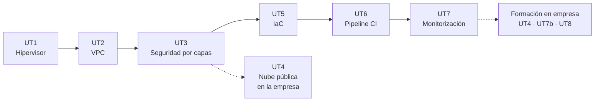

# Apuntes del módulo 5166

Despliegue de plataformas de ejecución de contenedores · Curso de especialización · 120 h (90 en el centro, 30 en empresa) · Curso 2026-27

Aquí están los apuntes de todo el módulo, unidad por unidad, con las actividades de cada sesión y las prácticas evaluables. Es el mismo material que se trabaja en clase, ampliado con lo que no cabe en dos horas y con enlaces a la documentación oficial para que no os quedéis en lo que yo cuento.

El módulo tiene una idea de fondo: montar, desde cero y con vuestras manos, la infraestructura sobre la que después van a vivir los contenedores. Empezamos por el hipervisor y acabamos con un pipeline que despliega solo y una pila de monitorización que avisa cuando algo se rompe. Cada unidad se apoya en la anterior, así que no conviene saltarse ninguna.

## Unidades

| UT | Título | Horas | Dónde | RA · CE |
|----|--------|------:|-------|---------|
| [UT1](ut/ut1-virtualizacion.md) | Virtualización e hipervisores | 12 | Centro | RA1 a |
| [UT2](ut/ut2-vpc.md) | Nubes privadas virtuales (VPC) | 14 | Centro | RA1 b, c |
| [UT3](ut/ut3-seguridad-por-capas.md) | Seguridad por capas: DMZ externa, DMZ interna y zona interna | 12 | Centro | RA1 d |
| [UT4](ut/ut4-nube-publica.md) | Nube pública: consola, CLI y SDK | 12 | Empresa | RA2 a–e |
| [UT5](ut/ut5-iac.md) | Infraestructura como código (OpenTofu + Ansible) | 18 | Centro | RA3 a–d |
| [UT6](ut/ut6-ci.md) | Orquestador de integración continua (Jenkins / GitLab CI) | 24 | Centro | RA4 a–h |
| [UT7](ut/ut7-monitorizacion.md) | Monitorización: Prometheus + Grafana | 6 + 12 | Centro + Empresa | RA4 i, j, k |
| UT8 | Proyecto integrador y puesta en producción | 6 | Empresa | Todos |

Los exámenes de evaluación van después de la UT5 (primera evaluación, 29 de enero de 2027) y después de la UT7 (segunda evaluación, 16 de abril de 2027). El [calendario completo](calendario.md) tiene las 45 sesiones con fecha y lo que se hace en cada una.

## Cómo usar estos apuntes

- Cada unidad empieza con lo que tienes que saber hacer al terminar. Si al acabar la unidad no puedes hacer eso sin mirar, vuelve atrás.
- Los comandos están pensados para copiarlos en el laboratorio. Si algo no funciona igual en tu versión, mira primero la sección "Errores frecuentes" de la unidad.
- Las actividades numeradas (A1.1, A1.2...) se hacen en la sesión que se indica. La práctica evaluable de cada unidad cierra la unidad y se entrega por Aules.
- La [chuleta de comandos](chuleta.md) reúne lo que vais a teclear una y otra vez. El [glosario](glosario.md) sirve para cuando un término os suene pero no lo situéis.

## Antes de empezar

Se da por hecho que manejáis la terminal de Linux con soltura, que sabéis qué es una dirección IP con su máscara y una puerta de enlace, y que habéis usado Docker al menos para levantar un contenedor y leer sus logs. Si algo de eso no está fresco, la página de [laboratorio](laboratorio.md) tiene un apartado de repaso con enlaces.

Todo el software del módulo es libre o tiene una versión gratuita suficiente: Proxmox VE, OPNsense, OpenTofu, Ansible, Jenkins, Gitea, Prometheus y Grafana. No hace falta pagar nada, y en la UT4, que es la única que toca nube de pago, la plataforma la pone la empresa.

## Sobre estos apuntes

Los escribo yo, Víctor, para el módulo 5166 y los voy corrigiendo durante el curso. Si encuentras un error o un comando que ya no funciona, dímelo en clase o abre un issue en el [repositorio](https://github.com/victor-educ/apuntes-5166). El texto se publica con licencia [CC BY-SA 4.0](https://creativecommons.org/licenses/by-sa/4.0/deed.es); las imágenes de terceros llevan su atribución al pie.
