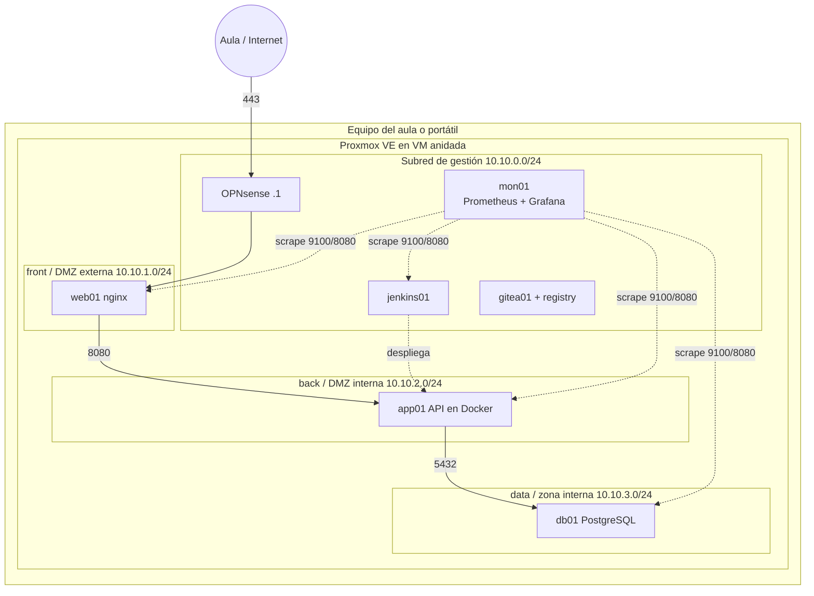

# El laboratorio

Todo el módulo se hace sobre un laboratorio que construís vosotros durante las primeras unidades y que después reutilizáis hasta el final. Esta página describe cómo queda cuando está completo, qué necesita cada puesto y cómo recuperarlo si algo se rompe.

## Cómo queda al final del módulo

Ese es el entorno **dev**. En la UT2 se crean también **pre** y **pro** con la misma estructura y bloques 10.20.0.0/16 y 10.30.0.0/16, aunque después casi todo el trabajo se hace en dev y pre para no consumir recursos de más.

## Las dos asignaturas comparten este laboratorio

La asignatura hermana, [Mantenimiento del sistema de contenedores](https://victor-educ.github.io/apuntes-5169/), vigila, prueba, actualiza y retira el mismo servicio, y empieza a hacerlo el 6 de octubre, cuando aquí todavía se está instalando Proxmox. Para que eso cuadre, en la sesión 3 (14 de octubre), nada más tener la plantilla cloud-init, se clonan dos VM que en principio no tocan a esta unidad: `app01`, con el servicio del curso en Docker Compose, y `mon01`, con Prometheus, Alertmanager y Grafana levantados con un compose que se entrega en la otra asignatura. Las dos van en vmbr0, la red del aula, sin subredes ni cortafuegos.

Cuando aquí termine la UT2 (VPC, 18 de noviembre) y la UT3 (cortafuegos, 9 de diciembre), esas dos VM se mueven a su sitio definitivo: app01 a la subred back y mon01 a la de gestión con la IP 10.10.0.20. La otra asignatura hace esa migración en su UT3, que coincide en fechas con la nuestra. Y en abril, cuando lleguemos a la UT7 de monitorización, la pila ya llevará medio curso funcionando: esa unidad se centra en lo que la otra asignatura no cubre.

## Requisitos por puesto

Proxmox va dentro de una máquina virtual de VirtualBox o VMware Workstation en el equipo del aula (virtualización anidada). No es lo ideal en rendimiento, pero permite que cada uno tenga su hipervisor completo y lo pueda romper sin afectar a nadie.

| Recurso | Mínimo | Recomendado |
|---------|-------:|------------:|
| CPU del equipo | 4 núcleos con VT-x/AMD-V | 8 núcleos |
| RAM del equipo | 16 GB | 32 GB |
| Disco libre | 80 GB en SSD | 150 GB en SSD |
| VM de Proxmox | 4 vCPU, 8 GB RAM, 60 GB | 6 vCPU, 16 GB RAM, 100 GB |

Con 8 GB de RAM para Proxmox caben el firewall (1 GB), tres VM de servicio (1 a 2 GB cada una) y una de gestión más. Para las UT6 y UT7 hace falta subir a 12 o 16 GB o apagar lo que no se use; Jenkins con un agente y la pila de monitorización se comen 4 GB entre los dos.

Si tienes un miniPC o un portátil antiguo con 16 GB, instalar Proxmox directamente sobre él (tipo 1 de verdad) es mucho mejor que la VM anidada. Es la opción que os recomiendo si podéis.

## Convenciones

Para que las prácticas sean comparables y para que los apuntes tengan sentido, usamos las mismas convenciones en todos los puestos:

| Cosa | Convención |
|------|------------|
| ID de plantilla | 9000 (Debian 13 genericcloud) |
| ID de VM de servicio | 101 en adelante para dev, 201 para pre, 301 para pro |
| Usuario en las VM | `ops` con clave SSH ed25519, sin contraseña |
| Dominio interno | `dev.lab`, `pre.lab`, `pro.lab` |
| Router / firewall | `.1` de cada subred |
| Servicios de red (DNS, DHCP) | `.2` a `.9` |
| Servidores fijos | `.10` a `.99` |
| Rango DHCP | `.100` a `.199` |
| Nombres | `web01`, `app01`, `db01`, `jenkins01`, `mon01`, `gitea01` |
| Puertos | 443 web, 8080 API, 5432 BD, 8443 Jenkins, 9090 Prometheus, 3000 Grafana, 9100 node_exporter |

## Repositorios que vais a crear

A lo largo del módulo cada alumno acaba con cuatro repositorios en el Gitea del laboratorio (o en GitHub, si preferís tenerlo fuera):

1. `infra` (UT5): código OpenTofu y Ansible que levanta el entorno.
2. `servicio` (UT5, UT6): la aplicación de ejemplo con su Dockerfile, compose y Jenkinsfile.
3. `jenkins-config` (UT6): compose de Jenkins, JCasC y documentación de la instalación.
4. `monitoring` (UT7): compose de la pila, prometheus.yml, alertas, Alertmanager y dashboards exportados.

Ninguno de los cuatro puede contener un secreto. Antes del primer push de cada uno se instala `gitleaks` como hook de pre-commit; en la UT5 se explica cómo.

## Cuando algo se rompe

Se va a romper. Es parte del módulo. El orden de recuperación, de menos a más drástico:

1. **Snapshot de la VM afectada.** Antes de cada práctica evaluable haz un snapshot de las VM que vas a tocar. Volver atrás cuesta segundos.
2. **Recrear la VM desde la plantilla.** Con cloud-init es un minuto. A partir de la UT5 es un `tofu apply`.
3. **Snapshot de la VM de Proxmox** en VirtualBox/VMware. Hazlo al terminar la UT1 (hipervisor limpio y configurado) y al terminar la UT3 (red y firewall montados). Son los dos puntos a los que más veces vais a querer volver.
4. **Reinstalar Proxmox.** Dos horas si tienes la ISO y las notas de la UT1 a mano. Por eso las notas.

Guarda copia fuera del equipo del aula de: la clave SSH, los ficheros de configuración del firewall (OPNsense exporta un XML), los repositorios y las plantillas cloud-init. Con eso se reconstruye todo lo demás.

## Repaso previo

Si alguno de estos puntos no lo tienes fresco, dedícale una tarde antes de la UT1:

- **Terminal de Linux**: rutas, permisos, `systemctl`, `journalctl`, edición con `nano` o `vim`, `ssh` con claves. La guía de [Linux Journey](https://linuxjourney.com/) es corta y suficiente.
- **Redes**: qué es una máscara, cómo se calcula el rango de una subred, qué hace una puerta de enlace, qué es NAT. Cualquier calculadora de subredes ([ipcalc](https://jodies.de/ipcalc)) te sirve para practicar.
- **Docker**: `docker run`, `docker compose up`, volúmenes, redes, `docker logs`. La [documentación oficial](https://docs.docker.com/get-started/) tiene un tutorial de una hora.
- **Git**: clonar, commit, push, ramas, resolver un conflicto. [Pro Git](https://git-scm.com/book/es/v2) en español, capítulos 2 y 3.
