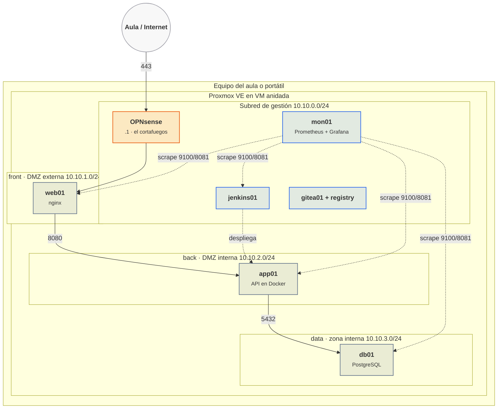

# El laboratorio

Todo el módulo se hace sobre un laboratorio que se construye durante las primeras unidades y que después se reutiliza hasta el final. Esta página describe cómo queda cuando está completo, qué necesita cada puesto y cómo recuperarlo si algo se rompe.

## Cómo queda al final del módulo

El laboratorio completo al terminar el módulo. En naranja el único punto por el que entra el tráfico de fuera; en azul lo que vigila y despliega.

Ese es el entorno **dev**. En la UT2 se crean también **pre** y **pro** con la misma estructura y bloques 10.20.0.0/16 y 10.30.0.0/16, aunque después casi todo el trabajo se hace en dev y pre para no consumir recursos de más.

## Las dos asignaturas comparten este laboratorio

La asignatura hermana, [Mantenimiento del sistema de contenedores](https://victor-educ.github.io/apuntes-5169/), vigila, prueba, actualiza y retira el mismo servicio, y empieza a hacerlo el 1 de octubre, cuando aquí todavía se está instalando Proxmox. Sus tres primeras sesiones trabajan con Docker en el puesto del alumno, porque el hipervisor se está montando todavía y la plantilla de la que salen las VM no existe hasta el 14 de octubre. Para que eso cuadre, en la sesión 3 (14 de octubre), nada más tener la plantilla cloud-init, se clonan dos VM que en principio no tocan a esta unidad: `app01`, que alojará el servicio del curso en Docker Compose, y `mon01`, que alojará Prometheus, Alertmanager y Grafana. Las dos van en vmbr0, la red del aula, con IP por DHCP y sin subredes ni cortafuegos, y se entregan con Docker Engine y el plugin compose ya instalados y con el usuario `ops` en el grupo `docker`. Los ficheros compose que corren encima los entrega la otra asignatura y se despliegan allí, a partir de su sesión 4 (15 de octubre).

Cuando aquí termine la UT2 (VPC, 18 de noviembre) y la UT3 (cortafuegos, 9 de diciembre), esas dos VM se mueven a su sitio definitivo: app01 a la subred back y mon01 a la de gestión con la IP 10.10.0.20. La otra asignatura hace esa migración en su UT3, que coincide en fechas con la de este módulo. Y en abril, al llegar a la UT7 de monitorización, la pila ya llevará medio curso funcionando: esa unidad la reinstala como definitiva dentro de la VPC y se ocupa del despliegue (elegir y justificar el gestor de ingesta, las métricas del propio orquestador de integración continua, los targets salidos del inventario de Ansible y la seguridad de la pila), mientras que PromQL, las reglas, Alertmanager, Grafana y los indicadores se repasan en diez minutos porque la otra asignatura ya los ha dado a fondo.

## Requisitos por puesto

Proxmox va dentro de una máquina virtual de VirtualBox o VMware Workstation en el equipo del aula (virtualización anidada). No es lo ideal en rendimiento, pero permite que cada uno tenga su hipervisor completo y lo pueda romper sin afectar a nadie.

| Recurso | Mínimo | Recomendado |
|---------|-------:|------------:|
| CPU del equipo | 4 núcleos con VT-x/AMD-V | 8 núcleos |
| RAM del equipo | 16 GB | 32 GB |
| Disco libre | 80 GB en SSD | 150 GB en SSD |
| VM de Proxmox | 4 vCPU, 12 GB RAM, 60 GB | 6 vCPU, 16 GB RAM, 100 GB |

**Presupuesto de memoria.** El peor momento del curso es febrero y marzo, con la UT6 de Despliegue encendida (Jenkins, su agente y el registry) a la vez que la pila de Mantenimiento (Prometheus, Alertmanager, Grafana y Loki) y el servicio completo. Sumando lo que está arrancado al mismo tiempo:

| VM encendida en el pico | RAM |
|-------------------------|----:|
| OPNsense | 1 GB |
| web01 | 1 GB |
| app01 | 2 GB |
| db01 | 2 GB |
| mon01 | 3 GB |
| jenkins01, el controlador | 2 GB |
| agent01, el agente de Jenkins | 2 GB |
| gitea01 con el registry | 1 GB |
| **Total de las VM** | **14 GB** |
| El propio Proxmox (ZFS o LVM, servicios y consola) | 2 GB |
| **La VM de Proxmox en el pico** | **16 GB** |

Esa es la cifra de referencia para las dos asignaturas: **16 GB para la VM de Proxmox en el peor momento**. Con menos se trabaja igual, apagando lo que no se esté usando. Por orden de lo que menos duele:

1. `jenkins01` y `agent01` (4 GB) fuera de las sesiones de integración continua.
2. `gitea01` (1 GB): solo hace falta al clonar y al empujar; se enciende un rato o se usa GitHub.
3. `web01` (1 GB): solo hace falta cuando se prueba el camino completo desde fuera.
4. `db01` (2 GB) en las sesiones que son solo de pipeline, sin desplegar.

Con 12 GB se llega bien apagando `gitea01`, `web01` y `db01` en las sesiones de integración continua (quedan 10 GB). Con 8 GB se sigue el curso hasta la UT5 de Despliegue y la UT2 de Mantenimiento, pero no caben Jenkins con su agente y la pila de monitorización a la vez. MinIO no entra en la cuenta si lo monta el profesor para toda el aula.

Desde el 14 de octubre, `app01` y `mon01` se quedan encendidas el resto del curso porque las usa la otra asignatura, así que en las sesiones que piden varias VM a la vez conviene bajar la memoria de las de prueba o apagar las que no se estén usando.

Con un miniPC o un portátil antiguo de 16 GB disponible, instalar Proxmox directamente sobre él (tipo 1 de verdad) es mucho mejor que la VM anidada. Es la opción preferible siempre que sea posible.

## Convenciones

Esta es la tabla única del laboratorio y manda sobre cualquier otra cosa escrita en las unidades: si una hoja de práctica dice algo distinto, vale lo de aquí. La asignatura de Mantenimiento usa estas mismas convenciones y solo añade las suyas.

### Zonas, VNets y direccionamiento

Cada entorno tiene **cuatro VNets del SDN, una por zona, y cada VNet lleva una sola subred**. Dos subredes dentro de la misma VNet comparten bridge, o sea el mismo dominio de capa 2, así que no se pueden separar con un cortafuegos; por eso hay una VNet por zona y no una sola con varias subredes dentro.

| Zona | VNet (dev) | Subred | Quién es el `.1` | Qué vive ahí |
|------|-----------|--------|------------------|--------------|
| gestión | `devmgmt` | 10.10.0.0/24 | el router del entorno | jenkins01, gitea01 con el registry, mon01, MinIO y el puesto de administración |
| front (DMZ externa) | `devfront` | 10.10.1.0/24 | el router del entorno | web01, el nginx que publica el servicio |
| back (DMZ interna) | `devback` | 10.10.2.0/24 | el router del entorno | app01, la API en Docker |
| data (zona interna) | `devdata` | 10.10.3.0/24 | el router del entorno | db01, PostgreSQL |

**pre y pro son iguales cambiando el prefijo**: `premgmt`, `prefront`, `preback`, `predata` sobre 10.20.0.0/16, y `promgmt`, `profront`, `proback`, `prodata` sobre 10.30.0.0/16, con el mismo tercer octeto por zona (0 gestión, 1 front, 2 back, 3 data). Los servicios de plataforma (Jenkins, Gitea, el registry, la monitorización, MinIO) no se duplican: viven en `devmgmt` y sirven a los tres entornos.

**El ID de una VNet admite como máximo 8 caracteres y solo alfanuméricos. Es un límite de Proxmox, no una manía del curso**: nombres como `vdev-front` no se pueden crear. El ID de zona tiene el mismo límite; la zona del laboratorio se llama `lab`, es de tipo Simple y usa el IPAM `pve`.

El **router del entorno** tiene una pata en cada VNet y es el `.1` de las cuatro subredes: la VM `router-dev` con dnsmasq desde la sesión 9, y OPNsense a partir de la sesión 14, que ocupa su sitio y hereda esas mismas direcciones y su ID de VM. Orden de interfaces en la VM: `ens18` exterior (vmbr0), `ens19` gestión, `ens20` front, `ens21` back, `ens22` data.

Quién reparte direcciones cambia una sola vez en todo el curso. En la **sesión 8** las subredes del SDN se crean con gateway y con rango DHCP del SDN (dnsmasq por zona, unidad `dnsmasq@lab`), porque es lo que se explica ese día. En la **sesión 9**, al entrar `router-dev`, se quita el gateway y el rango DHCP de cada subred del SDN y el router pasa a hacer DHCP, DNS y NAT. Dos `.1` distintos en la misma red no funcionan, así que ese paso no es opcional.

| Rango dentro de cada subred | Uso |
|------|------------|
| `.1` | router y cortafuegos del entorno; también es el DNS y el servidor DHCP |
| `.2` a `.9` | reservado para servicios de red; hoy no se usa ninguna |
| `.10` a `.99` | servidores fijos |
| `.100` a `.199` | rango DHCP |
| `.200` a `.254` | libre, para pruebas de un rato |

!!! ojo "Dos redes que no existen y una tarjeta que tampoco"
    **No hay patas de gestión** en web01, app01 ni db01: cada uno tiene una sola tarjeta, la de su zona, y la monitorización llega hasta ellos atravesando el cortafuegos, que es justo lo que se aprende a permitir en la UT3 de Mantenimiento. La `10.10.0.11` es gitea01 y la `10.10.0.12` es agent01, no segundas tarjetas de app01 y de db01.

    La red **10.10.10.0/24 no es del laboratorio**: es la del bridge `vmbr1` del nodo, donde el host tiene la `10.10.10.1`, y solo se usa en la UT1, antes de que exista el SDN. Ninguna VM de servicio vive ahí.

    La red **10.0.20.0/24 no existe**. La subred de gestión es `10.10.0.0/24`.

### Máquinas, IDs de VM y direcciones

| Máquina | ID en dev | VNet | IP | Nombre DNS | RAM | Qué corre |
|---------|----------:|------|----|------------|----:|-----------|
| OPNsense | 100 | las cuatro | `.1` de cada subred | `fw.dev.lab` | 1 GB | cortafuegos, NAT, DNS y DHCP del entorno |
| jenkins01 | 101 | `devmgmt` | 10.10.0.10 | `jenkins.lab` | 2 GB | el controlador de Jenkins, con nginx delante |
| gitea01 | 102 | `devmgmt` | 10.10.0.11 | `gitea.lab` y `registry.lab` | 1 GB | Gitea y el registry de imágenes |
| mon01 | 103 | `devmgmt` | 10.10.0.20 | `prometheus.lab` y `grafana.lab` | 3 GB | Prometheus, Alertmanager, Grafana y Loki |
| MinIO | 104 | `devmgmt` | 10.10.0.30 | `minio.lab` | 1 GB | almacén S3 para el estado de OpenTofu y las copias restic; si lo monta el profesor para toda el aula, no ocupa memoria del puesto |
| puesto de administración | 105 | `devmgmt` | 10.10.0.50 | sin nombre DNS | 1 GB | la VM desde la que se administra el cortafuegos en la UT3 |
| agent01 | 106 | `devmgmt` | 10.10.0.12 | `agent01.lab` | 2 GB | el agente permanente de Jenkins, por SSH |
| web01 | 110 | `devfront` | 10.10.1.10 | `web01.dev.lab`, publica `api.dev.lab` | 1 GB | nginx, terminación TLS del servicio |
| app01 | 120 | `devback` | 10.10.2.10 | `app01.dev.lab` | 2 GB | la API del curso en Docker Compose |
| db01 | 130 | `devdata` | 10.10.3.10 | `db01.dev.lab` | 2 GB | PostgreSQL |

**Reparto de los ID de VM.** La plantilla cloud-init es la **9000** (Debian 13 genericcloud). Las VM se numeran `<entorno><zona><host>`: la centena es el entorno (1 dev, 2 pre, 3 pro) y la decena es la zona, con el mismo número que el tercer octeto de su subred (0 gestión, 1 front, 2 back, 3 data). Así `120` se lee "dev, back, primera máquina" y nunca choca con `220`, que es la misma pieza en pre.

| Entorno | Gestión | front | back | data | Pruebas y VM efímeras |
|---------|---------|-------|------|------|----------------------|
| dev | 100 a 109 | 110 a 119 | 120 a 129 | 130 a 139 | 150 a 199 |
| pre | 200 a 209 | 210 a 219 | 220 a 229 | 230 a 239 | 250 a 299 |
| pro | 300 a 309 | 310 a 319 | 320 a 329 | 330 a 339 | 350 a 399 |

Los contenedores LXC comparten numeración con las VM, así que salen del rango de pruebas del entorno que toque.

### Dominios

Hay dos categorías y conviene no mezclarlas:

- **Servicios de plataforma**, que viven en gestión y sirven a los tres entornos: **dominio plano `.lab`**. `jenkins.lab`, `gitea.lab`, `registry.lab`, `grafana.lab`, `prometheus.lab`, `minio.lab`. El nombre de la máquina que los aloja también va en plano: `jenkins01.lab`, `gitea01.lab`, `mon01.lab`.
- **Hosts de servicio**, que son uno por entorno: **`<host>.<entorno>.lab`**. `web01.dev.lab`, `app01.dev.lab`, `db01.dev.lab`, `app01.pre.lab`, y el servicio publicado del curso, `api.dev.lab` y `api.pre.lab`.

No existe ningún `lab.local` ni ningún `gitea01.dev.lab`: lo primero es un dominio que nadie ha creado y lo segundo mete un servicio de plataforma en un entorno. Los nombres los resuelve el dnsmasq del router de cada entorno, es decir el `.1` de la subred.

### Puertos

| Puerto | Servicio | Dónde |
|-------:|----------|-------|
| 22 | SSH | todas las VM, usuario `ops` |
| 80 | HTTP, solo redirección a 443 | web01 |
| 443 | HTTPS público | `api.dev.lab` en web01, y `jenkins.lab`, `gitea.lab`, `grafana.lab`, `prometheus.lab` y `minio.lab` por el nginx que va delante de cada uno |
| 3000 | Gitea y Grafana, puerto interno | gitea01 y mon01, solo por detrás de su nginx |
| 3100 | Loki | mon01 |
| 5000 | registry de imágenes con TLS y `htpasswd` | gitea01, `registry.lab:5000` |
| 5432 | PostgreSQL | db01, abierto solo desde back |
| 8006 | interfaz web de Proxmox | el nodo, en la red del aula |
| 8025 | Mailpit, buzón de pruebas de Alertmanager | mon01 |
| 8080 | **la API del curso** | app01; es la razón de que cAdvisor se publique en otro puerto |
| 8080 | Jenkins por HTTP, puerto interno | dentro del compose de jenkins01, nunca publicado |
| 8081 | cAdvisor publicado en el host | app01; dentro de la red de Docker cAdvisor sigue escuchando en `cadvisor:8080` |
| 9000 | API S3 de MinIO | 10.10.0.30 |
| 9080 | Promtail | app01 y demás hosts con logs |
| 9090 | Prometheus | mon01 |
| 9093 | Alertmanager | mon01 |
| 9100 | node_exporter | todas las VM vigiladas |
| 9102 | `/metrics` de la aplicación | app01 |
| 9113 | nginx-prometheus-exporter | donde esté el nginx del servicio |
| 9187 | postgres_exporter | db01 |

Jenkins deja escrito su nombre en tres sitios y los tres dicen lo mismo: **nombre público `jenkins.lab`, puerto público 443 (`https://jenkins.lab`, con nginx delante terminando TLS) y puerto interno 8080** dentro de la red del compose. El 8443 solo aparece en la variante con keystore Java, que no es la instalación del curso y está recogida en [Para ampliar](ampliacion.md#jenkins-con-keystore-java). Los agentes se conectan por WebSocket a través del mismo 443, así que el puerto 50000 no se abre.

El registry se escribe siempre entero, con puerto: **`registry.lab:5000`**. Ni `registry.dev.lab` ni `registry.lab` a secas.

### Lo demás

| Cosa | Convención |
|------|------------|
| ID de plantilla | 9000 (Debian 13 genericcloud) |
| Usuario en las VM | `ops` con clave SSH ed25519, sin contraseña |
| Nombres de máquina | `web01`, `app01`, `db01`, `jenkins01`, `mon01`, `gitea01` |
| Bloques por entorno | dev 10.10.0.0/16, pre 10.20.0.0/16, pro 10.30.0.0/16 |
| Zona del SDN | `lab`, tipo Simple, IPAM `pve` |

## Repositorios que hay que crear

A lo largo del módulo cada alumno acaba con cuatro repositorios en el Gitea del laboratorio (o en GitHub, si se prefiere tenerlo fuera):

1. `iac-lab` (UT5): código OpenTofu y Ansible que levanta el entorno.
2. `servicio` (UT5, UT6): la aplicación de ejemplo con su Dockerfile, compose y Jenkinsfile.
3. `jenkins-config` (UT6): compose de Jenkins, JCasC y documentación de la instalación.
4. `monitoring` (UT7): compose de la pila, prometheus.yml, alertas, Alertmanager y dashboards exportados.

Ninguno de los cuatro puede contener un secreto. Antes del primer push de cada uno se instala `gitleaks` como hook de pre-commit; en la UT5 se explica cómo.

## Cuando algo se rompe

Se va a romper. Es parte del módulo. El orden de recuperación, de menos a más drástico:

1. **Snapshot de la VM afectada.** Antes de cada práctica evaluable conviene hacer un snapshot de las VM que se vayan a tocar. Volver atrás cuesta segundos.
2. **Recrear la VM desde la plantilla.** Con cloud-init es un minuto. A partir de la UT5 es un `tofu apply`.
3. **Snapshot de la VM de Proxmox** en VirtualBox/VMware. Conviene hacerlo al terminar la UT1 (hipervisor limpio y configurado) y al terminar la UT3 (red y firewall montados). Son los dos puntos a los que más veces hay que volver.
4. **Reinstalar Proxmox.** Dos horas con la ISO y las notas de la UT1 a mano. Por eso las notas.

Conviene guardar fuera del equipo del aula una copia de: la clave SSH, los ficheros de configuración del firewall (OPNsense exporta un XML), los repositorios y las plantillas cloud-init. Con eso se reconstruye todo lo demás.

## Repaso previo

Si alguno de estos puntos no está fresco, conviene dedicarle una tarde antes de la UT1:

- **Terminal de Linux**: rutas, permisos, `systemctl`, `journalctl`, edición con `nano` o `vim`, `ssh` con claves. La guía de [Linux Journey](https://linuxjourney.com/) es corta y suficiente.
- **Redes**: qué es una máscara, cómo se calcula el rango de una subred, qué hace una puerta de enlace, qué es NAT. Cualquier calculadora de subredes ([ipcalc](https://jodies.de/ipcalc)) sirve para practicar.
- **Docker**: `docker run`, `docker compose up`, volúmenes, redes, `docker logs`. La [documentación oficial](https://docs.docker.com/get-started/) tiene un tutorial de una hora.
- **Git**: clonar, commit, push, ramas, resolver un conflicto. [Pro Git](https://git-scm.com/book/es/v2) en español, capítulos 2 y 3.
