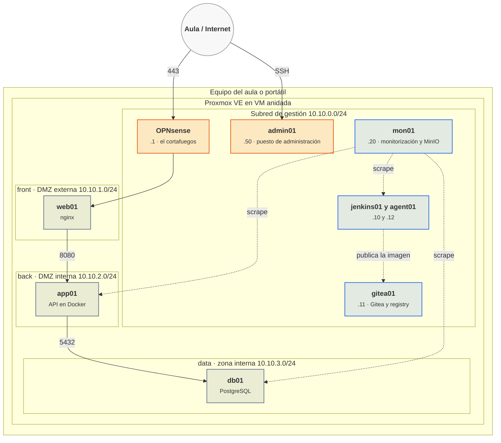

# El laboratorio

Todo el módulo se hace sobre un laboratorio que se construye durante las primeras unidades y que después se reutiliza hasta el final. Esta página describe cómo queda cuando está completo, qué necesita cada puesto y cómo recuperarlo si algo se rompe.

## Cómo queda al final del módulo


```mermaid
flowchart TB
    subgraph host["Equipo del aula o portátil"]
        subgraph pve["Proxmox VE en VM anidada"]
            subgraph mgmt["Subred de gestión 10.10.0.0/24"]
                fw["<b>OPNsense</b><br><small>.1 · el cortafuegos</small>"]:::act
                adm["<b>admin01</b><br><small>.50 · puesto de administración</small>"]:::act
                jenkins["<b>jenkins01 y agent01</b><br><small>.10 y .12</small>"]:::dato
                mon["<b>mon01</b><br><small>.20 · monitorización y MinIO</small>"]:::dato
                git["<b>gitea01</b><br><small>.11 · Gitea y registry</small>"]:::dato
            end
            subgraph front["front · DMZ externa 10.10.1.0/24"]
                web["<b>web01</b><br><small>nginx</small>"]:::pieza
            end
            subgraph back["back · DMZ interna 10.10.2.0/24"]
                app["<b>app01</b><br><small>API en Docker</small>"]:::pieza
            end
            subgraph data["data · zona interna 10.10.3.0/24"]
                db["<b>db01</b><br><small>PostgreSQL</small>"]:::pieza
            end
        end
    end
    Internet(("<b>Aula / Internet</b>")):::infra -->|443| fw
    Internet -->|SSH| adm
    fw --> web
    web -->|8080| app
    app -->|5432| db
    jenkins -.->|publica la imagen| git
    mon -.->|scrape| app & db & jenkins
    classDef act fill:#ea580c22,stroke:#ea580c,stroke-width:1.5px
    classDef pieza fill:#64748b22,stroke:#64748b,stroke-width:1.5px
    classDef dato fill:#2563eb22,stroke:#2563eb,stroke-width:1.5px
    classDef infra fill:#a1a1aa14,stroke:#a1a1aa,stroke-width:1.5px
    classDef ok fill:#16a34a22,stroke:#16a34a,stroke-width:1.5px
    classDef riesgo fill:#dc262622,stroke:#dc2626,stroke-width:1.5px
```

<p class="pie" markdown>El laboratorio completo al terminar el módulo. En naranja por dónde se entra desde fuera: el servicio, por el cortafuegos, y la administración, por `admin01`. En azul lo que vigila, construye y guarda las imágenes.</p>

Ese es el entorno **dev**, el único que llega al final. **pre** tiene la misma estructura en 10.20.0.0/16 y vive del 8 de enero al 11 de marzo (su ficha está en [El entorno pre](#el-entorno-pre)); **pro** solo existe como red, en 10.30.0.0/16, para las pruebas de aislamiento de la UT2.

## Las dos asignaturas comparten este laboratorio

La asignatura hermana, [Mantenimiento del sistema de contenedores](https://victor-educ.github.io/apuntes-5169/), vigila, prueba, actualiza y retira el mismo servicio, y empieza a hacerlo el 1 de octubre, cuando aquí todavía se está instalando Proxmox. Sus tres primeras sesiones trabajan con Docker en el puesto del alumno, porque el hipervisor se está montando todavía y la plantilla de la que salen las VM no existe hasta el 14 de octubre. Para que eso cuadre, en la sesión 3 (14 de octubre), nada más tener la plantilla cloud-init, junto a `web01` se clonan dos VM pensadas para la otra asignatura: `app01`, que aloja el servicio del curso en Docker Compose, y `mon01`, que aloja la pila de monitorización. Las dos van en vmbr0, la red del aula, con IP por DHCP y sin subredes ni cortafuegos, y se entregan con Docker Engine y el plugin compose instalados, con el usuario `ops` en el grupo `docker` y con la clave pública del puesto del alumno dentro, porque Mantenimiento entra en ellas desde su puesto al día siguiente. Los ficheros compose que corren encima los entrega la otra asignatura y se despliegan allí a partir de su sesión 4 (15 de octubre).

El 27 de noviembre, en la [A3.3](ut/ut3-seguridad-por-capas.md#a33-aplicacion-y-datos-sesion-16), esta asignatura traslada las dos VM a su sitio definitivo, ya detrás del cortafuegos: app01 a la subred back con la 10.10.2.10 y mon01 a la de gestión con la 10.10.0.20. Mantenimiento audita su pila el 26 de noviembre, con las VM todavía en el aula, y la protege desde el 1 de diciembre, ya en la VPC. En marzo, la UT7 de monitorización no levanta una segunda pila: trabaja sobre la de `/opt/monitoring` de mon01 y en el mismo repositorio `monitoring`, y solo le añade ficheros propios que Mantenimiento no toca (los targets que genera Ansible, sus reglas, el job de Jenkins y el panel de la plataforma). PromQL, las reglas, Alertmanager, Grafana y los indicadores se repasan en pocos minutos, porque la otra asignatura ya los ha dado a fondo.

## Requisitos por puesto

Proxmox va dentro de una máquina virtual de VirtualBox o VMware Workstation en el equipo del aula (virtualización anidada). No es lo ideal en rendimiento, pero permite que cada uno tenga su hipervisor completo y lo pueda romper sin afectar a nadie.

| Recurso | Mínimo | Recomendado |
|---------|-------:|------------:|
| CPU del equipo | 4 núcleos con VT-x/AMD-V | 8 núcleos |
| RAM del equipo | 16 GB | 32 GB |
| Disco libre | 80 GB en SSD | 150 GB en SSD |
| VM de Proxmox | 4 vCPU, 12 GB RAM, 60 GB | 6 vCPU, 16 GB RAM, 100 GB |

**Disco.** Además de los clones de la plantilla (20 GB cada uno, de los que se ocupan unos 3 al principio), hay dos discos que se añaden a mano durante el curso: el segundo disco de `db01` para `/data`, de 5 GB, el 27 de noviembre, y el volumen `minio_data` de la pila de `mon01`, que crece con el estado de OpenTofu (unos pocos MB) y con las copias restic de `pre` (entre 1 y 3 GB desde febrero).

Con un miniPC o un portátil antiguo de 16 GB disponible, instalar Proxmox directamente sobre él (tipo 1 de verdad) es mucho mejor que la VM anidada. Es la opción preferible siempre que sea posible.

### Presupuesto de memoria

Lo que se busca es que la VM de Proxmox no se quede sin memoria en ninguna sesión. La cuenta se hace con la memoria asignada a cada VM, que es la de la columna «RAM al clonar» de la [tabla de máquinas](#maquinas-ids-de-vm-y-direcciones), más 2 GB para el propio Proxmox. La cifra de referencia para las dos asignaturas es **16 GB para la VM de Proxmox, es decir, 14 GB para las VM**, y no se alcanza dejándolo todo encendido: en los tramos más cargados hay algo que se apaga.

Cuatro bloques se repiten en la cuenta:

- **La base**, encendida todo el curso desde el 27 de noviembre: OPNsense (1 GB), `admin01` (1 GB), que es el salto para entrar en todo lo demás, y `mon01` (3 GB), con MinIO dentro. Son 5 GB.
- **El servicio en dev**: `web01` (1 GB), `app01` (2 GB) y `db01` (2 GB). Son 5 GB.
- **pre**, del 8 de enero al 11 de marzo: tres VM de 1 GB y `router-pre` (512 MB). Son 3,5 GB.
- **La integración continua**, desde febrero: `jenkins01` (2 GB), `agent01` (2 GB) y `gitea01` (1 GB). Son 5 GB.

| Tramo | Encendido | Suma | Qué se apaga para no pasar de 14 GB |
|---|---|--:|---|
| 14 oct a 3 nov | `web01`, `app01` y `mon01`; `db01` desde el 30 oct; las VM de prueba de la UT1 | 8 GB y las pruebas | Cada VM de prueba al terminar su hoja; en la evaluable de la UT1, todo menos `app01`, `mon01` y `app-eval` |
| 4 a 19 nov | Lo anterior, `router-dev`, `admin01`, `router-pre`, `router-pro` y las dos `web01` de prueba de la A2.5 | 11,5 GB | Nada; la A2.5 apaga `db01` hasta la evaluable para caber también en 12 GB |
| 20 nov a 7 ene | La base, el servicio en dev y `router-pre`; `cli-a` y `cli-b` del 2 al 9 dic | 11,5 GB | Nada |
| 8 ene a 2 feb | La base, el servicio en dev y pre | 13,5 GB | Nada |
| 3 feb a 11 mar | La base, el servicio en dev, pre y la integración continua | 18,5 GB | En las sesiones de Despliegue, dev y pre salvo lo que use la hoja: la A6.8 (26 feb) enciende `router-pre`, `app01-pre` y `db01-pre` y se queda en 12,5 GB. En las de Mantenimiento, `jenkins01`, `agent01` y `web01-pre`, que no corre nada, y pre entera los días que la hoja no la usa; cuando la hoja necesita Jenkins (A7.6, A8.1, A8.2 y A8.3), se enciende y a cambio se apagan `web01` y `db01` de dev; la A8.1 y la A8.2 necesitan además `router-pre`, `app01-pre` y `db01-pre` encendidas |
| 12 a 24 mar | La base, el servicio en dev y la integración continua | 15 GB | `web01` en las sesiones de la UT7, porque `mon01` no la vigila; `agent01` en las de Mantenimiento |

Con una VM de Proxmox de 12 GB (10 para las VM) el curso se sigue con la misma regla, más estricta: se enciende solo lo que usa la hoja del día y se apaga al terminar. Hasta enero basta con lo que ya dicen las hojas y con `router-pre` apagado hasta el 8 de enero; desde enero, cada sesión enciende el servicio en dev o pre, no los dos, y las de Despliegue de febrero y marzo apagan también `mon01` salvo en la A6.4, que traslada Gitea desde ella. Con 8 GB se llega hasta la UT5 de Despliegue y la UT2 de Mantenimiento, pero no caben a la vez Jenkins con su agente y la pila de monitorización.

MinIO no añade ninguna línea a la cuenta: se monta el 18 de diciembre, en el primer paso de la A5.2, como un contenedor más de la pila de `mon01`, y ocupa unos 300 MB de los 3 GB que esa máquina ya tiene. Si el profesor lo monta para toda el aula, no ocupa nada en el puesto. `app01` y `mon01` las usa Mantenimiento a diario: si una sesión de Despliegue las apaga, se vuelven a encender al terminarla.

## Convenciones

Esta es la tabla única del laboratorio y manda sobre cualquier otra cosa escrita en las unidades: si una hoja de práctica dice algo distinto, vale lo de aquí. La asignatura de Mantenimiento usa estas mismas convenciones y solo añade las suyas.

### Zonas, VNets y direccionamiento

Cada entorno tiene **cuatro VNets del SDN, una por zona, y cada VNet lleva una sola subred**. Dos subredes dentro de la misma VNet comparten bridge, o sea el mismo dominio de capa 2, así que no se pueden separar con un cortafuegos; por eso hay una VNet por zona y no una sola con varias subredes dentro.

| Zona | VNet (dev) | Subred | Quién es el `.1` | Qué vive ahí |
|------|-----------|--------|------------------|--------------|
| gestión | `devmgmt` | 10.10.0.0/24 | el router del entorno | jenkins01, agent01, gitea01 con el registry, mon01 con MinIO y el puesto de administración |
| front (DMZ externa) | `devfront` | 10.10.1.0/24 | el router del entorno | web01, el nginx que publica el servicio |
| back (DMZ interna) | `devback` | 10.10.2.0/24 | el router del entorno | app01, la API en Docker |
| data (zona interna) | `devdata` | 10.10.3.0/24 | el router del entorno | db01, PostgreSQL |

**pre y pro son iguales cambiando el prefijo**: `premgmt`, `prefront`, `preback`, `predata` sobre 10.20.0.0/16, y `promgmt`, `profront`, `proback`, `prodata` sobre 10.30.0.0/16, con el mismo tercer octeto por zona (0 gestión, 1 front, 2 back, 3 data). Los servicios de plataforma (Jenkins, Gitea, el registry, la monitorización, MinIO) no se duplican: viven en `devmgmt`. Desde gestión se llega a pre por una pata que `router-pre` tiene en `devmgmt` ([El entorno pre](#el-entorno-pre) dice cómo); a pro no se llega, porque pro no tiene más que sus redes.

**El ID de una VNet admite como máximo 8 caracteres y solo alfanuméricos. Es un límite de Proxmox, no una manía del curso**: nombres como `vdev-front` no se pueden crear. El ID de zona tiene el mismo límite; la zona del laboratorio se llama `lab`, es de tipo Simple y usa el IPAM `pve`.

El **router del entorno** tiene una pata en cada VNet y es el `.1` de las cuatro subredes. En dev lo es la VM `router-dev` (100), con dnsmasq, desde la sesión 9, y OPNsense (109) desde la sesión 14, que ocupa su sitio con esas mismas direcciones; `router-dev` se apaga ese día y se destruye al cerrar la evaluable de la UT3. En pre y pro son `router-pre` (200) y `router-pro` (300). Orden de interfaces en los routers Debian: `ens18` exterior (vmbr0), `ens19` gestión, `ens20` front, `ens21` back y `ens22` data, y en `router-pre`, desde la A5.3, `ens23`, su pata en `devmgmt`. Las de OPNsense están en la [A3.1](ut/ut3-seguridad-por-capas.md#a31-instalar-el-firewall-sesion-14).

Quién reparte direcciones cambia una sola vez en todo el curso. En la **sesión 8** las subredes del SDN se crean con gateway y con rango DHCP del SDN (dnsmasq por zona, unidad `dnsmasq@lab`), porque es lo que se explica ese día. En la **sesión 9**, al entrar `router-dev`, se quita el gateway y el rango DHCP de cada subred del SDN y el router pasa a hacer DHCP, DNS y NAT. Dos `.1` distintos en la misma red no funcionan, así que ese paso no es opcional.

| Rango dentro de cada subred | Uso |
|------|------------|
| `.1` | router y cortafuegos del entorno; también es el DNS y el servidor DHCP |
| `.2` a `.9` | reservado para servicios de red; solo se usa uno, la 10.10.0.2 de gestión, que es la pata de `router-pre` desde la A5.3 (antes, durante la A3.1, la dirección provisional de OPNsense) |
| `.10` a `.99` | servidores fijos |
| `.100` a `.199` | rango DHCP |
| `.200` a `.254` | libre, para pruebas de un rato |

!!! ojo "Una tarjeta que no existe y una red que no es del laboratorio"
    **No hay patas de gestión** en web01, app01 ni db01: cada uno tiene una sola tarjeta, la de su zona, y la monitorización llega hasta ellos atravesando el cortafuegos, con las filas 11 a 13 de la [matriz de reglas](#matriz-de-reglas-de-opnsense). La `10.10.0.11` es gitea01 y la `10.10.0.12` es agent01, no segundas tarjetas de app01 y de db01.

    La red **10.10.10.0/24 no es del laboratorio**: es la del bridge `vmbr1` del nodo, donde el host tiene la `10.10.10.1`. En `vmbr1` no vive ninguna VM de servicio: solo las VLAN de prueba de la UT1 y los dos clientes de la A3.4, en las VLAN 101 y 102 (10.10.101.0/24 y 10.10.102.0/24).

### Máquinas, IDs de VM y direcciones

Una fila por máquina, con la hoja que la crea y la que la retira; las que no tienen fecha de baja llegan al final del curso. `qm clone` no admite la memoria, así que toda hoja que clona la fija en la misma orden con `qm set <ID> --memory <MB>`: la plantilla trae 2 GB y casi ninguna máquina los necesita. Los nombres DNS de cada una están en [Nombres DNS y acceso](#nombres-dns-y-acceso).

| Máquina | ID | Red e IP | RAM al clonar | Qué corre | Nace en | Muere en |
|---------|---:|----------|--------------:|-----------|---------|----------|
| OPNsense | 109 | `vmbr0` (WAN) y las cuatro VNets de dev, con el `.1` de cada una; desde la A3.4, también `vmbr1` | 1 GB | Cortafuegos, NAT, DHCP, DNS y hora de dev | A3.1, 20 nov (se instala en casa) | |
| `router-dev` | 100 | `vmbr0` y las cuatro VNets de dev, con el `.1` de cada una | 512 MB | DHCP, DNS y NAT de dev hasta que llega OPNsense | A2.3, 4 nov | Se apaga en la A3.1 (20 nov) y se destruye al cerrar la evaluable de la UT3 (9 dic) |
| `jenkins01` | 101 | `devmgmt`, 10.10.0.10 | 2 GB | Jenkins con nginx delante | A6.1, 3 feb | |
| `gitea01` | 102 | `devmgmt`, 10.10.0.11 | 1 GB | Gitea con nginx delante; el registry desde la A6.6 (19 feb) | A6.4, 12 feb | |
| `mon01` | 103 | `vmbr0` por DHCP hasta el 27 nov; después `devmgmt`, 10.10.0.20, y la 10.10.0.30 de MinIO | 3 GB | La pila de Mantenimiento en `/opt/monitoring`; la Gitea provisional del 17 nov al 12 feb; MinIO desde la A5.2 (18 dic) | A1.3, 14 oct | |
| `admin01`, el puesto de administración | 105 | `vmbr0` por DHCP y `devmgmt`, 10.10.0.50 | 1 GB | El salto SSH hacia todas las zonas, la CA del curso, `tofu` y `ansible`, y las copias de trabajo de `iac-lab`, `operacion` y `entregas-5166` | A2.4, 6 nov | |
| `agent01` | 106 | `devmgmt`, 10.10.0.12 | 2 GB | El agente permanente de Jenkins, por SSH, y el Docker de los agentes efímeros; `ansible` y la ruta a pre desde la A6.8 | A6.3, 10 feb | |
| `web01` | 110 | `vmbr0` hasta el 30 oct; después `devfront`, 10.10.1.10 | 1 GB | nginx con TLS delante de la API | A1.3, 14 oct | |
| `app01` | 120 | `vmbr0` por DHCP hasta el 27 nov; después `devback`, 10.10.2.10 | 2 GB | El compose `servicio` en `/opt/servicio` | A1.3, 14 oct | |
| `db01` | 130 | `devdata`, 10.10.3.10 | 2 GB | PostgreSQL en su disco `/data` y postgres_exporter, desde la A3.3 (27 nov) | A2.2, 30 oct | |
| `router-pre` | 200 | `vmbr0` y las cuatro VNets de pre, con el `.1` de cada una; desde la A5.3, también `devmgmt` con la 10.10.0.2 | 512 MB | DHCP, DNS y NAT de pre, y el paso de gestión a pre | A2.5, 11 nov | A8.3 de Mantenimiento, 11 mar |
| `web01-pre`, `app01-pre` y `db01-pre` | 210, 220 y 230 | `prefront`, `preback` y `predata`, con la `.10` de cada subred | 1 GB | Lo que dice la [ficha de pre](#el-entorno-pre) | A5.3, 8 ene, con OpenTofu | A8.3 de Mantenimiento, 11 mar |
| `router-pro` | 300 | `vmbr0` y las cuatro VNets de pro | 512 MB | Nada: pro solo existe como red | A2.5, 11 nov | Al cerrar la evaluable de la UT2 (18 nov), junto con la 210 de prueba |
| MinIO | contenedor en `mon01` | `devmgmt`, 10.10.0.30, una segunda dirección de `mon01` | unos 300 MB, dentro de los 3 GB de `mon01` | Almacén S3 con los buckets `tfstate` y `backups`; si lo monta el profesor para toda el aula, no ocupa memoria del puesto. El ID 104 queda reservado por si algún curso le da VM propia | A5.2, 18 dic | |

**Reparto de los ID de VM.** La plantilla cloud-init es la **9000** (Debian 13 genericcloud). Las VM se numeran `<entorno><zona><host>`: la centena es el entorno (1 dev, 2 pre, 3 pro) y la decena es la zona, con el mismo número que el tercer octeto de su subred (0 gestión, 1 front, 2 back, 3 data). Así `120` se lee "dev, back, primera máquina" y nunca choca con `220`, que es la misma pieza en pre.

| Entorno | Gestión | front | back | data | Pruebas y VM efímeras |
|---------|---------|-------|------|------|----------------------|
| dev | 100 a 109 | 110 a 119 | 120 a 129 | 130 a 139 | 150 a 199 |
| pre | 200 a 209 | 210 a 219 | 220 a 229 | 230 a 239 | 250 a 299 |
| pro | 300 a 309 | 310 a 319 | 320 a 329 | 330 a 339 | 350 a 399 |

Los contenedores LXC comparten numeración con las VM, así que salen del rango de pruebas del entorno que toque.

**VM de prueba.** Salen de la franja de pruebas de su entorno y se destruyen como muy tarde al cerrar la evaluable de su unidad, para dejar libre el ID: la A5.1, por ejemplo, vuelve a usar la 150.

| VM | ID | RAM al clonar | Nace en | Muere en |
|----|---:|--------------:|---------|----------|
| `web02`, el clon enlazado de «Si te sobra tiempo» | 150 | 1 GB | A1.3, 14 oct | Al cerrar la evaluable de la UT1 (23 oct) |
| La copia restaurada de `web01` | 151 | 1 GB | A1.4, 16 oct | Al cerrar la evaluable de la UT1 |
| `ct01`, el contenedor LXC | 170 | 512 MB | A1.4, 16 oct | Al cerrar la evaluable de la UT1 |
| `vlan10a`, `vlan10b` y `vlan20a` | 160 a 162 | 512 MB | A1.5, 21 oct | Al terminar la A1.5 o su «Si te sobra tiempo» |
| `app-eval` | libre entre 150 y 199 | 3 GB, con ballooning | Evaluable de la UT1, 23 oct | Al entregarla |
| `web01` de prueba de pre | 210 | 512 MB | A2.5, 11 nov | Al cerrar la evaluable de la UT2 (18 nov) |
| `web01` de prueba de pro | 310 | 512 MB | A2.5, 11 nov | Al final de la A2.5 |
| Las de los scripts de la A2.6 | 310, 320 y 330 | 512 MB | A2.6, 13 nov | En la propia A2.6, con `destruye-entorno.sh pro` |
| `cli-a` y `cli-b` | 180 y 181 | 512 MB | A3.4, 2 dic | Al cerrar la evaluable de la UT3 (9 dic) |
| `prueba01` | 150 | 1 GB | A5.1, 16 dic | En la propia A5.1, con `tofu destroy` |

### El entorno pre

pre es la copia de dev en la que se ensaya antes de producción. Lo crea esta asignatura con OpenTofu el 8 de enero, lo usan las dos asignaturas y lo da de baja Mantenimiento el 11 de marzo. Esta ficha manda sobre lo que digan de pre las unidades de las dos asignaturas.

| Máquina | ID | IP | Qué corre |
|---------|---:|----|-----------|
| `router-pre` | 200 | el `.1` de cada subred de pre y la 10.10.0.2 en `devmgmt` | DHCP y DNS de `pre.lab`, NAT de salida a Internet y el paso de gestión a pre |
| `web01-pre` | 210 | 10.20.1.10 | Nada: se queda como clon limpio de la plantilla, sin nginx ni certificado |
| `app01-pre` | 220 | 10.20.2.10 | El compose del servicio en `/opt/servicio`, proyecto `servicio`, solo con el servicio `app` y con `DB_HOST=10.20.3.10` |
| `db01-pre` | 230 | 10.20.3.10 | PostgreSQL del paquete de Debian, con la base `servicio` y el usuario `app`, abierto solo a 10.20.2.0/24 |

Las tres VM llevan 1 GB y salen de la plantilla, así que traen node_exporter. Lo que corre en `app01-pre` y en `db01-pre` lo deja el playbook de la A5.5; si no cabe en esa hoja, la parte de `db01-pre` pasa a la A5.6.

**Cómo llega gestión a pre.** La A2.5 aísla los entornos con rutas blackhole, y así se quedan. El paso lo da una pata de `router-pre` en `devmgmt`, que monta el paso 1 de la [A5.3](ut/ut5-iac.md#a53-vm-completas-sesion-23):

- En el nodo, `qm set 200 --net5 virtio,bridge=devmgmt --ipconfig5 ip=10.10.0.2/24`; dentro de `router-pre` esa tarjeta es `ens23`. Como 10.10.0.0/24 queda conectada, gana al blackhole de 10.10.0.0/16 y `router-pre` contesta a gestión.
- En `router-pre`, tres reglas nftables de `forward`: lo establecido y relacionado se acepta, lo que entra por `ens23` se acepta y nada nuevo de pre sale hacia `ens23`.
- En `admin01`, la línea `ExecStart=/sbin/ip route replace 10.20.0.0/16 via 10.10.0.2 dev ens19` añadida a `ruta-lab.service`. `agent01`, en la A6.8, y `mon01`, en la A7.4 de Mantenimiento, reciben la misma ruta con una unidad igual, `ruta-pre.service`.

pre no alcanza gestión: solo responde. Lo que llega a pre se empuja desde gestión, los ficheros con Ansible y las imágenes con `docker save app:<versión> | ssh ops@10.20.2.10 docker load`, porque desde pre no se llega al registry. pre sale a Internet por el NAT de `router-pre`. En las hojas se escribe con IP: los nombres `<host>.pre.lab` solo los resuelve `router-pre`.

**Quién lo usa y cuándo.**

| Fecha | Hoja | Qué hace con pre |
|-------|------|------------------|
| 8 ene | A5.3 de Despliegue | Abre el camino de gestión y crea las tres VM con OpenTofu, con `prevent_destroy` |
| 13 a 20 ene | A5.4 a A5.6 de Despliegue | Estado remoto, playbook y `test.sh`, siempre sobre pre |
| 11 feb | A7.4 de Mantenimiento | La primera vez en Mantenimiento: da de alta en Prometheus el job `node` con `env="pre"`, hace la copia previa y actualiza la aplicación con `docker save` y `docker load` |
| 25 feb | A8.1 de Mantenimiento | Plan de baja e inventario, sin tocar nada |
| 26 feb | A6.8 de Despliegue | El último despliegue en pre, con la etapa Deploy del pipeline |
| 9 mar | A8.2 de Mantenimiento | Para el servicio, guarda el volcado de bloqueo y libera los contenedores, los volúmenes y las imágenes de `app01-pre` |
| 10 mar | Evaluable de la UT6 de Despliegue | No despliega: se entrega con las evidencias del 26 de febrero |
| 11 mar | A8.3 de Mantenimiento | `tofu destroy` de pre (antes retira el `prevent_destroy` de las VM de pre en una rama de `iac-lab`), `router-pre` con su pata en `devmgmt`, las VNets de pre, las rutas de pre en `admin01`, `agent01` y `mon01`, la credencial `ssh-pre` y la carpeta `pre` de Jenkins |

La UT4 de Mantenimiento trabaja contra dev (`https://api.dev.lab`), no contra pre. Las copias de pre las hace `admin01` en el repositorio restic único, con la etiqueta `pre`: `ssh ops@10.20.3.10 'sudo -u postgres pg_dump -Fc servicio' | restic backup --stdin --stdin-filename servicio-pre.dump --tag pre`. En pre no hay certificados. Al dar de baja pre no se tocan el repositorio `servicio`, su webhook ni el job Multibranch, porque el pipeline sigue construyendo; del registry se borran solo las etiquetas que se desplegaron en pre, en la A8.4 de Mantenimiento (16 mar).

### Nombres DNS y acceso

Hay dos categorías de nombres y conviene no mezclarlas:

- **Servicios de plataforma**, que viven en gestión y no pertenecen a ningún entorno: **dominio plano `.lab`**. `jenkins.lab`, `gitea.lab`, `registry.lab`, `grafana.lab` y `prometheus.lab`, y el de la máquina que los aloja, también en plano: `jenkins01.lab`, `mon01.lab`.
- **Hosts de servicio**, uno por entorno: **`<host>.<entorno>.lab`**. `web01.dev.lab`, `app01.dev.lab`, `db01.dev.lab` y el servicio publicado, `api.dev.lab`.

No existe ningún `gitea01.dev.lab`: meter un servicio de plataforma en un entorno lo mezcla con lo que se da de baja con ese entorno. MinIO no tiene nombre: se usa como `http://10.10.0.30:9000`.

| Nombre | Apunta a | Lo resuelve | Desde |
|--------|----------|-------------|-------|
| `app01` y `mon01` | la IP del aula de cada una | `/etc/hosts` del puesto del alumno y de `mon01` | A1.4 de Mantenimiento (15 oct), hasta el 27 nov |
| `<host>.dev.lab` y `api.dev.lab` | la IP de cada máquina; `api.dev.lab`, la de `web01` | `router-dev`, y OPNsense desde la A3.1 | A2.3 (4 nov) |
| `gitea.lab` | `mon01`; `gitea01` (10.10.0.11) desde la A6.4 (12 feb) | `/etc/hosts` del puesto, de `mon01`, de `app01` y del puesto de administración hasta el 27 nov; después, OPNsense | A2.6 de Mantenimiento (17 nov) |
| `mon01.lab`, `grafana.lab` y `prometheus.lab` | 10.10.0.20 | OPNsense | A3.1 (20 nov) |
| `jenkins.lab` y `jenkins01.lab` | 10.10.0.10 | OPNsense | A6.1 (3 feb) |
| `registry.lab` | 10.10.0.11 | OPNsense | A6.4 (12 feb) |
| `api.dev.lab`, en el puesto del alumno | la IP WAN de OPNsense | `/etc/hosts` del puesto | A3.2 (25 nov) |
| `jenkins.lab` y `grafana.lab`, en el puesto del alumno | 127.0.0.1, por el túnel de cada uno | `/etc/hosts` del puesto | con su túnel |
| `<host>.pre.lab` | la `.10` de cada subred de pre | solo `router-pre` | A5.3 (8 ene); en las hojas se usa la IP |

El 27 de noviembre, al trasladar `app01` y `mon01`, se borran las líneas del aula del `/etc/hosts` del puesto, de `mon01` y de `app01`: desde ese día los nombres los da OPNsense. Las VM de las zonas y `mon01` reciben el DNS del `.1` de su zona por DHCP; `jenkins01`, `gitea01` y `agent01` lo llevan fijo en su `qm set` (`--nameserver 10.10.0.1 --searchdomain lab`), y `admin01` lo recibe en la A3.1 con esa misma orden (`qm set 105 --nameserver 10.10.0.1 --searchdomain lab` y un reinicio). Con la hora pasa lo mismo: desde la A3.1, OPNsense la sirve a todas las zonas por la regla 0, y cada VM la toma del `.1` de su zona con `systemd-timesyncd`, como `web01` y `db01` en esa hoja.

**Cómo se entra.** Hasta el 27 de noviembre, a app01 y mon01 se entra por SSH directamente a su IP del aula, con la clave del puesto que la A1.3 metió en la plantilla; a las que ya están en la VPC (web01 y db01, desde el 30 de octubre), desde el nodo: directamente el 30 de octubre, que el nodo es todavía el `.1` de cada subred, y con salto por `router-dev` desde el 4 de noviembre (`ssh -J ops@<IP de aula de router-dev> ops@10.10.1.10`); desde el 6 de noviembre, desde admin01. Desde el 27 de noviembre todas quedan detrás de OPNsense y solo admin01 tiene un pie en el aula, así que se entra con salto por él:

```bash
ssh -J ops@<IP de aula de admin01> ops@10.10.2.10
```

Para no escribir el salto cada vez, este `~/.ssh/config` en el puesto del alumno:

```text
Host admin01
    HostName 192.168.1.60      # la IP de aula de admin01, la que le da el DHCP del aula
    User ops

Host web01
    HostName 10.10.1.10
Host app01
    HostName 10.10.2.10
Host db01
    HostName 10.10.3.10
Host mon01
    HostName 10.10.0.20
Host jenkins01
    HostName 10.10.0.10
Host gitea01
    HostName 10.10.0.11
Host agent01
    HostName 10.10.0.12

Host web01 app01 db01 mon01 jenkins01 gitea01 agent01 10.20.*
    User ops
    ProxyJump admin01
```

Con él, `ssh app01`, `scp fichero mon01:` o `ssh 10.20.2.10` pasan por `admin01` sin más. `ssh` toma cada opción del primer bloque que la define: por eso los `HostName` van arriba, uno por máquina, y el usuario y el salto, una sola vez abajo. Si el DHCP del aula cambia la IP de `admin01`, solo se toca la primera línea.

Las consolas web se abren con un túnel a través de admin01. Las de esta asignatura son dos: la de OPNsense, `ssh -L 8443:10.10.0.1:443 admin01` y `https://localhost:8443`, y la de Jenkins, `ssh -L 8443:10.10.0.10:443 admin01` con la línea `127.0.0.1 jenkins.lab` en el fichero hosts del puesto y `https://jenkins.lab:8443`. Las de la pila de monitorización (Prometheus, Alertmanager, Mailpit y Grafana) están en el laboratorio de Mantenimiento, en [Cómo se llega a la pila desde el 3 de diciembre](https://victor-educ.github.io/apuntes-5169/laboratorio/#como-se-llega-a-la-pila-desde-el-3-de-diciembre). La de Grafana usa también el 8443 del puesto, así que de esos tres túneles solo puede estar abierto uno a la vez.

### Puertos

| Puerto | Servicio | Dónde |
|-------:|----------|-------|
| 22 | SSH | todas las VM, usuario `ops`; desde el 27 nov, con salto por `admin01` |
| 80 | HTTP, solo redirección a 443 | web01 |
| 443 | HTTPS, con nginx delante | `api.dev.lab` en web01, publicado en la WAN de OPNsense; `jenkins.lab` en jenkins01, `gitea.lab` en gitea01 desde el 12 feb y `grafana.lab` en mon01 desde el 3 dic, los tres en gestión; la consola de OPNsense, solo desde MGMT |
| 2376 | Docker de agent01 con TLS, para los agentes efímeros | agent01 |
| 3000 | Grafana, y Gitea en gitea01, puerto interno | mon01 y gitea01, solo por detrás de su nginx |
| 3001 | Gitea provisional, sin nginx | mon01, del 17 nov (A2.6 de Mantenimiento) al 12 feb (A6.4) |
| 3100 | Loki, con certificado de cliente desde el 3 dic | mon01 |
| 5000 | registry de imágenes con TLS y `htpasswd` | gitea01 desde el 19 feb, `registry.lab:5000` |
| 5432 | PostgreSQL | db01, abierto solo a back; db01-pre, solo a 10.20.2.0/24 |
| 8006 | interfaz web de Proxmox | el nodo, en la red del aula |
| 8025 | Mailpit, buzón de pruebas de Alertmanager | mon01, solo en `127.0.0.1` desde el 3 dic |
| 8080 | **la API del curso** | app01 y app01-pre; es la razón de que cAdvisor se publique en otro puerto |
| 8080 | Jenkins por HTTP, puerto interno | dentro del compose de jenkins01, nunca publicado |
| 8081 | cAdvisor publicado en el host | app01; dentro de la red de Docker cAdvisor sigue escuchando en `cadvisor:8080` |
| 8090 | `whoami`, el contenedor de pruebas de cabeceras | app01, desde la A3.3 |
| 9000 y 9001 | API S3 y consola de MinIO | 10.10.0.30, en mon01 |
| 9080 | Promtail | app01 |
| 9090 | Prometheus | mon01, solo en `127.0.0.1` desde el 3 dic |
| 9093 | Alertmanager | mon01, solo en `127.0.0.1` desde el 3 dic |
| 9100 | node_exporter | todas las VM que salen de la plantilla; en app01, con TLS y usuario desde el 1 dic |
| 9102 | `/metrics` de la aplicación | app01 |
| 9187 | postgres_exporter | db01, desde la A3.3 |

Jenkins deja escrito su nombre en tres sitios y los tres dicen lo mismo: **nombre público `jenkins.lab`, puerto público 443 (`https://jenkins.lab`, con nginx delante terminando TLS) y puerto interno 8080** dentro de la red del compose. En el servidor, el 8443 solo aparece en la variante con keystore Java, que no es la instalación del curso y está recogida en [Para ampliar](ampliacion.md#jenkins-con-keystore-java); el 8443 del puesto del alumno es el del túnel. Los agentes que llaman al controlador lo hacen por WebSocket a través del mismo 443, así que el puerto 50000 no se abre.

El registry se escribe siempre entero, con puerto: **`registry.lab:5000`**. Ni `registry.dev.lab` ni `registry.lab` a secas.

### Matriz de reglas de OPNsense

Una sola matriz para las dos asignaturas. Las pestañas son las interfaces de OPNsense (WAN, MGMT, DMZEXT, DMZINT, INT, CLI_A y CLI_B) y el grupo `ZONAS`, que las reúne todas menos WAN. Los alias son los de la [A3.2](ut/ut3-seguridad-por-capas.md#a32-publicar-la-web-sesion-15) (`srv_web`, `srv_app`, `srv_db`, `net_mgmt`, `p_web`, `p_app`...) más los que añade la hoja de cada fila. Los números se reparten así: del 1 al 10, esta asignatura; del 11 al 20, la UT3 de Mantenimiento; del 21 en adelante, las unidades posteriores, que hoy no añaden ninguna. La denegación por defecto es siempre la 99. El número va al principio de la descripción de cada regla en OPNsense, para que el log y la matriz se crucen sin buscar.

| # | Pestaña | Origen | Destino | Puertos | Acción | Log | Para qué | Nace en |
|--:|---------|--------|---------|---------|--------|-----|----------|---------|
| 0 | ZONAS | la red de la zona | This Firewall | `p_infra` (53 TCP y UDP, 123 UDP) e ICMP echo | Pass | no | DNS, hora y ping al propio cortafuegos | A3.1 (20 nov) |
| 1 | WAN | any | `srv_web` | `p_web` (80, 443) | Pass | no | Publicación de `api.dev.lab`, con su port forward | A3.2 (25 nov) |
| 2 | MGMT | `net_mgmt` | any | `p_web` (80, 443) | Pass | no | Consola del cortafuegos y salida a Internet de gestión, la única permanente | A3.2 (25 nov) |
| 3 | DMZEXT | `srv_web` | `srv_app` | `p_app` (8080, 8090) | Pass | no | El proxy reenvía a la API y a `whoami` | A3.3 (27 nov) |
| 4 | DMZINT | `srv_app` | `srv_db` | 5432 | Pass | sí | La API consulta PostgreSQL | A3.3 (27 nov) |
| 5 | MGMT | `net_mgmt` | any | 22 | Pass | sí | Administración por SSH | A3.2 (25 nov) |
| 6 | DMZINT | `srv_app` | `srv_gitea` | 3001; 443 desde la A6.4 | Pass | no | `git pull` y `git push` de `servicio` desde app01. `srv_gitea` es la 10.10.0.20 hasta el 12 feb y la 10.10.0.11 desde la A6.4 | A3.3 (27 nov) |
| 7 | CLI_A | `net_cli_a` | `srv_web` | 443 | Pass | no | Cliente A al proxy compartido | A3.4 (2 dic) |
| 8 | CLI_A | `net_cli_a` | any | any | Block | sí | Cliente A: el resto, denegado | A3.4 (2 dic) |
| 9 | CLI_B | `net_cli_b` | `srv_web` | 443 | Pass | no | Cliente B al proxy compartido | A3.4 (2 dic) |
| 10 | CLI_B | `net_cli_b` | any | any | Block | sí | Cliente B: el resto, denegado | A3.4 (2 dic) |
| 11 | MGMT | `srv_mon` | `srv_app` | `p_mon_app` (9100, 8081, 9102, 9080) | Pass | sí | Scrape de mon01 a app01 | A3.1 de Mantenimiento (26 nov) |
| 12 | MGMT | `srv_mon` | `srv_db` | `p_mon_db` (9100, 9187) | Pass | sí | Scrape de mon01 a db01 | A3.1 de Mantenimiento (26 nov) |
| 13 | DMZINT | `srv_app` | `srv_mon` | 3100 | Pass | sí | Promtail de app01 hacia Loki | A3.1 de Mantenimiento (26 nov) |
| T | la de la zona | la máquina | any | `p_web` | Pass | sí | `TEMPORAL alta <fecha> baja <fecha> <motivo>`: la salida de una zona de servicio para instalar algo | La hoja que la necesita, que la borra en el mismo paso |
| 99 | todas | any | any | any | Block | sí | Denegación por defecto | A3.1 (20 nov) |

Desde el 20 de noviembre las zonas de servicio no salen a Internet (hasta ese día `router-dev` da salida a las cuatro zonas de dev): cuando una hoja tiene que instalar algo en ellas, abre la fila T en la pestaña de esa zona, instala y la borra en el mismo paso, y mientras existe la anota en la matriz. Gestión sale siempre, por la fila 2. La regla anti-lockout de MGMT la pone OPNsense sola y no lleva número. Ninguna fila deja a mon01 llegar a los puertos de scrape de front (la fila 2 solo le abre el 80 y el 443), y por eso la UT7 no vigila `web01`. pre no pasa por OPNsense: gestión llega a pre por la pata de `router-pre` en `devmgmt`, y pre sale a Internet por el NAT de `router-pre`.

### La aplicación del curso

Las dos asignaturas trabajan sobre el mismo servicio, y esto es lo que cualquier hoja de cualquiera de las dos puede dar por hecho de él:

| Pieza | Valor |
|-------|-------|
| Lenguaje y servidor | Python con Flask, servido con gunicorn con un solo worker, hasta que se explique el modo multiproceso |
| Rutas | `GET /health`, `GET /items`, `POST /items`, `GET /items/<id>` y `POST /login` |
| Autenticación | `POST /login` con el usuario de prueba `test` devuelve un token Bearer |
| Errores | JSON `{"error": "..."}` con 400, 401, 404 o 422 |
| Puertos | la API en el 8080 y sus métricas en `/metrics` del 9102 |
| Repositorio | `servicio`: el código de la API en `api/`, con su `api/Dockerfile`, y `compose.yml` en la raíz |
| Compose | proyecto `servicio` en `/opt/servicio`, en todos los entornos. Servicios `nginx`, `app` y `db` hasta el 27 nov; desde la A3.3, solo `app` |
| Contenedores | `servicio-app-1`, `servicio-db-1` y `servicio-nginx-1` |
| Base de datos | base `servicio` y usuario de la aplicación `app`; el superusuario sigue siendo `postgres`. La API crea su esquema al arrancar si no existe |
| Imagen | `app:<versión>`, construida en app01 desde `api/Dockerfile`, hasta el 19 feb; desde la A6.6, `registry.lab:5000/app:<versión>` y `registry.lab:5000/app:<commit corto>`, que publica el pipeline |
| Etiquetas | el scrape de Prometheus deja `host` y `service`; Promtail deja `host`, `service`, `container` y `level`, este en minúsculas (`info`, `warning`, `error`) |

Las recetas que paran, arrancan o reinician una pieza usan siempre el compose y el nombre del servicio, nunca el del contenedor escrito a mano: `docker compose -f /opt/servicio/compose.yml stop app`. Las que provocan un fallo en app01 se lanzan desde el puesto, con `ssh ops@<app01> docker compose -f /opt/servicio/compose.yml <acción> <servicio>`. Los selectores de LogQL usan `service` y `level`: `{service="app", level="error"}`.

**El paso a db01.** Hasta el 27 de noviembre, la base y el proxy son los servicios `db` y `nginx` del compose de app01. La [A3.3](ut/ut3-seguridad-por-capas.md#a33-aplicacion-y-datos-sesion-16) instala PostgreSQL en db01 con la base `servicio` y el usuario `app`, pone `DB_HOST=10.10.3.10` en el `.env` de `/opt/servicio` y quita `db`, `nginx` y postgres_exporter del compose. Los datos de prueba de octubre y noviembre no se trasladan: son de prueba, y la API crea el esquema vacío. Desde ese día PostgreSQL de dev se maneja con `systemctl` en db01, postgres_exporter corre como paquete en db01 y el proxy es el nginx de web01.

### Nombres compartidos

Cada artefacto que usan las dos asignaturas tiene un solo nombre. Un nombre distinto no da error: da un 404, un «no existe» o una consulta vacía que se lee como cero.

| Artefacto | Nombre |
|-----------|--------|
| Plantilla cloud-init | 9000, Debian 13 genericcloud, con `qemu-guest-agent` y `prometheus-node-exporter` dentro y dos claves públicas, la del puesto del alumno y la del nodo |
| Usuario en las VM | `ops`, con clave SSH ed25519 y sin contraseña |
| Zona del SDN | `lab`, tipo Simple, IPAM `pve` |
| Imagen del servicio | `app:<versión>` local hasta el 19 feb; desde entonces, `registry.lab:5000/app:<versión>` y `registry.lab:5000/app:<commit corto>` |
| Proyecto compose | `servicio`, en `/opt/servicio`, en dev y en pre |
| Base y usuario | base `servicio`, usuario `app` |
| Repositorios | propietario `ops`: `ops/servicio`, `ops/monitoring`, `ops/alerting`, `ops/operacion`, `ops/incidencias`, `ops/iac-lab`, `ops/jenkins-config` y `ops/entregas-5166` |
| CA del curso | `Lab 5166 CA`, en `~/ca/` de admin01, creada con `openssl ca` en la A3.2 (25 nov); no hay otra |
| Usuario de Proxmox para OpenTofu | `terraform@pve` con el token `tofu`; nace en la A5.1 con `PVEVMAdmin` en `/vms`, `PVEDatastoreUser` en `/storage/local-lvm` y `PVESDNUser` en `/sdn/zones/lab` |
| Usuario de prácticas de la A2.6 | `cli@pve`, que la propia A2.6 borra al terminar |
| Credenciales de Jenkins | `git-ro` (token de Gitea de solo lectura), `registry-cred` (usuario `jenkins` del registry), `ssh-pre` (clave SSH de `ops` para pre, solo en la carpeta `pre`) y `telegram-token`. Jenkins no guarda ningún token de Proxmox |
| Etiqueta de equipo en las alertas | `team` |
| Tabla nftables en los hosts | `inet fw` |
| Credencial de MinIO para las copias | `restic` |
| Repositorio restic | uno solo, `s3:http://10.10.0.30:9000/backups`, con la contraseña en `/etc/restic/pass`; las copias de pre llevan `--tag pre` |
| Volumen de Gitea en mon01 | `monitoring_gitea_data` |
| Alarmas de la UT2 de Mantenimiento | la lista cerrada de su A2.4, que incluye `HostDown`; ninguna unidad cita otras |
| Retención de Prometheus | 45 días |

## Repositorios

Todos los repositorios del curso viven en la Gitea del laboratorio, bajo el propietario `ops`. Hasta el 12 de febrero esa Gitea es un contenedor de `mon01` y la URL es `http://gitea.lab:3001/ops/<repositorio>.git`; la A6.4 la traslada a `gitea01`, y cada copia de trabajo cambia de remoto una sola vez, con `git remote set-url origin https://gitea.lab/ops/<repositorio>.git`.

| Repositorio | Qué guarda | Nace en | Copia de trabajo | Remoto desde |
|-------------|------------|---------|------------------|--------------|
| `servicio` | La API en `api/` con su `Dockerfile`, el `compose.yml`, las pruebas y el `Jenkinsfile` | A1.1 de Mantenimiento (1 oct), con el código que entrega el profesor | app01, en `/opt/servicio` (en el puesto del alumno hasta el 15 oct) | A2.6 de Mantenimiento (17 nov) |
| `monitoring` | La pila de mon01; desde la UT7 de esta asignatura, también sus ficheros `ut7-*` | A1.1 de Mantenimiento (1 oct) | mon01, en `/opt/monitoring` (en el puesto del alumno hasta el 15 oct) | A2.6 de Mantenimiento |
| `alerting` | Reglas, Alertmanager y el receptor de incidencias | A2.1 de Mantenimiento (29 oct) | mon01, en `/opt/alerting` | A2.6 de Mantenimiento |
| `incidencias` | Solo las issues que abre el receptor de alertas | A2.6 de Mantenimiento (17 nov), directamente en Gitea | ninguna | desde que nace |
| `entregas-5166` | Las entregas de las hojas de esta asignatura, una carpeta por hoja | A2.1 de Despliegue (28 oct), en local | admin01 desde la A2.4 (6 nov) | 17 nov, en cuanto existe la Gitea de mon01 |
| `operacion` | Fichas de métricas, catálogo de alarmas, runbooks y revisiones | A4.1 de Mantenimiento (15 dic) | admin01 | la propia A4.1 |
| `iac-lab` | OpenTofu y Ansible de pre | A5.1 de Despliegue (16 dic), con `git init` | admin01 | la propia A5.1 |
| `jenkins-config` | La instalación de Jenkins (compose, JCasC, plugins, nginx) y el compose del registry | A6.2 de Despliegue (5 feb) | jenkins01, en `~/jenkins-config` | la propia A6.2 |

Desde el 27 de noviembre app01 llega a Gitea por la fila 6 de la [matriz de reglas](#matriz-de-reglas-de-opnsense). Las dos asignaturas entregan cada una su etiqueta de git del mismo `monitoring`: `entrega-5169-ut8` y `entrega-5166-ut7`.

Ninguno puede contener un secreto: `.env` y `secrets/` van en `.gitignore` desde el primer commit, y desde la A5.8 (27 ene) gitleaks corre como hook de pre-commit en `iac-lab`.

## Cuando algo se rompe

Se va a romper. Es parte del módulo. El orden de recuperación, de menos a más drástico:

1. **Snapshot de la VM afectada.** Antes de cada práctica evaluable conviene hacer un snapshot de las VM que se vayan a tocar. Volver atrás cuesta segundos.
2. **Recrear la VM desde la plantilla.** Con cloud-init es un minuto; las de pre, con un `tofu apply`.
3. **Snapshot de la VM de Proxmox** en VirtualBox/VMware. Conviene hacerlo al terminar la UT1 (hipervisor limpio y configurado) y al terminar la UT3 (red y firewall montados). Son los dos puntos a los que más veces hay que volver.
4. **Reinstalar Proxmox.** Dos horas con la ISO y las notas de la UT1 a mano. Por eso las notas.

Conviene guardar fuera del equipo del aula una copia de: la clave SSH, los ficheros de configuración del firewall (OPNsense exporta un XML), los repositorios, las plantillas cloud-init y la carpeta `~/ca/` de admin01, sin la que no se puede emitir ni revocar ningún certificado. Con eso se reconstruye todo lo demás.

## Repaso previo

Si alguno de estos puntos no está fresco, conviene dedicarle una tarde antes de la UT1:

- **Terminal de Linux**: rutas, permisos, `systemctl`, `journalctl`, edición con `nano` o `vim`, `ssh` con claves. La guía de [Linux Journey](https://linuxjourney.com/) es corta y suficiente.
- **Redes**: qué es una máscara, cómo se calcula el rango de una subred, qué hace una puerta de enlace, qué es NAT. Cualquier calculadora de subredes ([ipcalc](https://jodies.de/ipcalc)) sirve para practicar.
- **Docker**: `docker run`, `docker compose up`, volúmenes, redes, `docker logs`. La [documentación oficial](https://docs.docker.com/get-started/) tiene un tutorial de una hora.
- **Git**: clonar, commit, push, ramas, resolver un conflicto. [Pro Git](https://git-scm.com/book/es/v2) en español, capítulos 2 y 3.
