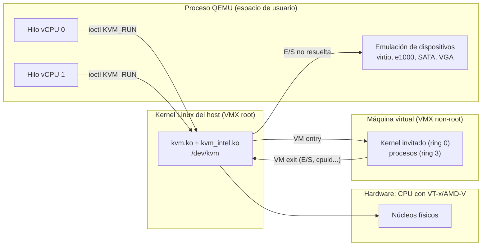
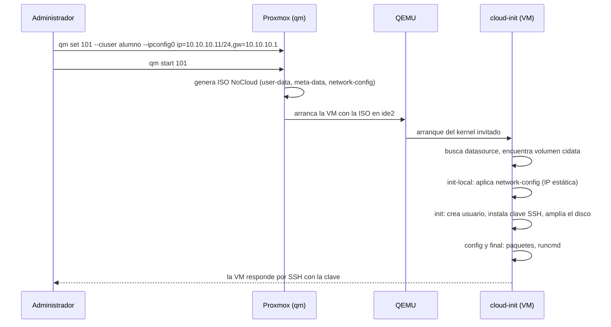
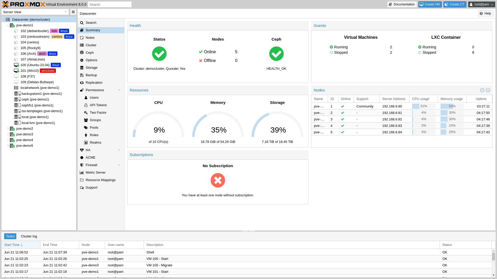

# UT1 · Virtualización e hipervisores

<p class="ut-meta">12 h · Sesiones 1 a 6 · RA1 CE a</p>

Esta es la primera unidad del módulo y la que sostiene todas las demás. Todo lo que vais a desplegar en el curso (las VPC con SDN de la UT2, los cortafuegos y proxies de la UT3, los clústeres de contenedores, los pipelines de Jenkins) corre sobre máquinas virtuales, y esas máquinas virtuales corren sobre un hipervisor que tenéis que saber instalar, configurar y, sobre todo, entender. Vais a montar vuestro propio Proxmox VE, a crear una plantilla con cloud-init de la que saldrán decenas de VM en las próximas semanas y a medir qué aguanta y qué no aguanta vuestro laboratorio. En la UT2 cogeremos ese mismo Proxmox y le añadiremos redes definidas por software para construir una VPC como la de cualquier nube pública.

## Qué tienes que saber hacer al terminar

El criterio de evaluación de esta unidad es el RA1 a: instalar y configurar un hipervisor y conocer sus capacidades y limitaciones. Traducido al laboratorio:

- Instalar Proxmox VE (anidado dentro de otra VM o en hardware real) y dejarlo actualizado, con repositorios correctos y un usuario administrador que no sea root.
- Explicar qué hacen KVM y QEMU, por qué una VM con virtio va más rápida que una con IDE y e1000, y qué implica elegir un tipo de CPU u otro.
- Elegir un almacenamiento (LVM-thin, ZFS, directorio) y un formato de disco (raw, qcow2) sabiendo qué ganas y qué arriesgas con cada uno.
- Construir una plantilla cloud-init, clonarla y depurar el primer arranque cuando la VM no coge la IP o no acepta la clave SSH.
- Decidir entre VM y contenedor LXC con datos, no con intuición.
- Hacer y restaurar snapshots y backups, y saber por qué un snapshot no es un backup.
- Configurar la red del hipervisor: bridge con y sin interfaz física, VLAN-aware, NAT y bonding.
- Medir la capacidad real del hipervisor (CPU, RAM, disco, red) con herramientas estándar y documentar sus límites.

## Qué es virtualizar y para qué sirve

Virtualizar es ejecutar varios sistemas operativos independientes sobre un mismo hardware físico. Un software llamado hipervisor reparte CPU, memoria, disco y red entre las máquinas virtuales (VM) y las mantiene aisladas entre sí. Cada VM cree que tiene un ordenador para ella sola: una BIOS o UEFI, una CPU con sus registros, una controladora de disco, una tarjeta de red. Nada de eso existe físicamente; es el hipervisor el que lo fabrica y el que decide en cada instante qué VM usa el núcleo físico número 3 o quién escribe en el disco.

Se virtualiza por cinco razones que os vais a encontrar en cualquier empresa:

- Consolidación. Un servidor físico de 2024 tiene 32 o 64 núcleos y 256 GB de RAM; ninguna aplicación normal los usa. Con virtualización, ese servidor aloja decenas de VM en lugar de una sola aplicación, y la factura de electricidad y de rack se divide entre todas.
- Aislamiento. Si una VM falla, se cuelga o se compromete, las demás siguen. El hipervisor es la frontera de seguridad.
- Snapshots y clonado. Se guarda el estado de una VM y se vuelve a él en segundos. Antes de una actualización arriesgada, snapshot; si sale mal, rollback y a otra cosa.
- Portabilidad. Una VM se mueve entre hosts sin reinstalar, incluso encendida (migración en vivo). El hardware físico se cambia sin que el servicio se entere.
- Base de la nube. Toda nube pública es, por debajo, hipervisores gestionados a gran escala. Una instancia EC2 de AWS es una VM sobre KVM (Nitro); una VM de Azure corre sobre Hyper-V. Cuando en la UT4 lancéis instancias en la nube, estaréis haciendo con una API lo mismo que haréis aquí con `qm create`.

### VM frente a contenedor

Como ya conocéis Docker, conviene aclarar desde el principio qué relación hay entre lo que vais a hacer en esta unidad y los contenedores del título del módulo.

|  | Máquina virtual | Contenedor |
|----|----|----|
| Qué virtualiza | Hardware completo (CPU, disco, red) | Solo el espacio de usuario; comparte el kernel del host |
| Sistema operativo | Cada VM lleva el suyo, con su propio kernel | Usa el kernel del host |
| Arranque | Segundos a minutos | Milisegundos |
| Tamaño | GB | MB |
| Aislamiento | Fuerte (hipervisor, CPU en modo invitado) | Medio (namespaces, cgroups, seccomp) |
| Caso típico | Servidores completos, distintos SO, seguridad, hipervisor anidado | Aplicaciones, microservicios, CI/CD |

En este curso los contenedores se ejecutan dentro de máquinas virtuales: el hipervisor da la infraestructura y los contenedores dan la aplicación. Es exactamente lo que hace cualquier proveedor cloud con un clúster de Kubernetes gestionado: los nodos son VM. Un contenedor no puede ejecutar otro kernel ni otro sistema operativo, y un proceso que escape de un contenedor está en el kernel del host; un proceso que escape de una VM (cosa muchísimo más rara) está en el hipervisor. Esa diferencia de aislamiento es la razón de que los proveedores no mezclen contenedores de clientes distintos sobre el mismo kernel.

## Tipos de hipervisor

<figure markdown="span">
  { width="640" }
  <figcaption>Hipervisor de tipo 1 (bare metal) frente a tipo 2 (hosted). Fuente: Scsami, CC0, vía Wikimedia Commons.</figcaption>
</figure>

|  | Tipo 1 (bare metal) | Tipo 2 (hosted) |
|----|----|----|
| Dónde se instala | Directamente sobre el hardware | Sobre un sistema operativo de escritorio |
| Rendimiento | Alto | Menor (hay un SO por medio) |
| Uso | Servidores, centros de datos, nube | Pruebas, desarrollo, laboratorio |
| Ejemplos | Proxmox VE (KVM), VMware ESXi, Microsoft Hyper-V, Xen | VirtualBox, VMware Workstation, Parallels |

La clasificación es útil pero tiene una trampa que os preguntaré en clase: KVM es un módulo del kernel de Linux, así que un Debian de escritorio con KVM y virt-manager es técnicamente tipo 1 (el kernel que gestiona las VM es el mismo que gestiona el hardware) aunque lo uséis como si fuera tipo 2. Lo que distingue de verdad a un hipervisor de producción no es la etiqueta sino que el sistema anfitrión esté dedicado y recortado a esa función, con una capa de gestión encima. Eso es Proxmox VE.

En el módulo usaremos Proxmox VE: libre (AGPLv3), basado en Debian, con KVM para VM y LXC para contenedores de sistema, y con una consola web completa. Es lo más parecido a una nube privada que se puede montar en un aula, y desde que Broadcom cambió el licenciamiento de VMware en 2024 es también lo que muchas pymes y centros educativos han adoptado en producción. Proxmox VE 8 está construido sobre Debian 12 (bookworm) y Proxmox VE 9 sobre Debian 13 (trixie); en el laboratorio instalaremos la 9, pero todo lo que hay en estos apuntes vale para las dos salvo donde se indique.

## Cómo funciona KVM/QEMU por debajo

Esto es lo que os diferencia de alguien que solo sabe hacer clic en "Create VM". Cuando arrancáis una VM en Proxmox, ocurren tres cosas a la vez.

**KVM (Kernel-based Virtual Machine)** son dos módulos del kernel de Linux: `kvm.ko`, genérico, y `kvm_intel.ko` o `kvm_amd.ko`, específicos de cada fabricante. KVM no emula nada: lo que hace es usar las extensiones de virtualización de la CPU (Intel VT-x, AMD-V) para ejecutar el código del sistema operativo invitado directamente en el procesador físico, a velocidad nativa. Se dice a menudo que el hipervisor corre en "ring -1": la CPU tiene un modo adicional (VMX root en Intel) en el que corre el kernel del host con KVM, y un modo invitado (VMX non-root) en el que corre la VM con sus propios anillos 0 a 3. El kernel del invitado cree que está en ring 0 y ejecuta instrucciones privilegiadas con normalidad; cuando hace algo que el hipervisor necesita controlar (tocar una tabla de páginas, acceder a un puerto de E/S, ejecutar `cpuid`, recibir una interrupción) la CPU sale del modo invitado (un *VM exit*), KVM atiende la petición y vuelve a entrar (*VM entry*). Cada VM exit cuesta del orden de un microsegundo, y minimizar su número es la clave del rendimiento de cualquier VM. La memoria se gestiona con tablas de páginas anidadas (EPT en Intel, NPT o RVI en AMD), de forma que la traducción de direcciones del invitado a direcciones físicas la hace la MMU en hardware sin intervención del hipervisor.

**QEMU** es un proceso de usuario ordinario, uno por VM (lo veréis con `ps aux | grep kvm` en el host: `/usr/bin/kvm -id 101 -name web01 ...`). Abre `/dev/kvm`, crea la VM y sus vCPU mediante `ioctl()` y lanza un hilo por vCPU que se pasa la vida dentro de una llamada `KVM_RUN`. Mientras la VM ejecuta código normal, ese hilo está bloqueado en el kernel y QEMU no hace nada. Cuando se produce un VM exit que KVM no puede resolver solo (casi siempre E/S), la llamada vuelve a QEMU, que es quien emula los dispositivos: la placa base (i440fx o q35), la controladora SATA, la tarjeta de red, la VGA, el reloj, el firmware (SeaBIOS o OVMF para UEFI). QEMU puede emular una tarjeta Intel e1000 con tal fidelidad que el driver de Windows XP la reconoce; el problema es que cada acceso del driver a un registro de esa tarjeta ficticia es un VM exit y una vuelta a espacio de usuario.



La tercera pieza es la **capa de gestión de Proxmox** (`pve-manager`, `pvedaemon`, `pveproxy`, `pvestatd`), que traduce lo que hacéis en la web o con `qm` en la línea de comandos de QEMU adecuada y en operaciones sobre el almacenamiento. El fichero `/etc/pve/qemu-server/101.conf` es la descripción de la VM; QEMU nunca lo lee, lo lee Proxmox para construir la orden.

### Paravirtualización y virtio

Si QEMU puede emular cualquier tarjeta, ¿por qué no usamos siempre la e1000 que reconoce cualquier sistema? Porque emular hardware real es lento. Un driver de e1000 escribe en decenas de registros por paquete y cada escritura es un VM exit. Con 10 Gbit/s de tráfico, la CPU del host se pasaría el día saliendo y entrando de la VM.

La alternativa es la **paravirtualización**: el sistema invitado sabe que está virtualizado y usa un driver diseñado para hablar con el hipervisor en lugar de fingir que hay hardware. El estándar en KVM es **virtio** (especificación de OASIS). Un dispositivo virtio no tiene registros que emular; tiene colas (*virtqueues*) en memoria compartida entre invitado y QEMU. El invitado encola descriptores de paquetes o de bloques, avisa una vez ("kick") y QEMU procesa el lote. El número de VM exits por operación baja de decenas a uno, o a cero cuando se combina con vhost (el procesado se hace en el kernel del host sin pasar por QEMU).

Por eso en Proxmox las opciones por defecto son las que son y no hay que cambiarlas:

- **Disco: VirtIO SCSI** (`scsihw: virtio-scsi-pci` o mejor `virtio-scsi-single`, que da un hilo de E/S por disco). Frente a IDE o SATA emulados, multiplica el rendimiento de E/S varias veces y añade soporte de descarte de bloques (TRIM), imprescindible con thin provisioning. Existe también `virtio-blk` (bus `virtio0`), algo más antiguo; SCSI es hoy el recomendado porque admite muchos discos por controladora y comandos SCSI reales.
- **Red: virtio (`virtio-net`)**. Es el único modelo que llega a las velocidades de la red física. Se usa `e1000` o `rtl8139` solo con sistemas antiguos sin drivers virtio.
- **Memoria: virtio-balloon**, para el ballooning que veremos después.
- **Consola y agente: virtio-serial**, por donde habla el agente QEMU.

Linux lleva los drivers virtio en el kernel desde hace más de una década, así que cualquier imagen cloud de Debian o Ubuntu arranca con ellos sin hacer nada. Windows no: hay que cargar los drivers de la ISO `virtio-win` durante la instalación, y es el motivo por el que "he instalado Windows y no ve el disco" es una pregunta habitual en los foros de Proxmox.

## Requisitos hardware

- CPU con extensiones de virtualización: Intel VT-x o AMD-V. Sin ellas KVM no funciona. Se comprueba con `egrep -c '(vmx|svm)' /proc/cpuinfo` (debe dar más de 0). Si da 0 en un equipo moderno, la causa casi siempre es que está desactivado en la BIOS/UEFI.
- VT-d / AMD-Vi (IOMMU) para pasar dispositivos físicos a una VM (passthrough). Opcional.
- Virtualización anidada: para instalar Proxmox dentro de una VM (lo que haremos en el laboratorio) hay que activarla en el hipervisor exterior. En un host Linux con KVM, `options kvm-intel nested=1` (o `kvm-amd`) en `/etc/modprobe.d/kvm.conf` y se comprueba con `cat /sys/module/kvm_intel/parameters/nested`. En VirtualBox, "Enable Nested VT-x/AMD-V" en la pestaña de procesador o `VBoxManage modifyvm pve --nested-hw-virt on`. En VMware Workstation, "Virtualize Intel VT-x/EPT or AMD-V/RVI". Si el hipervisor exterior es otro Proxmox, la VM debe tener tipo de CPU `host`. Sin esto, el Proxmox anidado instala pero al arrancar una VM dirá que KVM no está disponible y la ejecutará en emulación pura (TCG), a una velocidad diez o veinte veces menor.
- RAM: el hipervisor consume poco (un Proxmox recién instalado usa alrededor de 1 GB), pero cada VM necesita la suya. Regla de aula: 2 GB por VM de servidor. Si usáis ZFS, sumad lo que reserve la caché ARC (el instalador de Proxmox la limita al 10 % de la RAM, con máximo de 16 GB, desde la 8.1).
- Almacenamiento: SSD. Proxmox usa por defecto LVM-thin (aprovisionamiento ligero: solo ocupa lo escrito). Un disco mecánico con cuatro VM haciendo E/S aleatoria a la vez es la experiencia más frustrante que os puede dar un laboratorio.
- Red: una interfaz basta para empezar; dos permiten separar gestión y tráfico de VM, y tres o cuatro son lo normal en un servidor de producción (gestión, VM, almacenamiento, migración o corosync).

## Proxmox VE

### Arquitectura

Debian + kernel Linux con KVM/QEMU (máquinas virtuales) + LXC (contenedores de sistema) + un servicio de gestión (`pve`) con API REST, consola web en el puerto 8006 y herramientas de línea de comandos. Toda la configuración del clúster vive en `/etc/pve`, que no es un directorio normal sino un sistema de ficheros en memoria (`pmxcfs`) replicado entre nodos y respaldado por una base de datos SQLite; por eso `/etc/pve/qemu-server/101.conf` aparece en todos los nodos de un clúster aunque la VM solo exista en uno.

| Herramienta | Para qué |
|-----------------|--------------------------------------------------------|
| `qm` | Máquinas virtuales: crear, arrancar, clonar, snapshots, migrar |
| `pct` | Contenedores LXC |
| `pvesm` | Almacenamiento: listar, añadir, ver ocupación |
| `pveum` | Usuarios, grupos, roles y permisos |
| `vzdump` | Copias de seguridad |
| `pveam` | Descargar plantillas de contenedor |
| `pvecm` | Clúster: crear, añadir nodos, ver quórum |
| `pveperf` | Medida rápida de CPU y disco del host |

Puertos que conviene tener en la cabeza: 8006 (web y API), 22 (SSH), 5900 a 5999 (consolas VNC), 3128 (proxy SPICE), 5405 a 5412 UDP (corosync, solo en clúster) y 60000 a 60050 (migraciones).

### Almacenamiento

Cada almacén tiene un tipo y un contenido permitido (imágenes de disco, ISOs, plantillas de contenedor, backups, snippets). La instalación por defecto crea dos:

- `local` (tipo directorio, en `/var/lib/vz`): ISOs, plantillas de contenedor, backups y snippets. Puede alojar también discos de VM en formato qcow2 o raw como ficheros en `/var/lib/vz/images/<vmid>/`.
- `local-lvm` (tipo LVM-thin, sobre el volumen `pve/data`): discos de VM y contenedores como volúmenes lógicos de bloques. Aprovisionamiento ligero y snapshots.

Y otros que añadiréis según el caso:

- ZFS: si hay discos de sobra. Snapshots instantáneos, compresión transparente (lz4), sumas de verificación de cada bloque, replicación integrada entre nodos (`pvesr`) y RAID por software sin controladora. A cambio, RAM para la caché ARC y una cierta penalización de escritura por el copy-on-write.
- NFS / CIFS / iSCSI: almacenamiento compartido entre varios nodos, requisito para migrar en vivo sin copiar el disco y para la alta disponibilidad.
- Ceph: almacenamiento distribuido integrado en Proxmox; a partir de tres nodos.
- Proxmox Backup Server: destino de backups deduplicados (más abajo).

Cómo elegir, con lo que pesa cada opción:

| | LVM-thin | ZFS | Directorio (ext4/xfs) |
|---|---|---|---|
| Formato de disco de VM | raw (volumen de bloques) | raw (zvol) | qcow2 o raw (fichero) |
| Snapshots | Sí, de bloques, rápidos | Sí, instantáneos | Solo con qcow2 |
| Thin provisioning | Sí | Sí | Sí con qcow2 (crece bajo demanda) |
| Clones enlazados | Sí | Sí | Sí con qcow2 |
| Integridad de datos | La del disco | Checksums, autocorrección con redundancia | La del sistema de ficheros |
| Coste en RAM | Ninguno | ARC (GB) | Ninguno |
| Cuándo | Un solo disco, laboratorio, lo simple | Varios discos, datos que importan, replicación | Almacén compartido NFS, ISOs, backups |

Sobre los formatos: **raw** es una imagen byte a byte del disco, sin cabecera, lo más rápido y lo que usan LVM y ZFS; **qcow2** (QEMU Copy On Write v2) es un formato de fichero con metadatos que permite crecer bajo demanda, snapshots internos, compresión y una imagen base de la que cuelgan otras (así se hacen los clones enlazados en un directorio). Con qcow2 pagáis una capa de indirección (tablas L1/L2) y una fragmentación que se nota con el tiempo; en un directorio sobre SSD la diferencia con raw es de un 5 a un 10 % en E/S aleatoria, aceptable para laboratorio. Las imágenes cloud se distribuyen en qcow2 porque es lo compacto; al importarlas a LVM-thin Proxmox las convierte a raw automáticamente.

El **thin provisioning** merece un aviso serio. Un almacén de 200 GB puede tener asignados 10 discos de 50 GB (500 GB "prometidos") porque solo ocupan lo escrito. Mientras las VM estén medio vacías, perfecto. El día que dos de ellas se llenen a la vez y el pool llegue al 100 %, LVM-thin no puede atender las escrituras: las VM reciben errores de E/S, sus sistemas de ficheros pasan a solo lectura o se corrompen, y vosotros no podéis ni borrar un snapshot para hacer sitio porque borrar también necesita metadatos. En ZFS el comportamiento es similar cuando el pool se llena, agravado por el copy-on-write. Vigiladlo con `lvs` (columnas `Data%` y `Meta%`) o `zpool list`, y activad el descarte de bloques (`discard=on` en el disco de la VM y `fstrim` periódico dentro del invitado, que Debian ya trae como temporizador de systemd) para que el espacio que la VM libera vuelva al pool. Sin descarte, un pool thin solo crece.

```bash
# Ocupación real del pool thin y de cada disco
lvs pve/data
lvs -o lv_name,lv_size,data_percent pve
# Descarte desde el host, a través del agente QEMU
qm guest cmd 101 fstrim
```

### Red

Proxmox no conecta las VM directamente a la tarjeta física: crea un bridge Linux (`vmbr0`) que actúa como un switch virtual. La tarjeta física se conecta al bridge y las VM se conectan al bridge con interfaces `tap` (una por tarjeta virtual: `tap101i0` es la net0 de la VM 101). La configuración está en `/etc/network/interfaces` y la aplica `ifupdown2` sin reiniciar con `ifreload -a`; la web hace eso mismo cuando pulsáis "Apply Configuration".

```text
auto lo
iface lo inet loopback

iface eno1 inet manual

auto vmbr0
iface vmbr0 inet static
    address 192.168.1.50/24
    gateway 192.168.1.1
    bridge-ports eno1
    bridge-stp off
    bridge-fd 0

auto vmbr1
iface vmbr1 inet static
    address 10.10.10.1/24
    bridge-ports none
    bridge-stp off
    bridge-fd 0
    bridge-vlan-aware yes
    bridge-vids 2-4094
```

Modalidades que vais a usar:

- **Bridge simple** (`vmbr0` con `eno1` como puerto): las VM están en la misma red que el host y reciben IP del router del aula. Es la opción con la que se instala Proxmox y la que os da acceso inmediato a las VM desde vuestro portátil.
- **Bridge sin interfaz física** (`bridge-ports none`): red interna solo entre VM y el host. Lo usaremos para las VPC. Las VM no salen a Internet salvo que alguien enrute por ellas.
- **NAT**: el bridge interno más `ip_forward` y una regla de masquerade en el host, que hace de router. Es cómodo cuando el aula solo os da una IP y queréis muchas VM con salida a Internet sin exponerlas. Se configura con `post-up` en el bridge; la documentación de Proxmox trae el ejemplo exacto. En la UT2 sustituiremos esto por una zona SDN con NAT integrado.
- **VLAN-aware bridge** (`bridge-vlan-aware yes`): un solo bridge transporta varias VLAN; cada VM indica su etiqueta (tag) en la tarjeta virtual y el bridge etiqueta y desetiqueta por ella. El puerto físico debe ser un trunk en el switch del aula si queréis que las VLAN salgan del host; para redes internas no hace falta. Es la forma de tener tres redes aisladas con un solo bridge, que es lo que haréis en la actividad A1.5.
- **Bond**: varias tarjetas físicas agrupadas para redundancia o ancho de banda. Modos que se ven en producción: `active-backup` (no requiere nada en el switch; una tarjeta activa y otra en espera), `802.3ad` o LACP (requiere configurar el agregado en el switch; reparte tráfico y suma ancho de banda entre conexiones distintas, nunca dentro de una misma) y `balance-xor`. El bond se crea como interfaz `bond0` y es `bond0`, no las tarjetas, lo que se pone como puerto del bridge.

```text
auto bond0
iface bond0 inet manual
    bond-slaves eno1 eno2
    bond-miimon 100
    bond-mode 802.3ad
    bond-xmit-hash-policy layer3+4

auto vmbr0
iface vmbr0 inet static
    address 192.168.1.50/24
    gateway 192.168.1.1
    bridge-ports bond0
    bridge-stp off
    bridge-fd 0
```

!!! warning "Cambiar la red del host a distancia"
    Un error en `/etc/network/interfaces` os deja sin acceso al Proxmox. Si el laboratorio es anidado, tenéis la consola de la VM exterior y no pasa nada; en un servidor real, haced los cambios desde la web (que valida y aplica con `ifreload`) o dejad un `sleep 120 && ifreload -a` programado con la configuración antigua a mano. Y antes de tocar `vmbr0`, comprobad qué interfaz física es la buena con `ip -br link` y `ethtool eno1`.

### Usuarios y permisos

Los usuarios pertenecen a un realm (`pam` = usuarios Linux del host, `pve` = usuarios propios de Proxmox, almacenados en `/etc/pve/user.cfg`; también hay LDAP, Active Directory y OpenID Connect). Los permisos se asignan como un rol (conjunto de privilegios: `Administrator`, `PVEAdmin`, `PVEVMAdmin`, `PVEVMUser`, `PVEAuditor`, `PVEDatastoreUser`...) sobre una ruta del árbol de objetos (`/`, `/vms/100`, `/storage/local`, `/nodes/pve1`), con o sin propagación a los hijos. Buena práctica: no trabajar como `root@pam`; crear un usuario administrador en el realm `pve` y reservar root para lo que solo root puede hacer (algunas operaciones del nodo y la consola del host). Los tokens de API, que usaréis con OpenTofu en la UT5, se crean sobre un usuario y heredan o restringen sus permisos.

```bash
pveum user add admin@pve --password 'CambiaEsto' --comment "Administrador del laboratorio"
pveum acl modify / --users admin@pve --roles Administrator
pveum user list
pveum acl list
```

## Máquinas virtuales en Proxmox

### Crear una VM: los parámetros que importan

- ID (100 en adelante, único en el clúster) y nombre. Reservad un rango para plantillas (9000 en adelante es la costumbre).
- ISO de instalación o imagen de disco importada (plantilla).
- Disco: bus `scsi` con controladora `VirtIO SCSI single`, formato raw sobre `local-lvm`, `discard=on` y `ssd=1` si el almacén es SSD (el invitado lo trata como SSD y hace TRIM). Tamaño en GB; con thin, sed generosos en tamaño pero conscientes de lo que suma.
- CPU: número de núcleos (`cores`) y sockets (dejad 1 socket) y tipo, que tiene sección propia más abajo.
- Memoria: fija o con ballooning (mínimo y máximo; el host reclama la que no se usa).
- Red: modelo virtio, bridge y, si procede, etiqueta VLAN y cortafuegos de Proxmox activado.
- Firmware y máquina: SeaBIOS con i440fx por defecto; OVMF (UEFI) con q35 si vais a hacer passthrough de PCIe, Secure Boot o Windows 11 (que además exige un TPM virtual).
- Agente QEMU: instalarlo dentro de la VM (`apt install qemu-guest-agent`) y activarlo en la VM (`--agent enabled=1`) para que Proxmox vea su IP, pueda apagarla limpiamente, congelar el sistema de ficheros durante un backup y ejecutar `fstrim`.

```bash
qm create 101 --name web01 --memory 2048 --balloon 1024 --cores 2 --cpu x86-64-v2-AES \
  --scsihw virtio-scsi-single --scsi0 local-lvm:20,discard=on,ssd=1 \
  --net0 virtio,bridge=vmbr1,tag=10 --ostype l26 --agent enabled=1
qm config 101
```

### Tipos de CPU y su efecto en la migración

Cuando el kernel invitado ejecuta `cpuid`, KVM le responde con lo que Proxmox haya configurado, no necesariamente con la CPU real. Esa respuesta determina qué instrucciones cree tener disponibles el invitado (AVX, AES-NI, SSE4.2...), y los compiladores y las bibliotecas eligen rutas de código en función de ella.

| Tipo | Qué expone | Ventaja | Inconveniente |
|---|---|---|---|
| `host` | Todas las banderas de la CPU física | Máximo rendimiento; necesario para virtualización anidada y para algunas cargas (AVX-512, compilación) | La VM solo puede migrar en vivo a un host con exactamente la misma CPU; si cambia de máquina, el invitado puede caer con "illegal instruction" |
| `x86-64-v2-AES` | Nivel de microarquitectura v2 (SSE4.2, SSSE3, POPCNT, CX16) más AES-NI | Por defecto para VM nuevas desde Proxmox VE 8; funciona en cualquier CPU desde 2010 y migra entre hosts distintos | Sin AVX/AVX2: cargas numéricas o de cifrado moderno van más lentas |
| `x86-64-v3`, `x86-64-v4` | v2 más AVX, AVX2, BMI, FMA (v3); más AVX-512 (v4) | Buen compromiso en un clúster homogéneo moderno | Exige que todos los nodos tengan esas banderas |
| `kvm64` | Un Pentium 4 con extensiones mínimas | Corre en cualquier sitio; era el valor por defecto hasta la 7 | Muy pobre: sin SSE4, sin AES-NI; muchas distribuciones actuales lo rechazan porque exigen x86-64-v2 |
| Modelos con nombre (`EPYC-Rome`, `Skylake-Server`...) | Las banderas de esa familia concreta | Reproducible y portable dentro de una gama | Hay que saber qué tenéis |

En el laboratorio, anidado y con un solo nodo, `host` es lo razonable para el Proxmox interior (así puede virtualizar a su vez) y `x86-64-v2-AES` para las VM que creéis dentro, que es lo que os pondrá Proxmox si no decís nada. En una empresa con un clúster de nodos comprados en años distintos, se elige el mínimo común denominador (a menudo v2 o v3) o se define un modelo de CPU propio en `/etc/pve/virtual-guest/cpu-models.conf` para toda la organización. Cambiar el tipo de CPU exige apagar y encender la VM; un reinicio desde dentro no basta.

### cloud-init

<figure markdown="span">
  { width="160" }
  <figcaption>cloud-init. Fuente: dominio público, vía Wikimedia Commons.</figcaption>
</figure>

**cloud-init** es el estándar para configurar una VM en el primer arranque: usuario, contraseña o clave SSH, nombre de host, red, paquetes, comandos. Lo usan todas las nubes (AWS, Azure, GCP, OpenStack) y todas las imágenes cloud de Debian, Ubuntu, Rocky o Fedora lo llevan instalado y activado. Es un servicio que arranca antes que la red, busca una fuente de datos (*datasource*), lee de ella la configuración y la aplica en cuatro etapas: `init-local` (configura la red a partir de `network-config`), `init` (con red: usuarios, claves SSH, redimensionado del disco), `modules:config` y `modules:final` (paquetes, `runcmd`, mensaje de fin). Todo se registra en `/var/log/cloud-init.log` (detallado) y `/var/log/cloud-init-output.log` (salida de los comandos).

Proxmox lo integra con el datasource **NoCloud**: genera al vuelo una imagen ISO de unos 4 MB con etiqueta `cidata` que contiene tres ficheros (`user-data`, `meta-data` y `network-config`), la conecta a la VM como un CD-ROM (`ide2: local-lvm:vm-101-cloudinit`) y cloud-init la encuentra al arrancar buscando un volumen con esa etiqueta. Cada vez que cambiáis un parámetro cloud-init en la VM (`--ciuser`, `--ipconfig0`, `--sshkeys`, `--nameserver`), Proxmox regenera la ISO en el siguiente arranque. Podéis ver exactamente lo que va a recibir la VM sin arrancarla:

```bash
qm cloudinit dump 101 user
qm cloudinit dump 101 network
qm cloudinit dump 101 meta
```

El `user-data` que genera Proxmox es deliberadamente corto (hostname, usuario, contraseña cifrada, claves SSH, `package_upgrade` si lo marcáis). Si necesitáis más (instalar el agente QEMU, crear varios usuarios, ejecutar comandos), escribís vuestro propio fichero YAML en el almacén `local` como snippet y lo referenciáis con `--cicustom "user=local:snippets/web.yaml"`; en ese caso Proxmox deja de generar el `user-data` y usa el vuestro tal cual, pero sigue generando la red. Esto es lo que haréis en la UT5 desde OpenTofu.

```yaml
#cloud-config
hostname: web01
users:
  - name: alumno
    groups: [sudo]
    shell: /bin/bash
    sudo: ALL=(ALL) NOPASSWD:ALL
    ssh_authorized_keys:
      - ssh-ed25519 AAAAC3NzaC1lZDI1NTE5AAAA... alumno@portatil
package_update: true
packages:
  - qemu-guest-agent
runcmd:
  - systemctl enable --now qemu-guest-agent
```



Cómo depurarlo cuando no funciona, que os pasará:

```bash
# Dentro de la VM (por la consola noVNC de Proxmox si no hay SSH)
cloud-init status --long        # done / running / error, y con --long el detalle
cloud-init query -a | head -50  # qué datasource encontró y qué metadatos leyó
grep -iE "warn|error|traceback" /var/log/cloud-init.log
cat /var/log/cloud-init-output.log
# Forzar que se vuelva a ejecutar como si fuera el primer arranque
cloud-init clean --logs && reboot
```

Dos detalles que ahorran horas. Primero: cloud-init guarda en `/var/lib/cloud/instance` que ya se ejecutó para esa instancia (identificada por el `instance-id` del `meta-data`); si clonáis una VM ya arrancada en lugar de una plantilla limpia, el clon cree que ya está configurado y no aplica nada. Por eso la plantilla nunca se arranca. Segundo: el disco de la imagen cloud es pequeño (2 GB en Debian) y cloud-init lo amplía al tamaño del volumen en el primer arranque (`growpart` + `resizefs`), pero solo si le habéis dado ese tamaño antes de arrancar (`qm disk resize 101 scsi0 +18G`, o `qm resize` en versiones anteriores).

### Plantillas y clonado

Flujo de trabajo de aula (y de producción):

1. Descargar una imagen cloud de Debian o Ubuntu (formato qcow2).
2. Crear una VM con esa imagen como disco y añadir el disco cloud-init.
3. Convertirla en plantilla (`qm template`): ya no se puede arrancar, solo clonar. Internamente Proxmox marca el disco base como solo lectura.
4. Clonar: **linked clone** (rápido, comparte el disco base con la plantilla y solo escribe las diferencias en un volumen propio; para pruebas y aulas) o **full clone** (independiente, copia completa del disco; para producción y para poder borrar la plantilla o moverlo a otro almacén).
5. Cada clon recibe su configuración por cloud-init: IP, usuario, clave.

Así, crear una VM nueva pasa de 20 minutos de instalación a 20 segundos. Un linked clone sobre LVM-thin tarda menos de un segundo porque no copia nada; un full clone de 20 GB tarda lo que tarde el disco en copiar lo que hay escrito (unos segundos en SSD para una imagen de 2 GB reales). El precio del linked clone es la dependencia: no podéis borrar la plantilla mientras exista un clon, y todos los clones leen de los mismos bloques base, lo que en disco mecánico se nota.

### Snapshots

Un snapshot es una foto del disco (y opcionalmente la RAM, si la VM está encendida y marcáis "include RAM") en un momento. Se vuelve a ella con un clic o con `qm rollback 101 antes-nginx`. No es una copia de seguridad: vive en el mismo disco y en el mismo almacén que la VM; si muere el SSD, mueren los dos.

Cómo se hace depende del almacén:

- En **LVM-thin**, el snapshot es un volumen lógico nuevo (`snap_vm-101-disk-0_antes-nginx`) que comparte todos los bloques con el disco original. A partir de ese momento cada escritura de la VM sobre un bloque compartido se hace en un bloque nuevo (copy-on-write a nivel de bloque del pool). El snapshot ocupa cero al crearse y va creciendo con lo que la VM modifique. La lista está en `lvs pve`.
- En **ZFS** es igual pero a nivel de sistema de ficheros: `zfs list -t snapshot`. Crear y destruir es instantáneo.
- En un **directorio con qcow2**, el snapshot es interno al fichero: qcow2 guarda una tabla de snapshots y hace copy-on-write de sus propios clústeres. `qemu-img snapshot -l vm-101-disk-0.qcow2` los lista. Con raw en un directorio no hay snapshots.

En cualquiera de los tres, cada snapshot activo añade una capa de indirección a las lecturas y escrituras. Tres o cuatro no se notan; veinte encadenados durante meses sí, y además consumen espacio del pool que nadie ve en el disco de la VM. La costumbre correcta es snapshot antes de una operación arriesgada y borrarlo (o consolidarlo) en cuanto se confirma que todo va bien. El agente QEMU permite congelar el sistema de ficheros del invitado un instante mientras se hace el snapshot, de modo que sea consistente; sin agente, el snapshot equivale a un corte de corriente y el invitado tendrá que revisar el sistema de ficheros al restaurar.

```bash
qm snapshot 101 antes-nginx --description "Antes de instalar nginx"
qm listsnapshot 101
qm rollback 101 antes-nginx
qm delsnapshot 101 antes-nginx
```

### Backups con vzdump y Proxmox Backup Server

`vzdump` es la herramienta de copia de seguridad integrada: copia completa de la VM (configuración y discos) a otro almacén, programable desde Datacenter > Backup. Tres modos: `stop` (apaga la VM, copia, la enciende; el único con consistencia total garantizada), `suspend` (la pausa mientras copia) y `snapshot` (el habitual: hace un snapshot temporal, copia desde él mientras la VM sigue funcionando y lo borra al terminar; con el agente QEMU congela el sistema de ficheros para que sea consistente). El resultado es un fichero `.vma.zst` (VM) o `.tar.zst` (contenedor) en el directorio `dump` del almacén elegido, por ejemplo `/var/lib/vz/dump/vzdump-qemu-101-2026_10_16-10_30_00.vma.zst`. Se restaura con `qmrestore` o desde la web, con la posibilidad de cambiar el ID y el almacén de destino.

```bash
vzdump 101 --storage local --mode snapshot --compress zstd --notes-template "{{guestname}}"
ls -lh /var/lib/vz/dump/
qmrestore /var/lib/vz/dump/vzdump-qemu-101-*.vma.zst 111 --storage local-lvm
```

El problema de vzdump a ficheros es que cada backup es completo: 20 VM de 20 GB con backup diario y retención de 14 días son 5,6 TB. **Proxmox Backup Server** (PBS) es un producto aparte, también libre, que resuelve eso: parte los discos en trozos de 4 MB, guarda cada trozo una sola vez (deduplicación entre backups y entre VM), aprovecha el mapa de bloques modificados que QEMU mantiene desde el último backup (*dirty bitmap*) para leer solo lo cambiado, y añade verificación de integridad, cifrado en el cliente, retención con reglas (`keep-daily`, `keep-weekly`...) y sincronización a un segundo PBS remoto. En una empresa con Proxmox, PBS es la opción normal; en el laboratorio no lo montaremos, pero conviene que sepáis que existe y que "backup a `local`" es lo mínimo, no lo correcto.

## LXC frente a VM, con números

Proxmox ofrece contenedores de sistema LXC junto a las VM. Un contenedor LXC no es un contenedor Docker: ejecuta un sistema operativo completo desde `init` (systemd, sshd, cron), no un solo proceso, pero sin kernel propio. Comparte el kernel del host con aislamiento por namespaces y cgroups, igual que Docker, y Proxmox lo gestiona como si fuera una VM ligera (consola, snapshots, backups, migración en frío).

```bash
pveam update
pveam available --section system | grep debian
pveam download local debian-12-standard_12.7-1_amd64.tar.zst
pct create 200 local:vztmpl/debian-12-standard_12.7-1_amd64.tar.zst \
  --hostname ct01 --memory 512 --cores 1 --rootfs local-lvm:4 \
  --net0 name=eth0,bridge=vmbr0,ip=dhcp --unprivileged 1 --features nesting=1
pct start 200
pct enter 200
```

Lo que medimos en clase el curso pasado sobre un portátil con SSD NVMe y un Proxmox anidado (vuestros números variarán, por eso los vais a tomar en la actividad A1.4):

| | VM Debian (2 vCPU, 2 GB, virtio) | LXC Debian (1 núcleo, 512 MB) |
|---|---|---|
| Arranque hasta prompt SSH | 12 a 18 s | menos de 2 s |
| RAM usada en el host en reposo | 350 a 450 MB (RAM tocada por el invitado más QEMU) | 25 a 40 MB |
| Espacio en disco tras instalar | 1,3 GB (imagen cloud desplegada) | 450 MB |
| `uname -r` | El kernel de la imagen cloud (6.1 en Debian 12, 6.12 en Debian 13) | El kernel del host Proxmox (6.x de Proxmox) |
| Sobrecarga de CPU | 2 a 5 % en cargas normales, más en E/S intensa | Prácticamente cero |
| Densidad en un host de 32 GB | 10 a 12 VM de 2 GB | 60 o más contenedores de 512 MB |

Por qué no lo usamos para todo:

- Comparten kernel: menor aislamiento; un fallo del kernel afecta a todos, y un contenedor privilegiado con acceso a `/dev` es root en el host. Usad siempre `unprivileged 1` salvo que sepáis por qué no.
- No ejecutan otro kernel ni otro sistema operativo: nada de Windows, nada de FreeBSD, nada de módulos de kernel propios, nada de hipervisor anidado.
- Docker dentro de LXC funciona (con `nesting=1` y `keyctl=1`) pero es una configuración que Proxmox desaconseja oficialmente en producción; Docker se ejecuta en una VM.
- No hay migración en vivo de contenedores; se migran apagados (o con un reinicio muy corto).

La regla práctica: servicios de infraestructura pequeños y Linux (DNS, un proxy, un Pi-hole, un runner de Jenkins) en LXC; todo lo que sea plataforma de contenedores, cargas con kernel propio o algo que necesite migración en vivo, en VM. En este módulo casi todo irá en VM precisamente porque vamos a ejecutar Docker y clústeres encima.

## Clúster y migración en vivo

No lo montaremos en el laboratorio (haría falta un segundo nodo con la misma red y, para que tenga sentido, almacenamiento compartido), pero es lo primero que veréis en una empresa y explica varias decisiones de diseño de esta unidad.

<figure markdown="span">
  { width="640" }
  <figcaption>Resumen de un clúster de tres nodos en Proxmox VE 8. Fuente: Proxmox Server Solutions GmbH, dominio público, vía Wikimedia Commons.</figcaption>
</figure>

Varios nodos Proxmox se unen en un clúster (`pvecm create`, `pvecm add`) que comparte `/etc/pve` a través de corosync, un protocolo de mensajería con quórum: para que el clúster tome decisiones necesita mayoría de nodos (por eso los clústeres son de tres o cinco, no de dos; con dos, si cae uno el otro se queda sin quórum y no os deja ni arrancar VM). Desde una sola consola web se administran todos los nodos.

La migración en vivo (`qm migrate 101 pve2 --online`) mueve una VM encendida de un nodo a otro sin que los usuarios lo noten: QEMU copia la RAM al destino mientras la VM sigue trabajando, va recopiando las páginas que se ensucian, y cuando queda poco por copiar pausa la VM unas decenas de milisegundos, transfiere el resto y el estado de la CPU, y la reanuda en el destino. Con almacenamiento compartido (NFS, Ceph, iSCSI) el disco no se mueve; con almacenamiento local Proxmox también puede copiarlo (`--with-local-disks`), pero tardará lo que tarde el disco. Aquí es donde el tipo de CPU importa: si la VM es `host` y los dos nodos tienen CPU distintas, la migración se rechaza o el invitado se rompe al llegar. Y sobre el clúster se monta la alta disponibilidad (HA): si un nodo muere, sus VM marcadas como HA se arrancan automáticamente en otro, cosa que también exige almacenamiento compartido y, en Proxmox, *fencing* por watchdog para asegurarse de que el nodo caído no siga escribiendo.

## Capacidades y limitaciones, y cómo medirlas

| Capacidad | Qué permite | Límite o riesgo |
|----|----|----|
| Sobreasignación de CPU | Dar más vCPU en total que núcleos físicos (4:1 es habitual en cargas de oficina) | Si todas trabajan a la vez, se degrada todo; el *steal time* dentro de las VM lo delata |
| Ballooning de RAM | Recuperar memoria no usada (Proxmox empieza a reclamarla cuando el host pasa del 80 %) | Nunca sobreasignar más de lo físico + swap; el invitado necesita el driver virtio-balloon, y la RAM reclamada sale de su caché de disco, así que rinde peor |
| KSM | Deduplicar páginas idénticas entre VM (mismo SO, mismas bibliotecas) | Consume CPU en el host y puede filtrar información entre VM por canales laterales; en entornos multi-inquilino se desactiva |
| Hotplug | Añadir disco, red, CPU o RAM en caliente | Depende del SO invitado; RAM requiere `numa=1` y que el invitado active los DIMM nuevos; la CPU en caliente solo con `vcpus` menor que `cores` |
| Virtualización anidada | Hipervisor dentro de VM | Rendimiento reducido (cada VM exit del hipervisor interior es un VM exit del exterior); solo laboratorio |
| Passthrough (IOMMU) | Dar una GPU, una controladora o una NIC a una VM | El dispositivo deja de estar disponible para el host y la VM ya no puede migrar en vivo |
| LXC | Contenedores de sistema muy ligeros | Comparten kernel: menor aislamiento; no ejecutan otro kernel |
| Snapshots | Volver atrás en segundos | Muchos snapshots encadenados frenan el disco y llenan el pool |
| Thin provisioning | Prometer más disco del que hay | Pool lleno = VM corruptas; hay que vigilar y descartar |

Regla de oro: medir antes de sobreasignar. Un hipervisor de aula con 32 GB no debe albergar 20 VM de 2 GB "porque no las usamos todas a la vez". Tarde o temprano se usan, y lo que ocurre entonces (el kernel del host mata la VM que más memoria tiene, sin avisar, con el OOM killer) es mucho peor que haber puesto 12.

Lo que os pido en la práctica evaluable es precisamente una tabla como la de arriba, pero con las medidas de vuestro laboratorio. Herramientas, todas en los repositorios de Debian (`apt install stress-ng fio iperf3 sysstat`):

```bash
# Inventario del host
nproc; lscpu | grep -E "Model name|Thread|Core|Socket|Flags" | cut -c1-120
free -h                              # RAM total, usada, disponible (no "free")
pvesm status                         # almacenes y ocupación
lvs pve/data                         # % de datos y metadatos del pool thin
cat /sys/module/kvm_intel/parameters/nested   # Y si la anidada está activa

# CPU: cuántos núcleos reales hay detrás de las vCPU
pveperf                              # BOGOMIPS, REGEX/SECOND, FSYNCS/SECOND del host
stress-ng --cpu 4 --timeout 60s --metrics-brief   # dentro de una VM; repetir en dos VM a la vez
top                                  # dentro de la VM, columna "st" (steal): CPU que el host no le dio

# Disco: latencia y IOPS reales (dentro de la VM, sobre el disco virtio)
fio --name=rand4k --ioengine=libaio --rw=randrw --rwmixread=70 --bs=4k --size=1G \
    --numjobs=1 --iodepth=32 --direct=1 --runtime=60 --time_based --group_reporting
fio --name=seq1m --ioengine=libaio --rw=write --bs=1M --size=2G --direct=1 --group_reporting

# Red: ancho de banda entre dos VM del mismo bridge y entre VM y host
iperf3 -s                            # en una VM
iperf3 -c 10.10.10.11 -t 30 -P 4     # desde la otra

# Memoria: cuánto libera el ballooning
qm monitor 101   # y dentro: info balloon
```

Anotad no solo el resultado sino la condición: "fio 4k aleatorio 70/30 en web01 con app-eval parada: 18 000 IOPS; con app-eval ejecutando el mismo fio: 9 500 IOPS cada una". Ese segundo número es el límite del hipervisor; el primero es solo lo que hace un SSD. Lo mismo con iperf3: entre dos VM del mismo bridge veréis 10 a 20 Gbit/s aunque la tarjeta física sea de 1 Gbit/s, porque el tráfico nunca sale del host; hacia fuera, lo que dé la tarjeta.

## Errores frecuentes en el laboratorio

**"KVM virtualisation configured, but not available" al arrancar la primera VM en el Proxmox anidado.** La virtualización anidada no está activada en el hipervisor exterior, o la VM exterior no tiene CPU `host`. Comprobad `cat /sys/module/kvm_intel/parameters/nested` en el Proxmox: si dice `N`, el problema está fuera. Como parche para salir del paso, `kvm: 0` en la configuración de la VM la ejecuta en emulación (lentísima); no es una solución.

**Proxmox no actualiza: "401 Unauthorized" en `apt update`.** Sigue activo el repositorio `pve-enterprise`, que exige suscripción. Desactivadlo y añadid `pve-no-subscription` (en la web: nodo > Updates > Repositories). En Proxmox VE 9 los repositorios están en formato deb822 en `/etc/apt/sources.list.d/*.sources`; en la 8, en `*.list`. Mientras esté el enterprise, `apt` fallará aunque el resto esté bien.

**La VM clonada no coge IP o no acepta la clave SSH.** Por orden de probabilidad: (1) el disco cloud-init no está en la VM (`qm config 101 | grep cloudinit`); (2) la plantilla se arrancó antes de convertirla y el clon cree que ya está inicializado (`cloud-init clean --logs` dentro y reiniciar, y rehacer la plantilla bien); (3) la clave se pegó con saltos de línea o sin el `ssh-ed25519` inicial (`qm cloudinit dump 101 user` lo muestra); (4) `--ipconfig0` no se puso y la imagen no usa DHCP por defecto en esa interfaz. `cloud-init status --long` y `/var/log/cloud-init.log` en la consola noVNC resuelven el 90 %.

**El clon arranca pero el disco sigue teniendo 2 GB.** El `resize` se hizo después del primer arranque o no se hizo. `growpart` y `resizefs` solo actúan en el primer arranque; después, `qm disk resize 101 scsi0 +18G` y dentro `growpart /dev/sda 1 && resize2fs /dev/sda1` a mano.

**"TASK ERROR: storage 'local-lvm' does not support content type 'iso'"** o al revés con imágenes. Cada almacén admite unos contenidos: las ISO y plantillas van a `local`, los discos a `local-lvm`. Se cambia en Datacenter > Storage, pero lo normal es usar cada uno para lo suyo.

**El pool thin se llena y las VM se quedan en solo lectura.** `lvs pve/data` con `Data%` cerca de 100. Liberar: borrar snapshots viejos, backups que hayáis dejado en `local-lvm` por error, VM de prueba. Luego `fstrim` en todas las VM con `discard=on`. Y a partir de ahí, dimensionar: la suma de discos asignados no debería pasar del doble del pool en un laboratorio.

**El agente QEMU aparece como "not running" aunque está instalado.** Falta `--agent enabled=1` en la VM (se añade y se apaga y enciende la VM, no basta un reinicio) o dentro el servicio no está activo (`systemctl status qemu-guest-agent`). Las imágenes cloud de Debian no lo traen instalado.

**Las VM en VLAN 10 y 20 se ven entre sí.** El bridge no es VLAN-aware (falta `bridge-vlan-aware yes` y aplicar la configuración) o las VM se conectaron sin `tag`. `bridge vlan show` en el host muestra en qué VLAN está cada `tap`.

**Ping entre VM de la red interna funciona pero no salen a Internet.** Es lo esperado en un bridge sin puerto físico. O ponéis NAT en el host (`ip_forward` y `MASQUERADE` hacia `vmbr0`), o esperáis a la UT2 y lo hacéis con SDN.

**Rendimiento de disco pésimo en la VM (cientos de IOPS).** Disco en bus IDE o SATA en lugar de VirtIO SCSI, o caché de disco en `writethrough` sobre disco mecánico, o el host anidado con disco de VirtualBox en formato dinámico sobre un disco lento. Comprobad `qm config` y medid con `fio` en el host y en la VM para localizar la capa que frena.

**"illegal instruction" en un programa dentro de la VM tras moverla de portátil.** La VM tenía CPU `host` en un equipo con AVX y ahora corre en uno sin él. Cambiad a `x86-64-v2-AES` y apagad y encended.

## Actividades

Todas se hacen en el laboratorio. Entrega: capturas y respuestas en un documento breve (una página por actividad) salvo que se indique otra cosa.

### A1.1 Instalar Proxmox VE (sesión 1)

1. Comprueba en tu equipo que hay virtualización activada (`egrep -c '(vmx|svm)' /proc/cpuinfo` en Linux, o en la BIOS/UEFI; en Windows, la pestaña Rendimiento del Administrador de tareas muestra "Virtualización: habilitado").
2. Crea una VM en VirtualBox/VMware con 4 vCPU, 8 GB de RAM, 60 GB de disco, virtualización anidada activada, red en modo puente.
3. Instala Proxmox desde la ISO (la última 9.x de la web de Proxmox). Deja el sistema de ficheros por defecto (ext4 con LVM-thin). Anota: IP de gestión, nombre de host, contraseña de root.
4. Accede a `https://IP:8006` (el certificado autofirmado dará aviso; es normal) y captura el panel principal.

Preguntas: ¿qué tipo de hipervisor es Proxmox? ¿Y el que has usado para alojarlo? ¿Qué devuelve `cat /sys/module/kvm_intel/parameters/nested` (o `kvm_amd`) dentro de tu Proxmox, y qué significa?

### A1.2 Configuración inicial (sesión 2)

1. Cambia los repositorios a los "no-subscription" (desactiva `pve-enterprise` y `ceph` enterprise, añade `pve-no-subscription`) y actualiza (`apt update && apt full-upgrade`). Reinicia si ha cambiado el kernel.
2. Revisa el almacenamiento: qué contenido admite `local` y qué admite `local-lvm`. Anota el tamaño del pool thin (`lvs pve/data`).
3. Crea un usuario `admin` en el realm `pve` con rol `Administrator` sobre `/`. A partir de ahora, entra con él.
4. Crea un segundo bridge `vmbr1` sin interfaz física (será la red interna), con dirección `10.10.10.1/24` en el host.
5. Instala en el host `stress-ng`, `fio` e `iperf3`; los usarás en la práctica.

Entrega: captura de `/etc/network/interfaces` y de la lista de usuarios (`pveum user list`).

### A1.3 Plantilla cloud-init y clonado (sesión 3)

Con Debian 13 (trixie); si tu Proxmox es 8, la imagen de bookworm (`debian-12-genericcloud-amd64.qcow2`) funciona igual.

```bash
wget https://cloud.debian.org/images/cloud/trixie/latest/debian-13-genericcloud-amd64.qcow2
qm create 9000 --name debian-tpl --memory 2048 --cores 2 --cpu x86-64-v2-AES \
   --net0 virtio,bridge=vmbr0 --scsihw virtio-scsi-single --ostype l26
qm set 9000 --scsi0 local-lvm:0,import-from=/root/debian-13-genericcloud-amd64.qcow2,discard=on,ssd=1
qm set 9000 --ide2 local-lvm:cloudinit --boot order=scsi0 --agent enabled=1 --serial0 socket --vga serial0
qm set 9000 --ciuser alumno --sshkeys ~/.ssh/id_ed25519.pub --ipconfig0 ip=dhcp
qm disk resize 9000 scsi0 20G
qm template 9000
qm clone 9000 101 --name web01 --full
qm start 101
qm guest cmd 101 network-get-interfaces   # fallará hasta que instales el agente dentro
```

Antes de convertir en plantilla, genera el par de claves en el host si no lo tienes (`ssh-keygen -t ed25519`). Tras arrancar `web01`, entra por SSH como `alumno`, instala `qemu-guest-agent` y comprueba en la web que Proxmox muestra la IP de la VM. Opcional: haz lo mismo con un snippet `--cicustom` que instale el agente automáticamente.

Entrega: acceso por SSH a `web01`, salida de `qm list` y de `cloud-init status --long` dentro de la VM. Explica la diferencia entre clon completo y enlazado, y comprueba con `lvs pve` cuánto ocupa cada uno tras crear un linked clone (`qm clone 9000 102 --name web02`, sin `--full`).

### A1.4 VM frente a LXC, snapshots (sesión 4)

1. Crea un contenedor LXC Debian (`pct create`, no privilegiado) con 512 MB de RAM. Compara con la VM: tiempo de arranque (`systemd-analyze` dentro de cada uno, o cronómetro hasta que responda SSH), RAM usada en el host (`free -h` antes y después de arrancar cada uno) y `uname -r` en ambos.
2. Haz un snapshot de `web01`, instala nginx, vuelve al snapshot. ¿Sigue nginx? Mira `lvs pve` antes y después del snapshot y explica qué volumen apareció.
3. Lanza un backup de `web01` a `local` en modo snapshot y localiza el fichero. Anota tamaño y tiempo. Restáuralo como VM 111.

Entrega: tabla comparativa VM/LXC con tus medidas y capturas.

### A1.5 Redes: VLAN (sesión 5)

1. Marca `vmbr1` como VLAN aware.
2. Clona dos VM (net0 en `vmbr1`, tag 10) y una tercera con tag 20. IPs manuales por cloud-init: `192.168.10.11/24`, `192.168.10.12/24` y `192.168.20.11/24`.
3. Comprueba que las de la VLAN 10 se ven entre sí y no ven a la 20. Con `bridge vlan show` en el host, identifica en qué VLAN está cada interfaz `tap`.
4. Opcional: mide con `iperf3` el ancho de banda entre las dos VM de la VLAN 10.

Entrega: esquema (Mermaid o dibujo) y capturas de ping.

## Práctica evaluable

Se realiza en la sesión 6 (23 de octubre) sobre el Proxmox que has montado en las sesiones anteriores.

**Enunciado.** Despliega desde tu plantilla una VM llamada `app-eval` con 2 vCPU, 3 GB de RAM con ballooning (mínimo 1 GB), disco de 20 GB, red en `vmbr1` VLAN 30, usuario `ops` con clave SSH y agente QEMU funcionando.

**Entrega.** Un informe (máximo 3 páginas) con:

- [ ] Comandos o capturas del proceso (clonado, `qm set`, cloud-init, instalación del agente).
- [ ] Evidencia de que la VM cumple lo pedido: `qm config app-eval`, `free -h` y `nproc` dentro de la VM, `lsblk`, IP en la VLAN 30 visible en la web de Proxmox gracias al agente, acceso SSH como `ops`.
- [ ] Una tabla de capacidades y limitaciones del hipervisor de tu laboratorio (CPU, RAM, disco, red, anidada) con al menos una medida real de cada una, tomada con las herramientas de la sección de capacidades, e indicando en qué condiciones se tomó.

| Criterio (RA1 a) | Peso |
|----|----|
| Hipervisor instalado y configurado correctamente (repos, usuario, red) | 30 % |
| VM cumple la especificación y se demuestra | 40 % |
| Tabla de capacidades y limitaciones con medidas reales | 20 % |
| Claridad del informe | 10 % |

## Para ampliar

- [Proxmox VE Administration Guide](https://pve.proxmox.com/pve-docs/pve-admin-guide.html): la referencia completa; los capítulos de Qemu/KVM Virtual Machines, Network Configuration y Storage cubren toda esta unidad con más detalle.
- [Wiki de Proxmox: Cloud-Init Support](https://pve.proxmox.com/wiki/Cloud-Init_Support): cómo integra Proxmox el datasource NoCloud, opciones de `qm set` y ejemplos de snippets con `cicustom`.
- [Wiki de Proxmox: Package Repositories](https://pve.proxmox.com/wiki/Package_Repositories): los repositorios enterprise, no-subscription y test, y el formato en cada versión.
- [Wiki de Proxmox: Nested Virtualization](https://pve.proxmox.com/wiki/Nested_Virtualization): activar la anidada en el host exterior y requisitos de la VM.
- [Documentación de cloud-init](https://cloudinit.readthedocs.io/): referencia de módulos, el datasource NoCloud, las etapas de arranque y la guía de depuración.
- [Imágenes cloud de Debian](https://cloud.debian.org/images/cloud/): variantes `generic`, `genericcloud` y `nocloud` y qué incluye cada una.
- [Documentación de KVM en el kernel](https://docs.kernel.org/virt/kvm/index.html): la API de `/dev/kvm` que usa QEMU; para entender qué es un VM exit de verdad.
- [Documentación de QEMU](https://www.qemu.org/docs/master/): dispositivos emulados, formato qcow2 y `qemu-img`.
- [Especificación virtio (OASIS)](https://docs.oasis-open.org/virtio/virtio/v1.2/virtio-v1.2.html): cómo funcionan las virtqueues; con leer la introducción se entiende por qué virtio gana a la emulación.
- [Proxmox Backup Server: documentación](https://pbs.proxmox.com/docs/): deduplicación, backups incrementales y retención, para cuando el laboratorio se convierta en algo que hay que proteger.
- [man 1 fio](https://man7.org/linux/man-pages/man1/fio.1.html) y [stress-ng](https://man7.org/linux/man-pages/man1/stress-ng.1.html): los parámetros de las herramientas de medida que usaréis en la práctica.
