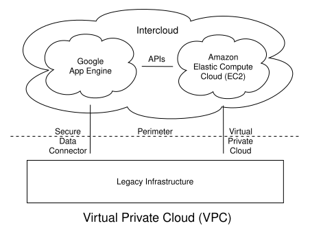
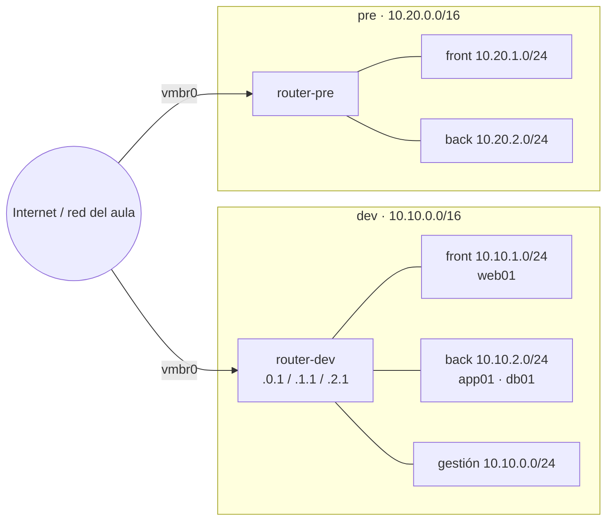
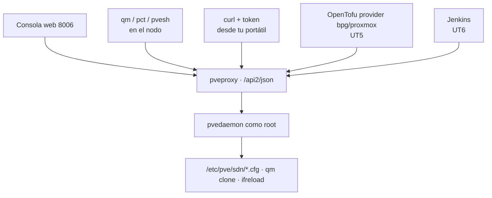

# UT2 · Nubes privadas virtuales (VPC)

<p class="ut-meta">12 h · Sesiones 7 a 12 · RA1 CE b, c</p>

En la UT1 dejamos un Proxmox funcionando, una plantilla Debian con cloud-init (ID 9000; cloud-init es lo que configura nombre, red y usuario en el primer arranque de cada clon) y un par de bridges (los switches virtuales del nodo). Hasta ahora las máquinas que clonábamos caían todas en la misma red, la del aula, y eso vale para probar pero no para lo que viene. En esta unidad construimos la red de verdad: tres entornos (dev, pre, pro) separados, cada uno con sus subredes por capa, su router, su DHCP y su DNS interno, y con la garantía de que lo que pasa en dev no puede tocar pro. Todo lo que montemos aquí es el suelo sobre el que la UT3 pone cortafuegos, DMZ y proxy inverso, y lo que en la UT5 volveremos a crear desde cero con OpenTofu sin pasar por la consola web. Por eso la última sesión de contenido es la de la CLI y la API: si sabes hacerlo a mano con `pvesh` (el cliente de la API de Proxmox que va en el propio nodo), el provider de Terraform deja de ser magia.

## Introducción

Esta unidad construye la red de los tres entornos del curso. Antes de la primera sesión conviene tener claro qué se pide al terminar, qué herramientas aparecen y cómo se reparte el trabajo por sesiones.

### Qué tienes que saber hacer al terminar

- Diseñar el direccionamiento de varios entornos con bloques RFC 1918 que no se solapen y justificar el tamaño de cada bloque y cada subred (CE b).
- Crear con el SDN de Proxmox una zona, una VNet por entorno y sus subredes, aplicar la configuración y conectar VM a ellas (CE b).
- Montar un router de entorno con reenvío IP, NAT de salida y dnsmasq como DHCP y DNS interno, con reservas por MAC y registros propios (CE c).
- Conseguir que dos subredes del mismo entorno se hablen y que dos entornos distintos no se vean, y demostrarlo con pruebas documentadas (CE b, c).
- Recrear un entorno completo desde un script con `qm`, `pct` y `pvesh`, y borrarlo, de forma idempotente (CE b).

### Los conceptos de la unidad

Hoy todas las VM del aula cuelgan del mismo bridge, `vmbr0`: tu `app01` ve el `app01` de tu compañero, un `nmap` lanzado "para probar" recorre la red entera del instituto, y si alguien levanta un DHCP por error en su VM, media clase se queda sin IP. En una empresa con dev, pre y pro en la misma red pasa lo mismo, pero lo que cae es producción. Lo que queremos al terminar cabe en una frase: que cada uno tenga tres redes propias (dev, pre y pro), separadas entre sí, cada una con sus subredes y un router que reparte direcciones y nombres, y que todo eso se cree y se borre con un script.

| Herramienta o concepto | Qué es, en una frase | Para qué la usamos en esta unidad |
|---|---|---|
| VPC (nube privada virtual) | Una red privada propia dentro de una infraestructura compartida, con su rango de direcciones y su salida a Internet | Es lo que construimos: una por entorno |
| CIDR y RFC 1918 | La notación `10.10.1.0/24` para escribir redes y la lista de rangos privados que cualquiera puede usar en casa | Diseñar el direccionamiento sin que dos redes choquen |
| SDN de Proxmox | El módulo de Proxmox que crea redes virtuales desde la consola central (zona, VNet, subnet) | Crear la red de cada entorno y enchufar las VM |
| VLAN y VXLAN | Dos formas de llevar varias redes separadas por el mismo cable: etiquetando la trama o envolviéndola en un paquete IP | Elegir el tipo de zona del SDN |
| Router de entorno | Una VM Debian con una pata en cada subred que reenvía paquetes entre ellas y hacia fuera | Que front hable con back y que el entorno salga a Internet |
| nftables | El cortafuegos y traductor de direcciones que trae Debian, sucesor de iptables | Hacer NAT de salida en el router |
| dnsmasq | Un programa pequeño que reparte IP (DHCP) y resuelve nombres (DNS) a la vez, el mismo que lleva tu router de casa | Dar IP, gateway y nombre a cada VM sin tocarlas una a una |
| cloud-init | El agente que configura una VM en el primer arranque con lo que le pasa Proxmox (nombre, red, clave SSH) | Que cada clon pida IP por DHCP y se registre en el DNS solo |
| ping, traceroute, dig, nmap, tcpdump | Las herramientas clásicas para comprobar una red: alcance, camino, nombres, puertos y tráfico real | Demostrar con evidencias que la red hace lo que dices |
| qm, pct y pvesh | Los tres mandos de Proxmox desde la terminal: VM, contenedores y cualquier ruta de la API | Crear y destruir un entorno con un script |
| API REST con token | La misma puerta que usa la consola web, llamada por HTTP desde fuera con una credencial revocable | Preparar lo que OpenTofu (UT5) y Jenkins (UT6) harán solos |

Cómo está organizada la unidad: sigue las sesiones en orden, y cada sesión trae primero la teoría que se explica ese día y después su hoja de práctica. En la sesión 7 se dibuja el direccionamiento de los tres entornos y se crea la primera VNet en el SDN; en la 8 esa red recibe su router con dnsmasq, que reparte IP y nombres; en la 9 se comprueba que front y back se hablan a través del router y se aprende a leer lo que devuelven ping, traceroute, dig y tcpdump; en la 10 se replican pre y pro y se demuestra que dev no llega a ellos; en la 11 todo lo anterior se repite con scripts, `pvesh` y un token de API, que es la puerta a la UT5; y la 12 es la práctica evaluable. Al final quedan, para consultar cuando algo falle, los errores frecuentes del laboratorio.

!!! info "Dónde se usa esto en la otra asignatura"
    Mientras haces esta unidad (28 oct a 13 nov), en Mantenimiento estás en la [UT2 de alarmas](https://victor-educ.github.io/apuntes-5169/ut/ut2-alarmas/) con `app01` y `mon01`, las dos VM del bridge del aula (`vmbr0`) que clonaste en la UT1. Están ahí de forma provisional porque la VPC que construyes aquí no existía.
    Cuando termines la VPC dev, esas dos VM se mueven a sus subredes: `app01` a back (`10.10.2.10`, con pata de gestión en `10.10.0.11`) y `mon01` a gestión (`10.10.0.20`). El traslado se hace en la [UT3 de Mantenimiento](https://victor-educ.github.io/apuntes-5169/ut/ut3-seguridad-monitorizacion/) (24 nov a 3 dic), que coincide con la UT3 de aquí y aprovecha que ya hay cortafuegos.
    Por eso conviene que las reservas por MAC y los registros DNS de `dev.conf` incluyan a `app01` y `mon01` desde ahora: al llegar a la VPC tienen que seguir llamándose igual, o Prometheus dejará de encontrar sus targets.

### Plan de sesiones

Cada sesión de dos horas empieza con una explicación corta y sigue con laboratorio. La columna "Se explica" es lo que cuento yo al principio (con su duración aproximada); la columna "Se practica" es lo que hacéis vosotros con el material de práctica de esta unidad. Las sesiones marcadas solo como práctica no traen teoría nueva.

| Sesión | Fecha | Tipo | Se explica | Se practica |
|---:|-------|------|------------|-------------|
| [7](#sesion-7-diseno-de-la-vpc-y-sdn) | 28 oct | Teoría y práctica | Qué es una VPC, CIDR y subnetting, RFC 1918, por qué /16 por entorno; zonas, VNets y subredes del SDN de Proxmox (30 min). | Diseñar los tres entornos en papel con tabla de direccionamiento propia; crear en SDN la zona lab y la VNet vdev con DHCP; conectar dos VM y comprobar IP e IPAM. |
| [8](#sesion-8-dhcp-y-dns-propios) | 30 oct | Teoría y práctica | dnsmasq: rangos, reservas por MAC, registros y expand-hosts; por qué un router de entorno (20 min). | Sustituir el DHCP del SDN por la VM router con dnsmasq, reservar IP para web01 y db01, crear api.dev.lab y comprobar con dig. |
| [9](#sesion-9-comunicacion-entre-zonas) | 4 nov | Teoría y práctica | Enrutar frente a hacer NAT; ip_forward y nftables masquerade (15 min). | Activar el reenvío en el router, comprobar web01 a db01 con ping y nc, capturar el tráfico en el router con tcpdump. |
| [10](#sesion-10-segundo-y-tercer-entorno-aislamiento) | 6 nov | Práctica | Repaso de cinco minutos de cómo se prueba el aislamiento. | Replicar pre y pro, lanzar nmap -sn desde dev contra pre y pro, documentar cada prueba con la plantilla del apartado de pruebas. |
| [11](#sesion-11-automatizar-con-la-cli-de-proxmox) | 11 nov | Teoría y práctica | qm, pct y pvesh; la API REST con token como antesala del provider de OpenTofu (20 min). | Script que crea las tres VM de un entorno y otro que las destruye; ejecutar cada uno dos veces sin errores. |
| [12](#sesion-12-practica-evaluable) | 13 nov | Práctica evaluable | Aclaración del enunciado (10 min). | Cerrar la memoria: esquema, direccionamiento, configuración, scripts y las cinco pruebas documentadas. |

## Sesión 7 · Diseño de la VPC y SDN

<p class="ut-meta">28 de octubre · Teoría y práctica · Explicación unos 30 min · Práctica unos 90 min</p>

Al acabar esta sesión tienes el plano de los tres entornos en papel, con una tabla de direccionamiento propia, y la primera VNet (`vdev`) creada en el SDN con dos VM que reciben IP de su rango. Para la hoja hacen falta los tres apartados que siguen: qué es una VPC y qué piezas tiene, cómo se calcula y se elige el direccionamiento, y qué son zona, VNet y subnet en el SDN de Proxmox.

### Qué es una VPC

Antes de crear nada en Proxmox conviene saber qué estamos imitando. Todo lo que hagamos en esta unidad tiene un nombre y un equivalente en cualquier nube pública, y quien entienda las piezas aquí no tendrá que volver a aprenderlas en la UT4.

Una Virtual Private Cloud es una red privada, aislada y definida por software dentro de una infraestructura que se comparte con otros. En nube pública (AWS, Azure, Google Cloud) es el primer recurso que se crea: dentro de ella van las subredes, las instancias, los balanceadores y las bases de datos gestionadas. En una nube privada como Proxmox u OpenStack el concepto es idéntico aunque el nombre cambie (SDN, red definida por software; red de proyecto; red de tenant, es decir, de cliente). La idea de fondo es que tú decides el rango de direcciones, cómo se trocea, qué sale a Internet y qué no, y nadie fuera de tu VPC puede alcanzar tus máquinas salvo que tú abras la puerta.

<figure markdown="span">
  { width="640" }
  <figcaption>Esquema de una VPC con subredes. Fuente: Sam Johnston, CC BY-SA 3.0, vía Wikimedia Commons.</figcaption>
</figure>

Los componentes son siempre los mismos, cambie el proveedor que cambie. En la tabla salen siglas (CIDR, NAT, SNAT, EVPN) que se explican con calma en los apartados siguientes; de momento quédate con la columna del medio:

| Componente | Qué es | Equivalente en Proxmox |
|---|---|---|
| Bloque CIDR | Rango de IP de toda la VPC (p. ej. 10.10.0.0/16) | Conjunto de subnets de una VNet |
| Subred | Trozo del bloque, normalmente por capa o zona (10.10.1.0/24) | VNet + Subnet en SDN |
| Zona de disponibilidad | Centro de datos independiente dentro de una región | Nodo del clúster |
| Tabla de rutas | Hacia dónde sale cada subred | Router virtual (VM) o zona EVPN |
| Gateway de Internet / NAT | Salida a Internet de subredes públicas o privadas | VM con NAT / firewall, o SNAT del SDN |
| DNS interno | Nombres para las máquinas de la VPC | dnsmasq / Pi-hole |
| Grupos de seguridad | Reglas de tráfico por instancia | Firewall de Proxmox (nivel VM) o del router |

Una subred es pública cuando tiene ruta directa a Internet en los dos sentidos: ahí van balanceadores, proxies inversos, bastiones. Una subred es privada cuando solo sale por NAT (puede descargar paquetes, nadie puede entrar) o directamente no sale (la base de datos no tiene ninguna razón para hablar con Internet). En el laboratorio, front será la subred "pública" de cada entorno y back la privada; la de gestión es privada y además solo accesible desde una red concreta.

Para que os situéis de cara a la UT4, la misma idea recibe estos nombres en cada sitio:

| Concepto | Proxmox SDN | AWS | Azure | GCP |
|---|---|---|---|---|
| Red privada aislada | Zona + VNet | VPC | Virtual Network (VNet) | VPC network |
| Subred | Subnet | Subnet (ligada a una AZ) | Subnet | Subnet (ligada a una región) |
| Zona de disponibilidad | Nodo | Availability Zone | Availability Zone | Zone |
| Salida NAT | VM router / SNAT | NAT Gateway | NAT Gateway | Cloud NAT |
| DNS interno | dnsmasq | Route 53 Resolver | Azure DNS privado | Cloud DNS |
| Reglas por instancia | Firewall de Proxmox | Security Group | NSG | Firewall rules |
| Unión de dos VPC | Ruta en el router | VPC Peering / Transit Gateway | VNet Peering | VPC Peering |

### Diseño de direccionamiento

Antes de crear nada se dibuja. Esto no es una frase de manual: cambiar un rango de IP cuando ya hay veinte máquinas, un DNS y reglas de firewall que lo referencian cuesta una tarde entera y algún disgusto. Cinco minutos de papel ahorran eso.

#### Repaso rápido de CIDR y subnetting

Una dirección IPv4 son 32 bits. La notación CIDR `10.10.1.0/24` dice que los 24 primeros bits identifican la red y los 8 restantes al host. Con eso se calcula todo lo demás:

- Máscara: 24 bits a uno, `255.255.255.0`.
- Direcciones en la red: 2^(32-24) = 256.
- Hosts utilizables: 256 menos la dirección de red (`10.10.1.0`) y la de broadcast (`10.10.1.255`), 254.
- Primera y última IP de host: `10.10.1.1` y `10.10.1.254`.

El mismo cálculo con otros prefijos que os vais a encontrar:

| Prefijo | Máscara | Direcciones | Hosts útiles | Ejemplo | Broadcast |
|---|---|---|---|---|---|
| /16 | 255.255.0.0 | 65 536 | 65 534 | 10.10.0.0/16 | 10.10.255.255 |
| /22 | 255.255.252.0 | 1 024 | 1 022 | 10.10.4.0/22 | 10.10.7.255 |
| /24 | 255.255.255.0 | 256 | 254 | 10.10.1.0/24 | 10.10.1.255 |
| /26 | 255.255.255.192 | 64 | 62 | 10.10.1.64/26 | 10.10.1.127 |
| /28 | 255.255.255.240 | 16 | 14 | 10.10.1.16/28 | 10.10.1.31 |
| /30 | 255.255.255.252 | 4 | 2 | 10.10.9.0/30 | 10.10.9.3 |

Fíjate en el /22: `10.10.4.0/22` cubre desde `10.10.4.0` hasta `10.10.7.255`, es decir, cuatro /24 seguidos. El truco para no equivocarse es que la dirección de red tiene que ser múltiplo del tamaño del bloque en el octeto que se parte: un /22 solo puede empezar en .0, .4, .8, .12... del tercer octeto. `10.10.5.0/22` no es una red válida (su red real sería `10.10.4.0/22`) y Proxmox te lo rechazará al crear la subnet. En AWS y Azure, además, el proveedor se reserva las cinco primeras direcciones de cada subred (red, router, DNS, futuro y broadcast), así que un /28 allí se queda en 11 hosts.

Una herramienta que conviene tener a mano es `ipcalc` (paquete `ipcalc` en Debian) o `sipcalc`:

```bash
$ ipcalc 10.10.4.0/22
Address:   10.10.4.0            00001010.00001010.000001 00.00000000
Netmask:   255.255.252.0 = 22   11111111.11111111.111111 00.00000000
Network:   10.10.4.0/22         00001010.00001010.000001 00.00000000
HostMin:   10.10.4.1
HostMax:   10.10.7.254
Broadcast: 10.10.7.255
Hosts/Net: 1022                  Class A, Private Internet
```

#### RFC 1918 y el problema del solapamiento

La [RFC 1918](https://www.rfc-editor.org/rfc/rfc1918) reserva tres rangos que nunca se enrutan en Internet y que cualquiera puede usar dentro de casa: `10.0.0.0/8` (16 millones de direcciones), `172.16.0.0/12` (de 172.16.0.0 a 172.31.255.255, un millón) y `192.168.0.0/16` (65 536). Además existe `100.64.0.0/10` ([RFC 6598](https://www.rfc-editor.org/rfc/rfc6598)), pensado para el CGNAT de los operadores (el NAT a gran escala que hace tu proveedor de fibra), que algunas empresas usan para redes de tránsito precisamente porque nadie lo pone en una oficina.

El error clásico es elegir el rango sin pensar en el futuro. Dos redes que hoy están separadas pueden tener que hablarse mañana: dev con pre para promocionar una imagen, la VPC de la empresa con la del proveedor por VPN, tu nube privada con AWS por peering. Si las dos usan `192.168.1.0/24` (y lo usan, es la red por defecto de medio mundo), una máquina de un lado que quiera hablar con `192.168.1.10` del otro lado no tiene forma de saber a cuál se refiere: la tabla de rutas le dice que esa red es local y el paquete nunca sale. La solución en ese momento es NAT doble (traducir un lado a un rango ficticio), y quien lo haya tenido que mantener no lo repite. Por eso:

- Un bloque distinto por entorno, sin solapar. En el curso: `10.10.0.0/16` para dev, `10.20.0.0/16` para pre, `10.30.0.0/16` para pro. Los huecos entre medias (10.11 a 10.19) quedan para crecer.
- Dentro de cada entorno, una subred por capa: front (expuesta), back (aplicación), data (bases de datos) y gestión (acceso administrativo, monitorización).
- Evitar `192.168.0.0/24`, `192.168.1.0/24`, `10.0.0.0/24` y `172.16.0.0/24`. Son los que trae cualquier router doméstico o VPN de teletrabajo, y son los que chocan.

#### Por qué /16 por entorno y /24 por subred

Un /16 son 65 534 direcciones y en dev vais a tener seis máquinas. Parece un desperdicio, pero el espacio privado no cuesta dinero y lo que sí cuesta es renumerar. Con un /16 tienes 256 subredes /24 posibles por entorno, así que puedes dar una a cada capa, otra a cada zona de disponibilidad (front-a, front-b), otra a cada cliente si el entorno se vuelve multi-tenant (varios clientes sobre el mismo hardware), y aún te sobran doscientas. Un /24 por subred da 254 hosts, más que suficiente para una capa, y tiene la ventaja de que se lee de un vistazo: en `10.10.2.37` sabes que es dev (10.10), back (.2) y un servidor fijo (.37) sin mirar ninguna tabla. Ese "se lee de un vistazo" es lo que os va a salvar cuando estéis leyendo una captura de tcpdump a las cinco de la tarde.

Ejemplo que usaremos en el curso (en la A2.1 tenéis que inventar el vuestro):

| Entorno | Bloque | Gestión | Front | Back | Data |
|---|---|---|---|---|---|
| dev | 10.10.0.0/16 | 10.10.0.0/24 | 10.10.1.0/24 | 10.10.2.0/24 | 10.10.3.0/24 |
| pre | 10.20.0.0/16 | 10.20.0.0/24 | 10.20.1.0/24 | 10.20.2.0/24 | 10.20.3.0/24 |
| pro | 10.30.0.0/16 | 10.30.0.0/24 | 10.30.1.0/24 | 10.30.2.0/24 | 10.30.3.0/24 |

Convención dentro de cada /24: `.1` router, `.2` a `.9` servicios de red (DNS, NTP, proxy), `.10` a `.99` servidores con IP fija (reservada por MAC en DHCP), `.100` a `.199` rango DHCP dinámico para máquinas de usar y tirar, `.200` a `.254` libre para balanceadores, IP virtuales y pruebas. Escribidla en la memoria y respetadla: la convención vale más que el rango concreto.



Entre dev y pre no hay ninguna línea. Eso es el aislamiento: no es una regla de firewall que prohíbe, es que no existe el camino.

### SDN en Proxmox

Con el plano en papel toca construirlo. Vamos a crear la red de cada entorno desde la consola de Proxmox y a entender qué pasa por debajo cuando pulsas Apply, porque cuando el SDN falla (y falla) hay que saber dónde mirar.

Proxmox VE incorpora desde la versión 8 un módulo de redes definidas por software, en Datacenter → SDN, que sustituye al trabajo manual de crear bridges en cada nodo. La jerarquía tiene tres niveles y conviene tenerla clara porque el provider de OpenTofu usa exactamente los mismos objetos:

- Zona: define el tipo de red y en qué nodos existe. Es el "cómo se transporta el tráfico".
- VNet: una red virtual dentro de la zona. Al crear una VM aparece en el desplegable de bridges como si fuera un `vmbrN` más. Es el "cable" al que se conecta la máquina.
- Subnet: un rango CIDR dentro de la VNet, con gateway opcional, rango DHCP opcional y SNAT opcional. Una VNet puede tener varias subnets.

Además hay dos objetos transversales: IPAM (el registro de qué IP está asignada a quién; el que viene de serie se llama `pve` y guarda el estado en `/etc/pve/priv/ipam.db`) y DNS (integración con un servidor PowerDNS externo para que el IPAM registre nombres automáticamente; en clase no lo usaremos, lo resolveremos con dnsmasq).

#### Tipos de zona y cuándo usar cada uno

| Zona | Cómo funciona | Alcance | Cuándo |
|---|---|---|---|
| Simple | Crea un bridge Linux sin interfaz física por cada VNet. Aislado. Puede hacer SNAT hacia fuera. | Un nodo (las VM de otro nodo no ven la red) | Laboratorio de un solo nodo, redes de pruebas, lo que haremos en la A2.2 |
| VLAN | Cada VNet es un tag 802.1Q sobre un bridge físico existente (vmbr0). El switch físico tiene que dejar pasar esas VLAN. | Todo el clúster, si el switch está configurado | Empresa pequeña con switches gestionables; lo más habitual en producción on-premise |
| QinQ | VLAN dentro de VLAN (802.1ad). Una VLAN de servicio por zona y VLAN de cliente por VNet. | Clúster | Proveedores que necesitan más de 4094 segmentos o aislar clientes que a su vez usan VLAN |
| VXLAN | Encapsula tramas Ethernet en UDP (puerto 4789) entre los nodos. No necesita nada del switch físico. | Clúster (túnel entre las IP de los nodos) | Clúster de varios nodos sin control sobre la red física; nube |
| EVPN | VXLAN más BGP (el protocolo de enrutado de Internet, aquí hablado por el software FRR) para anunciar MAC e IP entre nodos, con enrutado distribuido: cada nodo es gateway de sus VM. | Clúster, y puede salir a routers externos | Cuando quieres que el SDN enrute entre VNets sin una VM router; es lo más parecido a una VPC de nube |

Elegir bien la zona es la decisión más importante de esta unidad y la que menos se puede deshacer, porque cambiar de zona implica recrear las VNets. Mi criterio: en clase usaremos Simple porque tenemos un nodo por persona y no controlamos el switch del aula; en una empresa con dos o tres nodos y switches propios usaría VLAN, que es lo que el equipo de redes ya entiende; VXLAN cuando los nodos están en sitios distintos o la red física no es mía; EVPN solo si de verdad necesito que el enrutado sea distribuido, porque añade BGP y FRR a la ecuación y eso se depura peor.

#### VLAN 802.1Q frente a VXLAN

Una VLAN añade 4 bytes a la trama Ethernet con un identificador de 12 bits: 4094 redes posibles. Es un estándar de capa 2 que entienden todos los switches gestionables, es barato de procesar y se depura con `tcpdump -e` viendo el tag. Su limitación es que la VLAN tiene que existir en cada switch por el que pasa el tráfico, así que depende de que el equipo de redes te la configure, y no cruza un router (por definición de capa 2).

VXLAN ([RFC 7348](https://www.rfc-editor.org/rfc/rfc7348)) mete la trama Ethernet completa dentro de un paquete UDP/IP con un identificador de 24 bits (16 millones de redes). Como es IP, atraviesa routers y no necesita que el switch sepa nada: solo que los nodos Proxmox se alcancen entre sí por el puerto 4789. El precio son 50 bytes de cabecera extra, lo que obliga a bajar la MTU (el tamaño máximo de paquete que admite una interfaz) de las VM a 1450 si la red física va a 1500 (o subir la física a 1550 o más, que es lo correcto si se puede). Si se os olvida la MTU, los ping pequeños funcionan y las transferencias grandes se cuelgan; es el síntoma más engañoso de esta unidad.

#### Qué hace Apply por debajo

La configuración del SDN se escribe en `/etc/pve/sdn/` (ficheros `zones.cfg`, `vnets.cfg`, `subnets.cfg`), que está en el sistema de ficheros del clúster y por tanto se replica a todos los nodos. Pero escribir ahí no cambia nada en la red. Al pulsar Apply (o `pvesh set /cluster/sdn`), cada nodo genera el fichero `/etc/network/interfaces.d/sdn` con los bridges, VLAN o túneles VXLAN que le tocan y ejecuta `ifreload -a` (de ifupdown2, la herramienta que gestiona las interfaces de red en Proxmox), que aplica los cambios sin reiniciar la red. Un ejemplo de lo que aparece para una zona Simple con la VNet `vdev`:

```text
auto vdev
iface vdev
        bridge_ports none
        bridge_stp off
        bridge_fd 0
        mtu 1500
        alias dev
```

Si en `/etc/network/interfaces` no está la línea `source /etc/network/interfaces.d/*` (viene en instalaciones nuevas, pero no siempre en las actualizadas desde versiones antiguas), Apply dirá que todo va bien y no habrá ningún bridge. Es la primera cosa que se comprueba cuando "el SDN no hace nada".

#### DHCP e IPAM integrados

Desde Proxmox 8.1 una zona puede llevar `DHCP: dnsmasq`. Proxmox arranca entonces una instancia de dnsmasq por zona (unidad `dnsmasq@<zona>.service`, configuración en `/etc/dnsmasq.d/<zona>/`) que escucha en las VNets de esa zona y entrega las IP que el IPAM ha reservado para cada VM. Con una zona Simple y una subnet con gateway `10.10.1.1` y rango DHCP `10.10.1.100-10.10.1.199`, al crear una VM conectada a `vdev` el IPAM le asigna una IP del rango, la ata a su MAC y dnsmasq la sirve. El gateway `.1` lo pone Proxmox en el propio bridge del nodo, así que el nodo es el router de esa subred; si además marcas SNAT en la subnet, el nodo hace masquerade hacia su interfaz de salida y las VM tienen Internet sin ninguna VM router.

Para que funcione hace falta el paquete `dnsmasq` instalado en el nodo pero con la unidad genérica deshabilitada, porque si no compite con las instancias por zona:

```bash
apt install dnsmasq
systemctl disable --now dnsmasq
```

Es cómodo y para probar es perfecto. La razón por la que en la A2.3 lo sustituimos por una VM router propia es didáctica y práctica a la vez: el DHCP del SDN no hace DNS con nombres propios ni te deja tocar opciones finas, y en la UT3 el router de entorno es donde van a vivir las reglas de firewall entre capas. Entender qué hace el SDN por debajo (un bridge, un dnsmasq, una regla de nftables) es lo que os permite arreglarlo cuando falla.

#### Alternativa sin SDN

Lo que existía antes del SDN sigue funcionando y es lo mismo hecho a mano: en `/etc/network/interfaces` un bridge `vmbr10` sin `bridge-ports` (sin interfaz física, por tanto aislado dentro del nodo) por entorno, y una VM router conectada a `vmbr0` y a `vmbr10` que hace DHCP, DNS y NAT. Si en algún momento el SDN os da guerra, esto es el plan B y es equivalente para la práctica evaluable.

### A2.1 Diseño y creación de la VPC dev con SDN (sesión 7)

**Objetivo.** Tener el plano de los tres entornos en papel y la primera VNet (`vdev`) funcionando en el SDN, con dos VM que reciben IP de su rango.

**Antes de empezar.**

- El nodo Proxmox de la UT1 encendido, con la plantilla 9000, la consola web como `root@pam` y una sesión SSH contra el nodo.
- Papel o draw.io para el esquema, y la tabla del [ejemplo de direccionamiento](#por-que-16-por-entorno-y-24-por-subred) a mano para saber qué columnas tiene, no para copiarla.
- Explicado en esta sesión: [qué es una VPC](#que-es-una-vpc), [CIDR y RFC 1918](#diseno-de-direccionamiento) y [zonas, VNets y subnets del SDN](#sdn-en-proxmox).

**Pasos.**

1. Dibuja los tres entornos (dev, pre, pro) con sus subredes, su router y sus servicios de red, como el esquema del apartado de diseño pero con tus nombres.
2. Rellena tu tabla de direccionamiento (entorno, bloque, gestión, front, back, data). No copies los rangos del ejemplo: elige otro bloque de RFC 1918 y escribe en una línea por qué ese.
3. Justifica cada tamaño con el cálculo de máscara, direcciones, hosts útiles y broadcast. Añade la convención de IP dentro de cada /24 y el rango de ID de VM por entorno.
4. Comprueba que nada se solapa, ni entre entornos ni con la red del aula:

    ```bash
    apt install ipcalc
    ipcalc 172.20.0.0/16      # tu bloque de dev
    ipcalc 172.21.0.0/16      # tu bloque de pre
    ip -4 addr show vmbr0     # la red del aula, para descartar el choque
    ```

5. Prepara el nodo para el DHCP del SDN (paquete instalado, unidad genérica parada):

    ```bash
    apt install dnsmasq
    systemctl disable --now dnsmasq
    ```

6. Datacenter → SDN → Zones → Add → Simple. ID `lab`, DHCP `dnsmasq`, IPAM `pve`. Deja el resto por defecto.
7. Datacenter → SDN → VNets → Create. Name `vdev`, Zone `lab`, Alias `dev`.
8. Con `vdev` seleccionada, Subnets → Create, dos veces, con tus rangos de front y back. Para cada una: Subnet (el CIDR), Gateway (el `.1`), y en la pestaña DHCP Ranges el rango `.100` a `.199`. Con el ejemplo del curso serían `10.10.1.0/24` con gateway `10.10.1.1` y `10.10.2.0/24` con gateway `10.10.2.1`.
9. Datacenter → SDN → Apply. Comprueba en el nodo que el bridge existe de verdad:

    ```bash
    cat /etc/network/interfaces.d/sdn
    ip link show vdev
    systemctl status dnsmasq@lab
    ```

    Si el fichero está vacío o el bridge no aparece, mira que `/etc/network/interfaces` contenga `source /etc/network/interfaces.d/*` (está en [qué hace Apply por debajo](#que-hace-apply-por-debajo)).

10. Clona dos VM desde la plantilla conectadas a `vdev`:

    ```bash
    qm clone 9000 200 --name web01 --full
    qm set 200 --net0 virtio,bridge=vdev --ipconfig0 ip=dhcp
    qm clone 9000 201 --name web02 --full
    qm set 201 --net0 virtio,bridge=vdev --ipconfig0 ip=dhcp
    qm start 200 && qm start 201
    ```

11. Entra por consola (VM → Console) en cada una y ejecuta `ip a` y `ip r`. Después mira Datacenter → SDN → IPAM.

**Comprobación.** `ip link show vdev` dice `state UP`; cada VM tiene una IP del rango `.100` a `.199` y como gateway el `.1`; el IPAM lista las dos VM con su MAC e IP; desde `web01` un `ping` a `web02` responde. Si una VM no coge IP, `journalctl -u dnsmasq@lab -f` en el nodo mientras la reinicias enseña el DORA o su ausencia.

**Entrega.** En `ut2/a21` de tu repositorio: el esquema, la tabla de direccionamiento con las justificaciones, una captura del SDN aplicado, el contenido de `/etc/network/interfaces.d/sdn` y la salida de `ip a` de las dos VM.

**Si te sobra tiempo.** Marca SNAT en una subnet de `vdev`, aplica, y comprueba desde `web01` que `ping -c 3 deb.debian.org` sale a Internet sin ninguna VM router.

## Sesión 8 · DHCP y DNS propios

<p class="ut-meta">30 de octubre · Teoría y práctica · Explicación unos 20 min · Práctica unos 100 min</p>

Al acabar esta sesión la VM `router-dev` reparte IP, gateway y DNS a las máquinas de dev con dnsmasq, con reservas por MAC y nombres propios, y el DHCP del SDN queda apagado. La teoría de hoy es el router de entorno (por qué una VM con una pata en cada subred y el reenvío IP) y el fichero de dnsmasq línea a línea. El NAT de salida lo dejas configurado hoy siguiendo la hoja, aunque se explica en la sesión 9.

### Servicios de red: enrutado, NAT, DHCP y DNS

Una VNet recién creada es un cable al que se conectan máquinas y nada más: nadie reparte direcciones, nadie resuelve nombres y nadie saca el tráfico a Internet. Montamos la VM que hace esas tres cosas para cada entorno, y de paso separamos dos ideas que se confunden siempre, enrutar y hacer NAT. Es el apartado con más configuración de la unidad; la A2.3 y la A2.4 salen de aquí.

#### Router de entorno

Una VM Debian 13 clonada de la plantilla, con una interfaz por subred y otra hacia el exterior. En Proxmox las interfaces virtio (las tarjetas de red paravirtualizadas, las más rápidas para una VM) aparecen en la VM como `ens18`, `ens19`, `ens20`... en el orden de `net0`, `net1`, `net2`. Convención del curso: `ens18` exterior (vmbr0, IP del aula por DHCP), `ens19` gestión (`.0.1`), `ens20` front (`.1.1`), `ens21` back (`.2.1`).

Lo primero es activar el reenvío IP, que en Debian viene apagado. Sin esto la VM acepta paquetes dirigidos a ella y descarta los demás, así que front y back no se hablan aunque el router tenga pata en las dos:

```bash
# /etc/sysctl.d/99-router.conf
net.ipv4.ip_forward = 1
```

```bash
sysctl --system
sysctl net.ipv4.ip_forward   # debe devolver 1
```

Con el reenvío activo, el router ya encamina entre front y back porque ambas son redes directamente conectadas: cuando `web01` (10.10.1.10) manda un paquete a `db01` (10.10.2.10), su tabla de rutas dice que 10.10.2.0/24 no es local y lo envía al gateway 10.10.1.1; el router mira su tabla, ve que 10.10.2.0/24 está en `ens21` y lo reenvía. No hace falta añadir ninguna ruta estática. Sí hará falta en la UT3 cuando metamos un firewall entre medias, y en la UT4 cuando conectemos con la nube.

#### dnsmasq: DHCP y DNS en uno

dnsmasq es un servidor DHCP, DNS cacheador y servidor TFTP (arranque por red) en un solo binario de medio megabyte, y es lo que hay dentro de casi todos los routers domésticos, de OpenWrt, de libvirt y del propio SDN de Proxmox. Para una VPC de laboratorio es la herramienta correcta: hace DHCP con opciones por subred, sirve nombres para las máquinas internas y reenvía el resto a un DNS público. En una empresa grande lo sustituyen Kea o un dominio Windows para DHCP y BIND, PowerDNS o Route 53 para DNS, pero los conceptos son los mismos.

Se instala con `apt install dnsmasq` en la VM router y toda la configuración va en `/etc/dnsmasq.d/`. El fichero del entorno dev, comentado línea a línea. Fíjate sobre todo en tres bloques: las interfaces en las que escucha, los rangos DHCP con su etiqueta por subred y las reservas por MAC; el resto son opciones de DNS que se explican justo después:

```ini
# /etc/dnsmasq.d/dev.conf
# Escuchar solo en las patas internas, nunca en la exterior
interface=ens19
interface=ens20
interface=ens21
bind-interfaces

# DNS: dominio interno y resolución de nombres
domain=dev.lab
local=/dev.lab/
expand-hosts
no-resolv
server=1.1.1.1
server=9.9.9.9
dhcp-authoritative

# DHCP: un rango por subred, cada uno con su etiqueta (tag)
dhcp-range=set:mgmt,10.10.0.100,10.10.0.199,12h
dhcp-option=tag:mgmt,option:router,10.10.0.1
dhcp-range=set:front,10.10.1.100,10.10.1.199,12h
dhcp-option=tag:front,option:router,10.10.1.1
dhcp-range=set:back,10.10.2.100,10.10.2.199,12h
dhcp-option=tag:back,option:router,10.10.2.1
# Opciones comunes: DNS y dominio de búsqueda para todos
dhcp-option=option:dns-server,10.10.0.1
dhcp-option=option:domain-search,dev.lab

# Reservas por MAC: siempre la misma IP y nombre
dhcp-host=bc:24:11:aa:bb:cc,web01,10.10.1.10
dhcp-host=bc:24:11:aa:bb:dd,app01,10.10.2.10
dhcp-host=bc:24:11:aa:bb:ee,db01,10.10.2.11

# Registros DNS que no son máquinas con DHCP
address=/api.dev.lab/10.10.1.10
host-record=lb.dev.lab,10.10.1.200

# Logs (quitar en producción, en clase los queremos)
log-dhcp
log-queries
```

Cosas que conviene entender de ese fichero:

- Los tags. `dhcp-range=set:front,...` etiqueta con `front` a cualquier cliente que reciba IP de ese rango, y `dhcp-option=tag:front,...` aplica esa opción solo a los etiquetados. Así cada subred recibe su propio router (`.1`) aunque el DNS sea el mismo para todas. dnsmasq elige el rango por la interfaz de llegada de la petición DHCP, por eso da igual que las tres subredes estén en el mismo fichero. Se pueden poner tags también por fabricante de la MAC o por nombre del cliente, y montar cosas como "los Raspberry arrancan por PXE" (arranque por red) en dos líneas.
- Las reservas (`dhcp-host`). La MAC de una VM de Proxmox se ve en el hardware de la VM o con `qm config 200 | grep net0`. El prefijo `bc:24:11` es el OUI (los tres primeros bytes de la MAC, que identifican al fabricante) que usa Proxmox por defecto. Al reservar, la IP queda fuera del rango dinámico (`.10`, no `.100`) para que no haya conflicto, y de regalo dnsmasq crea el registro DNS `web01.dev.lab` con esa IP.
- `expand-hosts` y `domain`. Cuando un cliente manda su nombre de host en la petición DHCP (cloud-init lo hace), dnsmasq lo registra en DNS; con `expand-hosts` le añade el dominio, así `web01` es también `web01.dev.lab`. Sin esa línea solo respondería al nombre corto.
- `local=/dev.lab/` dice que dnsmasq es autoritativo para ese dominio y no reenvía preguntas sobre él a los `server=`. Sin esta línea, preguntar por `noexiste.dev.lab` acabaría en Cloudflare, con la latencia y la fuga de información que eso supone.
- `no-resolv` evita que dnsmasq lea `/etc/resolv.conf` del propio router, que en Debian con DHCP en `ens18` apunta al DNS del aula. Queremos control explícito.
- `dhcp-authoritative` hace que dnsmasq responda con NAK a clientes que piden renovar una IP que no le consta, lo que acelera mucho la recuperación cuando reinicias el router y las VM tienen concesiones viejas.

Se comprueba la sintaxis y se aplica con:

```bash
dnsmasq --test          # "syntax check OK"
systemctl restart dnsmasq
journalctl -u dnsmasq -f
```

Las concesiones activas están en `/var/lib/misc/dnsmasq.leases` (una línea por cliente: expiración en epoch, o segundos desde 1970, MAC, IP, nombre, client-id). Es el primer sitio al que mirar cuando "esta VM no tiene IP". Con `log-dhcp` el diálogo completo queda en el journal:

```text
dnsmasq-dhcp[612]: DHCPDISCOVER(ens20) bc:24:11:aa:bb:cc
dnsmasq-dhcp[612]: DHCPOFFER(ens20) 10.10.1.10 bc:24:11:aa:bb:cc
dnsmasq-dhcp[612]: DHCPREQUEST(ens20) 10.10.1.10 bc:24:11:aa:bb:cc
dnsmasq-dhcp[612]: DHCPACK(ens20) 10.10.1.10 bc:24:11:aa:bb:cc web01
```

Las cuatro fases (Discover, Offer, Request, Ack; DORA) son el protocolo DHCP entero. Si ves Discover sin Offer, dnsmasq no tiene rango para esa interfaz o no escucha en ella. Si ves Offer sin Request, el cliente no ha recibido la oferta (normalmente un firewall o un bridge mal conectado). Si ves NAK, la IP que pide el cliente no cuadra con el rango.


Del lado de las VM, la plantilla 9000 de la UT1 lleva cloud-init, así que `qm set 200 --ipconfig0 ip=dhcp` basta para que la máquina pida IP en el arranque, ponga su nombre de host (el `--name` del clon) en la petición y reciba DNS y dominio de búsqueda. El resultado es que `web01` resuelve `db01.dev.lab` y `db01` a secas sin que nadie haya tocado `/etc/hosts`. Si en algún caso queréis IP fija sin DHCP (el propio router, por ejemplo), `--ipconfig0 ip=10.10.1.1/24,gw=10.10.1.254` y `--nameserver 10.10.0.1 --searchdomain dev.lab`.

### A2.2 DHCP y DNS propios (sesión 8)

**Objetivo.** Que la VM `router-dev` con dnsmasq reparta IP, gateway y DNS a las VM de dev en lugar del DHCP del SDN, con reserva por MAC para `web01` y `db01` y el nombre `api.dev.lab` resolviendo.

**Antes de empezar.**

- La zona `lab` y la VNet `vdev` de la A2.1 aplicadas y con `web01` funcionando.
- Tu tabla de direccionamiento a mano: aquí se usan el `.1` de cada subred y las IP fijas `.10` y `.11`.
- Explicado en esta sesión: [el router de entorno](#router-de-entorno) y [dnsmasq](#dnsmasq-dhcp-y-dns-en-uno). El NAT de salida se explica en la sesión 9, pero lo dejas configurado hoy para que las VM tengan Internet; el fichero está en [enrutar frente a hacer NAT](#enrutar-frente-a-hacer-nat).

**Pasos.**

1. Quita el DHCP del SDN para que no compita con el router: Datacenter → SDN → VNets → `vdev` → cada subnet → Edit → borra el DHCP Range (y el SNAT si lo pusiste). Apply.
2. Crea la VM router con una pata en el aula y una por subred de dev (`net1` gestión, `net2` front, `net3` back):

    ```bash
    qm clone 9000 210 --name router-dev --full
    qm set 210 --net0 virtio,bridge=vmbr0 --ipconfig0 ip=dhcp
    qm set 210 --net1 virtio,bridge=vdev --ipconfig1 ip=10.10.0.1/24
    qm set 210 --net2 virtio,bridge=vdev --ipconfig2 ip=10.10.1.1/24
    qm set 210 --net3 virtio,bridge=vdev --ipconfig3 ip=10.10.2.1/24
    qm set 210 --nameserver 1.1.1.1
    qm start 210
    ```

    Las tres patas internas cuelgan del mismo bridge `vdev`; lo que las separa es la IP de cada una. En la VM salen como `ens18` (aula), `ens19`, `ens20` y `ens21`.

3. Activa el reenvío IP en el router:

    ```bash
    echo 'net.ipv4.ip_forward = 1' > /etc/sysctl.d/99-router.conf
    sysctl --system
    sysctl net.ipv4.ip_forward     # debe devolver 1
    ```

4. NAT de salida hacia el aula con nftables:

    ```bash
    apt install nftables
    nft add table ip nat
    nft add chain ip nat postrouting '{ type nat hook postrouting priority 100 ; }'
    nft add rule ip nat postrouting oifname "ens18" masquerade
    nft list ruleset > /etc/nftables.conf
    systemctl enable --now nftables
    ```

5. Apunta las MAC de `web01` y de la VM que hará de `db01` (clónala ahora si no existe, con `qm clone 9000 202 --name db01 --full` y `qm set 202 --net0 virtio,bridge=vdev --ipconfig0 ip=dhcp`):

    ```bash
    qm config 200 | grep net0
    qm config 202 | grep net0
    ```

6. Instala dnsmasq en el router y escribe el fichero de dev. Sustituye las MAC por las tuyas y las IP por las de tu tabla:

    ```ini
    # /etc/dnsmasq.d/dev.conf
    interface=ens19
    interface=ens20
    interface=ens21
    bind-interfaces

    domain=dev.lab
    local=/dev.lab/
    expand-hosts
    no-resolv
    server=1.1.1.1
    server=9.9.9.9
    dhcp-authoritative

    dhcp-range=set:mgmt,10.10.0.100,10.10.0.199,12h
    dhcp-option=tag:mgmt,option:router,10.10.0.1
    dhcp-range=set:front,10.10.1.100,10.10.1.199,12h
    dhcp-option=tag:front,option:router,10.10.1.1
    dhcp-range=set:back,10.10.2.100,10.10.2.199,12h
    dhcp-option=tag:back,option:router,10.10.2.1
    dhcp-option=option:dns-server,10.10.0.1
    dhcp-option=option:domain-search,dev.lab

    dhcp-host=bc:24:11:aa:bb:cc,web01,10.10.1.10
    dhcp-host=bc:24:11:aa:bb:dd,app01,10.10.2.10
    dhcp-host=bc:24:11:aa:bb:ee,db01,10.10.2.11

    address=/api.dev.lab/10.10.1.10
    host-record=lb.dev.lab,10.10.1.200

    log-dhcp
    log-queries
    ```

    Incluye desde ya las reservas de `app01` y `mon01` (`10.10.0.20`): son las VM que se trasladan a esta VPC en la UT3 de Mantenimiento.

7. Comprueba la sintaxis, arranca y deja el log abierto:

    ```bash
    apt install dnsmasq
    dnsmasq --test          # "syntax check OK"
    systemctl restart dnsmasq
    journalctl -u dnsmasq -f
    ```

8. Reinicia `web01` y `db01` (`qm reboot 200`, `qm reboot 202`) y observa en el journal el DORA de cada una: DISCOVER, OFFER con la IP reservada, REQUEST y ACK con el nombre.
9. Desde `web01`, comprueba la resolución interna y externa:

    ```bash
    ip a                                   # 10.10.1.10, no una del rango dinámico
    cat /etc/resolv.conf                   # nameserver 10.10.0.1, search dev.lab
    dig db01.dev.lab @10.10.0.1 +short     # 10.10.2.11
    dig api.dev.lab @10.10.0.1             # NOERROR, flag aa
    nslookup db01                          # el nombre corto también resuelve
    dig deb.debian.org @10.10.0.1 +short   # reenviado a 1.1.1.1
    ping -c 3 deb.debian.org               # sale por el NAT del router
    ```

**Comprobación.** `web01` tiene `10.10.1.10` y `db01` tiene `10.10.2.11` (o las de tu tabla), no una del rango dinámico; `dig` con `@10.10.0.1` devuelve `NOERROR` y flag `aa` para `dev.lab`; los nombres externos resuelven y el `ping` a Internet responde; en `/var/lib/misc/dnsmasq.leases` hay una línea por VM. Si el DISCOVER no aparece en el journal, revisa que la VM cuelga de `vdev` y que dnsmasq escucha ahí (`ss -ulnp | grep :67`).

**Entrega.** En `ut2/a22` del repositorio: `dev.conf` comentado, `/etc/nftables.conf`, el extracto de `journalctl -u dnsmasq` con el DORA de una VM y la salida de los `dig` del paso 9.

**Si te sobra tiempo.** Quita `dhcp-authoritative`, reinicia el router y mide cuánto tarda `web01` en recuperar su IP.

## Sesión 9 · Comunicación entre zonas

<p class="ut-meta">4 de noviembre · Teoría y práctica · Explicación unos 15 min · Práctica unos 105 min</p>

Al acabar esta sesión has demostrado con `ping`, `traceroute`, `nc` y una captura de `tcpdump` que `web01` llega a `db01` a través del router con las IP reales a ambos lados, y sabes qué pasa cuando el router deja de reenviar. Se explica la diferencia entre enrutar y hacer NAT; el apartado de cómo se prueba una red no se explica, pero lo necesitas para leer las salidas y rellenar la plantilla de pruebas.

### Enrutar frente a hacer NAT

Son dos cosas distintas y se confunden mucho. Enrutar es reenviar el paquete sin tocarlo: la IP de origen que ve `db01` es la de `web01`, y `db01` puede responder porque tiene ruta de vuelta. NAT es reescribir la IP de origen (SNAT / masquerade) o de destino (DNAT) al pasar por el router.

Dentro de un entorno se enruta, nunca se hace NAT: las capas tienen que ver la IP real de quien las llama, si no los logs de la base de datos dirán que todas las conexiones vienen del router y el firewall de la UT3 no podrá distinguir front de back. NAT se hace en el borde, hacia fuera, por dos razones: la red del aula (o Internet) no sabe volver a 10.10.0.0/16, y no queremos que se sepa desde fuera cómo es la red por dentro. En nube pública es lo mismo: dentro de la VPC todo se enruta, y solo el NAT Gateway o el Internet Gateway traducen.

NAT de salida con nftables, que es lo que trae Debian 13 (iptables sigue existiendo, pero es una capa de compatibilidad sobre nftables y en la UT3 lo haremos todo con `nft`):

```bash
nft add table ip nat
nft add chain ip nat postrouting '{ type nat hook postrouting priority 100 ; }'
nft add rule ip nat postrouting oifname "ens18" masquerade
```

`masquerade` es un SNAT que usa la IP que tenga la interfaz de salida en ese momento, útil cuando `ens18` la recibe por DHCP. Para que sobreviva al reinicio se vuelca a `/etc/nftables.conf` con `nft list ruleset > /etc/nftables.conf` y se habilita `systemctl enable nftables`. En la UT3 este fichero crecerá con las reglas de filtrado.

### Cómo se prueba una red

*Material de consulta: no se explica en clase; lo necesitas para la hoja de práctica de esta sesión.*

Una red que "funciona" sin pruebas escritas no vale en esta asignatura ni en una empresa. Cada prueba se documenta con fecha, origen, destino, comando, resultado esperado y resultado obtenido, y la evaluable pide cinco. La tabla resume qué herramienta demuestra qué; después va cómo leer lo que devuelven, que es la parte que nadie enseña.

| Prueba | Herramienta | Qué demuestra |
|---|---|---|
| Conectividad | `ping`, `traceroute` | Hay ruta en los dos sentidos y el destino responde |
| Puertos abiertos | `nmap -sT -p- host`, `ss -tlnp` | Qué servicios escuchan (desde fuera y desde dentro) |
| Resolución | `dig web01.dev.lab @10.10.0.1` | DNS interno correcto |
| DHCP | `journalctl -u dnsmasq`, `ip a` | Concesiones entregadas y recibidas |
| Aislamiento | `nmap -sn 10.20.0.0/16` desde dev | Debe no encontrar nada |
| Tráfico real | `tcpdump -i ens21 port 5432` | Qué pasa de verdad por el cable |

`ping` manda ICMP echo y espera la respuesta. Que responda demuestra ruta de ida, ruta de vuelta y que el destino no filtra ICMP. Que no responda no demuestra casi nada: puede ser ruta, firewall, o que el destino está apagado. `Destination Host Unreachable` desde tu propia IP significa que no hay ARP (el protocolo que traduce una IP a una MAC dentro de la misma subred), es decir, el destino está (o debería estar) en tu misma subred y no contesta; desde la IP del router significa que el router no tiene ruta. Un `100% packet loss` sin más mensaje suele ser un firewall que descarta en silencio.

`traceroute` (o `tracepath`, que viene instalado en Debian sin paquetes extra) enseña por qué routers pasa el paquete usando el TTL (el contador de saltos que cada router resta al paquete). En el laboratorio, de `web01` a `db01` debe salir exactamente un salto intermedio, `10.10.1.1`. Si salen asteriscos después del router es que el router no reenvía (falta `ip_forward`) o no tiene ruta.

`ss -tlnp` (sockets TCP en escucha, numérico, con proceso) se ejecuta en la máquina destino y dice qué está escuchando y en qué dirección. `0.0.0.0:5432` escucha en todas; `127.0.0.1:5432` solo en local, y ese es el motivo número uno de "el puerto está abierto pero desde fuera no conecta". `nmap -sT -p- host` desde otra máquina hace la comprobación complementaria: `open` es que el servicio contesta, `closed` es que la máquina responde con RST (el paquete TCP de rechazo: hay ruta, no hay servicio), `filtered` es que no responde nada (firewall o sin ruta). Para la prueba de aislamiento se usa `nmap -sn`, que solo descubre hosts sin escanear puertos; el resultado esperado desde dev contra 10.20.0.0/16 es `0 hosts up`. Cuidado con una trampa: si nmap se ejecuta como root en la misma capa 2 usa ARP en vez de ICMP, y ARP no cruza routers, así que un `0 hosts up` contra una red remota no prueba aislamiento por sí solo. Complementadlo con un `ping` a la IP del router de pre y un `traceroute`, y anotad el motivo en la memoria.

`dig` es la herramienta para DNS; `nslookup` sirve, pero `dig` enseña más. Lo que importa de su salida:

```text
$ dig web01.dev.lab @10.10.0.1
;; ->>HEADER<<- opcode: QUERY, status: NOERROR, id: 41977
;; flags: qr aa rd ra; QUERY: 1, ANSWER: 1, AUTHORITY: 0, ADDITIONAL: 1
;; ANSWER SECTION:
web01.dev.lab.          0       IN      A       10.10.1.10
;; Query time: 0 msec
;; SERVER: 10.10.0.1#53(10.10.0.1)
```

`status: NOERROR` con una ANSWER es lo que queremos. `NXDOMAIN` es que el servidor conoce el dominio y el nombre no existe (falta el `dhcp-host` o el `address`). `SERVFAIL` o timeout es que el servidor no responde o no tiene a quién reenviar. El flag `aa` (authoritative answer) confirma que dnsmasq responde por sí mismo gracias a `local=/dev.lab/`. Y `@10.10.0.1` fuerza el servidor: sin él, `dig` usa el de `/etc/resolv.conf`, y si ese es otro la prueba no demuestra nada sobre vuestro dnsmasq.

`tcpdump` es la prueba definitiva porque no interpreta, muestra. Se ejecuta en el router, que es por donde pasa todo, con `-n` para que no resuelva nombres (más rápido y no ensucia el DNS que estáis probando) e `-i` con la interfaz de la capa que interesa:

```text
# tcpdump -ni ens21 port 5432
14:02:11.301 IP 10.10.1.10.51234 > 10.10.2.11.5432: Flags [S], seq 1092, win 64240, length 0
14:02:11.301 IP 10.10.2.11.5432 > 10.10.1.10.51234: Flags [S.], seq 887, ack 1093, win 65160, length 0
14:02:11.302 IP 10.10.1.10.51234 > 10.10.2.11.5432: Flags [.], ack 1, win 502, length 0
```

Eso es un handshake TCP completo (SYN, SYN-ACK, ACK) y demuestra que `web01` llega a `db01` y `db01` responde, con las IP reales a ambos lados (no hay NAT dentro del entorno). Si solo veis `[S]` repetidos sin `[S.]`, el paquete llega a `db01` y `db01` no responde: puerto cerrado con firewall, o `db01` no tiene ruta de vuelta (gateway mal). Si no veis nada en `ens21` pero sí en `ens20`, el router recibe y no reenvía. Para guardar la captura y abrirla en Wireshark, `-w captura.pcap`.

Para dejar constancia en la memoria, una plantilla que rellenar por cada prueba:

```text
Prueba 3 · Resolución DNS interna
Fecha: 2026-11-04 11:40   Origen: web01 (10.10.1.10)   Destino: router-dev (10.10.0.1)
Comando: dig db01.dev.lab @10.10.0.1 +short
Esperado: 10.10.2.11
Obtenido: 10.10.2.11
Evidencia: captura dig-db01.png
```

### A2.3 Comunicación entre zonas (sesión 9)

**Objetivo.** Demostrar con `ping`, `traceroute`, `nc` y una captura de `tcpdump` que `web01` (front) llega a `db01` (back) a través del router, con las IP reales a ambos lados, y qué pasa cuando el router deja de reenviar.

**Antes de empezar.**

- `router-dev` de la A2.2 funcionando, con `web01` en front (`10.10.1.10`) y `db01` en back (`10.10.2.11`).
- Tres terminales: `web01`, `db01` y el router.
- Explicado en esta sesión: [enrutar frente a hacer NAT](#enrutar-frente-a-hacer-nat) y el reenvío IP del [router de entorno](#router-de-entorno). Para leer las salidas, el apartado [cómo se prueba una red](#como-se-prueba-una-red).

**Pasos.**

1. Comprueba que el router reenvía y que cada VM tiene su gateway correcto:

    ```bash
    # en el router
    sysctl net.ipv4.ip_forward           # 1
    ip -4 addr                           # .0.1, .1.1 y .2.1 en ens19, ens20, ens21
    # en web01 y en db01
    ip r                                 # default via 10.10.1.1 (o 10.10.2.1)
    ```

2. Deja algo escuchando en el 5432 de `db01` (PostgreSQL de verdad, con `listen_addresses = '*'`, queda como extensión):

    ```bash
    apt install netcat-openbsd
    nc -l -p 5432
    ```

3. En el router, abre la captura en la pata de back y déjala corriendo:

    ```bash
    apt install tcpdump
    tcpdump -ni ens21 port 5432
    ```

4. Desde `web01`, las tres pruebas de conectividad, en este orden:

    ```bash
    ping -c 3 db01.dev.lab
    traceroute db01.dev.lab              # apt install traceroute, o tracepath
    nc -zv db01.dev.lab 5432
    ```

5. En el router, copia las tres líneas del handshake (`[S]`, `[S.]`, `[.]`) y escribe debajo, en tres líneas, quién inicia, quién responde y con qué IP de origen llega el paquete a `db01`.
6. Desactiva el reenvío y repite:

    ```bash
    # en el router
    sysctl -w net.ipv4.ip_forward=0
    # en web01
    ping -c 3 db01.dev.lab
    traceroute db01.dev.lab
    ```

    Anota qué cambia: el `ping` deja de responder y el traceroute muestra `10.10.1.1` y después asteriscos. En el router, `tcpdump -ni ens20 icmp` enseña que los paquetes llegan por front y no salen por back.

7. Vuelve a activar el reenvío (`sysctl -w net.ipv4.ip_forward=1`) y confirma con un `ping`.
8. Rellena la plantilla del apartado de pruebas para la conectividad intra-entorno y para la captura de tráfico: dos de las cinco de la evaluable.

**Comprobación.** El `traceroute` de `web01` a `db01` muestra un solo salto intermedio, `10.10.1.1`; `nc -zv` dice `succeeded`; la captura en `ens21` muestra origen `10.10.1.10` y destino `10.10.2.11`, sin NAT; con `ip_forward=0` el ping falla y el traceroute se queda en el router.

**Entrega.** En `ut2/a23` del repositorio: la captura del handshake con tu explicación, los dos `traceroute` (con y sin reenvío) y las dos plantillas de prueba.

**Si te sobra tiempo.** Instala PostgreSQL en `db01` con `listen_addresses = '*'`, conecta desde `web01` con `psql -h db01.dev.lab -U postgres` y mira en `/var/log/postgresql/` desde qué IP dice que viene la conexión.

## Sesión 10 · Segundo y tercer entorno; aislamiento

<p class="ut-meta">6 de noviembre · Práctica · Explicación unos 5 min · Práctica unos 110 min</p>

Sesión de práctica: al acabar tienes pre y pro montados como dev y cinco minutos de repaso sobre cómo se prueba el aislamiento. El apartado de aislamiento explica por qué dev no llega a pre sin que nadie lo prohíba; la plantilla y la lectura de `nmap -sn` están en el apartado de cómo se prueba una red, en la sesión 9.

### Aislamiento y separación

El aislamiento entre entornos se consigue por construcción, no por prohibición. Cada entorno tiene su bloque, su VNet (o su bridge) y su router, y en ningún router hay una ruta hacia el bloque de otro entorno. Un paquete de `10.10.1.10` con destino `10.20.1.10` llega a router-dev, que no tiene ruta para 10.20.0.0/16 y lo manda por la ruta por defecto hacia `ens18`, la red del aula, donde nadie sabe qué es 10.20.0.0/16 y se pierde. Y aunque llegara a router-pre por algún camino, router-pre no tiene ruta de vuelta hacia 10.10.0.0/16. Lo que dev no puede alcanzar, no puede romper. Cuando en la UT4 conectemos entornos a propósito (para que pre lea una imagen de un registro en pro, por ejemplo), añadiremos esa ruta concreta, en un solo sentido, filtrada por puerto. Eso es peering.

!!! warning "El NAT de salida rompe el aislamiento si no se tiene cuidado"
    Si los tres routers hacen masquerade hacia `vmbr0` y los tres están en la misma red del aula, un paquete de dev hacia `10.20.1.10` sale masqueradeado con la IP de router-dev en el aula y, si router-pre estuviera anunciando su red (no lo hace, pero podría), volvería a entrar. En la práctica no ocurre porque nadie enruta 10.20/16 en el aula, pero en una empresa donde el core sí conoce esas redes ocurre siempre. La regla en el router de cada entorno es rechazar explícitamente los otros bloques privados antes de la ruta por defecto: `ip route add blackhole 10.20.0.0/16` y `ip route add blackhole 10.30.0.0/16` en router-dev. Es una línea por entorno y os quita una prueba de aislamiento fallida en la evaluable.

Entre clientes (multi-tenant) el planteamiento es el mismo con una VPC por cliente. Si comparten hardware, VLAN o VXLAN distintas garantizan la separación en capa 2, y en el punto donde se juntan (servicios compartidos, salida a Internet) hay un firewall que solo permite tráfico hacia lo compartido, nunca entre clientes. Es la arquitectura de cualquier proveedor de hosting o de una universidad con un departamento por VLAN.

Dentro de un entorno, las capas están en subredes distintas precisamente para poder filtrar entre ellas: front habla con back solo por el 8080, back con data solo por el 5432, gestión llega a todo por el 22 y nadie más llega a gestión. En esta unidad las capas se ven completas (el router reenvía todo); en la UT3 se ponen esas reglas en el mismo router y se añade la DMZ. Si ahora las subredes estuvieran en un único /24, en la UT3 no habría dónde filtrar.

### A2.4 pre, pro y aislamiento (sesión 10)

**Objetivo.** Tener pre y pro montados como dev (VNet, router, dnsmasq) y demostrar con pruebas documentadas que desde dev no se alcanza nada de pre ni de pro.

**Antes de empezar.**

- dev completo: `vdev`, `router-dev` con dnsmasq y NAT, `web01` y `db01`.
- Tu tabla de direccionamiento con los bloques y los ID de VM de pre y pro.
- Los ficheros de la A2.2 (`dev.conf`, `99-router.conf`, `nftables.conf`) a mano.
- Repasado al principio de la sesión: [aislamiento y separación](#aislamiento-y-separacion) y el bloque de `nmap -sn` en [cómo se prueba una red](#como-se-prueba-una-red).

**Pasos.**

1. Crea las VNets `vpre` y `vpro` en la zona `lab` con sus subnets front y back, sin rango DHCP (lo dará cada router). Desde el nodo, con `pvesh` (lo mismo para `vpro` con `10.30`):

    ```bash
    pvesh create /cluster/sdn/vnets --vnet vpre --zone lab --alias pre
    pvesh create /cluster/sdn/vnets/vpre/subnets --subnet 10.20.1.0/24 --type subnet --gateway 10.20.1.1
    pvesh create /cluster/sdn/vnets/vpre/subnets --subnet 10.20.2.0/24 --type subnet --gateway 10.20.2.1
    pvesh set /cluster/sdn
    ip link show vpre
    ```

2. Clona `router-pre` (ID 310) y `router-pro` (ID 410) como `router-dev`, cambiando el bridge de las patas internas y las IP.
3. En cada router: reenvío IP, NAT hacia `ens18` y dnsmasq con el fichero de dev adaptado (dominio, rangos, opciones de router y DNS, reservas). Un `sed` ahorra errores:

    ```bash
    sed -e 's/dev\.lab/pre.lab/g' -e 's/10\.10\./10.20./g' dev.conf > pre.conf
    dnsmasq --test -C pre.conf
    ```

4. Añade los blackhole en los tres routers. En `router-dev`:

    ```bash
    ip route add blackhole 10.20.0.0/16
    ip route add blackhole 10.30.0.0/16
    ip r                                 # las dos rutas blackhole aparecen
    ```

    Y lo equivalente en `router-pre` (10.10 y 10.30) y `router-pro` (10.10 y 10.20). Para que sobrevivan al reinicio, en `/etc/network/interfaces` de cada router añade bajo `ens18` una línea `post-up ip route add blackhole ...` por bloque.

5. Clona al menos una VM en pre (`web01-pre`, ID 300) y otra en pro (ID 400) conectadas a su VNet, y comprueba que cogen IP de su dnsmasq.
6. Desde `web01` (dev), las pruebas de aislamiento, cada una con su salida guardada:

    ```bash
    apt install nmap traceroute
    nmap -sn 10.20.0.0/16                # 0 hosts up
    nmap -sn 10.30.0.0/16                # 0 hosts up
    ping -c 3 10.20.1.1                  # sin respuesta
    ping -c 3 10.30.1.1                  # sin respuesta
    traceroute 10.20.1.1                 # 10.10.1.1 y después asteriscos, o !H
    ping -c 3 10.20.1.100                # una VM de pre, tampoco
    ```

7. Escribe en la memoria por qué `nmap -sn` solo no es concluyente (como root en la misma capa 2 usa ARP, que no cruza routers) y por qué el `ping` y el `traceroute` al router de pre sí prueban que no hay camino.
8. Rellena la plantilla del apartado de pruebas para el aislamiento inter-entorno y para la concesión DHCP con el DORA de `web01-pre`.

**Comprobación.** `ip link` en el nodo muestra `vdev`, `vpre` y `vpro` arriba; cada VM de pre y pro tiene IP de su bloque; ningún `ping` ni `traceroute` desde dev llega a pre ni a pro; en `router-dev`, `ip r` muestra los dos blackhole.

**Entrega.** En `ut2/a24` del repositorio: `pre.conf` y `pro.conf`, `ip r` de los tres routers, las salidas del paso 6 y las dos plantillas de prueba.

**Si te sobra tiempo.** Quita el blackhole de `router-dev`, repite el `ping` a `10.20.1.1` y captura con `tcpdump -ni ens18 icmp`: el paquete sale masqueradeado al aula.

## Sesión 11 · Automatizar con la CLI de Proxmox

<p class="ut-meta">11 de noviembre · Teoría y práctica · Explicación unos 20 min · Práctica unos 100 min</p>

Al acabar esta sesión tienes dos scripts que crean y destruyen un entorno completo sin fallar aunque los ejecutes dos veces, y un token de API con el que reproduces una llamada desde tu portátil. La teoría de hoy son `qm`, `pct` y `pvesh`, y la API REST con token, que es exactamente lo que el provider de OpenTofu hará por ti en la UT5.

### Automatizar con la CLI y la API

Todo lo que hace la consola web de Proxmox pasa por la misma API REST (una API que se llama por HTTP, con rutas como las de una web, y responde en JSON), y hay tres formas de llamarla desde la línea de comandos: `qm` para VM, `pct` para contenedores LXC (contenedores de sistema completo, más ligeros que una VM y distintos de los de Docker) y `pvesh` para cualquier ruta de la API (incluido el SDN, para el que no hay comando dedicado). Cuando en la UT5 escribáis `resource "proxmox_virtual_environment_vm"`, el provider hará exactamente las llamadas que aquí vais a hacer con `pvesh` y `curl`. Saberlas os permite leer los errores del provider.

#### qm y pct

Script de creación de un entorno, ampliado respecto al del enunciado original para que sea idempotente (ejecutarlo dos veces no da error ni duplica nada) y admita el nombre del entorno como argumento. Lo que hace es clonar tres VM de la plantilla, conectarlas a la VNet del entorno y arrancarlas; fíjate en la comprobación con `qm status` antes de clonar, que es lo que lo hace idempotente:

```bash
#!/bin/bash
# crea-entorno.sh dev|pre|pro
set -euo pipefail
ENV=${1:?Uso: $0 dev|pre|pro}
TPL=9000
BR=v$ENV                         # VNet del SDN: vdev, vpre, vpro
case $ENV in
  dev) BASE=200 ;;
  pre) BASE=300 ;;
  pro) BASE=400 ;;
  *) echo "entorno desconocido: $ENV" >&2; exit 1 ;;
esac

ID=$BASE
for host in web01 app01 db01; do
  NAME=$host-$ENV
  if qm status $ID >/dev/null 2>&1; then
    echo "$NAME ($ID) ya existe, no se toca"
  else
    qm clone $TPL $ID --name $NAME --full
    qm set $ID --net0 virtio,bridge=$BR --ipconfig0 ip=dhcp \
               --searchdomain $ENV.lab --tags $ENV
    qm resize $ID scsi0 +8G
  fi
  [ "$(qm status $ID | awk '{print $2}')" = running ] || qm start $ID
  ID=$((ID+1))
done
```

Y el de destrucción, que para y borra en orden inverso y tampoco falla si ya no hay nada:

```bash
#!/bin/bash
# destruye-entorno.sh dev|pre|pro
set -euo pipefail
ENV=${1:?Uso: $0 dev|pre|pro}
case $ENV in dev) BASE=200 ;; pre) BASE=300 ;; pro) BASE=400 ;; *) exit 1 ;; esac
for ID in $((BASE+2)) $((BASE+1)) $BASE; do
  if qm status $ID >/dev/null 2>&1; then
    qm stop $ID --timeout 30 || true
    qm destroy $ID --purge
  fi
done
```

`--full` hace un clon completo en vez de enlazado: más lento y más disco, pero la VM no depende de la plantilla y se puede migrar. `--purge` borra también las referencias en backups y en el firewall. `set -euo pipefail` corta al primer error, y la comprobación con `qm status` antes de clonar es lo que da la idempotencia. Los rangos de ID (200, 300, 400) son otra convención que conviene fijar y respetar: te dice el entorno con solo ver el número.

`pct` es equivalente para contenedores LXC (`pct create`, `pct set --net0 name=eth0,bridge=vdev,ip=dhcp`, `pct start`). En este módulo trabajamos sobre VM porque los contenedores de aplicación irán dentro con Docker, pero para un dnsmasq o un proxy un LXC gasta la décima parte de RAM y arranca en un segundo.

#### pvesh: la API desde el nodo

`pvesh` recorre la API como si fuera un sistema de ficheros: `get` lee, `create` es POST, `set` es PUT y `delete` es DELETE. Lo que hace la A2.2 en la consola web, en cuatro líneas:

```bash
pvesh create /cluster/sdn/zones --zone lab --type simple --dhcp dnsmasq --ipam pve
pvesh create /cluster/sdn/vnets --vnet vdev --zone lab --alias dev
pvesh create /cluster/sdn/vnets/vdev/subnets --subnet 10.10.1.0/24 --type subnet \
      --gateway 10.10.1.1 --dhcp-range start-address=10.10.1.100,end-address=10.10.1.199
pvesh create /cluster/sdn/vnets/vdev/subnets --subnet 10.10.2.0/24 --type subnet \
      --gateway 10.10.2.1 --dhcp-range start-address=10.10.2.100,end-address=10.10.2.199
pvesh set /cluster/sdn        # el Apply
```

Y para inspeccionar, `pvesh get /cluster/sdn/vnets --output-format json`, `pvesh get /nodes/pve1/qemu`, `pvesh get /cluster/resources --type vm`. Con `pvesh usage /cluster/sdn/zones -v` os muestra todos los parámetros que acepta cada ruta, que es la documentación de la API en el propio nodo. La referencia completa y navegable está en el [API Viewer](https://pve.proxmox.com/pve-docs/api-viewer/).

#### La API REST con token: la antesala de OpenTofu

`pvesh` funciona porque lo ejecuta root en el nodo. Desde fuera (vuestro portátil, Jenkins en la UT6, OpenTofu en la UT5) hay que autenticarse contra `https://nodo:8006/api2/json/` y la forma correcta es un token de API, no la contraseña de root. Un token se crea para un usuario, tiene su propio secreto y se puede revocar sin cambiar la contraseña. Primero un usuario con lo justo (en clase, para ir rápido, le daremos `PVEAdmin` sobre `/`; en una empresa se afina):

```bash
pveum user add tofu@pve --comment "Automatizacion UT5"
pveum acl modify / --users tofu@pve --roles PVEAdmin
pveum user token add tofu@pve lab --privsep 0
```

El último comando imprime el secreto una sola vez. `--privsep 0` hace que el token herede los permisos del usuario; con `1` (el valor por defecto) el token tiene sus propios ACL (listas de permisos) y hay que asignárselos aparte. Guardad el secreto en un gestor de contraseñas o en un fichero `.env` fuera del repositorio; nunca en el script y nunca en Git. Con eso, la misma llamada que hacía `pvesh` desde cualquier sitio con `curl`:

```bash
export PVE_TOKEN='PVEAPIToken=tofu@pve!lab=4f3a1c2e-...-9b7d'
curl -sk -H "Authorization: $PVE_TOKEN" \
     https://192.168.1.50:8006/api2/json/cluster/sdn/vnets | jq .

curl -sk -H "Authorization: $PVE_TOKEN" -X POST \
     -d 'zone=lab&type=simple' \
     https://192.168.1.50:8006/api2/json/cluster/sdn/zones
```

`-k` salta la verificación del certificado autofirmado del nodo; en la UT5 lo haremos bien con el certificado del clúster o con `insecure = true` explícito en el provider. Ahora comparad con lo que escribiréis en OpenTofu:

```hcl
provider "proxmox" {
  endpoint  = "https://192.168.1.50:8006/"
  api_token = var.pve_token          # el mismo tofu@pve!lab=...
  insecure  = true
}

resource "proxmox_virtual_environment_sdn_zone_simple" "lab" {
  id   = "lab"
  dhcp = "dnsmasq"
}
```

Es la misma llamada, con el mismo token, contra la misma ruta. Cuando en la UT5 el `tofu apply` falle con un `403` o un `400 Parameter verification failed`, la forma de depurarlo es reproducirlo con `curl` como aquí.



### A2.5 Script de creación (sesión 11)

**Objetivo.** Dos scripts, `crea-entorno.sh` y `destruye-entorno.sh`, que dado el nombre del entorno crean o borran su red y sus tres VM, se pueden ejecutar dos veces seguidas sin error, y un token de API con el que reproduces desde tu portátil una lectura y una creación con `curl`.

**Antes de empezar.**

- Los tres entornos de la A2.4 funcionando. Los scripts crean VM con ID 200 a 202, 300 a 302 y 400 a 402: si ya tienes VM con esos ID, el script las respetará y no probarás la creación de verdad; usa otro rango para probar.
- Un repositorio Git para los scripts.
- Explicado en esta sesión: [qm y pct](#qm-y-pct), [pvesh](#pvesh-la-api-desde-el-nodo) y [la API REST con token](#la-api-rest-con-token-la-antesala-de-opentofu).

**Pasos.**

1. En el nodo, crea `crea-entorno.sh` y `destruye-entorno.sh` copiando los dos scripts del apartado [qm y pct](#qm-y-pct) tal cual, y adapta la VNet y los rangos de ID a tu convención.
2. Dales permisos y ejecútalos dos veces cada uno, guardando la salida:

    ```bash
    chmod +x crea-entorno.sh destruye-entorno.sh
    ./crea-entorno.sh dev | tee crea-1.log
    ./crea-entorno.sh dev | tee crea-2.log       # "ya existe, no se toca" por cada VM
    ./destruye-entorno.sh dev | tee destruye-1.log
    ./destruye-entorno.sh dev | tee destruye-2.log   # no imprime nada y sale con 0
    echo $?
    ```

3. Amplía `crea-entorno.sh` para que cree también la zona, la VNet y las subnets si no existen, con el mismo patrón que `qm status`:

    ```bash
    if ! pvesh get /cluster/sdn/zones/lab >/dev/null 2>&1; then
      pvesh create /cluster/sdn/zones --zone lab --type simple --ipam pve
    fi
    if ! pvesh get /cluster/sdn/vnets/$BR >/dev/null 2>&1; then
      pvesh create /cluster/sdn/vnets --vnet $BR --zone lab --alias $ENV
      pvesh create /cluster/sdn/vnets/$BR/subnets --subnet $NET.1.0/24 --type subnet --gateway $NET.1.1
      pvesh create /cluster/sdn/vnets/$BR/subnets --subnet $NET.2.0/24 --type subnet --gateway $NET.2.1
      pvesh set /cluster/sdn
    fi
    ```

    `$NET` es el prefijo del bloque (`10.10`, `10.20`, `10.30`); añádelo al `case`. Vuelve a ejecutar el script dos veces.

4. Crea el usuario y el token en el nodo. El secreto se imprime una sola vez.

    ```bash
    pveum user add tofu@pve --comment "Automatizacion UT5"
    pveum acl modify / --users tofu@pve --roles PVEAdmin
    pveum user token add tofu@pve lab --privsep 0
    ```

5. En tu portátil, guarda el token en un fichero fuera del repositorio y cárgalo. Comillas simples, por el `!`:

    ```bash
    echo "PVE_TOKEN='PVEAPIToken=tofu@pve!lab=EL-SECRETO'" > ~/.env-pve
    source ~/.env-pve
    ```

6. Reproduce con `curl` una lectura y una creación, con la IP de tu nodo:

    ```bash
    curl -sk -H "Authorization: $PVE_TOKEN" \
         https://192.168.1.50:8006/api2/json/cluster/sdn/vnets | jq .

    curl -sk -H "Authorization: $PVE_TOKEN" -X POST \
         -d 'subnet=10.10.3.0/24&type=subnet&gateway=10.10.3.1' \
         https://192.168.1.50:8006/api2/json/cluster/sdn/vnets/vdev/subnets
    curl -sk -H "Authorization: $PVE_TOKEN" -X PUT \
         https://192.168.1.50:8006/api2/json/cluster/sdn
    ```

7. Sube los scripts al repositorio. Antes de `git add`, `git grep PVEAPIToken` tiene que no devolver nada.

**Comprobación.** La segunda ejecución de `crea-entorno.sh` imprime "ya existe, no se toca" tres veces; la segunda de `destruye-entorno.sh` termina con código 0 sin salida; el `curl` de lectura devuelve JSON con `vdev`, `vpre` y `vpro`; la subnet `10.10.3.0/24` aparece en `vdev` en la consola web; ningún secreto está en Git.

**Entrega.** En `ut2/a25` del repositorio: los dos scripts, los cuatro `.log` y las salidas de los `curl`. Este material va tal cual a la memoria de la evaluable.

**Si te sobra tiempo.** Haz que `crea-entorno.sh` cree también el router del entorno con sus patas e IP fijas.

## Sesión 12 · Práctica evaluable

<p class="ut-meta">13 de noviembre · Práctica evaluable · Explicación unos 10 min · Práctica unos 110 min</p>

Sesión dedicada a cerrar la memoria de la práctica evaluable: esquema, direccionamiento, configuración, scripts y las cinco pruebas documentadas. Los diez primeros minutos son para aclarar dudas del enunciado.

Entrega una memoria (máximo 6 páginas, PDF) con:

1. Esquema de red de los tres entornos y tabla de direccionamiento con la justificación de tamaños.
2. Configuración de SDN o de los routers (ficheros `/etc/pve/sdn/*.cfg` y `/etc/network/interfaces.d/sdn`, o capturas equivalentes).
3. Configuración de dnsmasq de un entorno, comentada.
4. Scripts de creación y destrucción (enlace al repositorio o anexo), con la salida de la segunda ejecución consecutiva.
5. Cinco pruebas documentadas con la plantilla: conectividad intra-entorno, resolución DNS, concesión DHCP, aislamiento inter-entorno y captura de tráfico.

Checklist antes de entregar:

- [ ] Los tres bloques no se solapan entre sí ni con la red del aula.
- [ ] `ip link` en el nodo muestra las tres VNets arriba.
- [ ] Cada VM recibe IP, gateway, DNS y dominio de búsqueda por DHCP.
- [ ] `web01-dev` resuelve y alcanza `db01.dev.lab` por el 5432.
- [ ] Desde dev no se alcanza ningún router ni VM de pre ni de pro.
- [ ] Los scripts se ejecutan dos veces seguidas sin errores.
- [ ] Ningún token ni contraseña aparece en la memoria ni en el repositorio.

| Criterio | RA1 | Peso |
|---|---|---|
| VPC creadas, diferenciadas por entorno y aisladas | b | 35 % |
| IP, DNS y comunicación entre zonas correctas | c | 35 % |
| Pruebas documentadas con evidencias | b, c | 20 % |
| Scripts funcionales e idempotentes | (transversal) | 10 % |

## Errores frecuentes en el laboratorio

- Apply del SDN dice OK y no aparece ningún bridge. Falta `source /etc/network/interfaces.d/*` en `/etc/network/interfaces`, o el nodo no usa ifupdown2. Se comprueba con `ip link show vdev` y con `cat /etc/network/interfaces.d/sdn`.
- La VM no recibe IP. Orden de comprobación: `qm config ID | grep net0` (¿está en el bridge correcto?), `journalctl -u dnsmasq` en el router (¿llega el DISCOVER?), `dnsmasq --test` (¿sintaxis?), y `ss -ulnp | grep :67` (¿escucha en la interfaz de esa subred?). El 80 % de las veces es una VM conectada a `vmbr0` en vez de a la VNet, o dnsmasq escuchando en `ens20` cuando la subred está en `ens21`.
- El DHCP del SDN y el dnsmasq del router compiten. Si dejáis activo el DHCP de la zona y además el router responde, las VM reciben dos ofertas y cogen la primera que llega; unas veces el gateway es el nodo y otras el router. Al pasar a la A2.3, desactivad el rango DHCP de la subnet en el SDN y Apply.
- front llega a back por ping pero no a un puerto. `ip_forward` está bien (el ping cruza), así que es el servicio: `ss -tlnp` en el destino, y mirad si escucha en `127.0.0.1` o en `0.0.0.0`. PostgreSQL trae `listen_addresses = 'localhost'` por defecto.
- ping funciona y las transferencias grandes se cuelgan. MTU. Ocurre con zonas VXLAN sin ajustar la MTU de las VM a 1450. Se confirma con `ping -M do -s 1472 destino` (fragmentación prohibida, 1500 bytes totales): si falla, hay que bajar la MTU.
- `dig` resuelve pero la aplicación no. La aplicación usa el `/etc/resolv.conf` de la VM, no el servidor que le pasasteis a `dig` con `@`. Mirad `resolvectl status` o `cat /etc/resolv.conf`: si cloud-init dejó el DNS del aula, el DHCP no está enviando `option:dns-server`.
- `nmap -sn` contra otro entorno dice `0 hosts up` pero un ping al router de pre responde. El nmap era ARP (root, misma capa 2 con vmbr0) y no prueba nada; el ping sí, y demuestra que hay una ruta que no debería existir. Revisad si el router de dev tiene pata en la VNet de pre por error o si falta el blackhole.
- El script de creación falla la segunda vez con `VM 200 already exists`. No es idempotente: falta la comprobación con `qm status` antes de clonar. En la evaluable se ejecuta dos veces delante del profesor.
- `qm clone` falla con `linked clone feature is not supported` o el clon tarda una eternidad. Sin `--full` sobre almacenamiento que no soporta snapshots (directorio, NFS sin qcow2) no se puede clonar enlazado; con `--full` sobre discos grandes se copia todo. Mantened la plantilla pequeña (8 GB bastan).
- El token de API devuelve `401 authentication failure`. La cabecera es exactamente `Authorization: PVEAPIToken=usuario@realm!nombre=secreto`, con `!` y `=` literales; en `bash` el `!` dentro de comillas dobles dispara la expansión del historial. Usad comillas simples.

Los enlaces para ampliar y los apartados que van más allá de lo que se hace en clase están en [Para ampliar](../ampliacion.md#ut2-nubes-privadas-virtuales-vpc).
