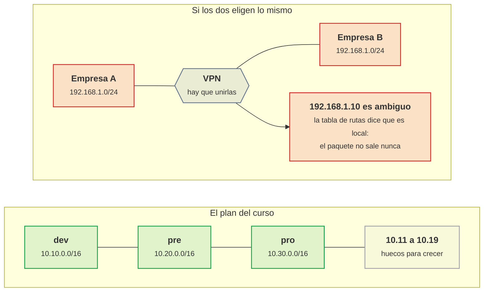
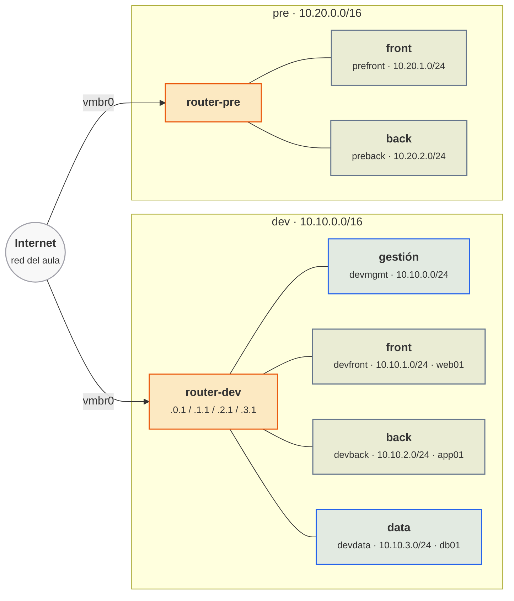
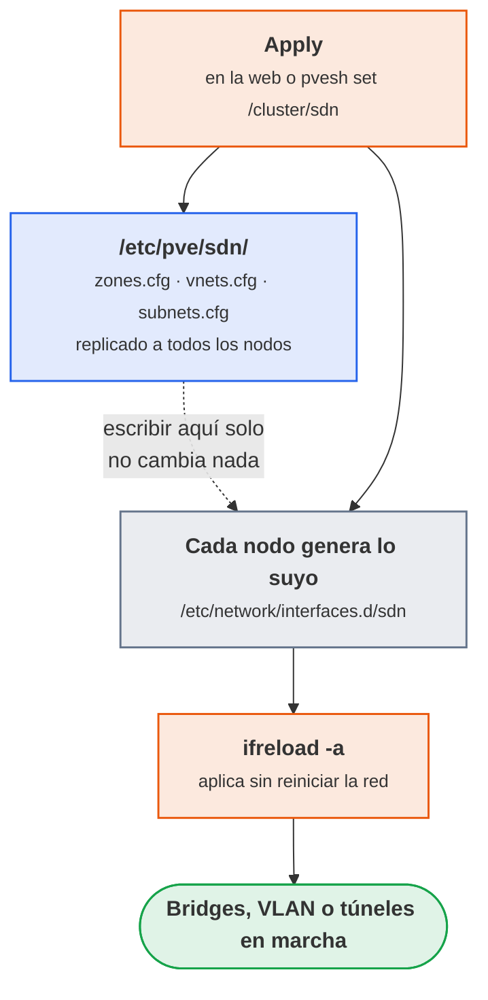
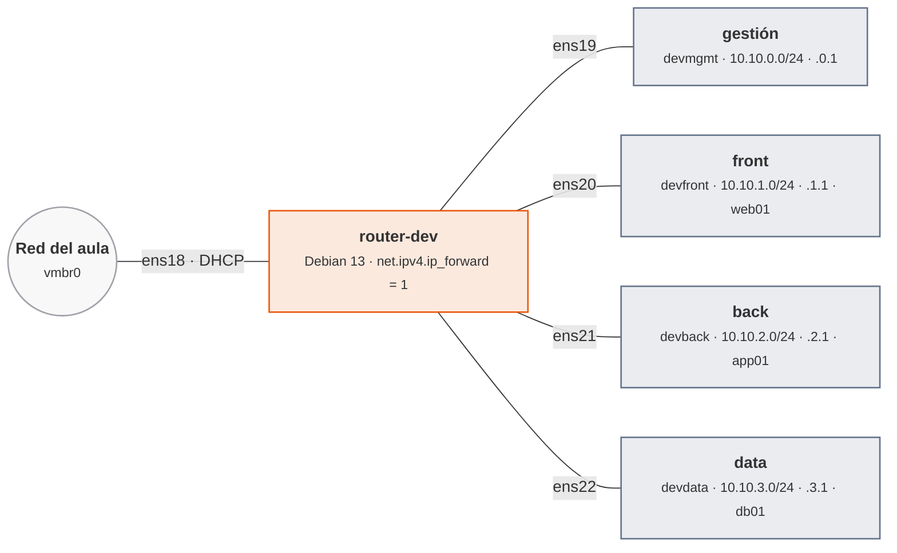
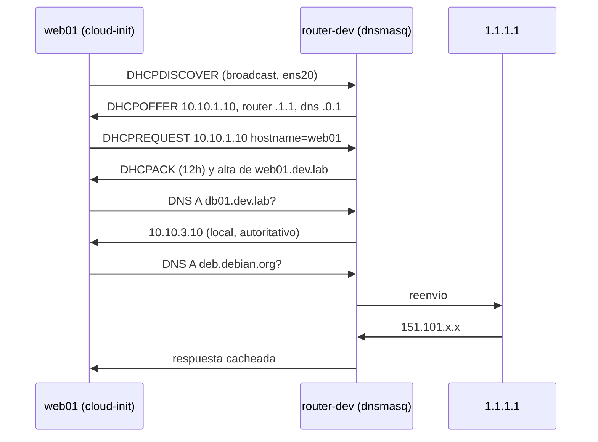
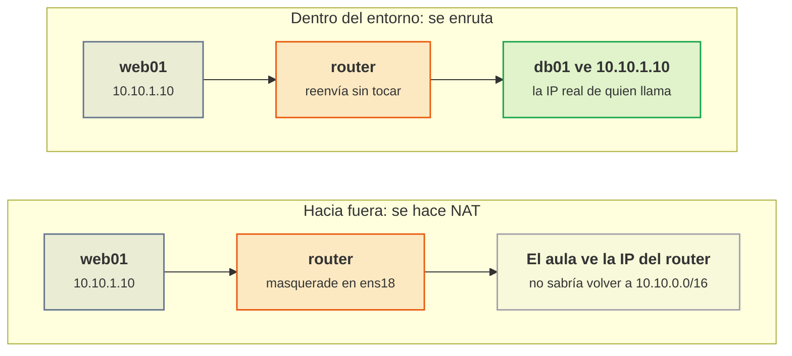
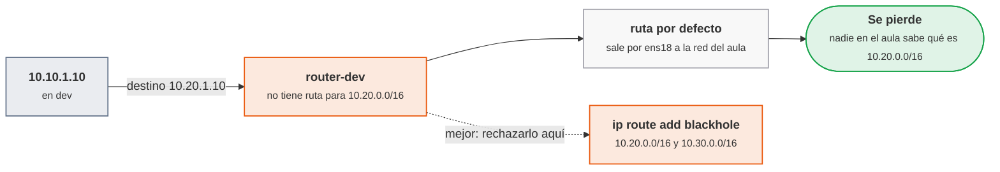
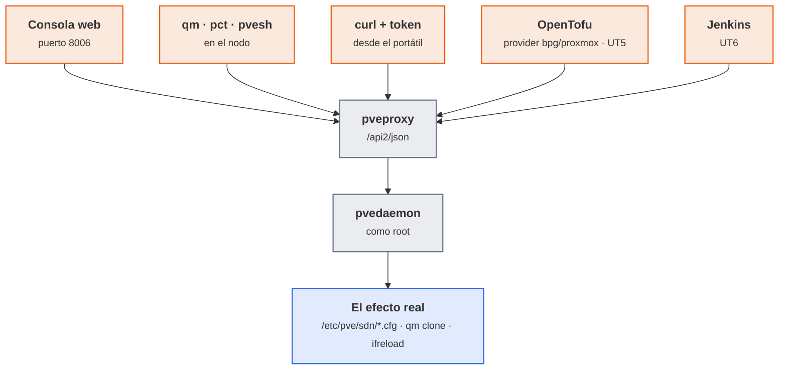

# UT2 · Nubes privadas virtuales (VPC)

<p class="ut-meta">14 h · Sesiones 7 a 13 · RA1 CE b, c</p>

La UT1 dejó un Proxmox funcionando, una plantilla Debian con cloud-init (ID 9000; cloud-init es lo que configura nombre, red y usuario en el primer arranque de cada clon) y un par de bridges (los switches virtuales del nodo). Hasta ahora las máquinas clonadas caían todas en la misma red, la del aula, y eso vale para probar pero no para lo que viene. En esta unidad se construye la red de verdad: tres entornos (dev, pre, pro) separados, cada uno con sus subredes por capa, su router, su DHCP y su DNS interno, y con la garantía de que lo que pasa en dev no puede tocar pro. Todo lo que se monta aquí es el suelo sobre el que la UT3 pone cortafuegos, DMZ y proxy inverso, y lo que en la UT5 se vuelve a crear desde cero con OpenTofu sin pasar por la consola web. Por eso la última sesión de contenido es la de la CLI y la API: si se sabe hacerlo a mano con `pvesh` (el cliente de la API de Proxmox que va en el propio nodo), el provider de Terraform deja de ser magia.

## Introducción

Esta unidad construye la red de los tres entornos del curso. Antes de la primera sesión conviene tener claro qué se pide al terminar, qué herramientas aparecen y cómo se reparte el trabajo por sesiones.

### Qué tienes que saber hacer al terminar

- Diseñar el direccionamiento de varios entornos con bloques RFC 1918 que no se solapen y justificar el tamaño de cada bloque y cada subred (CE b).
- Crear con el SDN de Proxmox una zona, una VNet por cada zona del entorno con su subred, aplicar la configuración y conectar VM a ellas (CE b).
- Montar un router de entorno con reenvío IP, NAT de salida y dnsmasq como DHCP y DNS interno, con reservas por MAC y registros propios (CE c).
- Conseguir que dos subredes del mismo entorno se hablen y que dos entornos distintos no se vean, y demostrarlo con pruebas documentadas (CE b, c).
- Recrear un entorno completo desde un script con `qm`, `pct` y `pvesh`, y borrarlo, de forma idempotente (CE b).

### Los conceptos de la unidad

Hoy todas las VM del aula cuelgan del mismo bridge, `vmbr0`: el `app01` de uno ve el `app01` del compañero, un `nmap` lanzado "para probar" recorre la red entera del instituto, y si alguien levanta un DHCP por error en su VM, media clase se queda sin IP. En una empresa con dev, pre y pro en la misma red pasa lo mismo, pero lo que cae es producción. Lo que se persigue al terminar cabe en una frase: que cada uno tenga tres redes propias (dev, pre y pro), separadas entre sí, cada una con sus subredes y un router que reparte direcciones y nombres, y que todo eso se cree y se borre con un script.

| Herramienta o concepto | Qué es, en una frase | Para qué se usa en esta unidad |
|---|---|---|
| VPC (nube privada virtual) | Una red privada propia dentro de una infraestructura compartida, con su rango de direcciones y su salida a Internet | Es lo que se construye: una por entorno |
| CIDR y RFC 1918 | La notación `10.10.1.0/24` para escribir redes y la lista de rangos privados que cualquiera puede usar en casa | Diseñar el direccionamiento sin que dos redes choquen |
| SDN de Proxmox | El módulo de Proxmox que crea redes virtuales desde la consola central (zona, VNet, subnet) | Crear la red de cada entorno y enchufar las VM |
| VLAN y VXLAN | Dos formas de llevar varias redes separadas por el mismo cable: etiquetando la trama o envolviéndola en un paquete IP | Elegir el tipo de zona del SDN |
| Router de entorno | Una VM Debian con una pata en cada subred que reenvía paquetes entre ellas y hacia fuera | Que front hable con back y que el entorno salga a Internet |
| nftables | El cortafuegos y traductor de direcciones que trae Debian, sucesor de iptables | Hacer NAT de salida en el router |
| dnsmasq | Un programa pequeño que reparte IP (DHCP) y resuelve nombres (DNS) a la vez, el mismo que llevan los routers de casa | Dar IP, gateway y nombre a cada VM sin tocarlas una a una |
| cloud-init | El agente que configura una VM en el primer arranque con lo que le pasa Proxmox (nombre, red, clave SSH) | Que cada clon pida IP por DHCP y se registre en el DNS solo |
| ping, traceroute, dig, nmap, tcpdump | Las herramientas clásicas para comprobar una red: alcance, camino, nombres, puertos y tráfico real | Demostrar con evidencias que la red hace lo que se dice |
| qm, pct y pvesh | Los tres mandos de Proxmox desde la terminal: VM, contenedores y cualquier ruta de la API | Crear y destruir un entorno con un script |
| API REST con token | La misma puerta que usa la consola web, llamada por HTTP desde fuera con una credencial revocable | Preparar lo que OpenTofu (UT5) y Jenkins (UT6) harán solos |

Cómo está organizada la unidad: conviene seguir las sesiones en orden, y cada sesión trae primero la teoría que se explica ese día y después su hoja de práctica. En la sesión 7 se dibuja el direccionamiento de los tres entornos; en la 8 se crean en el SDN las cuatro VNets de dev, una por zona; en la 9 esa red recibe su router con dnsmasq, que reparte IP y nombres; en la 10 se comprueba que front y back se hablan a través del router y se aprende a leer lo que devuelven ping, traceroute, dig y tcpdump; en la 11 se replican pre y pro y se demuestra que dev no llega a ellos; en la 12 todo lo anterior se repite con scripts, `pvesh` y un token de API, que es la puerta a la UT5; y la 13 es la práctica evaluable. Al final quedan, para consultar cuando algo falle, los errores frecuentes del laboratorio.

!!! otra "Dónde se usa esto en la otra asignatura"
    Mientras se cursa esta unidad (28 oct a 18 nov), en Mantenimiento toca la [UT2 de alarmas](https://victor-educ.github.io/apuntes-5169/ut/ut2-alarmas/) con `app01` y `mon01`, las dos VM del bridge del aula (`vmbr0`) clonadas en la UT1. Están ahí de forma provisional porque la VPC que se construye aquí no existía.
    Cuando la VPC dev esté terminada, esas dos VM se mueven a sus subredes: `app01` a back (`10.10.2.10`) y `mon01` a gestión (`10.10.0.20`). `app01` lleva una sola tarjeta, la de su zona: las máquinas de servicio no tienen pata de gestión, y Prometheus llega a sus exporters atravesando el cortafuegos que se monta en la UT3. El traslado se hace en la [UT3 de Mantenimiento](https://victor-educ.github.io/apuntes-5169/ut/ut3-seguridad-monitorizacion/) (26 nov a 10 dic), que coincide con la UT3 de aquí y aprovecha que ya hay cortafuegos.
    Por eso conviene que las reservas por MAC y los registros DNS de `dev.conf` incluyan a `app01` y `mon01` desde ahora: al llegar a la VPC tienen que seguir llamándose igual, o Prometheus dejará de encontrar sus targets.

### Plan de sesiones

Cada sesión de 110 minutos empieza con una explicación corta y sigue con laboratorio. La columna «Se explica» recoge los apartados de teoría que se desarrollan en clase, con su duración aproximada; la columna «Se practica», el trabajo de laboratorio de esa sesión. Las sesiones marcadas solo como práctica no traen teoría nueva.

| Sesión | Fecha | Tipo | Se explica | Se practica |
|---:|-------|------|------------|-------------|
| [7](#sesion-7-diseno-de-la-vpc-dev) | 28 oct | Teoría y práctica | Qué es una VPC, CIDR y subnetting, RFC 1918, por qué /16 por entorno (25 min). | Diseñar en papel los tres entornos con tabla de direccionamiento propia (no copiar el ejemplo), justificar tamaños con ipcalc y comprobar que ningún bloque se solapa. |
| [8](#sesion-8-crear-la-vpc-dev-con-sdn) | 30 oct | Teoría y práctica | Zonas, VNets y subredes del SDN de Proxmox; DHCP e IPAM integrados (15 min). | Crear en SDN la zona lab y las cuatro VNets de dev con DHCP; conectar dos VM de zonas distintas y comprobar IP e IPAM. |
| [9](#sesion-9-dhcp-y-dns-propios) | 4 nov | Teoría y práctica | dnsmasq: rangos, reservas por MAC, registros y expand-hosts; por qué un router de entorno (20 min). | Sustituir el DHCP del SDN por la VM router con dnsmasq, reservar IP para web01 y db01, crear api.dev.lab y comprobar con dig. |
| [10](#sesion-10-comunicacion-entre-zonas) | 6 nov | Teoría y práctica | Enrutar frente a hacer NAT; ip_forward y nftables masquerade (15 min). | Activar el reenvío en el router, comprobar web01 a db01 con ping y nc, capturar el tráfico en el router con tcpdump. |
| [11](#sesion-11-segundo-y-tercer-entorno-aislamiento) | 11 nov | Práctica | Repaso de cinco minutos de cómo se prueba el aislamiento. | Replicar pre y pro, lanzar nmap -sn desde dev contra pre y pro, documentar cada prueba con la plantilla del apartado de pruebas. |
| [12](#sesion-12-automatizar-con-la-cli-de-proxmox) | 13 nov | Teoría y práctica | qm, pct y pvesh; la API REST con token como antesala del provider de OpenTofu (20 min). | Script que crea las tres VM de un entorno y otro que las destruye; ejecutar cada uno dos veces sin errores. |
| [13](#sesion-13-practica-evaluable) | 18 nov | Práctica evaluable | Aclaración del enunciado (10 min). | Cerrar la memoria: esquema, direccionamiento, configuración, scripts y las cinco pruebas documentadas. |

## Sesión 7 · Diseño de la VPC dev

<p class="ut-meta" markdown>28 de octubre · Teoría y práctica · <span class="dur" tabindex="0" aria-label="Qué es una VPC · 10 min&#10;Diseño de direccionamiento · 15 min&#10;A2.1 Diseño · 85 min" data-dur="Qué es una VPC · 10 min&#10;Diseño de direccionamiento · 15 min&#10;A2.1 Diseño · 85 min">:material-school:<i class="dur-barra" style="--teoria:23%"></i>:material-flask:</span></p>

Al acabar esta sesión queda el plano de los tres entornos en papel, con una tabla de direccionamiento propia. Para la hoja hacen falta los dos apartados que siguen: qué es una VPC y qué piezas tiene, y cómo se calcula y se elige el direccionamiento.

### Qué es una VPC

Antes de crear nada en Proxmox conviene saber qué se está imitando. Todo lo que se monta en esta unidad tiene un nombre y un equivalente en cualquier nube pública, y quien entienda las piezas aquí no tendrá que volver a aprenderlas en la UT4.

Una Virtual Private Cloud es una red privada, aislada y definida por software dentro de una infraestructura que se comparte con otros. En nube pública (AWS, Azure, Google Cloud) es el primer recurso que se crea: dentro de ella van las subredes, las instancias, los balanceadores y las bases de datos gestionadas. En una nube privada como Proxmox u OpenStack el concepto es idéntico aunque el nombre cambie (SDN, red definida por software; red de proyecto; red de tenant, es decir, de cliente). La idea de fondo es que el rango de direcciones, cómo se trocea y qué sale a Internet y qué no lo decide quien diseña la red, y nadie de fuera de la VPC puede alcanzar sus máquinas salvo que se le abra la puerta.

<figure markdown="span">
  { width="640" }
  <figcaption>Esquema de una VPC con subredes. Fuente: Sam Johnston, CC BY-SA 3.0, vía Wikimedia Commons.</figcaption>
</figure>

Los componentes son siempre los mismos, cambie el proveedor que cambie. En la tabla salen siglas (CIDR, NAT, SNAT, EVPN) que se explican con calma en los apartados siguientes; de momento basta con la columna del medio:

| Componente | Qué es | Equivalente en Proxmox |
|---|---|---|
| Bloque CIDR | Rango de IP de toda la VPC (p. ej. 10.10.0.0/16) | Conjunto de subnets de una VNet |
| Subred | Trozo del bloque, normalmente por capa o zona (10.10.1.0/24) | VNet + Subnet en SDN |
| Zona de disponibilidad | Centro de datos independiente dentro de una región | Nodo del clúster |
| Tabla de rutas | Hacia dónde sale cada subred | Router virtual (VM) o zona EVPN |
| Gateway de Internet / NAT | Salida a Internet de subredes públicas o privadas | VM con NAT / firewall, o SNAT del SDN |
| DNS interno | Nombres para las máquinas de la VPC | dnsmasq / Pi-hole |
| Grupos de seguridad | Reglas de tráfico por instancia | Firewall de Proxmox (nivel VM) o del router |

Una subred es pública cuando tiene ruta directa a Internet en los dos sentidos: ahí van balanceadores, proxies inversos, bastiones. Una subred es privada cuando solo sale por NAT (puede descargar paquetes, nadie puede entrar) o directamente no sale (la base de datos no tiene ninguna razón para hablar con Internet). En el laboratorio, front será la subred "pública" de cada entorno y back la privada; la de gestión es privada y además solo accesible desde una red concreta.

Para situarse de cara a la UT4, la misma idea recibe estos nombres en cada sitio:

| Concepto | Proxmox SDN | AWS | Azure | GCP |
|---|---|---|---|---|
| Red privada aislada | Zona + VNet | VPC | Virtual Network (VNet) | VPC network |
| Subred | Subnet | Subnet (ligada a una AZ) | Subnet | Subnet (ligada a una región) |
| Zona de disponibilidad | Nodo | Availability Zone | Availability Zone | Zone |
| Salida NAT | VM router / SNAT | NAT Gateway | NAT Gateway | Cloud NAT |
| DNS interno | dnsmasq | Route 53 Resolver | Azure DNS privado | Cloud DNS |
| Reglas por instancia | Firewall de Proxmox | Security Group | NSG (grupo de seguridad de red) | Firewall rules |
| Unión de dos VPC | Ruta en el router | VPC Peering / Transit Gateway | VNet Peering | VPC Peering |

### Diseño de direccionamiento

Antes de crear nada se dibuja. Esto no es una frase de manual: cambiar un rango de IP cuando ya hay veinte máquinas, un DNS y reglas de firewall que lo referencian cuesta una tarde entera y algún disgusto. Cinco minutos de papel ahorran eso.

#### Repaso rápido de CIDR y subnetting

Una dirección IPv4 son 32 bits. La notación CIDR `10.10.1.0/24` dice que los 24 primeros bits identifican la red y los 8 restantes al host. Con eso se calcula todo lo demás:

- Máscara: 24 bits a uno, `255.255.255.0`.
- Direcciones en la red: 2^(32-24) = 256.
- Hosts utilizables: 256 menos la dirección de red (`10.10.1.0`) y la de broadcast (`10.10.1.255`), 254.
- Primera y última IP de host: `10.10.1.1` y `10.10.1.254`.

El mismo cálculo con otros prefijos habituales:

| Prefijo | Máscara | Direcciones | Hosts útiles | Ejemplo | Broadcast |
|---|---|---|---|---|---|
| /16 | 255.255.0.0 | 65 536 | 65 534 | 10.10.0.0/16 | 10.10.255.255 |
| /22 | 255.255.252.0 | 1 024 | 1 022 | 10.10.4.0/22 | 10.10.7.255 |
| /24 | 255.255.255.0 | 256 | 254 | 10.10.1.0/24 | 10.10.1.255 |
| /26 | 255.255.255.192 | 64 | 62 | 10.10.1.64/26 | 10.10.1.127 |
| /28 | 255.255.255.240 | 16 | 14 | 10.10.1.16/28 | 10.10.1.31 |
| /30 | 255.255.255.252 | 4 | 2 | 10.10.9.0/30 | 10.10.9.3 |

Conviene fijarse en el /22: `10.10.4.0/22` cubre desde `10.10.4.0` hasta `10.10.7.255`, es decir, cuatro /24 seguidos. El truco para no equivocarse es que la dirección de red tiene que ser múltiplo del tamaño del bloque en el octeto que se parte: un /22 solo puede empezar en .0, .4, .8, .12... del tercer octeto. `10.10.5.0/22` no es una red válida (su red real sería `10.10.4.0/22`) y Proxmox lo rechaza al crear la subnet. En AWS y Azure, además, el proveedor se reserva las cinco primeras direcciones de cada subred (red, router, DNS, futuro y broadcast), así que un /28 allí se queda en 11 hosts.

Una herramienta que conviene tener a mano es `ipcalc` (paquete `ipcalc` en Debian) o `sipcalc`:

```bash
$ ipcalc 10.10.4.0/22
Address:   10.10.4.0            00001010.00001010.000001 00.00000000
Netmask:   255.255.252.0 = 22   11111111.11111111.111111 00.00000000
Network:   10.10.4.0/22         00001010.00001010.000001 00.00000000
HostMin:   10.10.4.1
HostMax:   10.10.7.254
Broadcast: 10.10.7.255
Hosts/Net: 1022                  Class A, Private Internet
```

#### RFC 1918 y el problema del solapamiento

La [RFC 1918](https://www.rfc-editor.org/rfc/rfc1918) reserva tres rangos que nunca se enrutan en Internet y que cualquiera puede usar dentro de casa: `10.0.0.0/8` (16 millones de direcciones), `172.16.0.0/12` (de 172.16.0.0 a 172.31.255.255, un millón) y `192.168.0.0/16` (65 536). Además existe `100.64.0.0/10` ([RFC 6598](https://www.rfc-editor.org/rfc/rfc6598)), pensado para el CGNAT de los operadores (el NAT a gran escala que hacen los proveedores de fibra), que algunas empresas usan para redes de tránsito precisamente porque nadie lo pone en una oficina.

El error clásico es elegir el rango sin pensar en el futuro. Dos redes que hoy están separadas pueden tener que hablarse mañana: dev con pre para promocionar una imagen, la VPC de la empresa con la del proveedor por VPN, una nube privada con AWS por peering. Si las dos usan `192.168.1.0/24` (y lo usan, es la red por defecto de medio mundo), una máquina de un lado que quiera hablar con `192.168.1.10` del otro lado no tiene forma de saber a cuál se refiere: la tabla de rutas le dice que esa red es local y el paquete nunca sale. La solución en ese momento es NAT doble (traducir un lado a un rango ficticio), y quien lo haya tenido que mantener no lo repite. Por eso:

- Un bloque distinto por entorno, sin solapar. En el curso: `10.10.0.0/16` para dev, `10.20.0.0/16` para pre, `10.30.0.0/16` para pro. Los huecos entre medias (10.11 a 10.19) quedan para crecer.
- Dentro de cada entorno, una subred por capa: front (expuesta), back (aplicación), data (bases de datos) y gestión (acceso administrativo, monitorización).
- Evitar `192.168.0.0/24`, `192.168.1.0/24`, `10.0.0.0/24` y `172.16.0.0/24`.

!!! truco "Los cuatro rangos que no hay que usar nunca"
    Son los que trae por defecto cualquier router doméstico y casi cualquier VPN de teletrabajo. El día que
    alguien se conecte desde casa a la VPN de la empresa, su router y la red de destino serán la misma red y
    no habrá arreglo limpio. Elegir un bloque raro dentro de `10.0.0.0/8` evita ese problema.



<p class="pie" markdown>Elegir el rango es una decisión de dentro de cinco años. El día que haya que unir dos redes, o no se solapan o toca NAT doble.</p>

#### Por qué /16 por entorno y /24 por subred

Un /16 son 65 534 direcciones y en dev habrá seis máquinas. Parece un desperdicio, pero el espacio privado no cuesta dinero y lo que sí cuesta es renumerar. Con un /16 hay 256 subredes /24 posibles por entorno, así que se puede dar una a cada capa, otra a cada zona de disponibilidad (front-a, front-b), otra a cada cliente si el entorno se vuelve multi-tenant (varios clientes sobre el mismo hardware), y aún sobran doscientas. Un /24 por subred da 254 hosts, más que suficiente para una capa, y tiene la ventaja de que se lee de un vistazo: en `10.10.2.37` se ve que es dev (10.10), back (.2) y un servidor fijo (.37) sin mirar ninguna tabla. Ese "se lee de un vistazo" es lo que salva al leer una captura de tcpdump a las cinco de la tarde.

Ejemplo usado en el curso (la A2.1 pide inventar uno propio):

| Entorno | Bloque | Gestión | Front | Back | Data |
|---|---|---|---|---|---|
| dev | 10.10.0.0/16 | 10.10.0.0/24 | 10.10.1.0/24 | 10.10.2.0/24 | 10.10.3.0/24 |
| pre | 10.20.0.0/16 | 10.20.0.0/24 | 10.20.1.0/24 | 10.20.2.0/24 | 10.20.3.0/24 |
| pro | 10.30.0.0/16 | 10.30.0.0/24 | 10.30.1.0/24 | 10.30.2.0/24 | 10.30.3.0/24 |

Convención dentro de cada /24: `.1` el router del entorno, que además hace de DNS y de DHCP, `.2` a `.9` reservadas y sin usar, `.10` a `.99` servidores con IP fija (reservada por MAC en DHCP), `.100` a `.199` rango DHCP dinámico para máquinas de usar y tirar, `.200` a `.254` pruebas, balanceadores e IP virtuales. Conviene escribirla en la memoria y respetarla: la convención vale más que el rango concreto.



<p class="pie" markdown>Entre dev y pre no hay ninguna línea, y eso es justo el aislamiento: no es una regla que prohíbe, es que no existe el camino.</p>

Entre dev y pre no hay ninguna línea. Eso es el aislamiento: no es una regla de firewall que prohíbe, es que no existe el camino.

### A2.1 Diseño (sesión 7)

<span class="et et-obj">Objetivo</span> Tener el plano de los tres entornos en papel, con una tabla de direccionamiento propia justificada.

<span class="et et-pre">Antes de empezar</span> Explicado en esta sesión: [qué es una VPC](#que-es-una-vpc) y [CIDR y RFC 1918](#diseno-de-direccionamiento).

<span class="et et-pas">Pasos</span>

1. Dibuja los tres entornos (dev, pre, pro) con sus subredes, su router y sus servicios de red, como el esquema del apartado de diseño pero con tus nombres.
2. Rellena tu tabla de direccionamiento (entorno, bloque, gestión, front, back, data). No copies los rangos del ejemplo: elige otro bloque de RFC 1918 y escribe en una línea por qué ese.
3. Justifica cada tamaño con el cálculo de máscara, direcciones, hosts útiles y broadcast. Añade la convención de IP dentro de cada /24 y el rango de ID de VM por entorno.
4. Comprueba que nada se solapa, ni entre entornos ni con la red del aula:

    ```bash
    apt install ipcalc
    ipcalc 172.20.0.0/16      # tu bloque de dev
    ipcalc 172.21.0.0/16      # tu bloque de pre
    ip -4 addr show vmbr0     # la red del aula, para descartar el choque
    ```

<span class="et et-com">Comprobación</span> Ningún bloque se solapa entre sí ni con la red del aula, y cada tamaño está justificado con el cálculo de hosts.

<span class="et et-ent">Entrega</span> En `ut2/a21` de tu repositorio: el esquema y la tabla de direccionamiento con las justificaciones.

## Sesión 8 · Crear la VPC dev con SDN

<p class="ut-meta" markdown>30 de octubre · Teoría y práctica · <span class="dur" tabindex="0" aria-label="SDN en Proxmox · 15 min&#10;A2.2 Crear la VPC dev con SDN · 95 min" data-dur="SDN en Proxmox · 15 min&#10;A2.2 Crear la VPC dev con SDN · 95 min">:material-school:<i class="dur-barra" style="--teoria:14%"></i>:material-flask:</span></p>

Al acabar esta sesión quedan creadas en el SDN las cuatro VNets de dev (`devmgmt`, `devfront`, `devback` y `devdata`), con dos VM de zonas distintas que reciben IP de su subred. Para la hoja hace falta el apartado que sigue: qué son zona, VNet y subnet en el SDN de Proxmox, y por qué una VNet por zona.

### SDN en Proxmox

Con el plano en papel toca construirlo. Este apartado crea la red de cada entorno desde la consola de Proxmox y explica qué pasa por debajo al pulsar Apply, porque cuando el SDN falla (y falla) hay que saber dónde mirar.

Proxmox VE incorpora desde la versión 8 un módulo de redes definidas por software, en Datacenter → SDN, que sustituye al trabajo manual de crear bridges en cada nodo. La jerarquía tiene tres niveles y conviene tenerla clara porque el provider de OpenTofu usa exactamente los mismos objetos:

- Zona: define el tipo de red y en qué nodos existe. Es el "cómo se transporta el tráfico".
- VNet: una red virtual dentro de la zona. Al crear una VM aparece en el desplegable de bridges como si fuera un `vmbrN` más. Es el "cable" al que se conecta la máquina.
- Subnet: un rango CIDR dentro de la VNet, con gateway opcional, rango DHCP opcional y SNAT opcional.

Además hay dos objetos transversales: IPAM (el registro de qué IP está asignada a quién; el que viene de serie se llama `pve` y guarda el estado en `/etc/pve/priv/ipam.db`) y DNS (integración con un servidor PowerDNS externo para que el IPAM registre nombres automáticamente; en el laboratorio del curso no se usa y el DNS lo resuelve dnsmasq).

#### Una VNet por zona, una subred por VNet

Proxmox admite varias subredes dentro de la misma VNet, pero no conviene aprovecharlo. Una VNet es un bridge, es decir, un único dominio de capa 2: dos subredes en el mismo bridge comparten el mismo cable virtual, sus máquinas se alcanzan por ARP y no hay forma de poner un cortafuegos en medio, porque para filtrar entre dos redes el tráfico tiene que pasar por un router y para eso las redes tienen que colgar de bridges distintos. Si las cuatro zonas de dev vivieran en una sola VNet, la UT3 no tendría dónde filtrar.

Por eso cada entorno tiene cuatro VNets, una por zona, y cada VNet una sola subred:

| VNet | Subred | Zona | Papel que tendrá en la UT3 |
|---|---|---|---|
| `devmgmt` | 10.10.0.0/24 | gestión | Red de administración |
| `devfront` | 10.10.1.0/24 | front | DMZ externa |
| `devback` | 10.10.2.0/24 | back | DMZ interna |
| `devdata` | 10.10.3.0/24 | data | Zona interna |

El nombre se forma juntando el entorno y la zona, sin guiones: `devmgmt`, `devfront`, `devback`, `devdata`, y lo mismo en los otros dos entornos (`prefront`, `preback`, `proback`, `prodata`...). No es una manía de estilo: el ID de una VNet, igual que el de una zona, admite como máximo ocho caracteres alfanuméricos, así que un nombre como `vdev-front`, con diez caracteres y un guion, Proxmox lo rechaza al crearlo.

#### Tipos de zona y cuándo usar cada uno

| Zona | Cómo funciona | Alcance | Cuándo |
|---|---|---|---|
| Simple | Crea un bridge Linux sin interfaz física por cada VNet. Aislado. Puede hacer SNAT hacia fuera. | Un nodo (las VM de otro nodo no ven la red) | Laboratorio de un solo nodo, redes de pruebas, lo que se usa en la A2.2 |
| VLAN | Cada VNet es un tag 802.1Q sobre un bridge físico existente (vmbr0). El switch físico tiene que dejar pasar esas VLAN. | Todo el clúster, si el switch está configurado | Empresa pequeña con switches gestionables; lo más habitual en producción on-premise |
| QinQ | VLAN dentro de VLAN (802.1ad). Una VLAN de servicio por zona y VLAN de cliente por VNet. | Clúster | Proveedores que necesitan más de 4094 segmentos o aislar clientes que a su vez usan VLAN |
| VXLAN | Encapsula tramas Ethernet en UDP (puerto 4789) entre los nodos. No necesita nada del switch físico. | Clúster (túnel entre las IP de los nodos) | Clúster de varios nodos sin control sobre la red física; nube |
| EVPN | VXLAN más BGP (el protocolo de enrutado de Internet, aquí hablado por el software FRR) para anunciar MAC e IP entre nodos, con enrutado distribuido: cada nodo es gateway de sus VM. | Clúster, y puede salir a routers externos | Cuando se quiere que el SDN enrute entre VNets sin una VM router; es lo más parecido a una VPC de nube |

Elegir bien la zona es la decisión más importante de esta unidad y la que menos se puede deshacer, porque cambiar de zona implica recrear las VNets. El criterio habitual: Simple en un laboratorio de un solo nodo y sin control del switch, que es el caso del curso; en una empresa con dos o tres nodos y switches propios, VLAN, que es lo que el equipo de redes ya entiende; VXLAN cuando los nodos están en sitios distintos o la red física no es propia; EVPN solo cuando de verdad haga falta que el enrutado sea distribuido, porque añade BGP y FRR a la ecuación y eso se depura peor.

#### VLAN 802.1Q frente a VXLAN

Los dos tipos de zona que se usan fuera del laboratorio llevan varias redes por el mismo cable de dos maneras distintas: la VLAN etiqueta la trama Ethernet y necesita que cada switch del camino conozca la etiqueta; VXLAN envuelve la trama entera dentro de un paquete UDP/IP, atraviesa routers y no exige nada al switch. La comparación completa (tamaño del identificador, coste de proceso y cuándo se elige cada una) está en [VLAN frente a VXLAN](../ampliacion.md#vlan-frente-a-vxlan). Del lado práctico solo hay que retener una consecuencia: esa envoltura añade unos 50 bytes, así que con VXLAN la MTU (el tamaño máximo de paquete que admite una interfaz) de las VM baja a 1450 si la red física va a 1500.

!!! ojo "Si se olvida la MTU, el fallo no parece de red"
    Los ping pequeños funcionan y las transferencias grandes se cuelgan sin dar error. Es el síntoma más
    engañoso de la unidad: parece el disco, parece la aplicación, y es la MTU. Ante una transferencia que se
    para, conviene probar primero `ping -M do -s 1400`.

#### Qué hace Apply por debajo

La configuración del SDN se escribe en `/etc/pve/sdn/` (ficheros `zones.cfg`, `vnets.cfg`, `subnets.cfg`), que está en el sistema de ficheros del clúster y por tanto se replica a todos los nodos. Pero escribir ahí no cambia nada en la red. Al pulsar Apply (o `pvesh set /cluster/sdn`), cada nodo genera el fichero `/etc/network/interfaces.d/sdn` con los bridges, VLAN o túneles VXLAN que le tocan y ejecuta `ifreload -a` (de ifupdown2, la herramienta que gestiona las interfaces de red en Proxmox), que aplica los cambios sin reiniciar la red.



<p class="pie" markdown>La configuración vive en el clúster; la red de verdad la levanta cada nodo al aplicar.</p>
 Un ejemplo de lo que aparece para una zona Simple con la VNet `devfront`; las otras tres salen igual, cada una con su nombre y su alias:

```text
auto devfront
iface devfront
        bridge_ports none
        bridge_stp off
        bridge_fd 0
        mtu 1500
        alias dev front
```

Si en `/etc/network/interfaces` no está la línea `source /etc/network/interfaces.d/*` (viene en instalaciones nuevas, pero no siempre en las actualizadas desde versiones antiguas), Apply dirá que todo va bien y no habrá ningún bridge. Es la primera cosa que se comprueba cuando "el SDN no hace nada".

#### DHCP e IPAM integrados

Desde Proxmox 8.1 una zona puede llevar `DHCP: dnsmasq`. Proxmox arranca entonces una instancia de dnsmasq por zona (unidad `dnsmasq@<zona>.service`, configuración en `/etc/dnsmasq.d/<zona>/`) que escucha en las VNets de esa zona y entrega las IP que el IPAM ha reservado para cada VM. Con una zona Simple y la subnet de `devfront` con gateway `10.10.1.1` y rango DHCP `10.10.1.100-10.10.1.199`, al crear una VM conectada a `devfront` el IPAM le asigna una IP del rango, la ata a su MAC y dnsmasq la sirve. El gateway `.1` lo pone Proxmox en el propio bridge del nodo, así que el nodo es el router de esa subred; si además se marca SNAT en la subnet, el nodo hace masquerade hacia su interfaz de salida y las VM tienen Internet sin ninguna VM router.

Para que funcione hace falta el paquete `dnsmasq` instalado en el nodo pero con la unidad genérica deshabilitada, porque si no compite con las instancias por zona:

```bash
apt install dnsmasq
systemctl disable --now dnsmasq
```

Es cómodo y para probar es perfecto. La razón por la que en la A2.3 se sustituye por una VM router propia es didáctica y práctica a la vez: el DHCP del SDN no hace DNS con nombres propios ni deja tocar opciones finas, y en la UT3 el router de entorno es donde van a vivir las reglas de firewall entre capas. Ese relevo tiene un paso obligatorio: al montar el router hay que quitar el gateway y el rango DHCP de las subredes del SDN, porque el `.1` de una subred solo puede estar en un sitio. Entender qué hace el SDN por debajo (un bridge, un dnsmasq, una regla de nftables) es lo que permite arreglarlo cuando falla.

#### Alternativa sin SDN

Lo que existía antes del SDN sigue funcionando y es lo mismo hecho a mano: en `/etc/network/interfaces` un bridge sin `bridge-ports` (sin interfaz física, por tanto aislado dentro del nodo) por cada zona, `vmbr10` para gestión, `vmbr11` para front, `vmbr12` para back y `vmbr13` para data, y una VM router con una pata en cada uno de ellos y otra en `vmbr0` que hace DHCP, DNS y NAT. Si el SDN da guerra, esto es el plan B y es equivalente para la práctica evaluable.

### A2.2 Crear la VPC dev con SDN (sesión 8)

<span class="et et-obj">Objetivo</span> Tener las cuatro VNets de dev funcionando en el SDN, una por zona, con dos VM de zonas distintas que reciben IP de su subred.

<span class="et et-pre">Antes de empezar</span>

- El nodo Proxmox de la UT1 encendido, con la plantilla 9000, la consola web como `root@pam` y una sesión SSH contra el nodo.
- La tabla de direccionamiento de la A2.1 con tus cuatro rangos de dev: gestión, front, back y data.
- Explicado en esta sesión: [zonas, VNets y subnets del SDN](#sdn-en-proxmox) y [una VNet por zona](#una-vnet-por-zona-una-subred-por-vnet).

<span class="et et-pas">Pasos</span>

1. Prepara el nodo para el DHCP del SDN (paquete instalado, unidad genérica parada):

    ```bash
    apt install dnsmasq
    systemctl disable --now dnsmasq
    ```

2. Datacenter → SDN → Zones → Add → Simple. ID `lab`, DHCP `dnsmasq`, IPAM `pve`. Deja el resto por defecto.
3. Datacenter → SDN → VNets → Create, cuatro veces, una VNet por zona, todas en la zona `lab`: `devmgmt` (alias `dev gestion`), `devfront` (alias `dev front`), `devback` (alias `dev back`) y `devdata` (alias `dev data`). Recuerda el límite: ocho caracteres alfanuméricos como máximo, sin guiones.
4. Con cada VNet seleccionada, Subnets → Create, una sola subred por VNet, con tus rangos. Para cada una: Subnet (el CIDR), Gateway (el `.1`), y en la pestaña DHCP Ranges el rango `.100` a `.199`. Con el ejemplo del curso: `10.10.0.0/24` con gateway `10.10.0.1` en `devmgmt`, `10.10.1.0/24` con `10.10.1.1` en `devfront`, `10.10.2.0/24` con `10.10.2.1` en `devback` y `10.10.3.0/24` con `10.10.3.1` en `devdata`. Hoy el gateway y el DHCP los sirve el nodo; en la sesión 9 pasan al router del entorno y se quitan de aquí.
5. Datacenter → SDN → Apply. Comprueba en el nodo que los cuatro bridges existen de verdad:

    ```bash
    cat /etc/network/interfaces.d/sdn
    ip link show devfront
    ip -br link show type bridge      # devmgmt, devfront, devback y devdata
    systemctl status dnsmasq@lab
    ```

    Si el fichero está vacío o los bridges no aparecen, mira que `/etc/network/interfaces` contenga `source /etc/network/interfaces.d/*` (está en [qué hace Apply por debajo](#que-hace-apply-por-debajo)).

6. Pon en su zona las dos VM de servicio de la VPC, con los ID de tu tabla (en el ejemplo del curso, `110` para `web01` en front y `130` para `db01` en data). `web01` ya existe desde la A1.3, en `vmbr0`, así que no se clona otra vez: se apaga, se le cambia el bridge y vuelve a arrancar. `db01` sí nace hoy, de la plantilla:

    ```bash
    qm shutdown 110
    qm set 110 --net0 virtio,bridge=devfront --ipconfig0 ip=dhcp
    qm clone 9000 130 --name db01 --full
    qm set 130 --net0 virtio,bridge=devdata --ipconfig0 ip=dhcp
    qm start 110 && qm start 130
    ```

    `app01` y `mon01` se quedan en `vmbr0` de momento: Mantenimiento las está usando a diario y se trasladan a la VPC en la UT3, cuando ya haya cortafuegos.

7. Entra por consola (VM → Console) en cada una y ejecuta `ip a` y `ip r`. Después mira Datacenter → SDN → IPAM.

<span class="et et-com">Comprobación</span> `ip link show devfront` dice `state UP`, y lo mismo las otras tres; `web01` tiene una IP del rango `10.10.1.100` a `10.10.1.199` con gateway `10.10.1.1`, y `db01` una de `10.10.3.100` a `10.10.3.199` con gateway `10.10.3.1`, cada una de su propia subred; el IPAM lista las dos VM con su MAC e IP; cada VM hace `ping` a su `.1`. Que `web01` alcance a `db01` no es cosa de hoy: eso lo hace el router del entorno de la sesión 9. Si una VM no coge IP, `journalctl -u dnsmasq@lab -f` en el nodo mientras la reinicias enseña el DORA o su ausencia.

<span class="et et-ent">Entrega</span> En `ut2/a22` de tu repositorio: una captura del SDN aplicado con las cuatro VNets, el contenido de `/etc/network/interfaces.d/sdn` y la salida de `ip a` de las dos VM.

<span class="et et-ext">Si te sobra tiempo</span> Marca SNAT en la subnet de `devfront`, aplica, y comprueba desde `web01` que `ping -c 3 deb.debian.org` sale a Internet sin ninguna VM router.

## Sesión 9 · DHCP y DNS propios

<p class="ut-meta" markdown>4 de noviembre · Teoría y práctica · <span class="dur" tabindex="0" aria-label="Servicios de red: enrutado, NAT, DHCP y DNS · 20 min&#10;A2.3 DHCP y DNS propios · 90 min" data-dur="Servicios de red: enrutado, NAT, DHCP y DNS · 20 min&#10;A2.3 DHCP y DNS propios · 90 min">:material-school:<i class="dur-barra" style="--teoria:18%"></i>:material-flask:</span></p>

Al acabar esta sesión la VM `router-dev` reparte IP, gateway y DNS a las máquinas de dev con dnsmasq, con reservas por MAC y nombres propios, y el gateway y el DHCP del SDN quedan retirados. La teoría de hoy es el router de entorno (por qué una VM con una pata en cada VNet y el reenvío IP) y el fichero de dnsmasq línea a línea. El NAT de salida queda configurado hoy siguiendo la hoja, aunque se explica en la sesión 10.

### Servicios de red: enrutado, NAT, DHCP y DNS

Una VNet recién creada es un cable al que se conectan máquinas y nada más: nadie reparte direcciones, nadie resuelve nombres y nadie saca el tráfico a Internet. Este apartado monta la VM que hace esas tres cosas para cada entorno y separa de paso dos ideas que se confunden siempre, enrutar y hacer NAT. Es el apartado con más configuración de la unidad; la A2.4 y la A2.5 salen de aquí.

#### Router de entorno

Una VM Debian 13 clonada de la plantilla, con una interfaz por VNet y otra hacia el exterior. Cada pata cuelga de un bridge distinto, y eso es justo lo que permite filtrar entre zonas: si dos subredes compartieran bridge, el tráfico entre ellas no pasaría por el router y no habría dónde poner una regla. En Proxmox las interfaces virtio (las tarjetas de red paravirtualizadas, las más rápidas para una VM) aparecen en la VM como `ens18`, `ens19`, `ens20`... en el orden de `net0`, `net1`, `net2`. Convención del curso: `ens18` exterior (vmbr0, IP del aula por DHCP), `ens19` gestión (`devmgmt`, `.0.1`), `ens20` front (`devfront`, `.1.1`), `ens21` back (`devback`, `.2.1`) y `ens22` data (`devdata`, `.3.1`).

El router es el `.1` de las cuatro subredes, y es el único: por eso, antes de que dnsmasq entre en juego, hay que quitar el gateway y el rango DHCP que el SDN puso en cada subred en la sesión 8. Si se dejan, en cada red hay dos máquinas que dicen ser el `.1` (el nodo y el router) y dos servidores DHCP repartiendo; las VM cogen una oferta u otra según quién conteste antes y la red se vuelve impredecible.



<p class="pie" markdown>Una pata por VNet, en el orden de `net0`, `net1`, `net2`… Sin el reenvío activado, el router acepta lo suyo y tira el resto: front y back no se hablan.</p>


Lo primero es activar el reenvío IP, que en Debian viene apagado. Sin esto la VM acepta paquetes dirigidos a ella y descarta los demás, así que front y back no se hablan aunque el router tenga pata en las dos:

```bash
# /etc/sysctl.d/99-router.conf
net.ipv4.ip_forward = 1
```

```bash
sysctl --system
sysctl net.ipv4.ip_forward   # debe devolver 1
```

Con el reenvío activo, el router ya encamina entre sus cuatro redes porque todas son redes directamente conectadas: cuando `web01` (10.10.1.10) manda un paquete a `db01` (10.10.3.10), su tabla de rutas dice que 10.10.3.0/24 no es local y lo envía al gateway 10.10.1.1; el router mira su tabla, ve que 10.10.3.0/24 está en `ens22` y lo reenvía. No hace falta añadir ninguna ruta estática. Sí hará falta en la UT3, con un firewall entre medias, y en la UT4, al conectar con la nube.

#### dnsmasq: DHCP y DNS en uno

dnsmasq es un servidor DHCP y un DNS cacheador en un solo binario de medio megabyte, y es lo que hay dentro de casi todos los routers domésticos, de OpenWrt, de libvirt y del propio SDN de Proxmox. Para una VPC de laboratorio es la herramienta correcta: hace DHCP con opciones por subred, sirve nombres para las máquinas internas y reenvía el resto a un DNS público. En una empresa grande lo sustituyen un servidor DHCP dedicado y un DNS propio o gestionado, pero los conceptos son los mismos.

Se instala con `apt install dnsmasq` en la VM router y toda la configuración va en `/etc/dnsmasq.d/`. El fichero del entorno dev, comentado línea a línea. Conviene fijarse sobre todo en tres bloques: las interfaces en las que escucha, los rangos DHCP con su etiqueta por subred y las reservas por MAC; el resto son opciones de DNS que se explican justo después:

```ini
# /etc/dnsmasq.d/dev.conf
# Escuchar solo en las patas internas, nunca en la exterior
interface=ens19
interface=ens20
interface=ens21
interface=ens22
bind-interfaces

# DNS: dominio interno y resolución de nombres
domain=dev.lab
local=/dev.lab/
expand-hosts
no-resolv
server=1.1.1.1
server=9.9.9.9
dhcp-authoritative

# DHCP: un rango por subred, cada uno con su etiqueta (tag)
dhcp-range=set:mgmt,10.10.0.100,10.10.0.199,12h
dhcp-option=tag:mgmt,option:router,10.10.0.1
dhcp-range=set:front,10.10.1.100,10.10.1.199,12h
dhcp-option=tag:front,option:router,10.10.1.1
dhcp-range=set:back,10.10.2.100,10.10.2.199,12h
dhcp-option=tag:back,option:router,10.10.2.1
dhcp-range=set:data,10.10.3.100,10.10.3.199,12h
dhcp-option=tag:data,option:router,10.10.3.1
# Opciones comunes: DNS y dominio de búsqueda para todos
dhcp-option=option:dns-server,10.10.0.1
dhcp-option=option:domain-search,dev.lab

# Reservas por MAC: siempre la misma IP y nombre
dhcp-host=bc:24:11:aa:bb:cc,web01,10.10.1.10
dhcp-host=bc:24:11:aa:bb:dd,app01,10.10.2.10
dhcp-host=bc:24:11:aa:bb:ee,db01,10.10.3.10
dhcp-host=bc:24:11:aa:bb:ff,mon01,10.10.0.20

# Registros DNS que no son máquinas con DHCP
address=/api.dev.lab/10.10.1.10
host-record=lb.dev.lab,10.10.1.200

# Logs (quitar en producción; en clase interesa dejarlos)
log-dhcp
log-queries
```

Cosas que conviene entender de ese fichero:

- Los tags. `dhcp-range=set:front,...` etiqueta con `front` a cualquier cliente que reciba IP de ese rango, y `dhcp-option=tag:front,...` aplica esa opción solo a los etiquetados. Así cada subred recibe su propio router (`.1`) aunque el DNS sea el mismo para todas. dnsmasq elige el rango por la interfaz de llegada de la petición DHCP, por eso da igual que las cuatro subredes estén en el mismo fichero.
- Las reservas (`dhcp-host`). La MAC de una VM de Proxmox se ve en el hardware de la VM o con `qm config 110 | grep net0`. El prefijo `bc:24:11`, los tres primeros bytes de la MAC, identifica al fabricante y es el que usa Proxmox por defecto. Al reservar, la IP queda fuera del rango dinámico (`.10`, no `.100`) para que no haya conflicto, y de regalo dnsmasq crea el registro DNS `web01.dev.lab` con esa IP.
- `expand-hosts` y `domain`. Cuando un cliente manda su nombre de host en la petición DHCP (cloud-init lo hace), dnsmasq lo registra en DNS; con `expand-hosts` le añade el dominio, así `web01` es también `web01.dev.lab`. Sin esa línea solo respondería al nombre corto.
- `local=/dev.lab/` dice que dnsmasq es autoritativo para ese dominio y no reenvía preguntas sobre él a los `server=`. Sin esta línea, preguntar por `noexiste.dev.lab` acabaría en Cloudflare, con la latencia y la fuga de información que eso supone.
- `no-resolv` evita que dnsmasq lea `/etc/resolv.conf` del propio router, que en Debian con DHCP en `ens18` apunta al DNS del aula. Aquí interesa el control explícito.
- `dhcp-authoritative` hace que dnsmasq responda con NAK a clientes que piden renovar una IP que no le consta, lo que acelera mucho la recuperación cuando se reinicia el router y las VM tienen concesiones viejas.

Se comprueba la sintaxis y se aplica con:

```bash
dnsmasq --test          # "syntax check OK"
systemctl restart dnsmasq
journalctl -u dnsmasq -f
```

Las concesiones activas están en `/var/lib/misc/dnsmasq.leases` (una línea por cliente: expiración en epoch, o segundos desde 1970, MAC, IP, nombre, client-id). Es el primer sitio al que mirar cuando "esta VM no tiene IP". Con `log-dhcp` el diálogo completo queda en el journal:

```text
dnsmasq-dhcp[612]: DHCPDISCOVER(ens20) bc:24:11:aa:bb:cc
dnsmasq-dhcp[612]: DHCPOFFER(ens20) 10.10.1.10 bc:24:11:aa:bb:cc
dnsmasq-dhcp[612]: DHCPREQUEST(ens20) 10.10.1.10 bc:24:11:aa:bb:cc
dnsmasq-dhcp[612]: DHCPACK(ens20) 10.10.1.10 bc:24:11:aa:bb:cc web01
```

Las cuatro fases (Discover, Offer, Request, Ack; DORA) son el protocolo DHCP entero. Si aparece Discover sin Offer, dnsmasq no tiene rango para esa interfaz o no escucha en ella. Si aparece Offer sin Request, el cliente no ha recibido la oferta (normalmente un firewall o un bridge mal conectado). Si aparece un NAK, la IP que pide el cliente no cuadra con el rango.



<p class="pie" markdown>El router del entorno responde lo suyo y reenvía el resto: `db01.dev.lab` sale de su propia tabla y `deb.debian.org` va a 1.1.1.1 y se queda en la caché.</p>

Del lado de las VM, la plantilla 9000 de la UT1 lleva cloud-init, así que `qm set 110 --ipconfig0 ip=dhcp` basta para que la máquina pida IP en el arranque, ponga su nombre de host (el `--name` del clon) en la petición y reciba DNS y dominio de búsqueda. El resultado es que `web01` resuelve `db01.dev.lab` y `db01` a secas sin que nadie haya tocado `/etc/hosts`. Si hace falta IP fija sin DHCP (el propio router, por ejemplo), `--ipconfig1 ip=10.10.1.1/24` y `--nameserver 10.10.0.1 --searchdomain dev.lab`.

### A2.3 DHCP y DNS propios (sesión 9)

<span class="et et-obj">Objetivo</span> Que la VM `router-dev`, con una pata en cada VNet y dnsmasq, reparta IP, gateway y DNS a las VM de dev en lugar del SDN, con reserva por MAC para `web01` y `db01` y el nombre `api.dev.lab` resolviendo.

<span class="et et-pre">Antes de empezar</span>

- La zona `lab` y las cuatro VNets de la A2.2 aplicadas, con `web01` en `devfront` y `db01` en `devdata` funcionando.
- Tu tabla de direccionamiento a mano: aquí se usan el `.1` de cada subred y las IP fijas del rango `.10` a `.99`.
- Explicado en esta sesión: [el router de entorno](#router-de-entorno) y [dnsmasq](#dnsmasq-dhcp-y-dns-en-uno). El NAT de salida se explica en la sesión 10, pero lo dejas configurado hoy para que las VM tengan Internet; el fichero está en [enrutar frente a hacer NAT](#enrutar-frente-a-hacer-nat).

<span class="et et-pas">Pasos</span>

1. Retira el gateway y el DHCP del SDN, que a partir de hoy los hace el router. Datacenter → SDN → VNets, y en cada una de las cuatro (`devmgmt`, `devfront`, `devback`, `devdata`) → su subnet → Edit → borra el DHCP Range, borra el Gateway y quita el SNAT si lo marcaste. Apply. Este paso no es opcional: si la subred conserva el gateway, el `.1` lo tiene el nodo y también el router, y si conserva el rango DHCP hay dos servidores repartiendo IP en la misma red. Comprueba que el nodo ya no tiene direcciones en esas redes y que su dnsmasq se ha quedado sin rangos:

    ```bash
    ip -4 addr show devfront        # sin inet 10.10.1.1
    systemctl status dnsmasq@lab
    ```

2. Crea la VM router con una pata en el aula y una por VNet de dev (`net1` gestión, `net2` front, `net3` back, `net4` data). Con los ID del curso, el router del entorno es el `100`:

    ```bash
    qm clone 9000 100 --name router-dev --full
    qm set 100 --net0 virtio,bridge=vmbr0 --ipconfig0 ip=dhcp
    qm set 100 --net1 virtio,bridge=devmgmt  --ipconfig1 ip=10.10.0.1/24
    qm set 100 --net2 virtio,bridge=devfront --ipconfig2 ip=10.10.1.1/24
    qm set 100 --net3 virtio,bridge=devback  --ipconfig3 ip=10.10.2.1/24
    qm set 100 --net4 virtio,bridge=devdata  --ipconfig4 ip=10.10.3.1/24
    qm set 100 --nameserver 1.1.1.1
    qm start 100
    ```

    Cada pata interna cuelga de un bridge distinto, uno por zona: eso es lo que hace que el tráfico entre zonas pase por el router y que en la UT3 haya dónde filtrarlo. En la VM salen como `ens18` (aula), `ens19`, `ens20`, `ens21` y `ens22`.

3. Activa el reenvío IP en el router:

    ```bash
    echo 'net.ipv4.ip_forward = 1' > /etc/sysctl.d/99-router.conf
    sysctl --system
    sysctl net.ipv4.ip_forward     # debe devolver 1
    ```

4. NAT de salida hacia el aula con nftables:

    ```bash
    apt install nftables
    nft add table ip nat
    nft add chain ip nat postrouting '{ type nat hook postrouting priority 100 ; }'
    nft add rule ip nat postrouting oifname "ens18" masquerade
    nft list ruleset > /etc/nftables.conf
    systemctl enable --now nftables
    ```

5. Apunta las MAC de `web01` y de `db01`, las dos VM que clonaste en la A2.2:

    ```bash
    qm config 110 | grep net0
    qm config 130 | grep net0
    ```

6. Instala dnsmasq en el router y escribe el fichero de dev. Sustituye las MAC por las tuyas y las IP por las de tu tabla:

    ```ini
    # /etc/dnsmasq.d/dev.conf
    interface=ens19
    interface=ens20
    interface=ens21
    interface=ens22
    bind-interfaces

    domain=dev.lab
    local=/dev.lab/
    expand-hosts
    no-resolv
    server=1.1.1.1
    server=9.9.9.9
    dhcp-authoritative

    dhcp-range=set:mgmt,10.10.0.100,10.10.0.199,12h
    dhcp-option=tag:mgmt,option:router,10.10.0.1
    dhcp-range=set:front,10.10.1.100,10.10.1.199,12h
    dhcp-option=tag:front,option:router,10.10.1.1
    dhcp-range=set:back,10.10.2.100,10.10.2.199,12h
    dhcp-option=tag:back,option:router,10.10.2.1
    dhcp-range=set:data,10.10.3.100,10.10.3.199,12h
    dhcp-option=tag:data,option:router,10.10.3.1
    dhcp-option=option:dns-server,10.10.0.1
    dhcp-option=option:domain-search,dev.lab

    dhcp-host=bc:24:11:aa:bb:cc,web01,10.10.1.10
    dhcp-host=bc:24:11:aa:bb:dd,app01,10.10.2.10
    dhcp-host=bc:24:11:aa:bb:ee,db01,10.10.3.10
    dhcp-host=bc:24:11:aa:bb:ff,mon01,10.10.0.20

    address=/api.dev.lab/10.10.1.10
    host-record=lb.dev.lab,10.10.1.200

    log-dhcp
    log-queries
    ```

    Incluye desde ya las reservas de `app01` (`10.10.2.10`, en back) y `mon01` (`10.10.0.20`, en gestión): son las VM que se trasladan a esta VPC en la UT3 de Mantenimiento, y al llegar tienen que seguir llamándose igual. Ninguna de las dos lleva una segunda tarjeta: cada máquina tiene una sola pata, la de su zona.

7. Comprueba la sintaxis, arranca y deja el log abierto:

    ```bash
    apt install dnsmasq
    dnsmasq --test          # "syntax check OK"
    systemctl restart dnsmasq
    journalctl -u dnsmasq -f
    ```

8. Reinicia `web01` y `db01` (`qm reboot 110`, `qm reboot 130`) y observa en el journal el DORA de cada una: DISCOVER, OFFER con la IP reservada, REQUEST y ACK con el nombre. Fíjate en la interfaz entre paréntesis: la de `web01` llega por `ens20` y la de `db01` por `ens22`, porque cada una cuelga de una VNet distinta.
9. Desde `web01`, comprueba la resolución interna y externa:

    ```bash
    ip a                                   # 10.10.1.10, no una del rango dinámico
    cat /etc/resolv.conf                   # nameserver 10.10.0.1, search dev.lab
    dig db01.dev.lab @10.10.0.1 +short     # 10.10.3.10
    dig api.dev.lab @10.10.0.1             # NOERROR, flag aa
    nslookup db01                          # el nombre corto también resuelve
    dig deb.debian.org @10.10.0.1 +short   # reenviado a 1.1.1.1
    ping -c 3 deb.debian.org               # sale por el NAT del router
    ```

<span class="et et-com">Comprobación</span> `web01` tiene `10.10.1.10` y `db01` tiene `10.10.3.10` (o las de tu tabla), no una del rango dinámico; ninguna subred del SDN conserva gateway ni rango DHCP, así que el `.1` es solo el router; `dig` con `@10.10.0.1` devuelve `NOERROR` y flag `aa` para `dev.lab`; los nombres externos resuelven y el `ping` a Internet responde; en `/var/lib/misc/dnsmasq.leases` hay una línea por VM. Si el DISCOVER no aparece en el journal, revisa que la VM cuelga de su VNet y que dnsmasq escucha ahí (`ss -ulnp | grep :67`).

<span class="et et-ent">Entrega</span> En `ut2/a23` del repositorio: `dev.conf` comentado, `/etc/nftables.conf`, el extracto de `journalctl -u dnsmasq` con el DORA de una VM y la salida de los `dig` del paso 9.

<span class="et et-ext">Si te sobra tiempo</span> Quita `dhcp-authoritative`, reinicia el router y mide cuánto tarda `web01` en recuperar su IP.

## Sesión 10 · Comunicación entre zonas

<p class="ut-meta" markdown>6 de noviembre · Teoría y práctica · <span class="dur" tabindex="0" aria-label="Enrutar frente a hacer NAT · 5 min&#10;Cómo se prueba una red · 10 min&#10;A2.4 Comunicación entre zonas · 95 min" data-dur="Enrutar frente a hacer NAT · 5 min&#10;Cómo se prueba una red · 10 min&#10;A2.4 Comunicación entre zonas · 95 min">:material-school:<i class="dur-barra" style="--teoria:14%"></i>:material-flask:</span></p>

Al acabar esta sesión queda demostrado con `ping`, `traceroute`, `nc` y una captura de `tcpdump` que `web01` llega a `db01` a través del router con las IP reales a ambos lados, y queda claro qué pasa cuando el router deja de reenviar. Se explica la diferencia entre enrutar y hacer NAT; el apartado de cómo se prueba una red no se explica, pero hace falta para leer las salidas y rellenar la plantilla de pruebas.

### Enrutar frente a hacer NAT

Son dos cosas distintas y se confunden mucho. Enrutar es reenviar el paquete sin tocarlo: la IP de origen que ve `db01` es la de `web01`, y `db01` puede responder porque tiene ruta de vuelta. NAT es reescribir la IP de origen (SNAT / masquerade) o de destino (DNAT) al pasar por el router.

Dentro de un entorno se enruta, nunca se hace NAT: las capas tienen que ver la IP real de quien las llama, si no los logs de la base de datos dirán que todas las conexiones vienen del router y el firewall de la UT3 no podrá distinguir front de back. NAT se hace en el borde, hacia fuera, por dos razones: la red del aula (o Internet) no sabe volver a 10.10.0.0/16, y no conviene que desde fuera se sepa cómo es la red por dentro. En nube pública es lo mismo: dentro de la VPC todo se enruta, y solo el NAT Gateway o el Internet Gateway traducen.



<p class="pie" markdown>Si se hace NAT dentro, los registros de `db01` dirán que todas las conexiones vienen del router y en la UT3 no habrá forma de distinguir front de back.</p>


NAT de salida con nftables, que es lo que trae Debian 13 (iptables sigue existiendo, pero es una capa de compatibilidad sobre nftables y en la UT3 todo se hace con `nft`):

```bash
nft add table ip nat
nft add chain ip nat postrouting '{ type nat hook postrouting priority 100 ; }'
nft add rule ip nat postrouting oifname "ens18" masquerade
```

`masquerade` es un SNAT que usa la IP que tenga la interfaz de salida en ese momento, útil cuando `ens18` la recibe por DHCP. Para que sobreviva al reinicio se vuelca a `/etc/nftables.conf` con `nft list ruleset > /etc/nftables.conf` y se habilita `systemctl enable nftables`. En la UT3 este fichero crecerá con las reglas de filtrado.

### Cómo se prueba una red

!!! consulta "Material de consulta"
    Esto no se explica en clase: lo necesitas para la hoja de práctica de esta sesión.

Una red que "funciona" sin pruebas escritas no vale en esta asignatura ni en una empresa. Cada prueba se documenta con fecha, origen, destino, comando, resultado esperado y resultado obtenido, y la evaluable pide cinco. La tabla resume qué herramienta demuestra qué; después va cómo leer lo que devuelven, que es la parte que nadie enseña.

| Prueba | Herramienta | Qué demuestra |
|---|---|---|
| Conectividad | `ping`, `traceroute` | Hay ruta en los dos sentidos y el destino responde |
| Puertos abiertos | `nmap -sT -p- host`, `ss -tlnp` | Qué servicios escuchan (desde fuera y desde dentro) |
| Resolución | `dig web01.dev.lab @10.10.0.1` | DNS interno correcto |
| DHCP | `journalctl -u dnsmasq`, `ip a` | Concesiones entregadas y recibidas |
| Aislamiento | `nmap -sn 10.20.0.0/16` desde dev | Debe no encontrar nada |
| Tráfico real | `tcpdump -i ens22 port 5432` | Qué pasa de verdad por el cable |

`ping` manda ICMP echo y espera la respuesta. Que responda demuestra ruta de ida, ruta de vuelta y que el destino no filtra ICMP. Que no responda no demuestra casi nada: puede ser ruta, firewall, o que el destino está apagado. `Destination Host Unreachable` desde la IP propia significa que no hay ARP (el protocolo que traduce una IP a una MAC dentro de la misma subred), es decir, el destino está (o debería estar) en la misma subred y no contesta; desde la IP del router significa que el router no tiene ruta. Un `100% packet loss` sin más mensaje suele ser un firewall que descarta en silencio.

`traceroute` (o `tracepath`, que viene instalado en Debian sin paquetes extra) enseña por qué routers pasa el paquete usando el TTL (el contador de saltos que cada router resta al paquete). En el laboratorio, de `web01` a `db01` debe salir exactamente un salto intermedio, `10.10.1.1`. Si salen asteriscos después del router es que el router no reenvía (falta `ip_forward`) o no tiene ruta.

`ss -tlnp` (sockets TCP en escucha, numérico, con proceso) se ejecuta en la máquina destino y dice qué está escuchando y en qué dirección. `0.0.0.0:5432` escucha en todas; `127.0.0.1:5432` solo en local, y ese es el motivo número uno de "el puerto está abierto pero desde fuera no conecta". `nmap -sT -p- host` desde otra máquina hace la comprobación complementaria: `open` es que el servicio contesta, `closed` es que la máquina responde con RST (el paquete TCP de rechazo: hay ruta, no hay servicio), `filtered` es que no responde nada (firewall o sin ruta). Para la prueba de aislamiento se usa `nmap -sn`, que solo descubre hosts sin escanear puertos; el resultado esperado desde dev contra 10.20.0.0/16 es `0 hosts up`. Cuidado con una trampa: si nmap se ejecuta como root en la misma capa 2 usa ARP en vez de ICMP, y ARP no cruza routers, así que un `0 hosts up` contra una red remota no prueba aislamiento por sí solo. Conviene complementarlo con un `ping` a la IP del router de pre y un `traceroute`, y anotar el motivo en la memoria.

`dig` es la herramienta para DNS; `nslookup` sirve, pero `dig` enseña más. Lo que importa de su salida:

```text
$ dig web01.dev.lab @10.10.0.1
;; ->>HEADER<<- opcode: QUERY, status: NOERROR, id: 41977
;; flags: qr aa rd ra; QUERY: 1, ANSWER: 1, AUTHORITY: 0, ADDITIONAL: 1
;; ANSWER SECTION:
web01.dev.lab.          0       IN      A       10.10.1.10
;; Query time: 0 msec
;; SERVER: 10.10.0.1#53(10.10.0.1)
```

`status: NOERROR` con una ANSWER es el resultado correcto. `NXDOMAIN` es que el servidor conoce el dominio y el nombre no existe (falta el `dhcp-host` o el `address`). `SERVFAIL` o timeout es que el servidor no responde o no tiene a quién reenviar. El flag `aa` (authoritative answer) confirma que dnsmasq responde por sí mismo gracias a `local=/dev.lab/`. Y `@10.10.0.1` fuerza el servidor: sin él, `dig` usa el de `/etc/resolv.conf`, y si ese es otro la prueba no demuestra nada sobre el dnsmasq del router.

`tcpdump` es la prueba definitiva porque no interpreta, muestra. Se ejecuta en el router, que es por donde pasa todo, con `-n` para que no resuelva nombres (más rápido y no ensucia el DNS que se está probando) e `-i` con la interfaz de la capa que interesa:

```text
# tcpdump -ni ens22 port 5432
14:02:11.301 IP 10.10.1.10.51234 > 10.10.3.10.5432: Flags [S], seq 1092, win 64240, length 0
14:02:11.301 IP 10.10.3.10.5432 > 10.10.1.10.51234: Flags [S.], seq 887, ack 1093, win 65160, length 0
14:02:11.302 IP 10.10.1.10.51234 > 10.10.3.10.5432: Flags [.], ack 1, win 502, length 0
```

Eso es un handshake TCP completo (SYN, SYN-ACK, ACK) y demuestra que `web01` llega a `db01` y `db01` responde, con las IP reales a ambos lados (no hay NAT dentro del entorno). Si solo aparecen `[S]` repetidos sin `[S.]`, el paquete llega a `db01` y `db01` no responde: puerto cerrado con firewall, o `db01` no tiene ruta de vuelta (gateway mal). Si no aparece nada en `ens22` pero sí en `ens20`, el router recibe y no reenvía. Para guardar la captura y abrirla en Wireshark, `-w captura.pcap`.

Para dejar constancia en la memoria, una plantilla que rellenar por cada prueba:

```text
Prueba 3 · Resolución DNS interna
Fecha: 2026-11-04 11:40   Origen: web01 (10.10.1.10)   Destino: router-dev (10.10.0.1)
Comando: dig db01.dev.lab @10.10.0.1 +short
Esperado: 10.10.3.10
Obtenido: 10.10.3.10
Evidencia: captura dig-db01.png
```

### A2.4 Comunicación entre zonas (sesión 10)

<span class="et et-obj">Objetivo</span> Demostrar con `ping`, `traceroute`, `nc` y una captura de `tcpdump` que `web01` (front) llega a `db01` (data) a través del router, con las IP reales a ambos lados, y qué pasa cuando el router deja de reenviar.

<span class="et et-pre">Antes de empezar</span>

- `router-dev` de la A2.3 funcionando, con `web01` en front (`10.10.1.10`) y `db01` en data (`10.10.3.10`).
- Tres terminales: `web01`, `db01` y el router.
- Explicado en esta sesión: [enrutar frente a hacer NAT](#enrutar-frente-a-hacer-nat) y el reenvío IP del [router de entorno](#router-de-entorno). Para leer las salidas, el apartado [cómo se prueba una red](#como-se-prueba-una-red).

<span class="et et-pas">Pasos</span>

1. Comprueba que el router reenvía y que cada VM tiene su gateway correcto:

    ```bash
    # en el router
    sysctl net.ipv4.ip_forward           # 1
    ip -4 addr                           # .0.1, .1.1, .2.1 y .3.1 en ens19 a ens22
    # en web01 y en db01
    ip r                                 # default via 10.10.1.1 (o 10.10.3.1)
    ```

2. Deja algo escuchando en el 5432 de `db01` (PostgreSQL de verdad, con `listen_addresses = '*'`, queda como extensión):

    ```bash
    apt install netcat-openbsd
    nc -l -p 5432
    ```

3. En el router, abre la captura en la pata de data y déjala corriendo:

    ```bash
    apt install tcpdump
    tcpdump -ni ens22 port 5432
    ```

4. Desde `web01`, las tres pruebas de conectividad, en este orden:

    ```bash
    ping -c 3 db01.dev.lab
    traceroute db01.dev.lab              # apt install traceroute, o tracepath
    nc -zv db01.dev.lab 5432
    ```

5. En el router, copia las tres líneas del handshake (`[S]`, `[S.]`, `[.]`) y escribe debajo, en tres líneas, quién inicia, quién responde y con qué IP de origen llega el paquete a `db01`.
6. Desactiva el reenvío y repite:

    ```bash
    # en el router
    sysctl -w net.ipv4.ip_forward=0
    # en web01
    ping -c 3 db01.dev.lab
    traceroute db01.dev.lab
    ```

    Anota qué cambia: el `ping` deja de responder y el traceroute muestra `10.10.1.1` y después asteriscos. En el router, `tcpdump -ni ens20 icmp` enseña que los paquetes llegan por front y no salen por data.

7. Vuelve a activar el reenvío (`sysctl -w net.ipv4.ip_forward=1`) y confirma con un `ping`.
8. Rellena la plantilla del apartado de pruebas para la conectividad intra-entorno y para la captura de tráfico: dos de las cinco de la evaluable.

<span class="et et-com">Comprobación</span> El `traceroute` de `web01` a `db01` muestra un solo salto intermedio, `10.10.1.1`; `nc -zv` dice `succeeded`; la captura en `ens22` muestra origen `10.10.1.10` y destino `10.10.3.10`, sin NAT; con `ip_forward=0` el ping falla y el traceroute se queda en el router.

<span class="et et-ent">Entrega</span> En `ut2/a24` del repositorio: la captura del handshake con tu explicación, los dos `traceroute` (con y sin reenvío) y las dos plantillas de prueba.

<span class="et et-ext">Si te sobra tiempo</span> Instala PostgreSQL en `db01` con `listen_addresses = '*'`, conecta desde `web01` con `psql -h db01.dev.lab -U postgres` y mira en `/var/log/postgresql/` desde qué IP dice que viene la conexión.

## Sesión 11 · Segundo y tercer entorno; aislamiento

<p class="ut-meta" markdown>11 de noviembre · Práctica · <span class="dur" tabindex="0" aria-label="Aislamiento y separación · 5 min&#10;A2.5 pre, pro y aislamiento · 105 min" data-dur="Aislamiento y separación · 5 min&#10;A2.5 pre, pro y aislamiento · 105 min">:material-school:<i class="dur-barra" style="--teoria:5%"></i>:material-flask:</span></p>

Sesión de práctica: al acabar quedan pre y pro montados como dev, con cinco minutos de repaso sobre cómo se prueba el aislamiento. El apartado de aislamiento explica por qué dev no llega a pre sin que nadie lo prohíba; la plantilla y la lectura de `nmap -sn` están en el apartado de cómo se prueba una red, en la sesión 10.

### Aislamiento y separación

El aislamiento entre entornos se consigue por construcción, no por prohibición. Cada entorno tiene su bloque, sus cuatro VNets y su router, y en ningún router hay una ruta hacia el bloque de otro entorno. Un paquete de `10.10.1.10` con destino `10.20.1.10` llega a router-dev, que no tiene ruta para 10.20.0.0/16 y lo manda por la ruta por defecto hacia `ens18`, la red del aula, donde nadie sabe qué es 10.20.0.0/16 y se pierde. Y aunque llegara a router-pre por algún camino, router-pre no tiene ruta de vuelta hacia 10.10.0.0/16. Lo que dev no puede alcanzar, no puede romper. Cuando en la UT4 se conecten entornos a propósito (para que pre lea una imagen de un registro en pro, por ejemplo), se añade esa ruta concreta, en un solo sentido, filtrada por puerto. Eso es peering.



<p class="pie" markdown>El aislamiento sale de que no hay ruta, no de que haya una regla. Lo que dev no alcanza, no lo puede romper.</p>


!!! ojo "El NAT de salida rompe el aislamiento si no se tiene cuidado"
    Si los tres routers hacen masquerade hacia `vmbr0` y los tres están en la misma red del aula, un paquete de dev hacia `10.20.1.10` sale masqueradeado con la IP de router-dev en el aula y, si router-pre estuviera anunciando su red (no lo hace, pero podría), volvería a entrar. En la práctica no ocurre porque nadie enruta 10.20/16 en el aula, pero en una empresa donde el core sí conoce esas redes ocurre siempre. La regla en el router de cada entorno es rechazar explícitamente los otros bloques privados antes de la ruta por defecto: `ip route add blackhole 10.20.0.0/16` y `ip route add blackhole 10.30.0.0/16` en router-dev. Es una línea por entorno y evita una prueba de aislamiento fallida en la evaluable.

Entre clientes (multi-tenant) el planteamiento es el mismo con una VPC por cliente. Si comparten hardware, VLAN o VXLAN distintas garantizan la separación en capa 2, y en el punto donde se juntan (servicios compartidos, salida a Internet) hay un firewall que solo permite tráfico hacia lo compartido, nunca entre clientes. Es la arquitectura de cualquier proveedor de hosting o de una universidad con un departamento por VLAN.

Dentro de un entorno, las capas están en subredes distintas precisamente para poder filtrar entre ellas: front habla con back solo por el 8080, back con data solo por el 5432, gestión llega a todo por el 22 y nadie más llega a gestión. En esta unidad las capas se ven completas (el router reenvía todo); en la UT3 se ponen esas reglas en el mismo router y se añade la DMZ. Si ahora las capas estuvieran en un único /24, o en varias subredes dentro de la misma VNet, en la UT3 no habría dónde filtrar: el tráfico entre ellas no pasaría por el router.

### A2.5 pre, pro y aislamiento (sesión 11)

<span class="et et-obj">Objetivo</span> Tener pre y pro montados como dev (VNet, router, dnsmasq) y demostrar con pruebas documentadas que desde dev no se alcanza nada de pre ni de pro.

<span class="et et-pre">Antes de empezar</span>

- dev completo: las cuatro VNets, `router-dev` con dnsmasq y NAT, `web01` y `db01`.
- Tu tabla de direccionamiento con los bloques y los ID de VM de pre y pro.
- Los ficheros de la A2.3 (`dev.conf`, `99-router.conf`, `nftables.conf`) a mano.
- Repasado al principio de la sesión: [aislamiento y separación](#aislamiento-y-separacion) y el bloque de `nmap -sn` en [cómo se prueba una red](#como-se-prueba-una-red).

<span class="et et-pas">Pasos</span>

1. Crea las cuatro VNets de pre en la zona `lab`, una por zona y con una sola subred cada una, sin gateway y sin rango DHCP: de eso se encarga el router del entorno desde el primer día. Desde el nodo, con `pvesh` (lo mismo para pro cambiando `pre` por `pro` y `10.20` por `10.30`):

    ```bash
    i=0
    for ZONA in mgmt front back data; do
      pvesh create /cluster/sdn/vnets --vnet pre$ZONA --zone lab --alias "pre $ZONA"
      pvesh create /cluster/sdn/vnets/pre$ZONA/subnets --subnet 10.20.$i.0/24 --type subnet
      i=$((i+1))
    done
    pvesh set /cluster/sdn
    ip link show prefront
    ```

    Los nombres vuelven a caber en ocho caracteres: `premgmt`, `prefront`, `preback`, `predata`.

2. Clona `router-pre` (ID 200) y `router-pro` (ID 300) como `router-dev`, con cuatro patas internas, una por VNet de su entorno, y el `.1` de cada subred.
3. En cada router: reenvío IP, NAT hacia `ens18` y dnsmasq con el fichero de dev adaptado (dominio, rangos, opciones de router y DNS, reservas). Un `sed` ahorra errores:

    ```bash
    sed -e 's/dev\.lab/pre.lab/g' -e 's/10\.10\./10.20./g' dev.conf > pre.conf
    dnsmasq --test -C pre.conf
    ```

4. Añade los blackhole en los tres routers. En `router-dev`:

    ```bash
    ip route add blackhole 10.20.0.0/16
    ip route add blackhole 10.30.0.0/16
    ip r                                 # las dos rutas blackhole aparecen
    ```

    Y lo equivalente en `router-pre` (10.10 y 10.30) y `router-pro` (10.10 y 10.20). Para que sobrevivan al reinicio, en `/etc/network/interfaces` de cada router añade bajo `ens18` una línea `post-up ip route add blackhole ...` por bloque.

5. Clona al menos una VM en pre (`web01`, ID 210, en `prefront`) y otra en pro (`web01`, ID 310, en `profront`), y comprueba que cogen IP de su dnsmasq. El nombre corto se repite en los tres entornos a propósito: lo que las distingue es el dominio (`web01.dev.lab`, `web01.pre.lab`) y el ID de VM.
6. Desde `web01` (dev), las pruebas de aislamiento, cada una con su salida guardada:

    ```bash
    apt install nmap traceroute
    nmap -sn 10.20.0.0/16                # 0 hosts up
    nmap -sn 10.30.0.0/16                # 0 hosts up
    ping -c 3 10.20.1.1                  # sin respuesta
    ping -c 3 10.30.1.1                  # sin respuesta
    traceroute 10.20.1.1                 # 10.10.1.1 y después asteriscos, o !H
    ping -c 3 10.20.1.100                # una VM de pre, tampoco
    ```

7. Escribe en la memoria por qué `nmap -sn` solo no es concluyente (como root en la misma capa 2 usa ARP, que no cruza routers) y por qué el `ping` y el `traceroute` al router de pre sí prueban que no hay camino.
8. Rellena la plantilla del apartado de pruebas para el aislamiento inter-entorno y para la concesión DHCP con el DORA del `web01` de pre.

<span class="et et-com">Comprobación</span> `ip link` en el nodo muestra las doce VNets arriba (`dev*`, `pre*` y `pro*`); cada VM de pre y pro tiene IP de su bloque; ningún `ping` ni `traceroute` desde dev llega a pre ni a pro; en `router-dev`, `ip r` muestra los dos blackhole.

<span class="et et-ent">Entrega</span> En `ut2/a25` del repositorio: `pre.conf` y `pro.conf`, `ip r` de los tres routers, las salidas del paso 6 y las dos plantillas de prueba.

<span class="et et-ext">Si te sobra tiempo</span> Quita el blackhole de `router-dev`, repite el `ping` a `10.20.1.1` y captura con `tcpdump -ni ens18 icmp`: el paquete sale masqueradeado al aula.

## Sesión 12 · Automatizar con la CLI de Proxmox

<p class="ut-meta" markdown>13 de noviembre · Teoría y práctica · <span class="dur" tabindex="0" aria-label="Automatizar con la CLI y la API · 20 min&#10;A2.6 Script de creación · 90 min" data-dur="Automatizar con la CLI y la API · 20 min&#10;A2.6 Script de creación · 90 min">:material-school:<i class="dur-barra" style="--teoria:18%"></i>:material-flask:</span></p>

Al acabar esta sesión quedan dos scripts que crean y destruyen un entorno completo sin fallar aunque se ejecuten dos veces, y un token de API con el que se reproduce una llamada desde fuera del nodo. La teoría de hoy son `qm`, `pct` y `pvesh`, y la API REST con token, que es exactamente lo que el provider de OpenTofu hará solo en la UT5.

### Automatizar con la CLI y la API

Todo lo que hace la consola web de Proxmox pasa por la misma API REST (una API que se llama por HTTP, con rutas como las de una web, y responde en JSON), y hay tres formas de llamarla desde la línea de comandos: `qm` para VM, `pct` para contenedores LXC (contenedores de sistema completo, más ligeros que una VM y distintos de los de Docker) y `pvesh` para cualquier ruta de la API (incluido el SDN, para el que no hay comando dedicado). Cuando en la UT5 aparezca un `resource "proxmox_virtual_environment_vm"`, el provider hará exactamente las llamadas que aquí se hacen con `pvesh` y `curl`. Conocerlas permite leer los errores del provider.

#### qm y pct

Script de creación de un entorno, ampliado respecto al del enunciado original para que sea idempotente (ejecutarlo dos veces no da error ni duplica nada) y admita el nombre del entorno como argumento. Lo que hace es clonar tres VM de la plantilla, conectar cada una a la VNet de su zona y arrancarlas; conviene fijarse en la comprobación con `qm status` antes de clonar, que es lo que lo hace idempotente:

```bash
#!/bin/bash
# crea-entorno.sh dev|pre|pro
set -euo pipefail
ENV=${1:?Uso: $0 dev|pre|pro}
TPL=9000
case $ENV in
  dev) BASE=100 ;;
  pre) BASE=200 ;;
  pro) BASE=300 ;;
  *) echo "entorno desconocido: $ENV" >&2; exit 1 ;;
esac

# host : decena del ID : zona, que es también el final del nombre de la VNet
for FILA in web01:10:front app01:20:back db01:30:data; do
  HOST=${FILA%%:*}; RESTO=${FILA#*:}
  DEC=${RESTO%%:*}; ZONA=${RESTO#*:}
  ID=$((BASE+DEC))
  BR=$ENV$ZONA                   # devfront, devback, devdata, prefront...
  if qm status $ID >/dev/null 2>&1; then
    echo "$HOST ($ID) ya existe, no se toca"
  else
    qm clone $TPL $ID --name $HOST --full
    qm set $ID --net0 virtio,bridge=$BR --ipconfig0 ip=dhcp \
               --searchdomain $ENV.lab --tags $ENV
    qm resize $ID scsi0 +8G
  fi
  [ "$(qm status $ID | awk '{print $2}')" = running ] || qm start $ID
done
```

Y el de destrucción, que para y borra en orden inverso y tampoco falla si ya no hay nada:

```bash
#!/bin/bash
# destruye-entorno.sh dev|pre|pro
set -euo pipefail
ENV=${1:?Uso: $0 dev|pre|pro}
case $ENV in dev) BASE=100 ;; pre) BASE=200 ;; pro) BASE=300 ;; *) exit 1 ;; esac
for ID in $((BASE+30)) $((BASE+20)) $((BASE+10)); do
  if qm status $ID >/dev/null 2>&1; then
    qm stop $ID --timeout 30 || true
    qm destroy $ID --purge
  fi
done
```

`--full` hace un clon completo en vez de enlazado: más lento y más disco, pero la VM no depende de la plantilla y se puede migrar. `--purge` borra también las referencias en backups y en el firewall. `set -euo pipefail` corta al primer error, y la comprobación con `qm status` antes de clonar es lo que da la idempotencia.

El número de la VM es otra convención que conviene fijar y respetar, porque dice de un vistazo dónde vive la máquina: la centena es el entorno (1 dev, 2 pre, 3 pro) y la decena es la zona, con el mismo dígito que el tercer octeto de su subred (0 gestión, 1 front, 2 back, 3 data). Así `120` es `app01` de dev, en back, con la `10.10.2.10`, y `230` es `db01` de pre, en data, con la `10.20.3.10`. El `.1` de cada entorno (el router, y desde la UT3 el cortafuegos) se queda con el primer número de la franja de gestión: 100, 200 y 300. Los nombres cortos se repiten en los tres entornos a propósito; lo que los distingue es el dominio y el ID.

`pct` es equivalente para contenedores LXC (`pct create`, `pct set --net0 name=eth0,bridge=devback,ip=dhcp`, `pct start`). En este módulo se trabaja sobre VM porque los contenedores de aplicación van dentro con Docker, pero para un dnsmasq o un proxy un LXC gasta la décima parte de RAM y arranca en un segundo.

#### pvesh: la API desde el nodo

`pvesh` recorre la API como si fuera un sistema de ficheros: `get` lee, `create` es POST, `set` es PUT y `delete` es DELETE. Lo que hace la A2.2 en la consola web, en cuatro líneas:

```bash
pvesh create /cluster/sdn/zones --zone lab --type simple --dhcp dnsmasq --ipam pve
pvesh create /cluster/sdn/vnets --vnet devfront --zone lab --alias "dev front"
pvesh create /cluster/sdn/vnets/devfront/subnets --subnet 10.10.1.0/24 --type subnet \
      --gateway 10.10.1.1 --dhcp-range start-address=10.10.1.100,end-address=10.10.1.199
pvesh create /cluster/sdn/vnets --vnet devback --zone lab --alias "dev back"
pvesh create /cluster/sdn/vnets/devback/subnets --subnet 10.10.2.0/24 --type subnet \
      --gateway 10.10.2.1 --dhcp-range start-address=10.10.2.100,end-address=10.10.2.199
pvesh set /cluster/sdn        # el Apply
```

Las otras dos VNets de dev, `devmgmt` y `devdata`, salen igual cambiando el nombre y el tercer octeto.

Y para inspeccionar, `pvesh get /cluster/sdn/vnets --output-format json`, `pvesh get /nodes/pve1/qemu`, `pvesh get /cluster/resources --type vm`. `pvesh usage /cluster/sdn/zones -v` muestra todos los parámetros que acepta cada ruta, que es la documentación de la API en el propio nodo. La referencia completa y navegable está en el [API Viewer](https://pve.proxmox.com/pve-docs/api-viewer/).

#### La API REST con token: la antesala de OpenTofu

`pvesh` funciona porque lo ejecuta root en el nodo. Desde fuera (el portátil, Jenkins en la UT6, OpenTofu en la UT5) hay que autenticarse contra `https://nodo:8006/api2/json/` y la forma correcta es un token de API, no la contraseña de root. Un token se crea para un usuario, tiene su propio secreto y se puede revocar sin cambiar la contraseña. Primero un usuario con lo justo (en el laboratorio del curso, para ir rápido, se le da `PVEAdmin` sobre `/`; en una empresa se afina):

```bash
pveum user add tofu@pve --comment "Automatizacion UT5"
pveum acl modify / --users tofu@pve --roles PVEAdmin
pveum user token add tofu@pve lab --privsep 0
```

El último comando imprime el secreto una sola vez. `--privsep 0` hace que el token herede los permisos del usuario; con `1` (el valor por defecto) el token tiene sus propios ACL (listas de permisos) y hay que asignárselos aparte. El secreto se guarda en un gestor de contraseñas o en un fichero `.env` fuera del repositorio; nunca en el script y nunca en Git. Con eso, la misma llamada que hacía `pvesh` desde cualquier sitio con `curl`:

```bash
export PVE_TOKEN='PVEAPIToken=tofu@pve!lab=4f3a1c2e-...-9b7d'
curl -sk -H "Authorization: $PVE_TOKEN" \
     https://192.168.1.50:8006/api2/json/cluster/sdn/vnets | jq .

curl -sk -H "Authorization: $PVE_TOKEN" -X POST \
     -d 'zone=lab&type=simple' \
     https://192.168.1.50:8006/api2/json/cluster/sdn/zones
```

`-k` salta la verificación del certificado autofirmado del nodo; en la UT5 se hace bien con el certificado del clúster o con `insecure = true` explícito en el provider. El equivalente en OpenTofu, para comparar:

```hcl
provider "proxmox" {
  endpoint  = "https://192.168.1.50:8006/"
  api_token = var.pve_token          # el mismo tofu@pve!lab=...
  insecure  = true
}

resource "proxmox_virtual_environment_sdn_zone_simple" "lab" {
  id   = "lab"
  dhcp = "dnsmasq"
}
```

Es la misma llamada, con el mismo token, contra la misma ruta. Cuando en la UT5 el `tofu apply` falle con un `403` o un `400 Parameter verification failed`, la forma de depurarlo es reproducirlo con `curl` como aquí.



<p class="pie" markdown>Las cinco puertas de la izquierda acaban en la misma API. Por eso lo que aquí se aprende a mano es lo que OpenTofu automatiza en la UT5.</p>

### A2.6 Script de creación (sesión 12)

<span class="et et-obj">Objetivo</span> Dos scripts, `crea-entorno.sh` y `destruye-entorno.sh`, que dado el nombre del entorno crean o borran su red y sus tres VM, se pueden ejecutar dos veces seguidas sin error, y un token de API con el que reproduces desde tu portátil una lectura y una creación con `curl`.

<span class="et et-pre">Antes de empezar</span>

- Los tres entornos de la A2.5 funcionando. Los scripts crean VM con ID 110, 120 y 130 en dev, 210, 220 y 230 en pre y 310, 320 y 330 en pro: si ya tienes VM con esos ID, el script las respetará y no probarás la creación de verdad; por eso las pruebas de hoy se hacen contra `pro`, que tiene las VNets creadas y ninguna VM.
- Un repositorio Git para los scripts.
- Explicado en esta sesión: [qm y pct](#qm-y-pct), [pvesh](#pvesh-la-api-desde-el-nodo) y [la API REST con token](#la-api-rest-con-token-la-antesala-de-opentofu).

<span class="et et-pas">Pasos</span>

1. En el nodo, crea `crea-entorno.sh` y `destruye-entorno.sh` copiando los dos scripts del apartado [qm y pct](#qm-y-pct) tal cual, y adapta la VNet y los rangos de ID a tu convención.
2. Dales permisos y ejecútalos dos veces cada uno, guardando la salida:

    ```bash
    chmod +x crea-entorno.sh destruye-entorno.sh
    ./crea-entorno.sh pro | tee crea-1.log
    ./crea-entorno.sh pro | tee crea-2.log       # "ya existe, no se toca" por cada VM
    ./destruye-entorno.sh pro | tee destruye-1.log
    ./destruye-entorno.sh pro | tee destruye-2.log   # no imprime nada y sale con 0
    echo $?
    ```

    Las pruebas van contra `pro` a propósito: sus cuatro VNets existen desde la A2.5, pero no hay ninguna VM en la franja 310-330, así que el script crea y destruye de verdad sin tocar nada del trabajo del curso. **`destruye-entorno.sh dev` no se ejecuta nunca**: borraría `web01`, `app01` y `db01`, y `app01` es la VM que Mantenimiento usa a diario desde el 14 de octubre. Al terminar la prueba, comprueba con `qm list` que no queda ninguna VM de pro encendida ocupando memoria.

3. Amplía `crea-entorno.sh` para que cree también la zona y las cuatro VNets con su subred si no existen, con el mismo patrón que `qm status`:

    ```bash
    if ! pvesh get /cluster/sdn/zones/lab >/dev/null 2>&1; then
      pvesh create /cluster/sdn/zones --zone lab --type simple --ipam pve
    fi
    i=0
    for ZONA in mgmt front back data; do
      VNET=$ENV$ZONA
      if ! pvesh get /cluster/sdn/vnets/$VNET >/dev/null 2>&1; then
        pvesh create /cluster/sdn/vnets --vnet $VNET --zone lab --alias "$ENV $ZONA"
        pvesh create /cluster/sdn/vnets/$VNET/subnets --subnet $NET.$i.0/24 --type subnet
      fi
      i=$((i+1))
    done
    pvesh set /cluster/sdn
    ```

    `$NET` es el prefijo del bloque (`10.10`, `10.20`, `10.30`); añádelo al `case`. Las subredes se crean sin gateway y sin rango DHCP porque de eso se encarga el router del entorno, que es el `.1` de las cuatro. Vuelve a ejecutar el script dos veces.

4. Crea el usuario y el token en el nodo. El secreto se imprime una sola vez.

    ```bash
    pveum user add tofu@pve --comment "Automatizacion UT5"
    pveum acl modify / --users tofu@pve --roles PVEAdmin
    pveum user token add tofu@pve lab --privsep 0
    ```

5. En tu portátil, guarda el token en un fichero fuera del repositorio y cárgalo. Comillas simples, por el `!`:

    ```bash
    echo "PVE_TOKEN='PVEAPIToken=tofu@pve!lab=EL-SECRETO'" > ~/.env-pve
    source ~/.env-pve
    ```

6. Reproduce con `curl` una lectura y una creación, con la IP de tu nodo:

    ```bash
    curl -sk -H "Authorization: $PVE_TOKEN" \
         https://192.168.1.50:8006/api2/json/cluster/sdn/vnets | jq .

    curl -sk -H "Authorization: $PVE_TOKEN" -X POST \
         -d 'vnet=devtest&zone=lab&alias=prueba de API' \
         https://192.168.1.50:8006/api2/json/cluster/sdn/vnets
    curl -sk -H "Authorization: $PVE_TOKEN" -X PUT \
         https://192.168.1.50:8006/api2/json/cluster/sdn
    ```

    La VNet de prueba se llama `devtest` para no chocar con ninguna de las cuatro reales. Cuando la hayas visto en la consola web, bórrala con el mismo token y vuelve a aplicar:

    ```bash
    curl -sk -H "Authorization: $PVE_TOKEN" -X DELETE \
         https://192.168.1.50:8006/api2/json/cluster/sdn/vnets/devtest
    curl -sk -H "Authorization: $PVE_TOKEN" -X PUT \
         https://192.168.1.50:8006/api2/json/cluster/sdn
    ```

7. Sube los scripts al repositorio. Antes de `git add`, `git grep PVEAPIToken` tiene que no devolver nada.

<span class="et et-com">Comprobación</span> La segunda ejecución de `crea-entorno.sh` imprime "ya existe, no se toca" tres veces; la segunda de `destruye-entorno.sh` termina con código 0 sin salida; el `curl` de lectura devuelve JSON con las VNets de los tres entornos; `devtest` aparece y después desaparece de la consola web; ningún secreto está en Git.

<span class="et et-ent">Entrega</span> En `ut2/a26` del repositorio: los dos scripts, los cuatro `.log` y las salidas de los `curl`. Este material va tal cual a la memoria de la evaluable.

<span class="et et-ext">Si te sobra tiempo</span> Haz que `crea-entorno.sh` cree también el router del entorno con sus patas e IP fijas.

## Sesión 13 · Práctica evaluable

<p class="ut-meta" markdown>18 de noviembre · Práctica evaluable · <span class="dur" tabindex="0" aria-label="Explicación · 10 min&#10;Trabajo en la práctica · 100 min" data-dur="Explicación · 10 min&#10;Trabajo en la práctica · 100 min">:material-school:<i class="dur-barra" style="--teoria:9%"></i>:material-flask:</span></p>

Sesión dedicada a cerrar la memoria de la práctica evaluable: esquema, direccionamiento, configuración, scripts y las cinco pruebas documentadas. Los diez primeros minutos son para aclarar dudas del enunciado.

Entrega una memoria (máximo 6 páginas, PDF) con:

1. Esquema de red de los tres entornos y tabla de direccionamiento con la justificación de tamaños.
2. Configuración de SDN o de los routers (ficheros `/etc/pve/sdn/*.cfg` y `/etc/network/interfaces.d/sdn`, o capturas equivalentes).
3. Configuración de dnsmasq de un entorno, comentada.
4. Scripts de creación y destrucción (enlace al repositorio o anexo), con la salida de la segunda ejecución consecutiva.
5. Cinco pruebas documentadas con la plantilla: conectividad intra-entorno, resolución DNS, concesión DHCP, aislamiento inter-entorno y captura de tráfico.

Checklist antes de entregar:

- [ ] Los tres bloques no se solapan entre sí ni con la red del aula.
- [ ] `ip link` en el nodo muestra las cuatro VNets de cada entorno arriba.
- [ ] Cada VM recibe IP, gateway, DNS y dominio de búsqueda por DHCP.
- [ ] El `web01` de dev resuelve y alcanza `db01.dev.lab` por el 5432.
- [ ] Desde dev no se alcanza ningún router ni VM de pre ni de pro.
- [ ] Los scripts se ejecutan dos veces seguidas sin errores.
- [ ] Ningún token ni contraseña aparece en la memoria ni en el repositorio.

| Criterio | RA1 | Peso |
|---|---|---|
| VPC creadas, diferenciadas por entorno y aisladas | b | 35 % |
| IP, DNS y comunicación entre zonas correctas | c | 35 % |
| Pruebas documentadas con evidencias | b, c | 20 % |
| Scripts funcionales e idempotentes | (transversal) | 10 % |

## Errores frecuentes en el laboratorio

- Apply del SDN dice OK y no aparece ningún bridge. Falta `source /etc/network/interfaces.d/*` en `/etc/network/interfaces`, o el nodo no usa ifupdown2. Se comprueba con `ip link show devfront` y con `cat /etc/network/interfaces.d/sdn`.
- La VM no recibe IP. Orden de comprobación: `qm config ID | grep net0` (¿está en el bridge correcto?), `journalctl -u dnsmasq` en el router (¿llega el DISCOVER?), `dnsmasq --test` (¿sintaxis?), y `ss -ulnp | grep :67` (¿escucha en la interfaz de esa subred?). El 80 % de las veces es una VM conectada a `vmbr0` en vez de a la VNet, o dnsmasq escuchando en `ens20` cuando la subred está en `ens21`.
- El DHCP del SDN y el dnsmasq del router compiten. Si queda activo el DHCP de la zona y además el router responde, las VM reciben dos ofertas y cogen la primera que llega; unas veces el gateway es el nodo y otras el router. Al pasar a la A2.3 hay que borrar el rango DHCP **y el gateway** de las cuatro subnets del SDN y aplicar: mientras la subnet tenga gateway, el nodo mantiene el `.1` en su bridge y hay dos máquinas con la misma IP.
- front llega a back por ping pero no a un puerto. `ip_forward` está bien (el ping cruza), así que es el servicio: `ss -tlnp` en el destino, y comprobar si escucha en `127.0.0.1` o en `0.0.0.0`. PostgreSQL trae `listen_addresses = 'localhost'` por defecto.
- ping funciona y las transferencias grandes se cuelgan. MTU. Ocurre con zonas VXLAN sin ajustar la MTU de las VM a 1450. Se confirma con `ping -M do -s 1472 destino` (fragmentación prohibida, 1500 bytes totales): si falla, hay que bajar la MTU.
- `dig` resuelve pero la aplicación no. La aplicación usa el `/etc/resolv.conf` de la VM, no el servidor pasado a `dig` con `@`. Conviene mirar `resolvectl status` o `cat /etc/resolv.conf`: si cloud-init dejó el DNS del aula, el DHCP no está enviando `option:dns-server`.
- `nmap -sn` contra otro entorno dice `0 hosts up` pero un ping al router de pre responde. El nmap era ARP (root, misma capa 2 con vmbr0) y no prueba nada; el ping sí, y demuestra que hay una ruta que no debería existir. Hay que revisar si el router de dev tiene pata en la VNet de pre por error o si falta el blackhole.
- El script de creación falla la segunda vez con `VM 110 already exists`. No es idempotente: falta la comprobación con `qm status` antes de clonar. En la evaluable se ejecuta dos veces delante del profesor.
- `qm clone` falla con `linked clone feature is not supported` o el clon tarda una eternidad. Sin `--full` sobre almacenamiento que no soporta snapshots (directorio, NFS sin qcow2) no se puede clonar enlazado; con `--full` sobre discos grandes se copia todo. Conviene mantener la plantilla pequeña (8 GB bastan).
- El token de API devuelve `401 authentication failure`. La cabecera es exactamente `Authorization: PVEAPIToken=usuario@realm!nombre=secreto`, con `!` y `=` literales; en `bash` el `!` dentro de comillas dobles dispara la expansión del historial. Hay que usar comillas simples.

Los enlaces para ampliar y los apartados que van más allá de lo que se hace en clase están en [Para ampliar](../ampliacion.md#ut2-nubes-privadas-virtuales-vpc).
