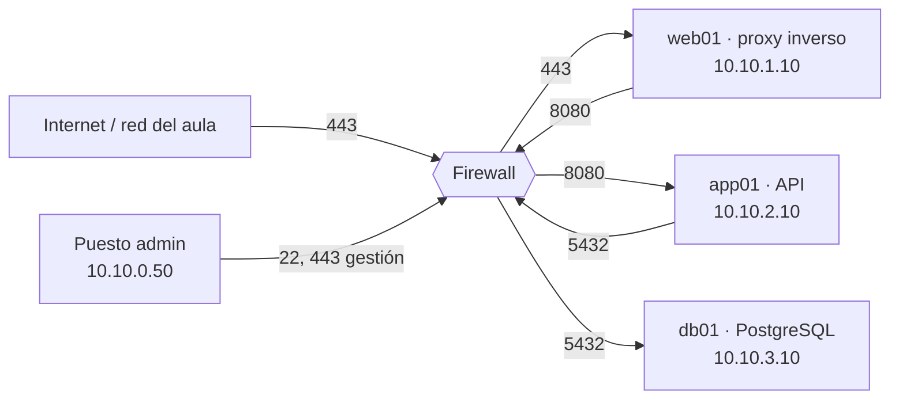
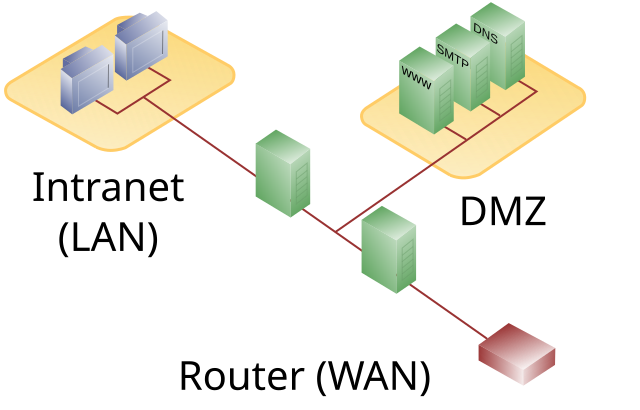
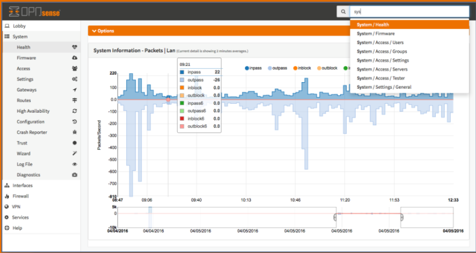
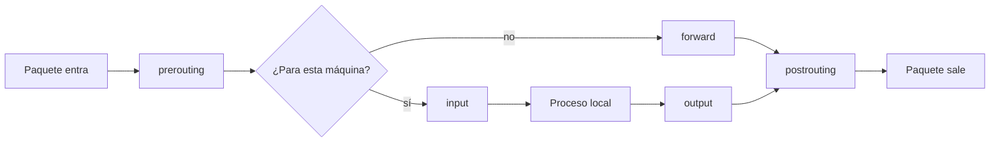
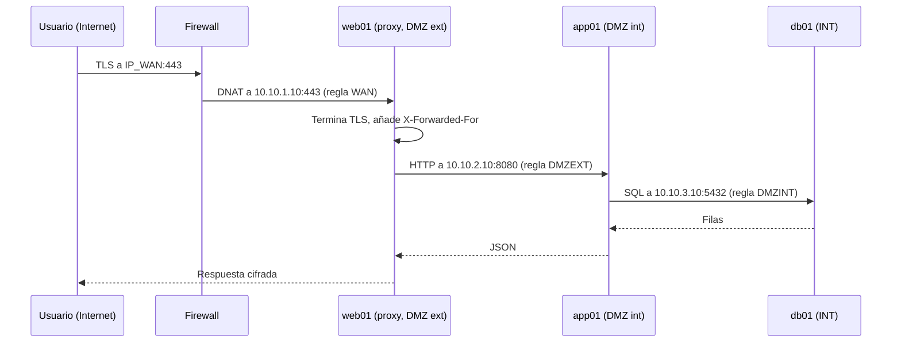
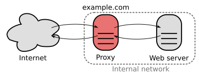

# UT3 · Seguridad por capas: DMZ externa, DMZ interna y zona interna

<p class="ut-meta">Módulo 5166 · 12 h · Sesiones 14 a 19 · RA1 CE d</p>

En la UT2 montasteis una VPC por entorno (dev, pre, pro) con dos subredes, front y back, y comprobasteis que el enrutado entre ellas funcionaba. Funcionaba demasiado bien: cualquier máquina de front podía hablar con cualquier puerto de back. En esta unidad ponemos un cortafuegos en medio, añadimos dos zonas más (datos y gestión) y convertimos esa red plana en una red por capas donde cada salto está justificado, permitido de forma explícita y registrado. Después tendremos que demostrar con nmap y tcpdump que el aislamiento es real, y separar dos clientes que comparten la misma infraestructura. Lo que construyáis aquí no se tira: en la UT5 lo describiréis como código con OpenTofu y Ansible, y en la UT6 el pipeline de Jenkins desplegará contenedores dentro de estas zonas, así que las reglas que escribáis ahora son las que vuestro pipeline tendrá que respetar.

## Qué tienes que saber hacer al terminar

El criterio de evaluación d del RA1 pide desplegar capas de seguridad según el nivel de exposición de cada servicio, probarlas y separar clientes. En concreto:

- Explicar el modelo de zonas (exterior, DMZ externa, DMZ interna, zona interna, gestión) y decidir en qué zona va cada componente de una aplicación.
- Instalar y configurar un cortafuegos con estado entre zonas (OPNsense en clase, o nftables sobre Debian) con política de denegación por defecto.
- Publicar un servicio hacia Internet a través de un proxy inverso con TLS, sin exponer la aplicación ni la base de datos.
- Aislar dos clientes con VLAN y reglas, de forma que compartan el proxy pero no se alcancen entre sí.
- Probar el aislamiento con nmap, nc, tcpdump y los logs del cortafuegos, e interpretar correctamente lo que devuelven.
- Entregar a operaciones una matriz de reglas justificada, una matriz de pruebas con evidencias y un procedimiento de cambios.

## Defensa en profundidad y zonas

Ningún control de seguridad es perfecto. El proxy tendrá una vulnerabilidad algún día, alguien subirá una imagen de contenedor con una librería vieja, un administrador reutilizará una contraseña. La defensa en profundidad parte de asumir que cada control fallará y pone varios en serie, de modo que cada capa que atraviesa un atacante le cuesta trabajo, le lleva tiempo y deja rastro en un log que alguien (o algo) está mirando. La forma clásica de organizar esto en red son las zonas, separadas por un cortafuegos que solo deja pasar lo imprescindible entre una y la siguiente.

| Zona | Qué aloja | Quién puede entrar | Hacia dónde sale |
|----|----|----|----|
| Exterior (WAN / Internet) | Usuarios, atacantes | Nadie | DMZ externa |
| DMZ externa | Lo que debe verse desde fuera: proxy inverso, balanceador, web estática, concentrador VPN | Internet, en puertos concretos (80/443) | DMZ interna, en puertos concretos |
| DMZ interna | Aplicación / API, colas, caché | DMZ externa | Zona interna, en puertos concretos |
| Zona interna | Bases de datos, almacenamiento, backups | DMZ interna y administradores | Nada hacia fuera (o solo actualizaciones por proxy) |
| Gestión | Consola del firewall, SSH, Proxmox, monitorización | Administradores | Todas las zonas, solo en puertos de gestión |

Los principios que gobiernan las reglas son cuatro, y los vais a ver repetidos en cualquier auditoría:

- **Denegar por defecto**: todo lo que no está permitido expresamente se bloquea y se registra. La lista de reglas es una lista blanca.
- **Tráfico solo hacia dentro por saltos**: Internet nunca habla con la zona interna; la web nunca habla con la base de datos sin pasar por la aplicación. Cada zona solo inicia conexiones hacia la inmediatamente más profunda.
- **Mínima exposición**: un servicio en DMZ externa solo expone el puerto que necesita. La gestión (SSH, consola web, API de Proxmox) va por una red aparte que no es alcanzable desde ninguna zona de servicio.
- **Registro**: todo lo denegado, y todo lo permitido hacia zonas sensibles, queda en un log con marca de tiempo, regla que lo decidió, origen y destino.

### Qué frena cada capa

Para que el modelo no se quede en una tabla bonita, conviene tener claro qué ataque concreto para cada zona. Un escaneo de puertos desde Internet contra la IP pública solo ve el 443 del proxy; los puertos 8080 de la aplicación y 5432 de PostgreSQL ni siquiera aparecen como cerrados, aparecen como filtrados, que es distinto y lo veremos al hablar de nmap. Si un atacante explota una vulnerabilidad del proxy y consigue ejecutar código en él, se encuentra en la DMZ externa: puede llegar al 8080 de app01 porque es lo que el proxy necesita, pero no puede abrir una sesión a la base de datos, ni hacer SSH a nada, ni salir a Internet a descargarse herramientas si la regla de salida de la DMZ externa está cerrada. Si además compromete la aplicación (inyección SQL, deserialización, dependencia vulnerable), llega a la base de datos, pero con el usuario de aplicación, que no puede hacer `COPY ... TO PROGRAM` ni leer otras bases. Para llegar a la zona de gestión no hay ningún camino permitido desde ninguna zona de servicio, así que tendría que atacar el propio cortafuegos. Cada uno de esos saltos genera entradas de log de intentos denegados, que es exactamente lo que un sistema de detección busca.

Comparadlo con la red plana de la UT2: una vulnerabilidad en el proxy daba acceso directo a la base de datos y al hipervisor.

### Mapa sobre la VPC de la UT2

No hay que rehacer la red. Lo que ya tenéis se reasigna y se amplía: la subred front pasa a ser la DMZ externa, back pasa a ser la DMZ interna, y se añaden dos subredes nuevas, data como zona interna y mgmt para administración. En el entorno dev del aula queda así:

| Zona | Nombre en Proxmox | Red | Gateway (firewall) | Máquinas |
|----|----|----|----|----|
| DMZ externa | front (vfront) | 10.10.1.0/24 | 10.10.1.1 | web01 (proxy) |
| DMZ interna | back (vback) | 10.10.2.0/24 | 10.10.2.1 | app01 |
| Zona interna | data (vdata) | 10.10.3.0/24 | 10.10.3.1 | db01 |
| Gestión | mgmt (vmgmt) | 10.10.0.0/24 | 10.10.0.1 | Vuestro puesto de administración |
| Exterior | vmbr0 (bridge del aula) | La del aula | Router del aula | Todo lo demás |



El cortafuegos es el gateway de todas las zonas, con la IP .1 en cada una. Eso significa que ningún paquete cruza de una subred a otra sin pasar por él, que es lo que queremos. Si en la UT2 pusisteis un router entre front y back, esa VM se sustituye por el firewall o se convierte en él.

## DMZ con uno y con dos cortafuegos

El esquema que acabamos de dibujar usa un solo cortafuegos con cinco interfaces, una por zona. Es el diseño habitual en pymes y en laboratorios porque es barato y toda la política está en un sitio. Su punto débil es evidente: si el cortafuegos cae, o alguien lo configura mal, todas las capas caen a la vez.

<figure markdown="span">
  { width="560" }
  <figcaption>DMZ con un solo cortafuegos: una interfaz hacia Internet, otra hacia la DMZ y otra hacia la red interna. Fuente: Pbroks13, dominio público, vía Wikimedia Commons.</figcaption>
</figure>

El diseño de dos cortafuegos pone uno de cara a Internet (el "front-end" o perimetral) que solo permite tráfico hacia la DMZ, y otro detrás (el "back-end") entre la DMZ y la red interna. Un atacante que comprometa el primero sigue teniendo el segundo por delante. Con dos firewalls también se reparte la carga: el perimetral absorbe los escaneos y el ruido de Internet, y el interno solo ve tráfico ya filtrado.

<figure markdown="span">
  { width="560" }
  <figcaption>DMZ con dos cortafuegos: el perimetral protege la DMZ; el interno protege la red corporativa. Fuente: Pbroks13, dominio público, vía Wikimedia Commons.</figcaption>
</figure>

Hay una recomendación clásica que os encontraréis en cualquier guía de seguridad perimetral: que los dos cortafuegos sean de fabricantes distintos. La razón es que una vulnerabilidad de ejecución remota en el software del firewall (las ha habido en todos los grandes fabricantes en los últimos años) afectaría a los dos si son iguales, y el segundo dejaría de aportar nada. Con dos fabricantes, el atacante necesita dos exploits diferentes. El coste es que operaciones tiene que saber administrar dos productos, mantener dos ciclos de parches y escribir la misma política en dos sintaxis, y ese coste operativo es la razón de que muchas empresas medianas acaben con un solo firewall bien mantenido en lugar de dos mal mantenidos. Mi opinión: un cortafuegos único, parcheado y con reglas revisadas cada trimestre, es mejor que dos que nadie toca porque dan miedo.

En clase montamos el modelo de un firewall con cinco interfaces. Quien quiera hacer el de dos puede usar OPNsense como perimetral y un Debian con nftables como interno; es la combinación de fabricantes distintos, sale gratis y encaja con lo que vamos a ver en las dos secciones siguientes.

## Cortafuegos con estado

Un cortafuegos sin estado (stateless, un filtro de paquetes puro) mira cada paquete de forma aislada: origen, destino, protocolo, puerto, flags. Para permitir que web01 abra una conexión a app01:8080 necesitaría dos reglas, una para el SYN de ida y otra para la respuesta de vuelta, y la de vuelta tendría que permitir tráfico desde el puerto 8080 de app01 hacia cualquier puerto alto de web01, lo cual es un agujero: cualquier cosa que se origine en app01 con puerto origen 8080 pasaría.

Un cortafuegos **con estado** (stateful) recuerda las conexiones. Cuando ve el SYN de web01:43812 hacia app01:8080 y una regla lo permite, crea una entrada en su **tabla de estados** con la tupla (protocolo, IP origen, puerto origen, IP destino, puerto destino) y el estado de la conexión. Cuando llega el SYN-ACK de vuelta, no evalúa las reglas: busca en la tabla, encuentra la entrada, comprueba que el paquete es coherente con el estado (números de secuencia, flags) y lo deja pasar. Lo mismo con todos los paquetes siguientes en ambas direcciones, hasta que ve el cierre (FIN/RST) o la entrada expira por inactividad.

En Linux este mecanismo se llama **conntrack** y es un módulo del kernel (`nf_conntrack`) que usan tanto iptables como nftables. En OPNsense y pfSense lo hace el propio `pf` de FreeBSD, con una tabla que podéis ver en Firewall → Diagnostics → States. Los estados que manejan son, de forma simplificada:

| Estado | Significado |
|----|----|
| `new` | Primer paquete de una conexión que no está en la tabla. Es el único que se evalúa contra las reglas. |
| `established` | Paquetes de una conexión ya aceptada, en cualquier dirección. |
| `related` | Conexión nueva que el kernel sabe que pertenece a otra existente: el canal de datos de FTP, o un ICMP "puerto inalcanzable" en respuesta a un UDP que enviamos. |
| `invalid` | Paquete que no encaja con ningún estado ni es un inicio válido (un ACK suelto, un SYN-ACK sin SYN previo). Se descarta siempre. |

Para UDP e ICMP, que no tienen conexión, conntrack crea "pseudo-estados" basados en la tupla y un temporizador: si enviamos una consulta DNS a 10.10.0.53:53, la respuesta que llegue en los siguientes 30 segundos desde ese origen a ese puerto se considera `established`.

Por qué importa esto para escribir reglas: solo hay que escribir la regla del primer paquete, en la dirección en que se inicia la conexión, y poner una regla genérica `established,related accept` al principio de la cadena. Es lo que hace que la política "DMZ externa puede iniciar hacia DMZ interna:8080, pero DMZ interna no puede iniciar nada hacia DMZ externa" sea expresable con una sola línea. También explica un error clásico: si la regla `established,related` no está, o está después de un `drop`, la conexión abre (el SYN pasa) pero nunca responde, y en tcpdump veréis SYN, SYN-ACK... y el SYN-ACK muriendo en el firewall.

La tabla de estados tiene tamaño finito. En un Debian con nftables `sysctl net.netfilter.nf_conntrack_max` suele valer 65536 o más según la RAM; en OPNsense el límite está en Firewall → Settings → Advanced (Firewall Maximum States). Un ataque de inundación de SYN busca precisamente llenarla; cuando se llena, el firewall descarta conexiones nuevas legítimas y en el log aparece `nf_conntrack: table full, dropping packet`. Los tiempos de expiración también son configurables: una conexión TCP establecida sin tráfico vive por defecto 5 días en conntrack de Linux, y eso es lo que os permite tener una sesión SSH abierta horas sin que el firewall la olvide.

## OPNsense

OPNsense es una distribución de firewall basada en FreeBSD y en el filtro `pf`, con interfaz web, desarrollo abierto y versiones semestrales (la 26.1 y la 26.7 son las de este curso; la numeración es año.mes). Nació como bifurcación de pfSense en 2015 y las dos son funcionalmente muy parecidas: si en una empresa os encontráis pfSense, todo lo de esta sección aplica cambiando algún nombre de menú. En clase usamos OPNsense porque la interfaz es más limpia, el ciclo de parches es más rápido y la edición comunitaria no tiene recortes respecto a la de pago.

<figure markdown="span">
  { width="640" }
  <figcaption>Panel de OPNsense con el estado de interfaces, servicios y tráfico. Fuente: Hagennos, CC BY-SA 4.0, vía Wikimedia Commons.</figcaption>
</figure>

### Instalación en Proxmox

Se instala como una VM normal: descargad la imagen `dvd` o `vga` de la 26.x desde opnsense.org, 2 vCPU, 2 GB de RAM y 20 GB de disco sobran. Lo que la distingue es el número de interfaces: una por zona, cinco en nuestro caso, cada una conectada a su bridge o VNet de Proxmox. Usad el modelo VirtIO para las NIC y activad la opción de arranque en el orden correcto; FreeBSD nombra las interfaces VirtIO como `vtnet0`, `vtnet1`... en el orden en que Proxmox las presenta en el bus PCI, así que el orden en que las añadís a la VM importa. Apuntad qué MAC corresponde a qué bridge antes de arrancar, porque en el asistente de consola tendréis que asignar cada `vtnetN` a su papel:

| Interfaz OPNsense | vtnet | Bridge / VNet Proxmox | IP |
|----|----|----|----|
| WAN | vtnet0 | vmbr0 (aula) | DHCP del aula o fija |
| DMZEXT | vtnet1 | vfront | 10.10.1.1/24 |
| DMZINT | vtnet2 | vback | 10.10.2.1/24 |
| INT | vtnet3 | vdata | 10.10.3.1/24 |
| MGMT | vtnet4 | vmgmt | 10.10.0.1/24 |

Tras la instalación, la interfaz web escucha en todas las interfaces con la regla "anti-lockout" activa en LAN. Lo primero que haréis es mover la administración a MGMT y desactivar el acceso desde el resto (System → Settings → Administration, "Listen interfaces"). Si os equivocáis y os quedáis fuera, la consola de Proxmox de la VM tiene un menú de texto con la opción "Reset to factory defaults" y otra para reasignar interfaces; no hace falta reinstalar.

### Aliases

Un alias es un nombre para un conjunto de IPs, redes, puertos o URLs. `srv_web` = 10.10.1.10, `net_dmzint` = 10.10.2.0/24, `p_app` = 8080, `p_web` = {80, 443}. Las reglas se escriben con aliases, nunca con IPs sueltas, por dos razones: la regla se lee sola ("permitir net_dmzext a srv_app en p_app" se entiende sin consultar nada) y cuando app01 cambie de IP, o haya dos app, se cambia el alias y no diez reglas. Los aliases de tipo "Host" admiten nombres DNS que OPNsense resuelve periódicamente, y los de tipo "URL Table" descargan listas (por ejemplo, rangos de IP de un proveedor) y las actualizan solas. En Firewall → Aliases.

### Reglas y orden de evaluación

Las reglas se organizan por interfaz y se evalúan sobre el tráfico que **entra** por esa interfaz (dirección "in", que es la que usaréis casi siempre). Para permitir que web01 hable con app01:8080, la regla va en la pestaña DMZEXT, porque es por donde entra el paquete al firewall, aunque el destino esté en DMZINT. Esto confunde al principio: pensad siempre "¿por qué interfaz llega este paquete al cortafuegos?".

El orden de evaluación es el siguiente:

1. Reglas automáticas (anti-lockout, las que generan los port forward si se marca la opción).
2. Reglas flotantes (Floating), que aplican a varias interfaces a la vez.
3. Reglas de grupos de interfaces.
4. Reglas de la interfaz concreta, de arriba abajo.
5. Denegación implícita al final, que registra si tenéis activado "Log packets matched by the default deny rule" en Firewall → Settings → Advanced.

Aquí entra la opción **quick**, que está marcada por defecto en cada regla y merece explicación. `pf` evalúa toda la lista y aplica la **última** regla que coincide, salvo que una regla tenga `quick`, en cuyo caso la evaluación se detiene en ella. Como OPNsense marca quick en todo, en la práctica funciona como "la primera que coincide gana". Si desmarcáis quick en una regla, esa regla solo se aplicará si ninguna posterior coincide. Se usa para escribir una regla genérica arriba ("permitir todo desde MGMT", sin quick) que las reglas posteriores más específicas pueden anular. Mi consejo: dejad quick activado siempre y ordenad las reglas de más específica a más general; es más fácil de leer y de auditar.

Cada regla lleva: acción (Pass, Block, Reject), interfaz, dirección, familia IP, protocolo, origen (con puerto opcional), destino y puerto, opción de log, y una descripción. Ponedla siempre; en el log aparece la descripción, no el número de regla. La diferencia entre Block y Reject: Block descarta en silencio (el origen espera hasta agotar el timeout), Reject responde con un TCP RST o un ICMP unreachable (el origen sabe al instante que no hay servicio). Hacia Internet se usa Block, para no dar información; entre zonas internas, Reject ahorra esperas a vuestros propios servicios.

Las reglas nuevas se guardan y luego se aplican con "Apply changes". Hasta que no aplicáis, no hay cambio. Y cuando aplicáis, los estados existentes que ya no encajan con la política se mantienen hasta que expiran; si necesitáis cortar una conexión ya establecida, hay que borrar su estado en Firewall → Diagnostics → States (o "Reset state table", que las corta todas).

### NAT: port forward y outbound

Dos tipos de NAT os van a hacer falta:

**Port forward** (DNAT) publica un servicio interno en la IP WAN: WAN:443 → srv_web:443. Se configura en Firewall → NAT → Port Forward, y al crearlo OPNsense ofrece generar la regla de filtro asociada ("Filter rule association: add associated filter rule"). Aceptadlo; sin regla de filtro, el paquete se traduce pero después se bloquea en la interfaz WAN. El orden de procesamiento en pf es NAT primero y filtro después, así que la regla de filtro se escribe con el destino ya traducido (srv_web:443), no con la IP WAN.

**Outbound NAT** (SNAT) permite que las zonas internas salgan a Internet con la IP del firewall. En modo automático OPNsense lo hace para todas las redes de sus interfaces. En nuestro laboratorio lo queremos restringido: la DMZ interna y la zona interna no deberían salir a Internet salvo para actualizaciones, y eso se resuelve mejor con un proxy de paquetes (apt-cacher-ng o un mirror interno en MGMT) que con NAT abierto. Ponedlo en modo "Hybrid" y cread solo las reglas de salida que justifiquéis.

### Logs

Firewall → Log Files → Live View muestra en tiempo real cada paquete que coincide con una regla que tiene log activado, y todos los de la denegación por defecto. Cada línea trae interfaz, dirección, acción, origen, destino, protocolo y la etiqueta de la regla. Filtrad por interfaz o por etiqueta; en un aula con 20 VM escaneándose, el log sin filtro es inservible. Para conservar el histórico está Plain View, y para enviarlo fuera (que es lo que haréis en producción y en la UT7) System → Settings → Logging / Targets permite mandar todo por syslog a un colector.

Activad el log en todas las reglas de denegación y en las de permiso hacia INT. No en la regla de permiso de WAN:443, que generaría una línea por conexión web y solo serviría para llenar el disco; para eso están los logs de acceso del proxy.

### IDS/IPS y WAF, dos capas más

El cortafuegos decide por puertos y direcciones. No sabe si lo que entra por el 443 es una petición legítima o un intento de explotación. Para eso hay dos capas adicionales que en el módulo solo mencionamos: OPNsense integra **Suricata** como IDS/IPS (Services → Intrusion Detection), que inspecciona el contenido de los paquetes contra reglas de firmas (ET Open, gratuitas) y puede alertar o bloquear. En la interfaz WAN de un laboratorio con tráfico cifrado ve poco; tiene más sentido en la DMZ externa, después del proxy, donde el tráfico ya va en claro. Y en el propio proxy inverso se puede añadir un **WAF** (Web Application Firewall) como ModSecurity o su reimplementación en Go, Coraza, con el conjunto de reglas OWASP CRS, que bloquea patrones de inyección SQL, XSS y similares antes de que lleguen a la aplicación. Ambos generan falsos positivos y necesitan ajuste; no los pongáis en modo bloqueo el primer día.

## Alternativa: nftables en una VM Linux

El mismo modelo se puede montar con un router Debian 13 con cinco interfaces y nftables, que es el framework de filtrado del kernel Linux desde la 3.13 y el sucesor de iptables. Lo que se pierde es la interfaz web y las comodidades (aliases con resolución DNS, live view); lo que se gana es un fichero de texto de 40 líneas que se versiona en git y que Ansible despliega en la UT5 sin ninguna magia. Es el mismo motor que usa el firewall integrado de Proxmox y Docker, así que os interesa entenderlo aunque uséis OPNsense.

### Tablas, cadenas, hooks y prioridades

Un ruleset de nftables se organiza en **tablas**, que son contenedores con una familia de direcciones: `ip` (IPv4), `ip6`, `inet` (las dos a la vez, la que usaréis), `arp`, `bridge` y `netdev`. Dentro de una tabla hay **cadenas**, y las cadenas contienen reglas. Hay dos tipos de cadena: las **base**, que se enganchan a un hook del kernel y por las que pasa el tráfico automáticamente, y las regulares, a las que solo se llega con `jump` o `goto` desde otra cadena.

Los hooks son los puntos del recorrido de un paquete por la pila de red donde netfilter puede intervenir:



Para un router entre zonas casi todo ocurre en `forward`: el tráfico que va de una zona a otra no es para el firewall, así que nunca pasa por `input` ni `output`. `input` protege al propio firewall (quién puede hacerle SSH o abrir su web) y `prerouting`/`postrouting` son donde se hace el NAT (DNAT en prerouting, antes de decidir la ruta; SNAT en postrouting, después).

La **prioridad** ordena las cadenas base que comparten hook: se evalúan de menor a mayor número. Hay nombres predefinidos: `raw` (-300), `mangle` (-150), `dstnat` (-100), `filter` (0), `security` (50), `srcnat` (100). Lo importante es que el DNAT (-100) va antes que el filtro (0) en prerouting, y por eso en la cadena `forward` se filtra con la dirección de destino ya traducida, igual que en pf. La **política** de una cadena base (`policy drop` o `policy accept`) es lo que ocurre si ninguna regla coincide; en `forward` e `input` la ponemos en `drop`.

### El fichero completo y persistente

Este es el fichero `/etc/nftables.conf` para nuestro laboratorio, con nombres de interfaz ya renombrados con systemd-networkd o udev para que se llamen como las zonas (si no, usad `ens18`, `ens19`... o mejor, definid variables):

```text
#!/usr/sbin/nft -f
flush ruleset

define net_dmzext = 10.10.1.0/24
define net_dmzint = 10.10.2.0/24
define net_int    = 10.10.3.0/24
define net_mgmt   = 10.10.0.0/24
define srv_web    = 10.10.1.10
define srv_app    = 10.10.2.10
define srv_db     = 10.10.3.10

table inet fw {

    chain input {
        type filter hook input priority filter; policy drop;
        ct state established,related accept
        ct state invalid drop
        iifname "lo" accept
        icmp type { echo-request, destination-unreachable, time-exceeded } accept
        iifname "mgmt" ip saddr $net_mgmt tcp dport { 22, 443 } accept
        log prefix "FW-INPUT-DROP " drop
    }

    chain forward {
        type filter hook forward priority filter; policy drop;
        ct state established,related accept
        ct state invalid drop

        # Publicación: Internet -> proxy (destino ya traducido por el DNAT)
        iifname "wan" oifname "dmzext" ip daddr $srv_web tcp dport { 80, 443 } accept

        # Capas: proxy -> app -> db
        iifname "dmzext" oifname "dmzint" ip saddr $srv_web ip daddr $srv_app tcp dport 8080 accept
        iifname "dmzint" oifname "int"    ip saddr $srv_app ip daddr $srv_db  tcp dport 5432 accept

        # Gestión llega a todo por SSH
        iifname "mgmt" ip saddr $net_mgmt tcp dport 22 accept

        # Diagnóstico: ping desde gestión
        iifname "mgmt" icmp type echo-request accept

        log prefix "FW-FWD-DROP " drop
    }

    chain output {
        type filter hook output priority filter; policy accept;
    }
}

table ip nat {
    chain prerouting {
        type nat hook prerouting priority dstnat; policy accept;
        iifname "wan" tcp dport { 80, 443 } dnat to $srv_web
    }
    chain postrouting {
        type nat hook postrouting priority srcnat; policy accept;
        oifname "wan" ip saddr $net_dmzext masquerade
    }
}
```

Fijaos en que el `masquerade` solo cubre la DMZ externa: la DMZ interna y la zona interna no tienen salida a Internet. Si app01 necesita instalar paquetes, se hace por un proxy APT en MGMT o se abre una regla temporal y documentada.

Para probarlo sin cargarlo, `nft -c -f /etc/nftables.conf` valida la sintaxis. Se carga con `nft -f /etc/nftables.conf` y se persiste activando el servicio: `systemctl enable --now nftables`, que en Debian lee exactamente ese fichero en cada arranque. Antes de todo hay que activar el reenvío en el kernel, `net.ipv4.ip_forward=1` en `/etc/sysctl.d/99-router.conf`, porque sin eso el router descarta todo lo que no es para él aunque nftables lo permita. `nft list ruleset` muestra lo cargado, y `nft list ruleset -a` añade los handles de cada regla para poder borrar una concreta. Los logs salen por el kernel, `journalctl -k -f | grep FW-`, o a un fichero propio si configuráis rsyslog con un filtro por prefijo.

!!! warning "Orden de las reglas y bloqueo remoto"
    Si administráis el router Debian por SSH desde MGMT y cargáis un ruleset con `policy drop` en `input` sin la regla que permite vuestro SSH, os quedáis fuera en el acto (la sesión actual sobrevive gracias a `established`, pero la siguiente no entra). Probad siempre con un `at now + 5 min` que restaure el fichero anterior, o desde la consola de Proxmox.

## Publicar un servicio

El patrón es siempre el mismo: Internet → firewall (port forward 443) → proxy inverso en DMZ externa → aplicación en DMZ interna → base de datos en zona interna. La aplicación no tiene IP pública ni ruta directa desde fuera. La base de datos solo acepta conexiones desde la subred de aplicación, y con un usuario de aplicación, no con `postgres`.



### El proxy inverso

<figure markdown="span">
  { width="520" }
  <figcaption>El cliente solo conoce al proxy; los servidores de detrás no son alcanzables directamente. Fuente: H2g2bob, CC0, vía Wikimedia Commons.</figcaption>
</figure>

Un proxy inverso recibe la conexión del cliente y abre otra distinta hacia el servidor interno. Son dos conexiones TCP separadas, y eso tiene consecuencias:

- **Termina TLS**. El certificado y la clave privada viven en el proxy; la aplicación puede hablar HTTP plano dentro de la DMZ interna (o TLS con certificado interno si la política lo exige). Renovar un certificado no toca la aplicación.
- **Oculta la topología**. El cliente ve una IP y un puerto. No sabe si detrás hay una máquina o veinte, ni en qué red están, ni qué servidor de aplicaciones usan. Las cabeceras `Server` y los mensajes de error del backend se pueden reescribir.
- **Filtra rutas**. Se puede publicar `/api` y `/` y dejar `/admin` o `/metrics` solo accesibles desde MGMT, con un `location` y un `allow`/`deny`.
- **Pierde la IP del cliente**, salvo que se la pase a la aplicación. Como la segunda conexión sale desde 10.10.1.10, la aplicación vería siempre esa IP. Por eso el proxy añade la cabecera `X-Forwarded-For` con la IP original (y `X-Forwarded-Proto` con `https`, para que la aplicación genere enlaces correctos). La aplicación debe confiar en esas cabeceras **solo** si vienen del proxy; si acepta `X-Forwarded-For` de cualquiera, un cliente puede falsificar su IP. El RFC 7239 estandariza esto como cabecera `Forwarded`, pero en la práctica todo el mundo sigue usando las `X-Forwarded-*`.

Configuración mínima de nginx en web01 (fichero en `/etc/nginx/sites-available/app.lab`, enlazado en `sites-enabled`):

```nginx
server {
    listen 80;
    server_name app.lab;
    return 301 https://$host$request_uri;
}

server {
    listen 443 ssl;
    http2 on;
    server_name app.lab;

    ssl_certificate     /etc/ssl/app.crt;
    ssl_certificate_key /etc/ssl/app.key;
    ssl_protocols TLSv1.2 TLSv1.3;

    location / {
        proxy_pass http://10.10.2.10:8080;
        proxy_set_header Host $host;
        proxy_set_header X-Forwarded-For $proxy_add_x_forwarded_for;
        proxy_set_header X-Forwarded-Proto $scheme;
        proxy_set_header X-Real-IP $remote_addr;
    }

    location /metrics {
        allow 10.10.0.0/24;
        deny all;
        proxy_pass http://10.10.2.10:8080;
    }
}
```

Las alternativas que os encontraréis en empresas son **Traefik** y **Caddy**. Traefik descubre los backends solo: se conecta al socket de Docker o a la API de Kubernetes y crea las rutas a partir de etiquetas de los contenedores, lo que lo hace el proxy natural para la UT6, donde el pipeline despliega contenedores y no queremos editar nginx a mano cada vez. Caddy destaca porque obtiene y renueva certificados de Let's Encrypt automáticamente sin configurar nada, y su fichero de configuración para lo mismo que arriba son cuatro líneas:

```text
app.lab {
    reverse_proxy 10.10.2.10:8080
}
```

Prefiero nginx para enseñar porque obliga a entender cada cabecera, y Traefik para producción con contenedores. Caddy para un servicio pequeño que queráis publicar sin pensar en certificados.

### Certificados

El `curl -kv` de las actividades usa `-k` para saltarse la validación del certificado, y eso está bien para probar el primer día, pero no es la forma de trabajar. Hay dos escenarios:

**CA interna** para el laboratorio y para todo lo que no ve Internet (paneles de administración, comunicación entre zonas). Con openssl se crea una CA y se firma un certificado para app.lab en cinco comandos:

```bash
# CA raíz (guardad la clave en MGMT, no en el proxy)
openssl req -x509 -newkey ec -pkeyopt ec_paramgen_curve:prime256v1 -nodes \
  -keyout ca.key -out ca.crt -days 3650 -subj "/CN=Lab 5166 CA"

# Clave y petición para el proxy
openssl req -newkey ec -pkeyopt ec_paramgen_curve:prime256v1 -nodes \
  -keyout app.key -out app.csr -subj "/CN=app.lab"

# Firma con SAN (sin SAN los navegadores modernos lo rechazan)
printf "subjectAltName=DNS:app.lab,IP:10.10.1.10\n" > san.ext
openssl x509 -req -in app.csr -CA ca.crt -CAkey ca.key -CAcreateserial \
  -out app.crt -days 365 -extfile san.ext
```

Después se instala `ca.crt` en los clientes (`/usr/local/share/ca-certificates/` y `update-ca-certificates` en Debian) y `curl` deja de necesitar `-k`. Para algo más serio que un laboratorio, **step-ca** de Smallstep es una CA completa con protocolo ACME, de modo que los servidores internos renuevan sus certificados solos con el mismo cliente que usarían contra Let's Encrypt, y con certificados de vida corta (24 horas) que hacen innecesarias las listas de revocación.

**Let's Encrypt** en producción, para todo lo que tiene nombre público. Emite certificados de 90 días (y está pasando a 6 días para quien los quiera) gratis, validando que controláis el dominio: con `HTTP-01` publicando un fichero en `/.well-known/acme-challenge/` por el puerto 80 (por eso el port forward del 80 en el firewall aunque redirijáis a HTTPS), o con `DNS-01` creando un registro TXT, que es la única opción para wildcards y para servicios que no exponen el 80. Certbot, Caddy, Traefik y el plugin ACME de OPNsense hacen la renovación automática. Lo que hay que vigilar es que la renovación funcione: un certificado caducado un domingo es la avería más tonta y más frecuente de un servicio publicado.

## Separación de clientes

Cuando la misma infraestructura sirve a varios clientes (multi-tenant) hay que garantizar que uno no ve ni afecta al otro. Las opciones, de menos a más aislamiento:

1. **Separación lógica en la aplicación**: un campo `cliente_id` en cada tabla y un `WHERE` en cada consulta. Barata; un fallo de código lo expone todo, y los ha habido en empresas grandes.
2. **VLAN o VNet por cliente** con reglas de firewall que solo permiten tráfico cliente → servicios compartidos. Es lo habitual en proveedores medianos y lo que hacemos en el módulo.
3. **VPC completa por cliente**, con sus propias zonas y su propio firewall. Máximo aislamiento a nivel de red, más coste y más cosas que mantener. Es lo que os dan AWS o Azure por defecto (UT4).
4. **Hardware dedicado**: hosts de Proxmox separados por cliente. Solo lo justifica un contrato que lo exija.

En la práctica del módulo se usa la opción 2: dos clientes en VLAN distintas que comparten el proxy y el firewall pero no se alcanzan.

### VLAN en Proxmox y en OPNsense

En Proxmox, un bridge marcado como **VLAN aware** deja pasar tramas etiquetadas 802.1Q; a cada VM se le asigna su etiqueta en la configuración de la NIC (`tag=101`), y el bridge la pone y la quita de forma transparente, así que la VM no sabe nada de VLAN. Si usáis SDN (UT2), una VNet de tipo VLAN sobre una zona VLAN hace lo mismo con más orden.

El firewall necesita ver las dos VLAN por una sola interfaz física (trunk): en Proxmox, su NIC en ese bridge va **sin** tag, y en OPNsense se crean dos interfaces VLAN (Interfaces → Other Types → VLAN) sobre el padre `vtnet5`, con tags 101 y 102, y se les asignan las IP 10.10.101.1/24 y 10.10.102.1/24. Cada VLAN es una interfaz más a efectos de reglas, con su propia pestaña, y por defecto nada pasa entre ellas porque la denegación implícita se aplica igual.

Las reglas para cada cliente son dos líneas, en la pestaña de su VLAN:

| Interfaz | Acción | Origen | Destino | Puerto | Log | Descripción |
|----|----|----|----|----|----|----|
| CLI_A | Pass | net_cli_a | srv_web | 443 | no | Cliente A al proxy compartido |
| CLI_A | Block | net_cli_a | any | any | sí | Cliente A: resto denegado |
| CLI_B | Pass | net_cli_b | srv_web | 443 | no | Cliente B al proxy compartido |
| CLI_B | Block | net_cli_b | any | any | sí | Cliente B: resto denegado |

La regla explícita de Block al final de cada pestaña es redundante con la denegación implícita, pero se pone para que quede en el log con una descripción legible y para que quien lea la matriz vea la intención sin conocer OPNsense. Con el proxy compartido hay un detalle más: si el cliente A hace una petición a app.lab, el proxy la reenvía a app01 desde su propia IP, así que la aplicación tiene que distinguir clientes por otro medio (nombre de host, cabecera, autenticación), no por la IP de origen. El aislamiento de red garantiza que A no llega a la red de B; el aislamiento de datos sigue siendo responsabilidad de la aplicación.

## Pruebas de seguridad

No basta con configurar: hay que demostrar que el aislamiento funciona, y demostrarlo desde el punto de vista del atacante, es decir, desde fuera de cada zona. Las pruebas se hacen desde la máquina que representa cada origen (vuestro equipo del aula para Internet, web01 para la DMZ externa, la VM del cliente A para el cliente A), no desde el firewall.

### nmap

nmap envía paquetes y clasifica cada puerto según la respuesta. Los tipos de escaneo que usaréis:

- `nmap -sS -p- -T4 destino`: escaneo SYN (half-open) de los 65535 puertos TCP. Envía un SYN y mira qué vuelve; no completa la conexión, así que muchos servicios no lo registran. Necesita root. `-T4` acelera; en una red de laboratorio sin pérdidas está bien, en producción usad `-T3`.
- `nmap -sT`: escaneo connect, completa el handshake. Es lo que hace nmap sin root, más lento y más ruidoso, pero sirve igual.
- `nmap -sU -p 53,123,161 destino`: UDP. Es lento porque un puerto abierto que no responde y uno filtrado se ven igual (silencio), y nmap tiene que reintentar. Limitad los puertos.
- `nmap -sn 10.10.3.0/24`: descubrimiento de hosts sin escaneo de puertos. Desde Internet o desde el otro cliente, no debe encontrar nada en zonas internas.
- `-Pn`: no hacer ping previo. Imprescindible cuando el firewall bloquea ICMP, porque si no nmap concluye que el host está caído y no escanea nada.
- `-sV` identifica la versión del servicio, `-O` el sistema operativo. Útiles para ver qué información regala vuestro proxy.

La interpretación de los estados es lo que os diferencia de alguien que ejecuta comandos sin entenderlos:

| Estado nmap | Qué recibió nmap | Qué significa en nuestro modelo |
|----|----|----|
| `open` | SYN-ACK | Hay un servicio escuchando y el firewall lo deja pasar. |
| `closed` | RST | El paquete **llegó** a la máquina y no hay nada escuchando en ese puerto. El firewall no lo está filtrando. |
| `filtered` | Nada, o ICMP unreachable de tipo administrativo | Algo en medio descarta el paquete. Es lo que debe salir en todo lo que no está publicado. |
| `open\|filtered` | Nada (solo en UDP y algunos escaneos) | nmap no puede distinguir; hay que probar con nc o con tcpdump en el destino. |

Si un escaneo desde Internet contra app01 devuelve `8080/tcp closed` en lugar de `filtered`, tenéis un problema aunque no haya servicio: significa que el firewall dejó pasar el SYN hasta app01 y fue app01 quien respondió con RST. Alguna regla está permitiendo más de lo que creéis. Ese es exactamente el tipo de hallazgo que se pide en la práctica.

### nc, curl y tcpdump

`nc -zv 10.10.3.10 5432` prueba un puerto concreto y devuelve "succeeded" o "Connection refused" (llegó y no hay servicio, equivale a closed) o se queda esperando hasta el timeout (filtered). Con `-w 3` limitáis la espera. `curl -kv https://app.lab` comprueba el servicio publicado de extremo a extremo, y con `-v` veis el handshake TLS, el certificado presentado y las cabeceras de respuesta; buscad ahí la cabecera `Server` para ver si estáis regalando la versión de nginx.

tcpdump es la herramienta para saber **dónde** muere un paquete. La técnica es capturar en dos sitios a la vez: en la interfaz de entrada del firewall y en la de salida.

```bash
# En el firewall (OPNsense tiene tcpdump; en el Debian también)
tcpdump -ni vtnet1 host 10.10.1.10 and port 8080     # entrada desde DMZEXT
tcpdump -ni vtnet2 host 10.10.1.10 and port 8080     # salida hacia DMZINT
```

Si el SYN aparece en la primera captura y no en la segunda, el firewall lo ha descartado y la línea correspondiente estará en el log. Si aparece en las dos y no hay respuesta, el problema está en app01 (servicio caído, escuchando solo en localhost, firewall local). Si ni siquiera aparece en la primera, el paquete no ha llegado al firewall: revisad la ruta por defecto de la máquina origen. `-n` evita resoluciones DNS que ralentizan y confunden; `-w captura.pcap` guarda para abrir en Wireshark, y `-c 20` corta tras 20 paquetes para no llenar el disco por olvido.

### La matriz de pruebas

Una fila por par origen/destino relevante, con puerto, resultado esperado (permitido/bloqueado) y resultado real. Cualquier discrepancia es un hallazgo que hay que corregir y volver a probar; una matriz sin ningún hallazgo en la primera pasada es sospechosa, no meritoria.

| Origen | Destino | Puerto | Esperado | Obtenido | Evidencia |
|----|----|----|----|----|----|
| Internet | proxy DMZ ext | 443 | Permitido | | captura curl |
| Internet | proxy DMZ ext | 22 | Bloqueado | | nmap (filtered) |
| Internet | app DMZ int | 8080 | Bloqueado | | nmap (filtered) |
| proxy | app | 8080 | Permitido | | nc |
| proxy | db | 5432 | Bloqueado | | nc + log del firewall |
| proxy | Internet | 443 | Bloqueado | | curl con timeout |
| app | db | 5432 | Permitido | | nc / psql |
| app | proxy | 22 | Bloqueado | | nc |
| db | cualquiera | cualquiera | Bloqueado | | nmap desde db01 |
| cliente A | cliente B | cualquiera | Bloqueado | | nmap -sn + tcpdump |
| cliente A | proxy | 443 | Permitido | | curl |
| cliente A | app | 8080 | Bloqueado | | nc |
| Internet | firewall MGMT | 443 | Bloqueado | | nmap |

## Documentación operativa

Lo que se entrega a operaciones cuando la red pasa a producción, y lo que os pedirá cualquier auditoría, son cuatro documentos. El diagrama de zonas con subredes, gateways y máquinas. La matriz de pruebas ejecutada, con evidencias. Y dos más que merecen detalle.

### Matriz de reglas

Cada regla del firewall con su justificación (qué servicio la necesita), quién la pidió, quién la aprobó y cuándo se revisa. Una regla sin justificación es una regla que hay que borrar. Ejemplo de las filas que tendréis:

| # | Interfaz | Origen | Destino | Puerto | Acción | Log | Justificación | Solicitó | Aprobó | Revisión |
|----|----|----|----|----|----|----|----|----|----|----|
| 1 | WAN | any | srv_web | 443 | Pass | no | Publicación de app.lab | Desarrollo | Víctor | 2027-03 |
| 2 | WAN | any | srv_web | 80 | Pass | no | Redirección a HTTPS y reto ACME | Desarrollo | Víctor | 2027-03 |
| 3 | DMZEXT | srv_web | srv_app | 8080 | Pass | no | El proxy reenvía a la API | Desarrollo | Víctor | 2027-03 |
| 4 | DMZINT | srv_app | srv_db | 5432 | Pass | sí | La API consulta PostgreSQL | Desarrollo | Víctor | 2027-03 |
| 5 | MGMT | net_mgmt | any | 22 | Pass | sí | Administración por SSH | Sistemas | Víctor | 2027-03 |
| 6 | * | any | any | any | Block | sí | Denegación por defecto | | | |

En OPNsense la descripción de cada regla debería llevar el número de fila de esta matriz; así el log y el documento se cruzan sin buscar.

### Procedimiento de cambios

Quién puede pedir una regla, qué información tiene que dar, quién la revisa, dónde se registra y cómo se revierte. Un procedimiento mínimo, que es lo que se pide en la práctica:

1. Quien necesita la regla (normalmente desarrollo) abre una petición con origen, destino, puerto, protocolo, motivo y fecha de caducidad si es temporal.
2. Sistemas comprueba que la regla respeta el modelo (no salta capas, no abre hacia MGMT, usa aliases) y propone alternativa si no.
3. Se aplica en dev, se ejecuta la fila correspondiente de la matriz de pruebas, y se pasa a pre y pro con el mismo cambio (en la UT5 esto será un commit en el repositorio de infraestructura).
4. Se añade la fila a la matriz de reglas con la referencia de la petición.
5. Las reglas temporales tienen fecha; el primer lunes de cada mes se revisan las caducadas.

Lo que no puede pasar es que alguien entre en la interfaz web un viernes a las 18:00, abra "cualquiera → cualquiera" para que funcione algo y se olvide. Sin procedimiento, todos los cortafuegos acaban así en dos años.

## Errores frecuentes en el laboratorio

**Las interfaces de OPNsense no corresponden a los bridges que creíais.** Síntoma: asignáis 10.10.1.1 a DMZEXT y web01 no hace ping al gateway. Causa: `vtnet1` no está en vfront. Diagnóstico: en Interfaces → Assignments comparad la MAC de cada vtnet con la que muestra Proxmox en el hardware de la VM. Se corrige reasignando, sin reinstalar.

**La regla existe, pero está en la interfaz equivocada.** Habéis puesto "permitir srv_web → srv_app:8080" en la pestaña DMZINT porque el destino está ahí. Las reglas se evalúan a la entrada: va en DMZEXT. En el log veréis la denegación por defecto en la interfaz DMZEXT, que es la pista.

**Port forward sin regla de filtro.** El DNAT traduce, pero la interfaz WAN bloquea el paquete traducido. nmap desde el aula muestra 443 filtered. Solución: la regla asociada, o una regla manual en WAN con destino srv_web:443 (destino traducido, no IP WAN).

**Los cambios no se aplican.** Habéis guardado pero no habéis pulsado "Apply changes". O sí, pero la conexión que estáis probando ya tenía estado y sigue funcionando (o sigue bloqueada) hasta que expira. Borrad el estado en Diagnostics → States.

**El router Debian no reenvía nada aunque nftables lo permite.** `sysctl net.ipv4.ip_forward` devuelve 0. Sin eso, el kernel descarta lo que no es para él antes de llegar al hook forward.

**Todo pasa en el router Debian, incluso lo que debería bloquearse.** Hay otra herramienta manipulando netfilter: Docker instalado en la misma VM ha creado sus propias cadenas, o `iptables-legacy` tiene reglas de una prueba anterior. `nft list ruleset` muestra todas las tablas, incluidas las que no son vuestras. Un router no debe llevar Docker.

**db01 rechaza a app01 aunque el firewall lo permite.** `nc` dice "Connection refused": el paquete llega. PostgreSQL escucha solo en localhost (`listen_addresses` en postgresql.conf) o `pg_hba.conf` no incluye 10.10.2.0/24. El firewall no tiene la culpa; el estado closed de nmap ya lo decía.

**nmap dice que el host está caído y no escanea.** El firewall bloquea ICMP y nmap concluye que no hay nadie. `-Pn`.

**Las VM de los clientes A y B se ven entre sí.** Las dos NIC están en el bridge sin tag, o el bridge no es VLAN aware, o el tag se puso en el firewall y no en las VM. `bridge vlan show` en el host de Proxmox muestra qué puerto lleva qué VLAN.

**Certificado rechazado por el navegador aunque lo firma vuestra CA.** Falta el SAN; desde 2017 Chrome y Firefox ignoran el CN. Regenerad con `subjectAltName`.

**El log del firewall no muestra la denegación que buscáis.** "Log packets matched by the default deny rule" está desactivado, o la regla de Block que habéis creado no tiene log marcado. Activadlo y repetid la prueba; el log no es retroactivo.

## Actividades

### A3.1 Instalar el firewall (sesión 14)

1. Crea las VNets vdata (10.10.3.0/24) y vmgmt (10.10.0.0/24) en el entorno dev, junto a las vfront y vback de la UT2.
2. Instala OPNsense 26.x en una VM con 5 interfaces VirtIO: WAN (vmbr0), DMZEXT (vfront), DMZINT (vback), INT (vdata), MGMT (vmgmt). Apunta la MAC de cada una antes de arrancar.
3. Asigna la IP .1 en cada zona. Mueve la consola web a MGMT y comprueba que desde vfront no responde.
4. Cambia la ruta por defecto de web01, app01 y db01 para que apunten al firewall.

Quien prefiera nftables hace lo mismo con una VM Debian 13, cinco interfaces y el fichero de la sección de nftables como punto de partida, con `ip_forward` activado.

Entrega: captura de interfaces asignadas y esquema de zonas con las IP.

### A3.2 Publicar la web (sesión 15)

1. Política por defecto: sin reglas, comprueba desde web01 que no llegas a app01 ni a db01 (nc con timeout), y localiza la denegación en el log.
2. Crea los aliases srv_web, srv_app, srv_db, net_dmzext, net_dmzint, net_int, net_mgmt, p_web y p_app.
3. Despliega nginx en web01 (DMZEXT) con un certificado firmado por una CA interna creada con openssl. Crea el port forward WAN:443 → srv_web:443 y la regla que lo permite.
4. Desde tu equipo del aula: `curl -kv https://IP_WAN`, y después instala la CA y repite sin `-k`.
5. Escanea la IP WAN con `nmap -sS -Pn -p 22,80,443,8080` desde el aula. Solo el 443 (y el 80 si lo has abierto) debe salir open.

Entrega: reglas creadas y captura del curl y del nmap.

### A3.3 Aplicación y datos (sesión 16)

1. app01 en DMZINT con una API mínima en el puerto 8080 (un contenedor `traefik/whoami` sirve, y de paso muestra las cabeceras X-Forwarded-* que le llegan).
2. db01 en INT con PostgreSQL escuchando en 5432 (`listen_addresses = '*'`) y `pg_hba.conf` limitado a 10.10.2.0/24 con un usuario de aplicación.
3. Reglas: DMZEXT → DMZINT:8080 y DMZINT → INT:5432, con origen y destino por alias. Nada más. Log activado en la segunda.
4. Configura nginx como proxy inverso hacia app01 con las cabeceras X-Forwarded-For y X-Forwarded-Proto. Comprueba desde fuera que la respuesta de whoami muestra tu IP del aula en X-Forwarded-For.
5. Desde web01, `nc -zv -w 3 10.10.3.10 5432` tiene que fallar por timeout. Localiza la línea en el log.

Entrega: matriz de reglas con justificación.

### A3.4 Dos clientes (sesión 17)

1. Crea las VLAN 101 (cliente A, 10.10.101.0/24) y 102 (cliente B, 10.10.102.0/24) sobre un bridge VLAN-aware, con una VM en cada una, y las dos interfaces VLAN en el firewall sobre una sexta NIC en modo trunk.
2. Reglas: cada cliente puede llegar al proxy compartido en 443; nada entre clientes ni hacia otras zonas. Regla de Block explícita con log al final de cada pestaña.
3. Desde A intenta alcanzar a B (ping, `nmap -sn`, `nmap -Pn -p 22,80,443`). Documenta el resultado y la línea del log.
4. Desde A, `curl` a app.lab debe funcionar.

Entrega: capturas y reglas.

### A3.5 Pruebas y evidencias (sesión 18)

Ejecuta la matriz de pruebas de la sección de pruebas completa (mínimo 8 filas, incluyendo las de clientes) desde las máquinas correspondientes, no desde el firewall. Para dos de las pruebas bloqueadas, captura con tcpdump en las dos interfaces del firewall que el paquete llega por una y no sale por la otra. Localiza en el log del firewall la línea de la denegación y anota la regla que la produjo. Si alguna fila da un resultado distinto del esperado, corrígelo, anótalo como hallazgo y repite la fila.

## Práctica evaluable

Sesión 19. Entrega un informe (máximo 6 páginas) sobre el entorno dev con los dos clientes:

1. Diagrama de zonas del entorno dev con los dos clientes, subredes, gateways y máquinas.
2. Matriz de reglas completa con justificación por regla (formato de la sección de documentación).
3. Matriz de pruebas ejecutada con evidencias (capturas o salidas de comandos), mínimo 8 filas.
4. Un hallazgo real que hayas encontrado durante las pruebas y cómo lo corregiste. Si de verdad no ha habido ninguno, explica qué prueba adicional harías para buscarlo.
5. Procedimiento breve para solicitar una regla nueva.

Checklist antes de entregar:

- [ ] Ninguna regla usa IPs sueltas en lugar de aliases (OPNsense) o variables (nftables).
- [ ] Ningún escaneo desde Internet devuelve `closed` en puertos no publicados; todo lo no publicado es `filtered`.
- [ ] La consola del firewall solo responde desde MGMT.
- [ ] El certificado del proxy tiene SAN y lo firma tu CA.
- [ ] Las capturas llevan fecha y máquina de origen visibles.

| Criterio (RA1 d) | Peso |
|----|----|
| Capas de seguridad desplegadas según exposición (externa, interna, interna) | 30 % |
| Pruebas de seguridad y aislamiento ejecutadas y documentadas | 30 % |
| Separación de clientes demostrada | 20 % |
| Matriz de reglas justificada y procedimiento | 20 % |

## Para ampliar

- [Documentación de OPNsense: Firewall](https://docs.opnsense.org/manual/firewall.html): reglas, orden de evaluación, quick, flotantes y grupos, con capturas de cada campo.
- [Documentación de OPNsense: Aliases](https://docs.opnsense.org/manual/aliases.html): tipos de alias, incluidas las tablas URL y los aliases GeoIP.
- [Documentación de OPNsense: NAT](https://docs.opnsense.org/manual/nat.html): port forward, outbound, one-to-one y NPT, con el detalle de la regla de filtro asociada.
- [Documentación de OPNsense: Intrusion Prevention System](https://docs.opnsense.org/manual/ips.html): Suricata integrado, conjuntos de reglas y modo IPS.
- [Wiki de nftables](https://wiki.nftables.org/wiki-nftables/index.php/Main_Page): la referencia del proyecto; empezad por "Quick reference" y "Netfilter hooks".
- [nft(8) en man7.org](https://man7.org/linux/man-pages/man8/nft.8.html): sintaxis completa, familias, tipos de cadena y expresiones de conntrack.
- [Nmap Reference Guide: Port Scanning Basics](https://nmap.org/book/man-port-scanning-basics.html): la definición exacta de open, closed, filtered y los estados combinados.
- [nginx: módulo ngx_http_proxy_module](https://nginx.org/en/docs/http/ngx_http_proxy_module.html): todas las directivas proxy_*, incluidas las de cabeceras y buffers.
- [Documentación de Traefik](https://doc.traefik.io/traefik/): descubrimiento de servicios por etiquetas Docker; lo usaremos en la UT6.
- [Let's Encrypt: cómo funciona](https://letsencrypt.org/docs/): retos HTTP-01 y DNS-01, límites de emisión y clientes ACME.
- [step-ca de Smallstep](https://smallstep.com/docs/step-ca/): CA interna con ACME para automatizar certificados en zonas que no ven Internet.
- [Proxmox VE: Network Configuration](https://pve.proxmox.com/wiki/Network_Configuration): bridges VLAN aware, tags por VM y trunks.
