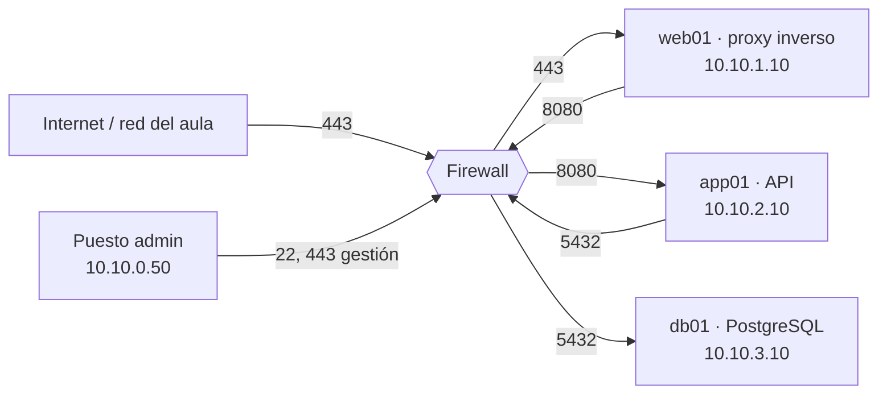
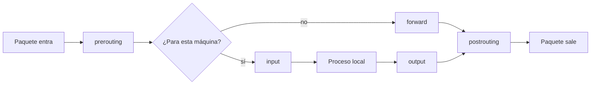
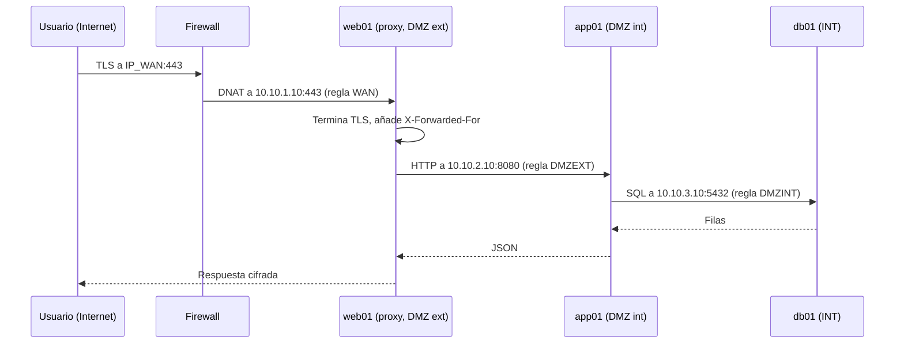

# UT3 · Seguridad por capas: DMZ externa, DMZ interna y zona interna

<p class="ut-meta">12 h · Sesiones 13 a 18 · RA1 CE d</p>

En la UT2 montasteis una VPC por entorno (dev, pre, pro) con dos subredes, front y back, y comprobasteis que el enrutado entre ellas funcionaba. Funcionaba demasiado bien: cualquier máquina de front podía hablar con cualquier puerto de back. En esta unidad ponemos un cortafuegos en medio, añadimos dos zonas más (datos y gestión) y convertimos esa red plana en una red por capas donde cada salto está justificado, permitido de forma explícita y registrado. Después tendremos que demostrar con nmap y tcpdump (un escáner de puertos y un capturador de tráfico) que el aislamiento es real, y separar dos clientes que comparten la misma infraestructura. Lo que construyáis aquí no se tira: en la UT5 lo describiréis como código con OpenTofu y Ansible, y en la UT6 el pipeline de Jenkins desplegará contenedores dentro de estas zonas, respetando las reglas que escribáis ahora.

## Introducción

Esta unidad convierte la red plana de la UT2 en una red por capas con un cortafuegos en medio, y termina con un informe que demuestra, con escaneos y capturas, que el aislamiento es real. Antes de entrar en las sesiones, esto es lo que tienes que saber hacer al terminar, las herramientas que aparecen y el plan de cada día.

### Qué tienes que saber hacer al terminar

El criterio de evaluación d del RA1 pide desplegar capas de seguridad según el nivel de exposición de cada servicio, probarlas y separar clientes. En concreto:

- Explicar el modelo de zonas (exterior, DMZ externa, DMZ interna, zona interna, gestión) y decidir en qué zona va cada componente de una aplicación.
- Instalar y configurar un cortafuegos con estado entre zonas (OPNsense en clase, o nftables sobre Debian) con política de denegación por defecto.
- Publicar un servicio hacia Internet a través de un proxy inverso con TLS, sin exponer la aplicación ni la base de datos.
- Aislar dos clientes con VLAN y reglas, de forma que compartan el proxy pero no se alcancen entre sí.
- Probar el aislamiento con nmap, nc, tcpdump y los logs del cortafuegos, e interpretar correctamente lo que devuelven.
- Entregar a operaciones una matriz de reglas justificada, una matriz de pruebas con evidencias y un procedimiento de cambios.

### Los conceptos de la unidad

Un jueves por la tarde un compañero de otro grupo lanza desde su VM del aula un `nmap` contra vuestra subred back y le salen el 22 de SSH, el 8080 de la API y, en la subred de al lado, el 5432 de PostgreSQL. Abre `psql`, prueba `postgres` sin contraseña y entra. Nadie se entera porque nada lo registra, y esa base de datos de dev tiene una copia de la de pro. Ese es el problema de la unidad: la red funciona, pero cualquiera que esté dentro llega a todo. Lo que queremos al terminar cabe en una frase: que desde fuera solo se vea el 443 del proxy, que cada salto entre zonas exista porque una regla escrita lo permite, y que podáis demostrarlo con escaneos y capturas fechadas.

| Herramienta o concepto | Qué es, en una frase | Para qué la usamos en esta unidad |
|------------------------|----------------------|-----------------------------------|
| Zonas y defensa en profundidad | Dividir la red en capas y poner un filtro entre cada dos | Decidir en qué zona va cada máquina y qué puede hablar con qué |
| Cortafuegos con estado | Un filtro que recuerda las conexiones abiertas, como el portero que deja volver a entrar a quien vio salir | Escribir una sola regla por conexión, en la dirección en que se inicia |
| OPNsense | Un cortafuegos con interfaz web que se instala como una VM más de Proxmox | El firewall central del laboratorio, con una interfaz por zona |
| nftables | El firewall del kernel Linux, con las reglas en un fichero de texto | La alternativa sin interfaz web, la que Ansible desplegará en la UT5 |
| NAT (port forward y outbound) | Reescribir la IP de destino o de origen de un paquete al cruzar el firewall | Publicar el proxy en la IP pública y dar salida a Internet solo a quien la necesite |
| Proxy inverso (nginx) | Un servidor web que recibe las peticiones de fuera y las reenvía al de dentro | Que Internet hable con web01 y nunca con la aplicación ni la base de datos |
| TLS, certificados y CA | TLS es el cifrado de HTTPS; el certificado identifica al servidor y la CA es quien lo firma y en quien confían los clientes | Cifrar lo publicado con una CA propia hecha con openssl, y saber cuándo toca Let's Encrypt |
| VLAN (802.1Q) | Una etiqueta numérica en cada trama Ethernet que separa redes sobre el mismo cable | Aislar a dos clientes que comparten firewall y proxy |
| nmap | Un escáner de puertos: pregunta a una máquina, puerto a puerto, si alguien responde | Comprobar desde cada zona qué se ve de verdad y distinguir `closed` de `filtered` |
| nc y curl | Un cliente TCP mínimo y un cliente HTTP de terminal | Probar un puerto concreto y el servicio publicado de extremo a extremo |
| tcpdump | Un grabador de tráfico: muestra los paquetes que pasan por una interfaz | Saber en qué interfaz muere un paquete |
| IDS/IPS y WAF | Filtros que miran el contenido de los paquetes o de las peticiones web, no solo los puertos | Solo se mencionan como capas adicionales; el apartado está en [Para ampliar](../ampliacion.md#idsips-y-waf-dos-capas-mas) |

Cómo está organizada la unidad: sigue las seis sesiones en el orden en que se dan, y cada sesión trae primero la teoría que se explica ese día (con el material de consulta que necesita la hoja) y después su hoja de práctica. En la sesión 13 se explica el modelo de zonas y el cortafuegos con estado, y se instala OPNsense con una interfaz por zona. En la 14 se aprenden las reglas, los aliases y el NAT, y se publica la primera web con certificado de una CA propia. En la 15 se completa la cadena proxy, aplicación y base de datos con las reglas mínimas entre capas, y en la 16 se añaden dos clientes en VLAN que comparten el proxy sin verse. La 17 ejecuta la matriz de pruebas con nmap, nc y tcpdump, y la 18 cierra el informe de la práctica evaluable. Al final quedan, como consulta, los errores frecuentes del laboratorio.

!!! info "Dónde se usa esto en la otra asignatura"
    La [UT3 de Mantenimiento, seguridad de la monitorización](https://victor-educ.github.io/apuntes-5169/ut/ut3-seguridad-monitorizacion/) (24 nov a 3 dic) va en paralelo con esta (18 nov a 4 dic) y da por sabido lo que se explica aquí: nmap, tcpdump, nftables, la CA del curso y las reglas de OPNsense se aprenden en esta quincena y allí se aplican a los puertos de la monitorización.
    Hasta ahora app01 y mon01 vivían en el entorno provisional del bridge del aula (vmbr0); esta unidad es el momento de moverlas a la VPC dev, detrás del firewall de la sesión 13, con mon01 en la red de gestión.
    La matriz de reglas de la sección de documentación es la que en la 5169 se amplía con los puertos de los exporters (9100, 8080, 9187) desde mon01 y el 3100 de Loki desde cada host: allí no se hace una matriz nueva, se añaden filas a esta.

### Plan de sesiones

Cada sesión de dos horas empieza con una explicación corta y sigue con laboratorio. La columna "Se explica" es lo que cuento yo al principio (con su duración aproximada); la columna "Se practica" es lo que hacéis vosotros con el material de práctica de esta unidad. Las sesiones marcadas solo como práctica no traen teoría nueva.

| Sesión | Fecha | Tipo | Se explica | Se practica |
|---:|-------|------|------------|-------------|
| [13](#sesion-13-modelo-de-seguridad-por-capas) | 18 nov | Teoría y práctica | Defensa en profundidad, zonas y DMZ con uno y dos cortafuegos; cortafuegos con estado; qué es OPNsense (30 min). | Crear las VNets vdata y vmgmt, instalar OPNsense con cinco interfaces, asignar .1 en cada zona, acceder solo desde MGMT. |
| [14](#sesion-14-reglas-por-zona-y-publicacion-de-un-servicio) | 20 nov | Teoría y práctica | Orden de evaluación de reglas, aliases, port forward y outbound NAT (20 min). | Comprobar que sin reglas nada pasa; nginx en web01; port forward WAN:443 y regla; curl desde el aula. |
| [15](#sesion-15-dmz-interna-y-zona-interna) | 25 nov | Teoría y práctica | Patrón proxy inverso, aplicación, base de datos; terminación TLS y cabeceras (20 min). | app01 con API en 8080, db01 con PostgreSQL limitado a la subred back, reglas mínimas entre capas, nginx como proxy inverso; probar desde fuera. |
| [16](#sesion-16-separacion-de-clientes) | 27 nov | Teoría y práctica | Opciones de aislamiento multi-tenant y por qué usamos VLAN por cliente (15 min). | VLAN 101 y 102 sobre bridge VLAN aware, reglas que solo permiten llegar al proxy, comprobar que A no alcanza a B. |
| [17](#sesion-17-pruebas-de-seguridad) | 2 dic | Práctica | Cómo leer open, closed y filtered en nmap (10 min). | Ejecutar la matriz de pruebas completa desde cada zona, capturar con tcpdump dos denegaciones y localizarlas en el log del firewall. |
| [18](#sesion-18-practica-evaluable) | 4 dic | Práctica evaluable | Aclaración del enunciado (10 min). | Cerrar el informe: diagrama, matriz de reglas justificada, matriz de pruebas, un hallazgo corregido y el procedimiento de reglas nuevas. |

## Sesión 13 · Modelo de seguridad por capas

<p class="ut-meta">18 de noviembre · Teoría y práctica · Explicación unos 30 min · Práctica unos 90 min</p>

Al acabar la sesión tendréis un OPNsense con una pata en cada una de las cinco zonas, con la IP .1 en cada red y la consola web accesible solo desde gestión. Para la hoja hace falta entender el modelo de zonas y el mapa sobre la VPC de la UT2 (qué zona es cada subred que ya tenéis), por qué basta un cortafuegos con estado y una regla por conexión, y la tabla de interfaces de la instalación de OPNsense. La alternativa con nftables es material de consulta para quien prefiera un router Debian: la hoja la enlaza en su último paso.

### Defensa en profundidad y zonas

Ningún control de seguridad es perfecto. El proxy tendrá una vulnerabilidad algún día, alguien subirá una imagen de contenedor con una librería vieja, un administrador reutilizará una contraseña. La defensa en profundidad parte de asumir que cada control fallará y pone varios en serie, de modo que cada capa que atraviesa un atacante le cuesta trabajo, le lleva tiempo y deja rastro en un log que alguien (o algo) está mirando. La forma clásica de organizarlo en red son las zonas, separadas por un cortafuegos que solo deja pasar lo imprescindible entre una y la siguiente.

| Zona | Qué aloja | Quién puede entrar | Hacia dónde sale |
|----|----|----|----|
| Exterior (WAN / Internet) | Usuarios, atacantes | Nadie | DMZ externa |
| DMZ externa | Lo que debe verse desde fuera: proxy inverso, balanceador, web estática, concentrador VPN | Internet, en puertos concretos (80/443) | DMZ interna, en puertos concretos |
| DMZ interna | Aplicación / API, colas, caché | DMZ externa | Zona interna, en puertos concretos |
| Zona interna | Bases de datos, almacenamiento, backups | DMZ interna y administradores | Nada hacia fuera (o solo actualizaciones por proxy) |
| Gestión | Consola del firewall, SSH, Proxmox, monitorización | Administradores | Todas las zonas, solo en puertos de gestión |

Los principios que gobiernan las reglas son cuatro, y los veréis repetidos en cualquier auditoría:

- **Denegar por defecto**: todo lo que no está permitido expresamente se bloquea y se registra. La lista de reglas es una lista blanca.
- **Tráfico solo hacia dentro por saltos**: Internet nunca habla con la zona interna; la web nunca habla con la base de datos sin pasar por la aplicación. Cada zona solo inicia conexiones hacia la inmediatamente más profunda.
- **Mínima exposición**: un servicio en DMZ externa solo expone el puerto que necesita. La gestión (SSH, consola web, API de Proxmox) va por una red aparte que no es alcanzable desde ninguna zona de servicio.
- **Registro**: todo lo denegado, y todo lo permitido hacia zonas sensibles, queda en un log con marca de tiempo, regla que lo decidió, origen y destino.

#### Qué frena cada capa

Para que el modelo no se quede en una tabla bonita, conviene saber qué ataque concreto para cada zona. Un escaneo de puertos desde Internet contra la IP pública solo ve el 443 del proxy; los puertos 8080 de la aplicación y 5432 de PostgreSQL ni siquiera aparecen como cerrados, aparecen como filtrados, que es distinto y lo veremos al hablar de nmap. Si un atacante explota una vulnerabilidad del proxy y consigue ejecutar código en él, se encuentra en la DMZ externa: puede llegar al 8080 de app01 porque es lo que el proxy necesita, pero no puede abrir una sesión a la base de datos, ni hacer SSH a nada, ni salir a Internet a descargarse herramientas si la regla de salida de la DMZ externa está cerrada. Si además compromete la aplicación (inyección SQL, deserialización, dependencia vulnerable), llega a la base de datos, pero con el usuario de aplicación, que no puede hacer `COPY ... TO PROGRAM` (una orden de PostgreSQL que ejecuta programas en el servidor) ni leer otras bases. Para llegar a la zona de gestión no hay ningún camino permitido desde ninguna zona de servicio, así que tendría que atacar el propio cortafuegos. Cada uno de esos saltos deja intentos denegados en el log, que es justo lo que un sistema de detección busca.

Comparadlo con la red plana de la UT2: una vulnerabilidad en el proxy daba acceso directo a la base de datos y al hipervisor.

#### Mapa sobre la VPC de la UT2

No hay que rehacer la red; lo que ya tenéis se reasigna y se amplía: la subred front pasa a ser la DMZ externa, back pasa a ser la DMZ interna, y se añaden dos subredes nuevas, data como zona interna y mgmt para administración. En el entorno dev del aula queda así:

| Zona | Nombre en Proxmox | Red | Gateway (firewall) | Máquinas |
|----|----|----|----|----|
| DMZ externa | front (vfront) | 10.10.1.0/24 | 10.10.1.1 | web01 (proxy) |
| DMZ interna | back (vback) | 10.10.2.0/24 | 10.10.2.1 | app01 |
| Zona interna | data (vdata) | 10.10.3.0/24 | 10.10.3.1 | db01 |
| Gestión | mgmt (vmgmt) | 10.10.0.0/24 | 10.10.0.1 | Vuestro puesto de administración |
| Exterior | vmbr0 (bridge del aula) | La del aula | Router del aula | Todo lo demás |



El cortafuegos es el gateway de todas las zonas, con la IP .1 en cada una, así que ningún paquete cruza de una subred a otra sin pasar por él. Si en la UT2 pusisteis un router entre front y back, esa VM se sustituye por el firewall o se convierte en él.

### DMZ con uno y con dos cortafuegos

El esquema que acabamos de dibujar usa un solo cortafuegos con cinco interfaces, una por zona. Es el diseño habitual en pymes y en laboratorios porque es barato y toda la política está en un sitio. Su punto débil es evidente: si el cortafuegos cae, o alguien lo configura mal, todas las capas caen a la vez.

<figure markdown="span">
  { width="560" }
  <figcaption>DMZ con un solo cortafuegos: una interfaz hacia Internet, otra hacia la DMZ y otra hacia la red interna. Fuente: Pbroks13, dominio público, vía Wikimedia Commons.</figcaption>
</figure>

El diseño de dos cortafuegos pone uno de cara a Internet (el "front-end" o perimetral) que solo permite tráfico hacia la DMZ, y otro detrás (el "back-end") entre la DMZ y la red interna. Un atacante que comprometa el primero sigue teniendo el segundo por delante. Con dos firewalls también se reparte la carga: el perimetral absorbe el ruido de Internet y el interno solo ve tráfico ya filtrado.

<figure markdown="span">
  { width="560" }
  <figcaption>DMZ con dos cortafuegos: el perimetral protege la DMZ; el interno protege la red corporativa. Fuente: Pbroks13, dominio público, vía Wikimedia Commons.</figcaption>
</figure>

Una recomendación clásica de las guías de seguridad perimetral es que los dos cortafuegos sean de fabricantes distintos. Una vulnerabilidad de ejecución remota en el software del firewall (las ha habido en todos los grandes fabricantes) afectaría a los dos si son iguales; con dos fabricantes, el atacante necesita dos exploits distintos. El coste es que operaciones tiene que administrar dos productos, dos ciclos de parches y la misma política en dos sintaxis, y por eso muchas empresas medianas acaban con un solo firewall bien mantenido en lugar de dos mal mantenidos. Mi opinión: un cortafuegos único, parcheado y revisado cada trimestre, es mejor que dos que nadie toca porque dan miedo.

En clase montamos el modelo de un firewall con cinco interfaces. Quien quiera el de dos puede usar OPNsense como perimetral y un Debian con nftables como interno: fabricantes distintos, gratis y lo que vemos en las dos secciones siguientes.

### Cortafuegos con estado

Antes de escribir la primera regla hay que entender cómo decide el cortafuegos qué paquete pasa, porque de eso depende cuántas reglas hacen falta y en qué dirección se escriben. La idea del apartado es una: el firewall recuerda las conexiones que ya aceptó, así que solo hay que permitir el primer paquete de cada una. Quien lo tiene claro escribe la mitad de reglas y entiende el error de "abre pero no responde".

Un cortafuegos sin estado (stateless, un filtro de paquetes puro) mira cada paquete de forma aislada: origen, destino, protocolo, puerto, flags. Para permitir que web01 abra una conexión a app01:8080 necesitaría dos reglas, una para el SYN de ida (el primer paquete de una conexión TCP, el que pide abrirla) y otra para la respuesta de vuelta, y la de vuelta tendría que permitir tráfico desde el puerto 8080 de app01 hacia cualquier puerto alto de web01, lo cual es un agujero: cualquier cosa que se origine en app01 con puerto origen 8080 pasaría.

Un cortafuegos **con estado** (stateful) recuerda las conexiones. Cuando ve el SYN de web01:43812 hacia app01:8080 y una regla lo permite, crea una entrada en su **tabla de estados** con la tupla (protocolo, IP origen, puerto origen, IP destino, puerto destino) y el estado de la conexión. Cuando llega el SYN-ACK de vuelta, no evalúa las reglas: busca en la tabla, encuentra la entrada, comprueba que el paquete es coherente con el estado (números de secuencia, flags) y lo deja pasar. Lo mismo con todos los paquetes siguientes en ambas direcciones, hasta que ve el cierre (FIN/RST) o la entrada expira por inactividad.

En Linux este mecanismo se llama **conntrack** y es un módulo del kernel (`nf_conntrack`) que usan tanto iptables (el antecesor de nftables) como nftables. En OPNsense y pfSense lo hace el propio `pf` (el filtro de paquetes de FreeBSD, el sistema sobre el que se construyen ambos), con una tabla que podéis ver en Firewall → Diagnostics → States. Los estados que manejan son, de forma simplificada:

| Estado | Significado |
|----|----|
| `new` | Primer paquete de una conexión que no está en la tabla. Es el único que se evalúa contra las reglas. |
| `established` | Paquetes de una conexión ya aceptada, en cualquier dirección. |
| `related` | Conexión nueva que el kernel sabe que pertenece a otra existente: el canal de datos de FTP, o un ICMP "puerto inalcanzable" en respuesta a un UDP que enviamos. |
| `invalid` | Paquete que no encaja con ningún estado ni es un inicio válido (un ACK suelto, un SYN-ACK sin SYN previo). Se descarta siempre. |

Para UDP e ICMP, que no tienen conexión, conntrack crea "pseudo-estados" basados en la tupla y un temporizador: si enviamos una consulta DNS a 10.10.0.53:53, la respuesta que llegue en los siguientes 30 segundos desde ese origen a ese puerto se considera `established`.

Por qué importa esto para escribir reglas: solo hay que escribir la regla del primer paquete, en la dirección en que se inicia la conexión, y poner una regla genérica `established,related accept` al principio de la cadena. Es lo que hace que la política "DMZ externa puede iniciar hacia DMZ interna:8080, pero DMZ interna no puede iniciar nada hacia DMZ externa" sea expresable con una sola línea. También explica un error clásico: si la regla `established,related` no está, o está después de un `drop`, la conexión abre (el SYN pasa) pero nunca responde, y en tcpdump veréis SYN, SYN-ACK... y el SYN-ACK muriendo en el firewall.

La tabla de estados tiene tamaño finito. En Debian `sysctl net.netfilter.nf_conntrack_max` suele valer 65536 o más según la RAM; en OPNsense el límite está en Firewall → Settings → Advanced (Firewall Maximum States). Un ataque de inundación de SYN busca precisamente llenarla; cuando se llena, el firewall descarta conexiones nuevas legítimas y en el log aparece `nf_conntrack: table full, dropping packet`. Los tiempos de expiración también se configuran: una conexión TCP establecida sin tráfico vive por defecto 5 días en conntrack de Linux, y por eso una sesión SSH aguanta horas abierta sin que el firewall la olvide.

### OPNsense

Montamos el cortafuegos del laboratorio: una VM con una pata en cada zona, la consola web solo accesible desde gestión, y las reglas, el NAT y los logs que hacen que el modelo de zonas exista de verdad. Más que los menús, que cambian con cada versión, importan tres ideas: las reglas se escriben con nombres (aliases), se evalúan en la interfaz por la que entra el paquete, y nada se aplica hasta pulsar "Apply changes".

OPNsense es una distribución de firewall basada en FreeBSD y en el filtro `pf`, con interfaz web, desarrollo abierto y versiones semestrales (la 26.1 y la 26.7 son las de este curso; la numeración es año.mes). Nació como bifurcación de pfSense en 2015 y las dos son funcionalmente muy parecidas: si en una empresa os encontráis pfSense, todo lo de esta sección aplica cambiando algún nombre de menú. En clase usamos OPNsense porque la interfaz es más limpia, parchea más rápido y la edición comunitaria no tiene recortes respecto a la de pago.

<figure markdown="span">
  { width="640" }
  <figcaption>Panel de OPNsense con el estado de interfaces, servicios y tráfico. Fuente: Hagennos, CC BY-SA 4.0, vía Wikimedia Commons.</figcaption>
</figure>

#### Instalación en Proxmox

Se instala como una VM normal: imagen `dvd` o `vga` de la 26.x desde opnsense.org, 2 vCPU, 2 GB de RAM y 20 GB de disco sobran. Lo que la distingue es el número de interfaces: una por zona, cinco en nuestro caso, cada una conectada a su bridge o VNet de Proxmox. Usad el modelo VirtIO (el dispositivo paravirtualizado de KVM, el más rápido en Proxmox) para las NIC y activad la opción de arranque en el orden correcto; FreeBSD nombra las interfaces VirtIO como `vtnet0`, `vtnet1`... en el orden en que Proxmox las presenta en el bus PCI, así que el orden en que las añadís a la VM importa. Apuntad qué MAC corresponde a qué bridge antes de arrancar, porque en el asistente de consola tendréis que asignar cada `vtnetN` a su papel:

| Interfaz OPNsense | vtnet | Bridge / VNet Proxmox | IP |
|----|----|----|----|
| WAN | vtnet0 | vmbr0 (aula) | DHCP del aula o fija |
| DMZEXT | vtnet1 | vfront | 10.10.1.1/24 |
| DMZINT | vtnet2 | vback | 10.10.2.1/24 |
| INT | vtnet3 | vdata | 10.10.3.1/24 |
| MGMT | vtnet4 | vmgmt | 10.10.0.1/24 |

Tras la instalación, la interfaz web escucha en todas las interfaces con la regla "anti-lockout" (la que impide que os cerréis el acceso a la propia consola) activa en LAN. Lo primero que haréis es mover la administración a MGMT y desactivar el acceso desde el resto (System → Settings → Administration, "Listen interfaces"). Si os equivocáis y os quedáis fuera, la consola de Proxmox de la VM tiene un menú de texto con la opción "Reset to factory defaults" y otra para reasignar interfaces; no hace falta reinstalar.

### Alternativa: nftables en una VM Linux

*Material de consulta: no se explica en clase; lo necesitas para la hoja de práctica de esta sesión.*

El mismo modelo se puede montar con un router Debian 13 con cinco interfaces y nftables, que es el framework de filtrado del kernel Linux desde la 3.13 y el sucesor de iptables. Se pierde la interfaz web y sus comodidades (aliases con resolución DNS, live view); se gana un fichero de texto de 40 líneas que se versiona en git y que Ansible despliega en la UT5 sin magia. Es el mismo motor que usan el firewall de Proxmox y Docker, así que os interesa entenderlo aunque uséis OPNsense.

#### Tablas, cadenas, hooks y prioridades

Un ruleset de nftables se organiza en **tablas**, que son contenedores con una familia de direcciones: `ip` (IPv4), `ip6`, `inet` (las dos a la vez, la que usaréis), `arp`, `bridge` y `netdev`. Dentro de una tabla hay **cadenas**, y las cadenas contienen reglas. Hay dos tipos de cadena: las **base**, que se enganchan a un hook del kernel y por las que pasa el tráfico automáticamente, y las regulares, a las que solo se llega con `jump` o `goto` desde otra cadena.

Los hooks son los puntos del recorrido de un paquete por la pila de red donde netfilter puede intervenir:



Para un router entre zonas casi todo ocurre en `forward`: el tráfico que va de una zona a otra no es para el firewall, así que nunca pasa por `input` ni `output`. `input` protege al propio firewall (quién puede hacerle SSH o abrir su web) y `prerouting`/`postrouting` son donde se hace el NAT (DNAT en prerouting, antes de decidir la ruta; SNAT en postrouting, después).

La **prioridad** ordena las cadenas base que comparten hook: se evalúan de menor a mayor número. Hay nombres predefinidos: `raw` (-300), `mangle` (-150), `dstnat` (-100), `filter` (0), `security` (50), `srcnat` (100). Lo importante es que el DNAT (-100) va antes que el filtro (0) en prerouting, y por eso en la cadena `forward` se filtra con la dirección de destino ya traducida, igual que en pf. La **política** de una cadena base (`policy drop` o `policy accept`) es lo que ocurre si ninguna regla coincide; en `forward` e `input` la ponemos en `drop`.

#### El fichero completo y persistente

Este es el fichero `/etc/nftables.conf` para nuestro laboratorio, con nombres de interfaz ya renombrados con systemd-networkd o udev (los dos mecanismos de Debian para dar nombre fijo a una interfaz) para que se llamen como las zonas (si no, usad `ens18`, `ens19`... o mejor, definid variables). Tiene tres partes: las variables con redes y servidores, la tabla `fw` con las cadenas `input` (quién llega al propio router) y `forward` (qué cruza entre zonas), y la tabla `nat`. Fijaos en que las dos cadenas de filtro empiezan igual, con `established,related` e `invalid`, y terminan con un `log` seguido de `drop`; entre medias solo están los saltos permitidos, uno por línea:

```text
#!/usr/sbin/nft -f
flush ruleset

define net_dmzext = 10.10.1.0/24
define net_dmzint = 10.10.2.0/24
define net_int    = 10.10.3.0/24
define net_mgmt   = 10.10.0.0/24
define srv_web    = 10.10.1.10
define srv_app    = 10.10.2.10
define srv_db     = 10.10.3.10

table inet fw {

    chain input {
        type filter hook input priority filter; policy drop;
        ct state established,related accept
        ct state invalid drop
        iifname "lo" accept
        icmp type { echo-request, destination-unreachable, time-exceeded } accept
        iifname "mgmt" ip saddr $net_mgmt tcp dport { 22, 443 } accept
        log prefix "FW-INPUT-DROP " drop
    }

    chain forward {
        type filter hook forward priority filter; policy drop;
        ct state established,related accept
        ct state invalid drop

        # Publicación: Internet -> proxy (destino ya traducido por el DNAT)
        iifname "wan" oifname "dmzext" ip daddr $srv_web tcp dport { 80, 443 } accept

        # Capas: proxy -> app -> db
        iifname "dmzext" oifname "dmzint" ip saddr $srv_web ip daddr $srv_app tcp dport 8080 accept
        iifname "dmzint" oifname "int"    ip saddr $srv_app ip daddr $srv_db  tcp dport 5432 accept

        # Gestión llega a todo por SSH
        iifname "mgmt" ip saddr $net_mgmt tcp dport 22 accept

        # Diagnóstico: ping desde gestión
        iifname "mgmt" icmp type echo-request accept

        log prefix "FW-FWD-DROP " drop
    }

    chain output {
        type filter hook output priority filter; policy accept;
    }
}

table ip nat {
    chain prerouting {
        type nat hook prerouting priority dstnat; policy accept;
        iifname "wan" tcp dport { 80, 443 } dnat to $srv_web
    }
    chain postrouting {
        type nat hook postrouting priority srcnat; policy accept;
        oifname "wan" ip saddr $net_dmzext masquerade
    }
}
```

Fijaos en que el `masquerade` solo cubre la DMZ externa: la DMZ interna y la zona interna no tienen salida a Internet. Si app01 necesita instalar paquetes, se hace por un proxy APT en MGMT o se abre una regla temporal y documentada.

Para probarlo sin cargarlo, `nft -c -f /etc/nftables.conf` valida la sintaxis. Se carga con `nft -f /etc/nftables.conf` y se persiste activando el servicio: `systemctl enable --now nftables`, que en Debian lee exactamente ese fichero en cada arranque. Antes de todo hay que activar el reenvío en el kernel, `net.ipv4.ip_forward=1` en `/etc/sysctl.d/99-router.conf`, porque sin eso el router descarta todo lo que no es para él aunque nftables lo permita. `nft list ruleset` muestra lo cargado, y `nft list ruleset -a` añade los handles de cada regla para poder borrar una concreta. Los logs salen por el kernel, `journalctl -k -f | grep FW-`, o a un fichero propio si configuráis rsyslog (el servicio de logs de Debian) con un filtro por prefijo.

!!! warning "Orden de las reglas y bloqueo remoto"
    Si administráis el router Debian por SSH desde MGMT y cargáis un ruleset con `policy drop` en `input` sin la regla que permite vuestro SSH, os quedáis fuera en el acto (la sesión actual sobrevive gracias a `established`, pero la siguiente no entra). Probad siempre con un `at now + 5 min` (una orden programada que se ejecuta pasado ese tiempo) que restaure el fichero anterior, o desde la consola de Proxmox.

### A3.1 Instalar el firewall (sesión 13)

**Objetivo.** Un OPNsense con una pata en cada una de las cinco zonas, con la IP .1 en cada red, cuya consola web solo responde desde MGMT, y web01, app01 y db01 usándolo como puerta de enlace.

**Antes de empezar.**

- La VPC dev de la UT2 con vfront, vback, web01 (10.10.1.10) y app01 (10.10.2.10). Si db01 no existe, créala hoy como Debian 13 mínima en vdata con la 10.10.3.10.
- Una VM en vmgmt con la 10.10.0.50: el puesto desde el que administrarás el firewall toda la unidad.
- La ISO `dvd` de OPNsense 26.x en el almacenamiento de Proxmox.
- Explicado en clase: [el modelo de zonas](#defensa-en-profundidad-y-zonas), [el mapa sobre la VPC](#mapa-sobre-la-vpc-de-la-ut2) y [qué es un cortafuegos con estado](#cortafuegos-con-estado). Para la instalación, la tabla de interfaces de [Instalación en Proxmox](#instalacion-en-proxmox).

**Pasos.**

1. Crea las dos VNets nuevas en el entorno dev, junto a vfront y vback: Datacenter → SDN → VNets, `vdata` con la subred 10.10.3.0/24 y `vmgmt` con la 10.10.0.0/24, en la misma zona que las anteriores. Pulsa Apply en SDN para que existan en el host.
2. Crea la VM del firewall (2 vCPU, 2 GB, 20 GB, la ISO) con cinco NIC VirtIO en este orden exacto, porque FreeBSD las numera por orden de bus PCI:

    | NIC en Proxmox | Bridge / VNet | Será | IP que le pondrás |
    |----|----|----|----|
    | net0 | vmbr0 | WAN (vtnet0) | DHCP del aula |
    | net1 | vfront | DMZEXT (vtnet1) | 10.10.1.1/24 |
    | net2 | vback | DMZINT (vtnet2) | 10.10.2.1/24 |
    | net3 | vdata | INT (vtnet3) | 10.10.3.1/24 |
    | net4 | vmgmt | MGMT (vtnet4) | 10.10.0.1/24 |

3. Antes de arrancar, apunta la MAC de cada NIC (pestaña Hardware de la VM); te hará falta si algo no cuadra en Interfaces → Assignments.
4. Arranca desde la ISO, entra como `installer` / `opnsense`, instala con las opciones por defecto, cambia la contraseña de root, retira la ISO y reinicia.
5. En la consola de la VM, opción 1 "Assign interfaces": WAN → vtnet0, LAN → vtnet4 (OPNsense llama LAN a la primera interfaz protegida; será MGMT). Opción 2 "Set interface IP address" para LAN: 10.10.0.1/24, sin DHCP. WAN queda en DHCP.
6. Desde el puesto de gestión, entra en `https://10.10.0.1`. En Interfaces → Assignments añade vtnet1, vtnet2 y vtnet3; en cada una activa la interfaz, descripción (DMZEXT, DMZINT, INT), IPv4 estática .1/24 de su zona y sin gateway. Renombra LAN a MGMT.
7. Mueve la administración a MGMT: System → Settings → Administration, en "Listen interfaces" deja solo MGMT. No desactives la regla anti-lockout hasta tener una regla propia en MGMT (sesión 14).
8. Cambia la puerta de enlace de las VM de servicio: en `/etc/network/interfaces` de cada una, `gateway 10.10.1.1` en web01, `10.10.2.1` en app01 y `10.10.3.1` en db01; `systemctl restart networking` e `ip route` para comprobarlo. Si en la UT2 había un router entre front y back, apágalo.

9. Alternativa nftables: una VM Debian 13 con las mismas cinco NIC, `net.ipv4.ip_forward=1` en `/etc/sysctl.d/99-router.conf`, las .1 en las interfaces y el fichero de [El fichero completo y persistente](#el-fichero-completo-y-persistente) cargado con `nft -f`.

**Comprobación.**

- Desde el puesto de gestión, `ping 10.10.0.1` responde y la consola web abre.
- Desde web01, `ping 10.10.1.1` responde, pero `curl -k -m 3 https://10.10.1.1` falla por timeout: la consola no escucha en DMZEXT.
- En Interfaces → Assignments la MAC de cada vtnet coincide con la que apuntaste para cada bridge.
- `ip route` en web01, app01 y db01 muestra `default via 10.10.X.1`.

**Entrega.** En la carpeta `ut3/` de tu repositorio, captura de Interfaces → Assignments y un esquema de zonas (texto o Mermaid) con las cinco redes, la IP del firewall en cada una y las máquinas.

**Si te sobra tiempo.** Añade ya la sexta NIC (bridge VLAN aware, sin tag) que necesitarás en la sesión 16.

## Sesión 14 · Reglas por zona y publicación de un servicio

<p class="ut-meta">20 de noviembre · Teoría y práctica · Explicación unos 20 min · Práctica unos 100 min</p>

Hoy el firewall empieza a hacer su trabajo: comprobaréis que sin reglas nada pasa, crearéis los aliases, publicaréis nginx en web01 con un port forward en la WAN y lo probaréis con curl y nmap desde el aula. Los apartados que siguen son la parte de OPNsense que se explica en clase: aliases, orden de evaluación de las reglas, NAT y logs. El apartado de certificados no se explica, pero lo necesitáis para crear la CA y el certificado del proxy en el paso 3 de la hoja.

### Aliases

Un alias es un nombre para un conjunto de IPs, redes, puertos o URLs. `srv_web` = 10.10.1.10, `net_dmzint` = 10.10.2.0/24, `p_app` = 8080, `p_web` = {80, 443}. Las reglas se escriben con aliases, nunca con IPs sueltas, por dos razones: la regla se lee sola ("permitir net_dmzext a srv_app en p_app") y cuando app01 cambie de IP, o haya dos app, se cambia el alias y no diez reglas. Los aliases de tipo "Host" admiten nombres DNS que OPNsense resuelve periódicamente, y los de tipo "URL Table" descargan listas (por ejemplo, rangos de IP de un proveedor) y las actualizan solas. En Firewall → Aliases.

### Reglas y orden de evaluación

Las reglas se organizan por interfaz y se evalúan sobre el tráfico que **entra** por esa interfaz (dirección "in", que es la que usaréis casi siempre). Para permitir que web01 hable con app01:8080, la regla va en la pestaña DMZEXT, porque es por donde entra el paquete al firewall, aunque el destino esté en DMZINT. Pensad siempre "¿por qué interfaz llega este paquete al cortafuegos?".

El orden de evaluación es el siguiente:

1. Reglas automáticas (anti-lockout, las que generan los port forward si se marca la opción).
2. Reglas flotantes (Floating), que aplican a varias interfaces a la vez.
3. Reglas de grupos de interfaces.
4. Reglas de la interfaz concreta, de arriba abajo.
5. Denegación implícita al final, que registra si tenéis activado "Log packets matched by the default deny rule" en Firewall → Settings → Advanced.

Aquí entra la opción **quick**, que está marcada por defecto en cada regla y merece explicación. `pf` evalúa toda la lista y aplica la **última** regla que coincide, salvo que una regla tenga `quick`, en cuyo caso la evaluación se detiene en ella. Como OPNsense marca quick en todo, en la práctica funciona como "la primera que coincide gana". Si desmarcáis quick en una regla, esa regla solo se aplicará si ninguna posterior coincide. Se usa para escribir una regla genérica arriba ("permitir todo desde MGMT", sin quick) que las reglas posteriores más específicas pueden anular. Mi consejo: dejad quick activado y ordenad las reglas de más específica a más general; es más fácil de leer y de auditar.

Cada regla lleva: acción (Pass, Block, Reject), interfaz, dirección, familia IP, protocolo, origen (con puerto opcional), destino y puerto, opción de log, y una descripción. Ponedla siempre: en el log aparece la descripción, no el número de regla. La diferencia entre Block y Reject: Block descarta en silencio (el origen espera hasta agotar el timeout), Reject responde con un TCP RST o un ICMP unreachable (el origen sabe al instante que no hay servicio). Hacia Internet se usa Block, para no dar información; entre zonas internas, Reject ahorra esperas a vuestros propios servicios.

Las reglas nuevas se guardan y luego se aplican con "Apply changes". Hasta que no aplicáis, no hay cambio. Y cuando aplicáis, los estados existentes que ya no encajan con la política se mantienen hasta que expiran; si necesitáis cortar una conexión ya establecida, hay que borrar su estado en Firewall → Diagnostics → States (o "Reset state table", que las corta todas).

### NAT: port forward y outbound

Dos tipos de NAT os van a hacer falta:

**Port forward** (DNAT, NAT de destino: cambia la IP de destino del paquete) publica un servicio interno en la IP WAN: WAN:443 → srv_web:443. Se configura en Firewall → NAT → Port Forward, y al crearlo OPNsense ofrece generar la regla de filtro asociada ("Filter rule association: add associated filter rule"). Aceptadlo; sin regla de filtro, el paquete se traduce pero después se bloquea en la interfaz WAN. En pf el NAT va antes que el filtro, así que la regla de filtro se escribe con el destino ya traducido (srv_web:443), no con la IP WAN.

**Outbound NAT** (SNAT, NAT de origen: cambia la IP de origen) permite que las zonas internas salgan a Internet con la IP del firewall. En modo automático OPNsense lo hace para todas las redes de sus interfaces. En nuestro laboratorio lo queremos restringido: la DMZ interna y la zona interna no deberían salir a Internet salvo para actualizaciones, y eso se resuelve mejor con un proxy de paquetes (apt-cacher-ng, una caché de paquetes Debian, o un mirror interno en MGMT) que con NAT abierto. Ponedlo en modo "Hybrid" y cread solo las reglas de salida que justifiquéis.

### Logs

Firewall → Log Files → Live View muestra en tiempo real cada paquete que coincide con una regla que tiene log activado, y todos los de la denegación por defecto. Cada línea trae interfaz, dirección, acción, origen, destino, protocolo y la etiqueta de la regla. Filtrad por interfaz o por etiqueta; con 20 VM escaneándose, el log sin filtro es inservible. Para el histórico está Plain View, y para enviarlo fuera (lo que haréis en producción y en la UT7) System → Settings → Logging / Targets permite mandar todo por syslog (el protocolo estándar de envío de logs) a un colector.

Activad el log en todas las reglas de denegación y en las de permiso hacia INT. No en la regla de permiso de WAN:443, que generaría una línea por conexión web y solo serviría para llenar el disco; para eso están los logs de acceso del proxy.

### Certificados

*Material de consulta: no se explica en clase; lo necesitas para la hoja de práctica de esta sesión.*

El `curl -kv` de las actividades usa `-k` para saltarse la validación del certificado, y eso está bien para probar el primer día, pero no es la forma de trabajar. Hay dos escenarios:

**CA interna** (autoridad de certificación: quien firma los certificados y en quien confían los clientes) para el laboratorio y para todo lo que no ve Internet (paneles de administración, comunicación entre zonas). Con openssl se crea una CA y se firma un certificado para app.lab en cinco comandos. Fijaos en el SAN (Subject Alternative Name, el campo del certificado donde van los nombres y las IP para los que vale): sin él los navegadores rechazan el certificado aunque la firma sea correcta.

```bash
# CA raíz (guardad la clave en MGMT, no en el proxy)
openssl req -x509 -newkey ec -pkeyopt ec_paramgen_curve:prime256v1 -nodes \
  -keyout ca.key -out ca.crt -days 3650 -subj "/CN=Lab 5166 CA"

# Clave y petición para el proxy
openssl req -newkey ec -pkeyopt ec_paramgen_curve:prime256v1 -nodes \
  -keyout app.key -out app.csr -subj "/CN=app.lab"

# Firma con SAN (sin SAN los navegadores modernos lo rechazan)
printf "subjectAltName=DNS:app.lab,IP:10.10.1.10\n" > san.ext
openssl x509 -req -in app.csr -CA ca.crt -CAkey ca.key -CAcreateserial \
  -out app.crt -days 365 -extfile san.ext
```

Después se instala `ca.crt` en los clientes (`/usr/local/share/ca-certificates/` y `update-ca-certificates` en Debian) y `curl` deja de necesitar `-k`. Para algo más serio que un laboratorio, **step-ca** de Smallstep es una CA completa con protocolo ACME (el protocolo con el que un servidor pide y renueva certificados sin intervención humana, el mismo que usa Let's Encrypt), de modo que los servidores internos renuevan sus certificados solos con el mismo cliente que usarían contra Let's Encrypt, y con certificados de vida corta (24 horas) que hacen innecesarias las listas de revocación.

**Let's Encrypt** en producción, para todo lo que tiene nombre público. Emite certificados de 90 días (y está pasando a 6 días para quien los quiera) gratis, validando que controláis el dominio: con `HTTP-01` publicando un fichero en `/.well-known/acme-challenge/` por el puerto 80 (por eso el port forward del 80 en el firewall aunque redirijáis a HTTPS), o con `DNS-01` creando un registro TXT, que es la única opción para wildcards y para servicios que no exponen el 80. Certbot, Caddy, Traefik y el plugin ACME de OPNsense renuevan solos. Vigilad que la renovación funcione: un certificado caducado un domingo es la avería más tonta y más frecuente de un servicio publicado.

### A3.2 Publicar la web (sesión 14)

**Objetivo.** `https://IP_WAN` responde desde el aula con la web de web01, con un certificado firmado por tu CA, y un nmap desde el aula solo ve el 443 (y el 80).

**Antes de empezar.**

- El firewall de la A3.1 con las cinco interfaces y las tres VM apuntando a él.
- web01 con nginx instalable (proxy APT de MGMT o una regla temporal de salida).
- Explicado en clase: [Aliases](#aliases), [Reglas y orden de evaluación](#reglas-y-orden-de-evaluacion) y [NAT: port forward y outbound](#nat-port-forward-y-outbound). Para el certificado, [Certificados](#certificados).

**Pasos.**

1. Comprueba la política por defecto. Desde web01, `nc -zv -w 3 10.10.2.10 22` y `nc -zv -w 3 10.10.3.10 5432` deben terminar por timeout, no con "Connection refused". En Firewall → Log Files → Live View, filtra por DMZEXT y localiza las dos denegaciones (si no aparecen, activa el log de la regla por defecto en Firewall → Settings → Advanced y repite).

2. Crea los aliases en Firewall → Aliases y pulsa Apply: de tipo Host, `srv_web` 10.10.1.10, `srv_app` 10.10.2.10 y `srv_db` 10.10.3.10; de tipo Network, `net_dmzext` 10.10.1.0/24, `net_dmzint` 10.10.2.0/24, `net_int` 10.10.3.0/24 y `net_mgmt` 10.10.0.0/24; de tipo Port, `p_web` 80 y 443, `p_app` 8080.

3. Crea la CA y el certificado del proxy. Hazlo en el puesto de gestión, no en web01, para que la clave de la CA no viva en la DMZ:

    ```bash
    openssl req -x509 -newkey ec -pkeyopt ec_paramgen_curve:prime256v1 -nodes \
      -keyout ca.key -out ca.crt -days 3650 -subj "/CN=Lab 5166 CA"
    openssl req -newkey ec -pkeyopt ec_paramgen_curve:prime256v1 -nodes \
      -keyout app.key -out app.csr -subj "/CN=app.lab"
    printf "subjectAltName=DNS:app.lab,IP:10.10.1.10,IP:IP_WAN\n" > san.ext
    openssl x509 -req -in app.csr -CA ca.crt -CAkey ca.key -CAcreateserial \
      -out app.crt -days 365 -extfile san.ext
    ```

    Sustituye `IP_WAN` por la IP del firewall en el aula (Interfaces → Overview). Copia `app.crt` y `app.key` a `/etc/ssl/` de web01 con `scp` (la regla de SSH la creas en el paso 5).

4. Instala nginx en web01 y crea `/etc/nginx/sites-available/app.lab`, hoy sin proxy:

    ```nginx
    server {
        listen 80;
        server_name app.lab;
        return 301 https://$host$request_uri;
    }

    server {
        listen 443 ssl;
        http2 on;
        server_name app.lab;
        ssl_certificate     /etc/ssl/app.crt;
        ssl_certificate_key /etc/ssl/app.key;
        ssl_protocols TLSv1.2 TLSv1.3;
        root /var/www/html;
    }
    ```

    Enlázalo en `sites-enabled`, borra el enlace `default`, `nginx -t` y `systemctl reload nginx`.

5. Regla de gestión: en la pestaña MGMT, Pass, origen net_mgmt, destino any, puerto 22, log sí, descripción "5 Administración por SSH"; y otra Pass desde net_mgmt a "This Firewall" puerto 443 para no quedarte fuera de la consola.
6. Port forward: Firewall → NAT → Port Forward, interfaz WAN, TCP, destino "WAN address" puerto p_web, redirigir a srv_web puerto p_web, "Add associated filter rule", descripción "1 Publicación de app.lab". Apply y comprueba en Firewall → Rules → WAN que la regla asociada tiene destino srv_web (traducido, no la IP WAN).
7. Desde tu equipo del aula, primera prueba sin validar el certificado: `curl -kv https://IP_WAN`.
8. Instala la CA en tu equipo (`ca.crt` en `/usr/local/share/ca-certificates/lab5166.crt` y `update-ca-certificates`) y repite sin `-k`, con el nombre para que el SAN coincida:

    ```bash
    echo "IP_WAN app.lab" | sudo tee -a /etc/hosts
    curl -v https://app.lab
    ```

9. Escanea la IP WAN desde el aula: `sudo nmap -sS -Pn -p 22,80,443,8080 IP_WAN`.

**Comprobación.**

- El `curl -v` sin `-k` termina con `SSL certificate verify ok` y un 200 con la página por defecto de nginx; `curl -v http://app.lab` devuelve un 301 a `https://app.lab/`.
- El nmap muestra 443 y 80 `open`; 22 y 8080 `filtered`. Si alguno sale `closed`, revisa las reglas de WAN antes de seguir.
- En el log, con filtro por interfaz WAN, ves los SYN al 22 y al 8080 denegados por la regla por defecto.

**Entrega.** En `ut3/`: captura de Firewall → Rules (WAN y MGMT) y de NAT → Port Forward, la salida del `curl -v` sin `-k` y la del nmap. Guarda también `ca.crt` (nunca `ca.key`): lo necesitaréis en la 5169.

**Si te sobra tiempo.** Mira en la salida del curl la cabecera `Server` y añade `server_tokens off;` en `/etc/nginx/nginx.conf` para dejar de regalar la versión.

## Sesión 15 · DMZ interna y zona interna

<p class="ut-meta">25 de noviembre · Teoría y práctica · Explicación unos 20 min · Práctica unos 100 min</p>

Al terminar, la cadena Internet, proxy, aplicación y base de datos funciona con solo dos reglas entre capas, y un intento del proxy contra la base de datos muere en el firewall y queda en el log. En clase se explica el patrón de publicación y el proxy inverso con sus cabeceras; la matriz de reglas de la documentación operativa es consulta, pero hoy empezáis a rellenarla en el paso 8 de la hoja.

### Publicar un servicio

Con el firewall en pie, toca el primer servicio de verdad: una web que se ve desde Internet con HTTPS y cuya aplicación y base de datos no son alcanzables desde fuera. El apartado junta el port forward, el proxy inverso en la DMZ externa y el certificado: las tres piezas que necesita cualquier cosa que publiquéis el resto del curso.

El patrón es siempre el mismo: Internet → firewall (port forward 443) → proxy inverso en DMZ externa → aplicación en DMZ interna → base de datos en zona interna. La aplicación no tiene IP pública ni ruta directa desde fuera. La base de datos solo acepta conexiones desde la subred de aplicación, y con un usuario de aplicación, no con `postgres`.



#### El proxy inverso

<figure markdown="span">
  { width="520" }
  <figcaption>El cliente solo conoce al proxy; los servidores de detrás no son alcanzables directamente. Fuente: H2g2bob, CC0, vía Wikimedia Commons.</figcaption>
</figure>

Un proxy inverso recibe la conexión del cliente y abre otra distinta hacia el servidor interno. Son dos conexiones TCP separadas, con consecuencias:

- **Termina TLS**. El certificado y la clave privada viven en el proxy; la aplicación puede hablar HTTP plano dentro de la DMZ interna (o TLS con certificado interno si la política lo exige). Renovar un certificado no toca la aplicación.
- **Oculta la topología**. El cliente ve una IP y un puerto. No sabe si detrás hay una máquina o veinte, ni en qué red están, ni qué servidor de aplicaciones usan. Las cabeceras `Server` y los mensajes de error del backend se pueden reescribir.
- **Filtra rutas**. Se puede publicar `/api` y `/` y dejar `/admin` o `/metrics` solo accesibles desde MGMT, con un `location` y un `allow`/`deny` (directivas de nginx: una ruta y quién puede pedirla).
- **Pierde la IP del cliente**, salvo que se la pase a la aplicación. Como la segunda conexión sale desde 10.10.1.10, la aplicación vería siempre esa IP. Por eso el proxy añade la cabecera `X-Forwarded-For` con la IP original (y `X-Forwarded-Proto` con `https`, para que la aplicación genere enlaces correctos). La aplicación debe confiar en esas cabeceras **solo** si vienen del proxy; si acepta `X-Forwarded-For` de cualquiera, un cliente puede falsificar su IP. El RFC 7239 estandariza esto como cabecera `Forwarded`, pero en la práctica todo el mundo sigue usando las `X-Forwarded-*`.

Configuración mínima de nginx en web01 (fichero en `/etc/nginx/sites-available/app.lab`, enlazado en `sites-enabled`). Son dos bloques `server`: el del puerto 80 solo redirige a HTTPS, y el del 443 termina TLS y reenvía a app01. Fijaos en las cuatro cabeceras `proxy_set_header` y en el `location /metrics`, que es la ruta restringida a gestión:

```nginx
server {
    listen 80;
    server_name app.lab;
    return 301 https://$host$request_uri;
}

server {
    listen 443 ssl;
    http2 on;
    server_name app.lab;

    ssl_certificate     /etc/ssl/app.crt;
    ssl_certificate_key /etc/ssl/app.key;
    ssl_protocols TLSv1.2 TLSv1.3;

    location / {
        proxy_pass http://10.10.2.10:8080;
        proxy_set_header Host $host;
        proxy_set_header X-Forwarded-For $proxy_add_x_forwarded_for;
        proxy_set_header X-Forwarded-Proto $scheme;
        proxy_set_header X-Real-IP $remote_addr;
    }

    location /metrics {
        allow 10.10.0.0/24;
        deny all;
        proxy_pass http://10.10.2.10:8080;
    }
}
```

Con esto cargado (`nginx -t` valida, `systemctl reload nginx` aplica), `curl -kv https://app.lab` desde el aula devuelve la respuesta de app01, y `/metrics` desde cualquier sitio que no sea MGMT devuelve un 403.

Las alternativas que os encontraréis en empresas son **Traefik** y **Caddy**. Traefik descubre los backends solo: se conecta al socket de Docker o a la API de Kubernetes y crea las rutas a partir de etiquetas de los contenedores, lo que lo hace el proxy natural para la UT6, donde el pipeline despliega contenedores y no queremos editar nginx a mano cada vez. Caddy destaca porque obtiene y renueva certificados de Let's Encrypt automáticamente sin configurar nada, y su fichero de configuración para lo mismo que arriba son cuatro líneas:

```text
app.lab {
    reverse_proxy 10.10.2.10:8080
}
```

Prefiero nginx para enseñar porque obliga a entender cada cabecera, Traefik para producción con contenedores y Caddy para un servicio pequeño sin pensar en certificados.

### Documentación operativa

*Material de consulta: no se explica en clase; lo necesitas para la hoja de práctica de esta sesión.*

Lo que se entrega a operaciones cuando la red pasa a producción, y lo que pedirá cualquier auditoría, son cuatro documentos. El diagrama de zonas con subredes, gateways y máquinas. La matriz de pruebas ejecutada, con evidencias. Y dos más que merecen detalle.

#### Matriz de reglas

Cada regla del firewall con su justificación (qué servicio la necesita), quién la pidió, quién la aprobó y cuándo se revisa. Una regla sin justificación es una regla que hay que borrar. Ejemplo de las filas que tendréis:

| # | Interfaz | Origen | Destino | Puerto | Acción | Log | Justificación | Solicitó | Aprobó | Revisión |
|----|----|----|----|----|----|----|----|----|----|----|
| 1 | WAN | any | srv_web | 443 | Pass | no | Publicación de app.lab | Desarrollo | Víctor | 2027-03 |
| 2 | WAN | any | srv_web | 80 | Pass | no | Redirección a HTTPS y reto ACME | Desarrollo | Víctor | 2027-03 |
| 3 | DMZEXT | srv_web | srv_app | 8080 | Pass | no | El proxy reenvía a la API | Desarrollo | Víctor | 2027-03 |
| 4 | DMZINT | srv_app | srv_db | 5432 | Pass | sí | La API consulta PostgreSQL | Desarrollo | Víctor | 2027-03 |
| 5 | MGMT | net_mgmt | any | 22 | Pass | sí | Administración por SSH | Sistemas | Víctor | 2027-03 |
| 6 | * | any | any | any | Block | sí | Denegación por defecto | | | |

En OPNsense la descripción de cada regla debería llevar el número de fila de esta matriz; así el log y el documento se cruzan sin buscar.

#### Procedimiento de cambios

Quién puede pedir una regla, qué información tiene que dar, quién la revisa, dónde se registra y cómo se revierte. Un procedimiento mínimo, que es lo que se pide en la práctica:

1. Quien necesita la regla (normalmente desarrollo) abre una petición con origen, destino, puerto, protocolo, motivo y fecha de caducidad si es temporal.
2. Sistemas comprueba que la regla respeta el modelo (no salta capas, no abre hacia MGMT, usa aliases) y propone alternativa si no.
3. Se aplica en dev, se ejecuta la fila correspondiente de la matriz de pruebas, y se pasa a pre y pro con el mismo cambio (en la UT5 esto será un commit en el repositorio de infraestructura).
4. Se añade la fila a la matriz de reglas con la referencia de la petición.
5. Las reglas temporales tienen fecha; el primer lunes de cada mes se revisan las caducadas.

Lo que no puede pasar es que alguien entre un viernes a las 18:00, abra "cualquiera → cualquiera" para que funcione algo y se olvide. Sin procedimiento, todos los cortafuegos acaban así en dos años.

### A3.3 Aplicación y datos (sesión 15)

**Objetivo.** La cadena Internet → proxy → app01 → db01 funciona con las reglas mínimas, y un intento del proxy contra la base de datos muere en el firewall y queda en el log.

**Antes de empezar.**

- La A3.2 terminada: aliases, port forward, nginx con certificado en web01.
- app01 (10.10.2.10) con Docker y db01 (10.10.3.10) con el paquete `postgresql`. Como no tienen salida a Internet, instala desde el proxy APT de MGMT o con una regla temporal de salida, apuntada y con fecha, que borrarás al terminar.
- Explicado en clase: [Publicar un servicio](#publicar-un-servicio), [El proxy inverso](#el-proxy-inverso) y la matriz de [Matriz de reglas](#matriz-de-reglas) que rellenarás hoy.

**Pasos.**

1. API mínima en app01. Un contenedor `whoami` devuelve las cabeceras que recibe, que es lo que queremos ver:

    ```bash
    docker run -d --name whoami --restart unless-stopped -p 8080:80 traefik/whoami
    curl -s http://localhost:8080
    ```

2. PostgreSQL en db01, escuchando en la red y limitado a la subred de aplicación: en `/etc/postgresql/17/main/postgresql.conf`, `listen_addresses = '*'`; al final de `pg_hba.conf`, en la misma carpeta:

    ```text
    host    appdb    appuser    10.10.2.0/24    scram-sha-256
    ```

    Crea el usuario y la base, y reinicia:

    ```bash
    sudo -u postgres psql -c "CREATE USER appuser WITH PASSWORD 'cambiame';"
    sudo -u postgres psql -c "CREATE DATABASE appdb OWNER appuser;"
    systemctl restart postgresql
    ss -ltnp | grep 5432
    ```

    `ss` debe mostrar `0.0.0.0:5432`, no `127.0.0.1:5432`.

3. Reglas entre capas, solo dos, en las pestañas de entrada:

    | Pestaña | Acción | Origen | Destino | Puerto | Log | Descripción |
    |----|----|----|----|----|----|----|
    | DMZEXT | Pass | srv_web | srv_app | p_app | no | 3 El proxy reenvía a la API |
    | DMZINT | Pass | srv_app | srv_db | 5432 | sí | 4 La API consulta PostgreSQL |

    Nada más. Apply.

4. Convierte nginx en proxy inverso. Sustituye el `root /var/www/html;` del bloque 443 por los dos `location` del apartado teórico:

    ```nginx
        location / {
            proxy_pass http://10.10.2.10:8080;
            proxy_set_header Host $host;
            proxy_set_header X-Forwarded-For $proxy_add_x_forwarded_for;
            proxy_set_header X-Forwarded-Proto $scheme;
            proxy_set_header X-Real-IP $remote_addr;
        }

        location /metrics {
            allow 10.10.0.0/24;
            deny all;
            proxy_pass http://10.10.2.10:8080;
        }
    ```

    `nginx -t` y `systemctl reload nginx`.

5. Desde el aula, `curl https://app.lab`. La respuesta de whoami debe incluir `X-Forwarded-For` con tu IP del aula y `X-Forwarded-Proto: https`.
6. La conexión que sí debe funcionar, desde app01: `nc -zv -w 3 10.10.3.10 5432` devuelve "succeeded" (con `psql -h 10.10.3.10 -U appuser appdb` entras con la contraseña).
7. La que no debe funcionar, desde web01: `nc -zv -w 3 10.10.3.10 5432` termina por timeout. En Live View, filtra por interfaz DMZEXT y destino 10.10.3.10 y localiza la denegación.
8. Empieza la matriz de reglas con el formato de [Matriz de reglas](#matriz-de-reglas): una fila por regla que exista ahora en el firewall, con justificación, quién la pidió y cuándo se revisa. El número de fila va al principio de la descripción de la regla en OPNsense.

**Comprobación.**

- `curl https://app.lab` desde el aula devuelve whoami con tu IP en `X-Forwarded-For`; `/metrics` devuelve 403 desde el aula y 200 desde gestión.
- Desde web01, el nc al 5432 termina por timeout (no "refused") y la línea está en el log en la interfaz DMZEXT.
- `sudo nmap -sS -Pn -p 8080,5432 IP_WAN` desde el aula: los dos `filtered`.

**Entrega.** En `ut3/`, `matriz-reglas.md` con la matriz justificada (las reglas actuales más la denegación por defecto) y la captura de la línea del log del paso 7.

**Si te sobra tiempo.** Pon en web01 `proxy_set_header X-Forwarded-For "1.2.3.4";` y observa que whoami se lo cree: por eso la aplicación solo debe confiar en la cabecera si viene del proxy.

## Sesión 16 · Separación de clientes

<p class="ut-meta">27 de noviembre · Teoría y práctica · Explicación unos 15 min · Práctica unos 105 min</p>

Dos clientes en VLAN distintas llegan los dos al proxy por 443 y no se alcanzan entre sí ni llegan a ninguna otra zona. La explicación de hoy repasa las opciones de aislamiento multi-tenant y por qué elegimos una VLAN por cliente; el apartado sobre VLAN en Proxmox y en OPNsense es lo que necesitáis para los pasos 1 y 2 de la hoja.

### Separación de clientes

Hasta aquí la red tiene un solo dueño. Ahora añadimos dos clientes que pagan por el mismo servicio y no pueden verse entre sí, con la menor infraestructura nueva posible: dos redes etiquetadas, dos pestañas de reglas y el mismo proxy para ambos. Es lo que pide el criterio de evaluación.

Cuando la misma infraestructura sirve a varios clientes (multi-tenant) hay que garantizar que uno no ve ni afecta al otro. Las opciones, de menos a más aislamiento:

1. **Separación lógica en la aplicación**: un campo `cliente_id` en cada tabla y un `WHERE` en cada consulta. Barata; un fallo de código lo expone todo, y los ha habido en empresas grandes.
2. **VLAN o VNet por cliente** con reglas de firewall que solo permiten tráfico cliente → servicios compartidos. Es lo habitual en proveedores medianos y lo que hacemos en el módulo.
3. **VPC completa por cliente**, con sus propias zonas y su propio firewall. Máximo aislamiento a nivel de red, más coste y más cosas que mantener. Es lo que os dan AWS o Azure por defecto (UT4).
4. **Hardware dedicado**: hosts de Proxmox separados por cliente. Solo lo justifica un contrato que lo exija.

En la práctica del módulo se usa la opción 2: dos clientes en VLAN distintas que comparten el proxy y el firewall pero no se alcanzan.

#### VLAN en Proxmox y en OPNsense

En Proxmox, un bridge marcado como **VLAN aware** deja pasar tramas etiquetadas 802.1Q (el estándar de VLAN: una etiqueta numérica en cada trama Ethernet); a cada VM se le asigna su etiqueta en la configuración de la NIC (`tag=101`), y el bridge la pone y la quita de forma transparente, así que la VM no sabe nada de VLAN. Si usáis SDN (UT2), una VNet de tipo VLAN sobre una zona VLAN hace lo mismo con más orden.

El firewall necesita ver las dos VLAN por una sola interfaz física (trunk): en Proxmox, su NIC en ese bridge va **sin** tag, y en OPNsense se crean dos interfaces VLAN (Interfaces → Other Types → VLAN) sobre el padre `vtnet5`, con tags 101 y 102, y se les asignan las IP 10.10.101.1/24 y 10.10.102.1/24. Cada VLAN es una interfaz más a efectos de reglas, con su propia pestaña, y por defecto nada pasa entre ellas porque la denegación implícita se aplica igual.

Las reglas para cada cliente son dos líneas, en la pestaña de su VLAN:

| Interfaz | Acción | Origen | Destino | Puerto | Log | Descripción |
|----|----|----|----|----|----|----|
| CLI_A | Pass | net_cli_a | srv_web | 443 | no | Cliente A al proxy compartido |
| CLI_A | Block | net_cli_a | any | any | sí | Cliente A: resto denegado |
| CLI_B | Pass | net_cli_b | srv_web | 443 | no | Cliente B al proxy compartido |
| CLI_B | Block | net_cli_b | any | any | sí | Cliente B: resto denegado |

La regla explícita de Block al final de cada pestaña es redundante con la denegación implícita, pero deja en el log una descripción legible y muestra la intención a quien lea la matriz sin conocer OPNsense. Con el proxy compartido hay un detalle más: si el cliente A hace una petición a app.lab, el proxy la reenvía a app01 desde su propia IP, así que la aplicación tiene que distinguir clientes por otro medio (nombre de host, cabecera, autenticación), no por la IP de origen. El aislamiento de red garantiza que A no llega a la red de B; el aislamiento de datos sigue siendo responsabilidad de la aplicación.

### A3.4 Dos clientes (sesión 16)

**Objetivo.** Dos VM de cliente en VLAN distintas llegan las dos al proxy por 443 y no se alcanzan entre sí ni llegan a ninguna otra zona, con la denegación registrada en el log.

**Antes de empezar.**

- La A3.3 funcionando: `curl https://app.lab` devuelve whoami.
- Un bridge de Proxmox VLAN aware (`vmbr1`, sin IP en el host) y una sexta NIC del firewall en él sin tag (será `vtnet5`; apaga y enciende la VM para que FreeBSD la vea).
- Dos VM Debian mínimas para hacer de cliente A y cliente B.
- Explicado en clase: [Separación de clientes](#separacion-de-clientes) y [VLAN en Proxmox y en OPNsense](#vlan-en-proxmox-y-en-opnsense).

**Pasos.**

1. En Proxmox, la NIC del cliente A va en `vmbr1` con VLAN Tag `101`; la del cliente B, con tag `102`. Las VM no saben nada de VLAN; el bridge etiqueta por ellas.
2. En OPNsense, Interfaces → Other Types → VLAN: VLAN 101 y 102 sobre `vtnet5`. En Assignments añade las dos, actívalas como CLI_A y CLI_B con IPv4 estática 10.10.101.1/24 y 10.10.102.1/24, sin gateway.
3. Configura las VM de cliente con IP fija (10.10.101.10/24 con gateway 10.10.101.1, y 10.10.102.10/24 con gateway 10.10.102.1). Comprueba que cada una hace ping a su gateway.
4. Aliases nuevos: `net_cli_a` = 10.10.101.0/24 y `net_cli_b` = 10.10.102.0/24.
5. Reglas, dos por pestaña y en este orden:

    | Pestaña | Acción | Origen | Destino | Puerto | Log | Descripción |
    |----|----|----|----|----|----|----|
    | CLI_A | Pass | net_cli_a | srv_web | 443 | no | 7 Cliente A al proxy compartido |
    | CLI_A | Block | net_cli_a | any | any | sí | 8 Cliente A: resto denegado |
    | CLI_B | Pass | net_cli_b | srv_web | 443 | no | 9 Cliente B al proxy compartido |
    | CLI_B | Block | net_cli_b | any | any | sí | 10 Cliente B: resto denegado |

    Apply. Para que `app.lab` funcione desde los clientes sin NAT reflection, en su `/etc/hosts` apunta el nombre a 10.10.1.10, no a la IP WAN.

6. Desde el cliente A intenta alcanzar al B y localiza en Live View (CLI_A) las líneas de la regla 8:

    ```bash
    ping -c 3 -W 2 10.10.102.10
    sudo nmap -sn 10.10.102.0/24
    sudo nmap -Pn -p 22,80,443 10.10.102.10
    ```

7. Desde el cliente A, lo que sí debe funcionar: `curl -k https://app.lab`. Repite 6 y 7 desde B hacia A.
8. Añade las reglas 7 a 10 a `matriz-reglas.md`.

**Comprobación.**

- `ping` desde A hacia B: 100 % de pérdida. `nmap -sn`: 0 hosts up. `nmap -Pn`: los tres puertos `filtered`.
- `curl` desde A y desde B devuelve whoami con `X-Forwarded-For` 10.10.101.10 o 10.10.102.10: la aplicación ve al cliente por la cabecera, no por la IP de origen, que es siempre la del proxy.
- En Live View, filtrando por CLI_A, cada intento contra B aparece con la descripción "8 Cliente A: resto denegado".
- `bridge vlan show` en el host de Proxmox muestra cada VM de cliente con su VLAN y el firewall con las dos.

**Entrega.** En `ut3/`: capturas de Firewall → Rules (CLI_A y CLI_B), la salida del paso 6 con su línea del log, y `matriz-reglas.md` actualizado.

**Si te sobra tiempo.** Quita el tag de la NIC del cliente B y repite el paso 6: es el error más frecuente de la unidad y conviene haberlo visto antes de que os pase por accidente. Vuelve a ponerlo.

## Sesión 17 · Pruebas de seguridad

<p class="ut-meta">2 de diciembre · Práctica · Explicación unos 10 min · Práctica unos 110 min</p>

Sesión casi entera de laboratorio: la matriz de pruebas completa ejecutada desde cada zona, con evidencias fechadas, y dos denegaciones demostradas con tcpdump en las dos interfaces del firewall. Lo único que se explica es cómo leer open, closed y filtered en nmap; nc, curl, tcpdump y la matriz de pruebas son consulta para la hoja.

### Pruebas de seguridad

No basta con configurar: hay que demostrar que el aislamiento funciona, y demostrarlo desde el punto de vista del atacante, es decir, desde fuera de cada zona. Las pruebas se hacen desde la máquina que representa cada origen (el equipo del aula para Internet, web01 para la DMZ externa, la VM del cliente A para el cliente A), no desde el firewall.

#### nmap

nmap envía paquetes y clasifica cada puerto según la respuesta. Los tipos de escaneo que usaréis:

- `nmap -sS -p- -T4 destino`: escaneo SYN (half-open) de los 65535 puertos TCP. Envía un SYN y mira qué vuelve; no completa la conexión, así que muchos servicios no lo registran. Necesita root. `-T4` acelera; en una red de laboratorio sin pérdidas está bien, en producción usad `-T3`.
- `nmap -sT`: escaneo connect, completa el handshake. Es lo que hace nmap sin root, más lento y más ruidoso, pero sirve igual.
- `nmap -sU -p 53,123,161 destino`: UDP. Es lento porque un puerto abierto que no responde y uno filtrado se ven igual (silencio), y nmap tiene que reintentar. Limitad los puertos.
- `nmap -sn 10.10.3.0/24`: descubrimiento de hosts sin escaneo de puertos. Desde Internet o desde el otro cliente, no debe encontrar nada en zonas internas.
- `-Pn`: no hacer ping previo. Imprescindible cuando el firewall bloquea ICMP, porque si no nmap concluye que el host está caído y no escanea nada.
- `-sV` identifica la versión del servicio, `-O` el sistema operativo. Útiles para ver qué información regala vuestro proxy.

Interpretar los estados es lo que os diferencia de quien ejecuta comandos sin entenderlos:

| Estado nmap | Qué recibió nmap | Qué significa en nuestro modelo |
|----|----|----|
| `open` | SYN-ACK | Hay un servicio escuchando y el firewall lo deja pasar. |
| `closed` | RST | El paquete **llegó** a la máquina y no hay nada escuchando en ese puerto. El firewall no lo está filtrando. |
| `filtered` | Nada, o ICMP unreachable de tipo administrativo | Algo en medio descarta el paquete. Es lo que debe salir en todo lo que no está publicado. |
| `open\|filtered` | Nada (solo en UDP y algunos escaneos) | nmap no puede distinguir; hay que probar con nc o con tcpdump en el destino. |

Si un escaneo desde Internet contra app01 devuelve `8080/tcp closed` en lugar de `filtered`, tenéis un problema aunque no haya servicio: el firewall dejó pasar el SYN hasta app01 y fue app01 quien respondió con RST. Alguna regla permite más de lo que creéis, y ese es justo el tipo de hallazgo que se pide en la práctica.

#### nc, curl y tcpdump

`nc -zv 10.10.3.10 5432` (nc es netcat, un cliente TCP y UDP mínimo) prueba un puerto concreto y devuelve "succeeded" o "Connection refused" (llegó y no hay servicio, equivale a closed) o se queda esperando hasta el timeout (filtered). Con `-w 3` limitáis la espera. `curl -kv https://app.lab` comprueba el servicio publicado de extremo a extremo, y con `-v` veis el handshake TLS, el certificado presentado y las cabeceras de respuesta; buscad ahí la cabecera `Server` para ver si estáis regalando la versión de nginx.

tcpdump es la herramienta para saber **dónde** muere un paquete. La técnica es capturar en dos sitios a la vez: en la interfaz de entrada del firewall y en la de salida.

```bash
# En el firewall (OPNsense tiene tcpdump; en el Debian también)
tcpdump -ni vtnet1 host 10.10.1.10 and port 8080     # entrada desde DMZEXT
tcpdump -ni vtnet2 host 10.10.1.10 and port 8080     # salida hacia DMZINT
```

Si el SYN aparece en la primera captura y no en la segunda, el firewall lo ha descartado y la línea correspondiente estará en el log. Si aparece en las dos y no hay respuesta, el problema está en app01 (servicio caído, escuchando solo en localhost, firewall local). Si ni siquiera aparece en la primera, el paquete no ha llegado al firewall: revisad la ruta por defecto de la máquina origen. `-n` evita resoluciones DNS que ralentizan y confunden; `-w captura.pcap` guarda para abrir en Wireshark (el analizador gráfico de capturas), y `-c 20` corta tras 20 paquetes para no llenar el disco.

#### La matriz de pruebas

Una fila por par origen/destino relevante, con puerto, resultado esperado (permitido/bloqueado) y resultado real. Cualquier discrepancia es un hallazgo que hay que corregir y volver a probar; una matriz sin hallazgos en la primera pasada es sospechosa, no meritoria.

| Origen | Destino | Puerto | Esperado | Obtenido | Evidencia |
|----|----|----|----|----|----|
| Internet | proxy DMZ ext | 443 | Permitido | | captura curl |
| Internet | proxy DMZ ext | 22 | Bloqueado | | nmap (filtered) |
| Internet | app DMZ int | 8080 | Bloqueado | | nmap (filtered) |
| proxy | app | 8080 | Permitido | | nc |
| proxy | db | 5432 | Bloqueado | | nc + log del firewall |
| proxy | Internet | 443 | Bloqueado | | curl con timeout |
| app | db | 5432 | Permitido | | nc / psql |
| app | proxy | 22 | Bloqueado | | nc |
| db | cualquiera | cualquiera | Bloqueado | | nmap desde db01 |
| cliente A | cliente B | cualquiera | Bloqueado | | nmap -sn + tcpdump |
| cliente A | proxy | 443 | Permitido | | curl |
| cliente A | app | 8080 | Bloqueado | | nc |
| Internet | firewall MGMT | 443 | Bloqueado | | nmap |

### A3.5 Pruebas y evidencias (sesión 17)

**Objetivo.** La matriz de pruebas completa ejecutada desde las máquinas de origen, con evidencias fechadas, dos denegaciones demostradas con tcpdump en las dos interfaces del firewall, y cualquier discrepancia corregida y repetida.

**Antes de empezar.**

- Todo lo de las sesiones 13 a 16 funcionando.
- `nmap`, `netcat-openbsd` y `curl` en el equipo del aula, web01, app01, db01 y las dos VM de cliente; acceso a la consola del firewall para `tcpdump`.
- Explicado en clase: [nmap](#nmap) y sus estados. De consulta: [nc, curl y tcpdump](#nc-curl-y-tcpdump) y [La matriz de pruebas](#la-matriz-de-pruebas).

**Pasos.**

1. Copia la tabla de [La matriz de pruebas](#la-matriz-de-pruebas) a `ut3/matriz-pruebas.md` añadiendo una columna Fecha. Mínimo 8 filas, con las de los clientes.
2. Ejecuta cada fila desde la máquina de origen que indica, nunca desde el firewall. Comandos de referencia:

    ```bash
    curl -v https://app.lab                              # publicado, desde el aula
    sudo nmap -sS -Pn -p 22,80,443,8080,5432 IP_WAN      # filtered, desde el aula
    nc -zv -w 3 10.10.3.10 5432                          # un puerto, desde web01 o app01
    curl -m 5 https://deb.debian.org                     # salida a Internet, desde web01
    sudo nmap -sn 10.10.102.0/24                         # un cliente contra el otro
    ```

    Encabeza cada salida con `date; hostname` y guárdala en un fichero para que lleve fecha y origen.

3. Elige dos filas bloqueadas (por ejemplo, proxy → db:5432 y cliente A → cliente B:22). Para cada una, captura a la vez en la interfaz de entrada y en la de salida del firewall antes de lanzar el intento:

    ```bash
    # Terminal 1, interfaz por la que entra (DMZEXT)
    tcpdump -ni vtnet1 -c 10 host 10.10.3.10 and port 5432
    # Terminal 2, interfaz por la que saldría (INT)
    tcpdump -ni vtnet3 -c 10 host 10.10.3.10 and port 5432
    ```

    Lanza el `nc` desde web01. El SYN debe verse en la primera captura y no en la segunda. Guarda las dos salidas como evidencia.

4. Para esas dos filas, localiza en Live View la línea de la denegación con su etiqueta de regla y anótala en la columna Evidencia.
5. Si alguna fila da un resultado distinto del esperado (un `closed` donde debía haber `filtered`, un `succeeded` en una fila bloqueada), es un hallazgo. Escríbelo en `ut3/hallazgos.md` con qué viste, qué regla lo causaba, cómo lo corregiste y la repetición de la fila. Si no ha habido ninguno, prueba filas que no están en la tabla: gestión desde una VM de cliente o el 22 de web01 desde app01.
6. Borra las reglas temporales que hayas usado para instalar paquetes y anótalo en la matriz de reglas.

**Comprobación.**

- Cada fila de la matriz tiene "Obtenido", fecha y un fichero de evidencia en el repositorio.
- Ninguna fila bloqueada tiene `closed` ni `succeeded` tras la corrección.
- Las dos capturas de tcpdump muestran el SYN en la entrada y nada en la salida, y en el log está la línea que lo explica.

**Entrega.** En `ut3/`: `matriz-pruebas.md`, la carpeta `evidencias/` y `hallazgos.md`. Es el material del informe de la sesión 18.

## Sesión 18 · Práctica evaluable

<p class="ut-meta">4 de diciembre · Práctica evaluable · Explicación unos 10 min · Práctica unos 110 min</p>

La sesión empieza con diez minutos de aclaración del enunciado y el resto es para cerrar el informe con el material de las sesiones 13 a 17: el diagrama de zonas, la matriz de reglas justificada, la matriz de pruebas con evidencias, un hallazgo corregido y el procedimiento de cambios.

Entrega un informe (máximo 6 páginas) sobre el entorno dev con los dos clientes:

1. Diagrama de zonas del entorno dev con los dos clientes, subredes, gateways y máquinas.
2. Matriz de reglas completa con justificación por regla (formato de la sección de documentación).
3. Matriz de pruebas ejecutada con evidencias (capturas o salidas de comandos), mínimo 8 filas.
4. Un hallazgo real que hayas encontrado durante las pruebas y cómo lo corregiste. Si de verdad no ha habido ninguno, explica qué prueba adicional harías para buscarlo.
5. Procedimiento breve para solicitar una regla nueva.

Checklist antes de entregar:

- [ ] Ninguna regla usa IPs sueltas en lugar de aliases (OPNsense) o variables (nftables).
- [ ] Ningún escaneo desde Internet devuelve `closed` en puertos no publicados; todo lo no publicado es `filtered`.
- [ ] La consola del firewall solo responde desde MGMT.
- [ ] El certificado del proxy tiene SAN y lo firma tu CA.
- [ ] Las capturas llevan fecha y máquina de origen visibles.

| Criterio (RA1 d) | Peso |
|----|----|
| Capas de seguridad desplegadas según exposición (externa, interna, interna) | 30 % |
| Pruebas de seguridad y aislamiento ejecutadas y documentadas | 30 % |
| Separación de clientes demostrada | 20 % |
| Matriz de reglas justificada y procedimiento | 20 % |

## Errores frecuentes en el laboratorio

**Las interfaces de OPNsense no corresponden a los bridges que creíais.** Síntoma: asignáis 10.10.1.1 a DMZEXT y web01 no hace ping al gateway. Causa: `vtnet1` no está en vfront. Diagnóstico: en Interfaces → Assignments comparad la MAC de cada vtnet con la que muestra Proxmox en el hardware de la VM. Se corrige reasignando, sin reinstalar.

**La regla existe, pero está en la interfaz equivocada.** Habéis puesto "permitir srv_web → srv_app:8080" en la pestaña DMZINT porque el destino está ahí. Las reglas se evalúan a la entrada: va en DMZEXT. En el log veréis la denegación por defecto en la interfaz DMZEXT, que es la pista.

**Port forward sin regla de filtro.** El DNAT traduce, pero la interfaz WAN bloquea el paquete traducido. nmap desde el aula muestra 443 filtered. Solución: la regla asociada, o una regla manual en WAN con destino srv_web:443 (destino traducido, no IP WAN).

**Los cambios no se aplican.** Habéis guardado pero no habéis pulsado "Apply changes". O sí, pero la conexión que estáis probando ya tenía estado y sigue funcionando (o sigue bloqueada) hasta que expira. Borrad el estado en Diagnostics → States.

**El router Debian no reenvía nada aunque nftables lo permite.** `sysctl net.ipv4.ip_forward` devuelve 0. Sin eso, el kernel descarta lo que no es para él antes de llegar al hook forward.

**Todo pasa en el router Debian, incluso lo que debería bloquearse.** Hay otra herramienta manipulando netfilter: Docker instalado en la misma VM ha creado sus propias cadenas, o `iptables-legacy` tiene reglas de una prueba anterior. `nft list ruleset` muestra todas las tablas, incluidas las que no son vuestras. Un router no debe llevar Docker.

**db01 rechaza a app01 aunque el firewall lo permite.** `nc` dice "Connection refused": el paquete llega. PostgreSQL escucha solo en localhost (`listen_addresses` en postgresql.conf) o `pg_hba.conf` no incluye 10.10.2.0/24. El firewall no tiene la culpa; el estado closed de nmap ya lo decía.

**nmap dice que el host está caído y no escanea.** El firewall bloquea ICMP y nmap concluye que no hay nadie. `-Pn`.

**Las VM de los clientes A y B se ven entre sí.** Las dos NIC están en el bridge sin tag, o el bridge no es VLAN aware, o el tag se puso en el firewall y no en las VM. `bridge vlan show` en el host de Proxmox muestra qué puerto lleva qué VLAN.

**Certificado rechazado por el navegador aunque lo firma vuestra CA.** Falta el SAN; desde 2017 Chrome y Firefox ignoran el CN. Regenerad con `subjectAltName`.

**El log del firewall no muestra la denegación que buscáis.** "Log packets matched by the default deny rule" está desactivado, o la regla de Block que habéis creado no tiene log marcado. Activadlo y repetid la prueba; el log no es retroactivo.

Los enlaces para ampliar y los apartados que van más allá de lo que se hace en clase están en [Para ampliar](../ampliacion.md#ut3-seguridad-por-capas-dmz-externa-dmz-interna-y-zona-interna).
