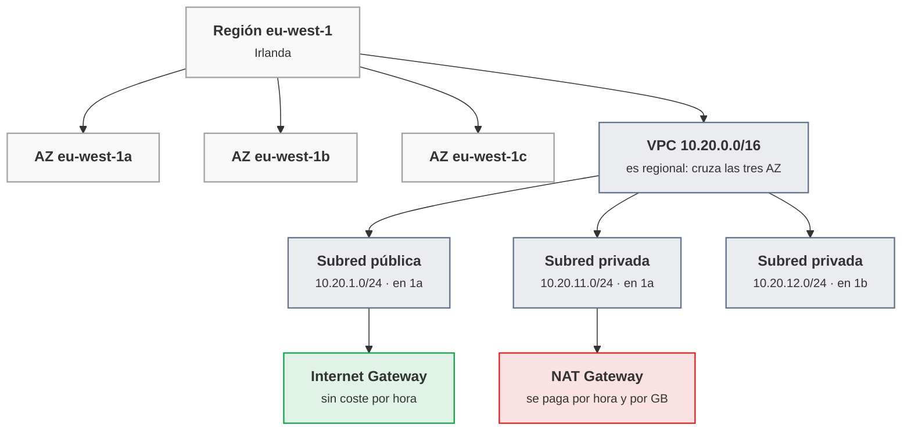
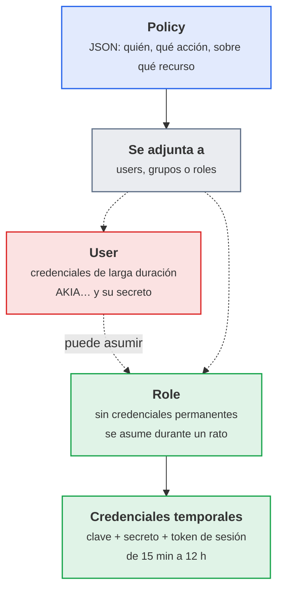
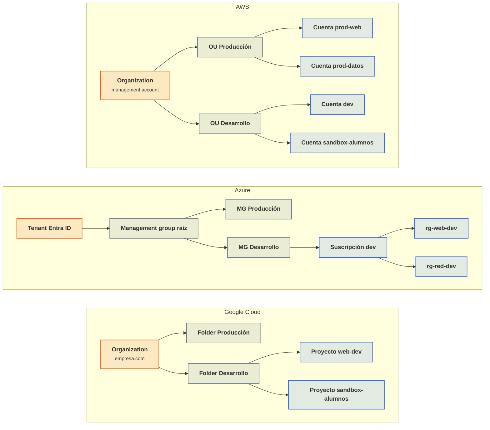
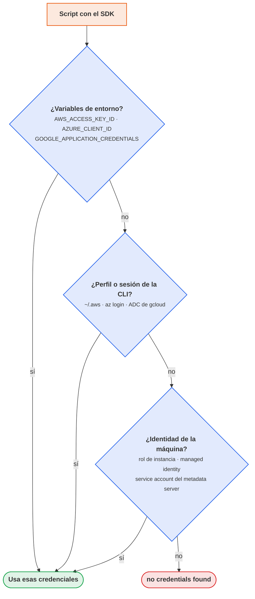

# UT4 · Nube pública: consola, CLI y SDK

<p class="ut-meta">12 h · Formación en empresa (19 abr a 9 jun 2027) · RA2 CE a, b, c, d, e</p>

Esta unidad no se cursa en el centro. Se hace en la empresa, durante el periodo de formación, y la plataforma la decide el tutor de empresa: puede ser AWS, Azure, Google Cloud o alguna alternativa europea (OVHcloud, Hetzner, Scaleway). Lo que sigue es la guía de referencia que conviene llevar leída el primer día y la lista de evidencias que hay que traer de vuelta. Hasta aquí, en las UT1 a UT3, todo se ha montado a mano sobre Proxmox: hipervisor, VPC con subredes, OPNsense, DMZ, proxy inverso. La nube pública es ese mismo diseño alquilado por horas y expuesto por API (una interfaz a la que un programa le pide por HTTP que cree o liste recursos). A la vuelta, en la UT5 (OpenTofu) y la UT6 (Jenkins), se automatiza sobre esa API lo que aquí se hace con la consola, la CLI (la herramienta de línea de comandos del proveedor) y el SDK (la librería para hacer lo mismo desde código), así que conviene salir de la empresa con perfiles de CLI funcionando y credenciales bien gestionadas.

## Introducción

Esta unidad se lee entera antes del primer día en la empresa y se vuelve a ella bloque a bloque: primero los conceptos que hacen falta para entender lo que se va a ver, y después cinco bloques de trabajo, uno por criterio de evaluación, cada uno con la teoría que necesita seguida de su hoja de actividad.

### Qué tienes que saber hacer al terminar

- Entrar en la consola del proveedor con un usuario con permisos limitados y MFA, e identificar en qué cuenta, suscripción o proyecto y en qué región se trabaja (CE 2a).
- Ajustar la interfaz: idioma, región por defecto, favoritos, unidades de coste y una alerta de presupuesto (CE 2b).
- Instalar la CLI del proveedor en local, en una VM o en el shell integrado, autenticarse sin claves de larga duración y comprobar la identidad (CE 2c).
- Crear, listar, cambiar y borrar perfiles o configuraciones de la CLI; entender qué ficheros hay debajo y qué variables de entorno los sobrescriben (CE 2d).
- Instalar la librería cliente en Python o Node con el gestor de dependencias del proyecto y escribir un script que liste redes y máquinas reutilizando las credenciales de la CLI (CE 2e).
- Explicar por escrito cómo está organizada la nube de la empresa y en qué se diferencia de la VPC del centro.

### Los conceptos de la unidad

El primer día en la empresa el tutor entrega un usuario de la consola de AWS y pide la lista de máquinas de desarrollo. Se entra, aparece un panel con doscientos servicios y ninguna máquina: la sesión está abierta en la región de Virginia y la empresa trabaja en Irlanda. Cuando por fin aparecen, los nombres y las IP se copian a mano, y a media tarde el tutor pregunta si está activado el segundo factor, sin el cual no se puede trabajar. En el centro esto era `qm list`. Lo que se busca cabe en una frase: entrar en la nube de la empresa con la identidad correcta, sacar esa lista con un comando o con diez líneas de código, y no dejar atrás ni una clave suelta ni una máquina que cueste dinero.

| Herramienta o concepto | Qué es, en una frase | Para qué se usa en esta unidad |
|---|---|---|
| Consola web y Cloud Shell | La página desde la que se administra la nube, y el terminal que lleva dentro con la CLI instalada | Ajustar idioma, región y favoritos, y empezar sin instalar nada |
| CLI (`aws`, `az`, `gcloud`) | El programa de línea de comandos del proveedor, como `qm` en Proxmox | Listar redes y máquinas, comprobar con qué identidad se trabaja y cambiar de entorno |
| Perfiles y variables de entorno | Un conjunto con nombre (cuenta, región, credenciales) que usa la CLI, y las variables que lo anulan | Tener uno por entorno y saltar entre ellos sin reconfigurar |
| SDK (`boto3`, `azure-mgmt-*`, `google-cloud-*`) | La librería que hace desde Python o Node las mismas llamadas que la CLI | Un script que liste la red y las máquinas sin ninguna clave dentro |
| Gestor de dependencias (`pip` con `venv`, `npm`) | La herramienta que instala librerías y apunta cuáles en un fichero | Que otra persona instale lo mismo desde `requirements.txt` o `package.json` |
| Identidad y permisos (IAM, Entra ID, roles) | El sistema que dice quién es cada uno y qué puede tocar, mucho más fino que en Proxmox | Entender por qué se ven unas cosas y otras no |
| MFA y SSO | El segundo factor al entrar, y el inicio de sesión único con la identidad de la empresa | Entrar sin claves de larga duración, que es lo que se evalúa |
| Región y zona de disponibilidad | La ciudad donde vive un recurso, y el centro de datos concreto dentro de ella | No perder las máquinas por mirar en la región equivocada |
| Cuenta, suscripción o proyecto | La caja que aísla recursos y factura, con nombre distinto en cada proveedor | Anotar su identificador el primer día: todo gira alrededor de él |
| Etiquetas y presupuesto | Pares nombre/valor pegados a cada recurso, y una alarma cuando el gasto pasa de una cifra | Saber qué recursos son propios y conocer el gasto antes de la factura |
| JSON, JMESPath y `jq` | El formato en que responde la nube, y dos maneras de filtrarlo por columnas | Convertir varias pantallas de salida en una tabla legible |
| gitleaks | Un escáner que busca claves y contraseñas en un repositorio Git | Comprobar que el script no lleva credenciales antes de subirlo |

Cómo está organizada la unidad: no hay sesiones en el centro, así que la unidad sigue los cinco bloques de trabajo en el orden de los criterios de evaluación, y cada bloque trae primero la teoría que necesita y después su hoja de actividad. En el bloque 1 se entra en la consola con MFA y se pone nombre a lo que hay: regiones, cuenta o proyecto, identidad y etiquetas. En el bloque 2 se deja la consola configurada junto con una alerta de presupuesto, y aparece el shell integrado. En los bloques 3 y 4 se instala la CLI, se hace la autenticación sin claves permanentes y se montan dos perfiles entre los que se salta con el mecanismo nativo y con variables de entorno. En el bloque 5 el script con el SDK reutiliza esas credenciales sin llevar ninguna dentro, y la actividad de cierre lo recoge todo en un documento que compara la nube de la empresa con la VPC del centro.

!!! otra "Dónde se usa esto en la otra asignatura"
    En estas mismas semanas (19 de abril a 9 de junio) se cursan en la empresa las dos unidades de 5169 que también se hacen allí:
    la UT5, Explotación de logs, accesos y rendimiento ([https://victor-educ.github.io/apuntes-5169/ut/ut5-logs-accesos-rendimiento/](https://victor-educ.github.io/apuntes-5169/ut/ut5-logs-accesos-rendimiento/)),
    y la UT6, Copias de seguridad y restauración ([https://victor-educ.github.io/apuntes-5169/ut/ut6-copias-seguridad/](https://victor-educ.github.io/apuntes-5169/ut/ut6-copias-seguridad/)).
    La nube de la empresa que aquí se recorre con la consola, la CLI y el SDK es donde en 5169 se revisan los logs y los accesos
    de un servicio real y se comprueban sus copias, así que conviene acordar con el tutor un único sistema para las dos asignaturas:
    la identidad con MFA y los perfiles de CLI de la A4.3 son los que dan acceso a las máquinas de 5169, y el
    almacenamiento de objetos de la tabla de correspondencias es el destino habitual de las copias de la UT6.

### Plan de trabajo

Las actividades no tienen sesión asignada: se hacen en la empresa durante la formación, en el orden que marque el tutor, y cada una se documenta en la [ficha de evidencias](#ficha-de-evidencias), que el tutor de empresa firma y con la que evalúa el profesor. Las capturas van sin datos sensibles: se tapan los números de cuenta completos, las claves, las IP públicas de producción y los correos de terceros.

| Bloque | CE | Qué se hace | Evidencia |
|---|---|---|---|
| [Bloque 1 · Acceso a la plataforma](#bloque-1-acceso-a-la-plataforma-ce-2a) | 2a | Entrar con MFA e identificar cuenta, región y política de etiquetas | Captura de la consola y párrafo con identificador, región y etiquetas (A4.1) |
| [Bloque 2 · Configuración de la interfaz](#bloque-2-configuracion-de-la-interfaz-ce-2b) | 2b | Idioma, región, favoritos, moneda y alerta de presupuesto | Capturas de las preferencias y del presupuesto (A4.2) |
| [Bloque 3 · Instalación de la CLI](#bloque-3-instalacion-de-la-cli-ce-2c) | 2c | Instalar la CLI, autenticarse sin claves permanentes y comprobar la identidad | Salidas de versión e identidad en texto (A4.3) |
| [Bloque 4 · Gestión de perfiles](#bloque-4-gestion-de-perfiles-ce-2d) | 2d | Dos perfiles, cambio nativo y por variable de entorno, ficheros que hay debajo | Comandos, ficheros de configuración y tabla de redes por perfil (A4.4) |
| [Bloque 5 · SDK](#bloque-5-sdk-ce-2e) | 2e | Script con el SDK sin credenciales, con dos perfiles y gitleaks limpio | Script, fichero de dependencias, salidas y gitleaks (A4.5) |
| [Actividad de cierre](#actividad-de-cierre) | todos | Documento de dos páginas: la nube de la empresa frente a la VPC del centro | PDF en la carpeta de evidencias |
| [Práctica evaluable](#practica-evaluable) | todos | Conjunto de las evidencias, con los pesos de cada criterio | Ficha de evidencias firmada |

## Bloque 1 · Acceso a la plataforma (CE 2a)

<p class="ut-meta">En la empresa · con el tutor</p>

Al acabar este bloque se entra en la consola de la empresa con un usuario propio y el segundo factor activo, y se sabe decir en qué cuenta, suscripción o proyecto se trabaja, en qué región y qué etiquetas son obligatorias. La hoja A4.1 se apoya en el mapa de la nube pública (regiones y correspondencia con Proxmox, que vuelve a usarse en la actividad de cierre), la identidad y la estructura de cuentas, y el apartado de etiquetado.

### Qué es una nube pública y qué te alquila

Este apartado pone nombre a lo que hay en la empresa y lo relaciona con lo ya construido en Proxmox, porque cada proveedor llama distinto a las mismas piezas y sin ese mapa la consola parece un catálogo sin orden.

Un proveedor de nube pública alquila por horas (en muchos servicios por segundos) la infraestructura construida en las UT1 a UT3: máquinas virtuales, redes privadas, discos, balanceadores, DNS, bases de datos y decenas de servicios gestionados que en el centro no hay (colas, almacenamiento de objetos, funciones sin servidor). Se paga por uso, se crea y se destruye por API, y todo lo que se puede hacer desde la consola web se puede hacer desde la línea de comandos o desde código. La consola es para mirar y para el primer día; la CLI y el SDK son con lo que se trabaja.

#### Regiones y zonas de disponibilidad

Una región es un conjunto de centros de datos en una zona geográfica, con nombre propio y catálogo de precios propio. Dentro de cada región hay varias zonas de disponibilidad (AZ), que son centros de datos físicamente separados (a kilómetros de distancia, con alimentación y red independientes) pero unidos por enlaces de baja latencia. Un desastre en una AZ no debería afectar a las otras de la misma región; un desastre regional sí afecta a todas.

| Proveedor | Región | Dónde está | Notas |
|---|---|---|---|
| AWS | `eu-west-1` | Irlanda (Dublín) | La región europea más antigua y con más servicios. Tres AZ: `eu-west-1a`, `1b`, `1c`. |
| AWS | `eu-south-2` | España (Aragón) | Abierta en 2022. Útil por latencia y residencia de datos; algunos servicios llegan más tarde que a Irlanda. |
| AWS | `eu-central-1` | Alemania (Fráncfort) | Muy usada por empresas con requisitos de datos en la UE. |
| Azure | `westeurope` | Países Bajos | La región europea con más servicios de Azure. |
| Azure | `spaincentral` | Madrid | Abierta en 2024. |
| Google Cloud | `europe-southwest1` | Madrid | Zonas `europe-southwest1-a`, `-b`, `-c`. |
| Google Cloud | `europe-west1` | Bélgica | Región europea clásica de GCP. |

Dos consecuencias prácticas. La primera: casi todos los recursos son regionales. Una VPC de AWS vive en una región; una subred vive en una AZ concreta dentro de esa VPC. Si la consola se abre en `us-east-1` no aparece nada de lo creado en `eu-west-1`. La segunda: los precios varían por región, a veces un 10 o un 20 %, y el tráfico entre regiones se paga. La región se elige por cercanía a los usuarios, por disponibilidad de los servicios necesarios y por dónde tiene que residir el dato, y se fija como región por defecto desde el primer día.



<p class="pie" markdown>La subred vive en una zona; la VPC, en la región entera. En rojo lo que sigue cobrando aunque no pase tráfico.</p>

La traducción a lo hecho en la UT2 es directa: la VPC es el bridge con su rango, la subred pública es la DMZ, las subredes privadas son las redes internas, el Internet Gateway es la interfaz WAN de OPNsense y el NAT Gateway es la regla de NAT de salida. La diferencia es que en la nube cada una de esas piezas tiene precio, y el NAT Gateway en particular tiene un precio que sorprende.

#### Correspondencia con lo que ya sabes

| Concepto del curso (Proxmox) | AWS | Azure | Google Cloud |
|---|---|---|---|
| Hipervisor / VM | EC2 (instancia) | Virtual Machines | Compute Engine |
| Plantilla de VM / cloud-init | AMI (imagen de máquina) + user data | Imagen + custom data | Imagen + startup script / metadata |
| Disco de la VM | EBS (volumen) | Managed Disk | Persistent Disk |
| Snapshot / backup | EBS Snapshot, AWS Backup | Snapshot, Azure Backup | Snapshot |
| Bridge / VPC | VPC | Virtual Network (VNet) | VPC (global, subredes regionales) |
| Subred / zona | Subnet en una AZ | Subnet (la VNet abarca la región) | Subnet regional |
| OPNsense: reglas por interfaz | Security Groups (por instancia, con estado) y NACL (listas de control de acceso de red, por subred, sin estado) | Network Security Groups (con estado) | Firewall rules (a nivel de VPC, con etiquetas de red) |
| OPNsense: NAT de salida | NAT Gateway | NAT Gateway | Cloud NAT |
| OPNsense: WAN | Internet Gateway + Elastic IP | Public IP | External IP |
| Proxy inverso / balanceador | ALB (balanceador de aplicación) y NLB (balanceador de red) | Application Gateway, Load Balancer | Cloud Load Balancing |
| DNS interno | Route 53 (zonas privadas) | Azure DNS (zonas privadas) | Cloud DNS |
| Usuarios y permisos | IAM (users, roles, policies) e IAM Identity Center | Entra ID + RBAC | IAM + service accounts |
| Estructura de cuentas | Organizations: root, OUs, cuentas | Management groups, suscripciones, resource groups | Organization, folders, proyectos |
| Consola integrada | CloudShell | Azure Cloud Shell | Cloud Shell |
| CLI | `aws` | `az` | `gcloud` |
| SDK Python | `boto3` | `azure-identity`, `azure-mgmt-*` | `google-cloud-*` |
| SDK Node | `@aws-sdk/client-*` | `@azure/identity`, `@azure/arm-*` | `@google-cloud/*` |
| Contenedores gestionados | ECS (con Fargate), EKS | Container Apps, AKS | Cloud Run, GKE |
| Registro de imágenes | ECR | Azure Container Registry | Artifact Registry |
| Almacenamiento de objetos | S3 | Blob Storage | Cloud Storage |
| Monitorización (UT7) | CloudWatch | Azure Monitor | Cloud Monitoring |

La fila de contenedores gestionados es solo un mapa: en este módulo no se despliega nada en ECS, AKS ni Cloud Run, pero conviene saber que ECS/Container Apps/Cloud Run son la opción "dame un contenedor y olvídate del clúster" y que EKS/AKS/GKE son Kubernetes gestionado (el plano de control lo lleva el proveedor, los nodos siguen siendo VM propias o gestionadas).

### Identidad y estructura de cuentas

Este apartado explica con qué identidad se entra en la nube de la empresa, qué permisos tiene y dentro de qué cuenta, suscripción o proyecto vive. Casi todos los errores de los apartados siguientes ("no veo nada", "acceso denegado", "soy otra persona") se explican por uno de esos tres conceptos, y la A4.1 pide identificarlos por escrito.

#### El usuario raíz y por qué no lo vas a ver

Toda cuenta de nube nace con una identidad todopoderosa: el usuario raíz en AWS (el correo con el que se creó la cuenta), el administrador global del tenant en Entra ID (el directorio de identidades de la empresa en Azure), el propietario de la organización en GCP. Esa identidad puede cerrar la cuenta, cambiar la tarjeta de pago y borrar cualquier cosa sin que ninguna política se lo impida. Ninguna empresa seria la usa a diario: tiene MFA (autenticación multifactor, un segundo paso además de la contraseña) con llave física, la contraseña está en una caja fuerte y se registra cada uso. Lo habitual es recibir un usuario o una identidad federada con permisos limitados.

#### Usuarios, roles y políticas

Los tres proveedores resuelven lo mismo con tres piezas: identidades de persona con credenciales de larga duración, identidades sin credenciales permanentes que se asumen durante un rato y devuelven credenciales temporales, y documentos que dicen quién puede hacer qué sobre qué recurso. El ejemplo va con nombres de AWS, que es el más extendido; en las otras dos pestañas del final del apartado están los equivalentes.

IAM (Identity and Access Management) es el servicio de AWS que decide quién puede hacer qué, y en él hay tres piezas. Los *users* son identidades con credenciales de larga duración (contraseña de consola y, opcionalmente, un par de claves de acceso `AKIA...` / secreto). Los *roles* son identidades sin credenciales permanentes que se *asumen* durante un rato: una instancia EC2 asume un rol para leer de S3, una persona asume un rol de administrador en otra cuenta, Jenkins asume un rol para desplegar. Al asumir un rol se reciben credenciales temporales (clave, secreto y token de sesión) con una vida de entre 15 minutos y 12 horas. Las *policies* son documentos JSON que dicen quién puede hacer qué sobre qué recurso, y se adjuntan a users, a grupos o a roles.



<p class="pie" markdown>La diferencia que importa: el *user* lleva una llave que caduca cuando alguien se acuerda; el *role* entrega llaves que caducan solas.</p>


Una política mínima para alguien que solo necesita mirar la red y las instancias en Irlanda tiene esta pinta:

```json
{
  "Version": "2012-10-17",
  "Statement": [
    {
      "Sid": "SoloLecturaRedYComputo",
      "Effect": "Allow",
      "Action": [
        "ec2:DescribeVpcs",
        "ec2:DescribeSubnets",
        "ec2:DescribeSecurityGroups",
        "ec2:DescribeInstances",
        "ec2:DescribeRegions"
      ],
      "Resource": "*",
      "Condition": {
        "StringEquals": { "aws:RequestedRegion": "eu-west-1" }
      }
    }
  ]
}
```

Conviene fijarse en tres detalles, porque explican la mayoría de los accesos denegados que aparecen en las actividades siguientes: el efecto por defecto es denegar (todo lo que no está en un `Allow` explícito está prohibido, y un `Deny` explícito gana siempre), las acciones se nombran como `servicio:Operación` con el mismo nombre que usa la CLI (`aws ec2 describe-vpcs` es `ec2:DescribeVpcs`), y la condición limita la región. Las políticas gestionadas por AWS como `ReadOnlyAccess` o `AdministratorAccess` sirven para empezar; en producción se escriben políticas propias con el mínimo necesario.

Cada proveedor le pone otro nombre a esas piezas y las organiza a su manera:

=== "AWS"

    Los *users* llevan credenciales de larga duración, los *roles* se asumen y devuelven credenciales temporales, y las *policies* son los documentos JSON de arriba, adjuntos a users, a grupos o a roles. La estructura de cuentas la gestiona Organizations.

    Lo que hoy usan las empresas para las personas no son users con clave, sino IAM Identity Center (el antiguo AWS SSO, inicio de sesión único): se entra con la identidad corporativa (Entra ID, Google Workspace, Okta) y se reciben credenciales temporales para cada cuenta y conjunto de permisos. Es lo que `aws configure sso` configura en la máquina local.

=== "Azure"

    Azure separa dos mundos. Entra ID (antes Azure Active Directory) es el directorio: usuarios, grupos, aplicaciones, MFA, acceso condicional. Azure RBAC (control de acceso basado en roles) es la autorización sobre los recursos: una *asignación de rol* une una identidad (usuario, grupo, service principal, que es la identidad de una aplicación, o identidad administrada), un rol (`Reader`, `Contributor`, `Owner`, `Network Contributor`, o uno personalizado) y un ámbito (management group, suscripción, resource group o recurso concreto). Los permisos se heredan hacia abajo: `Reader` en la suscripción permite ver todos los resource groups de esa suscripción. El equivalente al rol de AWS para máquinas y servicios es la identidad administrada (managed identity): una VM o una Container App recibe una identidad sin secretos que puede acceder a Key Vault (el almacén de secretos) o a Storage (el de ficheros).

=== "Google Cloud"

    En GCP el IAM funciona por *bindings* entre un *principal* (usuario de Google Workspace, grupo, service account) y un *rol* sobre un recurso, con herencia desde la organización a las carpetas y de estas a los proyectos. Hay roles básicos (`Viewer`, `Editor`, `Owner`, demasiado anchos para producción), roles predefinidos por servicio (`roles/compute.viewer`, `roles/compute.networkViewer`) y roles personalizados. Las service accounts son identidades para cargas de trabajo; una VM de Compute Engine arranca con una service account adjunta y obtiene tokens del servidor de metadatos sin fichero de clave alguno. Las claves JSON de service account descargadas son el equivalente a las claves `AKIA` de AWS: un secreto de larga duración que hay que evitar.

#### MFA, SSO y credenciales temporales

Los tres proveedores empujan hacia el mismo esquema: la persona se autentica con MFA (una app de códigos TOTP como Google Authenticator, una llave física FIDO2 o una passkey del móvil) a través del proveedor de identidad de la empresa, y de ahí salen credenciales temporales para la consola y para la CLI. En la máquina de trabajo eso se traduce en tres comandos que no piden ninguna clave permanente:

```mermaid
flowchart LR
    P["<b>Persona</b>"]:::act
    MFA["<b>MFA</b><br><small>TOTP, llave FIDO2 o passkey</small>"]:::pieza
    IDP["<b>Proveedor de identidad</b><br><small>el de la empresa</small>"]:::pieza
    TMP["<b>Credenciales temporales</b><br><small>para la consola y para la CLI</small>"]:::ok
    NADA(["<b>Ninguna clave permanente<br>en el portátil</b>"]):::ok
    P --> MFA --> IDP --> TMP --> NADA
    classDef act fill:#ea580c22,stroke:#ea580c,stroke-width:1.5px
    classDef pieza fill:#64748b22,stroke:#64748b,stroke-width:1.5px
    classDef dato fill:#2563eb22,stroke:#2563eb,stroke-width:1.5px
    classDef infra fill:#a1a1aa14,stroke:#a1a1aa,stroke-width:1.5px
    classDef ok fill:#16a34a22,stroke:#16a34a,stroke-width:1.5px
    classDef riesgo fill:#dc262622,stroke:#dc2626,stroke-width:1.5px
```



<p class="pie" markdown>Es el esquema al que empujan los tres proveedores. Si en la empresa se entrega un `AKIA…` por correo, algo va mal.</p>


```bash
# AWS con IAM Identity Center: abre el navegador, te autenticas y guarda un token de sesión
aws configure sso          # solo la primera vez, crea el perfil
aws sso login --profile empresa-dev

# Azure: abre el navegador contra Entra ID; --use-device-code si estás en una VM sin navegador
az login
az login --use-device-code

# Google Cloud: dos logins distintos, uno para gcloud y otro para el SDK
gcloud auth login                       # identidad que usa la CLI
gcloud auth application-default login   # identidad que usan las librerías (ADC)
```

La distinción de GCP entre `gcloud auth login` y `gcloud auth application-default login` confunde a todo el mundo la primera vez: la primera guarda una credencial que usa `gcloud`, la segunda guarda un fichero en `~/.config/gcloud/application_default_credentials.json` que es lo que buscan las librerías cliente (las ADC, *Application Default Credentials*). Si un script de Python falla con "could not automatically determine credentials" es porque se ejecutó el primero y no el segundo.

!!! ojo "Claves de acceso de larga duración"
    Un par de claves de AWS (`AKIA...`) o una clave JSON de service account de GCP no caduca y no pide MFA. Si acaba en un repositorio público, en menos de una hora habrá alguien minando criptomoneda a cargo de la empresa (hay bots escaneando GitHub para eso). Si el tutor entrega una, conviene preguntar si de verdad no hay alternativa con SSO o roles, guardarla fuera del proyecto y borrarla al terminar. Nunca en un fichero del repositorio, nunca en una variable de entorno de un `Dockerfile`.

#### Cómo se organizan las cuentas

Ninguna empresa mediana trabaja con una sola cuenta. La unidad de aislamiento (facturación, límites, radio de explosión de un error) es la cuenta en AWS, la suscripción en Azure y el proyecto en GCP, y encima hay una jerarquía para agrupar y aplicar políticas:



<p class="pie" markdown>Los tres hacen lo mismo con nombres distintos: una raíz que factura, una capa de agrupación para aplicar políticas y una unidad aislada donde vive cada cosa.</p>

En AWS, Organizations permite aplicar políticas de control de servicio (*service control policies*) a una OU entera (unidad organizativa, una carpeta de cuentas): por ejemplo, "en la OU de desarrollo nadie puede crear recursos fuera de `eu-west-1` ni instancias mayores de `t3.large`" (un tamaño de VM de 2 vCPU y 8 GB). En Azure el equivalente son Azure Policy y los bloqueos de recurso, aplicados a un management group; el resource group es una capa más que agrupa recursos con el mismo ciclo de vida (al borrar el grupo se va todo lo que contiene, muy útil para limpiar prácticas). En GCP las políticas de organización se aplican a carpetas y proyectos. Lo más probable es recibir acceso a una cuenta, suscripción o proyecto de desarrollo o sandbox, y lo primero que hay que anotar es su identificador: el número de cuenta de 12 dígitos de AWS, el GUID de suscripción de Azure (un identificador de 32 caracteres hexadecimales separados por guiones) o el ID de proyecto de GCP. Todos los comandos y scripts de esta unidad giran alrededor de ese identificador.

### Etiquetado

Cada recurso creado lleva etiquetas (tags en AWS y Azure, labels en GCP): pares clave/valor que no cambian el comportamiento del recurso pero permiten filtrar, facturar por proyecto y saber a quién preguntar antes de borrar algo. El mínimo habitual es `proyecto`, `entorno` (dev, pre, prod), `propietario` (un correo) y a veces `coste` (centro de coste) y `caduca` (fecha). La empresa tendrá su convención y hay que seguirla al pie de la letra, porque muchas organizaciones tienen políticas que impiden crear recursos sin las etiquetas obligatorias, o scripts que borran de madrugada lo que no lleva `propietario`. Lo que se crea para practicar se etiqueta con algo reconocible (`propietario=alumno-fp`, `caduca=2027-06-09`) para que el tutor sepa qué puede borrar sin preguntar.

### A4.1 Acceso a la plataforma (CE 2a)

<span class="et et-obj">Objetivo</span> Entrar en la consola del proveedor con tu usuario y MFA activo, y saber decir en qué cuenta, suscripción o proyecto, en qué región y con qué política de etiquetas trabajas.

<span class="et et-pre">Antes de empezar</span>

- Autorización del tutor para usar la cuenta de la empresa y el usuario que te haya creado (nunca el usuario raíz ni una cuenta compartida).
- Un móvil o una llave física para el segundo factor (app TOTP o passkey; anota cuál admite la empresa).
- Leído [Identidad y estructura de cuentas](#identidad-y-estructura-de-cuentas), en particular [MFA, SSO y credenciales temporales](#mfa-sso-y-credenciales-temporales) y [Cómo se organizan las cuentas](#como-se-organizan-las-cuentas), y el apartado [Etiquetado](#etiquetado).

<span class="et et-pas">Pasos</span>

1. Recibe el usuario y entra por primera vez. Con SSO, la página de entrada es la del proveedor de identidad de la empresa, no la del proveedor de nube.
2. Activa MFA antes de hacer nada más: en AWS, menú de la cuenta > Security credentials > Multi-factor authentication (o en el portal de Identity Center si entras por SSO); en Azure, `https://mysignins.microsoft.com/security-info`; en GCP, la seguridad de la cuenta de Google. Cierra sesión y vuelve a entrar para comprobar que te lo pide.
3. Identifica la cuenta, suscripción o proyecto y copia su identificador: en AWS el menú de la cuenta muestra el número de 12 dígitos y el rol o usuario; en Azure, `Subscriptions` muestra el nombre y el GUID de la suscripción activa y el icono de usuario el tenant; en GCP, el selector de proyecto de arriba muestra el ID de proyecto.
4. Identifica la región de trabajo: en AWS es el selector de arriba a la derecha; en Azure y GCP pregunta al tutor en qué región crea la empresa sus recursos y comprueba que ahí hay máquinas o redes.
5. Localiza dónde se ve la jerarquía (Organizations, management groups, carpetas) aunque no tengas permiso para tocarla; si te da acceso denegado, la captura del mensaje también sirve.
6. Pregunta al tutor por la política de etiquetas (cuáles son obligatorias y con qué formato) y abre un recurso cualquiera para comprobar que las lleva.

<span class="et et-com">Comprobación</span> Al cerrar sesión y volver a entrar te pide el segundo factor, y eres capaz de decir de memoria cuenta, región y las etiquetas obligatorias.

<span class="et et-ent">Entrega</span> Captura de la consola con el usuario, la cuenta o proyecto y la región visibles, y un párrafo con el identificador (parcialmente tapado), la región y las etiquetas obligatorias. Todo va a la carpeta o el repositorio de evidencias, y la fila A4.1 de la [ficha de evidencias](#ficha-de-evidencias) la firma el tutor.

<span class="et et-ext">Si te sobra tiempo</span> Busca en la consola qué políticas o roles tiene asignados tu usuario: te servirá para explicar los `AccessDenied` de las actividades siguientes.

## Bloque 2 · Configuración de la interfaz (CE 2b)

<p class="ut-meta">En la empresa · con el tutor</p>

Al acabar este bloque la consola abre en la región de la empresa, en el idioma acordado con el tutor y con los servicios de trabajo en favoritos, y hay una alerta de presupuesto que avisa antes que la factura. La hoja A4.2 se apoya en el apartado de la consola y sus shells integrados, y en el de presupuestos y costes.

### Consola web y shells integrados

Este apartado cubre el primer día: dejar la consola configurada para no perderse y ver que dentro lleva un terminal con la CLI ya instalada y autenticada, con el que se puede empezar sin instalar nada en la máquina local.

La consola es una aplicación web con un panel por servicio. El primer día se ajusta lo que el CE 2b pide: el idioma (conviene dejarla en inglés, porque la documentación, los mensajes de error y los foros están en inglés y las traducciones de la consola cambian los nombres de los menús), la región por defecto (arriba a la derecha en AWS; en Azure y GCP se elige por recurso pero se puede fijar una por defecto en las preferencias), los favoritos (VPC, EC2, IAM, Billing en AWS; Virtual networks, Virtual machines, Cost Management en Azure; VPC network, Compute Engine, IAM, Billing en GCP), el tema y la moneda de las vistas de coste. Conviene anotar también cómo se llama la vista que identifica al usuario: en AWS el menú de la cuenta muestra el número de cuenta, el usuario o rol y el proveedor de identidad; en Azure, el icono de usuario muestra el tenant y `Subscriptions` la suscripción activa; en GCP, el selector de proyecto arriba.

Los tres tienen un terminal dentro de la consola:

- **AWS CloudShell**: un shell Linux con `aws`, `python3`, `git` y `docker` preinstalados, autenticado con la identidad con la que se abrió la consola y con 1 GB de directorio personal persistente por región. Gratis. Se abre desde el icono de terminal de la barra superior y es regional (al cambiar de región se cambia de CloudShell).
- **Azure Cloud Shell**: Bash o PowerShell con `az`, `terraform`, `kubectl` y muchas cosas más. La primera vez pide un storage account para el directorio personal (o una sesión efímera sin persistencia). Se abre desde el icono de terminal del portal o en `shell.azure.com`.
- **Google Cloud Shell**: una VM pequeña con `gcloud`, `kubectl`, `docker` y editores, 5 GB de directorio personal persistente y ya autenticada. Se abre desde el icono de terminal de la consola.

Para las actividades A4.3 y A4.4 el shell integrado vale y ahorra problemas de instalación, pero tiene un límite claro: las credenciales viven ahí dentro, así que para la A4.5 (SDK en el proyecto de la empresa) o para la UT5 hace falta la CLI en la máquina donde esté el código.

### Etiquetas y costes

En Proxmox una VM olvidada solo ocupa disco; en la nube cuesta dinero cada hora. Este apartado da las dos herramientas para no llevarse sustos: etiquetar todo lo que se cree para que se sepa de quién es y poner una alarma de gasto antes de crear el primer recurso.

#### Free tier, presupuestos y alertas

Los tres proveedores tienen algún tipo de nivel gratuito para cuentas nuevas, pero nada de eso aplica aquí: la cuenta de la empresa es una cuenta de pago, así que cada recurso creado tiene coste desde el minuto uno. Qué regala cada proveedor a una cuenta nueva está en [Para ampliar](../ampliacion.md#el-nivel-gratuito-de-las-cuentas-nuevas).

Antes de crear nada conviene configurar una alerta de presupuesto. En AWS es Billing > Budgets (un presupuesto mensual de, digamos, 20 € con aviso al 80 %); en Azure es Cost Management > Budgets sobre la suscripción o el resource group; en GCP es Facturación > Presupuestos y alertas. Y luego se mira la factura antes y después de cada práctica, en la vista por servicio y por etiqueta.

#### Los errores caros típicos

| Error | Por qué duele | Cómo se evita |
|---|---|---|
| NAT Gateway olvidado | Se cobra por hora aunque no pase tráfico (del orden de 30 a 35 € al mes en AWS) más cada GB procesado. Es la sorpresa más habitual en la factura de una VPC de pruebas. | Si solo hace falta salida a Internet desde una VM para instalar paquetes, sirve una IP pública temporal o una instancia NAT pequeña, y el gateway se destruye al terminar. |
| IP públicas reservadas | AWS cobra todas las IPv4 públicas por hora desde 2024 (unos 3,6 € al mes cada una); Azure y GCP cobran las IP estáticas reservadas que no están asociadas a nada. | Conviene liberar las Elastic IP (las IP públicas fijas de AWS) y las IP estáticas sin uso. La factura dice cuántas hay. |
| Snapshots y discos huérfanos | Al borrar una VM el disco puede quedarse (en AWS depende de `DeleteOnTermination`, en Azure el disco administrado sobrevive a la VM). Los snapshots se cobran por GB al mes para siempre. | Después de borrar, conviene listar los volúmenes y snapshots sin asociar y borrarlos. |
| Egress (tráfico saliente) | El tráfico que entra es gratis; el que sale a Internet o a otra región se paga por GB (AWS regala los primeros 100 GB al mes por cuenta). Descargar 500 GB de backups "para probar" se nota. | Los datos se mueven dentro de la misma región. Para pruebas, ficheros pequeños. |
| Instancias grandes "un momento" | Una máquina de 16 vCPU y 64 GB cuesta 20 o 30 veces más que una `t3.micro` y se olvida igual de fácil. | Se crea siempre el tamaño mínimo que sirva y se deja una alarma en el móvil para apagarla. |
| Balanceadores y bases de datos gestionadas | Se cobran por hora desde que se crean, con datos o sin ellos. | No se crean en esta unidad salvo que el tutor lo pida. |

!!! empresa "Regla de la empresa"
    Lo que se crea para practicar se destruye el mismo día. Antes de cerrar sesión se listan instancias, discos, IP, NAT y snapshots con la CLI y se compara con lo que había por la mañana. El coste se anota en la ficha de evidencias: es una evidencia tan válida como una captura.

### A4.2 Configuración de la interfaz (CE 2b)

<span class="et et-obj">Objetivo</span> Dejar la consola configurada para trabajar (idioma, región, favoritos, moneda) y tener una alerta de presupuesto que avise antes que la factura.

<span class="et et-pre">Antes de empezar</span>

- A4.1 hecha: entras con MFA y sabes en qué cuenta o suscripción estás.
- Autorización del tutor para crear un presupuesto sobre tu cuenta, suscripción o resource group; si no te lo puede dar, acuerda con él la etiqueta de propietario por la que vas a filtrar los costes.
- Leídos [Consola web y shells integrados](#consola-web-y-shells-integrados) y [Free tier, presupuestos y alertas](#free-tier-presupuestos-y-alertas).

<span class="et et-pas">Pasos</span>

1. Ajusta el idioma (en inglés salvo que la empresa trabaje en otro): en AWS, Settings del menú de la cuenta; en Azure, el engranaje del portal; en GCP, las preferencias de la cuenta.
2. Fija la región por defecto: en AWS, Settings > Default region; en Azure y GCP la región se elige por recurso, así que ponla como valor por defecto donde el portal lo permita.
3. Marca como favoritos los servicios de red, cómputo, identidad y facturación: VPC, EC2, IAM y Billing en AWS; Virtual networks, Virtual machines, Entra ID y Cost Management en Azure; VPC network, Compute Engine, IAM y Billing en GCP.
4. Ajusta la moneda de las vistas de coste (Billing preferences en AWS, Cost Management en Azure, la cuenta de facturación en GCP).
5. Crea la alerta de presupuesto: AWS, Billing > Budgets > Create budget, presupuesto mensual (por ejemplo 20 €) con aviso al 80 % a tu correo; Azure, Cost Management > Budgets sobre la suscripción o tu resource group; GCP, Facturación > Presupuestos y alertas. Si no tienes permiso, abre la vista de costes del mes en curso (Cost Explorer, Cost analysis o Informes) y fíltrala por tu etiqueta de propietario.
6. Anota el coste del mes hasta hoy: lo compararás al terminar cada actividad.

<span class="et et-com">Comprobación</span> Al entrar la consola abre en la región de la empresa, los favoritos aparecen en la barra y el presupuesto figura en la lista de presupuestos con el umbral del 80 % (o la consulta de costes filtrada por tu etiqueta devuelve resultados).

<span class="et et-ent">Entrega</span> Capturas de las preferencias y de la alerta de presupuesto (o de la consulta de costes), sin datos sensibles, en la carpeta de evidencias. Fila A4.2 de la ficha.

<span class="et et-ext">Si te sobra tiempo</span> Abre el shell integrado y lanza `aws sts get-caller-identity`, `az account show` o `gcloud auth list`: ya está autenticado con la identidad de la consola.

## Bloque 3 · Instalación de la CLI (CE 2c)

<p class="ut-meta">En la empresa · con el tutor</p>

Al acabar este bloque la CLI del proveedor está instalada donde diga la empresa, autenticada sin claves de larga duración y con la identidad comprobada con un comando. La hoja A4.3 se apoya en la introducción a la CLI, la instalación y el apartado de autenticación.

### La CLI a fondo

Aquí está el grueso de la unidad: instalar la CLI, autenticarse sin claves permanentes, comprobar la identidad, guardar un perfil por entorno y filtrar las respuestas. Es lo que evalúan los CE 2c y 2d, y lo que la UT5 (OpenTofu) da por hecho a la vuelta al centro.

Las tres CLI siguen el mismo patrón: `herramienta servicio recurso verbo --opciones` (`aws ec2 describe-vpcs`, `az network vnet list`, `gcloud compute networks list`). Las tres guardan la configuración en el directorio personal, aceptan variables de entorno que la sobrescriben y devuelven JSON que se puede filtrar. Lo que cambia es la ortografía.

#### Instalación

=== "AWS"

    La CLI v2 se distribuye como binario, no por `pip`. En Linux x86_64:

    ```bash
    curl "https://awscli.amazonaws.com/awscli-exe-linux-x86_64.zip" -o awscliv2.zip
    unzip awscliv2.zip
    sudo ./aws/install
    aws --version        # aws-cli/2.x.y Python/3.x ...
    ```

    En macOS hay un `.pkg` y en Windows un `.msi`; en ARM (Raspberry, Mac con Apple Silicon bajo Linux) el zip es `awscli-exe-linux-aarch64.zip`. Para actualizar se repite con `sudo ./aws/install --update`. Documentación: <https://docs.aws.amazon.com/cli/latest/userguide/getting-started-install.html>.

=== "Azure"

    En Debian y Ubuntu, el script oficial añade el repositorio de Microsoft e instala el paquete `azure-cli`:

    ```bash
    curl -sL https://aka.ms/InstallAzureCLIDeb | sudo bash
    az version
    ```

    Si se prefiere no ejecutar un script con `sudo` sin leerlo (buena costumbre), la misma página documenta los pasos manuales: clave GPG, fichero en `/etc/apt/sources.list.d/`, `apt install azure-cli`. Documentación: <https://learn.microsoft.com/cli/azure/install-azure-cli-linux>.

=== "Google Cloud"

    En Debian y Ubuntu se añade el repositorio de Google y se instala `google-cloud-cli`:

    ```bash
    sudo apt-get install -y apt-transport-https ca-certificates gnupg curl
    curl https://packages.cloud.google.com/apt/doc/apt-key.gpg | sudo gpg --dearmor -o /usr/share/keyrings/cloud.google.gpg
    echo "deb [signed-by=/usr/share/keyrings/cloud.google.gpg] https://packages.cloud.google.com/apt cloud-sdk main" | sudo tee /etc/apt/sources.list.d/google-cloud-sdk.list
    sudo apt-get update && sudo apt-get install -y google-cloud-cli
    gcloud version
    ```

    Hay componentes opcionales (`gcloud components list`): `kubectl`, el emulador de Pub/Sub, etc. Con la instalación por `apt` los componentes se instalan también por `apt` (`google-cloud-cli-gke-gcloud-auth-plugin`, por ejemplo). Documentación: <https://cloud.google.com/sdk/docs/install>.

#### Autenticación y "quién soy"

El primer comando que se ejecuta después de autenticarse, y el que pide la evidencia de la A4.3, es el que dice con qué identidad se está hablando con la API. Si la salida no es la esperada, todo lo que venga después irá al sitio equivocado.

=== "AWS"

    ```bash
    aws configure sso
    # SSO session name: empresa
    # SSO start URL: https://empresa.awsapps.com/start
    # SSO region: eu-west-1
    # ... elige cuenta y permission set, región por defecto eu-west-1, formato json, nombre de perfil empresa-dev

    aws sso login --profile empresa-dev
    aws sts get-caller-identity --profile empresa-dev
    ```

    ```json
    {
        "UserId": "AROAEXAMPLEID:alumno@empresa.com",
        "Account": "123456789012",
        "Arn": "arn:aws:sts::123456789012:assumed-role/AWSReservedSSO_DevReadOnly_abc123/alumno@empresa.com"
    }
    ```

    El `Arn` indica que se está usando un rol asumido vía SSO (`AWSReservedSSO_...`) y no un user con claves. Si la empresa entrega claves de acceso en lugar de SSO, `aws configure --profile empresa-dev` las pide y las guarda en `~/.aws/credentials`.

=== "Azure"

    ```bash
    az login                      # abre el navegador
    az account show               # tenant y suscripción activa
    az account list -o table      # todas las suscripciones a las que tienes acceso
    az account set --subscription "Desarrollo"
    az ad signed-in-user show --query "{nombre:displayName, upn:userPrincipalName}"
    ```

    `az account show` devuelve el `id` de la suscripción (el GUID), el `tenantId` y el usuario. Si hay acceso a varias suscripciones, `az login` pide elegir una y el resto de comandos van contra la que esté activa; cambiarla es `az account set`.

=== "Google Cloud"

    ```bash
    gcloud init                   # asistente: cuenta, proyecto, región y zona por defecto
    gcloud auth list              # cuentas autenticadas y cuál está activa
    gcloud config list            # proyecto, región, zona de la configuración activa
    gcloud config set project sandbox-alumnos-2027
    gcloud auth application-default login   # para el SDK
    ```

    `gcloud auth list` marca con un asterisco la cuenta activa. `gcloud config list` muestra la configuración activa (proyecto, cuenta, región y zona por defecto).

### A4.3 Instalación de la CLI (CE 2c)

<span class="et et-obj">Objetivo</span> Tener la CLI del proveedor instalada donde diga la empresa, autenticada sin claves de larga duración y con la identidad comprobada.

<span class="et et-pre">Antes de empezar</span>

- Autorización del tutor sobre dónde instalarla (tu portátil, una VM de la empresa o el shell integrado) y sobre el mecanismo de autenticación que usa la empresa (SSO, `az login`, `gcloud auth login`). Si el tutor te ofrece un par de claves de acceso, pregunta antes si hay alternativa con SSO o roles.
- Permisos de administrador en la máquina donde instales.
- Leídos [Instalación](#instalacion) y [Autenticación y "quién soy"](#autenticacion-y-quien-soy).

<span class="et et-pas">Pasos</span>

1. Instala la CLI con el instalador oficial (no `apt install awscli`, que instala la v1 sin soporte de SSO):

    === "AWS"

        ```bash
        curl "https://awscli.amazonaws.com/awscli-exe-linux-x86_64.zip" -o awscliv2.zip
        unzip awscliv2.zip
        sudo ./aws/install
        aws --version
        ```

    === "Azure"

        ```bash
        curl -sL https://aka.ms/InstallAzureCLIDeb | sudo bash
        az version
        ```

    === "Google Cloud"

        ```bash
        sudo apt-get install -y apt-transport-https ca-certificates gnupg curl
        curl https://packages.cloud.google.com/apt/doc/apt-key.gpg | sudo gpg --dearmor -o /usr/share/keyrings/cloud.google.gpg
        echo "deb [signed-by=/usr/share/keyrings/cloud.google.gpg] https://packages.cloud.google.com/apt cloud-sdk main" | sudo tee /etc/apt/sources.list.d/google-cloud-sdk.list
        sudo apt-get update && sudo apt-get install -y google-cloud-cli
        gcloud version
        ```

    Si trabajas en el shell integrado, salta este paso y ejecuta solo el comando de versión.

2. Inicialízala y autentícate con el mecanismo de la empresa:

    === "AWS"

        ```bash
        aws configure sso          # SSO session name, start URL, región eu-west-1, perfil empresa-dev
        aws sso login --profile empresa-dev
        ```

    === "Azure"

        ```bash
        az login                   # o az login --use-device-code en una VM sin navegador
        az account set --subscription "<nombre o GUID de la suscripción>"
        ```

    === "Google Cloud"

        ```bash
        gcloud init                # cuenta, proyecto, región y zona por defecto
        ```

3. Comprueba la identidad con la que hablas con la API:

    === "AWS"

        ```bash
        aws sts get-caller-identity --profile empresa-dev
        ```

    === "Azure"

        ```bash
        az account show
        az ad signed-in-user show --query "{nombre:displayName, upn:userPrincipalName}"
        ```

    === "Google Cloud"

        ```bash
        gcloud auth list
        gcloud config list
        ```

4. Escribe un comentario de una línea sobre qué tipo de credencial es: en AWS, un `Arn` con `assumed-role/AWSReservedSSO_...` es un rol asumido por SSO y uno con `user/` es un usuario con claves; en Azure, el `user.type` de `az account show`; en GCP, la cuenta con asterisco en `gcloud auth list`.
5. Lanza un comando de lectura para ver que tienes permisos: `aws ec2 describe-vpcs`, `az network vnet list -o table` o `gcloud compute networks list`.

<span class="et et-com">Comprobación</span> El comando de versión devuelve una versión reciente (AWS 2.x), el de identidad devuelve tu usuario o rol en la cuenta de la empresa, y el listado de redes devuelve algo o un `AccessDenied` que sabes explicar.

<span class="et et-ent">Entrega</span> Salida de `aws --version` y `aws sts get-caller-identity`, o `az version` y `az account show`, o `gcloud version` y `gcloud auth list`, en texto (no captura), con el comentario de una línea sobre el tipo de credencial. Fila A4.3 de la ficha.

<span class="et et-ext">Si te sobra tiempo</span> Mira qué ha dejado la autenticación en `~/.aws`, `~/.azure` o `~/.config/gcloud` y comprueba que no hay ningún fichero con una clave permanente.

## Bloque 4 · Gestión de perfiles (CE 2d)

<p class="ut-meta">En la empresa · con el tutor</p>

Al acabar este bloque hay dos perfiles o configuraciones que apuntan a entornos distintos, se salta entre ellos con el mecanismo nativo y con la variable de entorno, y se sabe qué ficheros hay debajo. La hoja A4.4 se apoya en los apartados de perfiles y de formatos de salida, que es lo que convierte varias pantallas de JSON en una tabla.

### Perfiles y ficheros de configuración

Aquí está el núcleo del CE 2d. Un perfil (AWS), una suscripción activa más la configuración de `az` (Azure) o una *configuration* (GCP) agrupan región, proyecto y credenciales, y lo normal es tener uno por entorno: `empresa-dev`, `empresa-pre`, o uno por región cuando se trabaja en dos.

=== "AWS"

    Dos ficheros. `~/.aws/config` guarda todo lo que no es secreto (región, formato de salida, sesiones SSO, roles a asumir) y `~/.aws/credentials` guarda claves de acceso si las hay. Con SSO el segundo no existe y el token temporal se cachea en `~/.aws/sso/cache/`.

    ```ini
    # ~/.aws/config
    [sso-session empresa]
    sso_start_url = https://empresa.awsapps.com/start
    sso_region = eu-west-1
    sso_registration_scopes = sso:account:access

    [profile empresa-dev]
    sso_session = empresa
    sso_account_id = 123456789012
    sso_role_name = DevReadOnly
    region = eu-west-1
    output = json

    [profile empresa-pre]
    sso_session = empresa
    sso_account_id = 210987654321
    sso_role_name = PreReadOnly
    region = eu-south-2
    output = table

    [profile empresa-admin]
    role_arn = arn:aws:iam::123456789012:role/Admin
    source_profile = empresa-dev
    ```

    El tercer perfil muestra otro mecanismo: `role_arn` con `source_profile` hace que la CLI asuma un rol automáticamente usando las credenciales de otro perfil. Es la forma habitual de saltar entre cuentas.

    ```bash
    aws configure list-profiles
    aws configure list --profile empresa-pre       # de dónde sale cada valor
    aws ec2 describe-vpcs --profile empresa-dev --output table
    aws ec2 describe-vpcs --profile empresa-pre
    export AWS_PROFILE=empresa-dev                 # y ya no hace falta --profile
    aws configure set region eu-west-1 --profile empresa-dev
    ```

    Borrar un perfil es editar el fichero a mano; no hay subcomando. Variables de entorno que mandan sobre los ficheros: `AWS_PROFILE`, `AWS_REGION` (y la antigua `AWS_DEFAULT_REGION`), `AWS_ACCESS_KEY_ID`, `AWS_SECRET_ACCESS_KEY`, `AWS_SESSION_TOKEN`, `AWS_CONFIG_FILE`. Una `AWS_ACCESS_KEY_ID` exportada en el shell y olvidada gana sobre cualquier perfil, y ese es un clásico de "por qué me dice que soy otro".

=== "Azure"

    `az` guarda todo en `~/.azure/`: `azureProfile.json` con las suscripciones y cuál está activa, el caché de tokens de la librería de autenticación de Microsoft y `config` (formato INI) con las opciones por defecto. El concepto de "perfil" se reparte entre la suscripción activa y esa configuración:

    ```bash
    az account list -o table                       # suscripciones disponibles
    az account set --subscription "Desarrollo"     # cambia el contexto
    az account show --query "{sub:name, id:id, tenant:tenantId}" -o table

    az config set core.output=table               # formato por defecto
    az config set defaults.location=spaincentral   # región por defecto para crear recursos
    az config set defaults.group=rg-red-dev        # resource group por defecto
    az config get                                  # ver todo
    az config unset defaults.group
    ```

    Para tener dos "perfiles" separados de verdad (por ejemplo dos tenants distintos), la opción es `AZURE_CONFIG_DIR`: la variable apunta a otro directorio y `az` mantiene ahí su propio login y configuración.

    ```bash
    export AZURE_CONFIG_DIR=~/.azure-pre
    az login                                       # sesión independiente
    ```

    Otras variables útiles: `AZURE_DEFAULTS_LOCATION`, `AZURE_DEFAULTS_GROUP`, `AZURE_CORE_OUTPUT`. Cualquier opción de `az config` se puede expresar como variable `AZURE_<SECCION>_<CLAVE>` en mayúsculas.

=== "Google Cloud"

    `gcloud` tiene el concepto más limpio: las *configurations* son conjuntos con nombre de propiedades (cuenta, proyecto, región, zona) que se guardan en `~/.config/gcloud/configurations/config_<nombre>` y se activan de forma exclusiva.

    ```bash
    gcloud config configurations list
    gcloud config configurations create empresa-dev
    gcloud config set account alumno@empresa.com
    gcloud config set project sandbox-alumnos-2027
    gcloud config set compute/region europe-southwest1
    gcloud config set compute/zone europe-southwest1-a

    gcloud config configurations create empresa-pre
    gcloud config set project pre-web-2027
    gcloud config set compute/region europe-west1

    gcloud config configurations activate empresa-dev
    gcloud compute networks list
    gcloud compute networks list --configuration=empresa-pre    # sin cambiar la activa
    gcloud config configurations delete empresa-pre
    ```

    La configuración activa se apunta en `~/.config/gcloud/active_config`. Variables: `CLOUDSDK_ACTIVE_CONFIG_NAME` selecciona una configuración, y cualquier propiedad se puede sobrescribir con `CLOUDSDK_<SECCION>_<PROPIEDAD>` (`CLOUDSDK_CORE_PROJECT`, `CLOUDSDK_COMPUTE_ZONE`). También `--project` en cualquier comando.

### Formatos de salida y filtrado

El JSON completo de `describe-instances` de una cuenta con veinte máquinas ocupa varias pantallas. Las tres CLI permiten elegir el formato y quedarse con los campos que importan.

=== "AWS"

    `--output` acepta `json` (por defecto), `table`, `text` y `yaml`. `--query` aplica una expresión JMESPath (un lenguaje de consulta para JSON, como una ruta con filtros) sobre el JSON antes de formatearlo.

    ```bash
    aws ec2 describe-vpcs --output table
    aws ec2 describe-vpcs --query "Vpcs[].{Id:VpcId, Cidr:CidrBlock, Default:IsDefault}" --output table

    # instancias: id, tipo, estado, IP privada y la etiqueta Name
    aws ec2 describe-instances \
      --query "Reservations[].Instances[].{Id:InstanceId, Tipo:InstanceType, Estado:State.Name, IP:PrivateIpAddress, Nombre:Tags[?Key=='Name']|[0].Value}" \
      --output table

    # solo las que están encendidas, con filtro en el servidor (más barato que filtrar en cliente)
    aws ec2 describe-instances --filters "Name=instance-state-name,Values=running" \
      --query "Reservations[].Instances[].InstanceId" --output text
    ```

    `--filters` filtra en el servidor (menos datos por la red) y `--query` en el cliente. Para scripts, `--output text` con `--query` devuelve columnas separadas por tabulador, cómodo para `while read`.

=== "Azure"

    `-o` (o `--output`) acepta `json`, `jsonc`, `table`, `tsv`, `yaml` y `none`. `--query` usa JMESPath igual que AWS, así que la sintaxis se traslada.

    ```bash
    az network vnet list -o table
    az network vnet list --query "[].{Nombre:name, RG:resourceGroup, Rango:addressSpace.addressPrefixes[0]}" -o table

    # máquinas con su estado (necesita -d para que traiga el powerState)
    az vm list -d --query "[].{Nombre:name, RG:resourceGroup, Estado:powerState, IP:privateIps}" -o table

    # solo las de un resource group
    az vm list -g rg-web-dev -o table
    ```

    `tsv` es el formato para scripts: sin comillas ni cabeceras.

=== "Google Cloud"

    `--format` acepta `json`, `yaml`, `table(...)`, `value(...)`, `csv(...)` y más; `--filter` filtra en el servidor con una sintaxis propia.

    ```bash
    gcloud compute networks list
    gcloud compute networks list --format="table(name, subnet_mode, x_gcloud_bgp_routing_mode)"
    gcloud compute networks subnets list --filter="region:europe-southwest1" --format="table(name, region, ipCidrRange)"

    # máquinas: nombre, zona, tipo, estado, IP interna
    gcloud compute instances list \
      --format="table(name, zone.basename(), machineType.basename(), status, networkInterfaces[0].networkIP)"

    gcloud compute instances list --filter="status=RUNNING" --format="value(name)"
    gcloud compute instances list --format=json | jq '.[].name'
    ```

    `value(...)` es el equivalente de `--output text` de AWS. `--format=json` con `jq` (el filtro de JSON de línea de comandos de la UT2) es lo que hace todo el mundo cuando las proyecciones de `gcloud` se vuelven crípticas.

### A4.4 Gestión de perfiles (CE 2d)

<span class="et et-obj">Objetivo</span> Tener dos perfiles o configuraciones que apunten a entornos distintos, saltar entre ellos con el mecanismo nativo y con la variable de entorno, y saber qué ficheros hay debajo.

<span class="et et-pre">Antes de empezar</span>

- A4.3 hecha: la CLI autenticada y la identidad comprobada.
- Autorización del tutor para acceder a un segundo entorno (dev y pre, dos regiones o dos suscripciones); si solo tienes uno, el segundo perfil puede ser la misma cuenta en otra región.
- Leídos [Perfiles y ficheros de configuración](#perfiles-y-ficheros-de-configuracion) y [Formatos de salida y filtrado](#formatos-de-salida-y-filtrado).

<span class="et et-pas">Pasos</span>

1. Crea el segundo perfil o configuración:

    === "AWS"

        ```bash
        aws configure sso            # nombre de perfil empresa-pre, otra cuenta o región
        aws configure list-profiles
        ```

    === "Azure"

        ```bash
        az account list -o table     # dos suscripciones, o
        export AZURE_CONFIG_DIR=~/.azure-pre && az login    # dos sesiones independientes
        ```

    === "Google Cloud"

        ```bash
        gcloud config configurations create empresa-pre
        gcloud config set project <proyecto-pre>
        gcloud config set compute/region europe-west1
        gcloud config configurations list
        ```

2. Lista los recursos de red con cada uno usando el mecanismo nativo:

    === "AWS"

        ```bash
        aws ec2 describe-vpcs --profile empresa-dev --query "Vpcs[].{Id:VpcId, Cidr:CidrBlock}" --output table
        aws ec2 describe-vpcs --profile empresa-pre --query "Vpcs[].{Id:VpcId, Cidr:CidrBlock}" --output table
        ```

    === "Azure"

        ```bash
        az account set --subscription "Desarrollo" && az network vnet list -o table
        az account set --subscription "Preproducción" && az network vnet list -o table
        ```

    === "Google Cloud"

        ```bash
        gcloud compute networks list --configuration=empresa-dev
        gcloud compute networks list --configuration=empresa-pre
        ```

3. Repite el cambio con la variable de entorno correspondiente y sin opciones en el comando:

    === "AWS"

        ```bash
        export AWS_PROFILE=empresa-pre
        aws ec2 describe-vpcs --output table
        aws configure list                  # de dónde sale cada valor
        unset AWS_PROFILE
        ```

    === "Azure"

        ```bash
        export AZURE_CONFIG_DIR=~/.azure-pre
        az account show --query name -o tsv
        az network vnet list -o table
        unset AZURE_CONFIG_DIR
        ```

    === "Google Cloud"

        ```bash
        export CLOUDSDK_ACTIVE_CONFIG_NAME=empresa-pre
        gcloud config list
        gcloud compute networks list
        unset CLOUDSDK_ACTIVE_CONFIG_NAME
        ```

4. Muestra el contenido de los ficheros de configuración que hay debajo, sin secretos: `cat ~/.aws/config` (nunca `~/.aws/credentials`), `az config get` y `az account list -o table`, o `gcloud config configurations list` y `cat ~/.config/gcloud/configurations/config_empresa-pre`.
5. Construye una tabla con una columna por perfil y una fila por red que ve cada uno, con su rango.
6. Borra uno de los dos perfiles: en AWS, quita el bloque `[profile empresa-pre]` de `~/.aws/config`; en Azure, `rm -r ~/.azure-pre`; en GCP, `gcloud config configurations delete empresa-pre`. Vuelve a listar perfiles para comprobar que ha desaparecido.

<span class="et et-com">Comprobación</span> Los dos listados de redes son distintos, `aws configure list` o su equivalente muestra de dónde sale cada valor con la variable exportada, y tras borrar el perfil el listado solo muestra uno.

<span class="et et-ent">Entrega</span> Los comandos y sus salidas en texto, el fichero `~/.aws/config` o la salida de `az config get` y `az account list`, o de `gcloud config configurations list`, y la tabla comparando qué redes ve cada perfil. Fila A4.4 de la ficha.

<span class="et et-ext">Si te sobra tiempo</span> Exporta a la vez `AWS_PROFILE` y una `AWS_REGION` distinta de la del perfil y comprueba con `aws configure list` cuál gana.

## Bloque 5 · SDK (CE 2e)

<p class="ut-meta">En la empresa · con el tutor</p>

Al acabar este bloque hay un script en Python o Node que lista redes y máquinas sin una sola credencial dentro y que funciona con dos perfiles cambiando solo la variable de entorno. La hoja A4.5 se apoya en la cadena de credenciales por defecto, el ejemplo del lenguaje elegido y la parte de gitleaks de las buenas prácticas.

### Librerías cliente (SDK)

El último paso es hacer desde código lo que ya se hace desde la CLI: un script en Python o Node que liste redes y máquinas. Lo que importa aquí no es la librería concreta, sino de dónde saca el programa sus credenciales sin que nadie las escriba en él.

La CLI es un programa que llama a la API REST del proveedor; el SDK es la misma llamada desde el lenguaje del proyecto. El CE 2e evalúa que la librería se instale con el gestor de dependencias del proyecto (nada de `pip install` suelto sin dejar rastro en `requirements.txt`), que el script no lleve credenciales dentro y que se entienda de dónde las saca.

#### La cadena de credenciales por defecto

Los tres SDK buscan credenciales en un orden fijo y se quedan con la primera que encuentran. Conocer ese orden permite escribir un script sin una sola clave que funcione igual en el portátil (sesión de la CLI), en una VM de la nube (rol o identidad de la máquina) y en un pipeline de Jenkins (variables de entorno inyectadas).



<p class="pie" markdown>El SDK prueba en este orden y se queda con el primero que encuentra. Por eso una variable de entorno olvidada manda sobre el perfil que se creía en uso.</p>

En el portátil, que es donde se ejecuta el script de la A4.5, la cadena se resuelve casi siempre en el escalón del medio: `boto3` usa el perfil de `~/.aws/config` que indique `AWS_PROFILE` (incluido el de SSO), `DefaultAzureCredential` usa la sesión que dejó `az login`, y las *Application Default Credentials* de Google usan el fichero que escribe `gcloud auth application-default login`. Los otros dos escalones entran cuando el mismo script corre en otro sitio: variables de entorno inyectadas por un pipeline, o la identidad de la propia máquina cuando se ejecuta dentro de la nube. El orden completo de los tres proveedores, escalón a escalón, está en [Para ampliar](../ampliacion.md#la-cadena-de-credenciales-escalon-a-escalon).

La consecuencia práctica es que el script que se escribe en la empresa no debe tener ni `aws_access_key_id=` ni `credential=ClientSecretCredential(...)` ni `from_service_account_file(...)`. Tiene que apoyarse en la cadena.

#### Python

```bash
python3 -m venv .venv
source .venv/bin/activate
pip install boto3                                          # AWS
pip install azure-identity azure-mgmt-network azure-mgmt-compute   # Azure
pip install google-cloud-compute                           # GCP
pip freeze > requirements.txt
```

Lo que se entrega es `requirements.txt` (o `pyproject.toml` si el proyecto usa `uv` o Poetry, otros gestores de dependencias de Python), y `.venv/` va en `.gitignore`.

=== "AWS"

    ```python
    # listar_aws.py: VPC e instancias con boto3 usando el perfil de la CLI
    import boto3

    ses = boto3.Session(profile_name="empresa-dev", region_name="eu-west-1")
    ec2 = ses.client("ec2")

    print("VPC:")
    for vpc in ec2.describe_vpcs()["Vpcs"]:
        print(f"  {vpc['VpcId']}  {vpc['CidrBlock']}  default={vpc['IsDefault']}")

    print("Instancias:")
    paginador = ec2.get_paginator("describe_instances")
    for pagina in paginador.paginate():
        for r in pagina["Reservations"]:
            for i in r["Instances"]:
                nombre = next((t["Value"] for t in i.get("Tags", []) if t["Key"] == "Name"), "-")
                print(f"  {i['InstanceId']}  {i['InstanceType']}  {i['State']['Name']}  "
                      f"{i.get('PrivateIpAddress', '-')}  {nombre}")
    ```

    Sin `profile_name`, `boto3` recorre la cadena por defecto y el mismo script vale en una EC2 con rol. El paginador importa: `describe_instances` devuelve como mucho 1000 resultados por llamada y en una cuenta grande el bucle sin paginar se deja máquinas fuera.

=== "Azure"

    ```python
    # listar_azure.py: VNets y VMs con DefaultAzureCredential
    import os
    from azure.identity import DefaultAzureCredential
    from azure.mgmt.network import NetworkManagementClient
    from azure.mgmt.compute import ComputeManagementClient

    sub = os.environ["AZURE_SUBSCRIPTION_ID"]      # el GUID que devuelve az account show
    cred = DefaultAzureCredential()

    red = NetworkManagementClient(cred, sub)
    print("VNets:")
    for vnet in red.virtual_networks.list_all():
        rg = vnet.id.split("/")[4]
        print(f"  {vnet.name}  rg={rg}  {vnet.location}  {vnet.address_space.address_prefixes}")

    comp = ComputeManagementClient(cred, sub)
    print("VMs:")
    for vm in comp.virtual_machines.list_all():
        rg = vm.id.split("/")[4]
        print(f"  {vm.name}  rg={rg}  {vm.location}  {vm.hardware_profile.vm_size}")
    ```

    `DefaultAzureCredential` encontrará la sesión de `az login`. El ID de suscripción se pasa por variable de entorno para no fijarlo en el código: `export AZURE_SUBSCRIPTION_ID=$(az account show --query id -o tsv)`.

=== "Google Cloud"

    ```python
    # listar_gcp.py: redes VPC e instancias con google-cloud-compute (ADC)
    import os
    from google.cloud import compute_v1

    proyecto = os.environ.get("CLOUDSDK_CORE_PROJECT") or os.environ["GOOGLE_CLOUD_PROJECT"]

    print("Redes:")
    for red in compute_v1.NetworksClient().list(project=proyecto):
        modo = "auto" if red.auto_create_subnetworks else "custom"
        print(f"  {red.name}  modo={modo}")

    print("Instancias:")
    agregado = compute_v1.InstancesClient().aggregated_list(project=proyecto)
    for zona, resp in agregado:
        for vm in resp.instances:
            ip = vm.network_interfaces[0].network_i_p if vm.network_interfaces else "-"
            print(f"  {vm.name}  {zona.split('/')[-1]}  {vm.machine_type.split('/')[-1]}  {vm.status}  {ip}")
    ```

    `aggregated_list` recorre todas las zonas de una vez; `list` necesita la zona. Las credenciales salen de `gcloud auth application-default login`.

#### Node.js

```bash
npm init -y
npm install @aws-sdk/client-ec2                         # AWS (SDK v3, un paquete por servicio)
npm install @azure/identity @azure/arm-network @azure/arm-compute
npm install @google-cloud/compute
```

`package.json` y `package-lock.json` son los entregables; `node_modules/` va al `.gitignore`. Un ejemplo con AWS, que es el que más se ve en las empresas:

```javascript
// listar-aws.mjs
import { EC2Client, DescribeVpcsCommand, paginateDescribeInstances } from "@aws-sdk/client-ec2";

const ec2 = new EC2Client({ region: "eu-west-1" }); // credenciales: cadena por defecto (AWS_PROFILE, SSO, rol...)

const { Vpcs } = await ec2.send(new DescribeVpcsCommand({}));
console.log("VPC:");
for (const v of Vpcs) console.log(`  ${v.VpcId}  ${v.CidrBlock}`);

console.log("Instancias:");
for await (const page of paginateDescribeInstances({ client: ec2 }, {})) {
  for (const r of page.Reservations ?? []) {
    for (const i of r.Instances ?? []) {
      const nombre = i.Tags?.find(t => t.Key === "Name")?.Value ?? "-";
      console.log(`  ${i.InstanceId}  ${i.InstanceType}  ${i.State.Name}  ${i.PrivateIpAddress ?? "-"}  ${nombre}`);
    }
  }
}
```

Se ejecuta con `AWS_PROFILE=empresa-dev node listar-aws.mjs`. Para Azure el patrón es `new NetworkManagementClient(new DefaultAzureCredential(), subscriptionId)` y luego `for await (const v of client.virtualNetworks.listAll())`; para GCP, `new NetworksClient().list({ project })`.

??? info "Por qué el SDK y no solo la CLI"
    Con la CLI y `jq` se llega lejos, y para tareas puntuales es lo correcto. El SDK entra cuando la lógica crece (cruzar instancias con snapshots huérfanos, calcular costes por etiqueta, generar un informe), cuando hay que manejar errores y reintentos con criterio, o cuando el código forma parte de una aplicación. En la UT5 se ve que OpenTofu es, en el fondo, un programa que usa el SDK del proveedor.

### Buenas prácticas mínimas

Lo que sigue es la lista corta de lo que el tutor va a dar por supuesto y de lo que más se penaliza en la evaluación; casi todo ha salido ya y aquí está junto para repasarlo antes de cada sesión en la empresa.

- MFA en todo usuario, sin excepciones. Permisos por rol y por grupo, nunca asignados a personas concretas: cuando alguien cambia de equipo se le cambia de grupo y ya está.
- Nada expuesto desde `0.0.0.0/0` salvo el balanceador o el proxy inverso, y en ese caso solo los puertos 80 y 443. El SSH (22) y el escritorio remoto de Windows (3389) se abren a la IP de la oficina, a una VPN o se sustituyen por Session Manager en AWS, Azure Bastion o el reenvío de puertos de Identity-Aware Proxy en Google Cloud, tres servicios que abren una sesión en la VM a través del proveedor sin exponer el puerto. Los tres proveedores avisan en la consola cuando se crea una regla abierta al mundo; conviene hacerles caso.
- Etiquetar todo y destruir lo que se crea para practicar el mismo día. Comprobar la factura al día siguiente.
- Nunca subir credenciales a Git. Conviene instalar `gitleaks` (un escáner que busca claves y contraseñas en el repositorio) y ejecutarlo antes de cada push, o mejor como hook de pre-commit (un script que Git ejecuta solo antes de cada commit):

```bash
# escanea el historial del repositorio
gitleaks git -v

# hook de pre-commit: solo lo que está en staging
cat > .git/hooks/pre-commit <<'EOF'
#!/bin/sh
gitleaks git --pre-commit --staged --redact
EOF
chmod +x .git/hooks/pre-commit
```

Si `gitleaks` encuentra algo que ya se subió, no basta con borrarlo en el siguiente commit: sigue en el historial. La clave hay que revocarla en el proveedor en ese momento y avisar al tutor.

- Ficheros que nunca van al repositorio: `.env`, `*.pem`, `*.json` de service accounts, `~/.aws/credentials`, `terraform.tfstate`. Van al `.gitignore` antes del primer commit.

### A4.5 SDK (CE 2e)

<span class="et et-obj">Objetivo</span> Un script en el lenguaje del proyecto de la empresa que liste las VPC/VNets y las máquinas sin una sola credencial dentro, y que funcione con dos perfiles cambiando solo la variable de entorno.

<span class="et et-pre">Antes de empezar</span>

- A4.4 hecha: dos perfiles funcionando (si borraste el segundo, vuelve a crearlo para esta actividad).
- Autorización del tutor sobre el lenguaje (Python o Node; si el proyecto usa otro, el tutor decide) y sobre el repositorio privado donde vas a guardar el código.
- Python 3 o Node en la misma máquina donde tienes la CLI, porque el SDK reutiliza sus credenciales.
- Leídos [La cadena de credenciales por defecto](#la-cadena-de-credenciales-por-defecto), [Python](#python) o [Node.js](#nodejs), y la parte de `gitleaks` de [Buenas prácticas mínimas](#buenas-practicas-minimas).

<span class="et et-pas">Pasos</span>

1. Crea el proyecto y el `.gitignore` antes del primer commit:

    ```bash
    mkdir listar-nube && cd listar-nube && git init
    printf '.venv/\nnode_modules/\n.env\n*.pem\n*.json\n' > .gitignore
    ```

    Si el proyecto necesita algún JSON legítimo, ajusta el patrón; la idea es que ningún fichero de service account entre por descuido.

2. Crea el entorno e instala la librería cliente con el gestor de dependencias, dejando rastro en el fichero de dependencias:

    === "Python"

        ```bash
        python3 -m venv .venv
        source .venv/bin/activate
        pip install boto3                                                  # AWS
        pip install azure-identity azure-mgmt-network azure-mgmt-compute   # Azure
        pip install google-cloud-compute                                   # GCP
        pip freeze > requirements.txt
        ```

    === "Node"

        ```bash
        npm init -y
        npm install @aws-sdk/client-ec2                                    # AWS
        npm install @azure/identity @azure/arm-network @azure/arm-compute  # Azure
        npm install @google-cloud/compute                                  # GCP
        ```

3. Escribe el script. Parte del ejemplo de tu proveedor en [Python](#python) o [Node.js](#nodejs) y quítale cualquier nombre de perfil fijo: en AWS deja `boto3.Session(region_name=...)` sin `profile_name` (o `new EC2Client({ region })`) para que la cadena lea `AWS_PROFILE`; en Azure, `DefaultAzureCredential()` y la suscripción por `AZURE_SUBSCRIPTION_ID`; en GCP, ADC y el proyecto por `CLOUDSDK_CORE_PROJECT` o `GOOGLE_CLOUD_PROJECT`. Antes de ejecutarlo en GCP, `gcloud auth application-default login`.
4. Ejecútalo con el primer perfil y guarda la salida:

    === "AWS"

        ```bash
        AWS_PROFILE=empresa-dev python listar_aws.py | tee salida-dev.txt
        AWS_PROFILE=empresa-pre python listar_aws.py | tee salida-pre.txt
        ```

    === "Azure"

        ```bash
        AZURE_SUBSCRIPTION_ID=$(az account list --query "[?name=='Desarrollo'].id" -o tsv) python listar_azure.py | tee salida-dev.txt
        AZURE_SUBSCRIPTION_ID=$(az account list --query "[?name=='Preproducción'].id" -o tsv) python listar_azure.py | tee salida-pre.txt
        ```

    === "Google Cloud"

        ```bash
        CLOUDSDK_CORE_PROJECT=<proyecto-dev> python listar_gcp.py | tee salida-dev.txt
        CLOUDSDK_CORE_PROJECT=<proyecto-pre> python listar_gcp.py | tee salida-pre.txt
        ```

    Con Node el patrón es el mismo con `node listar-aws.mjs`.

5. Compara cada salida con el listado de la CLI del mismo perfil (`aws ec2 describe-instances`, `az vm list -d`, `gcloud compute instances list`): si el script lista menos máquinas, no estás paginando o miras una sola región o zona.
6. Escanea el repositorio antes de subirlo y guarda la salida:

    ```bash
    git add -A && git commit -m "Script que lista redes y máquinas"
    gitleaks git -v | tee gitleaks.txt
    ```

    Si encuentra algo, no lo arregles solo borrándolo: la clave hay que revocarla en el proveedor y avisar al tutor.

<span class="et et-com">Comprobación</span> Las dos salidas del script coinciden con las de la CLI para cada perfil, `grep -iE "AKIA|secret|password" *.py *.mjs` no devuelve nada y `gitleaks` termina sin fugas (`no leaks found`).

<span class="et et-ent">Entrega</span> `requirements.txt` o `package.json` (con `package-lock.json`), el script, su salida con cada perfil y la salida de `gitleaks git` sobre el repositorio donde lo has guardado. Fila A4.5 de la ficha.

<span class="et et-ext">Si te sobra tiempo</span> Añade el hook de pre-commit de [Buenas prácticas mínimas](#buenas-practicas-minimas), intenta hacer commit de un fichero con una clave falsa (`AKIA` y 16 caracteres) y guarda el rechazo.

## Actividad de cierre

<p class="ut-meta">En la empresa · con el tutor</p>

<span class="et et-obj">Objetivo</span> Un documento de dos páginas que explique cómo está organizada la nube de la empresa y en qué se diferencia de la VPC de Proxmox del centro.

<span class="et et-pre">Antes de empezar</span>

- Las cinco actividades hechas, porque el documento se apoya en lo que anotaste en ellas.
- Autorización del tutor sobre qué se puede contar por escrito: nombres de cuentas, rangos de red y nombres de máquinas pueden ser información interna.
- Releída la tabla de [Correspondencia con lo que ya sabes](#correspondencia-con-lo-que-ya-sabes) y tus apuntes de la UT2.

<span class="et et-pas">Pasos</span>

1. Describe la estructura: cuentas o suscripciones o proyectos y cómo se agrupan (OUs, management groups, carpetas), qué regiones usa la empresa y por qué.
2. Describe la red: redes y subredes, qué es público y qué privado, cómo se sale a Internet y qué hace de cortafuegos, y compáralo pieza a pieza con la VPC del centro (bridge, DMZ, OPNsense, NAT).
3. Describe permisos e identidad: con qué mecanismo se entra (SSO, MFA), cómo se reparten los permisos (roles, grupos, políticas) y qué tienes tú.
4. Describe la política de etiquetas y de costes: etiquetas obligatorias, presupuestos, quién revisa la factura y qué te ha costado a ti la unidad (la vista de costes de la A4.2 antes y después).
5. Cierra con las diferencias: interesa especialmente lo que no esperabas, qué hace la empresa que en el centro no hicimos y qué hicimos en el centro que en la nube ya viene dado.

<span class="et et-com">Comprobación</span> Cabe en dos páginas, cada apartado de los cuatro primeros pasos tiene al menos un dato concreto sacado de tus evidencias, y no contiene identificadores completos, claves ni IP públicas de producción.

<span class="et et-ent">Entrega</span> El documento (PDF) en la carpeta de evidencias, junto con la ficha firmada. Fila "Cierre" de la ficha.

<span class="et et-ext">Si te sobra tiempo</span> Añade un diagrama de la red de la empresa con la misma notación que el de regiones y zonas de esta unidad.

## Práctica evaluable

<p class="ut-meta">En la empresa · ficha de evidencias firmada por el tutor</p>

La práctica evaluable de esta unidad es el conjunto de las cinco actividades más el documento de cierre, entregados a través de la ficha de evidencias firmada por el tutor de empresa. No hay defensa en el centro: el profesor evalúa con la ficha, las evidencias adjuntas y el documento.

Entregables (en un repositorio privado o en la carpeta que indique el profesor):

- [ ] Ficha de evidencias firmada (PDF o foto legible).
- [ ] Capturas de A4.1 y A4.2, sin datos sensibles.
- [ ] Salidas de terminal de A4.3 y A4.4 (texto, no capturas, siempre que se pueda).
- [ ] Código, fichero de dependencias y salidas de A4.5.
- [ ] Documento de cierre (dos páginas).

### Ficha de evidencias

| Actividad | CE | Fecha | Evidencia adjunta | Observaciones del tutor | Firma |
|---|---|---|---|---|---|
| A4.1 Acceso | 2a | | | | |
| A4.2 Interfaz | 2b | | | | |
| A4.3 CLI | 2c | | | | |
| A4.4 Perfiles | 2d | | | | |
| A4.5 SDK | 2e | | | | |
| Cierre | (todos) | | | | |

### Criterios de evaluación y pesos

| Criterio | Peso |
|---|---|
| A4.1 Acceso a la consola: MFA activo, identificación correcta de cuenta, región y política de etiquetas (CE 2a) | 15 % |
| A4.2 Configuración de la interfaz y alerta de presupuesto (CE 2b) | 10 % |
| A4.3 CLI instalada y autenticada sin credenciales de larga duración, identidad verificada (CE 2c) | 20 % |
| A4.4 Dos perfiles funcionando, cambio por mecanismo nativo y por variable de entorno, ficheros explicados (CE 2d) | 20 % |
| A4.5 SDK instalado con el gestor de dependencias, script sin credenciales, funciona con dos perfiles, gitleaks limpio (CE 2e) | 20 % |
| Documento de cierre: organización de la nube de la empresa y comparación razonada con la VPC del centro | 15 % |

Una evidencia con credenciales visibles (aunque estén revocadas) invalida la actividad correspondiente.

## Errores frecuentes en el laboratorio

**"No veo nada de lo que creé"**. La sesión está abierta en otra región. Lo dicen el selector de región de la consola o `aws configure get region`, `az config get defaults.location` y `gcloud config get compute/region`. En AWS, `aws ec2 describe-instances --region eu-south-2` comprueba una región concreta.

**`Unable to locate credentials` / `Please run 'az login'` / `could not automatically determine credentials`**. La cadena no ha encontrado nada. Conviene comprobar `aws sts get-caller-identity`, `az account show` o `gcloud auth list`; si la CLI funciona pero el SDK no, en GCP falta `gcloud auth application-default login`, y en AWS hay que revisar que el script use el mismo perfil que la CLI (`AWS_PROFILE`).

**El token SSO ha caducado** (`The SSO session associated with this profile has expired`). Las sesiones de IAM Identity Center duran entre 1 y 12 horas según lo configure la empresa. `aws sso login --profile empresa-dev` y a seguir. Lo mismo con `az login` cuando el token de Entra ID expira (suele avisar con `AADSTS700082`).

**`AccessDenied` / `AuthorizationFailed` / `403 Forbidden` en una operación concreta**. El rol no tiene ese permiso; el mensaje suele decir qué acción (`ec2:RunInstances`) y sobre qué recurso. La solución no es pedir `AdministratorAccess`: se anota la acción exacta y se pide al tutor el permiso mínimo. En AWS, si la política tiene condición de región y la sesión está en otra, el error es el mismo.

**`aws` dice que soy otra persona**. Hay una `AWS_ACCESS_KEY_ID` o un `AWS_PROFILE` exportados en el shell (`env | grep AWS`) o un `[default]` olvidado en `~/.aws/credentials`. `aws configure list` dice de dónde sale cada valor.

**`az` va contra la suscripción equivocada**. `az login` deja activa la primera suscripción de la lista. `az account list -o table` y `az account set --subscription <id>`.

**El script de Python lista menos máquinas que la consola**. Falta paginar, o se está mirando una sola región o zona. En AWS se usa el paginador; en GCP, `aggregated_list`; en Azure, `list_all` ya pagina.

**La factura sube aunque "no hay nada"**. Conviene listar NAT gateways, IP públicas reservadas, discos sin asociar y snapshots; casi siempre es uno de esos. En AWS, Cost Explorer filtrado por servicio lo dice en un minuto.

**La CLI instalada por `pip` o `apt` es antigua**. `apt install awscli` en Debian instala la v1, que no soporta `configure sso`. Hay que usar el instalador oficial de la v2. `pip install azure-cli` funciona pero es lento de actualizar; el repositorio de Microsoft es lo recomendado.

**Cloud Shell "pierde" los ficheros**. En AWS CloudShell solo persiste el directorio personal y por región; en Azure con sesión efímera no persiste nada. Conviene subir el trabajo a un repositorio antes de cerrar.

Los enlaces para ampliar y los apartados que van más allá de lo que se hace en la empresa están en [Para ampliar](../ampliacion.md#ut4-nube-publica-consola-cli-y-sdk).
