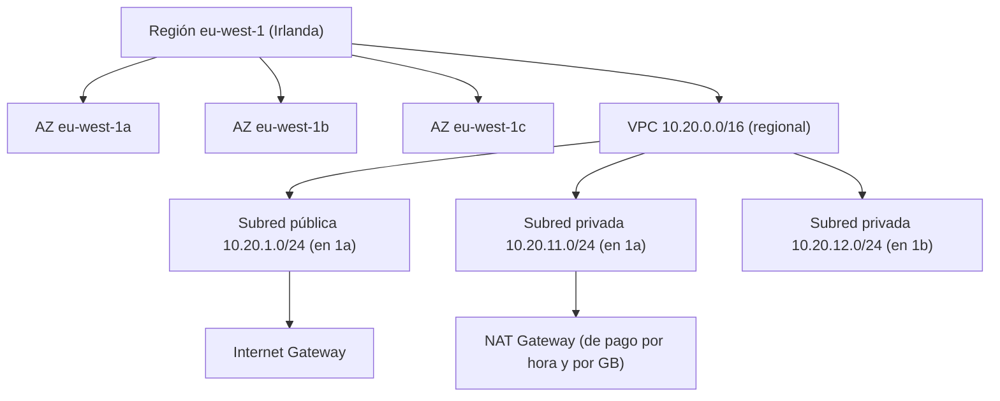
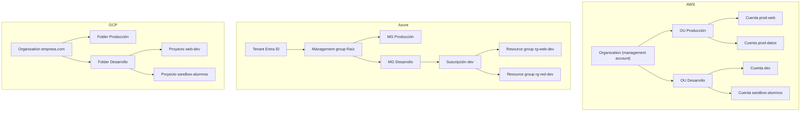
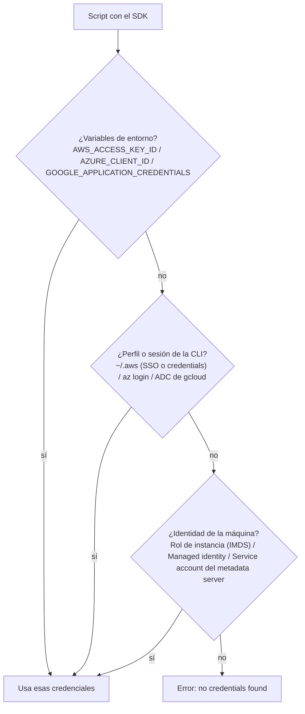

# UT4 · Nube pública: consola, CLI y SDK

<p class="ut-meta">12 h · Formación en empresa (19 abr a 9 jun 2027) · RA2 CE a, b, c, d, e</p>

Esta unidad no se cursa en el centro. Se hace en la empresa, durante el periodo de formación, y la plataforma la decide el tutor de empresa: puede ser AWS, Azure, Google Cloud o alguna alternativa europea (OVHcloud, Hetzner, Scaleway). Lo que sigue es la guía de referencia que tienes que llevar leída el primer día y la lista de evidencias que debes traer de vuelta. Hasta aquí, en las UT1 a UT3, has montado todo a mano sobre Proxmox: hipervisor, VPC con subredes, OPNsense, DMZ, proxy inverso. La nube pública es ese mismo diseño alquilado por horas y expuesto por API. Cuando vuelvas, en la UT5 (OpenTofu) y la UT6 (Jenkins) automatizarás sobre esa API lo que aquí vas a hacer con la consola, la CLI y el SDK, así que conviene que salgas de la empresa con perfiles de CLI funcionando y credenciales bien gestionadas.

## Qué tienes que saber hacer al terminar

- Entrar en la consola del proveedor con un usuario con permisos limitados y MFA, e identificar en qué cuenta, suscripción o proyecto y en qué región estás trabajando (CE 2a).
- Ajustar la interfaz: idioma, región por defecto, favoritos, unidades de coste y una alerta de presupuesto (CE 2b).
- Instalar la CLI del proveedor en local, en una VM o en el shell integrado, autenticarte sin claves de larga duración y comprobar tu identidad (CE 2c).
- Crear, listar, cambiar y borrar perfiles o configuraciones de la CLI; entender qué ficheros hay debajo y qué variables de entorno los sobrescriben (CE 2d).
- Instalar la librería cliente en Python o Node con el gestor de dependencias del proyecto y escribir un script que liste redes y máquinas reutilizando las credenciales de la CLI (CE 2e).
- Explicar por escrito cómo está organizada la nube de la empresa y en qué se diferencia de la VPC del centro.

## Qué es una nube pública y qué te alquila

Un proveedor de nube pública alquila por horas (en muchos servicios por segundos) la infraestructura que has construido en las UT1 a UT3: máquinas virtuales, redes privadas, discos, balanceadores, DNS, bases de datos y decenas de servicios gestionados que en el centro no tienes (colas, almacenamiento de objetos, funciones sin servidor). Se paga por uso, se crea y se destruye por API, y todo lo que se puede hacer desde la consola web se puede hacer desde la línea de comandos o desde código. Esa última frase es la que importa para el módulo: la consola es para mirar y para el primer día; la CLI y el SDK son con lo que se trabaja.

### El modelo de responsabilidad compartida

Antes de tocar nada conviene tener claro de qué se ocupa el proveedor y de qué te ocupas tú. Los tres grandes lo llaman modelo de responsabilidad compartida y lo resumen igual: el proveedor es responsable de la seguridad *de* la nube (centros de datos, hardware, hipervisor, red física, los servicios gestionados por dentro) y el cliente es responsable de la seguridad *en* la nube (sistema operativo de sus VM, parches, configuración de red, cortafuegos, identidades, cifrado de sus datos, y sobre todo qué expone a Internet).

En Proxmox lo tenías todo: si el hipervisor se quedaba sin parchear era problema tuyo. En la nube el hipervisor deja de ser tu problema, pero el grupo de seguridad con `0.0.0.0/0` al puerto 22 sigue siéndolo, y también lo es la clave de acceso que alguien subió a un repositorio público. La línea se desplaza según el servicio: en una VM (EC2, Azure VM, Compute Engine) administras el sistema operativo; en un contenedor gestionado sin servidor (Fargate, Container Apps, Cloud Run) solo administras la imagen y su configuración; en una base de datos gestionada ni siquiera ves el sistema operativo. Cuanto más gestionado, menos responsabilidad operativa y menos control.

### Regiones y zonas de disponibilidad

Una región es un conjunto de centros de datos en una zona geográfica, con nombre propio y catálogo de precios propio. Dentro de cada región hay varias zonas de disponibilidad (AZ), que son centros de datos físicamente separados (a kilómetros de distancia, con alimentación y red independientes) pero unidos por enlaces de baja latencia. Un desastre en una AZ no debería afectar a las otras de la misma región; un desastre regional sí afecta a todas.

Ejemplos reales que te vas a encontrar:

| Proveedor | Región | Dónde está | Notas |
|---|---|---|---|
| AWS | `eu-west-1` | Irlanda (Dublín) | La región europea más antigua y con más servicios. Tres AZ: `eu-west-1a`, `1b`, `1c`. |
| AWS | `eu-south-2` | España (Aragón) | Abierta en 2022. Útil por latencia y residencia de datos; algunos servicios llegan más tarde que a Irlanda. |
| AWS | `eu-central-1` | Alemania (Fráncfort) | Muy usada por empresas con requisitos de datos en la UE. |
| Azure | `westeurope` | Países Bajos | La región europea con más servicios de Azure. |
| Azure | `spaincentral` | Madrid | Abierta en 2024. |
| Google Cloud | `europe-southwest1` | Madrid | Zonas `europe-southwest1-a`, `-b`, `-c`. |
| Google Cloud | `europe-west1` | Bélgica | Región europea clásica de GCP. |

Dos consecuencias prácticas. La primera: casi todos los recursos son regionales. Una VPC de AWS vive en una región; una subred vive en una AZ concreta dentro de esa VPC. Si abres la consola en `us-east-1` no verás nada de lo que creaste en `eu-west-1`, y este es el susto más habitual del primer día. La segunda: los precios varían por región, a veces un 10 o un 20 %, y el tráfico entre regiones se paga. Elige la región por cercanía a los usuarios, por disponibilidad de los servicios que necesitas y por dónde tiene que residir el dato, y fíjala como región por defecto desde el primer día.



La traducción a lo que hiciste en la UT2 es directa: la VPC es tu bridge con su rango, la subred pública es la DMZ, las subredes privadas son las redes internas, el Internet Gateway es la interfaz WAN de OPNsense y el NAT Gateway es la regla de NAT de salida. La diferencia es que en la nube cada una de esas piezas tiene precio, y el NAT Gateway en particular tiene un precio que sorprende.

### Correspondencia con lo que ya sabes

| Concepto del curso (Proxmox) | AWS | Azure | Google Cloud |
|---|---|---|---|
| Hipervisor / VM | EC2 (instancia) | Virtual Machines | Compute Engine |
| Plantilla de VM / cloud-init | AMI + user data | Imagen + custom data | Imagen + startup script / metadata |
| Disco de la VM | EBS (volumen) | Managed Disk | Persistent Disk |
| Snapshot / backup | EBS Snapshot, AWS Backup | Snapshot, Azure Backup | Snapshot |
| Bridge / VPC | VPC | Virtual Network (VNet) | VPC (global, subredes regionales) |
| Subred / zona | Subnet en una AZ | Subnet (la VNet abarca la región) | Subnet regional |
| OPNsense: reglas por interfaz | Security Groups (por instancia, con estado) y NACL (por subred, sin estado) | Network Security Groups (con estado) | Firewall rules (a nivel de VPC, con etiquetas de red) |
| OPNsense: NAT de salida | NAT Gateway | NAT Gateway | Cloud NAT |
| OPNsense: WAN | Internet Gateway + Elastic IP | Public IP | External IP |
| Proxy inverso / balanceador | ALB / NLB | Application Gateway, Load Balancer | Cloud Load Balancing |
| DNS interno | Route 53 (zonas privadas) | Azure DNS (zonas privadas) | Cloud DNS |
| Usuarios y permisos | IAM (users, roles, policies) e IAM Identity Center | Entra ID + RBAC | IAM + service accounts |
| Estructura de cuentas | Organizations: root, OUs, cuentas | Management groups, suscripciones, resource groups | Organization, folders, proyectos |
| Consola integrada | CloudShell | Azure Cloud Shell | Cloud Shell |
| CLI | `aws` | `az` | `gcloud` |
| SDK Python | `boto3` | `azure-identity`, `azure-mgmt-*` | `google-cloud-*` |
| SDK Node | `@aws-sdk/client-*` | `@azure/identity`, `@azure/arm-*` | `@google-cloud/*` |
| Contenedores gestionados | ECS (con Fargate), EKS | Container Apps, AKS | Cloud Run, GKE |
| Registro de imágenes | ECR | Azure Container Registry | Artifact Registry |
| Almacenamiento de objetos | S3 | Blob Storage | Cloud Storage |
| Monitorización (UT7) | CloudWatch | Azure Monitor | Cloud Monitoring |

La fila de contenedores gestionados es solo un mapa: en este módulo no se despliega nada en ECS, AKS ni Cloud Run, pero conviene saber que ECS/Container Apps/Cloud Run son la opción "dame un contenedor y olvídate del clúster" y que EKS/AKS/GKE son Kubernetes gestionado (el plano de control lo lleva el proveedor, los nodos siguen siendo VM tuyas o gestionadas).

## Identidad y estructura de cuentas

### El usuario raíz y por qué no lo vas a ver

Toda cuenta de nube nace con una identidad todopoderosa: el usuario raíz en AWS (el correo con el que se creó la cuenta), el administrador global del tenant en Entra ID, el propietario de la organización en GCP. Esa identidad puede cerrar la cuenta, cambiar la tarjeta de pago y borrar cualquier cosa sin que ninguna política se lo impida. Ninguna empresa seria la usa a diario: tiene MFA con llave física, la contraseña está en una caja fuerte y se registra cada uso. A ti te darán un usuario o una identidad federada con permisos limitados, y ese es el escenario correcto.

### AWS: IAM users, roles y policies

En AWS hay tres piezas. Los *users* son identidades con credenciales de larga duración (contraseña de consola y, opcionalmente, un par de claves de acceso `AKIA...` / secreto). Los *roles* son identidades sin credenciales permanentes que se *asumen* durante un rato: una instancia EC2 asume un rol para leer de S3, tú asumes un rol de administrador en otra cuenta, Jenkins asume un rol para desplegar. Al asumir un rol recibes credenciales temporales (clave, secreto y token de sesión) con una vida de entre 15 minutos y 12 horas. Las *policies* son documentos JSON que dicen quién puede hacer qué sobre qué recurso, y se adjuntan a users, a grupos o a roles.

Una política mínima para alguien que solo necesita mirar la red y las instancias en Irlanda tiene esta pinta:

```json
{
  "Version": "2012-10-17",
  "Statement": [
    {
      "Sid": "SoloLecturaRedYComputo",
      "Effect": "Allow",
      "Action": [
        "ec2:DescribeVpcs",
        "ec2:DescribeSubnets",
        "ec2:DescribeSecurityGroups",
        "ec2:DescribeInstances",
        "ec2:DescribeRegions"
      ],
      "Resource": "*",
      "Condition": {
        "StringEquals": { "aws:RequestedRegion": "eu-west-1" }
      }
    }
  ]
}
```

Fíjate en los tres detalles que te van a preguntar: el efecto por defecto es denegar (todo lo que no está en un `Allow` explícito está prohibido, y un `Deny` explícito gana siempre), las acciones se nombran como `servicio:Operación` con el mismo nombre que usa la CLI (`aws ec2 describe-vpcs` es `ec2:DescribeVpcs`), y la condición limita la región. Las políticas gestionadas por AWS como `ReadOnlyAccess` o `AdministratorAccess` sirven para empezar; en producción se escriben políticas propias con el mínimo necesario.

Lo que hoy usan las empresas para las personas no son users con clave, sino IAM Identity Center (el antiguo AWS SSO): entras con la identidad corporativa (Entra ID, Google Workspace, Okta) y recibes credenciales temporales para cada cuenta y conjunto de permisos. Es lo que `aws configure sso` configura en tu máquina.

### Azure: Entra ID y RBAC

Azure separa dos mundos. Entra ID (antes Azure Active Directory) es el directorio: usuarios, grupos, aplicaciones, MFA, acceso condicional. Azure RBAC es la autorización sobre los recursos: una *asignación de rol* une una identidad (usuario, grupo, service principal o identidad administrada), un rol (`Reader`, `Contributor`, `Owner`, `Network Contributor`, o uno personalizado) y un ámbito (management group, suscripción, resource group o recurso concreto). Los permisos se heredan hacia abajo: `Reader` en la suscripción te deja ver todos los resource groups de esa suscripción. El equivalente al rol de AWS para máquinas y servicios es la identidad administrada (managed identity): una VM o una Container App recibe una identidad sin secretos que puede acceder a Key Vault o a Storage.

### Google Cloud: IAM y service accounts

En GCP el IAM funciona por *bindings* entre un *principal* (usuario de Google Workspace, grupo, service account) y un *rol* sobre un recurso, con herencia desde la organización a las carpetas y de estas a los proyectos. Hay roles básicos (`Viewer`, `Editor`, `Owner`, demasiado anchos para producción), roles predefinidos por servicio (`roles/compute.viewer`, `roles/compute.networkViewer`) y roles personalizados. Las service accounts son identidades para cargas de trabajo; una VM de Compute Engine arranca con una service account adjunta y obtiene tokens del servidor de metadatos sin fichero de clave alguno. Las claves JSON de service account descargadas son el equivalente a las claves `AKIA` de AWS: un secreto de larga duración que hay que evitar.

### MFA, SSO y credenciales temporales

Los tres proveedores empujan hacia el mismo esquema: la persona se autentica con MFA (app TOTP, llave FIDO2 o passkey) a través del proveedor de identidad de la empresa, y de ahí salen credenciales temporales para la consola y para la CLI. En tu máquina eso se traduce en tres comandos que no piden ninguna clave permanente:

```bash
# AWS con IAM Identity Center: abre el navegador, te autenticas y guarda un token de sesión
aws configure sso          # solo la primera vez, crea el perfil
aws sso login --profile empresa-dev

# Azure: abre el navegador contra Entra ID; --use-device-code si estás en una VM sin navegador
az login
az login --use-device-code

# Google Cloud: dos logins distintos, uno para gcloud y otro para el SDK
gcloud auth login                       # identidad que usa la CLI
gcloud auth application-default login   # identidad que usan las librerías (ADC)
```

La distinción de GCP entre `gcloud auth login` y `gcloud auth application-default login` confunde a todo el mundo la primera vez: la primera guarda una credencial que usa `gcloud`, la segunda guarda un fichero en `~/.config/gcloud/application_default_credentials.json` que es lo que buscan las librerías cliente. Si tu script de Python falla con "could not automatically determine credentials" es porque hiciste el primero y no el segundo.

!!! warning "Claves de acceso de larga duración"
    Un par de claves de AWS (`AKIA...`) o una clave JSON de service account de GCP no caduca y no pide MFA. Si acaba en un repositorio público, en menos de una hora habrá alguien minando criptomoneda a cargo de la empresa (hay bots escaneando GitHub para eso). Si el tutor te da una, pregunta si de verdad no hay alternativa con SSO o roles, guárdala fuera del proyecto y bórrala al terminar. Nunca en un fichero del repositorio, nunca en una variable de entorno de un `Dockerfile`.

### Cómo se organizan las cuentas

Ninguna empresa mediana trabaja con una sola cuenta. La unidad de aislamiento (facturación, límites, radio de explosión de un error) es la cuenta en AWS, la suscripción en Azure y el proyecto en GCP, y encima hay una jerarquía para agrupar y aplicar políticas:



En AWS, Organizations permite aplicar *service control policies* (SCP) a una OU entera: por ejemplo, "en la OU de desarrollo nadie puede crear recursos fuera de `eu-west-1` ni instancias mayores de `t3.large`". En Azure el equivalente son Azure Policy y los bloqueos de recurso, aplicados a un management group; el resource group es una capa más que agrupa recursos con el mismo ciclo de vida (borras el grupo y se va todo lo que contiene, muy útil para limpiar prácticas). En GCP las políticas de organización se aplican a carpetas y proyectos. Lo más probable es que a ti te den acceso a una cuenta, suscripción o proyecto de desarrollo o sandbox, y lo primero que tienes que anotar es su identificador: el número de cuenta de 12 dígitos de AWS, el GUID de suscripción de Azure o el ID de proyecto de GCP. Todos los comandos y scripts de esta unidad giran alrededor de ese identificador.

## Etiquetas y costes

### Etiquetado

Cada recurso que crees lleva etiquetas (tags en AWS y Azure, labels en GCP): pares clave/valor que no cambian el comportamiento del recurso pero permiten filtrar, facturar por proyecto y saber a quién preguntar antes de borrar algo. El mínimo habitual es `proyecto`, `entorno` (dev, pre, prod), `propietario` (un correo) y a veces `coste` (centro de coste) y `caduca` (fecha). La empresa tendrá su convención (mayúsculas o minúsculas, nombres en inglés o en español) y hay que seguirla al pie de la letra, porque muchas organizaciones tienen políticas que impiden crear recursos sin las etiquetas obligatorias, o scripts que borran de madrugada lo que no lleva `propietario`. Etiqueta lo que crees para practicar con algo reconocible (`propietario=alumno-fp`, `caduca=2027-06-09`) para que el tutor sepa qué puede borrar sin preguntar.

### Free tier, presupuestos y alertas

Los tres proveedores tienen algún tipo de nivel gratuito para cuentas nuevas: Azure da un crédito inicial durante el primer mes y un año de ciertos servicios en cantidades limitadas, Google Cloud da un crédito durante 90 días y un nivel "siempre gratis" (una `e2-micro` en regiones de EE. UU., 5 GB de Cloud Storage), y AWS cambió en 2025 a un modelo de créditos para cuentas nuevas con caducidad a los seis meses, más un conjunto de servicios siempre gratis (1 millón de invocaciones Lambda al mes, 25 GB de DynamoDB). Nada de eso aplica a la cuenta de la empresa, que es una cuenta de pago, así que cada recurso que crees tiene coste desde el minuto uno.

Antes de crear nada, configura una alerta de presupuesto. En AWS es Billing > Budgets (un presupuesto mensual de, digamos, 20 € con aviso al 80 %); en Azure es Cost Management > Budgets sobre la suscripción o el resource group; en GCP es Facturación > Presupuestos y alertas. Y luego mira la factura antes y después de cada práctica, en la vista por servicio y por etiqueta: es la única manera de saber qué te costó una hora de laboratorio.

### Los errores caros típicos

Estos son los que más cuestan en cuentas de formación y los que el tutor te va a agradecer que no cometas:

| Error | Por qué duele | Cómo se evita |
|---|---|---|
| NAT Gateway olvidado | Se cobra por hora aunque no pase tráfico (del orden de 30 a 35 € al mes en AWS) más cada GB procesado. Es la sorpresa más habitual en la factura de una VPC de pruebas. | Si solo necesitas salida a Internet desde una VM para instalar paquetes, usa una IP pública temporal o una instancia NAT pequeña, y destruye el gateway al terminar. |
| IP públicas reservadas | AWS cobra todas las IPv4 públicas por hora desde 2024 (unos 3,6 € al mes cada una); Azure y GCP cobran las IP estáticas reservadas que no están asociadas a nada. | Libera las Elastic IP y las IP estáticas que no uses. Cuenta cuántas tienes en la factura. |
| Snapshots y discos huérfanos | Al borrar una VM el disco puede quedarse (en AWS depende de `DeleteOnTermination`, en Azure el disco administrado sobrevive a la VM). Los snapshots se cobran por GB al mes para siempre. | Después de borrar, lista volúmenes y snapshots sin asociar y bórralos. |
| Egress (tráfico saliente) | El tráfico que entra es gratis; el que sale a Internet o a otra región se paga por GB (AWS regala los primeros 100 GB al mes por cuenta). Descargar 500 GB de backups "para probar" se nota. | Mueve datos dentro de la misma región. Para pruebas, usa ficheros pequeños. |
| Instancias grandes "un momento" | Una máquina de 16 vCPU y 64 GB cuesta 20 o 30 veces más que una `t3.micro` y se olvida igual de fácil. | Crea siempre el tamaño mínimo que sirva y ponte una alarma en el móvil para apagarla. |
| Balanceadores y bases de datos gestionadas | Se cobran por hora desde que se crean, con datos o sin ellos. | No los crees en esta unidad salvo que el tutor lo pida. |

!!! tip "Regla de la empresa"
    Lo que creas para practicar lo destruyes el mismo día. Antes de cerrar sesión, lista instancias, discos, IP, NAT y snapshots con la CLI y compara con lo que había por la mañana. Anota el coste en la ficha de evidencias: es una evidencia tan válida como una captura.

## Consola web y shells integrados

La consola es una aplicación web con un panel por servicio. El primer día ajusta lo que el CE 2b pide: el idioma (conviene dejarla en inglés, porque la documentación, los mensajes de error y los foros están en inglés y las traducciones de la consola cambian los nombres de los menús), la región por defecto (arriba a la derecha en AWS; en Azure y GCP se elige por recurso pero se puede fijar una por defecto en las preferencias), los favoritos (VPC, EC2, IAM, Billing en AWS; Virtual networks, Virtual machines, Cost Management en Azure; VPC network, Compute Engine, IAM, Billing en GCP), el tema y la moneda de las vistas de coste. Anota también cómo se llama la vista que te dice quién eres: en AWS el menú de la cuenta muestra el número de cuenta, el usuario o rol y el proveedor de identidad; en Azure, el icono de usuario muestra el tenant y `Subscriptions` la suscripción activa; en GCP, el selector de proyecto arriba.

Los tres tienen un terminal dentro de la consola, y es la forma más rápida de tener la CLI sin instalar nada:

- **AWS CloudShell**: un shell Linux con `aws`, `python3`, `git` y `docker` preinstalados, autenticado con la identidad con la que abriste la consola y con 1 GB de directorio personal persistente por región. Gratis. Se abre desde el icono de terminal de la barra superior y es regional (si cambias de región, cambias de CloudShell).
- **Azure Cloud Shell**: Bash o PowerShell con `az`, `terraform`, `kubectl` y muchas cosas más. La primera vez pide un storage account para el directorio personal (o una sesión efímera sin persistencia). Se abre desde el icono de terminal del portal o en `shell.azure.com`.
- **Google Cloud Shell**: una VM pequeña con `gcloud`, `kubectl`, `docker` y editores, 5 GB de directorio personal persistente y ya autenticada. Se abre desde el icono de terminal de la consola.

Para las actividades A4.3 y A4.4 el shell integrado vale y ahorra problemas de instalación, pero tiene un límite claro: las credenciales viven ahí dentro, así que para la A4.5 (SDK en el proyecto de la empresa) o para la UT5 vas a necesitar la CLI en la máquina donde esté el código.

## La CLI a fondo

Las tres CLI siguen el mismo patrón: `herramienta servicio recurso verbo --opciones`. `aws ec2 describe-vpcs`, `az network vnet list`, `gcloud compute networks list`. Las tres guardan la configuración en el directorio personal, las tres aceptan variables de entorno que sobrescriben esa configuración, y las tres devuelven JSON que se puede filtrar. Lo que cambia es la ortografía.

### Instalación

=== "AWS"

    La CLI v2 se distribuye como binario, no por `pip`. En Linux x86_64:

    ```bash
    curl "https://awscli.amazonaws.com/awscli-exe-linux-x86_64.zip" -o awscliv2.zip
    unzip awscliv2.zip
    sudo ./aws/install
    aws --version        # aws-cli/2.x.y Python/3.x ...
    ```

    En macOS hay un `.pkg` y en Windows un `.msi`; en ARM (Raspberry, Mac con Apple Silicon bajo Linux) el zip es `awscli-exe-linux-aarch64.zip`. Para actualizar se repite con `sudo ./aws/install --update`. Documentación: <https://docs.aws.amazon.com/cli/latest/userguide/getting-started-install.html>.

=== "Azure"

    En Debian y Ubuntu, el script oficial añade el repositorio de Microsoft e instala el paquete `azure-cli`:

    ```bash
    curl -sL https://aka.ms/InstallAzureCLIDeb | sudo bash
    az version
    ```

    Si prefieres no ejecutar un script con `sudo` sin leerlo (buena costumbre), la misma página documenta los pasos manuales: clave GPG, fichero en `/etc/apt/sources.list.d/`, `apt install azure-cli`. Documentación: <https://learn.microsoft.com/cli/azure/install-azure-cli-linux>.

=== "Google Cloud"

    En Debian y Ubuntu se añade el repositorio de Google y se instala `google-cloud-cli`:

    ```bash
    sudo apt-get install -y apt-transport-https ca-certificates gnupg curl
    curl https://packages.cloud.google.com/apt/doc/apt-key.gpg | sudo gpg --dearmor -o /usr/share/keyrings/cloud.google.gpg
    echo "deb [signed-by=/usr/share/keyrings/cloud.google.gpg] https://packages.cloud.google.com/apt cloud-sdk main" | sudo tee /etc/apt/sources.list.d/google-cloud-sdk.list
    sudo apt-get update && sudo apt-get install -y google-cloud-cli
    gcloud version
    ```

    Hay componentes opcionales (`gcloud components list`): `kubectl`, el emulador de Pub/Sub, etc. Con la instalación por `apt` los componentes se instalan también por `apt` (`google-cloud-cli-gke-gcloud-auth-plugin`, por ejemplo). Documentación: <https://cloud.google.com/sdk/docs/install>.

### Autenticación y "quién soy"

El primer comando que se ejecuta después de autenticarse, y el que te pide la evidencia de la A4.3, es el que te dice con qué identidad estás hablando con la API. Si la salida no es la que esperabas (otra cuenta, otro usuario, otra suscripción), todo lo que hagas después irá al sitio equivocado.

=== "AWS"

    ```bash
    aws configure sso
    # SSO session name: empresa
    # SSO start URL: https://empresa.awsapps.com/start
    # SSO region: eu-west-1
    # ... elige cuenta y permission set, región por defecto eu-west-1, formato json, nombre de perfil empresa-dev

    aws sso login --profile empresa-dev
    aws sts get-caller-identity --profile empresa-dev
    ```

    ```json
    {
        "UserId": "AROAEXAMPLEID:alumno@empresa.com",
        "Account": "123456789012",
        "Arn": "arn:aws:sts::123456789012:assumed-role/AWSReservedSSO_DevReadOnly_abc123/alumno@empresa.com"
    }
    ```

    El `Arn` te dice que estás usando un rol asumido vía SSO (`AWSReservedSSO_...`) y no un user con claves. Si el tutor te ha dado claves de acceso en lugar de SSO, `aws configure --profile empresa-dev` las pide y las guarda en `~/.aws/credentials`.

=== "Azure"

    ```bash
    az login                      # abre el navegador
    az account show               # tenant y suscripción activa
    az account list -o table      # todas las suscripciones a las que tienes acceso
    az account set --subscription "Desarrollo"
    az ad signed-in-user show --query "{nombre:displayName, upn:userPrincipalName}"
    ```

    `az account show` devuelve el `id` de la suscripción (el GUID), el `tenantId` y el usuario. Si tienes acceso a varias suscripciones, `az login` te pide elegir una y el resto de comandos van contra la que esté activa; cambiarla es `az account set`.

=== "Google Cloud"

    ```bash
    gcloud init                   # asistente: cuenta, proyecto, región y zona por defecto
    gcloud auth list              # cuentas autenticadas y cuál está activa
    gcloud config list            # proyecto, región, zona de la configuración activa
    gcloud config set project sandbox-alumnos-2027
    gcloud auth application-default login   # para el SDK
    ```

    `gcloud auth list` marca con un asterisco la cuenta activa. `gcloud config list` muestra la configuración activa (proyecto, cuenta, región y zona por defecto).

### Perfiles y ficheros de configuración

Aquí está el núcleo del CE 2d. Un perfil (AWS), una suscripción activa más la configuración de `az` (Azure) o una *configuration* (GCP) agrupan región, proyecto y credenciales, y lo normal es tener uno por entorno: `empresa-dev`, `empresa-pre`, o uno por región si trabajas en dos.

=== "AWS"

    Dos ficheros. `~/.aws/config` guarda todo lo que no es secreto (región, formato de salida, sesiones SSO, roles a asumir) y `~/.aws/credentials` guarda claves de acceso si las hay. Con SSO el segundo no existe y el token temporal se cachea en `~/.aws/sso/cache/`.

    ```ini
    # ~/.aws/config
    [sso-session empresa]
    sso_start_url = https://empresa.awsapps.com/start
    sso_region = eu-west-1
    sso_registration_scopes = sso:account:access

    [profile empresa-dev]
    sso_session = empresa
    sso_account_id = 123456789012
    sso_role_name = DevReadOnly
    region = eu-west-1
    output = json

    [profile empresa-pre]
    sso_session = empresa
    sso_account_id = 210987654321
    sso_role_name = PreReadOnly
    region = eu-south-2
    output = table

    [profile empresa-admin]
    role_arn = arn:aws:iam::123456789012:role/Admin
    source_profile = empresa-dev
    ```

    El tercer perfil muestra otro mecanismo: `role_arn` con `source_profile` hace que la CLI asuma un rol automáticamente usando las credenciales de otro perfil. Es la forma habitual de saltar entre cuentas.

    ```bash
    aws configure list-profiles
    aws configure list --profile empresa-pre       # de dónde sale cada valor
    aws ec2 describe-vpcs --profile empresa-dev --output table
    aws ec2 describe-vpcs --profile empresa-pre
    export AWS_PROFILE=empresa-dev                 # y ya no hace falta --profile
    aws configure set region eu-west-1 --profile empresa-dev
    ```

    Borrar un perfil es editar el fichero a mano; no hay subcomando. Variables de entorno que mandan sobre los ficheros: `AWS_PROFILE`, `AWS_REGION` (y la antigua `AWS_DEFAULT_REGION`), `AWS_ACCESS_KEY_ID`, `AWS_SECRET_ACCESS_KEY`, `AWS_SESSION_TOKEN`, `AWS_CONFIG_FILE`. Si tienes `AWS_ACCESS_KEY_ID` exportada en el shell y no lo recuerdas, ganará sobre cualquier perfil, y ese es un clásico de "por qué me dice que soy otro".

=== "Azure"

    `az` guarda todo en `~/.azure/`: `azureProfile.json` con las suscripciones y cuál está activa, el caché de tokens de MSAL y `config` (formato INI) con las opciones por defecto. El concepto de "perfil" se reparte entre la suscripción activa y esa configuración:

    ```bash
    az account list -o table                       # suscripciones disponibles
    az account set --subscription "Desarrollo"     # cambia el contexto
    az account show --query "{sub:name, id:id, tenant:tenantId}" -o table

    az config set core.output=table               # formato por defecto
    az config set defaults.location=spaincentral   # región por defecto para crear recursos
    az config set defaults.group=rg-red-dev        # resource group por defecto
    az config get                                  # ver todo
    az config unset defaults.group
    ```

    Para tener dos "perfiles" separados de verdad (por ejemplo dos tenants distintos), la opción es `AZURE_CONFIG_DIR`: apunta la variable a otro directorio y `az` mantendrá ahí su propio login y configuración.

    ```bash
    export AZURE_CONFIG_DIR=~/.azure-pre
    az login                                       # sesión independiente
    ```

    Otras variables útiles: `AZURE_DEFAULTS_LOCATION`, `AZURE_DEFAULTS_GROUP`, `AZURE_CORE_OUTPUT`. Cualquier opción de `az config` se puede expresar como variable `AZURE_<SECCION>_<CLAVE>` en mayúsculas.

=== "Google Cloud"

    `gcloud` tiene el concepto más limpio: las *configurations* son conjuntos con nombre de propiedades (cuenta, proyecto, región, zona) que se guardan en `~/.config/gcloud/configurations/config_<nombre>` y se activan de forma exclusiva.

    ```bash
    gcloud config configurations list
    gcloud config configurations create empresa-dev
    gcloud config set account alumno@empresa.com
    gcloud config set project sandbox-alumnos-2027
    gcloud config set compute/region europe-southwest1
    gcloud config set compute/zone europe-southwest1-a

    gcloud config configurations create empresa-pre
    gcloud config set project pre-web-2027
    gcloud config set compute/region europe-west1

    gcloud config configurations activate empresa-dev
    gcloud compute networks list
    gcloud compute networks list --configuration=empresa-pre    # sin cambiar la activa
    gcloud config configurations delete empresa-pre
    ```

    La configuración activa se apunta en `~/.config/gcloud/active_config`. Variables: `CLOUDSDK_ACTIVE_CONFIG_NAME` selecciona una configuración, y cualquier propiedad se puede sobrescribir con `CLOUDSDK_<SECCION>_<PROPIEDAD>` (`CLOUDSDK_CORE_PROJECT`, `CLOUDSDK_COMPUTE_ZONE`). También `--project` en cualquier comando.

### Formatos de salida y filtrado

El JSON completo de `describe-instances` de una cuenta con veinte máquinas ocupa varias pantallas. Las tres CLI permiten elegir el formato y quedarse con los campos que importan, y saber hacerlo es lo que separa "uso la CLI" de "leo la consola por terminal".

=== "AWS"

    `--output` acepta `json` (por defecto), `table`, `text` y `yaml`. `--query` aplica una expresión JMESPath sobre el JSON antes de formatearlo.

    ```bash
    aws ec2 describe-vpcs --output table
    aws ec2 describe-vpcs --query "Vpcs[].{Id:VpcId, Cidr:CidrBlock, Default:IsDefault}" --output table

    # instancias: id, tipo, estado, IP privada y la etiqueta Name
    aws ec2 describe-instances \
      --query "Reservations[].Instances[].{Id:InstanceId, Tipo:InstanceType, Estado:State.Name, IP:PrivateIpAddress, Nombre:Tags[?Key=='Name']|[0].Value}" \
      --output table

    # solo las que están encendidas, con filtro en el servidor (más barato que filtrar en cliente)
    aws ec2 describe-instances --filters "Name=instance-state-name,Values=running" \
      --query "Reservations[].Instances[].InstanceId" --output text
    ```

    `--filters` filtra en el servidor (menos datos por la red) y `--query` en el cliente. Para scripts, `--output text` con `--query` devuelve columnas separadas por tabulador, cómodo para `while read`.

=== "Azure"

    `-o` (o `--output`) acepta `json`, `jsonc`, `table`, `tsv`, `yaml` y `none`. `--query` usa JMESPath igual que AWS, así que la sintaxis se traslada.

    ```bash
    az network vnet list -o table
    az network vnet list --query "[].{Nombre:name, RG:resourceGroup, Rango:addressSpace.addressPrefixes[0]}" -o table

    # máquinas con su estado (necesita -d para que traiga el powerState)
    az vm list -d --query "[].{Nombre:name, RG:resourceGroup, Estado:powerState, IP:privateIps}" -o table

    # solo las de un resource group
    az vm list -g rg-web-dev -o table
    ```

    `tsv` es el formato para scripts: sin comillas ni cabeceras.

=== "Google Cloud"

    `--format` acepta `json`, `yaml`, `table(...)`, `value(...)`, `csv(...)` y más; `--filter` filtra en el servidor con una sintaxis propia.

    ```bash
    gcloud compute networks list
    gcloud compute networks list --format="table(name, subnet_mode, x_gcloud_bgp_routing_mode)"
    gcloud compute networks subnets list --filter="region:europe-southwest1" --format="table(name, region, ipCidrRange)"

    # máquinas: nombre, zona, tipo, estado, IP interna
    gcloud compute instances list \
      --format="table(name, zone.basename(), machineType.basename(), status, networkInterfaces[0].networkIP)"

    gcloud compute instances list --filter="status=RUNNING" --format="value(name)"
    gcloud compute instances list --format=json | jq '.[].name'
    ```

    `value(...)` es el equivalente de `--output text` de AWS. `--format=json` con `jq` es lo que hace todo el mundo cuando las proyecciones de `gcloud` se vuelven crípticas.

## Librerías cliente (SDK)

La CLI es un programa que llama a la API REST del proveedor; el SDK es la misma llamada desde tu lenguaje. Lo que el CE 2e evalúa no es que sepas el nombre de la clase, sino que instales la librería con el gestor de dependencias del proyecto (nada de `pip install` suelto sin dejar rastro en `requirements.txt`), que el script no lleve credenciales dentro y que entiendas de dónde las saca.

### La cadena de credenciales por defecto

Los tres SDK buscan credenciales en un orden fijo y se quedan con la primera que encuentran. Conocer ese orden es lo que te permite escribir un script sin una sola clave y que funcione igual en tu portátil (con la sesión de la CLI), en una VM de la nube (con el rol o la identidad de la máquina) y en un pipeline de Jenkins (con variables de entorno inyectadas).



En AWS la cadena de `boto3` es, resumida: parámetros explícitos en el código, variables de entorno, `~/.aws/credentials` y `~/.aws/config` (incluido SSO y `role_arn`), credenciales de contenedor (ECS) y por último el servicio de metadatos de la instancia (IMDS, en `169.254.169.254`). En Azure, `DefaultAzureCredential` prueba variables de entorno (service principal), workload identity, managed identity, y después las credenciales de las herramientas de desarrollo (`az login`, Azure Developer CLI, PowerShell). En GCP, las *Application Default Credentials* miran `GOOGLE_APPLICATION_CREDENTIALS` (ruta a un JSON), luego `~/.config/gcloud/application_default_credentials.json` y luego el servidor de metadatos.

La consecuencia práctica es que el script que escribes en la empresa no debe tener ni `aws_access_key_id=` ni `credential=ClientSecretCredential(...)` ni `from_service_account_file(...)`. Tiene que apoyarse en la cadena.

### Python

```bash
python3 -m venv .venv
source .venv/bin/activate
pip install boto3                                          # AWS
pip install azure-identity azure-mgmt-network azure-mgmt-compute   # Azure
pip install google-cloud-compute                           # GCP
pip freeze > requirements.txt
```

Lo que se entrega es `requirements.txt` (o `pyproject.toml` si el proyecto usa `uv` o Poetry), y `.venv/` va en `.gitignore`.

=== "AWS"

    ```python
    # listar_aws.py: VPC e instancias con boto3 usando el perfil de la CLI
    import boto3

    ses = boto3.Session(profile_name="empresa-dev", region_name="eu-west-1")
    ec2 = ses.client("ec2")

    print("VPC:")
    for vpc in ec2.describe_vpcs()["Vpcs"]:
        print(f"  {vpc['VpcId']}  {vpc['CidrBlock']}  default={vpc['IsDefault']}")

    print("Instancias:")
    paginador = ec2.get_paginator("describe_instances")
    for pagina in paginador.paginate():
        for r in pagina["Reservations"]:
            for i in r["Instances"]:
                nombre = next((t["Value"] for t in i.get("Tags", []) if t["Key"] == "Name"), "-")
                print(f"  {i['InstanceId']}  {i['InstanceType']}  {i['State']['Name']}  "
                      f"{i.get('PrivateIpAddress', '-')}  {nombre}")
    ```

    Si quitas `profile_name`, `boto3` recorre la cadena por defecto y el mismo script vale en una EC2 con rol. El paginador importa: `describe_instances` devuelve como mucho 1000 resultados por llamada y en una cuenta grande el bucle sin paginar se deja máquinas fuera.

=== "Azure"

    ```python
    # listar_azure.py: VNets y VMs con DefaultAzureCredential
    import os
    from azure.identity import DefaultAzureCredential
    from azure.mgmt.network import NetworkManagementClient
    from azure.mgmt.compute import ComputeManagementClient

    sub = os.environ["AZURE_SUBSCRIPTION_ID"]      # el GUID que devuelve az account show
    cred = DefaultAzureCredential()

    red = NetworkManagementClient(cred, sub)
    print("VNets:")
    for vnet in red.virtual_networks.list_all():
        rg = vnet.id.split("/")[4]
        print(f"  {vnet.name}  rg={rg}  {vnet.location}  {vnet.address_space.address_prefixes}")

    comp = ComputeManagementClient(cred, sub)
    print("VMs:")
    for vm in comp.virtual_machines.list_all():
        rg = vm.id.split("/")[4]
        print(f"  {vm.name}  rg={rg}  {vm.location}  {vm.hardware_profile.vm_size}")
    ```

    `DefaultAzureCredential` encontrará la sesión de `az login`. El ID de suscripción se pasa por variable de entorno para no fijarlo en el código: `export AZURE_SUBSCRIPTION_ID=$(az account show --query id -o tsv)`.

=== "Google Cloud"

    ```python
    # listar_gcp.py: redes VPC e instancias con google-cloud-compute (ADC)
    import os
    from google.cloud import compute_v1

    proyecto = os.environ.get("CLOUDSDK_CORE_PROJECT") or os.environ["GOOGLE_CLOUD_PROJECT"]

    print("Redes:")
    for red in compute_v1.NetworksClient().list(project=proyecto):
        modo = "auto" if red.auto_create_subnetworks else "custom"
        print(f"  {red.name}  modo={modo}")

    print("Instancias:")
    agregado = compute_v1.InstancesClient().aggregated_list(project=proyecto)
    for zona, resp in agregado:
        for vm in resp.instances:
            ip = vm.network_interfaces[0].network_i_p if vm.network_interfaces else "-"
            print(f"  {vm.name}  {zona.split('/')[-1]}  {vm.machine_type.split('/')[-1]}  {vm.status}  {ip}")
    ```

    `aggregated_list` recorre todas las zonas de una vez; `list` necesita la zona. Las credenciales salen de `gcloud auth application-default login`.

### Node.js

```bash
npm init -y
npm install @aws-sdk/client-ec2                         # AWS (SDK v3, un paquete por servicio)
npm install @azure/identity @azure/arm-network @azure/arm-compute
npm install @google-cloud/compute
```

`package.json` y `package-lock.json` son los entregables; `node_modules/` va al `.gitignore`. Un ejemplo con AWS, que es el que más se ve en las empresas:

```javascript
// listar-aws.mjs
import { EC2Client, DescribeVpcsCommand, paginateDescribeInstances } from "@aws-sdk/client-ec2";

const ec2 = new EC2Client({ region: "eu-west-1" }); // credenciales: cadena por defecto (AWS_PROFILE, SSO, rol...)

const { Vpcs } = await ec2.send(new DescribeVpcsCommand({}));
console.log("VPC:");
for (const v of Vpcs) console.log(`  ${v.VpcId}  ${v.CidrBlock}`);

console.log("Instancias:");
for await (const page of paginateDescribeInstances({ client: ec2 }, {})) {
  for (const r of page.Reservations ?? []) {
    for (const i of r.Instances ?? []) {
      const nombre = i.Tags?.find(t => t.Key === "Name")?.Value ?? "-";
      console.log(`  ${i.InstanceId}  ${i.InstanceType}  ${i.State.Name}  ${i.PrivateIpAddress ?? "-"}  ${nombre}`);
    }
  }
}
```

Se ejecuta con `AWS_PROFILE=empresa-dev node listar-aws.mjs`. Para Azure el patrón es `new NetworkManagementClient(new DefaultAzureCredential(), subscriptionId)` y luego `for await (const v of client.virtualNetworks.listAll())`; para GCP, `new NetworksClient().list({ project })`.

??? info "Por qué el SDK y no solo la CLI"
    Con la CLI y `jq` se llega lejos, y para tareas puntuales es lo correcto. El SDK entra cuando la lógica crece (cruzar instancias con snapshots huérfanos, calcular costes por etiqueta, generar un informe), cuando hay que manejar errores y reintentos con criterio, o cuando el código forma parte de una aplicación. En la UT5 verás que OpenTofu es, en el fondo, un programa que usa el SDK del proveedor por ti.

## Buenas prácticas mínimas

- MFA en todo usuario, sin excepciones. Permisos por rol y por grupo, nunca asignados a personas concretas: cuando alguien cambia de equipo se le cambia de grupo y ya está.
- Nada expuesto desde `0.0.0.0/0` salvo el balanceador o el proxy inverso, y en ese caso solo los puertos 80 y 443. El SSH (22) y el RDP (3389) se abren a la IP de la oficina, a una VPN o se sustituyen por SSM Session Manager (AWS), Azure Bastion o IAP TCP forwarding (GCP). Los tres proveedores avisan en la consola cuando creas una regla abierta al mundo; hazles caso.
- Etiquetar todo y destruir lo que se crea para practicar el mismo día. Comprobar la factura al día siguiente.
- Nunca subir credenciales a Git. Instala `gitleaks` y ejecútalo antes de cada push, o mejor como hook de pre-commit:

```bash
# escanea el historial del repositorio
gitleaks git -v

# hook de pre-commit: solo lo que está en staging
cat > .git/hooks/pre-commit <<'EOF'
#!/bin/sh
gitleaks git --pre-commit --staged --redact
EOF
chmod +x .git/hooks/pre-commit
```

Si `gitleaks` encuentra algo que ya se subió, no basta con borrarlo en el siguiente commit: sigue en el historial. La clave hay que revocarla en el proveedor en ese momento y avisar al tutor.

- Ficheros que nunca van al repositorio: `.env`, `*.pem`, `*.json` de service accounts, `~/.aws/credentials`, `terraform.tfstate`. Ponlos en `.gitignore` antes del primer commit.

## Errores frecuentes en el laboratorio

**"No veo nada de lo que creé"**. Estás en otra región. Mira el selector de región de la consola o `aws configure get region`, `az config get defaults.location`, `gcloud config get compute/region`. En AWS, `aws ec2 describe-instances --region eu-south-2` si sospechas de dónde está.

**`Unable to locate credentials` / `Please run 'az login'` / `could not automatically determine credentials`**. La cadena no ha encontrado nada. Comprueba `aws sts get-caller-identity`, `az account show` o `gcloud auth list`; si la CLI funciona pero el SDK no, en GCP falta `gcloud auth application-default login`, y en AWS revisa que el script use el mismo perfil que la CLI (`AWS_PROFILE`).

**El token SSO ha caducado** (`The SSO session associated with this profile has expired`). Las sesiones de IAM Identity Center duran entre 1 y 12 horas según lo configure la empresa. `aws sso login --profile empresa-dev` y a seguir. Lo mismo con `az login` cuando el token de Entra ID expira (suele avisar con `AADSTS700082`).

**`AccessDenied` / `AuthorizationFailed` / `403 Forbidden` en una operación concreta**. Tu rol no tiene ese permiso; el mensaje suele decir qué acción (`ec2:RunInstances`) y sobre qué recurso. No lo "arregles" pidiendo `AdministratorAccess`: anota la acción exacta y pídele al tutor el permiso mínimo. En AWS, si la política tiene condición de región y estás en otra, el error es el mismo.

**`aws` dice que soy otra persona**. Tienes `AWS_ACCESS_KEY_ID` o `AWS_PROFILE` exportadas en el shell (mira `env | grep AWS`) o un `[default]` en `~/.aws/credentials` que no recuerdas. `aws configure list` te dice de dónde sale cada valor.

**`az` va contra la suscripción equivocada**. `az login` deja activa la primera suscripción de la lista. `az account list -o table` y `az account set --subscription <id>`.

**El script de Python lista menos máquinas que la consola**. No estás paginando, o estás mirando una sola región o zona. En AWS usa el paginador; en GCP usa `aggregated_list`; en Azure `list_all` ya pagina por ti.

**La factura sube aunque "no hay nada"**. Lista NAT gateways, IP públicas reservadas, discos sin asociar y snapshots; casi siempre es uno de esos. En AWS, Cost Explorer filtrado por servicio te lo dice en un minuto.

**La CLI instalada por `pip` o `apt` es antigua**. `apt install awscli` en Debian instala la v1, que no soporta `configure sso`. Usa el instalador oficial de la v2. `pip install azure-cli` funciona pero es lento de actualizar; el repositorio de Microsoft es lo recomendado.

**Cloud Shell "pierde" los ficheros**. En AWS CloudShell solo persiste el directorio personal y por región; en Azure con sesión efímera no persiste nada. Sube el trabajo a un repositorio antes de cerrar.

## Actividades

Estas actividades no tienen sesión asignada: se hacen en la empresa durante la formación, en el orden que marque el tutor, y cada una se documenta en la ficha de evidencias que hay más abajo. El tutor de empresa firma la ficha y el profesor evalúa con ella. Las capturas van sin datos sensibles: tapa números de cuenta completos, claves, IP públicas de producción y correos de terceros.

### A4.1 Acceso a la plataforma (CE 2a)

Recibir el usuario, activar MFA (app TOTP o passkey; anota cuál admite la empresa), entrar en la consola. Identificar la cuenta, suscripción o proyecto en el que trabajas y su identificador, la región de trabajo y la política de etiquetas de la empresa (qué etiquetas son obligatorias y con qué formato). Localiza también dónde se ve la jerarquía (Organizations, management groups, carpetas) aunque no tengas permiso para tocarla.

Evidencia: captura de la consola con el usuario, la cuenta o proyecto y la región visibles, y un párrafo con el identificador (parcialmente tapado), la región y las etiquetas obligatorias.

### A4.2 Configuración de la interfaz (CE 2b)

Ajustar idioma, región por defecto, favoritos (los servicios de red, cómputo, identidad y facturación) y unidades de coste. Crear una alerta de presupuesto sobre tu cuenta, suscripción o resource group, o si no tienes permiso, consultar la vista de costes del mes en curso filtrada por tu etiqueta de propietario.

Evidencia: capturas de las preferencias y de la alerta de presupuesto (o de la consulta de costes).

### A4.3 Instalación de la CLI (CE 2c)

Instalar la CLI en el entorno que indique la empresa (portátil, VM o shell integrado), inicializarla y autenticarte con el mecanismo que use la empresa (SSO, `az login`, `gcloud auth login`). Comprobar la versión y la identidad.

Evidencia: salida de `aws --version` y `aws sts get-caller-identity`, o `az version` y `az account show`, o `gcloud version` y `gcloud auth list`, con un comentario de una línea sobre qué tipo de credencial es (rol asumido por SSO, usuario de Entra, cuenta de Google).

### A4.4 Gestión de perfiles (CE 2d)

Crear dos perfiles o configuraciones (dev y pre, o dos regiones, o dos suscripciones), listar los recursos de red con cada uno y cambiar entre ellos con el mecanismo nativo y con la variable de entorno correspondiente. Mostrar el contenido (sin secretos) de los ficheros de configuración que hay debajo y borrar uno de los dos perfiles al terminar.

Evidencia: los comandos y sus salidas, el fichero `~/.aws/config` o la salida de `az config get` y `az account list`, o de `gcloud config configurations list`, y una tabla comparando qué redes ve cada perfil.

### A4.5 SDK (CE 2e)

En el lenguaje del proyecto de la empresa (Python o Node; si es otro, el tutor decide), crear el entorno, instalar la librería cliente con el gestor de dependencias y escribir un script que liste las VPC/VNets y las máquinas de un entorno sin credenciales en el código. Ejecutarlo con dos perfiles distintos cambiando solo la variable de entorno.

Evidencia: `requirements.txt` o `package.json`, el script, su salida con cada perfil y la salida de `gitleaks git` sobre el repositorio donde lo has guardado.

### Actividad de cierre

Documento de dos páginas: cómo está organizada la nube de la empresa (cuentas o suscripciones o proyectos, regiones, redes y subredes, permisos y mecanismo de identidad, política de etiquetas y de costes) y qué diferencias has encontrado respecto a la VPC de Proxmox del centro. Interesa especialmente lo que no esperabas: qué hace la empresa que en el centro no hicimos y qué hicimos en el centro que en la nube ya viene dado.

## Práctica evaluable

La práctica evaluable de esta unidad es el conjunto de las cinco actividades más el documento de cierre, entregados a través de la ficha de evidencias firmada por el tutor de empresa. No hay defensa en el centro: el profesor evalúa con la ficha, las evidencias adjuntas y el documento.

Entregables (en un repositorio privado o en la carpeta que indique el profesor):

- [ ] Ficha de evidencias firmada (PDF o foto legible).
- [ ] Capturas de A4.1 y A4.2, sin datos sensibles.
- [ ] Salidas de terminal de A4.3 y A4.4 (texto, no capturas, siempre que se pueda).
- [ ] Código, fichero de dependencias y salidas de A4.5.
- [ ] Documento de cierre (dos páginas).

### Ficha de evidencias

| Actividad | CE | Fecha | Evidencia adjunta | Observaciones del tutor | Firma |
|---|---|---|---|---|---|
| A4.1 Acceso | 2a | | | | |
| A4.2 Interfaz | 2b | | | | |
| A4.3 CLI | 2c | | | | |
| A4.4 Perfiles | 2d | | | | |
| A4.5 SDK | 2e | | | | |
| Cierre | (todos) | | | | |

### Criterios de evaluación y pesos

| Criterio | Peso |
|---|---|
| A4.1 Acceso a la consola: MFA activo, identificación correcta de cuenta, región y política de etiquetas (CE 2a) | 15 % |
| A4.2 Configuración de la interfaz y alerta de presupuesto (CE 2b) | 10 % |
| A4.3 CLI instalada y autenticada sin credenciales de larga duración, identidad verificada (CE 2c) | 20 % |
| A4.4 Dos perfiles funcionando, cambio por mecanismo nativo y por variable de entorno, ficheros explicados (CE 2d) | 20 % |
| A4.5 SDK instalado con el gestor de dependencias, script sin credenciales, funciona con dos perfiles, gitleaks limpio (CE 2e) | 20 % |
| Documento de cierre: organización de la nube de la empresa y comparación razonada con la VPC del centro | 15 % |

Una evidencia con credenciales visibles (aunque estén revocadas) invalida la actividad correspondiente.

## Para ampliar

- <https://aws.amazon.com/compliance/shared-responsibility-model/>: el modelo de responsabilidad compartida explicado por AWS, con el diagrama que todo el mundo copia.
- <https://docs.aws.amazon.com/cli/latest/userguide/cli-configure-files.html>: formato de `~/.aws/config` y `~/.aws/credentials`, perfiles, `sso-session` y `role_arn`.
- <https://docs.aws.amazon.com/cli/latest/userguide/cli-usage-output-format.html>: formatos de salida y `--query` con JMESPath, con ejemplos que vale la pena copiar.
- <https://jmespath.org/tutorial.html>: el tutorial oficial de JMESPath, que sirve igual para `aws --query` y `az --query`.
- <https://docs.aws.amazon.com/IAM/latest/UserGuide/reference_policies_elements.html>: referencia de los elementos de una política IAM (Effect, Action, Resource, Condition).
- <https://boto3.amazonaws.com/v1/documentation/api/latest/guide/credentials.html>: la cadena de credenciales de boto3, en el orden exacto en que se evalúa.
- <https://learn.microsoft.com/cli/azure/azure-cli-configuration>: `az config`, ficheros de `~/.azure` y variables de entorno de la Azure CLI.
- <https://learn.microsoft.com/azure/role-based-access-control/overview>: cómo funcionan las asignaciones de rol, los ámbitos y la herencia en Azure RBAC.
- <https://learn.microsoft.com/python/api/overview/azure/identity-readme>: `DefaultAzureCredential` y el orden en que prueba cada fuente.
- <https://cloud.google.com/sdk/gcloud/reference/config/configurations>: referencia de las configurations de `gcloud`.
- <https://cloud.google.com/docs/authentication/application-default-credentials>: cómo buscan credenciales las librerías de Google (ADC) y por qué hay dos logins.
- <https://github.com/gitleaks/gitleaks>: instalación y uso de gitleaks, incluido el hook de pre-commit.
