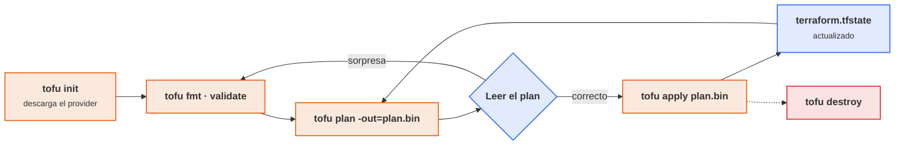
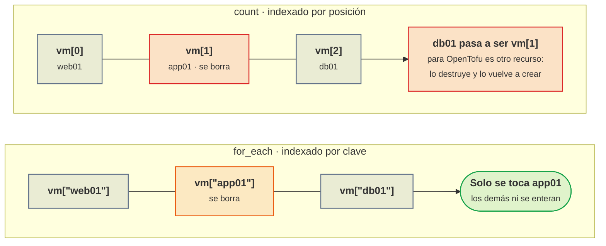
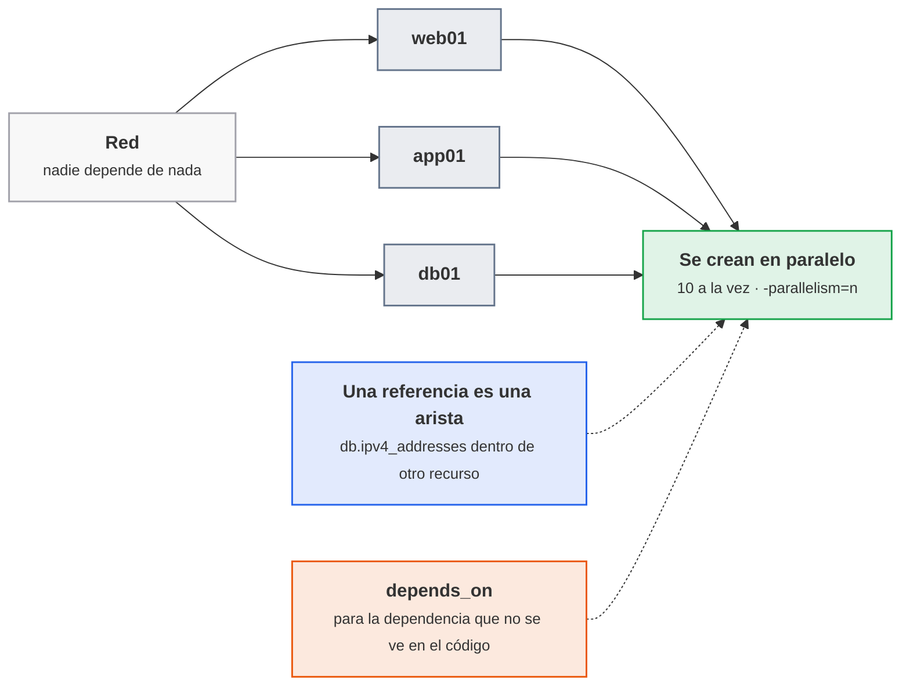
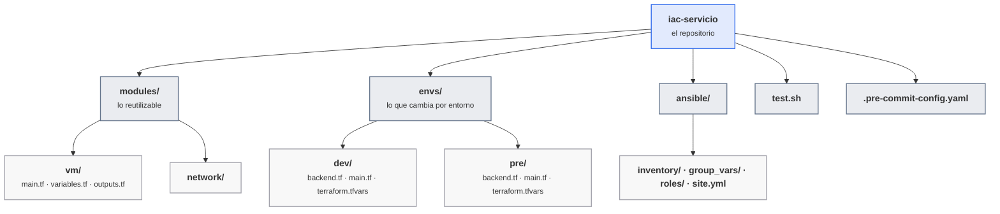
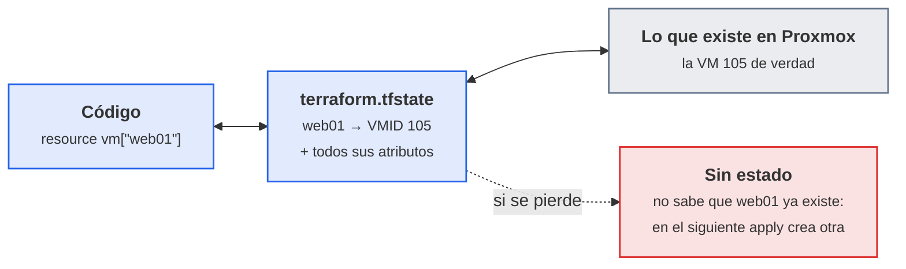

# UT5 · Infraestructura como código

<p class="ut-meta">18 h · Sesiones 20 a 28 · RA3 CE a, b, c, d</p>

En UT2 y UT3 montasteis la VPC y el cortafuegos dos veces: primero a mano en la consola de Proxmox y OPNsense, y después con un script bash que repetía los mismos pasos. El script fue un avance, pero tiene un defecto de fondo: describe cómo llegar, no dónde hay que estar. Si lo ejecutas dos veces crea las cosas dos veces (o falla), y si alguien toca una VM a mano, el script no se entera. En esta unidad cambiamos de enfoque: escribimos en ficheros de texto el estado que queremos (tres VM con estas CPU, estas IP, en estos puentes) y dejamos que una herramienta calcule y aplique la diferencia. Ese código será lo que ejecute el pipeline de Jenkins en UT6, y es el grueso de la primera evaluación (examen en la sesión 29, el 29 de enero de 2027).

## Introducción

Esta unidad se lee en el orden en que se da en clase: primero los conceptos y las herramientas que vamos a manejar, y después las ocho sesiones una detrás de otra, cada una con la teoría que se explica ese día y su hoja de práctica.

### Qué tienes que saber hacer al terminar

- Recoger los requisitos de un servicio (cómputo, memoria, disco, red, disponibilidad, backup) y convertirlos en variables tipadas y validadas, no en números sueltos por el código (CE a).
- Escribir código OpenTofu/Terraform funcional, dividido en módulos y con entornos separados, que aplicado dos veces no cambia nada, y un playbook de Ansible que deja el servicio corriendo con la misma propiedad (CE b).
- Encadenar despliegue, configuración, smoke tests y comprobación de configuración en un script que devuelve 0 o distinto de 0, y saber leer un plan antes de aplicarlo (CE c).
- Pasar checkov, trivy y gitleaks sobre el repositorio, corregir o justificar cada hallazgo, y tener el token de la API fuera del código y del historial de Git (CE d).

### Los conceptos de la unidad

Un jueves de diciembre, a las tres de la tarde, el nodo Proxmox del aula se reinicia por una actualización y la VPC dev que montasteis en noviembre vuelve sin dos de las tres VM. Quien las creó a mano en UT2 tiene que recordar la RAM, el puente, la IP y la clave SSH de cada una, y pierde una tarde en dejarlo parecido. Con el script de UT3 va más rápido, pero el script no sabe qué sobrevivió: o lo lanzas entero y crea duplicados, o vas comentando líneas. Lo que queremos conseguir cabe en una frase: que cualquiera del grupo, con un `git clone` y tres comandos, levante el entorno completo con el servicio funcionando, y que un script diga si está bien.

| Herramienta o concepto | Qué es, en una frase | Para qué la usamos en esta unidad |
|----|----|----|
| OpenTofu (y Terraform) | Programa que lee ficheros con la infraestructura deseada, la compara con lo que existe y crea, cambia o borra lo que haga falta | Crear las VM del servicio en Proxmox a partir de código |
| HCL | El lenguaje de esos ficheros: bloques con atributos, parecido a un JSON con variables | Todo el código `.tf` de la unidad |
| Provider (bpg/proxmox) | El complemento que enseña a OpenTofu a hablar con una plataforma, como un driver de impresora | Que OpenTofu sepa crear y borrar VM en el Proxmox del aula |
| Estado y backend remoto (MinIO) | El fichero donde OpenTofu apunta qué ha creado; el backend es dónde se guarda, y MinIO un servidor de ficheros compatible con S3 | Que OpenTofu recuerde qué VM son suyas y que dos personas no se pisen |
| cloud-init | Lo que configura una VM recién clonada en su primer arranque (IP, usuario, clave SSH), visto en UT1 | Que las VM nazcan accesibles por SSH sin tocar la consola |
| Ansible | Programa que entra por SSH en las máquinas y las deja como se le pide (paquetes, ficheros, servicios), sin instalar nada en ellas | Instalar Docker y desplegar el compose del servicio en las VM creadas |
| Playbook e inventario | El playbook es la lista de tareas en YAML; el inventario, la lista de máquinas y sus grupos | Decir a Ansible qué hacer y en qué hosts |
| Ansible Vault, sops y age | Formas de guardar contraseñas cifradas dentro del repositorio | Que la contraseña de la base de datos vaya en Git sin estar en claro |
| checkov, trivy config y tfsec | Escáneres que leen el código y avisan de configuraciones inseguras, como un corrector ortográfico de seguridad | Encontrar puertos abiertos de más, versiones sin fijar y permisos excesivos |
| gitleaks | Escáner que busca contraseñas y tokens en los ficheros y en todo el historial de Git | Comprobar que ningún secreto ha entrado en el repositorio |
| pre-commit | Programa que ejecuta comprobaciones antes de cada commit y lo bloquea si fallan | Que un commit con un token dentro no llegue a existir |
| jq | Filtro de JSON para la línea de comandos | Convertir las salidas de OpenTofu en el inventario de Ansible |

**Cómo está organizada la unidad.** La unidad sigue las sesiones en orden y cada sesión trae primero la teoría que se explica y después su hoja de práctica. En la sesión 20 instalamos OpenTofu y creamos y destruimos una VM para ver el ciclo `init`, `plan`, `apply`; en la 20 pasamos de los requisitos del servicio a variables con validación, y en la 21 desplegamos las tres VM del servicio con el provider de Proxmox y aprendemos a leer un plan. En la 22 empaquetamos la VM en un módulo, separamos los entornos `dev` y `pre` y llevamos el estado a MinIO con bloqueo. En la 23 Ansible configura esas máquinas y despliega el servicio; en la 24 un `test.sh` encadena despliegue, configuración y pruebas con un código de salida; en la 25 escaneamos el repositorio y en la 26 corregimos los hallazgos. La sesión 28 cierra el repositorio como práctica evaluable, y al final de la página queda la lista de errores frecuentes para consultar mientras trabajáis.

!!! otra "Dónde se usa esto en la otra asignatura"
    - Esta unidad coincide con la [UT4 de Mantenimiento (KPI y pruebas)](https://victor-educ.github.io/apuntes-5169/ut/ut4-kpi-pruebas/), del 15 de diciembre al 28 de enero: allí se prueba el servicio, aquí se crea la infraestructura sobre la que corre.
    - El entorno `pre` que creáis en A5.4 (`envs/pre`) no es un ejercicio de un día: es el que la [UT7 de Mantenimiento](https://victor-educ.github.io/apuntes-5169/ut/ut7-actualizacion-vulnerabilidades/) actualiza en febrero (del 4 al 25 de febrero). A principios de febrero tiene que existir, desplegado con `tofu apply` desde el repositorio y no a mano.
    - La [UT8 de Mantenimiento](https://victor-educ.github.io/apuntes-5169/ut/ut8-terminacion-segura/) (9 a 23 de marzo) da de baja ese entorno con `tofu destroy`, y necesita el repositorio, el estado remoto y el token de Proxmox tal como los dejáis aquí. No borréis el estado cuando termine la práctica.

### Plan de sesiones

Cada sesión de dos horas empieza con una explicación corta y sigue con laboratorio. La columna "Se explica" es lo que cuento yo al principio (con su duración aproximada); la columna "Se practica" es lo que hacéis vosotros con el material de práctica de esta unidad. Las sesiones marcadas solo como práctica no traen teoría nueva.

| Sesión | Fecha | Tipo | Se explica | Se practica |
|---:|-------|------|------------|-------------|
| [20](#sesion-20-iac-conceptos-y-primer-despliegue) | 11 dic | Teoría y práctica | Qué es IaC, declarativo frente a imperativo, idempotencia, estado; OpenTofu y por qué existe (30 min). | Instalar OpenTofu, crear el token de terraform@pve, proyecto mínimo que clona la plantilla; init, plan, apply, plan otra vez, destroy. |
| [21](#sesion-21-requisitos-y-variables) | 16 dic | Teoría y práctica | De los requisitos del servicio a variables tipadas con validación (20 min). | Rellenar la tabla de requisitos del servicio y escribir variables.tf con tipos, descripciones y validaciones. |
| [22](#sesion-22-vm-con-opentofu) | 18 dic | Teoría y práctica | El recurso VM del provider bpg/proxmox, for_each y cómo leer un plan (20 min). | Desplegar web01, app01 y db01 en la VPC dev con cloud-init e IP fija; cambiar la memoria de app01 y comprobar que solo cambia ese recurso. |
| [23](#sesion-23-modulos-y-estado) | 8 ene | Teoría y práctica | Módulos, estructura de repositorio por entornos y backend remoto con bloqueo (20 min). | Extraer el módulo vm, configurar el backend en MinIO, crear envs/dev y envs/pre. |
| [24](#sesion-24-ansible) | 13 ene | Teoría y práctica | Inventario, playbooks, módulos idempotentes, roles y Vault (25 min). | Inventario desde tofu output, playbook que instala Docker y despliega el compose; ejecutarlo dos veces y capturar que la segunda no cambia nada. |
| [25](#sesion-25-pruebas-del-despliegue) | 15 ene | Teoría y práctica | Niveles de prueba del IaC y qué es un smoke test (15 min). | Escribir test.sh que encadena apply, playbook, smoke tests y chequeo de recursos; romper algo a propósito y ver que devuelve error. |
| [26](#sesion-26-escaneo-de-seguridad) | 20 ene | Teoría y práctica | Errores típicos del IaC; checkov, trivy config y gitleaks (15 min). | Ejecutar checkov, trivy config y gitleaks sobre el repositorio y tabular los hallazgos: id, severidad, fichero, descripción. |
| [27](#sesion-27-correccion-de-hallazgos) | 22 ene | Teoría y práctica | Cómo se lee y se suprime un hallazgo; por qué el token no va en el código (10 min). | Corregir los hallazgos altos y críticos, justificar el resto, mover el token a variable de entorno e instalar pre-commit con gitleaks. |
| [28](#sesion-28-practica-evaluable) | 27 ene | Práctica evaluable | Aclaración del enunciado (10 min). | Cerrar el repositorio IaC: README, código modular con dos entornos, playbook, test.sh e informe de seguridad. |

## Sesión 20 · IaC: conceptos y primer despliegue

<p class="ut-meta" markdown>11 de diciembre · Teoría y práctica · <span class="dur" tabindex="0" aria-label="Infraestructura como código · 15 min&#10;OpenTofu: instalación y primer proyecto · 15 min&#10;A5.1 Primer despliegue · 80 min" data-dur="Infraestructura como código · 15 min&#10;OpenTofu: instalación y primer proyecto · 15 min&#10;A5.1 Primer despliegue · 80 min">:material-school:<i class="dur-barra" style="--teoria:27%"></i>:material-flask:</span></p>

Al acabar esta sesión tendrás OpenTofu instalado, un token de la API de Proxmox con los permisos justos y un proyecto mínimo que crea una VM desde la plantilla, comprueba que un segundo `plan` no cambia nada y la destruye. Antes de tocar la terminal vemos qué es la infraestructura como código y por qué exigimos idempotencia, y después el ciclo `init`, `plan`, `apply` y cómo se lee un plan, que es lo que la hoja A5.1 te pide leer antes de decir que sí. El ejemplo completo del provider está en la sesión 22; en A5.1 solo lo recortas a una VM.

### Infraestructura como código

Este primer apartado es de conceptos: qué significa describir la infraestructura en ficheros y por qué la idempotencia es la propiedad que vamos a exigir a todo lo que escribáis.

IaC es describir la infraestructura (máquinas, redes, discos, reglas de cortafuegos, registros DNS) en ficheros de texto que una herramienta aplica automáticamente. Los ficheros van a un repositorio Git como cualquier otro código: se revisan en un pull request (la petición de revisión de cambios de GitLab o GitHub), se versionan, se prueban y se pueden volver a aplicar en otro sitio. Frente a clicar en la consola, aporta cuatro cosas concretas:

- Reproducible: dev, pre y pro salen iguales porque nacen del mismo código con distintos valores.
- Rápido: un entorno completo (tres VM, red, configuración del servicio) tarda minutos, y el tiempo lo pone la máquina, no una persona.
- Auditable: el historial de Git dice quién cambió qué y cuándo, y el plan dice qué va a pasar antes de que pase.
- Recuperable: si se pierde el entorno (un nodo Proxmox que muere, un becario que borra la VM equivocada), se vuelve a aplicar el código.

#### Declarativo frente a imperativo

|  | Declarativo | Imperativo |
|----|----|----|
| Qué se escribe | El estado final deseado ("quiero 3 VM así") | Los pasos ("crea VM, luego disco, luego red") |
| Quién calcula los cambios | La herramienta, comparando lo deseado con lo que existe | Tú, y tienes que prever todos los casos |
| Segunda ejecución | No hace nada si ya está como se pidió | Repite los pasos, con lo que eso implique |
| Ejemplos | Terraform/OpenTofu, CloudFormation, Bicep, manifiestos de Kubernetes | Scripts bash, Ansible (parcialmente) |

Ansible está en la columna imperativa "parcialmente" porque un playbook es una lista ordenada de tareas (imperativo), pero cada tarea es declarativa: `state: present` no dice "instala", dice "que esté instalado", y el módulo comprueba antes de actuar. El resultado es que un playbook bien escrito se comporta como declarativo aunque se lea como una receta.

Lo que une a las dos columnas buenas es la idempotencia: aplicar el código dos veces deja el mismo resultado que una. Es lo que permite ejecutarlo sin miedo, meterlo en un pipeline que corre en cada commit y usarlo para reparar un entorno que alguien ha tocado a mano. Cuando en esta unidad os pida "ejecútalo dos veces y captura la segunda", es esto lo que estoy comprobando.

#### Herramientas

- Terraform (HashiCorp) y su bifurcación libre OpenTofu { .logo-inline } aprovisionan infraestructura (VM, redes, DNS, recursos de nube) a través de providers (el complemento que sabe hablar con cada plataforma: Proxmox, AWS, Cloudflare), en HCL (su propio lenguaje de configuración). Es la herramienta de referencia del sector y la que usamos.
- Ansible { .logo-inline } (Red Hat) configura lo que hay dentro de las máquinas (paquetes, ficheros, servicios) por SSH, sin agente, en YAML. Complementa a Terraform: uno crea la máquina, el otro la deja útil.
- Pulumi: mismo modelo que Terraform pero el código se escribe en Python, TypeScript o Go. Gusta a equipos de desarrollo que no quieren aprender otro lenguaje; en operaciones se ve menos.
- CloudFormation, Bicep y Deployment Manager: los lenguajes propios de AWS, Azure y GCP. Solo sirven en su nube; Terraform sirve en todas y en Proxmox, que es lo que tenemos en el laboratorio.

El patrón del curso, que es también el más habitual en empresas medianas: Terraform crea las VM en Proxmox con cloud-init (la configuración del primer arranque que ya usasteis en la plantilla de UT1); Ansible instala Docker y despliega el servicio; un script de pruebas comprueba que todo responde.

#### Por qué existen Terraform y OpenTofu

Terraform nació en 2014 con licencia MPL 2.0, libre. En agosto de 2023 HashiCorp cambió la licencia de todos sus productos a BSL 1.1 (Business Source License), que prohíbe usar el código para ofrecer un producto que compita con HashiCorp. Para un usuario final no cambia nada, pero para las empresas que habían construido productos sobre Terraform (Spacelift, env0, Scalr, Gruntwork y otras) era un problema serio. En semanas publicaron el manifiesto OpenTF, bifurcaron la última versión MPL y en septiembre de 2023 el proyecto entró en la Linux Foundation con el nombre OpenTofu. La 1.6 salió en enero de 2024 y desde entonces evoluciona por su cuenta: cifrado del estado, evaluación temprana de variables en `backend` y `source` de módulos, `for_each` en providers, la opción `-exclude` en plan y apply. En 2025 IBM completó la compra de HashiCorp, lo que no cambió la licencia de Terraform.

Para nosotros la consecuencia práctica es que el lenguaje, los providers y los ficheros son los mismos. Donde un tutorial diga `terraform plan` tú escribes `tofu plan`, y viceversa. Los providers se descargan de registry.opentofu.org en lugar de registry.terraform.io, pero son los mismos binarios. En clase usamos OpenTofu porque es libre; en una empresa os encontraréis las dos cosas.

### OpenTofu: instalación y primer proyecto

Aquí instalamos la herramienta y aprendemos su ciclo de trabajo: cómo se organiza un proyecto en ficheros, qué hacen `init`, `plan` y `apply`, y cómo se lee un plan antes de decir que sí. Cada actividad empieza con esos tres comandos.

```bash
# OpenTofu en Debian/Ubuntu (instala el repositorio APT oficial)
curl -fsSL https://get.opentofu.org/install-opentofu.sh | sh -s -- --install-method deb
tofu version
```

En macOS `brew install opentofu`; en Windows, `winget install OpenTofu.Tofu`. Si en tu empresa usan Terraform, `terraform version` y el resto de esta unidad se lee igual.

#### Estructura de un proyecto

Un proyecto (en la jerga, un módulo raíz) es un directorio con ficheros `.tf`. OpenTofu los lee todos y los junta; los nombres son una convención, pero es la convención que todo el mundo espera:

| Fichero | Contenido |
|----|----|
| providers.tf | Qué providers se usan, con qué versión, y cómo se conectan |
| variables.tf | Variables de entrada con tipo, descripción, valor por defecto y validaciones |
| main.tf | Recursos y llamadas a módulos |
| outputs.tf | Valores que se exportan (IP, ID) para otros módulos, para Ansible o para leerlos por pantalla |
| terraform.tfvars | Valores de las variables para este entorno. No se sube si contiene secretos (y mejor que no los contenga) |
| .terraform.lock.hcl | Versiones exactas y hashes de los providers descargados. Este sí se sube |

#### El ciclo init, plan, apply



<p class="pie" markdown>El bucle es el trabajo diario. La flecha de «sorpresa» es la importante: si el plan no dice lo que esperabas, se vuelve al código, no se aplica.</p>

1. `tofu init`: descarga los providers al directorio `.terraform/`, escribe el fichero de bloqueo y configura el backend del estado (dónde se guarda el fichero en que OpenTofu apunta lo que ha creado; tiene su apartado más abajo). Hay que repetirlo cuando cambias de backend o añades un provider o módulo.
2. `tofu fmt` y `tofu validate`: formato canónico y comprobación sintáctica y de tipos, sin hablar con Proxmox. Son los dos primeros pasos del pipeline en UT6.
3. `tofu plan`: lee el estado, consulta a la API qué existe de verdad (refresh), compara con el código y muestra qué crearía, cambiaría o destruiría. Siempre se lee antes de aplicar. Con `-out=plan.bin` el plan se guarda y `apply` ejecuta exactamente eso, no un plan recalculado.
4. `tofu apply`: aplica el plan. Sin fichero de plan lo recalcula y pide confirmación; con `-auto-approve` no la pide (solo en scripts y en CI).
5. `tofu destroy`: elimina todo lo que gestiona el estado. En el laboratorio lo usaréis a diario; en producción está protegido por permisos y por `prevent_destroy`.

#### Cómo leer un plan

El plan resume cada recurso con un símbolo, y hay que saber leerlos antes de escribir `yes`:

| Símbolo | Significado | Qué hacer |
|----|----|----|
| `+` create | Recurso nuevo | Normal en el primer apply |
| `~` update in-place | Cambia atributos sin recrear (memoria, nombre) | Normal; leer qué atributo |
| `-` destroy | Se elimina | Solo si lo has pedido tú |
| `-/+` replace | Se destruye y se crea de nuevo | Peligro: se pierde el disco y su contenido |
| `<=` read | Un `data` (bloque de solo lectura) que se consulta en apply | Inofensivo |

La línea `# forces replacement` junto a un atributo es la que más disgustos da. Significa que el provider no sabe cambiar ese atributo en caliente (por ejemplo el nodo donde vive la VM, el `vm_id` o el datastore del disco) y va a resolverlo destruyendo la VM y creando otra. Para una VM web sin estado es molesto; para `db01` es perder la base de datos. El resumen final `Plan: 1 to add, 0 to change, 1 to destroy` cuando esperabas `0 to destroy` es motivo suficiente para parar. Dos protecciones: el bloque `lifecycle { prevent_destroy = true }` en los recursos con datos, que hace fallar el plan en lugar de destruir, y `tofu plan -detailed-exitcode` en CI, que devuelve 2 cuando hay cambios y permite exigir revisión humana.

### A5.1 Primer despliegue (sesión 20)

<span class="et et-obj">Objetivo</span> Una VM clonada de la plantilla 9000 aparece en Proxmox creada por OpenTofu, un segundo `plan` dice `No changes` y `destroy` la elimina.

<span class="et et-pre">Antes de empezar</span> Proxmox del aula accesible en `https://10.10.0.5:8006/` con tu usuario, la plantilla cloud-init 9000 de UT1 y tu clave pública en `~/.ssh/id_ed25519.pub`. Se ha explicado [qué es IaC y la idempotencia](#infraestructura-como-codigo) y [el ciclo init, plan, apply](#el-ciclo-init-plan-apply).

<span class="et et-pas">Pasos</span>

1. Instala OpenTofu y comprueba la versión:

    ```bash
    curl -fsSL https://get.opentofu.org/install-opentofu.sh | sh -s -- --install-method deb
    tofu version
    ```

2. En Proxmox, Datacenter > Permissions > Users, crea `terraform@pve`. En Datacenter > Permissions > API Tokens crea un token para ese usuario con "Privilege Separation" desmarcado. En Datacenter > Permissions > Add, asigna `PVEVMAdmin` sobre `/vms` y `PVEDatastoreUser` sobre `/storage/local-lvm` al usuario. Copia el secreto del token en el momento: no se vuelve a mostrar.
3. Exporta el token en la terminal (solo en la sesión, no en ningún fichero) y comprueba que la API responde:

    ```bash
    export TF_VAR_pve_token='terraform@pve!tofu=xxxxxxxx-xxxx-xxxx-xxxx-xxxxxxxxxxxx'
    curl -k -H "Authorization: PVEAPIToken=$TF_VAR_pve_token" https://10.10.0.5:8006/api2/json/nodes
    ```

4. Crea el directorio `iac-lab` con `providers.tf`, `variables.tf` y `main.tf`. Copia el ejemplo del apartado [Provider Proxmox y una VM completa](#provider-proxmox-y-una-vm-completa) y redúcelo a una sola VM: en `variables.tf` deja `pve_endpoint` y `pve_token`; en `main.tf` quita `for_each` y pon `name = "prueba01"`, `cores = 1`, `dedicated = 1024`, `size = 20`, `bridge = "vdev-front"` y `address = "10.10.1.50/24"` como valores literales. Añade `terraform.tfvars` con `pve_endpoint = "https://10.10.0.5:8006/"`.
5. `tofu init`, `tofu fmt`, `tofu validate`, `tofu plan -out=plan.bin`. Lee el plan entero y cuenta los atributos que lleva la VM aunque tú solo hayas escrito seis; anota el número.
6. `tofu apply plan.bin`. Cuando termine, comprueba en la consola de Proxmox que `prueba01` existe y arranca, y entra con `ssh ops@10.10.1.50`.
7. `tofu plan` otra vez y `tofu destroy`.

<span class="et et-com">Comprobación</span> El segundo `plan` termina en `No changes. Your infrastructure matches the configuration.` y tras `destroy` la VM no aparece en Proxmox. Si `plan` falla con `401 authentication failure`, revisa los permisos del paso 2 en [Errores frecuentes](#errores-frecuentes-en-el-laboratorio).

<span class="et et-ent">Entrega</span> Los ficheros `.tf`, la salida del primer `plan` y la del segundo, en la carpeta `A5.1` de tu repositorio de la asignatura. El tfvars no contiene el token.

<span class="et et-ext">Si te sobra tiempo</span> Cambia `dedicated` a 2048 con la VM creada y mira si el plan marca `~` o `-/+`. Prueba `tofu graph | dot -Tsvg > graph.svg` si tienes graphviz instalado.

## Sesión 21 · Requisitos y variables

<p class="ut-meta" markdown>16 de diciembre · Teoría y práctica · <span class="dur" tabindex="0" aria-label="De los requisitos al código · 10 min&#10;validation y sensitive · 10 min&#10;A5.2 Requisitos y variables · 90 min" data-dur="De los requisitos al código · 10 min&#10;validation y sensitive · 10 min&#10;A5.2 Requisitos y variables · 90 min">:material-school:<i class="dur-barra" style="--teoria:18%"></i>:material-flask:</span></p>

Esta sesión no crea máquinas: escribe el `variables.tf` que las describirá. Partimos de la tabla de requisitos del servicio, con el origen de cada dato, y convertimos cada fila en una variable con tipo, descripción y validación, de modo que un tfvars mal escrito falle en `plan` con un mensaje tuyo. La sintaxis de `validation` y `sensitive`, que forma parte del lenguaje HCL que vemos entero en la sesión 22, se adelanta aquí porque la hoja A5.2 la necesita.

### De los requisitos al código

Antes de escribir una línea de HCL hay que saber qué necesita el servicio, y de dónde sale cada número. Para la aplicación del curso (web + API + PostgreSQL):

| Recurso | Requisito | Origen del dato |
|----|----|----|
| Cómputo | 2 vCPU la app, 1 vCPU el proxy, 2 vCPU la BD | Pruebas de carga previas / recomendación del fabricante |
| Memoria | 2 GB app, 1 GB proxy, 4 GB BD | Idem |
| Almacenamiento | 20 GB SO + 50 GB datos en disco aparte para la BD | Volumen de datos esperado × 3 |
| Red | Subredes front/back/data de la VPC; puertos 443, 8080, 5432 | Diseño UT2/UT3 |
| Disponibilidad | Dos instancias de app tras el proxy | Acuerdo de servicio |
| Backup | Snapshot diario de la BD | Política de la empresa |

La columna "origen del dato" no es decorativa. Cuando dentro de seis meses alguien pregunte por qué la BD tiene 4 GB, la respuesta tiene que estar en el README. Y cada fila acaba siendo una variable en el código, con tipo, descripción y una validación que impida valores absurdos. Un `memory = 512` para PostgreSQL debería fallar en `tofu plan`, no a las tres de la mañana en producción.

### validation y sensitive

```hcl
variable "vms" {
  type = map(object({
    cores  = number
    memory = number
    disk   = number
    bridge = string
    ip     = string
  }))
  description = "VM a crear, con sus requisitos"

  validation {
    condition     = alltrue([for v in values(var.vms) : v.memory >= 1024])
    error_message = "Ninguna VM puede tener menos de 1024 MB."
  }
  validation {
    condition     = alltrue([for v in values(var.vms) : can(cidrhost(v.ip, 0))])
    error_message = "ip debe ser una dirección con prefijo, por ejemplo 10.10.1.10/24."
  }
}

variable "pve_token" {
  type      = string
  sensitive = true
}
```

Las validaciones se evalúan en `plan`, así que un tfvars mal escrito falla en segundos y con un mensaje tuyo. `sensitive = true` hace que el valor aparezca como `(sensitive value)` en el plan y en los outputs. No lo cifra: sigue en claro en el estado. Es una protección contra terminales y logs de CI, no contra quien pueda leer el tfstate.

### A5.2 Requisitos y variables (sesión 21)

<span class="et et-obj">Objetivo</span> Un `variables.tf` con tipos, descripciones y validaciones que rechaza con tu propio mensaje un tfvars mal escrito.

<span class="et et-pre">Antes de empezar</span> El proyecto `iac-lab` de A5.1 (sin VM creadas). Se ha explicado [cómo pasar de los requisitos a variables](#de-los-requisitos-al-codigo); la sintaxis está en [validation y sensitive](#validation-y-sensitive).

<span class="et et-pas">Pasos</span>

1. Copia la tabla de requisitos del apartado "De los requisitos al código" a un `README.md` en la raíz de `iac-lab` y rellénala para el servicio del curso (web + API + PostgreSQL). Cada fila lleva su origen del dato; si no lo sabes, escribe de dónde lo sacarías.
2. Convierte cada fila en una variable. Escribe `variables.tf` con `pve_endpoint`, `pve_token` (sensible) y un `vms` de tipo `map(object({ cores, memory, disk, bridge, ip }))` como el del apartado de validación. Cada variable con `description`.
3. Añade como mínimo tres validaciones: memoria mínima 1024 en todas las VM, `ip` con prefijo (`can(cidrhost(v.ip, 0))`) y una tercera sobre disco (por ejemplo `disk >= 10`) o sobre `bridge` (que esté en `["vdev-front", "vdev-back", "vdev-data"]` con `contains`).
4. Escribe `terraform.tfvars` con las tres VM del servicio y los valores de tu tabla. Sin recursos aún, `main.tf` puede quedar vacío.
5. `tofu fmt`, `tofu validate`, `tofu plan`. Guarda la salida.
6. Copia el tfvars a `malo.tfvars`, pon `memory = 512` en `db01` y ejecuta `tofu plan -var-file=malo.tfvars`. Guarda la salida.

<span class="et et-com">Comprobación</span> `tofu validate` sale con `Success!`, el `plan` correcto no da errores y el `plan` con `malo.tfvars` falla en segundos mostrando tu `error_message`, no un error genérico del provider.

<span class="et et-ent">Entrega</span> `README.md` con la tabla, `variables.tf`, los dos tfvars y las dos salidas de `plan`, en la carpeta `A5.2` del repositorio.

<span class="et et-ext">Si te sobra tiempo</span> Abre `tofu console` y prueba `cidrhost(var.vms["db01"].ip, 1)` y `{ for k, v in var.vms : k => v.memory }` contra tus variables.

## Sesión 22 · VM con OpenTofu

<p class="ut-meta" markdown>18 de diciembre · Teoría y práctica · <span class="dur" tabindex="0" aria-label="El lenguaje HCL · 10 min&#10;Provider Proxmox y una VM completa · 10 min&#10;A5.3 VM completas · 90 min" data-dur="El lenguaje HCL · 10 min&#10;Provider Proxmox y una VM completa · 10 min&#10;A5.3 VM completas · 90 min">:material-school:<i class="dur-barra" style="--teoria:18%"></i>:material-flask:</span></p>

Al acabar tendrás `web01`, `app01` y `db01` corriendo en la VPC dev, creadas por un solo bloque `resource` con `for_each` y configuradas por cloud-init, y habrás visto un plan que cambia la memoria de una sola VM sin recrearla. Primero repasamos el lenguaje HCL (tipos de bloque, tipos de dato, `for_each` y las funciones de red) y después el proyecto completo con el provider `bpg/proxmox`, que es el que copias en A5.3. Para leer el plan del paso 6 vuelve a la tabla de símbolos de la sesión 20.

### El lenguaje HCL

Aquí vemos la sintaxis con la que se escribe todo lo anterior. No hace falta memorizarla entera: con los tipos de bloque, los tipos de dato, `for_each` y media docena de funciones se escribe casi todo un proyecto.

HCL (HashiCorp Configuration Language) es un lenguaje declarativo de bloques y atributos. Un fichero `.tf` es una serie de bloques `tipo "etiqueta" "etiqueta" { atributo = expresión }`. Los tipos de bloque que vais a usar:

```hcl
terraform {                      # ajustes del propio proyecto: versiones y backend
  required_version = ">= 1.9"
  required_providers {
    proxmox = { source = "bpg/proxmox", version = "~> 0.60" }
  }
}

provider "proxmox" { ... }       # cómo conectar con la API

variable "memory" {              # entrada
  type        = number
  description = "RAM en MB"
  default     = 2048
}

locals {                         # valores calculados, para no repetir
  gateway = cidrhost(var.cidr, 1)
}

data "proxmox_virtual_environment_nodes" "all" {}   # lectura, no crea nada

resource "proxmox_virtual_environment_vm" "web" { ... }   # lo que se crea

module "vm" { source = "./modules/vm" ... }   # llamada a un módulo

output "ip" { value = local.ip }  # salida
```

#### Tipos y expresiones

Los tipos primitivos son `string`, `number` y `bool`. Los compuestos: `list(T)`, `set(T)`, `map(T)` (claves string) y `object({ campo = T, ... })`, que se pueden anidar. Un `map(object({...}))` es el tipo que más vais a escribir: un diccionario de máquinas con sus atributos, como en el ejemplo del provider. Las expresiones admiten referencias (`var.x`, `local.y`, `resource_type.name.attr`, `module.m.output`), operadores, condicionales `cond ? a : b`, interpolación en cadenas `"${var.env}-web"`, y bucles `for`:

```hcl
[for k, v in var.vms : k if v.bridge == "vdev-front"]   # lista de nombres del front
{ for k, v in var.vms : k => v.ip }                      # mapa nombre => IP
```

#### count frente a for_each

Las dos formas de crear varios recursos con un bloque. `count = 3` crea `vm[0]`, `vm[1]`, `vm[2]` indexadas por posición; si borras la del medio, la tercera pasa a ser `vm[1]` y OpenTofu la destruye y la recrea porque para él es otra. `for_each = var.vms` crea `vm["web01"]`, `vm["app01"]`, indexadas por clave: borrar `app01` del mapa solo toca `app01`. Regla: `count` para "n copias idénticas" o para activar o desactivar un recurso (`count = var.enabled ? 1 : 0`); `for_each` para todo lo demás. Dentro del bloque se accede con `each.key` y `each.value`.



<p class="pie" markdown>`count` solo para «n copias idénticas» o para activar y desactivar un recurso. Para todo lo demás, `for_each`.</p>


#### locals y funciones útiles

`locals` guarda valores calculados una vez y usados varias. Las funciones que salen en todos los proyectos:

| Función | Ejemplo | Resultado |
|----|----|----|
| `cidrhost(prefix, n)` | `cidrhost("10.10.1.0/24", 1)` | `10.10.1.1` (la puerta de enlace) |
| `cidrsubnet(prefix, bits, n)` | `cidrsubnet("10.10.0.0/16", 8, 2)` | `10.10.2.0/24` (subred n de la VPC) |
| `cidrnetmask(prefix)` | `cidrnetmask("10.10.1.0/24")` | `255.255.255.0` |
| `lookup(map, key, default)` | `lookup(var.sizes, "db", 2048)` | valor o 2048 si no existe |
| `file(path)` | `file("~/.ssh/id_ed25519.pub")` | contenido del fichero |
| `templatefile(path, vars)` | `templatefile("ci.tftpl", { user = "ops" })` | fichero renderizado (cloud-init) |
| `format`, `join`, `split` | `format("%s-%02d", "web", 3)` | `web-03` |
| `merge(a, b)` | `merge(local.defaults, each.value)` | objeto con valores por defecto sobreescritos |
| `try(expr, default)` | `try(each.value.disk, 20)` | 20 si el campo no existe |

`tofu console` abre una consola donde probar cualquiera de estas expresiones contra las variables del proyecto antes de meterlas en el código.

#### El grafo de dependencias

OpenTofu no ejecuta los bloques en el orden del fichero. Construye un grafo dirigido: cada referencia (`proxmox_virtual_environment_vm.db.ipv4_addresses` dentro de otro recurso) es una arista, y los recursos sin dependencias entre sí se crean en paralelo (10 a la vez por defecto, `-parallelism=n`). Por eso las tres VM del laboratorio se crean a la vez y por eso el orden de destrucción es el inverso. Cuando una dependencia existe pero no se ve en el código (un recurso que necesita que otro exista aunque no use ninguno de sus atributos), se declara con `depends_on = [recurso]`. `tofu graph | dot -Tsvg > graph.svg` dibuja el grafo.



<p class="pie" markdown>El orden del fichero da igual: manda el grafo. Y como manda el grafo, destruir va exactamente al revés de crear.</p>


### Provider Proxmox y una VM completa

Con el lenguaje y el estado vistos, toca crear máquinas de verdad: un proyecto completo que clona la plantilla cloud-init de UT1 tres veces en la VPC dev, base de las actividades A5.3 y A5.4.

Hay dos providers para Proxmox con uso real: `Telmate/proxmox`, el histórico, y `bpg/proxmox`, más completo y mantenido, que es el que usamos. El ejemplo del curso, completo. Fíjate en tres cosas: el token entra por variable y no por fichero, `for_each` sobre el mapa `vms` hace que un solo bloque `resource` cree las tres VM, y el bloque `initialization` es lo que cloud-init aplica en el primer arranque (IP, puerta de enlace, usuario y clave SSH):

```hcl
# providers.tf
terraform {
  required_providers {
    proxmox = { source = "bpg/proxmox", version = "~> 0.60" }
  }
}

provider "proxmox" {
  endpoint  = var.pve_endpoint
  api_token = var.pve_token      # usuario!token=uuid, nunca en el código
  insecure  = true               # certificado autofirmado del laboratorio
}

# variables.tf
variable "pve_endpoint" {
  type = string
}
variable "pve_token" {
  type      = string
  sensitive = true
}
variable "vms" {
  type = map(object({ cores = number, memory = number, disk = number, bridge = string, ip = string }))
}

# main.tf
resource "proxmox_virtual_environment_vm" "vm" {
  for_each  = var.vms
  name      = each.key
  node_name = "pve"

  clone { vm_id = 9000 }                     # plantilla cloud-init de UT1

  cpu    { cores = each.value.cores }
  memory { dedicated = each.value.memory }

  disk {
    datastore_id = "local-lvm"
    interface    = "scsi0"
    size         = each.value.disk
  }

  network_device { bridge = each.value.bridge }

  agent { enabled = true }                   # qemu-guest-agent, para leer la IP

  initialization {
    ip_config {
      ipv4 {
        address = each.value.ip
        gateway = cidrhost(each.value.ip, 1)
      }
    }
    user_account {
      username = "ops"
      keys     = [file("~/.ssh/id_ed25519.pub")]
    }
  }
}

# outputs.tf
output "ips" { value = { for k, v in var.vms : k => v.ip } }
```

```hcl
# terraform.tfvars (dev)
pve_endpoint = "https://10.10.0.5:8006/"
vms = {
  web01 = { cores = 1, memory = 1024, disk = 20, bridge = "vdev-front", ip = "10.10.1.10/24" }
  app01 = { cores = 2, memory = 2048, disk = 20, bridge = "vdev-back",  ip = "10.10.2.10/24" }
  db01  = { cores = 2, memory = 4096, disk = 70, bridge = "vdev-data",  ip = "10.10.3.10/24" }
}
```

El token va en la variable de entorno `TF_VAR_pve_token`, no en ningún fichero. OpenTofu lee cualquier `TF_VAR_nombre` como valor de la variable `nombre`. En Proxmox el token se crea en Datacenter > Permissions > API Tokens para un usuario `terraform@pve` con el rol `PVEVMAdmin` sobre `/vms` y `PVEDatastoreUser` sobre `/storage/local-lvm`; desmarca "Privilege Separation" o asigna los permisos al token, que si no hereda nada. El `disk` de 70 GB en `db01` cumple la fila de almacenamiento de la tabla de requisitos (20 de SO + 50 de datos); en el laboratorio lo dejamos en un solo disco por simplicidad, en la práctica evaluable se pide el segundo disco aparte.

!!! ojo "La sintaxis exacta del provider cambia entre versiones"
    Los nombres de bloques y atributos de `bpg/proxmox` (por ejemplo `initialization`, `ip_config`, `user_account`) han cambiado varias veces entre versiones 0.x, y seguirán haciéndolo. El ejemplo de arriba corresponde a la serie 0.6x. Antes de copiar nada, abre la página del recurso en https://registry.opentofu.org/providers/bpg/proxmox/latest/docs (o la equivalente en registry.terraform.io) para la versión que tengas fijada en `required_providers`, y no subas la versión sin leer el changelog.

### A5.3 VM completas (sesión 22)

<span class="et et-obj">Objetivo</span> `web01`, `app01` y `db01` corriendo en la VPC dev, accesibles por SSH, y un cambio de memoria que el plan resuelve con `~` sobre un solo recurso.

<span class="et et-pre">Antes de empezar</span> `iac-lab` con el `variables.tf` y el tfvars de A5.2, `TF_VAR_pve_token` exportado, la VPC dev de UT2 con los puentes `vdev-front`, `vdev-back` y `vdev-data`. Se ha explicado [el recurso VM del provider](#provider-proxmox-y-una-vm-completa), [for_each](#count-frente-a-for_each) y [cómo leer un plan](#como-leer-un-plan).

<span class="et et-pas">Pasos</span>

1. Escribe `main.tf` y `outputs.tf` con el ejemplo completo del apartado del provider: `for_each = var.vms`, `clone { vm_id = 9000 }`, `agent { enabled = true }` y el bloque `initialization` con IP, puerta de enlace y tu clave pública.
2. Comprueba antes de nada que la plantilla 9000 tiene `qemu-guest-agent` (en el nodo, `qm config 9000` debe mostrar `agent: 1`); si no, el apply se quedará en `Still creating...`.
3. `tofu init` (hay provider nuevo si vienes de un directorio limpio), `tofu fmt`, `tofu validate`, `tofu plan -out=plan.bin`. El resumen debe ser `Plan: 3 to add, 0 to change, 0 to destroy`.
4. `tofu apply plan.bin` y `tofu output ips`.
5. Entra en las tres: `ssh ops@10.10.1.10`, `ssh ops@10.10.2.10`, `ssh ops@10.10.3.10`. Si alguna no tiene IP, revisa el punto de cloud-init en [Errores frecuentes](#errores-frecuentes-en-el-laboratorio).
6. Cambia `memory` de `app01` a 3072 en `terraform.tfvars` y ejecuta `tofu plan`. Guarda la salida completa. Aplica.

<span class="et et-com">Comprobación</span> El plan del paso 6 lleva exactamente un recurso con `~ update in-place`, `Plan: 0 to add, 1 to change, 0 to destroy`, y ninguna línea `# forces replacement`. Un `tofu plan` posterior dice `No changes`.

<span class="et et-ent">Entrega</span> `main.tf`, `outputs.tf`, el tfvars y la salida del plan del paso 6, en `A5.3`. No destruyas las VM: A5.4 sigue sobre ellas.

<span class="et et-ext">Si te sobra tiempo</span> Cambia `node_name` o `datastore_id` solo en el plan (sin aplicar) y localiza la línea `# forces replacement`. Añade `lifecycle { prevent_destroy = true }` a la VM y observa qué pasa con ese mismo plan.

## Sesión 23 · Módulos y estado

<p class="ut-meta" markdown>8 de enero · Teoría y práctica · <span class="dur" tabindex="0" aria-label="Módulos, entornos y estructura del repositorio · 5 min&#10;El estado a fondo · 15 min&#10;A5.4 Módulos y estado · 90 min" data-dur="Módulos, entornos y estructura del repositorio · 5 min&#10;El estado a fondo · 15 min&#10;A5.4 Módulos y estado · 90 min">:material-school:<i class="dur-barra" style="--teoria:18%"></i>:material-flask:</span></p>

Con las tres VM vivas, en esta sesión el repositorio adopta la forma que tendrá hasta marzo: un módulo `vm`, un directorio por entorno (`envs/dev`, `envs/pre`) y el estado en MinIO con bloqueo. Empezamos por los módulos y la estructura por entornos, y seguimos con el estado: qué contiene, cómo se guarda en un backend remoto y cómo se mueve un recurso al módulo con `moved` o `state mv` sin que el plan quiera destruirlo. La hoja A5.4 recorre exactamente ese camino.

### Módulos, entornos y estructura del repositorio

Con un proyecto que ya funciona, el siguiente problema es no repetirlo: tres VM en dev, cuatro en pre, otras en pro, cada una con los mismos cuarenta atributos. Aquí empaquetamos la VM en un módulo y separamos los entornos de forma que un error en dev no pueda tocar pro.

Un módulo es un directorio con ficheros `.tf` que recibe variables y devuelve outputs. Cualquier proyecto es ya un módulo (el raíz); un módulo hijo se llama con `module "app" { source = "./modules/vm" ... }` y se accede a sus salidas con `module.app.ip`. Sirve para que el equipo de plataforma publique "así se hace una VM aquí" y los demás solo pasen nombre, tamaño y red. Dos reglas de diseño: un módulo hace una cosa (una VM, una subred, un bucket) y no configura su propio provider, que hereda del raíz.

Para los entornos hay dos caminos. Los workspaces (`tofu workspace new pre`) mantienen varios estados para el mismo código y exponen `terraform.workspace` como variable; sirven cuando la única diferencia entre entornos son valores. El directorio por entorno (`envs/dev`, `envs/pre`, `envs/pro`), cada uno con su backend, su tfvars y sus llamadas a los módulos comunes, es lo que prefieren la mayoría de los equipos, y lo que usamos: se ve de un vistazo qué hay en cada entorno, un error en `dev` no puede tocar el estado de `pro`, los permisos del backend se dan por directorio y el pipeline solo tiene que hacer `cd envs/pre`. Los workspaces comparten backend y credenciales, y es fácil aplicar en el workspace equivocado.



<p class="pie" markdown>La separación que importa es `modules/` frente a `envs/`: el módulo no sabe en qué entorno vive, y el entorno solo aporta sus valores.</p>

El módulo `vm` expone como mínimo `name`, `cores`, `memory`, `disk`, `bridge`, `ip` como variables y `ip` y `vm_id` como outputs. `envs/dev/main.tf` lo llama con `for_each = var.vms` y pasa `each.value`. Los módulos se pueden versionar aparte y referenciar por Git (`source = "git::https://gitlab.lab/iac/modules.git//vm?ref=v1.2.0"`), que es como se hace cuando varios repositorios los comparten.

### El estado a fondo

El estado es la pieza que hace que OpenTofu sea declarativo, y también la que más disgustos da cuando se trabaja en equipo. Vemos qué contiene, dónde guardarlo para que dos personas no se pisen y qué comandos lo tocan sin romperlo.

`terraform.tfstate` es un JSON con la correspondencia entre cada bloque `resource` del código y el objeto real: su ID en Proxmox, todos sus atributos tal como el provider los leyó la última vez, las dependencias y la versión del provider. Sin estado OpenTofu no sabe que `vm["web01"]` es el VMID 105 y en el siguiente apply intentaría crear otra. !!! ojo "El estado es un fichero con secretos dentro"
    Como guarda todos los atributos tal como el provider los leyó, guarda también las contraseñas de
    cloud-init, los tokens y cualquier valor que un recurso devuelva. Nunca va al repositorio, ni siquiera
    «temporalmente para probar»: el historial de Git no se olvida.



<p class="pie" markdown>El estado es lo que convierte el código en declarativo: sin él no hay forma de saber qué bloque corresponde a qué máquina.</p>

Reglas:

- Nunca editarlo a mano. Para moverlo o limpiarlo están los subcomandos `tofu state`.
- En equipo, guardarlo en un backend remoto con bloqueo, no en Git. Dos personas aplicando a la vez sobre el mismo estado lo corrompen.
- Protegerlo como un secreto: permisos en el bucket, cifrado, sin copias en el portátil.
- `.gitignore` con `*.tfstate`, `*.tfstate.*` y `.terraform/`. Si el estado ha entrado en el repositorio alguna vez, tratarlo como un secreto filtrado.

#### Backend remoto: s3 contra MinIO

En el laboratorio usaremos MinIO (un servidor S3 libre) en una VM de la subred de gestión. La configuración del backend usa el mismo protocolo que AWS S3 y solo hay que desactivar las comprobaciones que son de AWS:

```hcl
terraform {
  backend "s3" {
    bucket                      = "tfstate"
    key                         = "envs/dev/terraform.tfstate"
    region                      = "main"
    endpoints                   = { s3 = "http://10.10.0.20:9000" }
    use_path_style              = true
    skip_credentials_validation = true
    skip_region_validation      = true
    skip_requesting_account_id  = true
    skip_metadata_api_check     = true
    use_lockfile                = true
  }
}
```

Las credenciales van en `AWS_ACCESS_KEY_ID` y `AWS_SECRET_ACCESS_KEY` (o en `-backend-config=` en `init`), nunca en el bloque. `use_lockfile = true` implementa el bloqueo con un fichero `.tflock` junto al estado mediante escrituras condicionales de S3, sin necesidad de DynamoDB (la tabla de AWS que Terraform usaba para el bloqueo); requiere una versión reciente de MinIO. El bloqueo hace que un segundo `apply` simultáneo falle con `Error acquiring the state lock` en lugar de pisar el estado. Si alguien pierde la conexión con el bloqueo tomado, `tofu force-unlock ID` lo libera, solo después de comprobar que nadie está aplicando de verdad. Como alternativa en clase puede usarse el backend `http` que ofrece GitLab, que también bloquea.

OpenTofu añade algo que Terraform no tiene: cifrado del estado en cliente, con un bloque `encryption` dentro de `terraform {}` y una clave derivada de una passphrase o de un KMS (un servicio de gestión de claves). Con eso, lo que llega a MinIO ya va cifrado. Documentado en https://opentofu.org/docs/language/state/encryption/.

#### Manipular el estado

```bash
tofu state list                                    # qué recursos gestiona
tofu state show 'module.vm["db01"].proxmox_virtual_environment_vm.this'
tofu state mv 'proxmox_virtual_environment_vm.vm["db01"]' 'module.vm["db01"].proxmox_virtual_environment_vm.this'
tofu state rm 'proxmox_virtual_environment_vm.vm["tmp"]'   # olvida el recurso, no lo destruye
tofu import 'proxmox_virtual_environment_vm.legacy' pve/105  # adopta una VM que ya existía
```

`state mv` es lo que os salva cuando extraéis un recurso a un módulo (actividad A5.4): sin él, el plan quiere destruir `vm["db01"]` y crear `module.vm["db01"]`, que para OpenTofu son direcciones distintas. Esto mismo se puede escribir en el código con un bloque `moved { from = ... to = ... }`, que queda versionado y se aplica en el siguiente plan; es preferible al comando en proyectos de equipo. `import` adopta un recurso creado a mano: OpenTofu lo lee y lo mete en el estado, y el siguiente plan muestra la diferencia entre lo que hay y lo que dice tu código. El formato del ID (`nodo/vmid` en el caso de bpg) lo dice la documentación de cada recurso. También existe el bloque `import { to = ..., id = ... }` con la opción `-generate-config-out=` que escribe el HCL por ti.

### A5.4 Módulos y estado (sesión 23)

<span class="et et-obj">Objetivo</span> El repositorio queda con `modules/vm`, `envs/dev` y `envs/pre`, el estado en MinIO con bloqueo, y las tres VM de A5.3 siguen vivas sin haberse recreado.

<span class="et et-pre">Antes de empezar</span> Las VM de A5.3 desplegadas y su `terraform.tfstate` local. Acceso a MinIO en `http://10.10.0.20:9000` (lo monta el profesor en la subred de gestión; alternativa, el backend `http` de GitLab) con una clave de acceso por grupo. Se han explicado [módulos y entornos](#modulos-entornos-y-estructura-del-repositorio), el [backend remoto](#backend-remoto-s3-contra-minio) y [cómo mover recursos en el estado](#manipular-el-estado).

<span class="et et-pas">Pasos</span>

1. Crea `modules/vm/` con `main.tf` (un solo `resource "proxmox_virtual_environment_vm" "this"` sin `for_each`, con `var.name`, `var.cores`, `var.memory`, `var.disk`, `var.bridge`, `var.ip`), `variables.tf` con esas seis variables y `outputs.tf` con `ip` y `vm_id`. El módulo no lleva bloque `provider`.
2. Crea `envs/dev/` y mueve allí `providers.tf`, `variables.tf`, `outputs.tf` y `terraform.tfvars`. Su `main.tf` queda así:

    ```hcl
    module "vm" {
      source   = "../../modules/vm"
      for_each = var.vms
      name     = each.key
      cores    = each.value.cores
      memory   = each.value.memory
      disk     = each.value.disk
      bridge   = each.value.bridge
      ip       = each.value.ip
    }
    ```

3. Copia el `terraform.tfstate` de A5.3 a `envs/dev/`, ejecuta `tofu init` y añade a `main.tf` un bloque `moved` por VM, o ejecuta el `state mv` equivalente:

    ```hcl
    moved {
      from = proxmox_virtual_environment_vm.vm["web01"]
      to   = module.vm["web01"].proxmox_virtual_environment_vm.this
    }
    ```

4. `tofu plan`: debe decir `No changes` (o solo el aviso de movimientos). Si quiere destruir y crear, no apliques: falta un `moved`.
5. Añade `envs/dev/backend.tf` con el bloque `backend "s3"` del apartado del estado (`key = "envs/dev/terraform.tfstate"`), exporta `AWS_ACCESS_KEY_ID` y `AWS_SECRET_ACCESS_KEY` y ejecuta `tofu init -migrate-state`. Responde `yes` a copiar el estado.
6. `tofu state list` debe listar las tres VM; borra el `terraform.tfstate` local (queda `terraform.tfstate.backup`, bórralo también) y repite `tofu state list`.
7. Desde dos terminales, lanza `tofu apply` a la vez y captura el `Error acquiring the state lock` de la segunda. Responde `no` en la primera.
8. Crea `envs/pre/` copiando `dev`: cambia `key` a `envs/pre/terraform.tfstate` en `backend.tf` y en el tfvars añade `app02` (IP `10.10.2.11/24`) y usa los puentes `vpre-*`. `tofu init` y `tofu plan` (sin aplicar si no hay red pre todavía).
9. Escribe el `.gitignore` con `.terraform/`, `*.tfstate`, `*.tfstate.*` y `plan.bin`, y haz commit de todo.

<span class="et et-com">Comprobación</span> `git status` no muestra ningún tfstate; `tofu state list` en `envs/dev` responde desde MinIO; el plan del paso 4 no destruyó nada; el error de bloqueo está capturado.

<span class="et et-ent">Entrega</span> El repositorio con `modules/`, `envs/` y `.gitignore`, más las salidas de los pasos 4, 6 y 7, en `A5.4`. Este estado remoto se queda hasta marzo: lo usa Mantenimiento.

<span class="et et-ext">Si te sobra tiempo</span> Añade una variable `env` al módulo y úsala en el nombre (`"${var.env}-${var.name}"`); mira en el plan qué atributos fuerza a recrear un cambio de nombre en bpg/proxmox.

## Sesión 24 · Ansible

<p class="ut-meta" markdown>13 de enero · Teoría y práctica · <span class="dur" tabindex="0" aria-label="Ansible · 25 min&#10;A5.5 Ansible · 85 min" data-dur="Ansible · 25 min&#10;A5.5 Ansible · 85 min">:material-school:<i class="dur-barra" style="--teoria:23%"></i>:material-flask:</span></p>

Al acabar, el servicio del curso corre en `app01` desplegado por un playbook cuyo inventario sale de `tofu output`, y la segunda pasada termina con `changed=0`. Vemos el inventario (a mano y generado con `jq`), los comandos ad hoc, el playbook con handlers, por qué los módulos son idempotentes y cómo se organiza en roles cuando crece; Vault y ansible-lint cierran el apartado y los usa la hoja A5.5 en su último paso y en la ampliación.

### Ansible

Ansible configura las máquinas que OpenTofu ha creado. No instala agente: necesita SSH y un intérprete de Python en el destino, cosa que cualquier imagen cloud de Debian o Ubuntu trae. Desde la máquina de control (tu portátil, o el agente de Jenkins en UT6) se conecta a cada host, copia un pequeño programa Python (el módulo), lo ejecuta y recoge el resultado en JSON. Instalación con `pipx install ansible` (pipx instala herramientas Python cada una en su entorno aislado) o el paquete de la distribución; `ansible --version` debe indicar core 2.18 o superior.

#### Inventario

El inventario lista los hosts y los agrupa. En INI, el formato del original:

```ini
# inventory.ini
[web]
web01 ansible_host=10.10.1.10

[app]
app01 ansible_host=10.10.2.10

[db]
db01 ansible_host=10.10.3.10

[servicio:children]
web
app
db

[all:vars]
ansible_user=ops
ansible_python_interpreter=/usr/bin/python3
```

El mismo inventario en YAML, que es el que ansible-lint (el revisor de estilo de Ansible, al final de este apartado) prefiere:

```yaml
all:
  vars:
    ansible_user: ops
  children:
    web: { hosts: { web01: { ansible_host: 10.10.1.10 } } }
    app: { hosts: { app01: { ansible_host: 10.10.2.10 } } }
    db:  { hosts: { db01:  { ansible_host: 10.10.3.10 } } }
```

`ansible-inventory -i inventory.yml --graph` dibuja los grupos y sirve para comprobar que has agrupado bien.

#### Inventario generado desde los outputs de OpenTofu

Escribir el inventario a mano duplica lo que ya está en tfvars, y se desincroniza a la primera. `tofu output -json` devuelve todos los outputs en JSON, y con `jq` (el filtro de JSON de la línea de comandos) se convierte en inventario en cinco líneas:

```bash
#!/usr/bin/env bash
# gen-inventory.sh: genera ansible/inventory.ini desde los outputs de envs/dev
set -euo pipefail
cd "$(dirname "$0")/envs/${ENV:-dev}"
tofu output -json ips | jq -r '
  to_entries
  | map(. + { group: (.key | sub("[0-9]+$"; "")) })
  | group_by(.group)
  | map("[\(.[0].group)]\n" + (map("\(.key) ansible_host=\(.value | split("/")[0])") | join("\n")))
  | join("\n\n")' > ../../ansible/inventory.ini
printf '\n[all:vars]\nansible_user=ops\n' >> ../../ansible/inventory.ini
```

Agrupa por el nombre sin el número final (`web01` va al grupo `web`, `db01` a `db`) y quita el `/24` de la IP. En proyectos más grandes se usa el plugin de inventario `cloud.terraform.terraform_state`, que lee el estado directamente; el script se entiende entero.

#### Comandos ad hoc y playbooks

Un comando ad hoc ejecuta un módulo en un grupo sin escribir playbook. Sirve para comprobar y para arreglar cosas puntuales:

```bash
ansible -i inventory.ini all -m ping                          # conectividad y Python
ansible -i inventory.ini db -m setup -a 'filter=ansible_memtotal_mb'
ansible -i inventory.ini app -b -m apt -a 'name=htop state=present'
```

Un playbook es un fichero YAML con una o más jugadas (plays), cada una con un grupo de hosts y una lista de tareas. El de abajo deja el servicio del curso corriendo en `app01`; fíjate en que cada tarea tiene nombre, usa el nombre completo del módulo y describe un estado (`present`, `directory`), no una acción:

```yaml
# site.yml
- name: Configurar los servidores de aplicación
  hosts: app
  become: true
  vars:
    app_dir: /opt/app
  tasks:
    - name: Instalar Docker y el plugin compose
      ansible.builtin.apt:
        name: [docker.io, docker-compose-v2]
        state: present
        update_cache: true

    - name: Crear el directorio del servicio
      ansible.builtin.file:
        path: "{{ app_dir }}"
        state: directory
        mode: "0755"

    - name: Copiar el fichero compose
      ansible.builtin.copy:
        src: files/compose.yml
        dest: "{{ app_dir }}/compose.yml"
        mode: "0644"
      notify: Reiniciar el servicio

    - name: Levantar el servicio
      community.docker.docker_compose_v2:
        project_src: "{{ app_dir }}"
        state: present

  handlers:
    - name: Reiniciar el servicio
      community.docker.docker_compose_v2:
        project_src: "{{ app_dir }}"
        state: restarted
```

`ansible-playbook -i inventory.ini site.yml`. La primera vez todo sale `changed`; la segunda todo `ok` y el resumen final tiene `changed=0`. Si en la segunda pasada algo sigue en `changed`, esa tarea no es idempotente y hay que arreglarla: casi siempre es un `command` o `shell` sin `creates:` o `changed_when:`.

#### Módulos idempotentes y handlers

Cada módulo compara el estado pedido con el real antes de tocar nada: `apt` consulta dpkg, `copy` compara el hash del fichero, `service` pregunta a systemd, `user` lee `/etc/passwd`. `command` y `shell` no pueden saber nada de eso, así que siempre informan `changed`; se usan solo cuando no hay módulo, con `creates: /ruta` (no ejecutar si existe) o `changed_when: false` (es una consulta). Los handlers son tareas que solo se ejecutan si alguna tarea con `notify` ha cambiado algo, y una sola vez al final de la jugada aunque las notifiquen cinco tareas. Los nombres completos de los módulos (`ansible.builtin.apt` en lugar de `apt`) son obligatorios para ansible-lint y evitan ambigüedades con colecciones instaladas. Las colecciones (paquetes de módulos, como `community.docker`) que no vienen con `ansible-core` se instalan con `ansible-galaxy collection install community.docker` o, mejor, con un `requirements.yml` en el repositorio.

#### Roles, variables y group_vars

Cuando el playbook pasa de veinte tareas, se parte en roles: directorios con estructura fija que Ansible carga solo. `ansible-galaxy role init roles/docker` crea el esqueleto:

```text
roles/docker/
  tasks/main.yml        # las tareas
  handlers/main.yml     # los handlers
  defaults/main.yml     # variables con la prioridad más baja (el usuario las sobreescribe)
  vars/main.yml         # variables internas del rol
  templates/            # ficheros Jinja2 (.j2), plantillas con variables, para el módulo template
  files/                # ficheros que se copian tal cual
  meta/main.yml         # dependencias de otros roles
```

Y `site.yml` queda en `- hosts: app`, `roles: [docker, app_compose]`. Las variables por grupo van en `group_vars/app.yml` y `group_vars/db.yml`, y las de todos en `group_vars/all.yml`; por host, en `host_vars/db01.yml`. La precedencia va de `defaults` del rol (la más baja) a `-e` en la línea de comandos (la más alta), pasando por group_vars, host_vars y `vars` del play. Cuando una variable no toma el valor que esperas, `ansible-inventory --host db01` muestra lo que Ansible ha resuelto para ese host.

#### Ansible Vault

Las contraseñas de la base de datos o las claves del registro de contenedores no pueden ir en claro en `group_vars`. Vault cifra ficheros o valores sueltos con AES-256 y una contraseña:

```bash
ansible-vault create group_vars/db/vault.yml       # abre el editor, guarda cifrado
ansible-vault encrypt_string 'S3cr3t0' --name 'db_password'   # un solo valor, para pegar en YAML
ansible-playbook site.yml --ask-vault-pass          # o --vault-password-file ~/.vault_pass
```

El fichero cifrado sí se sube a Git (empieza por `$ANSIBLE_VAULT;1.1;AES256` y gitleaks lo reconoce como cifrado). La contraseña del vault se pasa por entorno o por fichero fuera del repositorio; en UT6 la inyecta Jenkins como credencial.

#### ansible-lint, --check y --diff

`ansible-lint` (`pipx install ansible-lint`) revisa sintaxis, nombres completos de módulos, tareas sin `name`, permisos sin especificar en `copy`, y tiene un perfil `production` más exigente. Va en el pipeline junto a `tofu validate`. `ansible-playbook --check` ejecuta en modo simulación: cada módulo dice qué cambiaría sin cambiarlo (los que no lo soportan se saltan), y `--diff` muestra el diff de cada fichero que `copy`, `template` o `lineinfile` van a tocar. `--check --diff` juntos son el equivalente al `tofu plan` de Ansible, y `--limit db01` restringe a un host cuando estás depurando.

### A5.5 Ansible (sesión 24)

<span class="et et-obj">Objetivo</span> El servicio del curso corre en `app01` desplegado por un playbook cuyo inventario sale de `tofu output`, y la segunda pasada termina con `changed=0`.

<span class="et et-pre">Antes de empezar</span> Las VM de `envs/dev` levantadas (`tofu state list` las muestra), acceso SSH como `ops` a las tres, el `compose.yml` del servicio de UT3 a mano. Se han explicado [inventario, playbooks y módulos idempotentes](#ansible), el [inventario generado desde los outputs](#inventario-generado-desde-los-outputs-de-opentofu) y los handlers.

<span class="et et-pas">Pasos</span>

1. Instala Ansible y el linter: `pipx install ansible` y `pipx install ansible-lint`; `ansible --version` debe dar core 2.18 o superior. Instala la colección: `ansible-galaxy collection install community.docker` y guarda esa línea en `ansible/requirements.yml`.
2. Copia `gen-inventory.sh` del apartado del inventario a la raíz del repositorio, dale permisos (`chmod +x`) y ejecútalo. Mira `ansible/inventory.ini`: tres grupos con la IP sin `/24`.
3. `ansible -i ansible/inventory.ini all -m ping`: los tres hosts deben responder `pong`. Si sale `Permission denied`, añade `ansible_ssh_private_key_file=~/.ssh/id_ed25519` a `[all:vars]` en el script.
4. Crea `ansible/files/compose.yml` con el compose del servicio y `ansible/site.yml` con el playbook del apartado "Comandos ad hoc y playbooks" (apt, file, copy con `notify`, `docker_compose_v2` y el handler `Reiniciar el servicio`).
5. `ansible-playbook -i ansible/inventory.ini ansible/site.yml`. Todas las tareas salen `changed` la primera vez. Comprueba con `ssh ops@10.10.2.10 docker ps` que los contenedores corren.
6. Vuelve a ejecutar el playbook y guarda la salida completa: el resumen debe llevar `changed=0`. Si no, localiza la tarea con `--diff` y corrígela.
7. Cambia una línea en `files/compose.yml` (por ejemplo una etiqueta), ejecuta de nuevo y comprueba que solo `Copiar el fichero compose` cambia y que el handler reinicia el servicio.
8. `ansible-lint ansible/site.yml` y corrige todo lo que marque hasta que salga limpio.

<span class="et et-com">Comprobación</span> La segunda pasada del paso 6 termina en `ok=N changed=0 unreachable=0 failed=0`; `ansible-lint` no devuelve hallazgos; el servicio responde en `curl http://10.10.2.10:8080/health` (o el puerto de vuestro compose).

<span class="et et-ent">Entrega</span> `gen-inventory.sh`, `ansible/` completo y las salidas de las dos ejecuciones, en `A5.5`. Las VM se quedan levantadas para A5.6.

<span class="et et-ext">Si te sobra tiempo</span> Parte el playbook en dos roles con `ansible-galaxy role init roles/docker` y `roles/app_compose`, y mueve `app_dir` a `group_vars/app.yml`.

## Sesión 25 · Pruebas del despliegue

<p class="ut-meta" markdown>15 de enero · Teoría y práctica · <span class="dur" tabindex="0" aria-label="Pruebas del despliegue · 15 min&#10;A5.6 Pruebas del despliegue · 95 min" data-dur="Pruebas del despliegue · 15 min&#10;A5.6 Pruebas del despliegue · 95 min">:material-school:<i class="dur-barra" style="--teoria:14%"></i>:material-flask:</span></p>

Esta sesión convierte el despliegue en algo que se puede afirmar o negar con un código de salida: un `test.sh` que aplica, configura, lanza smoke tests, compara la máquina con los requisitos y comprueba la idempotencia. Primero los niveles de prueba del IaC, del más barato al más caro, y después el script que copias en A5.6 y rompes a propósito para ver que falla donde debe.

### Pruebas del despliegue

Un despliegue que no se prueba no está terminado: OpenTofu puede acabar sin error con una VM que no arranca, y Ansible puede decir `ok` con un servicio que no responde. Aquí montamos la cadena que va del `apply` a un código de salida 0 o distinto de 0, que es lo que el pipeline de UT6 ejecutará en cada commit.

```mermaid
flowchart LR
    T["<b>tofu apply</b>"]:::act
    O["<b>tofu output -json</b>"]:::dato
    I["<b>gen-inventory.sh</b><br><small>del estado al inventario</small>"]:::act
    A["<b>ansible-playbook site.yml</b>"]:::act
    S["<b>Smoke tests</b><br><small>curl, nc</small>"]:::pieza
    C["<b>Chequeo de configuración</b><br><small>cores, RAM, disco</small>"]:::pieza
    R{"<b>¿exit 0?</b>"}:::dato
    OK(["<b>Despliegue válido</b>"]):::ok
    KO(["<b>Fallo: revisar y repetir</b>"]):::riesgo
    T --> O --> I --> A --> S --> C --> R
    R -- sí --> OK
    R -- no --> KO
    classDef act fill:#ea580c22,stroke:#ea580c,stroke-width:1.5px
    classDef pieza fill:#64748b22,stroke:#64748b,stroke-width:1.5px
    classDef dato fill:#2563eb22,stroke:#2563eb,stroke-width:1.5px
    classDef infra fill:#a1a1aa14,stroke:#a1a1aa,stroke-width:1.5px
    classDef ok fill:#16a34a22,stroke:#16a34a,stroke-width:1.5px
    classDef riesgo fill:#dc262622,stroke:#dc2626,stroke-width:1.5px
```



<p class="pie" markdown>El inventario sale del estado, no se escribe a mano: así no hay forma de que Ansible configure una máquina que ya no existe.</p>

Probar infraestructura es probar por niveles, del más barato al más caro. Cada nivel atrapa un tipo de error distinto y ninguno sustituye a los demás:

| Nivel | Qué se prueba | Cómo | Cuándo |
|----|----|----|----|
| Estático | Sintaxis, formato, buenas prácticas | `tofu fmt -check`, `tofu validate`, `ansible-lint`, `checkov` | En cada commit, en segundos, sin credenciales |
| Plan | Que el plan sea el esperado y nada se destruya por sorpresa | Leer `tofu plan`; `tofu plan -detailed-exitcode` en CI (0 sin cambios, 2 con cambios, 1 error) | Antes de cada apply |
| Unitario | Que un módulo produce los recursos que debe con unas entradas dadas | `tofu test` con ficheros `.tftest.hcl`; Molecule (el marco de pruebas de roles de Ansible) para roles | Al cambiar el módulo o el rol |
| Servicio | Que lo desplegado funciona de verdad | Smoke test: `curl -f https://app.lab/health`, `nc -zv 10.10.3.10 5432` | Después de cada apply |
| Configuración | Que la máquina es como se pidió | `ansible -m setup` y comparar `ansible_processor_vcpus`, `ansible_memtotal_mb`, tamaño de disco con los requisitos | Después de cada apply |
| Idempotencia | Segunda ejecución sin cambios | `tofu plan` = "No changes"; `ansible-playbook` con `changed=0` | Después de cada apply |

#### test.sh

El script que pide la actividad A5.6 y la práctica encadena los niveles Servicio, Configuración e Idempotencia. Lo importante es la disciplina de `set -euo pipefail` (para en el primer comando que falle, en variables sin definir y en tuberías rotas) y que cada comprobación salga con un mensaje claro:

```bash
#!/usr/bin/env bash
set -euo pipefail
ENV="${1:-dev}"
cd "$(dirname "$0")"

fail() { echo "FALLO: $*" >&2; exit 1; }

echo "== Despliegue"
( cd "envs/$ENV" && tofu apply -auto-approve -input=false )
./gen-inventory.sh
ansible-playbook -i ansible/inventory.ini ansible/site.yml

echo "== Smoke tests"
curl -fsS --max-time 5 http://10.10.1.10/health >/dev/null || fail "la web no responde en /health"
nc -zv -w 3 10.10.3.10 5432 || fail "PostgreSQL no escucha en 5432"

echo "== Configuración contra requisitos"
vcpus=$(ansible -i ansible/inventory.ini db01 -m setup -a 'filter=ansible_processor_vcpus' \
        | grep -o '"ansible_processor_vcpus": [0-9]*' | grep -o '[0-9]*$')
[ "$vcpus" -ge 2 ] || fail "db01 tiene $vcpus vCPU, se pedían 2"
mem=$(ansible -i ansible/inventory.ini db01 -m setup -a 'filter=ansible_memtotal_mb' \
        | grep -o '"ansible_memtotal_mb": [0-9]*' | grep -o '[0-9]*$')
[ "$mem" -ge 3900 ] || fail "db01 tiene $mem MB, se pedían 4096"

echo "== Idempotencia"
( cd "envs/$ENV" && tofu plan -detailed-exitcode -input=false >/dev/null ) || fail "el plan no está limpio"
ansible-playbook -i ansible/inventory.ini ansible/site.yml | tee /tmp/second.log | tail -5
grep -q 'changed=0' /tmp/second.log || fail "la segunda pasada de Ansible ha cambiado algo"

echo "OK: despliegue $ENV válido"
```

El umbral de memoria es 3900 y no 4096 porque el kernel reserva parte y `ansible_memtotal_mb` devuelve lo que ve el SO. Pruébalo rompiendo algo a propósito: baja `memory` de `db01` en tfvars, aplica y comprueba que el script sale con código 1 y el mensaje correcto. Un script de pruebas que nunca has visto fallar no prueba nada.

#### tofu test y Molecule

`tofu test` ejecuta ficheros `tests/*.tftest.hcl` con bloques `run` que hacen un plan o un apply del módulo con variables de prueba y comprueban asserts:

```hcl
run "memoria_minima" {
  command = plan
  variables { name = "t", cores = 1, memory = 2048, disk = 20, bridge = "vdev-front", ip = "10.10.1.50/24" }
  assert {
    condition     = proxmox_virtual_environment_vm.this.memory[0].dedicated == 2048
    error_message = "La memoria no se ha propagado al recurso"
  }
}
```

Con `command = plan` no crea nada y sirve para probar módulos en CI sin Proxmox. Molecule hace lo mismo para roles de Ansible: levanta un contenedor o una VM, aplica el rol dos veces y ejecuta verificaciones. En la práctica evaluable no se piden.

### A5.6 Pruebas del despliegue (sesión 25)

<span class="et et-obj">Objetivo</span> Un `test.sh` que despliega, configura y comprueba el entorno dev, y que devuelve 0 cuando todo está bien y distinto de 0 cuando algo falla, demostrado con las dos salidas.

<span class="et et-pre">Antes de empezar</span> El repositorio tal como quedó en A5.5 (envs, playbook, `gen-inventory.sh`), `TF_VAR_pve_token` y las credenciales de MinIO exportadas, `curl` y `nc` instalados. Se han explicado [los niveles de prueba](#pruebas-del-despliegue) y el [script test.sh](#testsh).

<span class="et et-pas">Pasos</span>

1. Copia el `test.sh` del apartado a la raíz del repositorio y `chmod +x test.sh`. Ajusta las URL de los smoke tests a tu servicio: la ruta `/health` de la web y el puerto de PostgreSQL. Si la web todavía no sirve `/health`, usa la ruta que responda 200.
2. Ajusta los umbrales de la sección "Configuración contra requisitos" a tu tabla de A5.2 (vCPU y MB de `db01`). Si tu `db01` no es 4096 MB, cambia el 3900 en proporción.
3. `./test.sh dev` con todo en orden. Guarda la salida completa y el código de salida: `echo $?` justo después debe dar `0`.
4. Rompe la configuración: baja `memory` de `db01` a 2048 en `envs/dev/terraform.tfvars` y ejecuta `./test.sh dev` otra vez. Guarda salida y `echo $?`.
5. Restaura la memoria, aplica, y rompe ahora el servicio: `ssh ops@10.10.1.10 sudo docker stop <contenedor web>`. Ejecuta el script y guarda salida y código de salida.
6. Restaura el contenedor (o deja que el playbook lo levante) y pasa `./test.sh dev` una última vez para dejarlo en verde.

<span class="et et-com">Comprobación</span> La ejecución del paso 3 termina con `OK: despliegue dev válido` y `$?` igual a 0. Las de los pasos 4 y 5 terminan con una línea `FALLO: ...` que nombra la causa correcta (memoria de db01, web sin responder) y `$?` distinto de 0. Ninguna ejecución se queda colgada: si `curl` o `nc` tardan, revisa los `--max-time` y `-w`.

<span class="et et-ent">Entrega</span> `test.sh` y las tres salidas (correcta, memoria baja, web parada) con su código de salida, en `A5.6`.

<span class="et et-ext">Si te sobra tiempo</span> Añade una comprobación de disco (`ansible_devices` en `-m setup`) o escribe un `tests/vm.tftest.hcl` para `modules/vm` con `command = plan`, como el del apartado de tofu test.

## Sesión 26 · Escaneo de seguridad

<p class="ut-meta" markdown>20 de enero · Teoría y práctica · <span class="dur" tabindex="0" aria-label="Seguridad del IaC · 15 min&#10;A5.7 Escaneo de seguridad · 95 min" data-dur="Seguridad del IaC · 15 min&#10;A5.7 Escaneo de seguridad · 95 min">:material-school:<i class="dur-barra" style="--teoria:14%"></i>:material-flask:</span></p>

Al acabar, tienes la lista completa de hallazgos de checkov, trivy y gitleaks sobre el repositorio, tabulada por severidad. Vemos los errores típicos del IaC, los cuatro escáneres y cómo se lee y se suprime un hallazgo con su justificación; corregirlos es la sesión 27.

### Seguridad del IaC

El código de infraestructura tiene un problema que el código de aplicación no tiene: un fallo no es un bug, es una VM con SSH abierto a todo Internet o un token de administrador en GitHub. Los errores que más se repiten:

- Secretos en claro (tokens de API, contraseñas de BD) en tfvars, en `group_vars` o en el propio HCL, subidos a Git. Una vez en el historial, están ahí aunque los borres en el siguiente commit.
- Puertos abiertos a `0.0.0.0/0`, usuarios con permisos de administrador donde bastaba `PVEVMUser`, discos y buckets sin cifrar.
- Versiones de provider y de módulos sin fijar, imágenes base sin actualizar desde hace un año.
- Estado de Terraform en el repositorio, con todo lo anterior dentro.

#### Escáneres

Cuatro herramientas, cada una con su foco. En el laboratorio pasamos las cuatro:

| Herramienta | Qué revisa | Instalación | Comando |
|----|----|----|----|
| checkov | Terraform, Ansible, Docker, Kubernetes, Helm, con cientos de reglas de configuración | `pipx install checkov` | `checkov -d .` |
| trivy config | Misma familia de reglas, integrado con el escáner de imágenes y dependencias que usaremos en 5169 | paquete apt del repositorio de Aqua, o `brew install trivy` | `trivy config .` |
| tfsec | Específico de Terraform; sus reglas se han integrado en trivy y el proyecto está en mantenimiento | binario de GitHub | `tfsec .` |
| gitleaks | Secretos en el árbol de trabajo y en todo el historial de Git, por patrones y entropía | `brew install gitleaks` o binario | `gitleaks detect -v` (o `gitleaks git` en versiones recientes) |

checkov y trivy se solapan bastante; se pasan los dos porque las reglas no son idénticas y porque en una empresa os pedirán uno u otro. gitleaks es de otra categoría: no mira la calidad del código, mira si has filtrado algo, y es el único que revisa commits antiguos.

#### Cómo leer un hallazgo y cómo suprimirlo

Un hallazgo de checkov tiene este aspecto:

```text
Check: CKV_TF_1: "Ensure Terraform module sources use a commit hash"
        FAILED for resource: module.vm
        File: /envs/dev/main.tf:12-18
        Guide: https://docs.prismacloud.io/...
```

Id de la regla, qué comprueba, recurso y fichero con líneas, y un enlace con la explicación. Cada hallazgo se trata como una incidencia: se corrige, o se documenta por escrito por qué se acepta el riesgo. La supresión va en el código, junto al recurso, con la justificación en la misma línea para que quien lea el fichero la vea:

```hcl
resource "proxmox_virtual_environment_vm" "vm" {
  #checkov:skip=CKV_TF_1: módulo local del mismo repositorio, no aplica el hash
  #trivy:ignore:AVD-XXX-0001 laboratorio sin TLS válido; en pro el endpoint tiene certificado
  ...
}
```

tfsec usa `#tfsec:ignore:regla` con la misma idea, y gitleaks un fichero `.gitleaksignore` con la huella del hallazgo (commit:fichero:regla:línea). Una supresión sin justificación no vale; en la práctica evaluable cuenta como hallazgo sin corregir. Y un hallazgo de gitleaks sobre un secreto real nunca se suprime: se rota el secreto (se revoca el token en Proxmox y se crea otro) y, si el repositorio no es público, se reescribe el historial con `git filter-repo` (la herramienta que reescribe todos los commits para quitar el fichero o la línea). Si es público, se da por quemado aunque reescribas.

### A5.7 Escaneo de seguridad (sesión 26)

<span class="et et-obj">Objetivo</span> Tabla completa de hallazgos de checkov, trivy y gitleaks sobre el repositorio, con id, severidad, fichero y descripción.

<span class="et et-pre">Antes de empezar</span> El repositorio de A5.6 con todo en commit. Se han explicado [los escáneres](#escaneres) y [cómo leer y suprimir un hallazgo](#como-leer-un-hallazgo-y-como-suprimirlo).

<span class="et et-pas">Pasos</span>

1. Instala las herramientas: `pipx install checkov`, trivy desde el repositorio de Aqua (o `brew install trivy`), gitleaks desde el binario de GitHub o `brew`.
2. Desde la raíz del repositorio ejecuta los tres escáneres y guarda cada salida en `informe/antes-*.txt`:

    ```bash
    checkov -d . > informe/antes-checkov.txt
    trivy config . > informe/antes-trivy.txt
    gitleaks detect -v > informe/antes-gitleaks.txt   # o gitleaks git -v
    ```

3. Escribe `informe/hallazgos.md` con una tabla: id, severidad, fichero, descripción, decisión (corregir o aceptar).

<span class="et et-com">Comprobación</span> La tabla cubre todos los hallazgos de severidad alta o crítica de los tres informes.

<span class="et et-ent">Entrega</span> La carpeta `informe/` (antes, `hallazgos.md`), en `A5.7`.

## Sesión 27 · Corrección de hallazgos

<p class="ut-meta" markdown>22 de enero · Teoría y práctica · <span class="dur" tabindex="0" aria-label="Explicación · 10 min&#10;A5.8 Corrección de hallazgos · 100 min" data-dur="Explicación · 10 min&#10;A5.8 Corrección de hallazgos · 100 min">:material-school:<i class="dur-barra" style="--teoria:9%"></i>:material-flask:</span></p>

Al acabar, el repositorio pasa checkov, trivy y gitleaks sin hallazgos altos ni críticos sin justificar, el token de Proxmox no está en ningún fichero ni en el historial y pre-commit bloquea un commit que lo contenga. Se explican las opciones para guardar secretos y el `.gitignore` y `pre-commit` que la hoja A5.8 instala.

#### Gestión de secretos

Del más simple al más serio, y todos se usan:

- Variables de entorno en local: `export TF_VAR_pve_token=...` en la sesión, o en un fichero `.env` que está en `.gitignore` y se carga con `source`. Suficiente para un portátil; no sirve para compartir.
- sops con age (age es un cifrador de ficheros con par de claves, como SSH; sops es el editor que lo aplica campo a campo): cifra ficheros YAML o JSON campo a campo, de modo que las claves siguen legibles y solo los valores van cifrados. El fichero cifrado se sube a Git y se descifra con la clave privada de cada persona autorizada. `age-keygen -o ~/.config/sops/age/keys.txt`, un `.sops.yaml` en el repositorio con las claves públicas del equipo, `sops -e secrets.yaml > secrets.enc.yaml` y `sops -d` para leer. Terraform lo lee con el provider `carlpett/sops` (`data "sops_file"`), Ansible con la colección `community.sops`. Es la opción que recomiendo para equipos pequeños.
- HashiCorp Vault (u OpenBao, su fork libre por la misma razón que OpenTofu): un servidor de secretos con autenticación, políticas, rotación y auditoría. Terraform los lee con el provider `vault` y Ansible con `community.hashi_vault`. Es lo que veréis en empresas grandes; montarlo bien es un proyecto en sí.
- En el pipeline (UT6) los secretos los guarda Jenkins como credenciales y los inyecta como variables de entorno en el job, de modo que nunca están en disco en el agente.

#### .gitignore y pre-commit

El `.gitignore` mínimo de un repositorio de IaC:

```text
.terraform/
*.tfstate
*.tfstate.*
*.tfplan
plan.bin
*.tfvars          # excepto los de ejemplo:
!*.example.tfvars
.env
*.pem
.vault_pass
```

Los tfvars con valores no sensibles (tamaños, nombres, IP internas) pueden subirse, y en `envs/` de hecho deben subirse porque son la definición del entorno. La regla se cambia a `**/secrets*.tfvars` en ese caso. Y para que nada de esto dependa de acordarse, pre-commit ejecuta los escáneres antes de cada commit:

```yaml
# .pre-commit-config.yaml
repos:
  - repo: https://github.com/antonbabenko/pre-commit-terraform
    rev: v1.99.0
    hooks:
      - id: terraform_fmt
      - id: terraform_validate
      - id: terraform_checkov
  - repo: https://github.com/gitleaks/gitleaks
    rev: v8.24.0
    hooks:
      - id: gitleaks
```

`pipx install pre-commit`, `pre-commit install` en el repositorio, y a partir de ahí un commit con un token dentro no llega a existir. Los hooks de pre-commit-terraform llaman al binario `terraform` por defecto; con `PCT_TFPATH=tofu` en el entorno usan OpenTofu. Las etiquetas `rev` de arriba son las de un momento concreto; `pre-commit autoupdate` las sube.

### A5.8 Corrección de hallazgos (sesión 27)

<span class="et et-obj">Objetivo</span> El repositorio pasa checkov, trivy y gitleaks sin hallazgos altos ni críticos sin justificar, no tiene secretos en el historial y pre-commit bloquea un commit con un token.

<span class="et et-pre">Antes de empezar</span> La tabla de hallazgos de A5.7. Se han explicado [.gitignore y pre-commit](#gitignore-y-pre-commit).

<span class="et et-pas">Pasos</span>

1. Instala `pipx install pre-commit`.
2. Corrige todos los hallazgos altos y críticos: versión de provider fijada, `sensitive = true` donde falte, permisos de ficheros en `copy`, lo que salga. Para los que decidas aceptar, pon la supresión junto al recurso con la justificación en la misma línea (`#checkov:skip=ID: motivo`, `#trivy:ignore:ID motivo`) y copia la justificación al informe.
3. Si gitleaks ha encontrado el token en algún commit: revoca el token en Proxmox, crea uno nuevo, expórtalo en `TF_VAR_pve_token` y reescribe el historial con `git filter-repo` (solo si el repositorio no es público). Repite `gitleaks detect` hasta que no quede nada.
4. Crea `.pre-commit-config.yaml` con el contenido del apartado (pre-commit-terraform y gitleaks), exporta `PCT_TFPATH=tofu` y ejecuta `pre-commit install` y `pre-commit run --all-files`.
5. Demuestra el bloqueo: crea `prueba.tf` con la línea `api_token = "terraform@pve!tofu=12345678-1234-1234-1234-123456789abc"`, haz `git add` y `git commit`. Captura el rechazo de gitleaks y borra el fichero.
6. Vuelve a pasar los tres escáneres a `informe/despues-*.txt`.

<span class="et et-com">Comprobación</span> Los ficheros `despues-*` no contienen hallazgos de severidad alta o crítica que no estén en la tabla como aceptados y suprimidos con motivo; `gitleaks detect` sale sin hallazgos en todo el historial; la captura del paso 5 muestra el commit bloqueado.

<span class="et et-ent">Entrega</span> `informe/despues-*.txt`, `.pre-commit-config.yaml` y las supresiones en el código, en `A5.8`. Este informe es el punto 5 de la práctica evaluable.

<span class="et et-ext">Si te sobra tiempo</span> Cifra la contraseña de la base de datos con `ansible-vault encrypt_string` y muévela a `group_vars/db/vault.yml`, o prueba sops con age sobre un `secrets.yaml` y comprueba que gitleaks lo da por limpio.

## Sesión 28 · Práctica evaluable

<p class="ut-meta" markdown>27 de enero · Práctica evaluable · <span class="dur" tabindex="0" aria-label="Aclaración del enunciado · 10 min&#10;Trabajo en la práctica · 100 min" data-dur="Aclaración del enunciado · 10 min&#10;Trabajo en la práctica · 100 min">:material-school:<i class="dur-barra" style="--teoria:9%"></i>:material-flask:</span></p>

La sesión empieza con diez minutos de aclaración del enunciado y el resto es trabajo sobre vuestro repositorio. Todo lo que se pide se ha construido en las hojas A5.1 a A5.8; aquí se cierra, se documenta en el README y se entrega. Ten a mano la lista de errores frecuentes del final de la página.

Entrega un repositorio Git con:

1. `README.md`: requisitos del servicio (tabla con origen del dato), cómo desplegar, cómo probar, cómo destruir.
2. Código OpenTofu modular (`modules/vm` como mínimo) con entornos `dev` y `pre` en directorios, backend remoto con bloqueo, versiones de provider fijadas y sin secretos en ningún fichero ni en el historial. La BD con su disco de datos aparte y `prevent_destroy`.
3. Playbook Ansible (con roles o sin ellos, pero con nombres completos de módulo y handlers) que deja el servicio funcionando, e inventario generado desde los outputs.
4. `test.sh` con smoke tests y comprobación de configuración, que devuelve 0 o distinto de 0.
5. Informe de seguridad: hallazgos, correcciones y justificaciones, con el antes/después de los escáneres.

Checklist antes de entregar:

- [ ] `tofu fmt -check`, `tofu validate` y `ansible-lint` limpios
- [ ] Segundo `tofu plan` con `No changes` y segundo playbook con `changed=0`
- [ ] `gitleaks detect` sin hallazgos en todo el historial
- [ ] `.gitignore` con tfstate, `.terraform/` y ficheros de secretos
- [ ] `test.sh` probado fallando y acertando

| Criterio | RA3 | Peso |
|----|----|----|
| Requisitos recogidos y trasladados a variables | a | 20 % |
| Código de despliegue funcional, modular e idempotente | b | 30 % |
| Ejecución con pruebas de servicio y chequeo de configuración | c | 25 % |
| Seguridad verificada: escaneo, correcciones, sin secretos | d | 25 % |

## Errores frecuentes en el laboratorio

- `Error: 401 authentication failure` en el primer `plan`. El token no tiene permisos: creado con separación de privilegios y sin ACL propia, o el formato no es `usuario@realm!nombre=uuid`. Se comprueba en Datacenter > Permissions, y con `curl -k -H "Authorization: PVEAPIToken=$TF_VAR_pve_token" https://10.10.0.5:8006/api2/json/nodes`.
- `Error: x509: certificate signed by unknown authority`. El certificado de Proxmox es autofirmado y falta `insecure = true` en el provider (o, mejor en pro, la CA en el sistema).
- El apply se queda minutos en `Still creating...` y acaba en timeout. Casi siempre `agent { enabled = true }` con una plantilla que no tiene `qemu-guest-agent` instalado: el provider espera a que el agente informe de la IP. Instala el agente en la plantilla 9000 o quita el bloque.
- La VM arranca pero no tiene la IP que le diste. cloud-init no ha corrido porque la plantilla no tenía el disco cloud-init (`ide2`) o el clon lo ha perdido; `qm config 105` en el nodo muestra si existe. También pasa si clonas una VM que ya arrancó una vez, cloud-init solo aplica en el primer arranque.
- `Error acquiring the state lock` sin que nadie esté aplicando. Un apply anterior murió con el bloqueo puesto (Ctrl+C, portátil cerrado). `tofu force-unlock ID` con el ID que muestra el error, tras comprobar con el compañero.
- El plan quiere destruir y crear las tres VM después de mover el recurso al módulo. Falta `tofu state mv` o el bloque `moved`. No apliques: son las mismas VM con otra dirección en el estado.
- `Plan: 0 to add, 1 to change` cada vez que ejecutas plan, sin haber tocado nada. Un atributo que el provider lee distinto de como lo escribiste (mayúsculas en una MAC, tamaño de disco en G en vez de GB, orden de una lista). Se pone en el código el valor que devuelve el provider, o se añade a `lifecycle { ignore_changes = [...] }` con una justificación.
- Ansible: `Permission denied (publickey)`. La clave que cloud-init instaló no es la que usa tu agente SSH, o el usuario no es `ops`. `ssh -v ops@10.10.2.10` lo dice; `ansible_ssh_private_key_file` en el inventario lo arregla.
- Ansible: `/usr/bin/python3: not found`. Imagen mínima sin Python; `ansible -m raw -a 'apt-get install -y python3'` una vez, o meter el paquete en la plantilla.
- La segunda pasada del playbook sigue diciendo `changed=1`. Una tarea `command` sin `creates` o `changed_when`, o un `copy` de un fichero que otra tarea modifica después. El módulo `debug` y `--diff` localizan cuál.
- gitleaks encuentra el token en un commit de hace tres semanas aunque ya no está en el fichero. Está en el historial. Rota el token en Proxmox primero, reescribe el historial después.

Los enlaces para ampliar y los apartados que van más allá de lo que se hace en clase están en [Para ampliar](../ampliacion.md#ut5-infraestructura-como-codigo).
