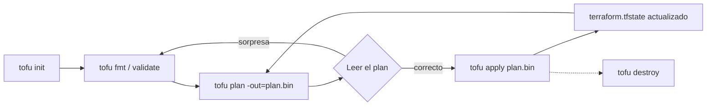
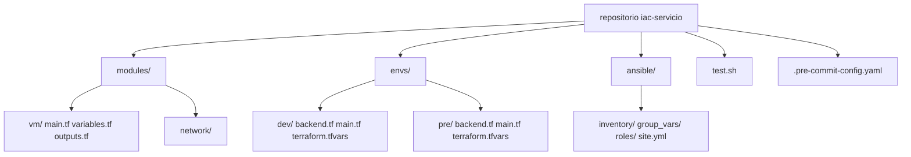
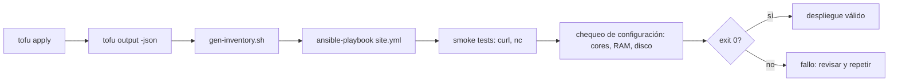

# UT5 · Infraestructura como código

<p class="ut-meta">Módulo 5166 · 18 h · Sesiones 20 a 28 · RA3 CE a, b, c, d</p>

En UT2 y UT3 montasteis la VPC y el cortafuegos dos veces: primero a mano en la consola de Proxmox y OPNsense, y después con un script bash que repetía los mismos pasos. El script fue un avance, pero tiene un defecto de fondo: describe cómo llegar, no dónde hay que estar. Si lo ejecutas dos veces crea las cosas dos veces (o falla), y si alguien toca una VM a mano, el script no se entera. En esta unidad cambiamos de enfoque: escribimos en ficheros de texto el estado que queremos (tres VM con estas CPU, estas IP, en estos puentes) y dejamos que una herramienta calcule y aplique la diferencia. Ese código será lo que ejecute el pipeline de Jenkins en UT6, y es el grueso de la primera evaluación (examen en la sesión 29, el 29 de enero de 2027).

## Qué tienes que saber hacer al terminar

- Recoger los requisitos de un servicio (cómputo, memoria, disco, red, disponibilidad, backup) y convertirlos en variables tipadas y validadas, no en números sueltos por el código (CE a).
- Escribir código OpenTofu/Terraform funcional, dividido en módulos y con entornos separados, que aplicado dos veces no cambia nada, y un playbook de Ansible que deja el servicio corriendo con la misma propiedad (CE b).
- Encadenar despliegue, configuración, smoke tests y comprobación de configuración en un script que devuelve 0 o distinto de 0, y saber leer un plan antes de aplicarlo (CE c).
- Pasar checkov, trivy y gitleaks sobre el repositorio, corregir o justificar cada hallazgo, y tener el token de la API fuera del código y del historial de Git (CE d).

## Infraestructura como código

IaC es describir la infraestructura (máquinas, redes, discos, reglas de cortafuegos, registros DNS) en ficheros de texto que una herramienta aplica automáticamente. Los ficheros van a un repositorio Git como cualquier otro código: se revisan en un pull request, se versionan, se prueban y se pueden volver a aplicar en otro sitio. Frente a clicar en la consola, aporta cuatro cosas concretas:

- Reproducible: dev, pre y pro salen iguales porque nacen del mismo código con distintos valores. Se acaba el "en mi entorno funciona".
- Rápido: un entorno completo (tres VM, red, configuración del servicio) tarda minutos, y el tiempo lo pone la máquina, no una persona.
- Auditable: el historial de Git dice quién cambió qué y cuándo, y el plan dice qué va a pasar antes de que pase.
- Recuperable: si se pierde el entorno (un nodo Proxmox que muere, un becario que borra la VM equivocada), se vuelve a aplicar el código.

### Declarativo frente a imperativo

|  | Declarativo | Imperativo |
|----|----|----|
| Qué se escribe | El estado final deseado ("quiero 3 VM así") | Los pasos ("crea VM, luego disco, luego red") |
| Quién calcula los cambios | La herramienta, comparando lo deseado con lo que existe | Tú, y tienes que prever todos los casos |
| Segunda ejecución | No hace nada si ya está como se pidió | Repite los pasos, con lo que eso implique |
| Ejemplos | Terraform/OpenTofu, CloudFormation, Bicep, manifiestos de Kubernetes | Scripts bash, Ansible (parcialmente) |

Ansible está en la columna imperativa "parcialmente" porque un playbook es una lista ordenada de tareas (imperativo), pero cada tarea es declarativa: `state: present` no dice "instala", dice "que esté instalado", y el módulo comprueba antes de actuar. El resultado es que un playbook bien escrito se comporta como declarativo aunque se lea como una receta.

Lo que une a las dos columnas buenas es la idempotencia: aplicar el código dos veces deja el mismo resultado que una. Es lo que permite ejecutarlo sin miedo, meterlo en un pipeline que corre en cada commit y usarlo para reparar un entorno que alguien ha tocado a mano. Cuando en esta unidad os pida "ejecútalo dos veces y captura la segunda", es esto lo que estoy comprobando.

### Herramientas

- Terraform (HashiCorp) y su bifurcación libre OpenTofu  aprovisionan infraestructura (VM, redes, DNS, recursos de nube) a través de providers, en lenguaje HCL. Es la herramienta de referencia del sector y la que usamos.
- Ansible  (Red Hat) configura lo que hay dentro de las máquinas (paquetes, ficheros, servicios) por SSH, sin agente, en YAML. Complementa a Terraform: uno crea la máquina, el otro la deja útil.
- Pulumi: mismo modelo que Terraform pero el código se escribe en Python, TypeScript o Go. Gusta a equipos de desarrollo que no quieren aprender otro lenguaje; en operaciones se ve menos.
- CloudFormation, Bicep y Deployment Manager: los lenguajes propios de AWS, Azure y GCP. Solo sirven en su nube; Terraform sirve en todas y en Proxmox, que es lo que tenemos en el laboratorio.

El patrón del curso, que es también el más habitual en empresas medianas: Terraform crea las VM en Proxmox con cloud-init; Ansible instala Docker y despliega el servicio; un script de pruebas comprueba que todo responde.

### Por qué existen Terraform y OpenTofu

Terraform nació en 2014 con licencia MPL 2.0, libre. En agosto de 2023 HashiCorp cambió la licencia de todos sus productos a BSL 1.1 (Business Source License), que prohíbe usar el código para ofrecer un producto que compita con HashiCorp. Para un usuario final no cambia nada, pero para las empresas que habían construido productos sobre Terraform (Spacelift, env0, Scalr, Gruntwork y otras) era un problema serio. En semanas publicaron el manifiesto OpenTF, bifurcaron la última versión MPL y en septiembre de 2023 el proyecto entró en la Linux Foundation con el nombre OpenTofu. La 1.6 salió en enero de 2024 y desde entonces evoluciona por su cuenta: cifrado del estado, evaluación temprana de variables en `backend` y `source` de módulos, `for_each` en providers, la opción `-exclude` en plan y apply. En 2025 IBM completó la compra de HashiCorp, lo que no cambió la licencia de Terraform.

Para nosotros la consecuencia práctica es que el lenguaje, los providers y los ficheros son los mismos. Donde un tutorial diga `terraform plan` tú escribes `tofu plan`, y viceversa. Los providers se descargan de registry.opentofu.org en lugar de registry.terraform.io, pero son los mismos binarios publicados por los mismos autores. En clase usamos OpenTofu porque es libre y porque es lo que vais a poder instalar sin preguntar a nadie; en una empresa os encontraréis las dos cosas y no debe daros ningún reparo.

## De los requisitos al código

Antes de escribir una línea de HCL hay que saber qué necesita el servicio, y de dónde sale cada número. Para la aplicación del curso (web + API + PostgreSQL):

| Recurso | Requisito | Origen del dato |
|----|----|----|
| Cómputo | 2 vCPU la app, 1 vCPU el proxy, 2 vCPU la BD | Pruebas de carga previas / recomendación del fabricante |
| Memoria | 2 GB app, 1 GB proxy, 4 GB BD | Idem |
| Almacenamiento | 20 GB SO + 50 GB datos en disco aparte para la BD | Volumen de datos esperado × 3 |
| Red | Subredes front/back/data de la VPC; puertos 443, 8080, 5432 | Diseño UT2/UT3 |
| Disponibilidad | Dos instancias de app tras el proxy | Acuerdo de servicio |
| Backup | Snapshot diario de la BD | Política de la empresa |

La columna "origen del dato" no es decorativa. Cuando dentro de seis meses alguien pregunte por qué la BD tiene 4 GB, la respuesta tiene que estar escrita en el README, no en la cabeza de quien se fue. Y cada fila acaba siendo una variable en el código, con tipo, descripción y una validación que impida valores absurdos. Un `memory = 512` para PostgreSQL debería fallar en `tofu plan`, no a las tres de la mañana en producción.

## OpenTofu: instalación y primer proyecto

```bash
# OpenTofu en Debian/Ubuntu (instala el repositorio APT oficial)
curl -fsSL https://get.opentofu.org/install-opentofu.sh | sh -s -- --install-method deb
tofu version
```

En macOS `brew install opentofu`; en Windows, `winget install OpenTofu.Tofu`. Si en tu empresa usan Terraform, `terraform version` y el resto de esta unidad se lee igual.

### Estructura de un proyecto

Un proyecto (en la jerga, un módulo raíz) es un directorio con ficheros `.tf`. OpenTofu los lee todos y los junta; los nombres son una convención, pero es la convención que todo el mundo espera:

| Fichero | Contenido |
|----|----|
| providers.tf | Qué providers se usan, con qué versión, y cómo se conectan |
| variables.tf | Variables de entrada con tipo, descripción, valor por defecto y validaciones |
| main.tf | Recursos y llamadas a módulos |
| outputs.tf | Valores que se exportan (IP, ID) para otros módulos, para Ansible o para leerlos por pantalla |
| terraform.tfvars | Valores de las variables para este entorno. No se sube si contiene secretos (y mejor que no los contenga) |
| .terraform.lock.hcl | Versiones exactas y hashes de los providers descargados. Este sí se sube |

### El ciclo init, plan, apply



1. `tofu init`: descarga los providers al directorio `.terraform/`, escribe el fichero de bloqueo y configura el backend del estado. Hay que repetirlo cuando cambias de backend o añades un provider o módulo.
2. `tofu fmt` y `tofu validate`: formato canónico y comprobación sintáctica y de tipos, sin hablar con Proxmox. Son los dos primeros pasos del pipeline en UT6.
3. `tofu plan`: lee el estado, consulta a la API qué existe de verdad (refresh), compara con el código y muestra qué crearía, cambiaría o destruiría. Siempre se lee antes de aplicar. Con `-out=plan.bin` el plan se guarda y `apply` ejecuta exactamente eso, no un plan recalculado.
4. `tofu apply`: aplica el plan. Sin fichero de plan lo recalcula y pide confirmación; con `-auto-approve` no la pide (solo en scripts y en CI).
5. `tofu destroy`: elimina todo lo que gestiona el estado. En el laboratorio lo usaréis a diario; en producción está protegido por permisos y por `prevent_destroy`.

### Cómo leer un plan

El plan resume cada recurso con un símbolo, y hay que saber leerlos antes de escribir `yes`:

| Símbolo | Significado | Qué hacer |
|----|----|----|
| `+` create | Recurso nuevo | Normal en el primer apply |
| `~` update in-place | Cambia atributos sin recrear (memoria, nombre) | Normal; leer qué atributo |
| `-` destroy | Se elimina | Solo si lo has pedido tú |
| `-/+` replace | Se destruye y se crea de nuevo | Peligro: se pierde el disco y su contenido |
| `<=` read | Un `data` que se lee en apply | Inofensivo |

La línea `# forces replacement` junto a un atributo es la que más disgustos da. Significa que el provider no sabe cambiar ese atributo en caliente (por ejemplo el nodo donde vive la VM, el `vm_id` o el datastore del disco) y va a resolverlo destruyendo la VM y creando otra. Para una VM web sin estado es molesto; para `db01` es perder la base de datos. El resumen final `Plan: 1 to add, 0 to change, 1 to destroy` cuando esperabas `0 to destroy` es motivo suficiente para parar. Dos protecciones: el bloque `lifecycle { prevent_destroy = true }` en los recursos con datos, que hace fallar el plan en lugar de destruir, y `tofu plan -detailed-exitcode` en CI, que devuelve 2 cuando hay cambios y permite exigir revisión humana.

## El lenguaje HCL

HCL (HashiCorp Configuration Language) es un lenguaje declarativo de bloques y atributos. Un fichero `.tf` es una serie de bloques `tipo "etiqueta" "etiqueta" { atributo = expresión }`. Los tipos de bloque que vais a usar:

```hcl
terraform {                      # ajustes del propio proyecto: versiones y backend
  required_version = ">= 1.9"
  required_providers {
    proxmox = { source = "bpg/proxmox", version = "~> 0.60" }
  }
}

provider "proxmox" { ... }       # cómo conectar con la API

variable "memory" {              # entrada
  type        = number
  description = "RAM en MB"
  default     = 2048
}

locals {                         # valores calculados, para no repetir
  gateway = cidrhost(var.cidr, 1)
}

data "proxmox_virtual_environment_nodes" "all" {}   # lectura, no crea nada

resource "proxmox_virtual_environment_vm" "web" { ... }   # lo que se crea

module "vm" { source = "./modules/vm" ... }   # llamada a un módulo

output "ip" { value = local.ip }  # salida
```

### Tipos y expresiones

Los tipos primitivos son `string`, `number` y `bool`. Los compuestos: `list(T)`, `set(T)`, `map(T)` (claves string) y `object({ campo = T, ... })`, que se pueden anidar. Un `map(object({...}))` es el tipo que más vais a escribir: un diccionario de máquinas con sus atributos, como en el ejemplo del provider. Las expresiones admiten referencias (`var.x`, `local.y`, `resource_type.name.attr`, `module.m.output`), operadores, condicionales `cond ? a : b`, interpolación en cadenas `"${var.env}-web"`, y bucles `for`:

```hcl
[for k, v in var.vms : k if v.bridge == "vdev-front"]   # lista de nombres del front
{ for k, v in var.vms : k => v.ip }                      # mapa nombre => IP
```

### count frente a for_each

Las dos formas de crear varios recursos con un bloque. `count = 3` crea `vm[0]`, `vm[1]`, `vm[2]` indexadas por posición; si borras la del medio, la tercera pasa a ser `vm[1]` y OpenTofu la destruye y la recrea porque para él es otra. `for_each = var.vms` crea `vm["web01"]`, `vm["app01"]`, indexadas por clave: borrar `app01` del mapa solo toca `app01`. Regla: `count` para "n copias idénticas" o para activar o desactivar un recurso (`count = var.enabled ? 1 : 0`); `for_each` para todo lo demás. Dentro del bloque se accede con `each.key` y `each.value`.

### locals y funciones útiles

`locals` guarda valores calculados una vez y usados varias. Las funciones que salen en todos los proyectos:

| Función | Ejemplo | Resultado |
|----|----|----|
| `cidrhost(prefix, n)` | `cidrhost("10.10.1.0/24", 1)` | `10.10.1.1` (la puerta de enlace) |
| `cidrsubnet(prefix, bits, n)` | `cidrsubnet("10.10.0.0/16", 8, 2)` | `10.10.2.0/24` (subred n de la VPC) |
| `cidrnetmask(prefix)` | `cidrnetmask("10.10.1.0/24")` | `255.255.255.0` |
| `lookup(map, key, default)` | `lookup(var.sizes, "db", 2048)` | valor o 2048 si no existe |
| `file(path)` | `file("~/.ssh/id_ed25519.pub")` | contenido del fichero |
| `templatefile(path, vars)` | `templatefile("ci.tftpl", { user = "ops" })` | fichero renderizado (cloud-init) |
| `format`, `join`, `split` | `format("%s-%02d", "web", 3)` | `web-03` |
| `merge(a, b)` | `merge(local.defaults, each.value)` | objeto con valores por defecto sobreescritos |
| `try(expr, default)` | `try(each.value.disk, 20)` | 20 si el campo no existe |

`tofu console` abre una consola donde probar cualquiera de estas expresiones contra las variables del proyecto antes de meterlas en el código.

### validation y sensitive

```hcl
variable "vms" {
  type = map(object({
    cores  = number
    memory = number
    disk   = number
    bridge = string
    ip     = string
  }))
  description = "VM a crear, con sus requisitos"

  validation {
    condition     = alltrue([for v in values(var.vms) : v.memory >= 1024])
    error_message = "Ninguna VM puede tener menos de 1024 MB."
  }
  validation {
    condition     = alltrue([for v in values(var.vms) : can(cidrhost(v.ip, 0))])
    error_message = "ip debe ser una dirección con prefijo, por ejemplo 10.10.1.10/24."
  }
}

variable "pve_token" {
  type      = string
  sensitive = true
}
```

Las validaciones se evalúan en `plan`, así que un tfvars mal escrito falla en segundos y con un mensaje tuyo. `sensitive = true` hace que el valor aparezca como `(sensitive value)` en el plan y en los outputs. No lo cifra: sigue en claro en el estado. Es una protección contra terminales y logs de CI, no contra quien pueda leer el tfstate.

### El grafo de dependencias

OpenTofu no ejecuta los bloques en el orden del fichero. Construye un grafo dirigido: cada referencia (`proxmox_virtual_environment_vm.db.ipv4_addresses` dentro de otro recurso) es una arista, y los recursos sin dependencias entre sí se crean en paralelo (10 a la vez por defecto, `-parallelism=n`). Por eso las tres VM del laboratorio se crean a la vez y por eso el orden de destrucción es el inverso. Cuando una dependencia existe pero no se ve en el código (un recurso que necesita que otro exista aunque no use ninguno de sus atributos), se declara con `depends_on = [recurso]`. `tofu graph | dot -Tsvg > graph.svg` dibuja el grafo, útil para entender por qué un cambio arrastra a otros.

## El estado a fondo

`terraform.tfstate` es un JSON con la correspondencia entre cada bloque `resource` del código y el objeto real: su ID en Proxmox, todos sus atributos tal como el provider los leyó la última vez, las dependencias y la versión del provider. Sin estado OpenTofu no sabe que `vm["web01"]` es el VMID 105 y en el siguiente apply intentaría crear otra. Como guarda los atributos, guarda también las contraseñas de cloud-init, tokens y cualquier valor que un recurso devuelva: es un fichero sensible. Reglas:

- Nunca editarlo a mano. Para moverlo o limpiarlo están los subcomandos `tofu state`.
- En equipo, guardarlo en un backend remoto con bloqueo, no en Git. Dos personas aplicando a la vez sobre el mismo estado lo corrompen.
- Protegerlo como un secreto: permisos en el bucket, cifrado, sin copias en el portátil.
- `.gitignore` con `*.tfstate`, `*.tfstate.*` y `.terraform/`. Si el estado ha entrado en el repositorio alguna vez, tratarlo como un secreto filtrado.

### Backend remoto: s3 contra MinIO

En el laboratorio usaremos MinIO (un servidor S3 libre) en una VM de la subred de gestión. La configuración del backend usa el mismo protocolo que AWS S3 y solo hay que desactivar las comprobaciones que son de AWS:

```hcl
terraform {
  backend "s3" {
    bucket                      = "tfstate"
    key                         = "envs/dev/terraform.tfstate"
    region                      = "main"
    endpoints                   = { s3 = "http://10.10.0.20:9000" }
    use_path_style              = true
    skip_credentials_validation = true
    skip_region_validation      = true
    skip_requesting_account_id  = true
    skip_metadata_api_check     = true
    use_lockfile                = true
  }
}
```

Las credenciales van en `AWS_ACCESS_KEY_ID` y `AWS_SECRET_ACCESS_KEY` (o en `-backend-config=` en `init`), nunca en el bloque. `use_lockfile = true` implementa el bloqueo con un fichero `.tflock` junto al estado mediante escrituras condicionales de S3, sin necesidad de DynamoDB; requiere una versión reciente de MinIO. El bloqueo hace que un segundo `apply` simultáneo falle con `Error acquiring the state lock` en lugar de pisar el estado. Si alguien pierde la conexión con el bloqueo tomado, `tofu force-unlock ID` lo libera, solo después de comprobar que nadie está aplicando de verdad. Como alternativa en clase puede usarse el backend `http` que ofrece GitLab, que también bloquea.

OpenTofu añade algo que Terraform no tiene: cifrado del estado en cliente, con un bloque `encryption` dentro de `terraform {}` y una clave derivada de una passphrase o de un KMS. Con eso, lo que llega a MinIO ya va cifrado. Documentado en https://opentofu.org/docs/language/state/encryption/.

### Manipular el estado

```bash
tofu state list                                    # qué recursos gestiona
tofu state show 'module.vm["db01"].proxmox_virtual_environment_vm.this'
tofu state mv 'proxmox_virtual_environment_vm.vm["db01"]' 'module.vm["db01"].proxmox_virtual_environment_vm.this'
tofu state rm 'proxmox_virtual_environment_vm.vm["tmp"]'   # olvida el recurso, no lo destruye
tofu import 'proxmox_virtual_environment_vm.legacy' pve/105  # adopta una VM que ya existía
```

`state mv` es lo que os salva cuando extraéis un recurso a un módulo (actividad A5.4): sin él, el plan quiere destruir `vm["db01"]` y crear `module.vm["db01"]`, que para OpenTofu son direcciones distintas. Esto mismo se puede escribir en el código con un bloque `moved { from = ... to = ... }`, que queda versionado y se aplica en el siguiente plan; es preferible al comando en proyectos de equipo. `import` adopta un recurso creado a mano: OpenTofu lo lee y lo mete en el estado, y el siguiente plan muestra la diferencia entre lo que hay y lo que dice tu código. El formato del ID (`nodo/vmid` en el caso de bpg) lo dice la documentación de cada recurso. También existe el bloque `import { to = ..., id = ... }` con la opción `-generate-config-out=` que escribe el HCL por ti.

## Provider Proxmox y una VM completa

Hay dos providers para Proxmox con uso real: `Telmate/proxmox`, el histórico, y `bpg/proxmox`, más completo y mantenido, que es el que usamos. El ejemplo del curso, completo:

```hcl
# providers.tf
terraform {
  required_providers {
    proxmox = { source = "bpg/proxmox", version = "~> 0.60" }
  }
}

provider "proxmox" {
  endpoint  = var.pve_endpoint
  api_token = var.pve_token      # usuario!token=uuid, nunca en el código
  insecure  = true               # certificado autofirmado del laboratorio
}

# variables.tf
variable "pve_endpoint" {
  type = string
}
variable "pve_token" {
  type      = string
  sensitive = true
}
variable "vms" {
  type = map(object({ cores = number, memory = number, disk = number, bridge = string, ip = string }))
}

# main.tf
resource "proxmox_virtual_environment_vm" "vm" {
  for_each  = var.vms
  name      = each.key
  node_name = "pve"

  clone { vm_id = 9000 }                     # plantilla cloud-init de UT1

  cpu    { cores = each.value.cores }
  memory { dedicated = each.value.memory }

  disk {
    datastore_id = "local-lvm"
    interface    = "scsi0"
    size         = each.value.disk
  }

  network_device { bridge = each.value.bridge }

  agent { enabled = true }                   # qemu-guest-agent, para leer la IP

  initialization {
    ip_config {
      ipv4 {
        address = each.value.ip
        gateway = cidrhost(each.value.ip, 1)
      }
    }
    user_account {
      username = "ops"
      keys     = [file("~/.ssh/id_ed25519.pub")]
    }
  }
}

# outputs.tf
output "ips" { value = { for k, v in var.vms : k => v.ip } }
```

```hcl
# terraform.tfvars (dev)
pve_endpoint = "https://10.10.0.5:8006/"
vms = {
  web01 = { cores = 1, memory = 1024, disk = 20, bridge = "vdev-front", ip = "10.10.1.10/24" }
  app01 = { cores = 2, memory = 2048, disk = 20, bridge = "vdev-back",  ip = "10.10.2.10/24" }
  db01  = { cores = 2, memory = 4096, disk = 70, bridge = "vdev-data",  ip = "10.10.3.10/24" }
}
```

El token va en la variable de entorno `TF_VAR_pve_token`, no en ningún fichero. OpenTofu lee cualquier `TF_VAR_nombre` como valor de la variable `nombre`. En Proxmox el token se crea en Datacenter > Permissions > API Tokens para un usuario `terraform@pve` con el rol `PVEVMAdmin` sobre `/vms` y `PVEDatastoreUser` sobre `/storage/local-lvm`; desmarca "Privilege Separation" o asigna los permisos al token, que si no hereda nada. El `disk` de 70 GB en `db01` cumple la fila de almacenamiento de la tabla de requisitos (20 de SO + 50 de datos); en el laboratorio lo dejamos en un solo disco por simplicidad, en la práctica evaluable se pide el segundo disco aparte.

!!! warning "La sintaxis exacta del provider cambia entre versiones"
    Los nombres de bloques y atributos de `bpg/proxmox` (por ejemplo `initialization`, `ip_config`, `user_account`) han cambiado varias veces entre versiones 0.x, y seguirán haciéndolo. El ejemplo de arriba corresponde a la serie 0.6x. Antes de copiar nada, abre la página del recurso en https://registry.opentofu.org/providers/bpg/proxmox/latest/docs (o la equivalente en registry.terraform.io) para la versión que tengas fijada en `required_providers`, y no subas la versión sin leer el changelog.

## Módulos, entornos y estructura del repositorio

Un módulo es un directorio con ficheros `.tf` que recibe variables y devuelve outputs. Cualquier proyecto es ya un módulo (el raíz); un módulo hijo se llama con `module "app" { source = "./modules/vm" ... }` y se accede a sus salidas con `module.app.ip`. Sirve para no copiar tres veces los cuarenta atributos de una VM, y para que el equipo de plataforma publique "así se hace una VM aquí" y los demás solo pasen nombre, tamaño y red. Dos reglas de diseño: un módulo hace una cosa (una VM, una subred, un bucket) y no configura su propio provider, que hereda del raíz.

Para los entornos hay dos caminos. Los workspaces (`tofu workspace new pre`) mantienen varios estados para el mismo código y exponen `terraform.workspace` como variable; sirven cuando la única diferencia entre entornos son valores. El directorio por entorno (`envs/dev`, `envs/pre`, `envs/pro`), cada uno con su backend, su tfvars y sus llamadas a los módulos comunes, es lo que prefieren la mayoría de los equipos, y lo que usamos: se ve de un vistazo qué hay en cada entorno, un error en `dev` no puede tocar el estado de `pro`, los permisos del backend se dan por directorio y el pipeline solo tiene que hacer `cd envs/pre`. Los workspaces comparten backend y credenciales, y es fácil aplicar en el workspace equivocado.



El módulo `vm` expone como mínimo `name`, `cores`, `memory`, `disk`, `bridge`, `ip` como variables y `ip` y `vm_id` como outputs. `envs/dev/main.tf` lo llama con `for_each = var.vms` y pasa `each.value`. Los módulos se pueden versionar aparte y referenciar por Git (`source = "git::https://gitlab.lab/iac/modules.git//vm?ref=v1.2.0"`), que es como se hace cuando varios repositorios los comparten.

## Ansible

Ansible configura las máquinas que OpenTofu ha creado. No instala agente: necesita SSH y un intérprete de Python en el destino, cosa que cualquier imagen cloud de Debian o Ubuntu trae. Desde la máquina de control (tu portátil, o el agente de Jenkins en UT6) se conecta a cada host, copia un pequeño programa Python (el módulo), lo ejecuta y recoge el resultado en JSON. Instalación con `pipx install ansible` o el paquete de la distribución; `ansible --version` debe indicar core 2.18 o superior.

### Inventario

El inventario lista los hosts y los agrupa. En INI, el formato del original:

```ini
# inventory.ini
[web]
web01 ansible_host=10.10.1.10

[app]
app01 ansible_host=10.10.2.10

[db]
db01 ansible_host=10.10.3.10

[servicio:children]
web
app
db

[all:vars]
ansible_user=ops
ansible_python_interpreter=/usr/bin/python3
```

El mismo inventario en YAML, que es el que ansible-lint prefiere:

```yaml
all:
  vars:
    ansible_user: ops
  children:
    web: { hosts: { web01: { ansible_host: 10.10.1.10 } } }
    app: { hosts: { app01: { ansible_host: 10.10.2.10 } } }
    db:  { hosts: { db01:  { ansible_host: 10.10.3.10 } } }
```

`ansible-inventory -i inventory.yml --graph` dibuja los grupos y sirve para comprobar que has agrupado bien.

### Inventario generado desde los outputs de OpenTofu

Escribir el inventario a mano duplica lo que ya está en tfvars, y se desincroniza a la primera. `tofu output -json` devuelve todos los outputs en JSON, y con `jq` se convierte en inventario en cinco líneas:

```bash
#!/usr/bin/env bash
# gen-inventory.sh: genera ansible/inventory.ini desde los outputs de envs/dev
set -euo pipefail
cd "$(dirname "$0")/envs/${ENV:-dev}"
tofu output -json ips | jq -r '
  to_entries
  | map(. + { group: (.key | sub("[0-9]+$"; "")) })
  | group_by(.group)
  | map("[\(.[0].group)]\n" + (map("\(.key) ansible_host=\(.value | split("/")[0])") | join("\n")))
  | join("\n\n")' > ../../ansible/inventory.ini
printf '\n[all:vars]\nansible_user=ops\n' >> ../../ansible/inventory.ini
```

Agrupa por el nombre sin el número final (`web01` va al grupo `web`, `db01` a `db`) y quita el `/24` de la IP. En proyectos más grandes se usa el plugin de inventario `cloud.terraform.terraform_state`, que lee el estado directamente, pero el script tiene la ventaja de que se entiende entero.

### Comandos ad hoc y playbooks

Un comando ad hoc ejecuta un módulo en un grupo sin escribir playbook. Sirve para comprobar y para arreglar cosas puntuales:

```bash
ansible -i inventory.ini all -m ping                          # conectividad y Python
ansible -i inventory.ini db -m setup -a 'filter=ansible_memtotal_mb'
ansible -i inventory.ini app -b -m apt -a 'name=htop state=present'
```

Un playbook es un fichero YAML con una o más jugadas (plays), cada una con un grupo de hosts y una lista de tareas:

```yaml
# site.yml
- name: Configurar los servidores de aplicación
  hosts: app
  become: true
  vars:
    app_dir: /opt/app
  tasks:
    - name: Instalar Docker y el plugin compose
      ansible.builtin.apt:
        name: [docker.io, docker-compose-v2]
        state: present
        update_cache: true

    - name: Crear el directorio del servicio
      ansible.builtin.file:
        path: "{{ app_dir }}"
        state: directory
        mode: "0755"

    - name: Copiar el fichero compose
      ansible.builtin.copy:
        src: files/compose.yml
        dest: "{{ app_dir }}/compose.yml"
        mode: "0644"
      notify: Reiniciar el servicio

    - name: Levantar el servicio
      community.docker.docker_compose_v2:
        project_src: "{{ app_dir }}"
        state: present

  handlers:
    - name: Reiniciar el servicio
      community.docker.docker_compose_v2:
        project_src: "{{ app_dir }}"
        state: restarted
```

`ansible-playbook -i inventory.ini site.yml`. La primera vez todo sale `changed`; la segunda todo `ok` y el resumen final tiene `changed=0`. Si en la segunda pasada algo sigue en `changed`, esa tarea no es idempotente y hay que arreglarla: casi siempre es un `command` o `shell` sin `creates:` o `changed_when:`.

### Módulos idempotentes y handlers

Cada módulo compara el estado pedido con el real antes de tocar nada: `apt` consulta dpkg, `copy` compara el hash del fichero, `service` pregunta a systemd, `user` lee `/etc/passwd`. `command` y `shell` no pueden saber nada de eso, así que siempre informan `changed`; se usan solo cuando no hay módulo, con `creates: /ruta` (no ejecutar si existe) o `changed_when: false` (es una consulta). Los handlers son tareas que solo se ejecutan si alguna tarea con `notify` ha cambiado algo, y una sola vez al final de la jugada aunque las notifiquen cinco tareas. Es el mecanismo para "reinicia nginx solo si ha cambiado la configuración". Los nombres completos de los módulos (`ansible.builtin.apt` en lugar de `apt`) son obligatorios para ansible-lint y evitan ambigüedades con colecciones instaladas. Las colecciones que no vienen con `ansible-core` se instalan con `ansible-galaxy collection install community.docker` o, mejor, con un `requirements.yml` en el repositorio.

### Roles, variables y group_vars

Cuando el playbook pasa de veinte tareas, se parte en roles: directorios con estructura fija que Ansible carga solo. `ansible-galaxy role init roles/docker` crea el esqueleto:

```text
roles/docker/
  tasks/main.yml        # las tareas
  handlers/main.yml     # los handlers
  defaults/main.yml     # variables con la prioridad más baja (el usuario las sobreescribe)
  vars/main.yml         # variables internas del rol
  templates/            # ficheros Jinja2 (.j2) para el módulo template
  files/                # ficheros que se copian tal cual
  meta/main.yml         # dependencias de otros roles
```

Y `site.yml` queda en `- hosts: app`, `roles: [docker, app_compose]`. Las variables por grupo van en `group_vars/app.yml` y `group_vars/db.yml`, y las de todos en `group_vars/all.yml`; por host, en `host_vars/db01.yml`. La precedencia va de `defaults` del rol (la más baja) a `-e` en la línea de comandos (la más alta), pasando por group_vars, host_vars y `vars` del play. Cuando una variable no toma el valor que esperas, `ansible-inventory --host db01` muestra lo que Ansible ha resuelto para ese host.

### Ansible Vault

Las contraseñas de la base de datos o las claves del registro de contenedores no pueden ir en claro en `group_vars`. Vault cifra ficheros o valores sueltos con AES-256 y una contraseña:

```bash
ansible-vault create group_vars/db/vault.yml       # abre el editor, guarda cifrado
ansible-vault encrypt_string 'S3cr3t0' --name 'db_password'   # un solo valor, para pegar en YAML
ansible-playbook site.yml --ask-vault-pass          # o --vault-password-file ~/.vault_pass
```

El fichero cifrado sí se sube a Git (empieza por `$ANSIBLE_VAULT;1.1;AES256` y gitleaks lo reconoce como cifrado). La contraseña del vault se pasa por entorno o por fichero fuera del repositorio; en UT6 la inyecta Jenkins como credencial.

### ansible-lint, --check y --diff

`ansible-lint` (`pipx install ansible-lint`) revisa sintaxis, nombres completos de módulos, tareas sin `name`, permisos sin especificar en `copy`, y tiene un perfil `production` más exigente. Va en el pipeline junto a `tofu validate`. `ansible-playbook --check` ejecuta en modo simulación: cada módulo dice qué cambiaría sin cambiarlo (los que no lo soportan se saltan), y `--diff` muestra el diff de cada fichero que `copy`, `template` o `lineinfile` van a tocar. `--check --diff` juntos son el equivalente al `tofu plan` de Ansible, y `--limit db01` restringe a un host cuando estás depurando.

## Pruebas del despliegue



Probar infraestructura es probar por niveles, del más barato al más caro. Cada nivel atrapa un tipo de error distinto y ninguno sustituye a los demás:

| Nivel | Qué se prueba | Cómo | Cuándo |
|----|----|----|----|
| Estático | Sintaxis, formato, buenas prácticas | `tofu fmt -check`, `tofu validate`, `ansible-lint`, `checkov` | En cada commit, en segundos, sin credenciales |
| Plan | Que el plan sea el esperado y nada se destruya por sorpresa | Leer `tofu plan`; `tofu plan -detailed-exitcode` en CI (0 sin cambios, 2 con cambios, 1 error) | Antes de cada apply |
| Unitario | Que un módulo produce los recursos que debe con unas entradas dadas | `tofu test` con ficheros `.tftest.hcl`; Molecule para roles | Al cambiar el módulo o el rol |
| Servicio | Que lo desplegado funciona de verdad | Smoke test: `curl -f https://app.lab/health`, `nc -zv 10.10.3.10 5432` | Después de cada apply |
| Configuración | Que la máquina es como se pidió | `ansible -m setup` y comparar `ansible_processor_vcpus`, `ansible_memtotal_mb`, tamaño de disco con los requisitos | Después de cada apply |
| Idempotencia | Segunda ejecución sin cambios | `tofu plan` = "No changes"; `ansible-playbook` con `changed=0` | Después de cada apply |

### test.sh

El script que pide la actividad A5.6 y la práctica encadena los niveles Servicio, Configuración e Idempotencia. Lo importante es la disciplina de `set -euo pipefail` (para en el primer comando que falle, en variables sin definir y en tuberías rotas) y que cada comprobación salga con un mensaje claro:

```bash
#!/usr/bin/env bash
set -euo pipefail
ENV="${1:-dev}"
cd "$(dirname "$0")"

fail() { echo "FALLO: $*" >&2; exit 1; }

echo "== Despliegue"
( cd "envs/$ENV" && tofu apply -auto-approve -input=false )
./gen-inventory.sh
ansible-playbook -i ansible/inventory.ini ansible/site.yml

echo "== Smoke tests"
curl -fsS --max-time 5 http://10.10.1.10/health >/dev/null || fail "la web no responde en /health"
nc -zv -w 3 10.10.3.10 5432 || fail "PostgreSQL no escucha en 5432"

echo "== Configuración contra requisitos"
vcpus=$(ansible -i ansible/inventory.ini db01 -m setup -a 'filter=ansible_processor_vcpus' \
        | grep -o '"ansible_processor_vcpus": [0-9]*' | grep -o '[0-9]*$')
[ "$vcpus" -ge 2 ] || fail "db01 tiene $vcpus vCPU, se pedían 2"
mem=$(ansible -i ansible/inventory.ini db01 -m setup -a 'filter=ansible_memtotal_mb' \
        | grep -o '"ansible_memtotal_mb": [0-9]*' | grep -o '[0-9]*$')
[ "$mem" -ge 3900 ] || fail "db01 tiene $mem MB, se pedían 4096"

echo "== Idempotencia"
( cd "envs/$ENV" && tofu plan -detailed-exitcode -input=false >/dev/null ) || fail "el plan no está limpio"
ansible-playbook -i ansible/inventory.ini ansible/site.yml | tee /tmp/second.log | tail -5
grep -q 'changed=0' /tmp/second.log || fail "la segunda pasada de Ansible ha cambiado algo"

echo "OK: despliegue $ENV válido"
```

El umbral de memoria es 3900 y no 4096 porque el kernel reserva parte y `ansible_memtotal_mb` devuelve lo que ve el SO. Pruébalo rompiendo algo a propósito: baja `memory` de `db01` en tfvars, aplica y comprueba que el script sale con código 1 y el mensaje correcto. Un script de pruebas que nunca has visto fallar no prueba nada.

### tofu test y Molecule

`tofu test` ejecuta ficheros `tests/*.tftest.hcl` con bloques `run` que hacen un plan o un apply del módulo con variables de prueba y comprueban asserts:

```hcl
run "memoria_minima" {
  command = plan
  variables { name = "t", cores = 1, memory = 2048, disk = 20, bridge = "vdev-front", ip = "10.10.1.50/24" }
  assert {
    condition     = proxmox_virtual_environment_vm.this.memory[0].dedicated == 2048
    error_message = "La memoria no se ha propagado al recurso"
  }
}
```

Con `command = plan` no crea nada y sirve para probar módulos en CI sin Proxmox. Molecule hace lo mismo para roles de Ansible: levanta un contenedor o una VM, aplica el rol, lo vuelve a aplicar para comprobar idempotencia y ejecuta verificaciones. Para este curso basta con conocer que existen; en la práctica evaluable no se piden.

## Seguridad del IaC

El código de infraestructura tiene un problema que el código de aplicación no tiene: un fallo no es un bug, es una VM con SSH abierto a todo Internet o un token de administrador en GitHub. Los errores que más se repiten:

- Secretos en claro (tokens de API, contraseñas de BD) en tfvars, en `group_vars` o en el propio HCL, subidos a Git. Una vez en el historial, están ahí aunque los borres en el siguiente commit.
- Puertos abiertos a `0.0.0.0/0`, usuarios con permisos de administrador donde bastaba `PVEVMUser`, discos y buckets sin cifrar.
- Versiones de provider y de módulos sin fijar, imágenes base sin actualizar desde hace un año.
- Estado de Terraform en el repositorio, con todo lo anterior dentro.

### Escáneres

Cuatro herramientas, cada una con su foco. En el laboratorio pasamos las cuatro:

| Herramienta | Qué revisa | Instalación | Comando |
|----|----|----|----|
| checkov | Terraform, Ansible, Docker, Kubernetes, Helm, con cientos de reglas de configuración | `pipx install checkov` | `checkov -d .` |
| trivy config | Misma familia de reglas, integrado con el escáner de imágenes y dependencias que usaremos en 5169 | paquete apt del repositorio de Aqua, o `brew install trivy` | `trivy config .` |
| tfsec | Específico de Terraform; sus reglas se han integrado en trivy y el proyecto está en mantenimiento | binario de GitHub | `tfsec .` |
| gitleaks | Secretos en el árbol de trabajo y en todo el historial de Git, por patrones y entropía | `brew install gitleaks` o binario | `gitleaks detect -v` (o `gitleaks git` en versiones recientes) |

checkov y trivy se solapan bastante; se pasan los dos porque las reglas no son idénticas y porque en una empresa os pedirán uno u otro según el fabricante que hayan contratado. gitleaks es de otra categoría: no mira la calidad del código, mira si has filtrado algo, y es el único que revisa commits antiguos.

### Cómo leer un hallazgo y cómo suprimirlo

Un hallazgo de checkov tiene este aspecto:

```text
Check: CKV_TF_1: "Ensure Terraform module sources use a commit hash"
        FAILED for resource: module.vm
        File: /envs/dev/main.tf:12-18
        Guide: https://docs.prismacloud.io/...
```

Id de la regla, qué comprueba, recurso y fichero con líneas, y un enlace con la explicación. Cada hallazgo se trata como una incidencia: se corrige, o se documenta por escrito por qué se acepta el riesgo. La supresión va en el código, junto al recurso, con la justificación en la misma línea para que quien lea el fichero la vea:

```hcl
resource "proxmox_virtual_environment_vm" "vm" {
  #checkov:skip=CKV_TF_1: módulo local del mismo repositorio, no aplica el hash
  #trivy:ignore:AVD-XXX-0001 laboratorio sin TLS válido; en pro el endpoint tiene certificado
  ...
}
```

tfsec usa `#tfsec:ignore:regla` con la misma idea, y gitleaks un fichero `.gitleaksignore` con la huella del hallazgo (commit:fichero:regla:línea). Una supresión sin justificación no vale; en la práctica evaluable cuenta como hallazgo sin corregir. Y un hallazgo de gitleaks sobre un secreto real nunca se suprime: se rota el secreto (se revoca el token en Proxmox y se crea otro) y, si el repositorio no es público, se reescribe el historial con `git filter-repo`. Si es público, se da por quemado aunque reescribas.

### Gestión de secretos

Del más simple al más serio, y todos se usan:

- Variables de entorno en local: `export TF_VAR_pve_token=...` en la sesión, o en un fichero `.env` que está en `.gitignore` y se carga con `source`. Suficiente para un portátil; no sirve para compartir.
- sops con age: cifra ficheros YAML o JSON campo a campo, de modo que las claves siguen legibles y solo los valores van cifrados. El fichero cifrado se sube a Git y se descifra con la clave privada de cada persona autorizada. `age-keygen -o ~/.config/sops/age/keys.txt`, un `.sops.yaml` en el repositorio con las claves públicas del equipo, `sops -e secrets.yaml > secrets.enc.yaml` y `sops -d` para leer. Terraform lo lee con el provider `carlpett/sops` (`data "sops_file"`), Ansible con la colección `community.sops`. Es la opción que recomiendo para equipos pequeños.
- HashiCorp Vault (u OpenBao, su fork libre por la misma razón que OpenTofu): un servidor de secretos con autenticación, políticas, rotación y auditoría. Terraform los lee con el provider `vault` y Ansible con `community.hashi_vault`. Es lo que veréis en empresas grandes; montarlo bien es un proyecto en sí.
- En el pipeline (UT6) los secretos los guarda Jenkins como credenciales y los inyecta como variables de entorno en el job, de modo que nunca están en disco en el agente.

### .gitignore y pre-commit

El `.gitignore` mínimo de un repositorio de IaC:

```text
.terraform/
*.tfstate
*.tfstate.*
*.tfplan
plan.bin
*.tfvars          # excepto los de ejemplo:
!*.example.tfvars
.env
*.pem
.vault_pass
```

Los tfvars con valores no sensibles (tamaños, nombres, IP internas) pueden subirse, y en `envs/` de hecho deben subirse porque son la definición del entorno. La regla se cambia a `**/secrets*.tfvars` en ese caso. Y para que nada de esto dependa de acordarse, pre-commit ejecuta los escáneres antes de cada commit:

```yaml
# .pre-commit-config.yaml
repos:
  - repo: https://github.com/antonbabenko/pre-commit-terraform
    rev: v1.99.0
    hooks:
      - id: terraform_fmt
      - id: terraform_validate
      - id: terraform_checkov
  - repo: https://github.com/gitleaks/gitleaks
    rev: v8.24.0
    hooks:
      - id: gitleaks
```

`pipx install pre-commit`, `pre-commit install` en el repositorio, y a partir de ahí un commit con un token dentro no llega a existir. Los hooks de pre-commit-terraform llaman al binario `terraform` por defecto; con `PCT_TFPATH=tofu` en el entorno usan OpenTofu. Las etiquetas `rev` de arriba son las de un momento concreto; `pre-commit autoupdate` las sube.

## Errores frecuentes en el laboratorio

- `Error: 401 authentication failure` en el primer `plan`. El token no tiene permisos: creado con separación de privilegios y sin ACL propia, o el formato no es `usuario@realm!nombre=uuid`. Se comprueba en Datacenter > Permissions, y con `curl -k -H "Authorization: PVEAPIToken=$TF_VAR_pve_token" https://10.10.0.5:8006/api2/json/nodes`.
- `Error: x509: certificate signed by unknown authority`. El certificado de Proxmox es autofirmado y falta `insecure = true` en el provider (o, mejor en pro, la CA en el sistema).
- El apply se queda minutos en `Still creating...` y acaba en timeout. Casi siempre `agent { enabled = true }` con una plantilla que no tiene `qemu-guest-agent` instalado: el provider espera a que el agente informe de la IP. Instala el agente en la plantilla 9000 o quita el bloque.
- La VM arranca pero no tiene la IP que le diste. cloud-init no ha corrido porque la plantilla no tenía el disco cloud-init (`ide2`) o el clon lo ha perdido; `qm config 105` en el nodo muestra si existe. También pasa si clonas una VM que ya arrancó una vez, cloud-init solo aplica en el primer arranque.
- `Error acquiring the state lock` sin que nadie esté aplicando. Un apply anterior murió con el bloqueo puesto (Ctrl+C, portátil cerrado). `tofu force-unlock ID` con el ID que muestra el error, tras comprobar con el compañero.
- El plan quiere destruir y crear las tres VM después de mover el recurso al módulo. Falta `tofu state mv` o el bloque `moved`. No apliques: son las mismas VM con otra dirección en el estado.
- `Plan: 0 to add, 1 to change` cada vez que ejecutas plan, sin haber tocado nada. Un atributo que el provider lee distinto de como lo escribiste (mayúsculas en una MAC, tamaño de disco en G en vez de GB, orden de una lista). Se pone en el código el valor que devuelve el provider, o se añade a `lifecycle { ignore_changes = [...] }` con una justificación.
- Ansible: `Permission denied (publickey)`. La clave que cloud-init instaló no es la que usa tu agente SSH, o el usuario no es `ops`. `ssh -v ops@10.10.2.10` lo dice; `ansible_ssh_private_key_file` en el inventario lo arregla.
- Ansible: `/usr/bin/python3: not found`. Imagen mínima sin Python; `ansible -m raw -a 'apt-get install -y python3'` una vez, o meter el paquete en la plantilla.
- La segunda pasada del playbook sigue diciendo `changed=1`. Una tarea `command` sin `creates` o `changed_when`, o un `copy` de un fichero que otra tarea modifica después. El módulo `debug` y `--diff` localizan cuál.
- gitleaks encuentra el token en un commit de hace tres semanas aunque ya no está en el fichero. Está en el historial. Rota el token en Proxmox primero, reescribe el historial después.

## Actividades

### A5.1 Primer despliegue (sesión 20)

1. Instala OpenTofu. Crea en Proxmox un usuario `terraform@pve` con un token de API y el rol `PVEVMAdmin` sobre `/vms` (más `PVEDatastoreUser` sobre el datastore). Exporta el token en `TF_VAR_pve_token`.
2. Proyecto mínimo (providers.tf, variables.tf, main.tf) que clone la plantilla 9000 en una VM. `init`, `plan`, `apply`. Lee el plan entero antes de aplicar y anota cuántos atributos lleva la VM aunque solo hayas escrito seis.
3. Ejecuta `plan` otra vez: debe decir `No changes`. Destruye.

Entrega: ficheros `.tf` y salida del plan.

### A5.2 Requisitos y variables (sesión 21)

Rellena la tabla de requisitos del apartado "De los requisitos al código" para tu servicio (usa la app + BD del curso) con la columna de origen del dato. Convierte cada fila en variables; escribe `variables.tf` con tipo, descripción y validaciones (`validation { condition = var.memory >= 1024 }` y al menos una más sobre IP o disco). Sin recursos todavía: `tofu validate` y un `tofu plan` con un tfvars a propósito incorrecto que muestre tu mensaje de error.

### A5.3 VM completas (sesión 22)

Con el ejemplo del apartado del provider Proxmox, despliega `web01`, `app01` y `db01` en la VPC dev con cloud-init, IP fija y clave SSH. Comprueba acceso por SSH a las tres. Cambia la memoria de `app01` en tfvars y aplica: solo debe cambiar ese recurso y con `~`, no con `-/+`. Captura el plan.

### A5.4 Módulos y estado (sesión 23)

1. Extrae la VM a `modules/vm` y úsalo tres veces con `for_each`. Usa `tofu state mv` o un bloque `moved` para que el plan no destruya nada.
2. Configura un backend remoto: MinIO en una VM de la subred de gestión o el backend HTTP de GitLab. Comprueba con `tofu state list` que responde y que `terraform.tfstate` ya no está en local. Provoca un bloqueo (dos `apply` a la vez desde dos terminales) y captura el error.
3. Crea `envs/dev` y `envs/pre` con tfvars distintos (pre con `app01` y `app02`).

### A5.5 Ansible (sesión 24)

Genera el inventario a partir de `tofu output -json` con un script. Playbook que instala Docker en `app01` y despliega el compose del servicio, con un handler para reiniciarlo si cambia el fichero. Ejecuta dos veces y captura que la segunda tiene `changed=0`. Pasa `ansible-lint` y corrige lo que diga.

### A5.6 Pruebas del despliegue (sesión 25)

Script `test.sh` que encadena: `tofu apply -auto-approve`, `ansible-playbook`, smoke tests (curl al health, nc a la BD) y comprobación de cores y RAM contra los requisitos. Debe terminar con código 0 si todo va bien y distinto de 0 si algo falla. Pruébalo rompiendo algo a propósito (baja la memoria de la BD, para el contenedor de la web) y entrega las dos salidas.

### A5.7 Escaneo de seguridad (sesión 26)

Ejecuta `checkov -d .`, `trivy config .` y `gitleaks detect` sobre tu repositorio. Lista los hallazgos en una tabla: id, severidad, fichero, descripción. Para cada uno, una frase con lo que crees que habría que hacer.

### A5.8 Corrección de hallazgos (sesión 27)

Corrige todos los hallazgos altos y críticos. Para los que decidas no corregir, escribe la justificación en el código (supresión) y en el informe. Vuelve a escanear y adjunta el antes/después. Mueve el token a `TF_VAR_pve_token` si aún no lo está y comprueba con gitleaks que no queda ningún secreto en el historial; si lo hubo, rota el token y reescribe el historial. Instala pre-commit con gitleaks y demuestra con una captura que bloquea un commit con un token.

## Práctica evaluable

Práctica evaluable UT5 (sesión 28, 27 de enero de 2027). Entrega un repositorio Git con:

1. `README.md`: requisitos del servicio (tabla con origen del dato), cómo desplegar, cómo probar, cómo destruir.
2. Código OpenTofu modular (`modules/vm` como mínimo) con entornos `dev` y `pre` en directorios, backend remoto con bloqueo, versiones de provider fijadas y sin secretos en ningún fichero ni en el historial. La BD con su disco de datos aparte y `prevent_destroy`.
3. Playbook Ansible (con roles o sin ellos, pero con nombres completos de módulo y handlers) que deja el servicio funcionando, e inventario generado desde los outputs.
4. `test.sh` con smoke tests y comprobación de configuración, que devuelve 0 o distinto de 0.
5. Informe de seguridad: hallazgos, correcciones y justificaciones, con el antes/después de los escáneres.

Checklist antes de entregar:

- [ ] `tofu fmt -check`, `tofu validate` y `ansible-lint` limpios
- [ ] Segundo `tofu plan` con `No changes` y segundo playbook con `changed=0`
- [ ] `gitleaks detect` sin hallazgos en todo el historial
- [ ] `.gitignore` con tfstate, `.terraform/` y ficheros de secretos
- [ ] `test.sh` probado fallando y acertando

| Criterio | RA3 | Peso |
|----|----|----|
| Requisitos recogidos y trasladados a variables | a | 20 % |
| Código de despliegue funcional, modular e idempotente | b | 30 % |
| Ejecución con pruebas de servicio y chequeo de configuración | c | 25 % |
| Seguridad verificada: escaneo, correcciones, sin secretos | d | 25 % |

## Para ampliar

- https://opentofu.org/docs/language/ : referencia del lenguaje HCL (bloques, tipos, funciones, expresiones). Es la que hay que tener abierta mientras se escribe.
- https://opentofu.org/docs/cli/commands/state/ : todos los subcomandos de `tofu state`, con los avisos sobre cuándo no usarlos.
- https://opentofu.org/manifesto/ : el manifiesto OpenTF, para entender por qué existe el fork y qué se comprometieron a mantener.
- https://registry.opentofu.org/providers/bpg/proxmox/latest/docs : documentación del provider bpg/proxmox, recurso por recurso y por versión. La única fuente fiable para la sintaxis del bloque VM.
- https://pve.proxmox.com/wiki/User_Management : usuarios, roles, tokens y ACL de Proxmox; lo que necesitas para dar al token los permisos justos.
- https://docs.ansible.com/ansible/latest/playbook_guide/index.html : guía de playbooks, incluidas variables, precedencia, handlers y roles.
- https://docs.ansible.com/ansible/latest/collections/community/docker/docker_compose_v2_module.html : parámetros del módulo que despliega el compose del servicio.
- https://ansible.readthedocs.io/projects/lint/ : reglas de ansible-lint y perfiles; explica cada regla y cómo suprimirla.
- https://www.checkov.io/ y https://trivy.dev/ : documentación de los dos escáneres, con el catálogo de reglas y la sintaxis de supresión.
- https://github.com/gitleaks/gitleaks y https://github.com/getsops/sops : detección de secretos y cifrado de ficheros con age; los README son suficientes para empezar.
- https://cloudinit.readthedocs.io/ : lo que hace cloud-init en el primer arranque, para entender qué configura el bloque `initialization` y qué hacer cuando no aplica.
