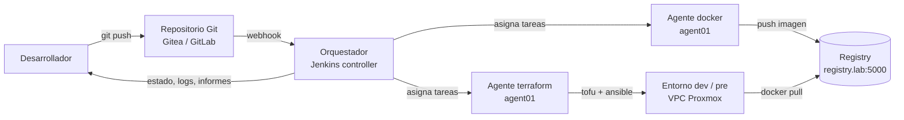
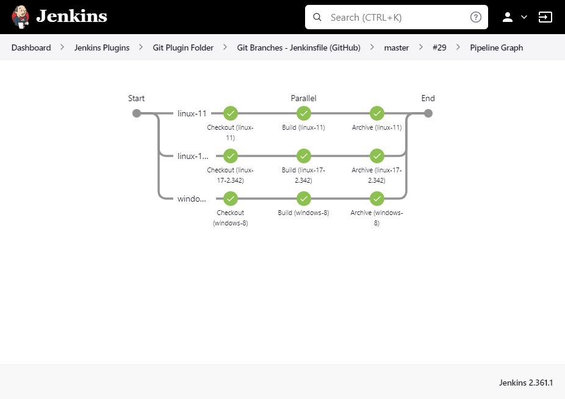
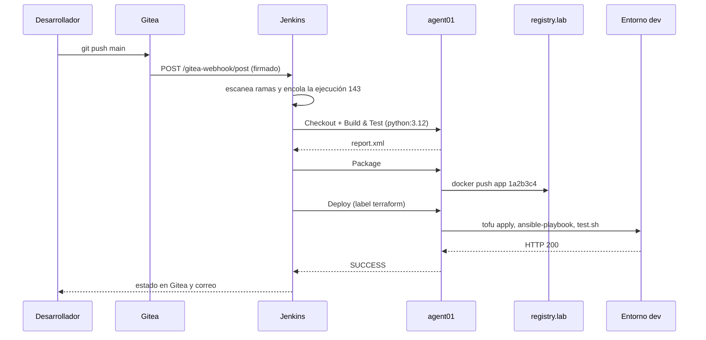
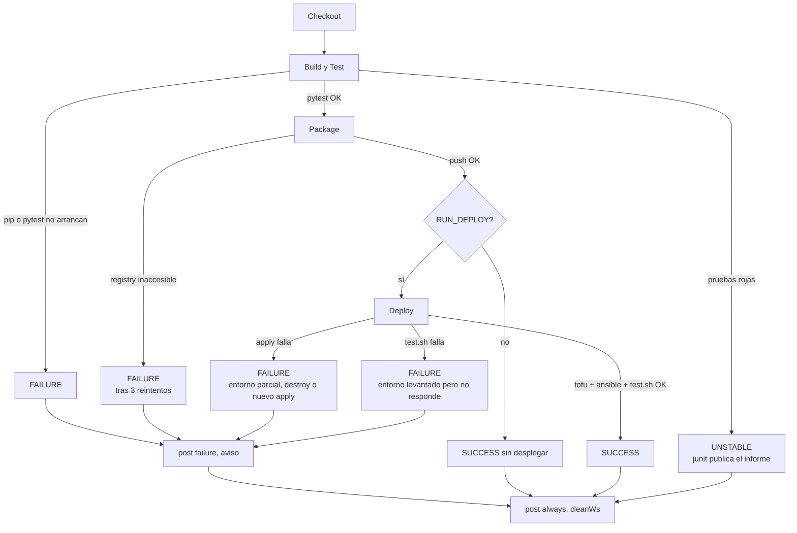

# UT6 · Orquestador de integración continua

<p class="ut-meta">24 h · Sesiones 30 a 41 · RA4 CE a, b, c, d, e, f, g, h</p>

En la UT5 dejasteis un repositorio con el que se levanta el servicio del curso de principio a fin: `tofu apply` crea las máquinas en Proxmox, Ansible las configura y `test.sh` comprueba que responde. Lo lanzabais a mano desde vuestro portátil, con vuestro usuario y vuestro token. Esta unidad quita a la persona de en medio: un orquestador de integración continua vigila el repositorio, ejecuta las pruebas, construye la imagen, la sube a un registry y, si se lo pedimos, despliega con el IaC de la UT5. Vamos a montar Jenkins desde cero (contenedor, TLS, roles, plugins, agentes), escribir el pipeline y, sobre todo, probarlo por todos los caminos que puede tomar, incluidos los que acaban mal. En la UT7 pondremos Prometheus y Grafana a vigilar tanto el orquestador como el servicio que despliega.

<figure markdown="span">
  { width="120" }
  <figcaption>Jenkins, el orquestador que usaremos en el laboratorio. Fuente: proyecto Jenkins, CC BY-SA 3.0.</figcaption>
</figure>

## Qué tienes que saber hacer al terminar

- Explicar qué es CI, en qué se diferencia de la entrega continua y del despliegue continuo, y elegir un orquestador con criterios de control de variables, limitaciones e integración con el resto de herramientas (CE 4a).
- Instalar Jenkins en contenedor con TLS válido para el aula, usuarios y roles, y con la configuración en un YAML versionado (CE 4b).
- Instalar y configurar los plugins que hacen falta, y solo esos (CE 4c).
- Crear un proyecto Multibranch conectado al repositorio con una credencial de solo lectura y un webhook que lo dispare (CE 4d).
- Escribir tareas parametrizadas: en qué agente corren, con qué variables y bajo qué condiciones (CE 4e).
- Escribir un pipeline declarativo con etapas de checkout, build, test, package y deploy, y su equivalente en GitLab CI (CE 4f).
- Probar el pipeline en todos los caminos, con timeouts, reintentos y notificaciones, y dejar el entorno en un estado conocido cuando algo falla (CE 4g).
- Aplicar mínimo privilegio a cada credencial y agente, y mantener un inventario de secretos (CE 4h).

## Integración continua, entrega continua y despliegue continuo

**Integración continua (CI)** es integrar el trabajo de todos los desarrolladores varias veces al día en un repositorio común y comprobar automáticamente, en cada integración, que el proyecto compila, pasa las pruebas y se empaqueta. La idea la formalizó Martin Fowler hace más de veinte años y no ha cambiado: si integras poco y tarde, el día que juntas el trabajo de cinco personas te encuentras con conflictos que nadie sabe resolver; si integras cada pocas horas y una máquina ejecuta las pruebas en cada integración, el error aparece a los diez minutos de haberlo cometido y lo arregla quien lo acaba de escribir.

Sobre esa base se construyen dos escalones más, y conviene no confundirlos porque en las ofertas de trabajo se mezclan alegremente:

| Escalón | Qué añade | Quién decide el paso a producción |
|---|---|---|
| Integración continua | Build, pruebas y empaquetado automáticos en cada cambio | Nadie despliega todavía |
| Entrega continua (*continuous delivery*, CD) | El artefacto validado se despliega automáticamente en entornos de prueba y queda listo para producción | Una persona pulsa un botón |
| Despliegue continuo (*continuous deployment*) | Cada cambio que pasa todas las pruebas llega a producción sin intervención | Nadie; el pipeline entero es la aprobación |

En el módulo llegaremos hasta la entrega continua: el pipeline despliega en `dev` y `pre` cuando se lo pedimos con un parámetro, y el paso a producción sigue siendo una decisión humana. El despliegue continuo exige una batería de pruebas y una madurez de equipo que no se improvisan; casi ninguna empresa que os vais a encontrar lo hace de verdad, aunque lo diga.

### Las piezas

- **Repositorio Git** con el código del servicio y, en el mismo repositorio, la definición del pipeline. Que el pipeline viva con el código importa: se versiona, se revisa en un *merge request* y cada rama lleva el suyo.
- **Orquestador** (Jenkins, GitLab CI, GitHub Actions, Gitea Actions): recibe el aviso de cambio, decide qué ejecutar, dónde, con qué credenciales, y guarda resultados, logs e informes.
- **Agentes** o *runners*: las máquinas o contenedores donde se ejecutan realmente las tareas. El orquestador solo coordina; si ejecutase él mismo las tareas, cualquier `sh` de cualquier pipeline correría con los permisos del orquestador entero.
- **Registry** de imágenes y almacén de artefactos: donde queda lo que produce el pipeline (imágenes, paquetes, informes) identificado por el commit que lo generó.
- **Entornos** de destino: la VPC de las UT anteriores, con sus subredes `dev` y `pre`.



### Qué aporta un pipeline frente a un script

La pregunta es legítima, porque el `test.sh` de la UT5 ya encadena `tofu apply`, `ansible-playbook` y un `curl`, y con un script un poco más largo y un cron se cubriría lo mismo. Se cubriría solo en el camino feliz. Un **pipeline** es la cadena de etapas que atraviesa cada cambio (checkout, build, test, package, deploy) donde cada etapa produce salidas (artefactos, informes) y puede detener la cadena si falla, y el orquestador le añade lo que un script no tiene:

- **Aislamiento por etapa**: cada etapa puede correr en un agente distinto, con una imagen distinta, sin heredar el estado de la anterior salvo lo que se le pasa explícitamente.
- **Historial**: cada ejecución queda numerada, con su commit, su log, quién la lanzó, cuánto tardó y qué produjo. Cuando algo falla en producción, puedes ir a la ejecución #142 y ver qué se probó.
- **Estados con significado**: un script devuelve 0 o distinto de 0. Un pipeline distingue entre "todo bien", "todo se ejecutó pero hay pruebas rojas", "se rompió a mitad" y "alguien lo canceló", y reacciona distinto en cada caso.
- **Credenciales gestionadas**: el script tiene el token en una variable de entorno o, peor, en el propio fichero. El orquestador lo guarda cifrado, lo inyecta solo en la etapa que lo necesita y lo enmascara en el log.
- **Condiciones y paralelismo**: "esto solo en `main`", "esto solo si cambió `Dockerfile`", "lint y test a la vez". En bash se puede, pero cada condición es un `if` más que nadie prueba.
- **Disparo automático** desde el repositorio y **límites** (tiempo máximo, no concurrencia) que evitan que dos despliegues pisen el mismo estado de OpenTofu.

## Elegir el orquestador

|  | **Jenkins** | **GitLab CI** | **GitHub Actions** | **Gitea Actions** |
|----|----|----|----|----|
| Instalación | Servidor propio (WAR o contenedor) | Incluido en GitLab (autoalojado o SaaS) | Servicio de GitHub; runners propios opcionales | Incluido en Gitea desde 1.19; runner `act_runner` |
| Definición | `Jenkinsfile` (Groovy declarativo o scripted) | `.gitlab-ci.yml` | Workflows YAML en `.github/workflows/` | Workflows YAML compatibles con Actions |
| Modelo de ejecución | Controlador + agentes (SSH, inbound, Docker, Kubernetes) | Runners registrados por proyecto, grupo o instancia; ejecutor shell, docker o kubernetes | Runners hospedados por GitHub o propios | Runners propios, ejecutor docker o host |
| Extensión | Más de 1800 plugins | Integrado, menos flexible; *components* y *templates* | Marketplace de acciones | Reutiliza acciones de GitHub (con matices) |
| Secretos | Credenciales cifradas en `jenkins_home`, con ámbito global o por carpeta | Variables de proyecto/grupo, con *protected* y *masked* | Secrets de repositorio, entorno y organización | Secrets de repositorio y organización |
| Cachés y artefactos | `stash`, `archiveArtifacts`, plugins de caché | `cache:` y `artifacts:` nativos, con informes JUnit, cobertura, etc. | `actions/cache`, `upload-artifact` | Igual que Actions, con soporte parcial |
| Control de variables y límites | Parámetros, credenciales, throttling, cuotas por agente, timeouts | Variables por proyecto/grupo, límites por runner, `timeout`, `resource_group` | Secretos, concurrencia, matrices, `timeout-minutes` | Secretos, concurrencia, matrices |
| Coste de mantenimiento | Alto: actualizaciones del núcleo y de plugins, backups, agentes | Medio: va con GitLab, pero GitLab en sí es pesado | Bajo si es SaaS; medio con runners propios | Bajo |
| Comunidad y documentación | Enorme y veterana; mucho material antiguo que ya no aplica | Muy buena, documentación oficial excelente | La mayor en proyectos abiertos | Pequeña pero creciente |
| Punto fuerte | Flexibilidad, cualquier tecnología, control total | Todo en una herramienta | Sencillez, ecosistema de acciones | Ligero, autoalojado, sintaxis conocida |
| Punto débil | Mantenimiento de plugins, curva de entrada | Ligado a GitLab | Menos control fino; coste de minutos en SaaS | Menos maduro, menos control fino |

Criterios de selección (CE 4a): que pueda **controlar las variables** del pipeline (parámetros, secretos, entorno), aplicar **limitaciones** (tiempo máximo, concurrencia, agentes permitidos, quién puede lanzar qué), **integrarse** con las tecnologías del entorno (Git, Docker, OpenTofu, Ansible, registry, Proxmox) y **registrar** cada ejecución con su log y sus artefactos. A esos cuatro añado dos que en una empresa pesan tanto como los técnicos: quién lo va a mantener (un Jenkins sin dueño se convierte en un museo de plugins sin parchear) y dónde está el código (si ya estás en GitLab, montar un Jenkins aparte necesita una justificación).

En el módulo usamos **Jenkins** por su flexibilidad y porque obliga a entender cada pieza: en GitLab CI el runner, los secretos y el webhook vienen hechos y no ves cómo funcionan; en Jenkins los montas tú y, cuando fallan, sabes dónde mirar. Todo lo aprendido se traslada a GitLab CI cambiando la sintaxis, y al final de la unidad tenéis el mismo pipeline escrito en `.gitlab-ci.yml` para comprobarlo.

## Instalar y asegurar Jenkins

### Despliegue en contenedor

Jenkins es una aplicación Java que escucha en el puerto 8080 por HTTP. La imagen oficial `jenkins/jenkins:lts-jdk21` (la variante `lts-jdk17` sigue publicándose) trae el controlador y nada más: ni Docker, ni Git en versión útil, ni plugins. Todo su estado (configuración, jobs, credenciales cifradas, historial) vive en `/var/jenkins_home`, y ese directorio es lo único que hay que conservar.

Hay dos formas de poner TLS delante. La primera es la que traía el guion original: Jenkins carga un keystore Java y sirve HTTPS él mismo.

=== "Keystore en Jenkins"

    ```yaml
    # compose.yml
    services:
      jenkins:
        image: jenkins/jenkins:lts-jdk21
        ports: ["8443:8443"]
        volumes:
          - jenkins_home:/var/jenkins_home
          - ./certs:/certs:ro
        environment:
          JENKINS_OPTS: "--httpPort=-1 --httpsPort=8443 --httpsKeyStore=/certs/jenkins.jks --httpsKeyStorePassword=changeit"
    volumes:
      jenkins_home:
    ```

    El keystore se construye a partir del certificado y la clave que emite la CA interna:

    ```bash
    # Certificado + clave -> PKCS12 -> JKS
    openssl pkcs12 -export -in jenkins.crt -inkey jenkins.key -certfile ca.crt \
      -name jenkins -out jenkins.p12 -passout pass:changeit
    keytool -importkeystore -srckeystore jenkins.p12 -srcstoretype PKCS12 \
      -srcstorepass changeit -destkeystore jenkins.jks -deststorepass changeit
    ```

    `--httpPort=-1` apaga el HTTP en claro. La contraseña del keystore va en claro en el compose; en el laboratorio es aceptable, en producción se pasa con un fichero `.env` fuera del repositorio o se usa la segunda opción.

=== "nginx delante (recomendado)"

    ```yaml
    # compose.yml
    services:
      jenkins:
        image: jenkins/jenkins:lts-jdk21
        volumes:
          - jenkins_home:/var/jenkins_home
          - ./casc:/var/jenkins_home/casc:ro
        environment:
          JAVA_OPTS: "-Djenkins.install.runSetupWizard=false"
          CASC_JENKINS_CONFIG: /var/jenkins_home/casc/jenkins.yaml
        # sin ports: solo nginx llega a él por la red interna del compose
      nginx:
        image: nginx:1.27
        ports: ["443:443"]
        volumes:
          - ./nginx.conf:/etc/nginx/conf.d/default.conf:ro
          - ./certs:/etc/nginx/certs:ro
        depends_on: [jenkins]
    volumes:
      jenkins_home:
    ```

    ```nginx
    # nginx.conf
    server {
        listen 443 ssl;
        server_name jenkins.lab;
        ssl_certificate     /etc/nginx/certs/jenkins.crt;
        ssl_certificate_key /etc/nginx/certs/jenkins.key;

        location / {
            proxy_pass         http://jenkins:8080;
            proxy_http_version 1.1;
            proxy_set_header   Host              $host;
            proxy_set_header   X-Real-IP         $remote_addr;
            proxy_set_header   X-Forwarded-For   $proxy_add_x_forwarded_for;
            proxy_set_header   X-Forwarded-Proto https;
            proxy_set_header   X-Forwarded-Host  $host;
            # agentes inbound por WebSocket y consola en vivo
            proxy_set_header   Upgrade    $http_upgrade;
            proxy_set_header   Connection "upgrade";
            proxy_read_timeout 90s;
            client_max_body_size 50m;
        }
    }
    ```

    Es la que prefiero y la que se ve en las empresas: nginx (o Traefik, o el balanceador del proveedor) termina TLS con un certificado normal en PEM, el mismo que usaríais para cualquier otro servicio, y Jenkins habla HTTP por la red interna del compose. Cambiar el certificado no toca a Jenkins, y el mismo nginx puede servir el registry y Gitea en otros `server`. La única condición es configurar en Jenkins la URL pública (`https://jenkins.lab/`) y pasar las cabeceras `X-Forwarded-*`; si no, Jenkins genera enlaces con `http://jenkins:8080` y os saldrá el aviso "It appears that your reverse proxy set up is broken".

Sin JCasC, la contraseña inicial está en `/var/jenkins_home/secrets/initialAdminPassword` (`docker compose exec jenkins cat /var/jenkins_home/secrets/initialAdminPassword`). Jenkins vive en la subred de gestión de la VPC (en nuestro laboratorio, `10.0.20.0/24`), nunca en la DMZ externa: contiene credenciales de todo lo demás y no lo necesita nadie de fuera.

### Certificados

Certificado propio firmado por una CA interna (openssl o `step-ca`), importado en el keystore Java o entregado a nginx en PEM. La CA se instala en los navegadores del aula y en el almacén del sistema de las máquinas que van a hablar con Jenkins y con el registry (`/usr/local/share/ca-certificates/lab-ca.crt` y `update-ca-certificates` en Debian/Ubuntu). En producción, certificado de la CA corporativa o Let's Encrypt tras un proxy inverso; Let's Encrypt exige que el nombre resuelva públicamente y que el validador llegue al puerto 80 o que hagáis la validación por DNS, y como Jenkins no debe ser accesible desde Internet, lo habitual es la CA corporativa.

Una CA mínima en tres comandos, suficiente para el laboratorio:

```bash
openssl req -x509 -newkey rsa:4096 -nodes -days 1825 -subj "/CN=Lab CA 5166" \
  -keyout ca.key -out ca.crt
openssl req -newkey rsa:2048 -nodes -subj "/CN=jenkins.lab" \
  -addext "subjectAltName=DNS:jenkins.lab" -keyout jenkins.key -out jenkins.csr
openssl x509 -req -in jenkins.csr -CA ca.crt -CAkey ca.key -CAcreateserial \
  -days 365 -copy_extensions copy -out jenkins.crt
```

!!! tip "subjectAltName obligatorio"
    Sin el `subjectAltName` los navegadores actuales rechazan el certificado aunque el CN sea correcto; es el error más repetido en la sesión 31.

### Usuarios y permisos

- Manage Jenkins → Security → Authorization: **Matrix-based security** o el plugin **Role-based Authorization Strategy**. La matriz vale para tres usuarios; en cuanto hay carpetas y equipos, los roles se gestionan mejor.
- Roles: administrador (pocos, dos personas como máximo), desarrollador (construir y ver), lector (solo ver), cuentas de servicio (solo lo que su tarea necesita, por ejemplo un rol que solo puede lanzar un job concreto desde el webhook).
- Autenticación contra LDAP/AD o GitLab cuando exista (plugins `ldap` y `gitlab-oauth`); usuarios locales solo en el laboratorio. Cuando alguien deja la empresa, su cuenta se desactiva en un sitio, no en quince.
- Desactivar el registro abierto de usuarios, activar la protección **CSRF** (el *crumb issuer*; viene activada y hay tutoriales antiguos que enseñan a desactivarla para que funcione un `curl`: no lo hagáis, pasad el crumb o usad un token de API), limitar el acceso a la **script console** (Manage Jenkins → Script Console ejecuta Groovy arbitrario con los permisos del proceso de Jenkins; quien tiene `Overall/Administer` tiene eso, por eso hay que dar tan pocos).

### Hardening del controlador

- **Número de ejecutores** en el controlador: 0. Nada se ejecuta en el controlador, todo en agentes. Un pipeline que corre en el controlador puede leer `/var/jenkins_home/secrets/master.key` y descifrar todas las credenciales.
- **Agent → Controller Access Control** (Manage Jenkins → Security): activado. Limita qué puede pedirle un agente al controlador; sin esto, un agente comprometido puede leer ficheros del controlador. Está activado por defecto desde 2.x y no hay razón para tocarlo.
- **Actualizaciones**: el controlador con la LTS (una versión cada doce semanas con parches entre medias) y los plugins revisados al menos una vez al mes. El panel de plugins marca en rojo los que tienen avisos de seguridad publicados en [jenkins.io/security](https://www.jenkins.io/security/).
- **Backup** de `jenkins_home` (configuración, jobs, credenciales cifradas). Con JCasC, la configuración ya está en Git; lo que queda por salvar es el historial de ejecuciones y, sobre todo, `secrets/master.key` y `secrets/hudson.util.Secret`, sin los cuales las credenciales cifradas del backup no sirven. Un `tar` del volumen con el contenedor parado, o el plugin `thinBackup`, cada noche.
- **Configuration as Code** (plugin **JCasC**): la configuración de Jenkins en un YAML versionado. Es la diferencia entre un Jenkins que se reconstruye en cinco minutos y uno que nadie se atreve a tocar.

```yaml
# casc/jenkins.yaml
jenkins:
  systemMessage: "Jenkins de la asignatura. Configurado por JCasC, no toques nada a mano."
  numExecutors: 0
  mode: EXCLUSIVE
  securityRealm:
    local:
      allowsSignup: false
      users:
        - id: admin
          password: ${ADMIN_PASSWORD}
  authorizationStrategy:
    roleBased:
      roles:
        global:
          - name: admin
            permissions: ["Overall/Administer"]
            entries:
              - user: admin
          - name: dev
            permissions: ["Overall/Read", "Job/Read", "Job/Build", "Job/Cancel", "Job/Workspace"]
            entries:
              - group: developers
          - name: lector
            permissions: ["Overall/Read", "Job/Read"]
            entries:
              - group: authenticated
  crumbIssuer:
    standard:
      excludeClientIPFromCrumb: false
  remotingSecurity:
    enabled: true
  nodes:
    - permanent:
        name: agent01
        labelString: "docker terraform"
        remoteFS: /home/jenkins
        numExecutors: 2
        launcher:
          ssh:
            host: 10.0.20.11
            port: 22
            credentialsId: agent-ssh
            sshHostKeyVerificationStrategy:
              manuallyProvidedKeyVerificationStrategy:
                key: "ssh-ed25519 AAAAC3Nza... agent01"
unclassified:
  location:
    url: https://jenkins.lab/
    adminAddress: victor@lab
  gitHubPluginConfig: {}
credentials:
  system:
    domainCredentials:
      - credentials:
          - basicSSHUserPrivateKey:
              scope: SYSTEM
              id: agent-ssh
              username: jenkins
              privateKeySource:
                directEntry:
                  privateKey: ${AGENT_SSH_KEY}
```

Los valores `${ADMIN_PASSWORD}` y `${AGENT_SSH_KEY}` los resuelve JCasC desde variables de entorno del contenedor o desde ficheros en `/run/secrets`, así el YAML se puede subir al repositorio `jenkins-config` sin un solo secreto dentro. El plugin admite exportar la configuración actual (Manage Jenkins → Configuration as Code → View Configuration) para empezar desde un Jenkins configurado a mano y pasar a YAML, aunque la exportación arrastra mucho ruido que conviene limpiar.

## Plugins

Se instalan desde Manage Jenkins → Plugins, o mejor, desde una imagen propia que los deja preinstalados para que el Jenkins se reconstruya siempre igual:

```dockerfile
FROM jenkins/jenkins:lts-jdk21
COPY plugins.txt /usr/share/jenkins/ref/plugins.txt
RUN jenkins-plugin-cli --plugin-file /usr/share/jenkins/ref/plugins.txt
```

Los que necesita el módulo, con su identificador en `plugins.txt`:

| **Plugin** | **Id** | **Para qué** | **Sesión** |
|----|----|----|----|
| Git | `git` | Clonar repositorios, `checkout scm` | 34 |
| Gitea / GitLab / GitHub Branch Source | `gitea`, `gitlab-branch-source`, `github-branch-source` | Descubrir ramas y *merge requests*, recibir webhooks | 34 |
| Pipeline | `workflow-aggregator` | Todo lo que hace falta para un `Jenkinsfile` | 35 |
| Pipeline: Multibranch | `workflow-multibranch` | Un pipeline por rama | 34 |
| Docker Pipeline | `docker-workflow` | `agent { docker {...} }`, `docker.build`, `docker.withRegistry` | 35, 36 |
| Docker | `docker-plugin` | Cloud Docker: agentes efímeros en contenedor | 33 |
| SSH Build Agents | `ssh-slaves` | Agentes permanentes por SSH | 33 |
| Credentials, Credentials Binding | `credentials`, `credentials-binding` | Guardar secretos y usarlos con `withCredentials` | 34 |
| Folders | `cloudbees-folder` | Carpetas con credenciales de ámbito propio | 39 |
| Role-based Authorization Strategy | `role-strategy` | Permisos por rol | 31 |
| Configuration as Code | `configuration-as-code` | Configuración versionada | 32 |
| JUnit | `junit` | Publicar informes de pruebas y marcar UNSTABLE | 35 |
| Pipeline Graph View (o Blue Ocean) | `pipeline-graph-view` | Ver el pipeline por etapas; Blue Ocean está en mantenimiento y no se recomienda para instalaciones nuevas | 35 |
| Email Extension / Telegram / Slack | `email-ext`, `telegram-notifications`, `slack` | Notificaciones | 38 |
| Timestamper, AnsiColor | `timestamper`, `ansicolor` | Legibilidad de logs | 32 |
| Workspace Cleanup | `ws-cleanup` | `cleanWs()` en el `post` | 38 |

Regla: instalar solo lo que se usa y actualizar con criterio; un plugin abandonado es una vulnerabilidad. Cada plugin arrastra dependencias (instalar `workflow-aggregator` mete unos treinta), y cada uno es código de terceros que corre dentro del proceso de Jenkins con todos sus permisos. Antes de instalar uno, mirad en [plugins.jenkins.io](https://plugins.jenkins.io/) la fecha de la última versión y si tiene avisos de seguridad abiertos; si lleva tres años sin tocarse, buscad alternativa.

<figure markdown="span">
  { width="640" }
  <figcaption>Un pipeline visto con Pipeline Graph View: etapas, duración y estado de cada una. Fuente: Mark Waite, CC BY-SA 4.0, vía Wikimedia Commons.</figcaption>
</figure>

## Agentes

El controlador coordina; los **agentes** ejecutan. Cada agente tiene un número de ejecutores (cuántas tareas admite a la vez), un directorio de trabajo y una o varias **etiquetas**. Cuando una etapa pide `agent { label 'docker' }`, el controlador la encola hasta que un agente con esa etiqueta tenga un ejecutor libre. Las etiquetas describen capacidades (`docker`, `terraform`, `linux`, `arm64`), no nombres de máquina: así el día que `agent01` se sustituye por `agent03` no hay que tocar ningún `Jenkinsfile`.

- **Agente permanente por SSH**: una VM con Java a la que Jenkins se conecta por SSH con una clave, copia `agent.jar` y lo arranca. Es el más sencillo de entender y el que usaremos para las etapas que necesitan herramientas instaladas en el host (`tofu`, `ansible`, el CLI de Docker). Etiquetas (`linux`, `docker`, `terraform`) para dirigir las tareas. El controlador necesita llegar al puerto 22 del agente.
- **Agente inbound** (antes JNLP): la conexión va al revés, el agente llama al controlador con un secreto. Vale para agentes detrás de un NAT o de un cortafuegos que no admite conexiones entrantes, y con `-webSocket` pasa por el mismo 443 de nginx sin abrir el puerto 50000: `java -jar agent.jar -url https://jenkins.lab/ -name agent02 -secret <secreto> -webSocket -workDir /home/jenkins`. La imagen `jenkins/inbound-agent` hace exactamente eso.
- **Agente en contenedor** (cloud Docker con el plugin `docker-plugin`): Jenkins habla con un demonio Docker (por TCP con TLS, o por el socket de una VM dedicada), levanta un contenedor a partir de una plantilla por cada tarea y lo destruye al terminar. Limpio y reproducible: no hay restos de la ejecución anterior. Se configura en Manage Jenkins → Clouds con una plantilla que asocia imagen (`jenkins/agent` o una propia con herramientas) y etiqueta.
- **Agente efímero en Kubernetes** (plugin `kubernetes`): lo mismo a escala; cada tarea es un pod con los contenedores que declare el `Jenkinsfile`. Es lo que os vais a encontrar en empresas medianas y grandes, y lo veréis con más detalle cuando toque Kubernetes.

Hay dos maneras de "correr dentro de un contenedor" que se confunden mucho. La cloud Docker crea el agente entero como contenedor. `agent { docker { image 'python:3.12' } }` del plugin Docker Pipeline hace otra cosa: en un agente normal que tenga el CLI de Docker, lanza `docker run` con esa imagen, monta el workspace dentro y ejecuta los `steps` ahí. Lo segundo es lo que usa nuestro pipeline en la etapa de pruebas: la máquina `agent01` no tiene Python 3.12 instalado, lo trae la imagen.

En el `Jenkinsfile` se elige con `agent { label 'docker' }` o `agent { docker { image 'python:3.12'; label 'docker' } }`. Dónde corre cada etapa se decide así: si el `pipeline` declara `agent none`, cada `stage` tiene que declarar el suyo, y es la forma que recomiendo porque obliga a pensarlo. Si el `pipeline` declara `agent { label 'docker' }`, todas las etapas heredan ese agente y el workspace se comparte entre ellas sin `stash`; más cómodo, pero mezcla en la misma máquina la construcción y el despliegue, y por tanto sus credenciales.

## Proyectos, credenciales y webhooks

### El proyecto

**Proyecto** (job): la unidad de trabajo. Tipos: freestyle (formulario web, sin código; no lo usaremos), **Pipeline** (un `Jenkinsfile`, escrito en el propio job o leído de un repositorio) y **Multibranch Pipeline** (Jenkins escanea el repositorio, crea un subjob por cada rama que tenga `Jenkinsfile` y lo borra cuando la rama desaparece; ideal con Git y con *merge requests*, porque cada uno se prueba en su rama antes de fusionarse).

**Configuración base** del proyecto: repositorio y credencial, ramas a descubrir, disparador (webhook, sondeo, cron), descartar ejecuciones antiguas (sin esto `jenkins_home` crece sin límite), tiempo máximo, y no permitir ejecuciones concurrentes si comparten recursos (dos `tofu apply` sobre el mismo estado a la vez es una forma segura de corromperlo).

**Tareas** dentro del proyecto: cada etapa del pipeline con su nombre, el agente donde corre, el entorno (variables) y las condiciones de ejecución. En Jenkins la etapa es la tarea; en GitLab CI la llaman *job* y la etapa (*stage*) agrupa jobs.

### Credenciales

Manage Jenkins → Credentials. Tipos:

| Tipo | Para qué | Cómo se usa en el pipeline |
|---|---|---|
| Username with password | Registry, Gitea/GitLab por HTTPS | `usernamePassword(credentialsId:, usernameVariable:, passwordVariable:)` |
| Secret text | Tokens de API (Proxmox, GitLab, Telegram) | `string(credentialsId:, variable:)` |
| SSH Username with private key | Agentes SSH, Git por SSH, Ansible | `sshUserPrivateKey(credentialsId:, keyFileVariable:)` |
| Secret file | `kubeconfig`, ficheros `.env`, certificados cliente | `file(credentialsId:, variable:)` |
| Certificate | Certificados cliente PKCS12 | `certificate(...)` |

Ámbito **System** (solo el controlador la usa, por ejemplo para conectar con agentes) o **Global** (los pipelines pueden usarla). Con el plugin Folders cada carpeta tiene su propio almacén: una credencial creada en la carpeta `pre/` no existe para los jobs de `dev/`. Se referencian por ID; nunca se escriben en el `Jenkinsfile`.

```groovy
withCredentials([usernamePassword(credentialsId: 'registry-cred',
                                  usernameVariable: 'REG_USER',
                                  passwordVariable: 'REG_PASS')]) {
    sh 'echo "$REG_PASS" | docker login -u "$REG_USER" --password-stdin registry.lab:5000'
}
```

Dentro del bloque las variables existen en el entorno del `sh` y Jenkins sustituye su valor por `****` en el log.

!!! warning "Comillas simples en el `sh` que usa secretos"
    Fijaos en las comillas simples del `sh`: la variable la expande el shell. Con comillas dobles la expandiría Groovy antes de pasársela al shell, el secreto viajaría como parte del texto del comando y Jenkins avisa con "Warning: A secret was passed to sh using Groovy String interpolation". El enmascarado protege el log, no el proceso: si el comando imprime el secreto codificado en base64 o lo escribe en un fichero que luego se archiva, se ha filtrado igual.

### Webhooks

Un webhook es una petición HTTP POST que el servidor Git envía al orquestador cuando pasa algo (push, nueva rama, *merge request*). La alternativa, sondear el repositorio cada pocos minutos (`pollSCM('H/5 * * * *')`), funciona pero llega tarde y carga el servidor Git; con Multibranch, además, un escaneo periódico también descubre ramas nuevas.

| Servidor | URL en Jenkins (con el plugin correspondiente) | Cómo firma |
|---|---|---|
| Gitea | `https://jenkins.lab/gitea-webhook/post` | Cabecera `X-Gitea-Signature`, HMAC-SHA256 del cuerpo con el secreto del webhook |
| GitLab | `https://jenkins.lab/gitlab-webhook/post` | Cabecera `X-Gitlab-Token` con el secreto configurado |
| GitHub | `https://jenkins.lab/github-webhook/` | Cabecera `X-Hub-Signature-256`, HMAC-SHA256 |
| Cualquiera (plugin Git) | `https://jenkins.lab/git/notifyCommit?url=<repo>` | Sin firma; solo provoca un sondeo |

Hay que configurar el secreto en los dos lados; sin él, cualquiera que llegue a la URL puede disparar pipelines. Y el servidor Git tiene que confiar en la CA que firmó el certificado de Jenkins, o rechazará el POST (Gitea guarda el resultado de cada entrega en la pestaña del webhook, con el código de respuesta y el cuerpo: es el primer sitio donde mirar).



Queda el caso en que Jenkins no es accesible desde el servidor Git. Pasa cuando el código está en GitHub o en un GitLab SaaS y Jenkins está en la red de gestión sin IP pública. Opciones, de más a menos recomendable: sondeo (`pollSCM`) con un intervalo corto; exponer solo la ruta del webhook a través del proxy inverso de la DMZ, restringida a los rangos de IP del proveedor y con la firma verificada; un túnel saliente (Cloudflare Tunnel, ngrok o un `ssh -R` a un bastión). Lo que no se hace es abrir el 443 de Jenkins entero a Internet por comodidad. En nuestro laboratorio Gitea y Jenkins están en la misma VPC y el problema no existe.

## Pipeline declarativo

Este es el `Jenkinsfile` del servicio del curso. Léelo entero una vez y luego vamos sección a sección.

```groovy
pipeline {
    agent none
    options {
        timeout(time: 30, unit: 'MINUTES')
        buildDiscarder(logRotator(numToKeepStr: '20'))
        disableConcurrentBuilds()
    }
    parameters {
        choice(name: 'ENV', choices: ['dev', 'pre'], description: 'Entorno de despliegue')
        booleanParam(name: 'RUN_DEPLOY', defaultValue: false)
    }
    environment {
        REGISTRY = 'registry.lab:5000'
        IMAGE = "${REGISTRY}/app"
    }
    stages {
        stage('Checkout') {
            agent { label 'docker' }
            steps {
                checkout scm
                stash 'src'
            }
        }
        stage('Build & Test') {
            agent { docker { image 'python:3.12'; label 'docker' } }
            steps {
                unstash 'src'
                sh 'pip install -r requirements.txt && pytest --junitxml=report.xml'
            }
            post { always { junit 'report.xml' } }
        }
        stage('Package') {
            agent { label 'docker' }
            steps {
                unstash 'src'
                script {
                    def img = docker.build("${IMAGE}:${GIT_COMMIT.take(7)}")
                    docker.withRegistry("https://${REGISTRY}", 'registry-cred') {
                        img.push()
                        img.push('latest')
                    }
                }
            }
        }
        stage('Deploy') {
            when { expression { params.RUN_DEPLOY } }
            agent { label 'terraform' }
            steps {
                withCredentials([string(credentialsId: 'pve-token', variable: 'TF_VAR_pve_token')]) {
                    dir("envs/${params.ENV}") {
                        sh 'tofu init -input=false && tofu apply -auto-approve'
                    }
                    sh "ansible-playbook -i inventory/${params.ENV}.ini site.yml"
                    sh 'bash test.sh'
                }
            }
        }
    }
    post {
        failure { mail to: 'equipo@lab', subject: "FALLO ${JOB_NAME} #${BUILD_NUMBER}", body: "${BUILD_URL}" }
        success { echo 'Pipeline correcto' }
        always { cleanWs() }
    }
}
```

**`pipeline` y `agent none`.** Todo `Jenkinsfile` declarativo empieza con `pipeline { }`. `agent none` dice que el pipeline no reserva ningún agente de entrada; cada etapa pide el suyo. Si hubiera `agent any`, Jenkins cogería el primer ejecutor libre y, con los del controlador a 0, sería un agente cualquiera.

**`options`.** Límites del pipeline entero: `timeout` de 30 minutos (una ejecución colgada no bloquea un ejecutor para siempre), `buildDiscarder` guarda solo las últimas 20 ejecuciones y `disableConcurrentBuilds` encola si ya hay una en marcha, que es obligatorio en cuanto una etapa toca un estado compartido como el de OpenTofu. Otras que se usan mucho: `timestamps()`, `skipDefaultCheckout()` (para que el checkout no se haga solo en cada etapa con agente), `retry(2)` a nivel de pipeline.

**`parameters`.** Variables que se rellenan al lanzar el pipeline, a mano o por API: `ENV` con una lista cerrada y `RUN_DEPLOY` como booleano. Se leen con `params.ENV`. La primera ejecución tras añadir parámetros falla o pide confirmación porque Jenkins todavía no los conoce; es normal y solo pasa una vez. Con `string`, `text`, `password` y `choice` cubrís casi todo; `password` no es una credencial, es un campo que no se muestra.

**`environment`.** Variables de entorno para todas las etapas. Se pueden definir también dentro de un `stage`, y pueden leer credenciales (`TOKEN = credentials('pve-token')`), pero prefiero `withCredentials` porque acota el secreto a un bloque. Las variables predefinidas que más usaréis: `BUILD_NUMBER`, `JOB_NAME`, `BUILD_URL`, `GIT_COMMIT`, `GIT_BRANCH`, `BRANCH_NAME` (esta solo en Multibranch), `WORKSPACE`.

**`stages`, `stage`, `steps`.** Etapas y pasos, en secuencia. `stage('Checkout')` clona el repositorio con `checkout scm` (la configuración de SCM la aporta el job Multibranch, incluida la credencial `git-ro`) y guarda el árbol de fuentes con `stash 'src'`. **`stash / archiveArtifacts`**: `stash` pasa ficheros entre etapas que corren en agentes distintos (viaja por el controlador, así que no sirve para gigabytes); `archiveArtifacts` los guarda con la ejecución para descargarlos después.

**`Build & Test`.** Corre en un contenedor `python:3.12` lanzado sobre un agente con etiqueta `docker`. `pytest --junitxml` deja el informe y el `post { always { junit ... } }` de la etapa lo publica pase lo que pase. Si hay pruebas rojas, `junit` marca la ejecución como UNSTABLE en lugar de FAILURE: se ejecutó todo, pero el resultado no es aceptable. Fijaos en que `pip install` sin caché descarga las dependencias en cada ejecución; con un `requirements.txt` grande se arregla con una imagen propia que ya las lleve, o con un volumen para la caché de pip.

**`Package`.** Construye la imagen con `docker.build`, etiquetada con los siete primeros caracteres del commit (`GIT_COMMIT.take(7)`), para que cada imagen sea trazable hasta la línea de código que contiene. `docker.withRegistry` hace `docker login` con la credencial `registry-cred` y `logout` al salir, y dentro se hacen dos `push`: la etiqueta del commit y `latest`. El bloque `script { }` es necesario porque `docker.build` es un paso de la sintaxis *scripted*; el declarativo lo permite dentro de `script`. El agente necesita el CLI de Docker y acceso al demonio.

**`Deploy`.** `when { expression { params.RUN_DEPLOY } }` salta la etapa si el parámetro es falso, así el mismo pipeline sirve para validar cada push y para desplegar cuando alguien lo decide. Corre en un agente con etiqueta `terraform` (con `tofu`, `ansible` y las claves SSH de la UT5), recibe el token de Proxmox como `TF_VAR_pve_token` (OpenTofu lee cualquier variable `TF_VAR_x` como la variable `x`), y encadena los tres pasos de la UT5: `tofu init && tofu apply` en el directorio del entorno, el playbook con el inventario del entorno y el `test.sh`. Cualquiera de los tres que devuelva distinto de 0 hace fallar la etapa y el pipeline.

**`post` del pipeline.** Qué hacer al terminar según resultado: `failure` avisa por correo (el paso `mail` es del plugin Mailer, que tiene que tener el SMTP configurado; en clase usaremos Telegram porque el correo del aula no sale), `success` deja un mensaje y `always` limpia el workspace con `cleanWs()`. Las condiciones disponibles son `always`, `success`, `failure`, `unstable`, `aborted`, `changed` (cambió respecto a la anterior), `fixed` (pasó de rojo a verde), `regression` y `cleanup` (el último de todos).



### Más directivas que os harán falta

**`when`.** Condiciones de ejecución (rama, parámetro, cambio en ficheros). Se pueden combinar con `allOf`, `anyOf` y `not`:

```groovy
when {
    beforeAgent true                     // evalúa antes de reservar agente
    allOf {
        branch 'main'
        expression { params.RUN_DEPLOY }
        not { changeRequest() }          // no en merge requests
    }
}
// otras: changeset 'infra/**'  (solo si cambió algo bajo infra/)
//        environment name: 'ENV', value: 'pre'
//        tag 'v*'
```

**`parallel`.** Etapas simultáneas (pruebas unitarias y análisis estático a la vez), cada una con su agente. Con `failFast true`, si una falla se abortan las demás:

```groovy
stage('Calidad') {
    failFast true
    parallel {
        stage('Test') {
            agent { docker { image 'python:3.12'; label 'docker' } }
            steps { unstash 'src'; sh 'pytest --junitxml=report.xml' }
            post { always { junit 'report.xml' } }
        }
        stage('Lint') {
            agent { docker { image 'python:3.12'; label 'docker' } }
            steps { unstash 'src'; sh 'pip install ruff && ruff check .' }
        }
    }
}
```

**`matrix`.** Genera una etapa por cada combinación de ejes; útil para probar contra varias versiones:

```groovy
stage('Test matrix') {
    matrix {
        axes {
            axis { name 'PY'; values '3.11', '3.12', '3.13' }
        }
        agent { docker { image "python:${PY}"; label 'docker' } }
        stages {
            stage('pytest') { steps { unstash 'src'; sh 'pytest' } }
        }
    }
}
```

**`input`.** Pausa el pipeline hasta que alguien con permiso aprueba; es la puerta manual de la entrega continua. Hay que ponerlo en una etapa sin agente (`agent none` en el pipeline y la etapa sin `agent`) o con `options { timeout }`, porque mientras espera tiene reservado el ejecutor:

```groovy
stage('Aprobar pre') {
    when { environment name: 'ENV', value: 'pre' }
    options { timeout(time: 1, unit: 'HOURS') }
    input { message '¿Desplegar en pre?'; ok 'Adelante'; submitter 'admin,victor' }
    steps { echo "Aprobado" }
}
```

**Shared libraries.** Cuando tenéis diez repositorios con el mismo `Jenkinsfile` cambiando tres líneas, la lógica común se saca a una biblioteca compartida (un repositorio Git con ficheros Groovy en `vars/`) y cada `Jenkinsfile` queda en `@Library('lab') _` más una llamada a `pipelinePython(image: 'python:3.12')`. No las vamos a escribir en el módulo, pero las veréis en cualquier empresa con más de unos pocos proyectos, y conviene saber que existen porque explican por qué muchos `Jenkinsfile` reales tienen cinco líneas.

### El mismo pipeline en GitLab CI

Para que veáis que lo aprendido se traslada, este es el equivalente del `Jenkinsfile` en `.gitlab-ci.yml`. Las diferencias de modelo: no hay `agent`, hay `tags` que eligen runner e `image` que elige contenedor; no hay `parameters`, hay variables que se rellenan al lanzar a mano o que se fijan con `rules`; el `when` es `rules`; el `stash` no hace falta porque cada job clona el repositorio; y los informes JUnit se publican con `artifacts:reports`.

=== "Jenkinsfile"

    ```groovy
    stage('Build & Test') {
        agent { docker { image 'python:3.12'; label 'docker' } }
        steps { unstash 'src'; sh 'pip install -r requirements.txt && pytest --junitxml=report.xml' }
        post { always { junit 'report.xml' } }
    }
    ```

=== "GitLab CI"

    ```yaml
    # .gitlab-ci.yml
    stages: [test, package, deploy]

    variables:
      REGISTRY: registry.lab:5000
      IMAGE: $CI_REGISTRY_IMAGE       # o $REGISTRY/app si el registry no es el de GitLab
      DEPLOY_ENV:
        value: "dev"
        options: ["dev", "pre"]
        description: "Entorno de despliegue"

    default:
      tags: [docker]                  # runner con ejecutor docker
      interruptible: true

    test:
      stage: test
      image: python:3.12
      script:
        - pip install -r requirements.txt
        - pytest --junitxml=report.xml
      artifacts:
        when: always
        reports:
          junit: report.xml

    package:
      stage: package
      image: docker:27
      services: [docker:27-dind]
      rules:
        - if: $CI_COMMIT_BRANCH == "main"
      script:
        - echo "$REGISTRY_PASSWORD" | docker login -u "$REGISTRY_USER" --password-stdin $REGISTRY
        - docker build -t $REGISTRY/app:$CI_COMMIT_SHORT_SHA -t $REGISTRY/app:latest .
        - docker push --all-tags $REGISTRY/app

    deploy:
      stage: deploy
      tags: [terraform]               # runner con ejecutor shell en la máquina de despliegue
      rules:
        - if: $CI_COMMIT_BRANCH == "main"
          when: manual                # equivale a RUN_DEPLOY: alguien pulsa
      environment:
        name: $DEPLOY_ENV
      resource_group: $DEPLOY_ENV     # equivale a disableConcurrentBuilds por entorno
      timeout: 30m
      script:
        - cd envs/$DEPLOY_ENV && tofu init -input=false && tofu apply -auto-approve && cd -
        - ansible-playbook -i inventory/$DEPLOY_ENV.ini site.yml
        - bash test.sh
    ```

    `REGISTRY_USER`, `REGISTRY_PASSWORD` y `TF_VAR_pve_token` no van en el fichero: se crean en Settings → CI/CD → Variables marcadas como **Masked** (se ocultan en el log) y **Protected** (solo se inyectan en ramas y etiquetas protegidas, así una rama de un desarrollador no puede leer el token de Proxmox). Es el equivalente de las credenciales por carpeta de Jenkins. El `after_script` con limpieza y la notificación por fallo se hacen con integraciones del proyecto (Settings → Integrations) en vez de con un `post`.

## Package y el registry local

La etapa `Package` necesita un registry al que subir la imagen. `registry:2` (el proyecto se llama ahora Distribution y publica también `registry:3`, compatible en lo que nos afecta) es un contenedor de un solo binario que almacena imágenes en un directorio. Sin TLS, Docker se niega a hablar con él salvo que lo declaréis como *insecure registry*, lo cual es una mala costumbre que luego alguien copia en producción. Con la CA del aula:

```yaml
# registry/compose.yml
services:
  registry:
    image: registry:2
    ports: ["5000:5000"]
    volumes:
      - registry_data:/var/lib/registry
      - ./certs:/certs:ro
      - ./auth:/auth:ro
    environment:
      REGISTRY_HTTP_TLS_CERTIFICATE: /certs/registry.crt
      REGISTRY_HTTP_TLS_KEY: /certs/registry.key
      REGISTRY_AUTH: htpasswd
      REGISTRY_AUTH_HTPASSWD_REALM: "Registry lab"
      REGISTRY_AUTH_HTPASSWD_PATH: /auth/htpasswd
volumes:
  registry_data:
```

```bash
# usuario jenkins para el registry (bcrypt, el único formato que acepta)
htpasswd -Bc auth/htpasswd jenkins
# o sin apache2-utils:
docker run --rm --entrypoint htpasswd httpd:2 -Bbn jenkins 'S3creto' > auth/htpasswd
```

Para que Docker (en `agent01` y en las máquinas del entorno que hacen `docker pull`) confíe en la CA hay dos caminos. El específico de Docker: copiar `ca.crt` a `/etc/docker/certs.d/registry.lab:5000/ca.crt` (el nombre del directorio es exactamente `host:puerto`), sin reiniciar nada. El del sistema: `cp ca.crt /usr/local/share/ca-certificates/lab-ca.crt && update-ca-certificates && systemctl restart docker`, que además vale para `curl`, `git` y el propio Jenkins. En el laboratorio haced lo segundo con Ansible en el rol común de la UT5 y os olvidáis del problema en todas las máquinas a la vez.

Comprobación: `curl --cacert ca.crt -u jenkins https://registry.lab:5000/v2/_catalog` debe devolver la lista de repositorios, y desde otra máquina `docker pull registry.lab:5000/app:latest` debe traer la imagen que subió el pipeline.

## Gestión de errores

Un pipeline se prueba como cualquier programa: hay que recorrer **todos los caminos**, incluidos los de fallo. Un pipeline que solo se ha visto en verde no está probado; el día que el registry no responda o alguien cancele a mitad de un `tofu apply` descubriréis qué hace de verdad.

| Estado | Qué significa | Cuándo se produce |
|---|---|---|
| SUCCESS | Todo se ejecutó y todo fue bien | Ningún paso devolvió error |
| UNSTABLE | Todo se ejecutó, pero el resultado no es aceptable | `junit` con pruebas rojas, `catchError(buildResult: 'UNSTABLE')`, `unstable('motivo')` |
| FAILURE | Se rompió y no siguió | Un `sh` devolvió distinto de 0, una excepción, un `error('motivo')` |
| ABORTED | Alguien o algo lo paró | Cancelación manual, `timeout`, `input` rechazado |
| NOT_BUILT | No llegó a ejecutarse | Etapa saltada por `when`, o pipeline anulado por otro más nuevo en Multibranch |

Herramientas para decidir qué hacer en cada caso:

- **`timeout`** por etapa para que nada quede colgado: `options { timeout(time: 10, unit: 'MINUTES') }` dentro del `stage`. El del pipeline entero (30 minutos) es la red de seguridad; el de cada etapa avisa antes de dónde está el problema.
- **`retry(3)`** en pasos que fallan por causas externas (red, registry, un `apt` que no responde). No lo pongáis alrededor de un `tofu apply`: si falló a medias, repetirlo sin mirar es peor.
- **`catchError(buildResult: 'UNSTABLE', stageResult: 'FAILURE')`** para seguir aunque una etapa no crítica falle: la etapa queda en rojo, el pipeline en amarillo y las siguientes se ejecutan. Típico para el lint o para publicar una métrica.
- **`sh`** termina el pipeline si el comando devuelve distinto de 0; capturar con `returnStatus: true` cuando se quiere decidir (`def rc = sh(script: 'bash test.sh', returnStatus: true)`), y `returnStdout: true` para leer la salida.
- **`post { failure }`** notifica; **`post { always }`** limpia y archiva logs. Y `post { aborted }` merece su propio bloque cuando la etapa de despliegue puede quedar a medias.

```groovy
stage('Package') {
    agent { label 'docker' }
    options { timeout(time: 10, unit: 'MINUTES') }
    steps {
        unstash 'src'
        script {
            def img = docker.build("${IMAGE}:${GIT_COMMIT.take(7)}")
            retry(3) {
                docker.withRegistry("https://${REGISTRY}", 'registry-cred') { img.push() }
            }
        }
    }
}
stage('Deploy') {
    when { expression { params.RUN_DEPLOY } }
    agent { label 'terraform' }
    options { timeout(time: 15, unit: 'MINUTES') }
    steps {
        withCredentials([string(credentialsId: 'pve-token', variable: 'TF_VAR_pve_token')]) {
            dir("envs/${params.ENV}") {
                sh 'tofu init -input=false && tofu apply -auto-approve'
                script {
                    def rc = sh(script: 'ansible-playbook -i ../../inventory/${ENV}.ini ../../site.yml && bash ../../test.sh', returnStatus: true)
                    if (rc != 0) {
                        archiveArtifacts artifacts: 'tofu-state-debug.txt', allowEmptyArchive: true
                        error("Despliegue en ${params.ENV} fallido (rc=${rc}); el entorno queda levantado para diagnóstico")
                    }
                }
            }
        }
    }
    post {
        aborted {
            dir("envs/${params.ENV}") {
                sh 'tofu state list > estado-tras-abort.txt 2>&1 || true'
                archiveArtifacts artifacts: 'estado-tras-abort.txt', allowEmptyArchive: true
            }
        }
    }
}
```

Lo importante del ejemplo no es el código, es la decisión: cuando `apply` falla, ¿destruimos lo que se creó o lo dejamos para mirar? En `dev` lo dejamos y el siguiente `apply` lo reconcilia (OpenTofu es idempotente sobre su estado); en `pre` conviene tener un job aparte de `tofu destroy`. Lo que no puede pasar es no saber en qué estado ha quedado el entorno, y por eso el `test.sh` de la UT5 es parte del pipeline.

### Plan de pruebas del pipeline

Cinco casos, y para cada uno se anota cómo se provocó, el estado final del pipeline, la notificación recibida y el estado del workspace y del agente:

| Caso | Cómo provocarlo | Estado esperado | Qué comprobar |
|---|---|---|---|
| Fallo en test | Un `assert False` en un test y push | UNSTABLE | El informe JUnit muestra la prueba roja; `Package` no se ejecuta (o sí, según lo que hayáis decidido con `when`); hay aviso |
| Fallo en push | Cambiar la contraseña de `registry-cred` por una mala | FAILURE tras 3 intentos | El log no muestra la contraseña; el aviso llega; la imagen no está en el registry |
| Timeout | `sleep 700` en una etapa con `timeout` de 10 minutos | ABORTED | El ejecutor queda libre; `cleanWs` se ejecutó; el proceso `sleep` no sigue vivo en el agente (`ps aux` en `agent01`) |
| Cancelación manual | Pulsar la X durante `Build & Test` | ABORTED | El contenedor `python:3.12` no queda en `docker ps -a`; el workspace está limpio |
| Fallo en deploy | Un puerto equivocado en `test.sh` | FAILURE | El entorno queda en un estado conocido y documentado; el siguiente `apply` no destruye nada que no deba |

El mismo criterio de "estado conocido" se aplica a los tres caminos del despliegue de la sesión 40: correcto, fallo en `apply` y fallo en el smoke test.

## Mínimo privilegio

Cada credencial que gestiona Jenkins es un vector de ataque: quien controle el pipeline (por un `Jenkinsfile` malicioso en una rama, por un plugin vulnerable, por un agente comprometido) tiene lo que tengan las credenciales que ese pipeline puede usar. Cuanto menos tengan, menos daño.

- Un **usuario de servicio** por integración (Jenkins ↔ Gitea/GitLab, Jenkins ↔ Proxmox, Jenkins ↔ registry), con solo los permisos que usa. Nunca la cuenta de una persona: cuando esa persona se va, o cambia su contraseña, el pipeline deja de funcionar, y mientras tanto todo lo que hace el pipeline aparece en los logs con su nombre.
- **Tokens** con alcance limitado y caducidad. El token de Proxmox para Jenkins se crea sobre un usuario `jenkins@pve` con el rol `PVEVMAdmin` sobre `/vms` (y `PVEDatastoreUser` sobre el almacenamiento que usa), no `Administrator` sobre `/`. Con *privilege separation* activado, el token puede tener menos permisos que el usuario. En Gitea, un token con solo `read:repository` para clonar; el que escribe el estado del commit (verde o rojo) es otro con `write:repository`.
- Credenciales con **ámbito** por carpeta: el proyecto de `dev/` no ve los secretos de `pre/`. Y `pve-token` de `pre` no existe fuera de la carpeta `pre/`.
- Secretos siempre por `withCredentials`; Jenkins los enmascara en el log. Nunca `echo $TOKEN`, ni `set -x` en un `sh` que use secretos, ni `env` para "ver qué hay".
- Los agentes tampoco tienen más de lo necesario: el agente de build no tiene el token de Proxmox; el de deploy sí. Si un `pip install` de una dependencia envenenada corre en el agente de build, lo peor que se lleva es la credencial del registry. Con dos VM (`agent01` con etiqueta `docker`, `agent02` con `terraform`) esta separación es real; con una sola máquina que lleve las dos etiquetas, es solo nominal.
- Revisión periódica: qué credenciales existen, quién las usa, cuándo se rotaron. Sin inventario no hay revisión posible.

| Id | Tipo | Dónde vive | Quién la usa | Alcance del permiso | Rotación |
|---|---|---|---|---|---|
| `agent-ssh` | SSH key | System | Controlador, para conectar agentes | Usuario `jenkins` en `agent01`, sin sudo | Anual |
| `git-ro` | Secret text | Carpeta `servicio/` | Multibranch, `checkout scm` | Gitea, `read:repository` sobre el repo del servicio | 90 días |
| `gitea-status` | Secret text | Carpeta `servicio/` | Plugin Gitea, estado del commit | Gitea, `write:repository` (solo estados) | 90 días |
| `registry-cred` | Usuario y contraseña | Carpeta `servicio/` | Etapa `Package` en agente `docker` | Push a `app/*` en `registry.lab` | 90 días |
| `pve-token-dev` | Secret text | Carpeta `servicio/dev/` | Etapa `Deploy` en agente `terraform` | `jenkins@pve!dev`, `PVEVMAdmin` sobre `/vms/dev` y pool `dev` | 90 días |
| `pve-token-pre` | Secret text | Carpeta `servicio/pre/` | Etapa `Deploy` en agente `terraform` | `jenkins@pve!pre`, `PVEVMAdmin` sobre `/vms/pre` y pool `pre` | 90 días |
| `ansible-ssh` | SSH key | Carpeta `servicio/` | Etapa `Deploy` | Usuario `ansible` en las VM del entorno, sudo sin contraseña | 90 días |
| `telegram-bot` | Secret text | Global | `post { failure }` | Bot que solo escribe en el canal del equipo | Anual |

Este inventario es un entregable de la práctica. Con los pools de Proxmox (`/pool/dev`, `/pool/pre`) el alcance por entorno queda todavía más limpio que con rutas bajo `/vms`.

## Errores frecuentes en el laboratorio

- **"It appears that your reverse proxy set up is broken"**: falta `X-Forwarded-Proto` o `X-Forwarded-Host` en nginx, o la URL de Jenkins en Manage Jenkins → System no coincide con la pública. Los enlaces de los correos salen con `http://jenkins:8080`.
- **El navegador no acepta el certificado aunque la CA esté importada**: el certificado no tiene `subjectAltName`, o lo tiene con otro nombre (`jenkins` en vez de `jenkins.lab`). `openssl x509 -in jenkins.crt -noout -text | grep -A1 "Subject Alternative"`.
- **El agente SSH no conecta**: "Host key verification failed" (elegisteis *manually trusted* y nadie aprobó la clave en la página del nodo), Java no está en el agente (el plugin SSH necesita un JRE 17 o 21 en el `PATH` del usuario), o el usuario `jenkins` no puede escribir en el `remoteFS`.
- **`docker: command not found` en una etapa `agent { docker {...} }`**: el agente no tiene el CLI de Docker, o el usuario `jenkins` no está en el grupo `docker`. Y en un agente que es a su vez un contenedor, haría falta montar el socket, lo cual le da control total del host: para eso mejor la cloud Docker apuntando a un demonio dedicado.
- **`x509: certificate signed by unknown authority` en el push**: el demonio Docker del agente no confía en la CA del registry. `certs.d/registry.lab:5000/ca.crt` o CA del sistema más reinicio del demonio. Si es `curl` o `git` quien falla, es la CA del sistema, no la de Docker.
- **El webhook llega pero no se lanza nada**: en Gitea, la entrega muestra 200 pero Jenkins no encuentra un job cuyo repositorio coincida con la URL enviada (`https://` frente a `ssh://`, `.git` al final, mayúsculas). Con Multibranch, "Scan Multibranch Pipeline Now" y mirar el log del escaneo.
- **El webhook devuelve 403**: CSRF. Con el plugin de Gitea/GitLab la ruta está exenta; si usáis `notifyCommit` o `buildWithParameters` a mano, hace falta el token de disparo o un token de API de usuario.
- **"A secret was passed to sh using Groovy String interpolation"**: comillas dobles en un `sh` con la variable de `withCredentials`. Cambiad a simples y que la expanda el shell.
- **Falla la primera ejecución tras añadir `parameters`**: normal, Jenkins descubre los parámetros al ejecutar el `Jenkinsfile`. La segunda va bien.
- **Todo se queda en "Waiting for next available executor"**: ningún agente con la etiqueta que pide la etapa está conectado, o los ejecutores del controlador están a 0 y la etapa pide `agent any` o `agent { label 'built-in' }`. Manage Jenkins → Nodes lo muestra en un vistazo.
- **`tofu apply` falla con "state locked"**: un pipeline anterior se canceló en mitad del apply o dos ejecuciones concurrentes tocaron el mismo estado. `disableConcurrentBuilds()` evita lo segundo; lo primero se arregla con `tofu force-unlock <id>` después de comprobar que no hay nada corriendo.
- **`UNSTABLE` cuando esperabais `FAILURE`**: `junit` marca inestable, no fallo, cuando hay pruebas rojas, y el `Package` se ejecuta igualmente. Si no queréis empaquetar código con pruebas rojas, `when { expression { currentBuild.currentResult == 'SUCCESS' } }` en `Package`, o `junit skipMarkingBuildUnstable: false` más un `error` explícito.

## Actividades

### A6.1 Elección del orquestador (sesión 30)

En grupos: instala en 30 minutos una demo de Jenkins y de Gitea Actions (ambos en compose) y ejecuta el mismo "hola mundo" (un `Jenkinsfile` de una etapa con `echo` y un workflow `.gitea/workflows/hola.yml` con un paso `run: echo hola`). Rellena una tabla comparativa con los criterios del apartado de elección (control de variables, limitaciones, integración, registro, mantenimiento, comunidad) y redacta media página justificando cuál usarías para el servicio del curso. Entrega la tabla y la justificación.

### A6.2 Instalación segura (sesión 31)

1. Despliega Jenkins con el compose del apartado de instalación (elige keystore o nginx; justifica) en una VM de la subred de gestión.
2. Genera una CA propia y un certificado para `jenkins.lab` con `subjectAltName`; importa la CA en tu navegador y en el almacén del sistema de la VM.
3. Instala Role-based Authorization: roles `admin`, `dev`, `lector`. Crea un usuario de cada tipo y comprueba qué puede hacer cada uno (lanzar un job, ver la consola, entrar en Manage Jenkins).
4. Pon los ejecutores del controlador a 0 y comprueba que Agent → Controller Access Control está activado.

Entrega: captura de `https://jenkins.lab` con candado y de la matriz de roles.

### A6.3 Plugins (sesión 32)

Instala los plugins de la tabla del apartado de plugins, preferiblemente con `plugins.txt` y una imagen propia. Configura la herramienta Git y la URL de tu GitLab/Gitea. Exporta la configuración con JCasC (`jenkins.yaml`), límpiala de ruido y de secretos (sustitúyelos por `${VARIABLE}`) y súbela a un repositorio `jenkins-config` junto con el compose y el `Dockerfile`. Comprueba que, borrando el volumen y levantando de nuevo, Jenkins arranca con la misma configuración.

### A6.4 Agentes (sesión 33)

1. Crea una VM `agent01` (2 vCPU, 4 GB, en la subred de gestión) con Java 21 y Docker; conéctala como agente SSH con etiquetas `docker` y `terraform`. Añádela al `jenkins.yaml`.
2. Configura la cloud Docker para agentes efímeros apuntando al demonio de `agent01` (o de una VM dedicada) con una plantilla de etiqueta `efimero`.
3. Ejecuta un job en cada tipo de agente y comprueba en el log dónde ha corrido (`hostname` y `cat /etc/os-release` como pasos bastan).

### A6.5 Proyecto y credenciales (sesión 34)

1. En Gitea/GitLab crea un usuario de servicio `jenkins` y un token de solo lectura. Guárdalo como credencial `git-ro` en una carpeta `servicio/`.
2. Crea un proyecto Multibranch Pipeline en esa carpeta apuntando al repositorio del servicio del curso.
3. Configura el webhook con secreto para que cada push dispare el pipeline. Comprueba con un commit y mira la entrega del webhook en Gitea y el log del escaneo en Jenkins.

### A6.6 Pipeline I: build y test (sesión 35)

`Jenkinsfile` con etapas `Checkout` y `Build & Test` en un agente Docker con la imagen del lenguaje del servicio. Publica el informe JUnit. Haz que una prueba falle y observa el estado UNSTABLE; arréglala y observa cómo el `post { fixed }` (añádelo) detecta el cambio.

### A6.7 Pipeline II: package (sesión 36)

1. Levanta un registry local (`registry:2`) con TLS de la CA del aula y autenticación htpasswd.
2. Etapa `Package` que construye la imagen con etiqueta del commit y la sube. Credencial `registry-cred`.
3. Comprueba con `docker pull` desde otra máquina, y con `curl` contra `/v2/app/tags/list` que existen la etiqueta del commit y `latest`.

### A6.8 Parámetros, condiciones y paralelismo (sesión 37)

Añade parámetros `ENV` y `RUN_DEPLOY`, una etapa `Lint` en paralelo con `Test`, y `when` para que `Package` solo corra en la rama `main`. Documenta en una tabla cada etapa: nombre, agente, condición, salidas. Comprueba con una rama `feature/x` que `Package` aparece como saltada.

### A6.9 Gestión de errores (sesión 38)

Ejecuta el plan de pruebas del apartado de gestión de errores (cinco casos). Para cada uno: cómo lo has provocado, estado final del pipeline, notificación recibida, estado del workspace y del agente. Corrige lo que no se comporte como esperabas (timeouts, `retry`, `cleanWs`). Configura la notificación por Telegram o Slack, porque el correo del aula no sale.

### A6.10 Mínimo privilegio (sesión 39)

1. Crea en Proxmox el usuario `jenkins@pve` con token limitado a `PVEVMAdmin` sobre `/vms` (o sobre el pool del entorno). Comprueba con `pvesh get /access/permissions --user 'jenkins@pve!dev'` qué ve.
2. Mueve las credenciales a carpetas: `dev/` y `pre/` con ámbitos distintos.
3. Intenta desde el job de `dev` usar la credencial de `pre`: debe fallar con "credentials not found".
4. Inventario de credenciales: id, tipo, quién la usa, alcance, fecha de rotación.

### A6.11 Pipeline que despliega (sesión 40)

Etapa `Deploy` que ejecuta el IaC de la UT5 (`tofu` + `ansible` + `test.sh`) contra el entorno elegido por parámetro. Recorre los tres caminos: despliegue correcto, fallo en `apply` (un `vmid` ya ocupado sirve), fallo en smoke test (un puerto equivocado en `test.sh`). Comprueba que en los fallos el entorno queda en un estado conocido, y documenta cuál es y cómo se vuelve de él.

## Práctica evaluable

!!! note "Sesión 41 (24 de marzo)"
    Entre la sesión 37 y la 38 están las fiestas de la Magdalena (del 1 al 5 de marzo, no lectivo): aprovechad para tener el pipeline hasta `Package` estable antes de meteros con los fallos.

Entrega:

1. Repositorio `jenkins-config` con compose, `Dockerfile` con `plugins.txt`, JCasC (`jenkins.yaml` sin secretos) y documentación de instalación (certificados, roles, plugins).
2. Repositorio del servicio con el `Jenkinsfile` completo (build, test, package, deploy con parámetros y condiciones) y, opcionalmente, el `.gitlab-ci.yml` equivalente.
3. Informe de pruebas del pipeline: los cinco casos de error más los tres caminos del despliegue, con evidencias (capturas de la ejecución, log relevante, estado del entorno).
4. Inventario de credenciales y justificación de permisos.

Checklist antes de entregar:

- [ ] `https://jenkins.lab` con certificado válido en el aula y ejecutores del controlador a 0.
- [ ] Un usuario de cada rol, y comprobado que el lector no puede lanzar nada.
- [ ] `jenkins.yaml` reconstruye el Jenkins desde cero sin tocar la web.
- [ ] El push a `main` dispara el pipeline por webhook, no por sondeo.
- [ ] Ninguna credencial aparece en ningún `Jenkinsfile`, compose ni YAML.
- [ ] Los ocho casos del informe tienen estado final, notificación y estado del entorno.

| **Criterio** | **RA4** | **Peso** |
|----|----|----|
| Orquestador seleccionado y justificado; instalado con permisos, accesos y certificados | a, b | 20 % |
| Plugins configurados e integrados; proyecto y credenciales de repositorio | c, d | 15 % |
| Tareas parametrizadas (agente, condiciones) y pipeline con etapas y scripts | e, f | 25 % |
| Pipeline probado en todos los caminos con gestión de errores | g | 25 % |
| Mínimo privilegio aplicado y documentado | h | 15 % |

## Para ampliar

- [Pipeline Syntax (jenkins.io)](https://www.jenkins.io/doc/book/pipeline/syntax/): la referencia del declarativo; `when`, `parallel`, `matrix`, `post` y `options` con todos sus valores.
- [Using Docker with Pipeline](https://www.jenkins.io/doc/book/pipeline/docker/): la diferencia entre `agent { docker }`, `docker.build` y `docker.withRegistry`, con ejemplos.
- [Installing Jenkins with Docker](https://www.jenkins.io/doc/book/installing/docker/): la instalación oficial en contenedor y las opciones de `JENKINS_OPTS`.
- [Configuration as Code plugin](https://github.com/jenkinsci/configuration-as-code-plugin): documentación y una carpeta `demos/` con YAML de ejemplo para casi cada plugin.
- [Securing Jenkins](https://www.jenkins.io/doc/book/security/): CSRF, aislamiento del controlador, Agent → Controller security y cómo se publican los avisos.
- [Using credentials](https://www.jenkins.io/doc/book/using/using-credentials/): tipos, ámbitos y `withCredentials`, incluido el aviso sobre interpolación de Groovy.
- [Using Jenkins agents](https://www.jenkins.io/doc/book/using/using-agents/): SSH, inbound y el porqué de las etiquetas.
- [GitLab CI/CD YAML reference](https://docs.gitlab.com/ci/yaml/): para traducir cualquier construcción del `Jenkinsfile` a `.gitlab-ci.yml`.
- [Deploy a registry server (Distribution)](https://distribution.github.io/distribution/about/deploying/): TLS, autenticación y almacenamiento del registry.
- [Verify repository client with certificates (Docker)](https://docs.docker.com/engine/security/certificates/): el directorio `certs.d` y cómo Docker decide en quién confía.
- [Continuous Integration, Martin Fowler](https://martinfowler.com/articles/continuousIntegration.html): el texto de referencia sobre qué es CI y por qué; corto y sin herramientas.
- [User Management (Proxmox VE wiki)](https://pve.proxmox.com/wiki/User_Management): roles, tokens de API y *privilege separation* para el `jenkins@pve`.
