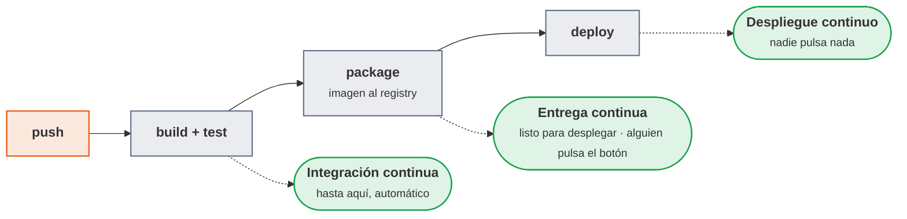
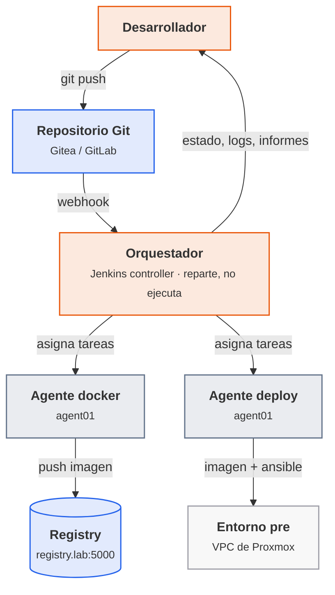
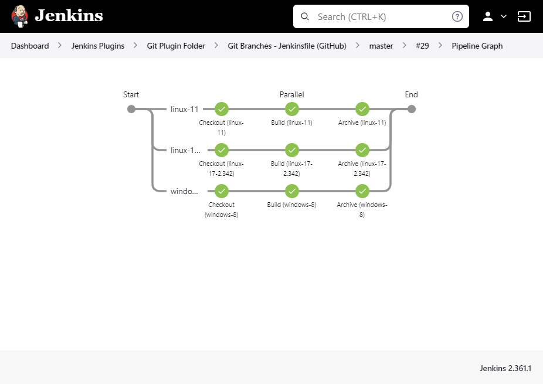
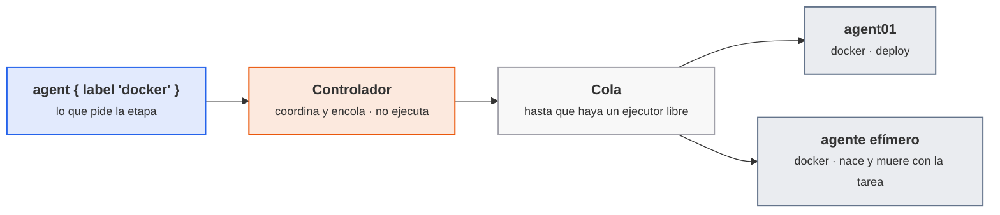
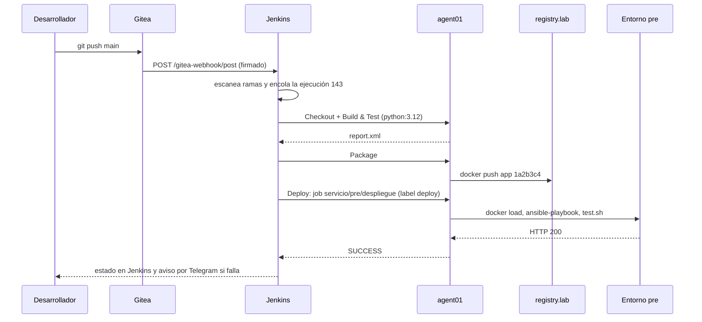
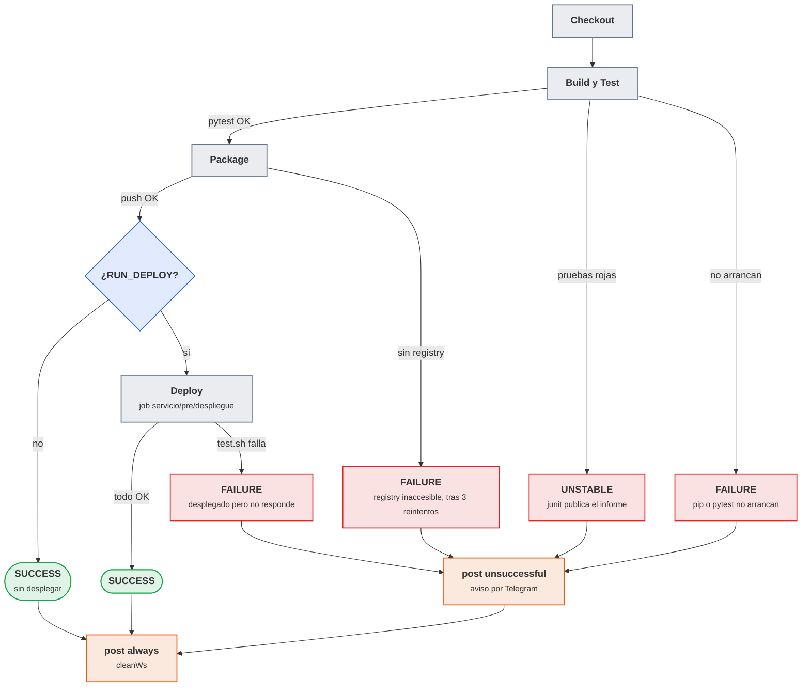
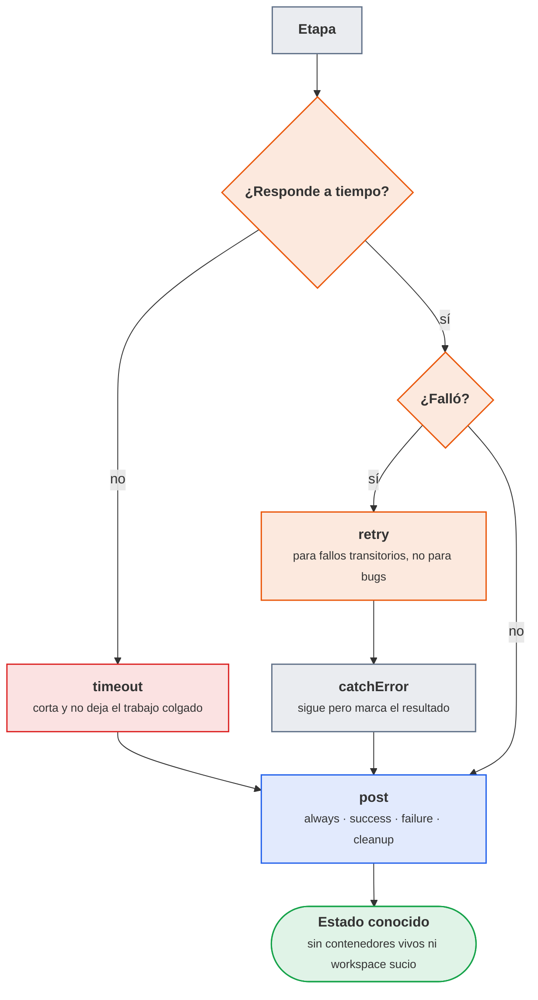
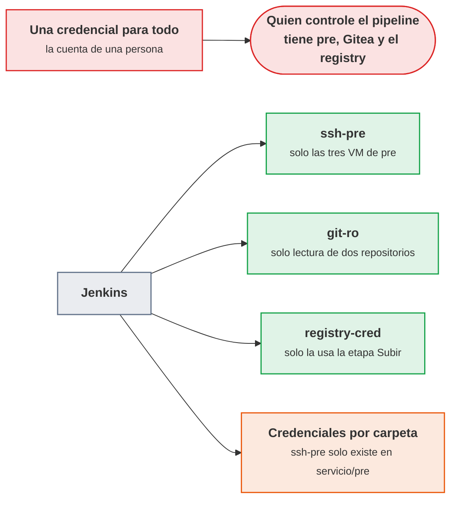

# UT6 · Orquestador de integración continua

<p class="ut-meta">18 h · Sesiones 30 a 38 · RA4 CE a, b, c, d, e, f, g, h</p>

En la UT5 quedó un repositorio con el que se levanta el servicio del curso de principio a fin: `tofu apply` crea las máquinas en Proxmox, Ansible las configura y `test.sh` comprueba que responde. Todo eso se lanzaba a mano desde el puesto de administración, con claves y tokens personales. Esta unidad quita a la persona de en medio: un orquestador de integración continua vigila el repositorio, ejecuta las pruebas, construye la imagen, la sube a un registry y, cuando se le pide, la lleva a `pre` y la despliega con el playbook y el `test.sh` de la UT5. La unidad monta Jenkins desde cero (contenedor, TLS, roles, plugins, agentes), escribe el pipeline y, sobre todo, lo prueba por todos los caminos que puede tomar, incluidos los que acaban mal. En la UT7, Prometheus y Grafana vigilan tanto el orquestador como el servicio que despliega.

<figure markdown="span">
  { width="120" }
  <figcaption>Jenkins, el orquestador que se usa en el laboratorio. Fuente: proyecto Jenkins, CC BY-SA 3.0.</figcaption>
</figure>

## Introducción

Antes de instalar nada conviene tener claro qué se pide al terminar, qué piezas intervienen y en qué orden se van a montar. Este apartado lo resume; a partir de él la unidad sigue las sesiones una a una.

### Qué tienes que saber hacer al terminar

- Explicar qué es CI, en qué se diferencia de la entrega continua y del despliegue continuo, y elegir un orquestador con criterios de control de variables, limitaciones e integración con el resto de herramientas (CE 4a).
- Instalar Jenkins en contenedor con TLS válido para el aula, usuarios y roles, y con la configuración en un YAML versionado (CE 4b).
- Instalar y configurar los plugins que hacen falta, y solo esos (CE 4c).
- Crear un proyecto Multibranch conectado al repositorio con una credencial de solo lectura y un webhook que lo dispare (CE 4d).
- Escribir tareas parametrizadas: en qué agente corren, con qué variables y bajo qué condiciones (CE 4e).
- Escribir un pipeline declarativo con etapas de checkout, build, test, package y deploy (CE 4f).
- Probar el pipeline en todos los caminos, con timeouts, reintentos y notificaciones, y dejar el entorno en un estado conocido cuando algo falla (CE 4g).
- Aplicar mínimo privilegio a cada credencial y agente, y mantener un inventario de secretos (CE 4h).

### Los conceptos de la unidad

Un jueves de febrero, a las tres de la tarde, un compañero sube al repositorio un cambio de tres líneas en la API y se va a clase. El cambio rompe una prueba, pero nadie ejecuta `pytest` hasta el lunes, cuando otro compañero lanza el playbook desde su puesto, con su clave personal, y despliega en `pre` un servicio que no arranca. Nadie sabe qué commit era ni con qué imagen se desplegó. Lo que se busca al final de la unidad cabe en una frase: que cada push se pruebe, se empaquete y, si alguien lo pide, se despliegue solo, en una máquina que no es la de nadie, con registro de todo y sin que ninguna contraseña salga de donde se guarda.

| Herramienta o concepto | Qué es, en una frase | Para qué se usa en esta unidad |
|----|----|----|
| Jenkins | Servidor que vigila el repositorio y ejecuta tareas cuando hay cambios, como un compañero que nunca duerme | El orquestador que se instala, se asegura y se programa a lo largo de la unidad |
| Pipeline y `Jenkinsfile` | La cadena de etapas por la que pasa cada cambio (descargar, probar, empaquetar, desplegar), escrita en un fichero que vive junto al código | El del servicio del curso, escrito en el dialecto declarativo de Groovy de Jenkins |
| Agente | Máquina o contenedor donde Jenkins ejecuta de verdad las tareas; el servidor solo reparte trabajo | `agent01` por SSH y agentes desechables en contenedor |
| Webhook | Aviso HTTP que el servidor Git manda a Jenkins en cuanto alguien hace push | Dispara el pipeline sin que nadie pulse nada |
| Registry local (`registry:2`) | Almacén de imágenes de contenedor, como un Docker Hub privado del laboratorio | El pipeline sube ahí cada imagen, etiquetada con su commit |
| Multibranch Pipeline | Tipo de proyecto de Jenkins que crea un pipeline por cada rama del repositorio que tenga `Jenkinsfile` | El proyecto del servicio, disparado por el webhook |
| Credenciales y `withCredentials` | Caja fuerte de tokens, contraseñas y claves; el pipeline las pide por nombre y nunca las lleva escritas, y cada una pertenece a un usuario de servicio con lo justo | Todo secreto pasa por ahí y se enmascara en el log |
| Plugins | Piezas que se añaden a Jenkins para que entienda Git, Docker, informes de pruebas o roles | Solo los que hacen falta, desde un fichero versionado |
| JCasC (Configuration as Code) | Plugin que carga toda la configuración de Jenkins desde un YAML en lugar de pulsar opciones en la web | Un Jenkins que se reconstruye desde un repositorio |
| TLS con la CA del curso (openssl, nginx) | Certificado firmado por la CA que se creó en la UT3, para que navegadores y Docker confíen en `jenkins.lab`, `gitea.lab` y el registry | Jenkins, Gitea y el registry solo hablan cifrado |
| Informe JUnit | Formato XML estándar en el que `pytest` deja el resultado de cada prueba | Jenkins lo lee para marcar las pruebas rojas |
| Estados del pipeline | SUCCESS, UNSTABLE, FAILURE, ABORTED: cómo ha acabado cada ejecución, más fino que el 0 o 1 de un script | El plan de pruebas de fallos provoca cada uno a propósito |
| Ansible y `test.sh` (UT5) | El playbook que deja el servicio en `app01` de `pre` y el script que comprueba que responde | El despliegue los ejecuta tal cual, con la clave que le presta Jenkins |

**Cómo está organizada la unidad.** La unidad sigue las sesiones en orden y cada sesión trae primero la teoría que se explica y después su hoja de práctica. En la sesión 30 se compara Jenkins con Gitea Actions y se justifica la elección; en la 31 se instala Jenkins con TLS, roles y los plugins de la unidad, con todo ello en el repositorio `jenkins-config`; en la 32 se conecta `agent01` y una cloud Docker; en la 33 se engancha el repositorio del servicio con una credencial de solo lectura y un webhook. Las sesiones 34 y 35 escriben el `Jenkinsfile` etapa a etapa (checkout, build y test, package contra el registry local, y los parámetros y condiciones que deciden qué se ejecuta); la 36 lo somete al plan de pruebas de fallos; la 37 reparte las credenciales con mínimo privilegio y añade la etapa de despliegue, que se recorre por sus dos caminos, y la 38 es la práctica evaluable. Los errores frecuentes del laboratorio quedan al final como material de consulta.

Las tres máquinas de la unidad (`jenkins01`, `agent01` y `gitea01`) viven en la subred de gestión, que es la zona con salida permanente a Internet por 80 y 443 en la [matriz de reglas del laboratorio](../laboratorio.md): por eso pueden instalar paquetes y descargar imágenes y plugins sin abrir nada más.

!!! otra "Dónde se usa esto en la otra asignatura"
    Esta unidad va del 3 de febrero al 10 de marzo y coincide con la [UT7 de Mantenimiento, actualización y vulnerabilidades](https://victor-educ.github.io/apuntes-5169/ut/ut7-actualizacion-vulnerabilidades/) y con la [UT8, terminación segura](https://victor-educ.github.io/apuntes-5169/ut/ut8-terminacion-segura/). Allí se dan por conocidos Jenkins, sus credenciales y el registry local que se montan aquí.

    - En Mantenimiento se añade al `Jenkinsfile` una [etapa de escaneo con Trivy](https://victor-educ.github.io/apuntes-5169/ut/ut7-actualizacion-vulnerabilidades/#la-etapa-de-escaneo-en-el-jenkinsfile) entre construir la imagen y subirla al registry. El `Jenkinsfile` de esta unidad le deja el sitio marcado dentro de `Package`, entre `Construir` y `Subir`, y usa las mismas variables (`IMAGEN` y `TAG`). `Package` llega el 19 de febrero, un día después de que allí se pida el escaneo: hasta entonces la etapa se prueba en un job aparte que solo construya y escanee, y desde ese día se pega en el hueco. La evalúa Mantenimiento: la práctica evaluable de esta unidad no la pide.
    - La UT8 de Mantenimiento [retira las credenciales de Jenkins](https://victor-educ.github.io/apuntes-5169/ut/ut8-terminacion-segura/#credenciales-y-tokens) del entorno `pre`: la credencial `ssh-pre` y la carpeta `servicio/pre`, el 11 de marzo, recorriendo el inventario de la sesión 37. El repositorio `servicio`, su webhook y el Multibranch no se tocan: el pipeline sigue construyendo. El último despliegue en `pre` es el de la A6.8 (26 de febrero); el 9 de marzo Mantenimiento para el servicio de `pre`, así que la práctica evaluable del 10 se entrega con las evidencias del 26 y no despliega.

### Plan de sesiones

Cada sesión de 110 minutos empieza con una explicación corta y sigue con laboratorio. La columna «Se explica» recoge los apartados de teoría que se desarrollan en clase, con su duración aproximada; la columna «Se practica», el trabajo de laboratorio de esa sesión. Las sesiones marcadas solo como práctica no traen teoría nueva.

| Sesión | Fecha | Tipo | Se explica | Se practica |
|---:|-------|------|------------|-------------|
| [30](#sesion-30-ci-y-eleccion-del-orquestador) | 3 feb | Teoría y práctica | Integración, entrega y despliegue continuos; piezas de un sistema de CI; criterios para elegir orquestador (30 min). | Demo en 30 minutos de Jenkins y Gitea Actions con el mismo hola mundo; tabla comparativa y justificación de media página. |
| [31](#sesion-31-instalacion-segura-y-plugins) | 5 feb | Teoría y práctica | Cómo se instala Jenkins en contenedor, TLS con CA propia, roles y hardening (15 min); qué plugins hacen falta y por qué JCasC (10 min). | Desplegar Jenkins con TLS de la CA propia, roles admin/dev/lector y ejecutores del controlador a 0; revisar tres plugins antes de instalarlos, fijar las versiones en plugins.txt y dejar imagen, YAML y README en jenkins-config. |
| [32](#sesion-32-agentes) | 10 feb | Teoría y práctica | Controlador frente a agentes; tipos de agente y etiquetas (15 min). | VM agent01 como agente SSH, cloud Docker para agentes efímeros, un job en cada tipo y comprobar en el log dónde ha corrido. |
| [33](#sesion-33-proyecto-y-credenciales) | 12 feb | Teoría y práctica | Tipos de proyecto, credenciales con ámbito, webhooks (15 min). | Mudar Gitea a gitea01, usuario de servicio y token, Multibranch Pipeline del servicio, webhook con secreto y primer disparo por push. |
| [34](#sesion-34-pipeline-i-build-y-test) | 17 feb | Teoría y práctica | Sintaxis del Jenkinsfile declarativo: agent, stages, steps, post (20 min). | Jenkinsfile con Checkout y Build & Test en agente Docker, Dockerfile del servicio construido y probado a mano, informe JUnit, comprobación de stash y de options, una prueba que falla y el estado UNSTABLE. |
| [35](#sesion-35-pipeline-ii-package-y-ejecucion-condicional) | 19 feb | Teoría y práctica | Registry local con TLS y cómo confía Docker en una CA propia (10 min); when, parallel, matrix e input (15 min). | Levantar el registry, etapa Package que sube la imagen etiquetada con el commit, parámetros ENV y RUN_DEPLOY usados de verdad, Lint en paralelo con Test, Package solo en main y Deploy provisional; recorrer la tabla de verdad de las cuatro combinaciones. |
| [36](#sesion-36-gestion-de-errores) | 24 feb | Teoría y práctica | timeout, retry, catchError y cleanWs; notificación por Telegram o Slack (10 min). | Ejecutar uno a uno los cinco casos del plan de pruebas de fallos con su ficha de evidencias, corregir lo que no se comporte y repetirlo; configurar la notificación por Telegram o Slack. |
| [37](#sesion-37-minimo-privilegio-y-despliegue) | 26 feb | Teoría y práctica | Usuarios de servicio, tokens con alcance y credenciales por carpeta (10 min); el despliegue a pre desde un job con su propia credencial (10 min). | Credencial ssh-pre solo en la carpeta pre y comprobar que un job de dev no la ve; inventario de credenciales; etapa Deploy que lleva la imagen a app01 de pre, ejecuta el playbook y test.sh, y recorrer sus dos caminos: despliegue correcto y fallo en el smoke test. |
| **[38](#sesion-38-practica-evaluable)** | **10 mar** | Práctica evaluable | Aclaración del enunciado (10 min). | Cerrar jenkins-config, el Jenkinsfile completo, el informe de pruebas del pipeline y el inventario de credenciales, con las evidencias del 26 de febrero y sin desplegar. |

## Sesión 30 · CI y elección del orquestador

<p class="ut-meta" markdown>3 de febrero · Teoría y práctica · <span class="dur" tabindex="0" aria-label="Integración continua, entrega continua y despliegue continuo · 20 min&#10;Elegir el orquestador · 10 min&#10;A6.1 Elección del orquestador · 80 min" data-dur="Integración continua, entrega continua y despliegue continuo · 20 min&#10;Elegir el orquestador · 10 min&#10;A6.1 Elección del orquestador · 80 min">:material-school:<i class="dur-barra" style="--teoria:27%"></i>:material-flask:</span></p>

Al acabar queda el mismo hola mundo ejecutado en Jenkins y en Gitea Actions y una justificación escrita de cuál usar para el servicio del curso. Para la hoja hacen falta los dos apartados de abajo: el vocabulario (integración, entrega y despliegue continuos, y qué aporta un pipeline frente a un script) y la comparativa de orquestadores con los criterios del módulo.

### Integración continua, entrega continua y despliegue continuo

Antes de tocar Jenkins hay que ponerse de acuerdo en las palabras, porque en las ofertas de trabajo y en los blogs se usan como sinónimos y no lo son. Este apartado deja claro qué se automatiza en cada escalón, qué piezas intervienen y qué gana un pipeline frente al script de la UT5; sin eso, la comparativa del apartado siguiente no se puede leer con criterio.


```mermaid
flowchart LR
    PUSH["<b>push</b>"]:::act
    B["<b>build + test</b>"]:::pieza
    PKG["<b>package</b><br><small>imagen al registry</small>"]:::pieza
    DEP["<b>deploy</b>"]:::pieza
    CI(["<b>Integración continua</b><br><small>hasta aquí, automático</small>"]):::ok
    CD(["<b>Entrega continua</b><br><small>listo para desplegar · alguien pulsa el botón</small>"]):::ok
    DC(["<b>Despliegue continuo</b><br><small>nadie pulsa nada</small>"]):::ok
    PUSH --> B --> PKG --> DEP
    B -.-> CI
    PKG -.-> CD
    DEP -.-> DC
    classDef act fill:#ea580c22,stroke:#ea580c,stroke-width:1.5px
    classDef pieza fill:#64748b22,stroke:#64748b,stroke-width:1.5px
    classDef dato fill:#2563eb22,stroke:#2563eb,stroke-width:1.5px
    classDef infra fill:#a1a1aa14,stroke:#a1a1aa,stroke-width:1.5px
    classDef ok fill:#16a34a22,stroke:#16a34a,stroke-width:1.5px
    classDef riesgo fill:#dc262622,stroke:#dc2626,stroke-width:1.5px
```

<p class="pie" markdown>Los tres escalones son el mismo pipeline: lo que cambia es hasta dónde llega sin intervención humana.</p>


**Integración continua (CI)** es integrar el trabajo de todos los desarrolladores varias veces al día en un repositorio común y comprobar automáticamente, en cada integración, que el proyecto compila, pasa las pruebas y se empaqueta. La idea la formalizó Martin Fowler hace más de veinte años y no ha cambiado: si se integra poco y tarde, el día que se junta el trabajo de cinco personas aparecen conflictos que nadie sabe resolver; si se integra cada pocas horas y una máquina ejecuta las pruebas en cada integración, el error aparece a los diez minutos de haberlo cometido y lo arregla quien lo acaba de escribir.

Sobre esa base se construyen dos escalones más, y conviene no confundirlos porque en las ofertas de trabajo se mezclan alegremente:

| Escalón | Qué añade | Quién decide el paso a producción |
|---|---|---|
| Integración continua | Build, pruebas y empaquetado automáticos en cada cambio | Nadie despliega todavía |
| Entrega continua (*continuous delivery*, CD) | El artefacto validado se despliega automáticamente en entornos de prueba y queda listo para producción | Una persona pulsa un botón |
| Despliegue continuo (*continuous deployment*) | Cada cambio que pasa todas las pruebas llega a producción sin intervención | Nadie; el pipeline entero es la aprobación |

En el módulo se llega hasta la entrega continua: el pipeline despliega en `pre` cuando se le pide con un parámetro, y el paso a producción sigue siendo una decisión humana. El despliegue continuo exige una batería de pruebas y una madurez de equipo que no se improvisan; casi ninguna empresa lo hace de verdad, aunque lo diga.

#### Las piezas

- **Repositorio Git** con el código del servicio y, en el mismo repositorio, la definición del pipeline. Que el pipeline viva con el código importa: se versiona, se revisa en un *merge request* (la petición de fusionar una rama, *pull request* en GitHub) y cada rama lleva el suyo.
- **Orquestador** (Jenkins, GitLab CI, GitHub Actions, Gitea Actions): recibe el aviso de cambio, decide qué ejecutar, dónde, con qué credenciales, y guarda resultados, logs e informes.
- **Agentes** o *runners*: las máquinas o contenedores donde se ejecutan realmente las tareas. El orquestador solo coordina; si ejecutase él mismo las tareas, cualquier `sh` de cualquier pipeline correría con los permisos del orquestador entero.
- **Registry** de imágenes y almacén de artefactos: donde queda lo que produce el pipeline (imágenes, paquetes, informes) identificado por el commit que lo generó.
- **Entornos** de destino: el entorno `pre` que se creó en la UT5.


```mermaid
flowchart TB
    DEV["<b>Desarrollador</b>"]:::act
    REPO["<b>Repositorio Git</b><br><small>Gitea / GitLab</small>"]:::dato
    CTRL["<b>Orquestador</b><br><small>Jenkins controller · reparte, no ejecuta</small>"]:::act
    AG1["<b>Agente docker</b><br><small>agent01</small>"]:::pieza
    AG2["<b>Agente deploy</b><br><small>agent01</small>"]:::pieza
    REG[("<b>Registry</b><br><small>registry.lab:5000</small>")]:::dato
    ENV["<b>Entorno pre</b><br><small>VPC de Proxmox</small>"]:::infra
    DEV -->|git push| REPO
    REPO -->|webhook| CTRL
    CTRL -->|asigna tareas| AG1
    CTRL -->|asigna tareas| AG2
    AG1 -->|push imagen| REG
    AG2 -->|imagen + ansible| ENV
    CTRL -->|estado, logs, informes| DEV
    classDef act fill:#ea580c22,stroke:#ea580c,stroke-width:1.5px
    classDef pieza fill:#64748b22,stroke:#64748b,stroke-width:1.5px
    classDef dato fill:#2563eb22,stroke:#2563eb,stroke-width:1.5px
    classDef infra fill:#a1a1aa14,stroke:#a1a1aa,stroke-width:1.5px
    classDef ok fill:#16a34a22,stroke:#16a34a,stroke-width:1.5px
    classDef riesgo fill:#dc262622,stroke:#dc2626,stroke-width:1.5px
```

<p class="pie" markdown>El círculo se cierra en el desarrollador: lo que hace útil un pipeline no es que despliegue, es que devuelva el resultado a quien escribió el cambio.</p>

#### Qué aporta un pipeline frente a un script

La pregunta es legítima, porque el `test.sh` de la UT5 ya encadena `tofu apply`, `ansible-playbook` y un `curl`, y con un script un poco más largo y un cron se cubriría lo mismo. Se cubriría solo en el camino feliz. Un **pipeline** es la cadena de etapas que atraviesa cada cambio (checkout, build, test, package, deploy) donde cada etapa produce salidas (artefactos, informes) y puede detener la cadena si falla, y el orquestador le añade lo que un script no tiene:

- **Aislamiento por etapa**: cada etapa puede correr en un agente distinto, con una imagen distinta, sin heredar el estado de la anterior salvo lo que se le pasa explícitamente.
- **Historial**: cada ejecución queda numerada, con su commit, su log, quién la lanzó, cuánto tardó y qué produjo. Cuando algo falla en producción, se puede ir a la ejecución #142 y ver qué se probó.
- **Estados con significado**: un script devuelve 0 o distinto de 0. Un pipeline distingue entre "todo bien", "todo se ejecutó pero hay pruebas rojas", "se rompió a mitad" y "alguien lo canceló", y reacciona distinto en cada caso.
- **Credenciales gestionadas**: el script tiene el token en una variable de entorno o, peor, en el propio fichero. El orquestador lo guarda cifrado, lo inyecta solo en la etapa que lo necesita y lo enmascara en el log.
- **Condiciones y paralelismo**: "esto solo en `main`", "esto solo si cambió `Dockerfile`", "lint (el análisis estático del código, sin ejecutarlo) y test a la vez". En bash se puede, pero cada condición es un `if` más que nadie prueba.
- **Disparo automático** desde el repositorio y **límites** (tiempo máximo, no concurrencia) que evitan que dos despliegues pisen el mismo entorno.

### Elegir el orquestador

Jenkins no es la única opción, y en una empresa el orquestador no se elige por costumbre. Aquí se comparan los cuatro más extendidos con los criterios que pide el módulo, para poder defender la elección delante de quien pregunte y para reconocer los otros tres al cambiar de empresa.

|  | **Jenkins** | **GitLab CI** | **GitHub Actions** | **Gitea Actions** |
|----|----|----|----|----|
| Instalación | Servidor propio (paquete Java o contenedor) | Incluido en GitLab (autoalojado o SaaS, el servicio alojado por el proveedor) | Servicio de GitHub; runners propios opcionales | Incluido en Gitea desde 1.19; runner `act_runner` |
| Integración con el entorno | Más de 1800 plugins: Git, Docker, Ansible, cualquier registry | Integrado con su repositorio y su registry; *components* y *templates* | Marketplace de acciones | Reutiliza acciones de GitHub (con matices) |
| Registro de ejecuciones | Historial por job con log, `archiveArtifacts` e informes por plugin | Log por job, `artifacts:` e informes JUnit nativos | Log por job y `upload-artifact` | Igual que Actions, con soporte parcial |
| Control de variables y límites | Parámetros, credenciales, throttling, cuotas por agente, timeouts | Variables por proyecto/grupo, límites por runner, `timeout`, `resource_group` | Secretos, concurrencia, matrices, `timeout-minutes` | Secretos, concurrencia, matrices |
| Coste de mantenimiento | Alto: actualizaciones del núcleo y de plugins, backups, agentes | Medio: va con GitLab, pero GitLab en sí es pesado | Bajo si es SaaS; medio con runners propios | Bajo |
| Comunidad y documentación | Enorme y veterana; mucho material antiguo que ya no aplica | Muy buena, documentación oficial excelente | La mayor en proyectos abiertos | Pequeña pero creciente |
| Punto fuerte | Flexibilidad, cualquier tecnología, control total | Todo en una herramienta | Sencillez, ecosistema de acciones | Ligero, autoalojado, sintaxis conocida |
| Punto débil | Mantenimiento de plugins, curva de entrada | Ligado a GitLab | Menos control fino; coste de minutos en SaaS | Menos maduro, menos control fino |

Los nombres de fichero, el modelo de runners y la forma de guardar secretos de cada uno están en [Para ampliar](../ampliacion.md#equivalencias-entre-los-cuatro-orquestadores), por si hay que reconocerlos al cambiar de herramienta.

Criterios de selección (CE 4a): que pueda **controlar las variables** del pipeline (parámetros, secretos, entorno), aplicar **limitaciones** (tiempo máximo, concurrencia, agentes permitidos, quién puede lanzar qué), **integrarse** con las tecnologías del entorno (Git, Docker, Ansible, registry) y **registrar** cada ejecución con su log y sus artefactos. A esos cuatro criterios técnicos conviene sumar dos de organización, que en una empresa pesan igual: quién lo va a mantener (un Jenkins sin dueño se convierte en un museo de plugins sin parchear) y dónde está el código (con el código ya en GitLab, montar un Jenkins aparte necesita una justificación).

En el módulo se usa **Jenkins** por su flexibilidad y porque obliga a entender cada pieza: en GitLab CI el runner, los secretos y el webhook vienen hechos y no se ve cómo funcionan; en Jenkins se montan uno a uno y, cuando fallan, se sabe dónde mirar. Todo lo aprendido se traslada a GitLab CI cambiando la sintaxis; en [Para ampliar](../ampliacion.md#el-mismo-pipeline-en-gitlab-ci) está el mismo pipeline escrito en `.gitlab-ci.yml`, como lectura opcional.

### A6.1 Elección del orquestador (sesión 30)

<span class="et et-obj">Objetivo</span> Tener el mismo "hola mundo" ejecutado en Jenkins y en Gitea Actions, y una justificación escrita de cuál usarías para el servicio del curso.

<span class="et et-pre">Antes de empezar</span> El nodo, la plantilla 9000 y el puesto de administración accesibles, y tu Gitea de `mon01` (`http://gitea.lab:3001`, la de la A2.6 de Mantenimiento) con tu usuario. Se han explicado [integración, entrega y despliegue continuos](#integracion-continua-entrega-continua-y-despliegue-continuo) y la [comparativa de orquestadores](#elegir-el-orquestador).

<span class="et et-pas">Pasos</span>

1. Crea `jenkins01`, la máquina de Jenkins de la tabla del laboratorio (VM 101, `devmgmt`, 10.10.0.10, 2 GB). Hoy corre en ella la demo y en la sesión 31 el Jenkins definitivo:

    ```bash
    # en el nodo
    qm clone 9000 101 --name jenkins01 --full
    qm set 101 --memory 2048 --cores 2 \
      --net0 virtio,bridge=devmgmt \
      --ipconfig0 ip=10.10.0.10/24,gw=10.10.0.1 \
      --nameserver 10.10.0.1 --searchdomain lab
    qm start 101
    # en el puesto de administración
    ssh ops@10.10.0.10 'sudo hostnamectl set-hostname jenkins01 && sudo apt-get update &&
      sudo apt-get install -y docker.io docker-compose-v2 && sudo usermod -aG docker ops'
    ```

    Mientras se instala, da de alta sus dos nombres en OPNsense (Services, Dnsmasq DHCP & DNS, Hosts): `jenkins` y `jenkins01` en el dominio `lab`, los dos a 10.10.0.10.

2. Jenkins de demo, sin TLS ni roles todavía (eso es la sesión 31). En `jenkins01`, un `~/demo/compose.yml`:

    ```yaml
    services:
      jenkins:
        image: jenkins/jenkins:lts-jdk21
        ports: ["8080:8080"]
        volumes: ["jenkins_home:/var/jenkins_home"]
    volumes:
      jenkins_home:
    ```

    El 8080 se publica solo en esta demo: el Jenkins definitivo de la sesión 31 lo deja dentro de la red del compose y únicamente nginx llega a él. `docker compose up -d` y, desde tu puesto del aula, un túnel por el puesto de administración: `ssh -L 8080:10.10.0.10:8080 ops@<IP de aula de admin01>` y `http://localhost:8080` en el navegador. Entra con la contraseña de `docker compose exec jenkins cat /var/jenkins_home/secrets/initialAdminPassword` e instala los plugins sugeridos.
3. Crea un proyecto de tipo Pipeline con este `Jenkinsfile` escrito en el propio job:

    ```groovy
    pipeline {
        agent any
        stages {
            stage('Hola') { steps { echo 'hola desde Jenkins' } }
        }
    }
    ```

4. Gitea Actions: en tu Gitea crea un repositorio de prueba `hola-ci`, activa Actions en él (Settings → Repository → Enable Actions) y saca un token de registro en Settings → Actions → Runners. Levanta el runner en `jenkins01` con este `~/runner/compose.yml`, antes de escribir el workflow, para que baje la imagen mientras tanto:

    ```yaml
    services:
      runner:
        image: gitea/act_runner:0.2.11
        environment:
          GITEA_INSTANCE_URL: http://gitea.lab:3001
          GITEA_RUNNER_REGISTRATION_TOKEN: <el token de registro>
          GITEA_RUNNER_LABELS: "debian:docker://debian:13-slim"
        volumes:
          - ./data:/data
          - /var/run/docker.sock:/var/run/docker.sock
    ```

    Cuando el runner salga en verde en la página de runners, crea desde la web del repositorio el fichero `.gitea/workflows/hola.yml`:

    ```yaml
    on: [push]
    jobs:
      hola:
        runs-on: debian
        steps:
          - run: echo hola desde Gitea Actions
    ```

5. Lanza los dos, entra en el log de cada ejecución y apunta dónde ha corrido cada uno, qué tardó y cuántos pasos de configuración hicieron falta hasta ver el `echo`.
6. Rellena una tabla comparativa de Jenkins y Gitea Actions con los criterios del apartado de elección (control de variables, limitaciones, integración, registro, mantenimiento, comunidad) usando lo que acabas de ver y la tabla de la teoría.
7. Redacta media página justificando cuál usarías para el servicio del curso.

<span class="et et-com">Comprobación</span> Las dos ejecuciones en verde con el `echo` visible en el log, y una tabla donde cada casilla diga algo que hayas comprobado, no copiado.

<span class="et et-ent">Entrega</span> La tabla y la justificación en Aules, con dos capturas (una ejecución de cada orquestador).

<span class="et et-ext">Si te sobra tiempo</span> Añade una segunda etapa que falle (`sh 'exit 1'`) en los dos y compara cómo lo muestra cada uno.

## Sesión 31 · Instalación segura y plugins

<p class="ut-meta" markdown>5 de febrero · Teoría y práctica · <span class="dur" tabindex="0" aria-label="Instalar y asegurar Jenkins · 15 min&#10;Plugins · 10 min&#10;A6.2 Instalación segura y plugins · 85 min" data-dur="Instalar y asegurar Jenkins · 15 min&#10;Plugins · 10 min&#10;A6.2 Instalación segura y plugins · 85 min">:material-school:<i class="dur-barra" style="--teoria:23%"></i>:material-flask:</span></p>

Al acabar, Jenkins corre en `https://jenkins.lab` con certificado de la CA del curso, tres roles, ejecutores del controlador a 0 y los plugins de la unidad instalados desde una imagen propia con su versión fijada; la instalación entera (compose, `Dockerfile`, `plugins.txt`, YAML de JCasC y README) queda en el repositorio `jenkins-config`. La sesión junta la instalación y los plugins porque son el mismo trabajo visto dos veces: la imagen que se construye para arrancar Jenkins es ya la que lleva los plugins dentro.

### Instalar y asegurar Jenkins

Este apartado deja Jenkins instalado en un contenedor, accesible por HTTPS con un certificado de la CA del curso, con usuarios y roles, y con su configuración en un YAML versionado. El orden importa porque cada paso protege al siguiente: sin TLS las contraseñas viajan en claro, sin roles cualquiera administra, y sin el YAML nadie sabe reconstruirlo cuando se rompa. El `compose.yml`, el `nginx.conf`, los comandos de `openssl` y el `casc/jenkins.yaml` están enteros porque la hoja A6.2 los copia tal cual.

#### Despliegue en contenedor

Jenkins es una aplicación Java que escucha en el puerto 8080 por HTTP. La imagen oficial `jenkins/jenkins:lts-jdk21` trae el controlador y nada más: ni Docker, ni Git en versión útil, ni plugins. Todo su estado (configuración, jobs, credenciales cifradas, historial) vive en `/var/jenkins_home`, y ese directorio es lo único que hay que conservar.

Jenkins no termina TLS: delante va un proxy inverso que lo hace por él. Es la opción del curso y la que se ve en las empresas, porque nginx (o Traefik, o el balanceador del proveedor) termina TLS con un certificado normal en PEM (el formato de texto habitual para certificados y claves), el mismo que serviría para cualquier otro servicio, y Jenkins habla HTTP por la red interna del compose.

```yaml
# compose.yml
services:
  jenkins:
    image: jenkins/jenkins:lts-jdk21
    volumes:
      - jenkins_home:/var/jenkins_home
      - ./casc:/var/jenkins_home/casc:ro
      - ./secrets:/run/secrets:ro      # claves que lee JCasC (sesión 32)
    env_file: .env                     # contraseñas de los usuarios, fuera del repositorio
    environment:
      JAVA_OPTS: "-Djenkins.install.runSetupWizard=false"
      CASC_JENKINS_CONFIG: /var/jenkins_home/casc/jenkins.yaml
    # sin ports: solo nginx llega a él por la red interna del compose
  nginx:
    image: nginx:1.27
    ports: ["443:443"]
    volumes:
      - ./nginx.conf:/etc/nginx/conf.d/default.conf:ro
      - ./certs:/etc/nginx/certs:ro
    depends_on: [jenkins]
volumes:
  jenkins_home:
```

```nginx
# nginx.conf
server {
    listen 443 ssl;
    server_name jenkins.lab;
    ssl_certificate     /etc/nginx/certs/jenkins.crt;
    ssl_certificate_key /etc/nginx/certs/jenkins.key;

    location / {
        proxy_pass         http://jenkins:8080;
        proxy_http_version 1.1;
        proxy_set_header   Host              $host;
        proxy_set_header   X-Real-IP         $remote_addr;
        proxy_set_header   X-Forwarded-For   $proxy_add_x_forwarded_for;
        proxy_set_header   X-Forwarded-Proto https;
        proxy_set_header   X-Forwarded-Host  $host;
        # agentes inbound por WebSocket y consola en vivo
        proxy_set_header   Upgrade    $http_upgrade;
        proxy_set_header   Connection "upgrade";
        proxy_read_timeout 90s;
        client_max_body_size 50m;
    }
}
```

Cambiar el certificado no toca a Jenkins, y el mismo nginx puede servir el registry y Gitea en otros `server`. La única condición es configurar en Jenkins la URL pública (`https://jenkins.lab/`) y pasar las cabeceras `X-Forwarded-*`; si no, Jenkins genera enlaces con `http://jenkins:8080` y aparece el aviso "It appears that your reverse proxy set up is broken".

Jenkins también sabe servir HTTPS él mismo, cargando un keystore Java (un fichero con el certificado y la clave en el formato que entiende Java) y publicando el 8443. Se usa cuando no hay ningún proxy delante; el compose y los comandos de esa variante están en [Para ampliar](../ampliacion.md#jenkins-con-keystore-java).

Jenkins vive en la subred de gestión de la VPC (en el laboratorio del curso, `10.10.0.0/24`, en la VM `jenkins01` con la 10.10.0.10 y el nombre `jenkins.lab`), nunca en la DMZ externa: contiene credenciales de todo lo demás y no lo necesita nadie de fuera.

#### Certificados

Certificado propio firmado por una CA interna, entregado a nginx en PEM. En el laboratorio no se crea ninguna CA nueva: se usa **la CA del curso**, la que se montó con `openssl ca` en la [A3.2](ut3-seguridad-por-capas.md#a32-publicar-la-web-sesion-15) y vive en `~/ca/` del puesto de administración, con su `ca.cnf` y su registro de certificados emitidos. Su `ca.crt` se instala en los navegadores del aula y en el almacén del sistema de las máquinas que van a hablar con Jenkins, Gitea y el registry (`/usr/local/share/ca-certificates/lab-ca.crt` y `update-ca-certificates` en Debian/Ubuntu); `ca.key` no sale nunca del puesto. En producción se usa la CA corporativa: Let's Encrypt necesita que el nombre sea público, y Jenkins no debe serlo.

Emitir un certificado para `jenkins.lab` son dos comandos, desde `~/ca/` (`openssl ca` pide confirmar dos veces):

```bash
openssl req -new -newkey rsa:2048 -nodes -keyout jenkins.key -out jenkins.csr \
  -subj "/CN=jenkins.lab" -addext "subjectAltName=DNS:jenkins.lab"
openssl ca -config ca.cnf -extensions server_cert -notext -in jenkins.csr -out jenkins.crt
```

Los certificados de `gitea.lab` (sesión 33) y del registry (sesión 35) salen de los mismos dos comandos cambiando el nombre. `-extensions client_cert` en lugar de `server_cert` da un certificado de cliente, que es lo que usa Jenkins para hablar con el demonio Docker de su agente en la sesión 32.

!!! truco "subjectAltName obligatorio"
    Sin el `subjectAltName` los navegadores actuales rechazan el certificado aunque el CN sea correcto; es el error más repetido en esta sesión.

#### Usuarios y permisos

- Manage Jenkins → Security → Authorization: **Matrix-based security** o el plugin **Role-based Authorization Strategy**. La matriz vale para tres usuarios; en cuanto hay carpetas y equipos, los roles se gestionan mejor.
- Roles: administrador (pocos, dos personas como máximo), desarrollador (construir y ver), lector (solo ver), cuentas de servicio (solo lo que su tarea necesita, por ejemplo un rol que solo puede lanzar un job concreto desde el webhook).
- Usuarios locales, declarados en el YAML de JCasC, solo en el laboratorio; en una empresa se autentica contra el directorio corporativo, como se cuenta en [Para ampliar](../ampliacion.md#operar-jenkins-directorio-actualizaciones-y-copias).
- Desactivar el registro abierto de usuarios, activar la protección **CSRF** (contra la falsificación de peticiones desde otro sitio: que una web ajena use el navegador de la persona, ya autenticado, para lanzar acciones en Jenkins; la implementa el *crumb issuer*, viene activada y hay tutoriales antiguos que enseñan a desactivarla para que funcione un `curl`: no se desactiva, se pasa el crumb o se usa un token de API), limitar el acceso a la **script console** (Manage Jenkins → Script Console ejecuta Groovy, el lenguaje en que están escritos Jenkins y los `Jenkinsfile`, sin restricción y con los permisos del proceso de Jenkins; quien tiene `Overall/Administer` tiene eso, por eso hay que dar tan pocos).

#### Hardening del controlador

- **Número de ejecutores** en el controlador: 0. Nada se ejecuta en el controlador, todo en agentes. Un pipeline que corre en el controlador puede leer `/var/jenkins_home/secrets/master.key` y descifrar todas las credenciales.
- **Agent → Controller Access Control** (Manage Jenkins → Security): activado. Limita qué puede pedirle un agente al controlador; sin esto, un agente comprometido puede leer ficheros del controlador. Está activado por defecto desde 2.x y no hay razón para tocarlo.
- **Actualizaciones y copias**: la LTS del controlador, los plugins revisados cada mes y una copia de `jenkins_home` con sus dos ficheros de claves. Cómo se hace cada cosa está en [Para ampliar](../ampliacion.md#operar-jenkins-directorio-actualizaciones-y-copias).
- **Configuration as Code** (plugin **JCasC**): la configuración de Jenkins en un YAML versionado. Es la diferencia entre un Jenkins que se reconstruye en cinco minutos y uno que nadie se atreve a tocar.

El YAML siguiente es una configuración completa para el laboratorio. Conviene fijarse en tres bloques: `securityRealm` y `authorizationStrategy` (los tres usuarios, quién entra y qué puede hacer), `nodes` (el agente que se conecta en la sesión 32) y `credentials` (la clave SSH del agente, leída de un fichero en vez de escrita).

```yaml
# casc/jenkins.yaml
jenkins:
  systemMessage: "Jenkins de la asignatura. Configurado por JCasC, no toques nada a mano."
  numExecutors: 0
  mode: EXCLUSIVE
  securityRealm:
    local:
      allowsSignup: false
      users:
        - id: admin
          password: ${ADMIN_PASSWORD}
        - id: dev
          password: ${DEV_PASSWORD}
        - id: lector
          password: ${LECTOR_PASSWORD}
  authorizationStrategy:
    roleBased:
      roles:
        global:
          - name: admin
            permissions: ["Overall/Administer"]
            entries:
              - user: admin
          - name: dev
            permissions: ["Overall/Read", "Job/Read", "Job/Build", "Job/Cancel", "Job/Workspace"]
            entries:
              - user: dev
          - name: lector
            permissions: ["Overall/Read", "Job/Read"]
            entries:
              - group: authenticated
  crumbIssuer:
    standard:
      excludeClientIPFromCrumb: false
  remotingSecurity:
    enabled: true
  nodes:
    - permanent:
        name: agent01
        labelString: "docker deploy"
        remoteFS: /home/jenkins
        numExecutors: 2
        launcher:
          ssh:
            host: 10.10.0.12
            port: 22
            credentialsId: agent-ssh
            sshHostKeyVerificationStrategy:
              manuallyProvidedKeyVerificationStrategy:
                key: "ssh-ed25519 AAAAC3Nza... agent01"
unclassified:
  location:
    url: https://jenkins.lab/
    adminAddress: ops@lab
credentials:
  system:
    domainCredentials:
      - credentials:
          - basicSSHUserPrivateKey:
              scope: SYSTEM
              id: agent-ssh
              username: jenkins
              privateKeySource:
                directEntry:
                  privateKey: ${AGENT_SSH_KEY}
```

Los valores entre `${...}` los resuelve JCasC al arrancar: las contraseñas, de las variables de entorno del contenedor (el `.env` que carga `env_file`), y `${AGENT_SSH_KEY}`, del fichero `/run/secrets/AGENT_SSH_KEY` que monta la carpeta `secrets/`. Así el YAML se puede subir al repositorio `jenkins-config` sin un solo secreto dentro. El plugin admite exportar la configuración actual (Manage Jenkins → Configuration as Code → View Configuration) para empezar desde un Jenkins configurado a mano y pasar a YAML, aunque la exportación arrastra mucho ruido que conviene limpiar.

### Plugins

Un Jenkins recién instalado no sabe clonar un repositorio, hablar con Docker ni leer un informe de pruebas: cada capacidad la aporta un plugin. Aquí se decide cuáles hacen falta para el módulo y cómo dejarlos instalados de forma que el Jenkins se reconstruya siempre igual.

Se instalan desde Manage Jenkins → Plugins, o mejor, desde una imagen propia que los deja preinstalados para que el Jenkins se reconstruya siempre igual:

```dockerfile
FROM jenkins/jenkins:lts-jdk21
COPY plugins.txt /usr/share/jenkins/ref/plugins.txt
RUN jenkins-plugin-cli --plugin-file /usr/share/jenkins/ref/plugins.txt
# la CA del curso, para que el controlador confíe en gitea.lab y en el registry
USER root
COPY ca.crt /usr/local/share/ca-certificates/lab-ca.crt
RUN update-ca-certificates && \
    keytool -importcert -noprompt -cacerts -storepass changeit -alias lab-ca \
      -file /usr/local/share/ca-certificates/lab-ca.crt
USER jenkins
```

Las líneas que siguen al comentario meten la CA del curso en el almacén del sistema del contenedor (lo usa `git`) y en el de Java (lo usa Jenkins, que no mira el del sistema). Sin ellas, el controlador no confiaría en `https://gitea.lab` cuando Gitea se mude a `gitea01` en la sesión 33. `ca.crt` es público y se sube al repositorio con el resto.

Los que necesita el módulo, con su identificador en `plugins.txt`:

| **Plugin** | **Id** | **Para qué** | **Sesión** |
|----|----|----|----|
| Git | `git` | Clonar repositorios, `checkout scm` | 33 |
| Gitea | `gitea` | Descubrir ramas y *merge requests*, recibir el webhook de Gitea | 33 |
| Pipeline | `workflow-aggregator` | Todo lo que hace falta para un `Jenkinsfile`, incluido el paso `build` que lanza otro job | 34 |
| Docker Pipeline | `docker-workflow` | `agent { docker {...} }`, `docker.build`, `docker.withRegistry` | 34, 35 |
| Docker | `docker-plugin` | Cloud Docker: agentes efímeros en contenedor | 32 |
| SSH Build Agents | `ssh-slaves` | Agentes permanentes por SSH | 32 |
| Credentials Binding | `credentials-binding` | Usar los secretos con `withCredentials` | 33 |
| Folders | `cloudbees-folder` | Carpetas con credenciales de ámbito propio | 33, 37 |
| Role-based Authorization Strategy | `role-strategy` | Permisos por rol | 31 |
| Configuration as Code | `configuration-as-code` | Configuración versionada | 31 |
| JUnit | `junit` | Publicar informes de pruebas y marcar UNSTABLE | 34 |
| Pipeline Graph View | `pipeline-graph-view` | Ver el pipeline por etapas | 34 |
| Timestamper | `timestamper` | Hora en cada línea del log | 31 |
| Workspace Cleanup | `ws-cleanup` | `cleanWs()` en el `post` | 36 |

El aviso por Telegram de la sesión 36 no necesita plugin: es un `curl` a la API del bot desde el propio pipeline.

Regla: instalar solo lo que se usa y actualizar con criterio; un plugin abandonado es una vulnerabilidad. Cada plugin arrastra dependencias (instalar `workflow-aggregator` mete unos treinta), y cada uno es código de terceros que corre dentro del proceso de Jenkins con todos sus permisos. Antes de instalar uno conviene mirar en [plugins.jenkins.io](https://plugins.jenkins.io/) la fecha de la última versión y si tiene avisos de seguridad abiertos; si lleva tres años sin tocarse, mejor buscar alternativa.

<figure markdown="span">
  { width="640" }
  <figcaption>Un pipeline visto con Pipeline Graph View: etapas, duración y estado de cada una. Fuente: Mark Waite, CC BY-SA 4.0, vía Wikimedia Commons.</figcaption>
</figure>

### A6.2 Instalación segura y plugins (sesión 31)

<span class="et et-obj">Objetivo</span> Un Jenkins en `https://jenkins.lab` con candado en el navegador, tres roles, ejecutores a 0 y los plugins de la unidad con su versión fijada, todo ello en el repositorio `jenkins-config` con un README que permita reconstruirlo.

<span class="et et-pre">Antes de empezar</span> `jenkins01` de la A6.1, con Docker y con `jenkins.lab` dado de alta en OPNsense, y la CA del curso en `~/ca/` del puesto de administración (la de la A3.2). La demo de la sesión 30 se tira: en `jenkins01`, `docker compose down -v` en `~/demo` y en `~/runner`. Se han explicado [cómo se instala y asegura Jenkins](#instalar-y-asegurar-jenkins) y [qué plugins hacen falta](#plugins).

<span class="et et-pas">Pasos</span>

1. Emite el certificado de `jenkins.lab` con la CA del curso, en el puesto de administración, y llévalo a `jenkins01` junto con `ca.crt`. Son los comandos del apartado de [certificados](#certificados); el `subjectAltName` es obligatorio:

    ```bash
    cd ~/ca
    openssl req -new -newkey rsa:2048 -nodes -keyout jenkins.key -out jenkins.csr \
      -subj "/CN=jenkins.lab" -addext "subjectAltName=DNS:jenkins.lab"
    openssl ca -config ca.cnf -extensions server_cert -notext -in jenkins.csr -out jenkins.crt
    ssh ops@10.10.0.10 'mkdir -p jenkins-config/certs jenkins-config/casc jenkins-config/secrets'
    scp jenkins.crt jenkins.key ops@10.10.0.10:jenkins-config/certs/
    scp ca.crt ops@10.10.0.10:jenkins-config/
    ```

    `ca.key` no sale del puesto: los certificados de las sesiones 32, 33 y 35 se emiten aquí igual. La carpeta `secrets/` queda vacía hasta la sesión 32.

2. Prepara el camino desde el navegador del aula, con el mismo túnel que usas para la consola de OPNsense: `ssh -L 8443:10.10.0.10:443 ops@<IP de aula de admin01>`, la línea `127.0.0.1 jenkins.lab` en el fichero hosts de tu puesto y, cuando Jenkins arranque en el paso 7, `https://jenkins.lab:8443`. Si el navegador todavía no tiene la CA del curso, importa `ca.crt`.
3. En `jenkins01`, dentro de `~/jenkins-config`, copia el `compose.yml` y el `nginx.conf` del apartado de [despliegue en contenedor](#despliegue-en-contenedor) tal cual y cambia solo una cosa: en el servicio `jenkins`, `image:` pasa a `build: .`. Comprueba que `jenkins` sigue sin publicar ningún puerto, porque solo nginx tiene que llegar a él, y crea un `.gitignore` con `.env` y `secrets/`.
4. Decide los plugins antes de instalarlos, que es lo que separa una instalación de un vertedero. Elige tres de la tabla del apartado de [plugins](#plugins), entre ellos `docker-plugin`, y busca cada uno en [plugins.jenkins.io](https://plugins.jenkins.io/). Haz una tabla con id, última versión, fecha de esa versión, avisos de seguridad abiertos y tu veredicto: se queda, se cambia por otro o se quita porque no lo usas. Justifica el veredicto en media línea.
5. Escribe el `plugins.txt` con los identificadores de la tabla del apartado de plugins, uno por línea y en la forma `id:version`. Un `plugins.txt` sin versiones instala lo último que haya ese día, y entonces la imagen no es reproducible aunque el `Dockerfile` sea el mismo. El `Dockerfile` es el del apartado de plugins copiado tal cual, con las líneas que meten `ca.crt` en la imagen.
6. Escribe `casc/jenkins.yaml` copiando el YAML del apartado de [hardening](#hardening-del-controlador) y quitando los bloques `nodes` y `credentials`, que son de la sesión 32. Los usuarios, los roles `admin`, `dev` y `lector`, `numExecutors: 0`, `crumbIssuer` y `remotingSecurity` se quedan tal cual. Las tres contraseñas (`ADMIN_PASSWORD`, `DEV_PASSWORD` y `LECTOR_PASSWORD`) van en el `.env`, que no se sube.
7. `docker compose up -d --build` y entra en `https://jenkins.lab:8443` como `admin`. La construcción de la imagen descarga los plugins, así que aprovecha la espera para empezar el README del paso 8. Crea como `admin` un job Pipeline vacío y comprueba con `dev` y con `lector` si pueden lanzarlo, ver la consola y entrar en Manage Jenkins. Mira también Manage Jenkins → Plugins → Installed: tienen que estar los tuyos y con la versión que fijaste.
8. Sube compose, `Dockerfile`, `plugins.txt`, `nginx.conf`, `ca.crt` y `casc/jenkins.yaml` al repositorio `ops/jenkins-config` de tu Gitea (`http://gitea.lab:3001`) con un `README.md` de instalación: cómo se emiten los certificados y que la CA vive en el puesto de administración, qué roles hay y qué puede hacer cada uno, de dónde salen los plugins, qué variables de entorno hacen falta y los dos comandos para levantarlo. Es la documentación de instalación que pide el punto 2 de la práctica evaluable, y escribirla ahora es mucho más barato que reconstruirla en marzo de memoria.

<span class="et et-com">Comprobación</span> Candado en el navegador sin avisos; `lector` no puede lanzar nada; Manage Jenkins → Nodes muestra el controlador con 0 ejecutores y Agent → Controller Access Control activado; Manage Jenkins → Plugins lista todos los de `plugins.txt` con la versión que fijaste; ni el YAML ni el README contienen ninguna contraseña; y la tabla del paso 4 no deja ningún plugin con aviso de seguridad abierto sin decisión tomada.

<span class="et et-ent">Entrega</span> La URL del repositorio `jenkins-config` con compose, `Dockerfile`, `plugins.txt` con versiones, `nginx.conf`, `casc/jenkins.yaml` y `README.md`; la tabla de revisión de plugins del paso 4; y capturas de `https://jenkins.lab` con candado y de la matriz de roles, en `A6.2`.

<span class="et et-ext">Si te sobra tiempo</span> Comprueba que el README sirve de verdad: `docker compose down -v` (borra el volumen) y vuelve a levantarlo siguiendo solo tu `README.md`, sin abrir estos apuntes; cada vez que tengas que recordar algo que no está escrito, apúntalo en el README y sigue. Y cuenta cuántos plugins lista Manage Jenkins → Plugins → Installed frente a las líneas de tu `plugins.txt`: la diferencia son dependencias que ha arrastrado el instalador, así que localiza tres y anota de qué plugin tuyo cuelgan.

## Sesión 32 · Agentes

<p class="ut-meta" markdown>10 de febrero · Teoría y práctica · <span class="dur" tabindex="0" aria-label="Agentes · 15 min&#10;A6.3 Agentes · 95 min" data-dur="Agentes · 15 min&#10;A6.3 Agentes · 95 min">:material-school:<i class="dur-barra" style="--teoria:14%"></i>:material-flask:</span></p>

Al acabar hay un agente permanente `agent01` por SSH y una cloud Docker de agentes efímeros, con un job ejecutado en cada uno. El apartado de abajo explica por qué el controlador no ejecuta nada, qué tipos de agente hay y cómo las etiquetas dirigen cada etapa al sitio adecuado; es lo que necesita la hoja.

### Agentes

El controlador coordina; los **agentes** ejecutan. Cada agente tiene un número de ejecutores (cuántas tareas admite a la vez), un directorio de trabajo y una o varias **etiquetas**. Cuando una etapa pide `agent { label 'docker' }`, el controlador la encola hasta que un agente con esa etiqueta tenga un ejecutor libre. Las etiquetas describen capacidades (`docker`, `deploy`, `linux`, `arm64`), no nombres de máquina: así el día que `agent01` se sustituye por `agent03` no hay que tocar ningún `Jenkinsfile`.


```mermaid
flowchart LR
    ETAPA["<b>agent { label 'docker' }</b><br><small>lo que pide la etapa</small>"]:::dato
    CTRL["<b>Controlador</b><br><small>coordina y encola · no ejecuta</small>"]:::act
    COLA["<b>Cola</b><br><small>hasta que haya un ejecutor libre</small>"]:::infra
    A1["<b>agent01</b><br><small>docker · deploy</small>"]:::pieza
    A2["<b>agente efímero</b><br><small>docker · nace y muere con la tarea</small>"]:::pieza
    ETAPA --> CTRL --> COLA
    COLA --> A1
    COLA --> A2
    classDef act fill:#ea580c22,stroke:#ea580c,stroke-width:1.5px
    classDef pieza fill:#64748b22,stroke:#64748b,stroke-width:1.5px
    classDef dato fill:#2563eb22,stroke:#2563eb,stroke-width:1.5px
    classDef infra fill:#a1a1aa14,stroke:#a1a1aa,stroke-width:1.5px
    classDef ok fill:#16a34a22,stroke:#16a34a,stroke-width:1.5px
    classDef riesgo fill:#dc262622,stroke:#dc2626,stroke-width:1.5px
```

<p class="pie" markdown>La etiqueta describe una **capacidad**, no una máquina. Por eso cambiar el hardware no obliga a tocar ningún `Jenkinsfile`.</p>


- **Agente permanente por SSH**: una VM con Java a la que Jenkins se conecta por SSH con una clave, copia `agent.jar` y lo arranca. Es el más sencillo de entender y el que se usa para las etapas que necesitan herramientas instaladas en el host (`git`, `ansible`, el CLI de Docker). Etiquetas (`docker`, `deploy`) para dirigir las tareas. El controlador necesita llegar al puerto 22 del agente.
- **Agente inbound**: la conexión va al revés, el agente llama al controlador con un secreto. Vale para agentes detrás de un NAT o de un cortafuegos que no admite conexiones entrantes, y con `-webSocket` pasa por el mismo 443 de nginx sin abrir el puerto 50000: `java -jar agent.jar -url https://jenkins.lab/ -name agent02 -secret <secreto> -webSocket -workDir /home/jenkins`. La imagen `jenkins/inbound-agent` hace exactamente eso.
- **Agente en contenedor** (cloud Docker con el plugin `docker-plugin`): Jenkins habla con un demonio Docker (por TCP con TLS, o por el socket de una VM dedicada), levanta un contenedor a partir de una plantilla por cada tarea y lo destruye al terminar. Limpio y reproducible: no hay restos de la ejecución anterior. Se configura en Manage Jenkins → Clouds con una plantilla que asocia imagen (`jenkins/agent` o una propia con herramientas) y etiqueta.
- **Agente efímero en Kubernetes** (plugin `kubernetes`): lo mismo a escala; cada tarea es un pod con los contenedores que declare el `Jenkinsfile`. Es lo habitual en empresas medianas y grandes, y se ve con más detalle cuando toque Kubernetes.

Hay dos maneras de "correr dentro de un contenedor" que se confunden mucho. La cloud Docker crea el agente entero como contenedor. `agent { docker { image 'python:3.12' } }` del plugin Docker Pipeline hace otra cosa: en un agente normal que tenga el CLI de Docker, lanza `docker run` con esa imagen, monta el workspace dentro y ejecuta los `steps` ahí. Lo segundo es lo que usa el pipeline del curso en la etapa de pruebas: la máquina `agent01` no tiene Python 3.12 instalado, lo trae la imagen.

En el `Jenkinsfile` se elige con `agent { label 'docker' }` o `agent { docker { image 'python:3.12'; label 'docker' } }`. Dónde corre cada etapa se decide así: si el `pipeline` declara `agent none`, cada `stage` tiene que declarar el suyo, y es la forma preferible porque obliga a decidir en cada etapa dónde corre y con qué credenciales. Si el `pipeline` declara `agent { label 'docker' }`, todas las etapas heredan ese agente y el workspace se comparte entre ellas sin `stash`; más cómodo, pero mezcla en la misma máquina la construcción y el despliegue, y por tanto sus credenciales.

### A6.3 Agentes (sesión 32)

<span class="et et-obj">Objetivo</span> Un agente permanente `agent01` por SSH y una cloud Docker de agentes efímeros, ambos conectados y con un job ejecutado en cada uno.

<span class="et et-pre">Antes de empezar</span> El Jenkins de la sesión 31 funcionando y su repositorio `jenkins-config`, y la CA del curso en el puesto de administración, que es la que firma los certificados del paso 4. Se han explicado los [tipos de agente y las etiquetas](#agentes).

<span class="et et-pas">Pasos</span>

1. Crea `agent01`, la VM 106 de la tabla del laboratorio (`devmgmt`, 10.10.0.12, 2 GB), con Java 21, `git`, Docker y el usuario `jenkins` en el grupo `docker`:

    ```bash
    # en el nodo
    qm clone 9000 106 --name agent01 --full
    qm set 106 --memory 2048 --cores 2 \
      --net0 virtio,bridge=devmgmt \
      --ipconfig0 ip=10.10.0.12/24,gw=10.10.0.1 \
      --nameserver 10.10.0.1 --searchdomain lab
    qm start 106
    # en el puesto de administración
    ssh ops@10.10.0.12 'sudo hostnamectl set-hostname agent01 && sudo apt-get update &&
      sudo apt-get install -y openjdk-21-jre-headless git docker.io &&
      sudo useradd -m -s /bin/bash -G docker jenkins &&
      sudo install -d -o jenkins -g jenkins -m 700 /home/jenkins/.ssh'
    ```

    Mientras se instala, da de alta `agent01` en el dominio `lab` en OPNsense, como hiciste con `jenkins01` en la A6.1.

2. Genera en el puesto de administración la clave con la que el controlador entra en `agent01`, pon la pública en el usuario `jenkins` y la privada en `secrets/` de `jenkins-config`, y anota la clave de host del agente:

    ```bash
    ssh-keygen -t ed25519 -N '' -f agent-ssh -C agent01
    ssh ops@10.10.0.12 'sudo tee /home/jenkins/.ssh/authorized_keys' < agent-ssh.pub
    scp agent-ssh ops@10.10.0.10:jenkins-config/secrets/AGENT_SSH_KEY && rm agent-ssh
    ssh-keyscan -t ed25519 10.10.0.12     # la línea ssh-ed25519 AAAA... va al YAML
    ```

3. Añade al `jenkins.yaml` el bloque `nodes` y la credencial `agent-ssh` del apartado de [hardening](#hardening-del-controlador), con la clave de host del paso anterior en `manuallyProvidedKeyVerificationStrategy`. La clave privada ya la lee JCasC de `secrets/AGENT_SSH_KEY`. Relanza Jenkins (`docker compose up -d --force-recreate jenkins`) y comprueba en Manage Jenkins → Nodes que `agent01` aparece conectado, con las etiquetas `docker deploy` y dos ejecutores.
4. Abre el demonio de Docker de `agent01` para que Jenkins pueda crear contenedores en él. Sin esto la cloud del paso 5 no tiene con quién hablar: el controlador no ejecuta nada y el demonio de `agent01` solo escucha en su socket local, al que Jenkins no llega desde otra máquina. Se publica en el 2376 con TLS y verificación de cliente, firmado por la CA del curso. El 2375 sin cifrar no se usa nunca: quien alcanza ese puerto es root en la máquina, sin contraseña y sin rastro.

    **a.** En el puesto de administración, emite un certificado de servidor para `agent01` y uno de cliente para Jenkins, y repártelos:

    ```bash
    cd ~/ca
    openssl req -new -newkey rsa:2048 -nodes -keyout agent01-key.pem -out agent01.csr \
      -subj "/CN=agent01" -addext "subjectAltName=IP:10.10.0.12,DNS:agent01.lab"
    openssl ca -config ca.cnf -extensions server_cert -notext -in agent01.csr -out agent01-cert.pem
    openssl req -new -newkey rsa:2048 -nodes -keyout jenkins-key.pem -out jenkins-cli.csr -subj "/CN=jenkins"
    openssl ca -config ca.cnf -extensions client_cert -notext -in jenkins-cli.csr -out jenkins-cert.pem
    scp ca.crt agent01-cert.pem agent01-key.pem ops@10.10.0.12:
    scp jenkins-cert.pem jenkins-key.pem ops@10.10.0.10:
    ```

    **b.** En `agent01`, deja los certificados en `/etc/docker/certs/` y la CA también en el almacén del sistema, que es lo que usarán `git` en la sesión 33 y el registry en la 35:

    ```bash
    sudo install -d -m 700 /etc/docker/certs
    sudo install -m 644 ca.crt agent01-cert.pem /etc/docker/certs/
    sudo install -m 600 agent01-key.pem /etc/docker/certs/
    sudo cp ca.crt /usr/local/share/ca-certificates/lab-ca.crt && sudo update-ca-certificates
    ```

    Escribe `/etc/docker/daemon.json`:

    ```json
    {
      "hosts": ["unix:///var/run/docker.sock", "tcp://10.10.0.12:2376"],
      "tlsverify": true,
      "tlscacert": "/etc/docker/certs/ca.crt",
      "tlscert": "/etc/docker/certs/agent01-cert.pem",
      "tlskey": "/etc/docker/certs/agent01-key.pem"
    }
    ```

    La unidad de systemd que trae el paquete arranca el demonio con `-H fd://`, y decir lo mismo dos veces en `daemon.json` lo deja muerto con `the following directives are specified both as a flag and in the configuration file: hosts`. Quita el flag con un override y reinicia:

    ```bash
    sudo mkdir -p /etc/systemd/system/docker.service.d
    printf '[Service]\nExecStart=\nExecStart=/usr/bin/dockerd\n' | \
      sudo tee /etc/systemd/system/docker.service.d/override.conf
    sudo systemctl daemon-reload && sudo systemctl restart docker
    systemctl is-active docker     # active
    ```

    **c.** Comprueba desde `jenkins01`, que es la máquina desde la que el controlador va a hablar con ese demonio, que responde con certificado y no sin él (`ca.crt` está en `~/jenkins-config`):

    ```bash
    docker --tlsverify --tlscacert=jenkins-config/ca.crt --tlscert=jenkins-cert.pem --tlskey=jenkins-key.pem \
      -H tcp://10.10.0.12:2376 version        # sale la versión del Server
    docker -H tcp://10.10.0.12:2376 version   # error de TLS: así tiene que ser
    ```

5. Cloud Docker: en Manage Jenkins → Clouds crea una cloud de tipo Docker con la URI `tcp://10.10.0.12:2376` y, como credencial, una de tipo **X.509 Client Certificate** con id `docker-tls` y el contenido de `jenkins-key.pem`, `jenkins-cert.pem` y `ca.crt` en sus tres campos. Pulsa *Test Connection*: tiene que devolver la versión del demonio. Añade una plantilla con la imagen `jenkins/agent` y la etiqueta `efimero`.
6. Crea un job Pipeline con dos etapas, una con `agent { label 'docker' }` y otra con `agent { label 'efimero' }`, y en cada una `sh 'hostname; cat /etc/os-release'`.

<span class="et et-com">Comprobación</span> En el log, la primera etapa muestra el hostname de `agent01` y la segunda uno aleatorio de contenedor; el *Test Connection* de la cloud devuelve la versión del demonio de `agent01` y sin certificado ese puerto no contesta; `docker ps` en `agent01` durante la ejecución muestra el agente efímero y, al terminar, ya no está. Nada se ejecutó en el controlador.

<span class="et et-ent">Entrega</span> El `jenkins.yaml` actualizado en `jenkins-config` y una captura del log del job con los dos hostnames.

<span class="et et-ext">Si te sobra tiempo</span> Pasa la cloud al YAML: exporta la configuración (Manage Jenkins → Configuration as Code → View Configuration), copia el bloque `clouds` y deja la credencial `docker-tls` fuera, en `secrets/`. Y levanta un segundo agente con la imagen `jenkins/inbound-agent` y `-webSocket` a través de nginx, sin abrir el puerto 50000.

## Sesión 33 · Proyecto y credenciales

<p class="ut-meta" markdown>12 de febrero · Teoría y práctica · <span class="dur" tabindex="0" aria-label="Proyectos, credenciales y webhooks · 15 min&#10;A6.4 Proyecto y credenciales · 95 min" data-dur="Proyectos, credenciales y webhooks · 15 min&#10;A6.4 Proyecto y credenciales · 95 min">:material-school:<i class="dur-barra" style="--teoria:14%"></i>:material-flask:</span></p>

Al acabar hay un proyecto Multibranch conectado al repositorio del servicio con una credencial de solo lectura y un webhook que lo dispara con cada push. La hoja empieza mudando Gitea a su máquina de la tabla del laboratorio, `gitea01`, que es también donde la sesión 35 levantará el registry. El apartado de abajo cubre las tres piezas que usa la hoja: el proyecto, las credenciales (con el aviso sobre las comillas en el `sh`) y el webhook con su firma.

### Proyectos, credenciales y webhooks

Con Jenkins instalado y un agente conectado, falta engancharlo al repositorio: un proyecto que sepa dónde está el código, una credencial para leerlo y un webhook (el aviso HTTP que el servidor Git envía a Jenkins cuando alguien hace push) para que arranque solo. Esas tres cosas son este apartado, y las credenciales llevan su propia parte porque son lo primero que se intenta robar de un Jenkins.

#### El proyecto

**Proyecto** (job): la unidad de trabajo. Tipos: freestyle (formulario web, sin código; aquí no se usa), **Pipeline** (un `Jenkinsfile`, escrito en el propio job o leído de un repositorio) y **Multibranch Pipeline** (Jenkins escanea el repositorio, crea un subjob por cada rama que tenga `Jenkinsfile` y lo borra cuando la rama desaparece; ideal con Git y con *merge requests*, porque cada uno se prueba en su rama antes de fusionarse).

**Configuración base** del proyecto: repositorio y credencial, ramas a descubrir, disparador (webhook, sondeo, cron), descartar ejecuciones antiguas (sin esto `jenkins_home` crece sin límite), tiempo máximo, y no permitir ejecuciones concurrentes si comparten recursos (dos despliegues a la vez sobre el mismo entorno dejan una mezcla de los dos).

**Tareas** dentro del proyecto: cada etapa del pipeline con su nombre, el agente donde corre, el entorno (variables) y las condiciones de ejecución. En Jenkins la etapa es la tarea; en GitLab CI la llaman *job* y la etapa (*stage*) agrupa jobs.

#### Credenciales

Manage Jenkins → Credentials. Tipos:

| Tipo | Para qué | Cómo se usa en el pipeline |
|---|---|---|
| Username with password | Registry, Gitea/GitLab por HTTPS | `usernamePassword(credentialsId:, usernameVariable:, passwordVariable:)` |
| Secret text | Tokens de API (Gitea, Telegram) | `string(credentialsId:, variable:)` |
| SSH Username with private key | Agentes SSH, Git por SSH, Ansible | `sshUserPrivateKey(credentialsId:, keyFileVariable:)` |
| Secret file | `kubeconfig`, ficheros `.env`, certificados cliente | `file(credentialsId:, variable:)` |

Ámbito **System** (solo el controlador la usa, por ejemplo para conectar con agentes) o **Global** (los pipelines pueden usarla). Con el plugin Folders cada carpeta tiene su propio almacén: una credencial creada en la carpeta `servicio/pre` solo existe para los jobs de esa carpeta, y ni los de `servicio/dev` ni los de `servicio/` la ven. Se referencian por ID; nunca se escriben en el `Jenkinsfile`.

```groovy
withCredentials([usernamePassword(credentialsId: 'registry-cred',
                                  usernameVariable: 'REG_USER',
                                  passwordVariable: 'REG_PASS')]) {
    sh 'echo "$REG_PASS" | docker login -u "$REG_USER" --password-stdin registry.lab:5000'
}
```

Dentro del bloque las variables existen en el entorno del `sh` y Jenkins sustituye su valor por `****` en el log.

!!! ojo "Comillas simples en el `sh` que usa secretos"
    Las comillas simples del `sh` son deliberadas: la variable la expande el shell. Con comillas dobles la expandiría Groovy antes de pasársela al shell, el secreto viajaría como parte del texto del comando y Jenkins avisa con "Warning: A secret was passed to sh using Groovy String interpolation". El enmascarado protege el log, no el proceso: si el comando imprime el secreto codificado en base64 o lo escribe en un fichero que luego se archiva, se ha filtrado igual.

#### Webhooks

Un webhook es una petición HTTP POST que el servidor Git envía al orquestador cuando pasa algo (push, nueva rama, *merge request*). La alternativa, sondear el repositorio cada pocos minutos (`pollSCM('H/5 * * * *')`), funciona pero llega tarde y carga el servidor Git; con Multibranch, además, un escaneo periódico también descubre ramas nuevas.

| Servidor | URL en Jenkins (con el plugin correspondiente) | Cómo firma |
|---|---|---|
| Gitea | `https://jenkins.lab/gitea-webhook/post` | Cabecera `X-Gitea-Signature`, firma del cuerpo con el secreto del webhook |
| GitLab | `https://jenkins.lab/gitlab-webhook/post` | Cabecera `X-Gitlab-Token` con el secreto configurado |
| GitHub | `https://jenkins.lab/github-webhook/` | Cabecera `X-Hub-Signature-256`, firma del cuerpo con el secreto |
| Cualquiera (plugin Git) | `https://jenkins.lab/git/notifyCommit?url=<repo>` | Sin firma; solo provoca un sondeo |

Hay que configurar el secreto en los dos lados; sin él, cualquiera que llegue a la URL puede disparar pipelines. Y el servidor Git tiene que confiar en la CA que firmó el certificado de Jenkins, o rechazará el POST (Gitea guarda el resultado de cada entrega en la pestaña del webhook, con el código de respuesta y el cuerpo: es el primer sitio donde mirar).


```mermaid
sequenceDiagram
    participant D as Desarrollador
    participant G as Gitea
    participant J as Jenkins
    participant A as agent01
    participant R as registry.lab
    participant E as Entorno pre
    D->>G: git push main
    G->>J: POST /gitea-webhook/post (firmado)
    J->>J: escanea ramas y encola la ejecución 143
    J->>A: Checkout + Build & Test (python:3.12)
    A-->>J: report.xml
    J->>A: Package
    A->>R: docker push app 1a2b3c4
    J->>A: Deploy: job servicio/pre/despliegue (label deploy)
    A->>E: docker load, ansible-playbook, test.sh
    E-->>A: HTTP 200
    A-->>J: SUCCESS
    J-->>D: estado en Jenkins y aviso por Telegram si falla
```

<p class="pie" markdown>Un `git push` dispara todo lo demás. El trabajo lo hace el agente; el controlador solo encola, orquesta y guarda el resultado.</p>

Queda el caso en que Jenkins no es accesible desde el servidor Git. Pasa cuando el código está en GitHub o en GitLab.com y Jenkins está en la red de gestión sin IP pública. Opciones, de más a menos recomendable: sondeo (`pollSCM`) con un intervalo corto; exponer solo la ruta del webhook a través del proxy inverso de la DMZ, restringida a los rangos de IP del proveedor y con la firma verificada; un túnel saliente (Cloudflare Tunnel, ngrok o un `ssh -R` a un bastión). Lo que no se hace es abrir el 443 de Jenkins entero a Internet por comodidad. En el laboratorio del curso, Gitea y Jenkins están en la misma VPC y el problema no existe.

### A6.4 Proyecto y credenciales (sesión 33)

<span class="et et-obj">Objetivo</span> Un proyecto Multibranch conectado al repositorio del servicio con una credencial de solo lectura, que se dispara solo con cada push.

<span class="et et-pre">Antes de empezar</span> Jenkins con `agent01` conectado, la plantilla 9000 y la CA del curso en el puesto de administración. Los repositorios del curso (`ops/servicio`, `ops/incidencias`, `ops/jenkins-config` y los demás) están en la Gitea que Mantenimiento levantó en `mon01` en la A2.6: hoy se muda a su máquina con todo su historial. Se han explicado [proyectos, credenciales y webhooks](#proyectos-credenciales-y-webhooks).

<span class="et et-pas">Pasos</span>

1. Monta `gitea01`, la máquina de plataforma que aloja Gitea y, desde la sesión 35, el registry de imágenes: VM 102, `devmgmt`, 10.10.0.11, 1 GB. Hasta hoy Gitea ha corrido como contenedor en `mon01`, prestado desde noviembre por la asignatura de Mantenimiento.

    **a.** Clona la VM, instala Docker y emite su certificado con la CA del curso:

    ```bash
    # en el nodo
    qm clone 9000 102 --name gitea01 --full
    qm set 102 --memory 1024 --cores 1 \
      --net0 virtio,bridge=devmgmt \
      --ipconfig0 ip=10.10.0.11/24,gw=10.10.0.1 \
      --nameserver 10.10.0.1 --searchdomain lab
    qm start 102
    # en el puesto de administración
    ssh ops@10.10.0.11 'sudo hostnamectl set-hostname gitea01 && sudo apt-get update &&
      sudo apt-get install -y docker.io docker-compose-v2 && sudo usermod -aG docker ops &&
      sudo install -d -o ops /opt/gitea/certs'
    cd ~/ca
    openssl req -new -newkey rsa:2048 -nodes -keyout gitea.key -out gitea.csr \
      -subj "/CN=gitea.lab" -addext "subjectAltName=DNS:gitea.lab"
    openssl ca -config ca.cnf -extensions server_cert -notext -in gitea.csr -out gitea.crt
    scp gitea.crt gitea.key ops@10.10.0.11:/opt/gitea/certs/
    scp ca.crt ops@10.10.0.11:/opt/gitea/
    ```

    **b.** Lleva los datos de Gitea de `mon01` a `gitea01`. El volumen se copia tal cual, con la base SQLite dentro, y así no se pierden ni los repositorios ni las issues de Mantenimiento. En `mon01` se llama `monitoring_gitea_data`, porque lo declaró el compose de `/opt/monitoring`:

    ```bash
    # en mon01
    docker compose -f /opt/monitoring/compose.yml stop gitea
    docker run --rm -v monitoring_gitea_data:/d -v $HOME:/b alpine tar czf /b/gitea.tgz -C /d .
    # en el puesto de administración
    scp ops@10.10.0.20:gitea.tgz . && scp gitea.tgz ops@10.10.0.11:/tmp/
    # en gitea01
    docker volume create gitea_data
    docker run --rm -v gitea_data:/d -v /tmp:/b alpine tar xzf /b/gitea.tgz -C /d
    ```

    **c.** En `gitea01`, `/opt/gitea/compose.yml` es el Gitea de la A2.6 de Mantenimiento sin puerto publicado, con la CA del curso montada (para que confíe en `https://jenkins.lab` cuando le mande el webhook) y con el mismo nginx que Jenkins delante:

    ```yaml
    services:
      gitea:
        image: gitea/gitea:1
        environment:
          GITEA__server__ROOT_URL: https://gitea.lab/
          GITEA__server__HTTP_PORT: "3000"
        volumes:
          - gitea_data:/data
          - ./ca.crt:/etc/ssl/certs/lab-ca.pem:ro
      nginx:
        image: nginx:1.27
        ports: ["443:443"]
        volumes:
          - ./nginx.conf:/etc/nginx/conf.d/default.conf:ro
          - ./certs:/etc/nginx/certs:ro
        depends_on: [gitea]
    volumes:
      gitea_data:
        external: true
    ```

    El `nginx.conf` es el de Jenkins de la sesión 31 cambiando tres líneas: `server_name gitea.lab;`, los certificados `gitea.crt` y `gitea.key`, y `proxy_pass http://gitea:3000;`. Levántalo con `docker compose up -d`.

2. Cambia los nombres y la matriz, y comprueba la cadena entera:

    - En OPNsense (Services, Dnsmasq DHCP & DNS, Hosts), `gitea.lab` pasa de 10.10.0.20 a 10.10.0.11, y se crea ya `registry.lab` a 10.10.0.11, que es la misma máquina y lo necesita la sesión 35.
    - En la matriz de reglas del laboratorio, la fila que abre Gitea a `app01` pasa de `10.10.0.20:3001` a `10.10.0.11:443`.
    - Desde el puesto de administración, `dig gitea.lab +short` devuelve 10.10.0.11 y `curl -s --cacert ~/ca/ca.crt -o /dev/null -w '%{http_code}\n' https://gitea.lab/` devuelve 200.
    - En `mon01`, quita el servicio `gitea` del compose de la pila (el volumen `monitoring_gitea_data` se deja una semana, por si algo no se copió bien). En `secrets/tickets.env` del receptor de incidencias, `GITEA_URL=https://gitea.lab`; el receptor necesita además confiar en la CA del curso (`REQUESTS_CA_BUNDLE` apuntando a `ca.crt` montado en su contenedor).

    !!! otra "Lo que esto desbloquea en Mantenimiento"
        A partir de hoy `gitea.lab` es `gitea01`, y `registry.lab` apunta ya a la misma máquina para cuando
        la sesión 35 levante el registry. Las anotaciones `runbook` de la A4.3, el Renovate de la A7.1 y las
        llamadas a `https://gitea.lab/api/v1` de la UT8 siguen funcionando sin tocar nada más que el
        nombre que cambia en este paso.

3. Cambia el remoto de cada copia de trabajo, un `git remote set-url origin https://gitea.lab/ops/<repositorio>.git` por repositorio, y comprueba con `git fetch` que llega su historial:

    | Máquina | Copias de trabajo |
    |---|---|
    | `app01` | `/opt/servicio` (`servicio`) |
    | `mon01` | `/opt/monitoring` y `/opt/alerting` |
    | `jenkins01` | `~/jenkins-config` |
    | puesto de administración | `iac-lab`, `operacion` y `entregas-5166` |

    Si `git fetch` falla con `server certificate verification failed`, esa máquina todavía no confía en la CA del curso: copia `ca.crt` a su `/usr/local/share/ca-certificates/lab-ca.crt` y ejecuta `sudo update-ca-certificates`.

4. En Gitea, con la cuenta de administrador, crea el usuario de servicio `jenkins` y dale acceso de lectura al repositorio `ops/servicio` (Settings → Collaborators). Entra con él y genera un token con alcance `read:repository` únicamente.
5. En Jenkins, añade el servidor `https://gitea.lab` en Manage Jenkins → System → Gitea Servers. Crea la carpeta `servicio` y, dentro, la credencial `git-ro` (tipo Username with password: usuario `jenkins`, contraseña el token).
6. Sube a la raíz del repositorio del servicio un `Jenkinsfile` mínimo (una etapa con `agent { label 'docker' }` y `checkout scm`) para que Multibranch tenga algo que descubrir.
7. Crea en `servicio` un proyecto Multibranch Pipeline llamado `ci`, con el origen Gitea, la credencial `git-ro` y descubrimiento de ramas. Activa "Discard old items" y guarda: el primer escaneo debe crear el subjob `main`.
8. Webhook: en Gitea, Settings → Webhooks del repositorio, URL `https://jenkins.lab/gitea-webhook/post`, tipo Gitea, con un secreto largo. Pon el mismo secreto en la configuración del servidor Gitea en Jenkins.
9. Haz un commit trivial y push. Mira la entrega en la pestaña del webhook de Gitea (código 200) y en Jenkins el log de "Scan Multibranch Pipeline" y la nueva ejecución.

<span class="et et-com">Comprobación</span> `git fetch` funciona contra `https://gitea.lab` en todas las copias de trabajo de la tabla del paso 3; la ejecución arranca en menos de un minuto tras el push sin pulsar nada; el log muestra el `checkout scm` en `agent01` y en ningún sitio aparece el token.

<span class="et et-ent">Entrega</span> Capturas de la entrega del webhook con su código de respuesta y de la ejecución disparada por el push. Nada más: el pipeline de verdad empieza en la sesión 34.

<span class="et et-ext">Si te sobra tiempo</span> Crea una rama `feature/prueba`, haz push y comprueba que aparece como subjob; bórrala y comprueba que desaparece tras el siguiente escaneo.

## Sesión 34 · Pipeline I: build y test

<p class="ut-meta" markdown>17 de febrero · Teoría y práctica · <span class="dur" tabindex="0" aria-label="Pipeline declarativo · 20 min&#10;A6.5 Pipeline I: build y test · 90 min" data-dur="Pipeline declarativo · 20 min&#10;A6.5 Pipeline I: build y test · 90 min">:material-school:<i class="dur-barra" style="--teoria:18%"></i>:material-flask:</span></p>

Al acabar hay un `Jenkinsfile` con `Checkout` y `Build & Test` que publica el informe JUnit y marca UNSTABLE cuando una prueba falla. El apartado de abajo presenta el pipeline completo del servicio y lo explica sección a sección; para la hoja de hoy bastan `agent`, `options`, `stages`, `steps` y `post`, y las demás directivas llegan en la sesión 35.

### Pipeline declarativo

Ya está todo montado; ahora toca escribir lo que Jenkins tiene que hacer con cada cambio. Este es el `Jenkinsfile` del servicio del curso, en la raíz del repositorio `servicio`; conviene leerlo entero una vez antes de ir sección a sección. Tres cosas en las que fijarse: cada `stage` declara su propio agente, ninguna contraseña aparece escrita, y la etapa `Deploy` solo corre si se pide con un parámetro. Con este fichero y el proyecto Multibranch del apartado anterior, cada push a `main` acaba en una ejecución con `Checkout`, `Build & Test` y `Package` en verde, y `Deploy` saltada si nadie ha pedido desplegar.

```groovy
pipeline {
    agent none
    options {
        timeout(time: 30, unit: 'MINUTES')
        buildDiscarder(logRotator(numToKeepStr: '20'))
        disableConcurrentBuilds()
    }
    parameters {
        choice(name: 'ENV', choices: ['pre'], description: 'Entorno de despliegue')
        booleanParam(name: 'RUN_DEPLOY', defaultValue: false)
    }
    environment {
        REGISTRY = 'registry.lab:5000'
        IMAGEN = "${REGISTRY}/app"
        TG_CHAT = '<chat_id del grupo de Telegram>'
    }
    stages {
        stage('Checkout') {
            agent { label 'docker' }
            steps {
                script { env.TAG = checkout(scm).GIT_COMMIT.take(7) }
                stash 'src'
            }
        }
        stage('Build & Test') {
            agent { docker { image 'python:3.12'; label 'docker' } }
            steps {
                unstash 'src'
                sh '''
                    cd api
                    python -m venv /tmp/venv
                    /tmp/venv/bin/pip install -q -r requirements.txt
                    /tmp/venv/bin/pytest --junitxml=../report.xml
                '''
            }
            post { always { junit 'report.xml' } }
        }
        stage('Package') {
            when { beforeAgent true; branch 'main' }
            agent { label 'docker' }
            stages {
                stage('Construir') {
                    steps {
                        unstash 'src'
                        script { docker.build("${IMAGEN}:${TAG}", 'api') }
                    }
                }
                // Aquí va la etapa 'Escaneo de vulnerabilidades' de la A7.6 de Mantenimiento:
                // escanea ${IMAGEN}:${TAG} después de construirla y antes de subirla.
                stage('Subir') {
                    steps {
                        script {
                            docker.withRegistry("https://${REGISTRY}", 'registry-cred') {
                                docker.image("${IMAGEN}:${TAG}").push()
                            }
                        }
                    }
                }
            }
        }
        stage('Deploy') {
            when { allOf { branch 'main'; expression { params.RUN_DEPLOY } } }
            steps {
                build job: "/servicio/${params.ENV}/despliegue",
                      parameters: [string(name: 'TAG', value: env.TAG)]
            }
        }
    }
    post {
        unsuccessful {
            node('docker') {
                withCredentials([string(credentialsId: 'telegram-token', variable: 'TG_TOKEN')]) {
                    sh 'curl -s -o /dev/null "https://api.telegram.org/bot$TG_TOKEN/sendMessage" -d chat_id="$TG_CHAT" -d text="$JOB_NAME #$BUILD_NUMBER no ha acabado en verde: $BUILD_URL"'
                }
            }
        }
        always { node('docker') { cleanWs() } }
    }
}
```

**`pipeline` y `agent none`.** Todo `Jenkinsfile` declarativo empieza con `pipeline { }`. `agent none` dice que el pipeline no reserva ningún agente de entrada; cada etapa pide el suyo. Si hubiera `agent any`, Jenkins cogería el primer ejecutor libre y, con los del controlador a 0, sería un agente cualquiera.

**`options`.** Límites del pipeline entero: `timeout` de 30 minutos (una ejecución colgada no bloquea un ejecutor para siempre), `buildDiscarder` guarda solo las últimas 20 ejecuciones y `disableConcurrentBuilds` encola si ya hay una en marcha, que es obligatorio en cuanto una etapa toca algo compartido, como el entorno donde se despliega. Otras que se usan mucho: `timestamps()`, `skipDefaultCheckout()` (para que el checkout no se haga solo en cada etapa con agente), `retry(2)` a nivel de pipeline.

**`parameters`.** Variables que se rellenan al lanzar el pipeline, a mano o por API: `ENV` con una lista cerrada, que en el laboratorio tiene un solo valor, `pre` (en una empresa tendría también `pro`, cada uno con su carpeta y su credencial), y `RUN_DEPLOY` como booleano. Se leen con `params.ENV`. La primera ejecución tras añadir parámetros falla o pide confirmación porque Jenkins todavía no los conoce; es normal y solo pasa una vez. Con `string`, `text`, `password` y `choice` se cubre casi todo; `password` no es una credencial, es un campo que no se muestra.

**`environment`.** Variables de entorno para todas las etapas: el registry, el nombre de la imagen (`IMAGEN`) y el `chat_id` del grupo de Telegram, que no es secreto. Se pueden definir también dentro de un `stage`, y pueden leer credenciales (`TOKEN = credentials('telegram-token')`), pero es preferible `withCredentials`, que acota el secreto a un bloque en lugar de dejarlo en el entorno de todas las etapas. Las variables predefinidas más frecuentes: `BUILD_NUMBER`, `JOB_NAME`, `BUILD_URL`, `GIT_COMMIT`, `GIT_BRANCH`, `BRANCH_NAME` (esta solo en Multibranch), `WORKSPACE`.

**`stages`, `stage`, `steps`.** Etapas y pasos, en secuencia. `stage('Checkout')` clona el repositorio con `checkout scm` (la configuración del repositorio y su credencial `git-ro` las aporta el Multibranch), guarda en `TAG` los siete primeros caracteres del commit y guarda el árbol de fuentes con `stash 'src'`. `env.TAG = ...` dentro de `script` deja la variable para todas las etapas siguientes. **`stash / archiveArtifacts`**: `stash` pasa ficheros entre etapas que corren en agentes distintos (viaja por el controlador, así que no sirve para gigabytes); `archiveArtifacts` los guarda con la ejecución para descargarlos después.

**`Build & Test`.** Corre en un contenedor `python:3.12` lanzado sobre un agente con etiqueta `docker`. Las dependencias se instalan en un entorno virtual de `/tmp` porque el contenedor corre con el usuario de Jenkins, que no puede escribir en el Python del sistema. `pytest` (el ejecutor de pruebas de Python) con `--junitxml` deja el informe y el `post { always { junit ... } }` de la etapa lo publica pase lo que pase. Si hay pruebas rojas, `junit` marca la ejecución como UNSTABLE en lugar de FAILURE: se ejecutó todo, pero el resultado no es aceptable. `pip install` descarga las dependencias en cada ejecución; con un `requirements.txt` grande se arregla con una imagen propia que ya las lleve.

**`Package`.** Solo en `main`, y en dos etapas anidadas que corren en el mismo agente y comparten workspace. `Construir` hace `docker.build` con el contexto `api/`, que es donde vive el `api/Dockerfile` del repositorio que el servicio comparte con Mantenimiento, y etiqueta la imagen con `TAG` para que sea trazable hasta la línea de código que contiene. `Subir` hace `docker login` con la credencial `registry-cred` mediante `docker.withRegistry` (y `logout` al salir) y sube la imagen. Entre las dos queda marcado el hueco de la etapa de escaneo de Trivy de Mantenimiento, que usa las mismas `IMAGEN` y `TAG`. El bloque `script { }` es necesario porque `docker.build` es un paso de la sintaxis *scripted*; el declarativo lo permite dentro de `script`. El agente necesita el CLI de Docker y acceso al demonio.

**`Deploy`.** El `when` la deja para `main` y solo si `RUN_DEPLOY` está marcado, así el mismo pipeline sirve para validar cada push y para desplegar cuando alguien lo decide. La etapa no despliega ella misma: lanza con `build job` el job `despliegue` de la carpeta del entorno (`servicio/pre`), le pasa el `TAG` y espera su resultado, que pasa a ser el de la etapa. Así la clave que entra en las VM de `pre` vive en esa carpeta y el Multibranch, que ejecuta el código de cualquier rama, no la ve nunca. Ese job y su `Jenkinsfile.deploy` se escriben en la sesión 37.

**`post` del pipeline.** Qué hacer al terminar según resultado. `unsuccessful` (cualquier final que no sea SUCCESS) avisa por Telegram con un `curl` a la API del bot, y `always` limpia el workspace con `cleanWs()`. Los dos van dentro de `node('docker')` porque, con `agent none`, el `post` del pipeline no tiene agente, y `sh` y `cleanWs` lo necesitan. Con Slack cambia solo la URL del `curl`. Las condiciones disponibles son `always`, `success`, `failure`, `unstable`, `aborted`, `unsuccessful`, `changed` (cambió respecto a la anterior), `fixed` (pasó de rojo a verde), `regression` y `cleanup` (el último de todos).


```mermaid
flowchart TD
    CO["<b>Checkout</b>"]:::pieza
    BT["<b>Build y Test</b>"]:::pieza
    PK["<b>Package</b>"]:::pieza
    W{"<b>¿RUN_DEPLOY?</b>"}:::dato
    DP["<b>Deploy</b><br><small>job servicio/pre/despliegue</small>"]:::pieza
    UN["<b>UNSTABLE</b><br><small>junit publica el informe</small>"]:::riesgo
    F1["<b>FAILURE</b><br><small>pip o pytest no arrancan</small>"]:::riesgo
    F2["<b>FAILURE</b><br><small>registry inaccesible, tras 3 reintentos</small>"]:::riesgo
    F4["<b>FAILURE</b><br><small>desplegado pero no responde</small>"]:::riesgo
    OK1(["<b>SUCCESS</b><br><small>sin desplegar</small>"]):::ok
    OK2(["<b>SUCCESS</b>"]):::ok
    P["<b>post unsuccessful</b><br><small>aviso por Telegram</small>"]:::act
    C["<b>post always</b><br><small>cleanWs</small>"]:::act
    CO --> BT
    BT -->|pytest OK| PK
    BT -->|pruebas rojas| UN
    BT -->|no arrancan| F1
    PK -->|push OK| W
    PK -->|sin registry| F2
    W -->|no| OK1
    W -->|sí| DP
    DP -->|todo OK| OK2
    DP -->|test.sh falla| F4
    F1 & F2 & F4 & UN --> P --> C
    OK1 & OK2 --> C
    classDef act fill:#ea580c22,stroke:#ea580c,stroke-width:1.5px
    classDef pieza fill:#64748b22,stroke:#64748b,stroke-width:1.5px
    classDef dato fill:#2563eb22,stroke:#2563eb,stroke-width:1.5px
    classDef infra fill:#a1a1aa14,stroke:#a1a1aa,stroke-width:1.5px
    classDef ok fill:#16a34a22,stroke:#16a34a,stroke-width:1.5px
    classDef riesgo fill:#dc262622,stroke:#dc2626,stroke-width:1.5px
```

<p class="pie" markdown>Los seis finales del pipeline. Lo que se evalúa en la práctica es haber recorrido los rojos, no solo los verdes.</p>

### A6.5 Pipeline I: build y test (sesión 34)

<span class="et et-obj">Objetivo</span> Un `Jenkinsfile` con `Checkout` y `Build & Test` que publica el informe JUnit y marca UNSTABLE cuando una prueba falla.

<span class="et et-pre">Antes de empezar</span> El Multibranch de la sesión 33 disparándose por webhook, y el repositorio `servicio` con la API en `api/`: sus pruebas (`pytest`), su `requirements.txt` y su `api/Dockerfile`. Se ha explicado la [sintaxis del pipeline declarativo](#pipeline-declarativo).

<span class="et et-pas">Pasos</span>

1. Sustituye el `Jenkinsfile` mínimo por las dos primeras etapas del pipeline del apartado teórico, con el `agent none` y el bloque `options`:

    ```groovy
    pipeline {
        agent none
        options {
            timeout(time: 30, unit: 'MINUTES')
            buildDiscarder(logRotator(numToKeepStr: '20'))
            disableConcurrentBuilds()
        }
        stages {
            stage('Checkout') {
                agent { label 'docker' }
                steps {
                    script { env.TAG = checkout(scm).GIT_COMMIT.take(7) }
                    stash 'src'
                }
            }
            stage('Build & Test') {
                agent { docker { image 'python:3.12'; label 'docker' } }
                steps {
                    unstash 'src'
                    sh '''
                        cd api
                        python -m venv /tmp/venv
                        /tmp/venv/bin/pip install -q -r requirements.txt
                        /tmp/venv/bin/pytest --junitxml=../report.xml
                    '''
                }
                post { always { junit 'report.xml' } }
            }
        }
        post { always { echo "Resultado: ${currentBuild.currentResult}" } }
    }
    ```

2. Push y espera la ejecución. Abre la pestaña "Test Result" y comprueba que lista las pruebas.
3. En el log de esa ejecución, localiza para cada etapa en qué agente ha corrido y anótalo. `Checkout` va a `agent01` y `Build & Test` a un contenedor `python:3.12` que arranca sobre `agent01`: son agentes distintos y por eso el código viaja de una etapa a otra con `stash` y `unstash`. Para verlo, quita el `unstash 'src'` de `Build & Test`, push, y comprueba que la etapa falla porque el workspace está vacío. Vuelve a ponerlo.
4. El servicio todavía no se construye en el pipeline, solo se prueba. La etapa `Package` de la sesión 35 construirá `api/Dockerfile`, el del repositorio que el servicio comparte con Mantenimiento (allí se le fijó la base en la A7.1 y se pasó a `slim` en la A7.3), así que aquí no se escribe otro. Revisa que tenga lo que `Package` necesita: base fijada, `requirements.txt` instalado en una capa aparte de la del código, un usuario que no sea root, `EXPOSE 8080` y `CMD`; si falta algo, añádelo. Constrúyelo a mano en `agent01` desde una copia del repositorio (`git clone https://gitea.lab/ops/servicio.git` con tu usuario de Gitea y `docker build -t app:prueba servicio/api`) y comprueba con `docker image inspect app:prueba --format '{{.Config.User}} {{.Config.ExposedPorts}}'` que el usuario no es root y que expone el 8080. Que construya hoy a mano es lo que hará que la sesión 35 sea solo escribir la etapa.
5. Comprueba las tres opciones del bloque `options`. Lanza dos ejecuciones a la vez (push y, sin esperar, "Build Now") y mira en la cola qué hace `disableConcurrentBuilds()`. Después mira en el historial cuántas ejecuciones guarda `buildDiscarder`. Anota las dos observaciones.
6. Añade en un test `assert False`, push, y observa el estado UNSTABLE y la prueba roja en el informe.
7. Añade al `post` del pipeline un bloque `fixed { echo 'Vuelve a estar en verde' }`, arregla la prueba y push: la ejecución debe salir SUCCESS y el log mostrar el mensaje de `fixed`.
8. Documenta el pipeline tal como está hoy en una tabla: etapa, agente donde corre, qué hace, qué produce (informe JUnit, `stash`, imagen) y en qué estado deja la ejecución si falla. Esta tabla crece en cada sesión hasta la práctica evaluable, así que déjala en el repositorio del servicio, no en un fichero suelto.

<span class="et et-com">Comprobación</span> Tres ejecuciones seguidas: verde, amarilla, verde; en la tercera aparece el `echo` de `fixed`; el contenedor `python:3.12` no queda en `docker ps -a` de `agent01`; `app:prueba` se construye desde `api/` con un usuario que no es root y el 8080 expuesto; la ejecución sin `unstash` del paso 3 falló y la siguiente volvió a pasar.

<span class="et et-ent">Entrega</span> El `Jenkinsfile` (y el `api/Dockerfile`, si has tenido que completarlo) en el repositorio del servicio, la tabla de etapas, y una captura del historial con las tres ejecuciones y otra de la ejecución encolada del paso 5.

<span class="et et-ext">Si te sobra tiempo</span> Mide cuánto tarda `pip install` y prueba una imagen propia con las dependencias ya instaladas.

## Sesión 35 · Pipeline II: package y ejecución condicional

<p class="ut-meta" markdown>19 de febrero · Teoría y práctica · <span class="dur" tabindex="0" aria-label="Package y el registry local · 10 min&#10;Más directivas que hacen falta · 15 min&#10;A6.6 Pipeline II: package y ejecución condicional · 85 min" data-dur="Package y el registry local · 10 min&#10;Más directivas que hacen falta · 15 min&#10;A6.6 Pipeline II: package y ejecución condicional · 85 min">:material-school:<i class="dur-barra" style="--teoria:23%"></i>:material-flask:</span></p>

Al acabar, el pipeline empaqueta y decide: sube la imagen etiquetada con el commit a un registry local con TLS, y lo hace solo cuando toca, con parámetros, `when` y una etapa en paralelo. Las dos mitades van juntas porque la segunda es la que da sentido a la primera: un `Package` que se ejecuta en cada rama y sin condiciones llena el registry de imágenes que nadie va a desplegar. El primer apartado de abajo explica el registry y cómo confía Docker en la CA del curso; el segundo, las directivas del declarativo que quedaron pendientes en la sesión 34. La gestión de errores es la sesión 36.

### Package y el registry local

La etapa `Package` necesita un registry al que subir la imagen. En el laboratorio corre en `gitea01` (10.10.0.11), la misma VM que sirve Gitea, y `registry.lab` resuelve a esa IP: es un servicio de plataforma de la subred de gestión, no del entorno. Su `compose.yml` se versiona en `jenkins-config` junto al resto de la instalación, aunque se despliegue en `gitea01`. `registry:2` (el proyecto se llama ahora Distribution y publica también `registry:3`, compatible en todo lo que se usa aquí) es un contenedor de un solo binario que almacena imágenes en un directorio. Sin TLS, Docker se niega a hablar con él salvo que se declare como *insecure registry*, una mala costumbre que luego alguien copia en producción. Con un certificado de la CA del curso, el compose queda así, con TLS y con autenticación básica mediante un fichero `htpasswd` (usuario y contraseña cifrada, el mismo formato que usa Apache):

```yaml
# registry/compose.yml
services:
  registry:
    image: registry:2
    ports: ["5000:5000"]
    volumes:
      - registry_data:/var/lib/registry
      - ./certs:/certs:ro
      - ./auth:/auth:ro
    environment:
      REGISTRY_HTTP_TLS_CERTIFICATE: /certs/registry.crt
      REGISTRY_HTTP_TLS_KEY: /certs/registry.key
      REGISTRY_AUTH: htpasswd
      REGISTRY_AUTH_HTPASSWD_REALM: "Registry lab"
      REGISTRY_AUTH_HTPASSWD_PATH: /auth/htpasswd
volumes:
  registry_data:
```

```bash
# usuario jenkins para el registry (bcrypt, el único formato que acepta)
htpasswd -Bc auth/htpasswd jenkins
# o sin apache2-utils:
docker run --rm --entrypoint htpasswd httpd:2 -Bbn jenkins 'S3creto' > auth/htpasswd
```

Para que Docker confíe en la CA hay dos caminos. El específico de Docker: copiar `ca.crt` a `/etc/docker/certs.d/registry.lab:5000/ca.crt` (el nombre del directorio es exactamente `host:puerto`), sin reiniciar nada. El del sistema: `cp ca.crt /usr/local/share/ca-certificates/lab-ca.crt && update-ca-certificates && systemctl restart docker`, que además vale para `curl` y `git`. En el laboratorio se usa el segundo, y en `agent01` ya está hecho: la A6.3 metió la CA en su almacén antes de reiniciar el demonio. Las VM de `pre` no descargan del registry, porque desde `pre` no se llega a gestión: la imagen les llega con `docker save` y `docker load` (sesión 37).

Comprobación: `curl --cacert ca.crt -u jenkins https://registry.lab:5000/v2/_catalog` debe devolver la lista de repositorios, y `/v2/app/tags/list` las etiquetas que ha subido el pipeline.

El `compose.yml`, la línea de `htpasswd` y los comandos de comprobación están enteros porque la hoja A6.6 los copia tal cual.

### Más directivas que hacen falta

Con `Package` subiendo la imagen, el pipeline hace ya todo lo que sabe hacer en cada push, y eso es demasiado: empaqueta ramas que nadie va a desplegar y no ofrece forma de pedirle un despliegue concreto. Lo que falta son las directivas que deciden **qué se ejecuta, cuándo y con qué valores**: `parameters` para que quien lanza elija, `when` para las condiciones, `parallel` para ganar tiempo y `input` para la aprobación manual. La hoja A6.6 usa `when` y `parallel`; `input` no lo usa ninguna hoja y queda como la forma de poner una aprobación humana delante de un despliegue.

**`when`.** Condiciones de ejecución (rama, parámetro, cambio en ficheros). Se pueden combinar con `allOf`, `anyOf` y `not`:

```groovy
when {
    beforeAgent true                     // evalúa antes de reservar agente
    allOf {
        branch 'main'
        expression { params.RUN_DEPLOY }
        not { changeRequest() }          // no en merge requests
    }
}
// otras: changeset 'infra/**'  (solo si cambió algo bajo infra/)
//        environment name: 'ENV', value: 'pre'
//        tag 'v*'
```

**`parallel`.** Etapas simultáneas (pruebas unitarias y análisis estático a la vez), cada una con su agente. Con `failFast true`, si una falla se abortan las demás:

```groovy
stage('Calidad') {
    failFast true
    parallel {
        stage('Test') {
            agent { docker { image 'python:3.12'; label 'docker' } }
            steps {
                unstash 'src'
                sh '''
                    cd api
                    python -m venv /tmp/venv
                    /tmp/venv/bin/pip install -q -r requirements.txt
                    /tmp/venv/bin/pytest --junitxml=../report.xml
                '''
            }
            post { always { junit 'report.xml' } }
        }
        stage('Lint') {
            agent { docker { image 'python:3.12'; label 'docker' } }
            steps {
                unstash 'src'
                sh 'python -m venv /tmp/venv && /tmp/venv/bin/pip install -q ruff && /tmp/venv/bin/ruff check api'
            }
        }
    }
}
```

**`matrix`.** Genera una etapa por cada combinación de ejes, por ejemplo para probar contra varias versiones de Python a la vez. El pipeline del curso no la usa; el bloque de ejemplo está en [Para ampliar](../ampliacion.md#la-directiva-matrix).

**`input`.** Pausa el pipeline hasta que alguien con permiso aprueba; es la puerta manual de la entrega continua. Hay que ponerlo en una etapa sin agente (`agent none` en el pipeline y la etapa sin `agent`) o con `options { timeout }`, porque mientras espera tiene reservado el ejecutor:

```groovy
stage('Aprobar pre') {
    when { environment name: 'ENV', value: 'pre' }
    options { timeout(time: 1, unit: 'HOURS') }
    input { message '¿Desplegar en pre?'; ok 'Adelante'; submitter 'admin' }
    steps { echo "Aprobado" }
}
```

**Shared libraries.** Cuando hay diez repositorios con el mismo `Jenkinsfile` cambiando tres líneas, la lógica común se saca a una biblioteca compartida (un repositorio Git con ficheros Groovy en `vars/`) y cada `Jenkinsfile` queda en `@Library('lab') _` más una llamada a `pipelinePython(image: 'python:3.12')`. En el módulo no se escriben, pero aparecen en cualquier empresa con más de unos pocos proyectos, y conviene saber que existen porque explican por qué muchos `Jenkinsfile` reales tienen cinco líneas.

### A6.6 Pipeline II: package y ejecución condicional (sesión 35)

<span class="et et-obj">Objetivo</span> Un registry local con TLS y autenticación, una etapa `Package` que sube la imagen etiquetada con el commit, y un pipeline parametrizado con `Lint` en paralelo y `Package` solo en `main`, con su tabla de verdad comprobada ejecución a ejecución.

<span class="et et-pre">Antes de empezar</span> El pipeline de la sesión 34 en verde, `registry.lab` resolviendo a `gitea01` (10.10.0.11) desde la A6.4, `agent01` confiando en la CA del curso desde la A6.3, y el `api/Dockerfile` del servicio revisado y construido a mano en la A6.5. Se han explicado el [registry local y cómo confía Docker en una CA](#package-y-el-registry-local) y [las directivas `when` y `parallel`](#mas-directivas-que-hacen-falta).

<span class="et et-pas">Pasos</span>

1. Levanta el registry en `gitea01`, en `/opt/registry` con el `compose.yml` del apartado teórico copiado tal cual y las carpetas `certs/` y `auth/` a su lado. El certificado sale en el puesto de administración de los mismos dos comandos de la A6.2 cambiando el nombre; el fichero de usuarios, de una línea en `gitea01`:

    ```bash
    # en el puesto de administración, en ~/ca
    openssl req -new -newkey rsa:2048 -nodes -keyout registry.key -out registry.csr \
      -subj "/CN=registry.lab" -addext "subjectAltName=DNS:registry.lab"
    openssl ca -config ca.cnf -extensions server_cert -notext -in registry.csr -out registry.crt
    ssh ops@10.10.0.11 'sudo install -d -o ops /opt/registry/certs /opt/registry/auth'
    scp registry.crt registry.key ops@10.10.0.11:/opt/registry/certs/
    # en gitea01, en /opt/registry
    docker run --rm --entrypoint htpasswd httpd:2 -Bbn jenkins 'S3creto' > auth/htpasswd
    docker compose up -d
    # de vuelta en el puesto de administración
    curl --cacert ~/ca/ca.crt -u jenkins https://registry.lab:5000/v2/_catalog
    ```

2. Comprueba desde `agent01` que su Docker ya confía en el registry: `curl -s -o /dev/null -w '%{http_code}\n' https://registry.lab:5000/v2/` devuelve 401 (responde por TLS y pide usuario). Crea en la carpeta `servicio` la credencial `registry-cred` (Username with password, `jenkins` y la contraseña del `htpasswd`).
3. Añade al `Jenkinsfile` el bloque `environment` con `REGISTRY` e `IMAGEN` y la etapa `Package` del [pipeline declarativo](#pipeline-declarativo) de la sesión 34, copiada tal cual, con sus dos etapas anidadas y el comentario que marca el sitio del escaneo de Mantenimiento. Push, espera la ejecución y comprueba que la etiqueta del commit está en el registry.
4. Ahora las condiciones, en un solo cambio del `Jenkinsfile` para no encadenar cuatro ejecuciones. Añade el bloque `parameters` del pipeline declarativo (`ENV`, con `pre` como único valor, y `RUN_DEPLOY`) y haz que los dos parámetros hagan algo, porque un parámetro que no se lee no está probado: un `echo` con `params.ENV` y `params.RUN_DEPLOY` al principio de `Checkout`, y una etapa `Deploy` provisional con el mismo `when` que la definitiva y un único `echo "Desplegaría ${IMAGEN}:${TAG} en ${params.ENV}"`. El `when { beforeAgent true; branch 'main' }` de `Package` ya venía en el bloque del paso 3. En la sesión 37 ese `echo` se sustituye por el despliegue de verdad; el andamiaje ya estará probado.

    !!! ojo "La primera ejecución tras añadir `parameters` falla o pide confirmación"
        Jenkins descubre los parámetros al ejecutar el `Jenkinsfile`, así que la ejecución en la que
        aparecen por primera vez no los tiene todavía. Es normal y solo pasa una vez: la segunda va bien.

5. Convierte `Build & Test` en una etapa `Calidad` con `parallel` y `failFast true`, con `Test` y `Lint`, copiando el bloque del apartado de directivas.
6. Recorre la tabla de verdad, que es lo que demuestra que las condiciones están bien escritas. Crea una rama `feature/x` y haz push. Son cuatro combinaciones: rama `main` y rama `feature/x`, cada una con `RUN_DEPLOY` marcado y sin marcar (las de `feature/x` se lanzan con "Build with Parameters" sobre el subjob de la rama). Para cada una anota qué etapas se ejecutaron, cuáles salieron NOT_BUILT y con qué etiqueta subió la imagen, si subió. Lo que esperabas y lo que ha pasado, en dos columnas: si alguna casilla no coincide, la condición está mal escrita y se corrige aquí. Actualiza con esto la tabla de etapas que empezaste en la A6.5, añadiendo a cada etapa la condición que la activa y los parámetros que lee.

<span class="et et-com">Comprobación</span> `curl --cacert ~/ca/ca.crt -u jenkins https://registry.lab:5000/v2/app/tags/list` devuelve la etiqueta del commit; en el log la contraseña del registry aparece como `****`; en `feature/x`, `Package` y `Deploy` salen como NOT_BUILT y en `main` `Package` se ejecuta; y las cuatro casillas de la tabla de verdad coinciden con lo esperado.

<span class="et et-ent">Entrega</span> El `compose.yml` del registry en `jenkins-config` (sin el `htpasswd`), el `Jenkinsfile` actualizado, la salida del `curl` de tags, y la tabla de verdad del paso 6 con las cuatro ejecuciones y sus números de build, en `A6.6`.

<span class="et et-ext">Si te sobra tiempo</span> Comprueba que `failFast` hace lo que dice: mete un error de estilo que `ruff` detecte, push, y anota si `Test` llegó a terminar o se cortó. Mira también qué añade `beforeAgent true`: quítalo, vuelve a lanzar en `feature/x` y busca en el log si Jenkins ha pedido agente para una etapa que no iba a ejecutar. Y pon el nginx de `gitea01` delante del registry para que sea él quien termine el TLS, manteniendo el `registry.lab:5000` que usa el pipeline.

## Sesión 36 · Gestión de errores

<p class="ut-meta" markdown>24 de febrero · Teoría y práctica · <span class="dur" tabindex="0" aria-label="Gestión de errores · 10 min&#10;A6.7 Gestión de errores · 100 min" data-dur="Gestión de errores · 10 min&#10;A6.7 Gestión de errores · 100 min">:material-school:<i class="dur-barra" style="--teoria:9%"></i>:material-flask:</span></p>

Al acabar, los cinco casos del plan de pruebas de fallos han pasado por el pipeline de la A6.6, con aviso por Telegram en cada uno que no acabe en verde. Se explican los estados de un pipeline, `timeout`, `retry`, `catchError` y el plan de pruebas.

### Gestión de errores

Un pipeline se prueba como cualquier programa: hay que recorrer **todos los caminos**, incluidos los de fallo. Un pipeline que solo se ha visto en verde no está probado; el día que el registry no responda o alguien cancele a mitad de un despliegue se verá qué hace de verdad.


```mermaid
flowchart TB
    E["<b>Etapa</b>"]:::pieza
    T{"<b>¿Responde a tiempo?</b>"}:::act
    TO["<b>timeout</b><br><small>corta y no deja el trabajo colgado</small>"]:::riesgo
    F{"<b>¿Falló?</b>"}:::act
    RE["<b>retry</b><br><small>para fallos transitorios, no para bugs</small>"]:::act
    CE["<b>catchError</b><br><small>sigue pero marca el resultado</small>"]:::pieza
    POST["<b>post</b><br><small>always · success · failure · cleanup</small>"]:::dato
    EST(["<b>Estado conocido</b><br><small>sin contenedores vivos ni workspace sucio</small>"]):::ok
    E --> T
    T -- no --> TO --> POST
    T -- sí --> F
    F -- sí --> RE --> CE --> POST
    F -- no --> POST
    POST --> EST
    classDef act fill:#ea580c22,stroke:#ea580c,stroke-width:1.5px
    classDef pieza fill:#64748b22,stroke:#64748b,stroke-width:1.5px
    classDef dato fill:#2563eb22,stroke:#2563eb,stroke-width:1.5px
    classDef infra fill:#a1a1aa14,stroke:#a1a1aa,stroke-width:1.5px
    classDef ok fill:#16a34a22,stroke:#16a34a,stroke-width:1.5px
    classDef riesgo fill:#dc262622,stroke:#dc2626,stroke-width:1.5px
```

<p class="pie" markdown>Un pipeline que solo se ha visto en verde no está probado. Lo que se evalúa es que cada camino deje el entorno en un estado del que se pueda volver.</p>


| Estado | Qué significa | Cuándo se produce |
|---|---|---|
| SUCCESS | Todo se ejecutó y todo fue bien | Ningún paso devolvió error |
| UNSTABLE | Todo se ejecutó, pero el resultado no es aceptable | `junit` con pruebas rojas, `catchError(buildResult: 'UNSTABLE')`, `unstable('motivo')` |
| FAILURE | Se rompió y no siguió | Un `sh` devolvió distinto de 0, una excepción, un `error('motivo')` |
| ABORTED | Alguien o algo lo paró | Cancelación manual, `timeout`, `input` rechazado |
| NOT_BUILT | No llegó a ejecutarse | Etapa saltada por `when`, o pipeline anulado por otro más nuevo en Multibranch |

Herramientas para decidir qué hacer en cada caso:

- **`timeout`** por etapa para que nada quede colgado: `options { timeout(time: 10, unit: 'MINUTES') }` dentro del `stage`. El del pipeline entero (30 minutos) es la red de seguridad; el de cada etapa avisa antes de dónde está el problema.
- **`retry(3)`** en pasos que fallan por causas externas (red, registry, un `apt` que no responde). No conviene ponerlo alrededor de un despliegue: si falló a medias, repetirlo sin mirar es peor.
- **`catchError(buildResult: 'UNSTABLE', stageResult: 'FAILURE')`** para seguir aunque una etapa no crítica falle: la etapa queda en rojo, el pipeline en amarillo y las siguientes se ejecutan. Típico para el lint o para publicar una métrica.
- **`sh`** termina el pipeline si el comando devuelve distinto de 0; capturar con `returnStatus: true` cuando se quiere decidir (`def rc = sh(script: 'bash test.sh', returnStatus: true)`), y `returnStdout: true` para leer la salida.
- **`post { unsuccessful }`** notifica; **`post { always }`** limpia y archiva logs. Y `post { aborted }` merece su propio bloque cuando una etapa puede quedar a medias.

El fragmento siguiente es la etapa `Package` del pipeline con esas herramientas, y es el que copia la hoja A6.7: un `timeout` para la etapa entera y el `retry` alrededor de la subida al registry, que es el paso que falla por causas externas. No va alrededor de la construcción: si `docker build` falla, es por un error del `Dockerfile` y fallará igual tres veces.

```groovy
stage('Package') {
    when { beforeAgent true; branch 'main' }
    agent { label 'docker' }
    options { timeout(time: 10, unit: 'MINUTES') }
    stages {
        stage('Construir') {
            steps {
                unstash 'src'
                script { docker.build("${IMAGEN}:${TAG}", 'api') }
            }
        }
        // Aquí va la etapa 'Escaneo de vulnerabilidades' de la A7.6 de Mantenimiento
        stage('Subir') {
            steps {
                retry(3) {
                    script {
                        docker.withRegistry("https://${REGISTRY}", 'registry-cred') {
                            docker.image("${IMAGEN}:${TAG}").push()
                        }
                    }
                }
            }
        }
    }
}
```

Lo importante no es el código, es la decisión que hay detrás: cuando un despliegue falla, ¿se vuelve a la versión anterior o se deja para mirar? En `pre` se deja y se diagnostica, y volver es desplegar otra vez la etiqueta anterior, que sigue guardada; en producción se vuelve primero y se diagnostica después. Lo que no puede pasar es no saber en qué estado ha quedado el entorno, y por eso el `test.sh` de la UT5 forma parte del despliegue de la sesión 37.

#### Plan de pruebas del pipeline

Cinco casos, y para cada uno se anota cómo se provocó, el estado final del pipeline, la notificación recibida y el estado del workspace y del agente:

| Caso | Cómo provocarlo | Estado esperado | Qué comprobar |
|---|---|---|---|
| Fallo en test | Un `assert False` en un test y push | UNSTABLE | El informe JUnit muestra la prueba roja; `Package` no se ejecuta (o sí, según lo que se haya decidido con `when`); hay aviso |
| Fallo en push | Cambiar la contraseña de `registry-cred` por una mala | FAILURE tras 3 intentos | El log no muestra la contraseña; el aviso llega; la imagen no está en el registry |
| Timeout | `sleep 700` en una etapa con `timeout` de 10 minutos | ABORTED | El ejecutor queda libre; `cleanWs` se ejecutó; el proceso `sleep` no sigue vivo en el agente (`ps aux` en `agent01`) |
| Cancelación manual | Pulsar la X durante `Calidad` | ABORTED | El contenedor `python:3.12` no queda en `docker ps -a`; el workspace está limpio |
| Fallo en deploy | Un puerto equivocado en `test.sh` | FAILURE | El log dice en qué etapa falló; `pre` queda con lo que se desplegó y se sabe cómo volver |

El quinto caso necesita la etapa `Deploy` de verdad, que llega en la sesión 37: allí es uno de los dos caminos del despliegue, el fallo en el smoke test (la prueba mínima de que el servicio responde, aquí el `test.sh`). El otro es el despliegue correcto.

### A6.7 Gestión de errores (sesión 36)

<span class="et et-obj">Objetivo</span> El pipeline de la A6.6 ha pasado uno a uno los cinco casos del plan de pruebas de fallos, y de cada uno queda una ficha con estado final, notificación y estado del agente.

<span class="et et-pre">Antes de empezar</span> El pipeline de la A6.6, y el bot de Telegram de la A2.5 de Mantenimiento: su token (el fichero `secrets/tg_token` de `mon01`) y el `chat_id` de su grupo. El correo del aula no sale, por eso el aviso va por Telegram. Se han explicado [los estados de un pipeline, `timeout`, `retry` y `catchError`](#gestion-de-errores), y el aviso por Telegram está en el `post` del [pipeline declarativo](#pipeline-declarativo).

<span class="et et-pas">Pasos</span>

1. Sustituye la etapa `Package` por la del fragmento del apartado de gestión de errores, que añade el `timeout` y el `retry(3)` alrededor de la subida. Copia al `Jenkinsfile` el `post` del pipeline declarativo (`unsuccessful` con el `curl` a Telegram y `always` con `cleanWs()`) y pon tu `chat_id` en `TG_CHAT`, dentro de `environment`. Crea en la carpeta `servicio` la credencial `telegram-token` (Secret text) con el token del bot: nunca en el `Jenkinsfile`.
2. Prepara la ficha que vas a rellenar cinco veces, porque el trabajo de hoy es documentar tanto como provocar. Cada caso lleva: número de build, cómo lo has provocado (el commit o el cambio exacto), estado esperado, estado obtenido, qué dice la notificación que ha llegado, y el estado en que ha quedado el agente `agent01` justo después (`ps aux | grep -E 'sleep|pytest'`, `docker ps -a`, y si el workspace del job está vacío o no).
3. Caso 1, fallo en test. Un `assert False` en una prueba y push. Se espera UNSTABLE. Comprueba además, y anótalo, si `Package` se ha ejecutado igualmente sobre un código con pruebas rojas: es lo que hace `junit` por defecto y es una decisión que hay que tomar a conciencia, no heredar.
4. Caso 2, fallo en push al registry. Cambia la contraseña de `registry-cred` por una mala y lanza. Se espera FAILURE después de tres intentos. Cuenta en el log los tres intentos del `retry`, comprueba que la contraseña sale como `****` y que la etiqueta del commit **no** está en el registry (`curl --cacert ~/ca/ca.crt -u jenkins https://registry.lab:5000/v2/app/tags/list` desde el puesto de administración). Deja la credencial buena antes de seguir.
5. Caso 3, timeout. Un `sleep` más largo que el `timeout` de una etapa. Para no perder la sesión esperando, baja ese `timeout` a 1 minuto y pon `sleep 90`. Se espera ABORTED. Comprueba que el ejecutor queda libre en Manage Jenkins → Nodes, que `cleanWs()` se ha ejecutado y que el proceso `sleep` ya no vive en `agent01`: si sigue ahí, el `timeout` ha matado el step pero no el proceso, y eso es justo lo que hay que descubrir hoy.
6. Caso 4, cancelación manual. Lanza y pulsa la X en mitad de `Calidad`. Se espera ABORTED. Comprueba que el contenedor `python:3.12` no queda en `docker ps -a` de `agent01` y que el workspace está limpio.
7. Caso 5, fallo en deploy. Con la etapa `Deploy` todavía provisional, este caso queda abierto hasta la A6.8, el 26 de febrero: deja la ficha escrita con el cómo provocarlo y el estado esperado.
8. Corrige lo que no se comporte como esperabas (un `timeout` que no corta, un `retry` mal colocado, un `cleanWs` que no llega a ejecutarse porque está en el `post` equivocado) y repite ese caso hasta que la ficha cuadre. Anota en la ficha qué cambiaste: un caso que sale bien a la primera enseña menos que uno que hubo que arreglar.
9. Monta el informe con las cinco fichas, en el formato que pide la práctica evaluable, y deja hueco para una sexta, la del despliegue correcto de la A6.8. Cada ficha con su captura del historial y el trozo de log que demuestra el estado.

<span class="et et-com">Comprobación</span> Cada caso acaba en el estado de la tabla del plan (UNSTABLE, FAILURE, ABORTED, ABORTED), la notificación llega en todos los fallos, no queda ningún `sleep` ni contenedor vivo en `agent01`, y ninguna ficha tiene la fila de "estado del agente" sin rellenar.

<span class="et et-ent">Entrega</span> El informe con las cinco fichas (la del quinto caso, abierta hasta la A6.8), en `A6.7`. Es el informe de pruebas de la práctica evaluable: la A6.8 cierra el quinto caso y le añade la ficha del despliegue correcto, seis en total. Para la A6.8 ten localizado `iac-lab` en el puesto de administración, con `ansible/inventory.ini` subido a Gitea.

<span class="et et-ext">Si te sobra tiempo</span> Añade `catchError(buildResult: 'UNSTABLE', stageResult: 'FAILURE')` a `Lint` y comprueba que un error de estilo deja el pipeline amarillo sin parar `Package`.

## Sesión 37 · Mínimo privilegio y despliegue

<p class="ut-meta" markdown>26 de febrero · Teoría y práctica · <span class="dur" tabindex="0" aria-label="Mínimo privilegio · 10 min&#10;Desplegar en pre desde Jenkins · 10 min&#10;A6.8 Mínimo privilegio y despliegue · 90 min" data-dur="Mínimo privilegio · 10 min&#10;Desplegar en pre desde Jenkins · 10 min&#10;A6.8 Mínimo privilegio y despliegue · 90 min">:material-school:<i class="dur-barra" style="--teoria:18%"></i>:material-flask:</span></p>

Al acabar, la etapa `Deploy` del pipeline lleva la imagen a `app01` de `pre`, ejecuta el playbook y `test.sh` con una clave que solo existe en la carpeta `pre` de Jenkins, y se ha recorrido por sus dos caminos; queda además el inventario de todas las credenciales del Jenkins. La sesión junta las dos cosas porque el despliegue es la única parte del pipeline que entra en las máquinas, y por eso es donde el mínimo privilegio se nota. El primer apartado da los criterios y la tabla que sirve de plantilla del inventario; el segundo, el job que despliega y su `Jenkinsfile.deploy`, que la hoja copia tal cual. Es el último despliegue en `pre`: el 9 de marzo Mantenimiento para su servicio.

### Mínimo privilegio

Cada credencial que gestiona Jenkins es un vector de ataque: quien controle el pipeline (por un `Jenkinsfile` malicioso en una rama, por un plugin vulnerable, por un agente comprometido) tiene lo que tengan las credenciales que ese pipeline puede usar. Cuanto menos tengan, menos daño.


```mermaid
flowchart LR
    MAL["<b>Una credencial para todo</b><br><small>la cuenta de una persona</small>"]:::riesgo
    TODO(["<b>Quien controle el pipeline<br>tiene pre, Gitea y el registry</b>"]):::riesgo
    J["<b>Jenkins</b>"]:::pieza
    S1["<b>ssh-pre</b><br><small>solo las tres VM de pre</small>"]:::ok
    S2["<b>git-ro</b><br><small>solo lectura de dos repositorios</small>"]:::ok
    S3["<b>registry-cred</b><br><small>solo la usa la etapa Subir</small>"]:::ok
    CAR["<b>Credenciales por carpeta</b><br><small>ssh-pre solo existe en servicio/pre</small>"]:::act
    MAL --> TODO
    J --> S1 & S2 & S3
    J --> CAR
    classDef act fill:#ea580c22,stroke:#ea580c,stroke-width:1.5px
    classDef pieza fill:#64748b22,stroke:#64748b,stroke-width:1.5px
    classDef dato fill:#2563eb22,stroke:#2563eb,stroke-width:1.5px
    classDef infra fill:#a1a1aa14,stroke:#a1a1aa,stroke-width:1.5px
    classDef ok fill:#16a34a22,stroke:#16a34a,stroke-width:1.5px
    classDef riesgo fill:#dc262622,stroke:#dc2626,stroke-width:1.5px
```

<p class="pie" markdown>Un usuario de servicio por integración, con lo justo. Y nunca la cuenta de una persona: el día que se va, el pipeline deja de funcionar.</p>

- Un **usuario de servicio** por integración (Jenkins con Gitea, con el registry y con las VM de `pre`), con solo los permisos que usa. Nunca la cuenta de una persona: cuando esa persona se va, o cambia su contraseña, el pipeline deja de funcionar, y mientras tanto todo lo que hace el pipeline aparece en los logs con su nombre.
- **Tokens** con alcance limitado y caducidad. En Gitea, el usuario `jenkins` es colaborador de lectura solo de los repositorios que el pipeline clona (`servicio` e `iac-lab`), y su token lleva solo `read:repository`: es `git-ro`. El usuario `jenkins` del registry solo lo usa la etapa `Subir`; `registry:2` con `htpasswd` no distingue permisos por usuario (quien entra, sube y descarga), así que el límite está en que nadie más tiene esa contraseña y en que el despliegue no la necesita.
- Credenciales con **ámbito** por carpeta: `ssh-pre`, la clave que entra en las VM de `pre`, vive en `servicio/pre`, y no la ven ni los jobs de `servicio/dev` ni el Multibranch de `servicio`, que ejecuta el `Jenkinsfile` de cualquier rama.
- Secretos siempre por `withCredentials`; Jenkins los enmascara en el log. Nunca `echo $TOKEN`, ni `set -x` en un `sh` que use secretos, ni `env` para "ver qué hay".
- Los agentes tampoco tienen más de lo necesario: el agente que construye no debería ser el que tiene acceso a los entornos. Si un `pip install` de una dependencia envenenada corre en el agente de build, se lleva lo que haya en esa máquina. Con dos VM (una con la etiqueta `docker` y otra con `deploy`) esta separación es real; en el laboratorio `agent01` lleva las dos etiquetas y es solo nominal.
- Revisión periódica: qué credenciales existen, quién las usa, cuándo se rotaron. Sin inventario no hay revisión posible.

| Id | Tipo | Dónde vive | Quién la usa | Alcance del permiso | Rotación |
|---|---|---|---|---|---|
| `agent-ssh` | SSH key | System | Controlador, para conectar `agent01` | Usuario `jenkins` en `agent01`, sin sudo | Anual |
| `docker-tls` | Certificado de cliente | Global | Cloud Docker | Demonio Docker de `agent01` en el 2376 | Con su certificado |
| `git-ro` | Usuario y contraseña | Carpeta `servicio` | Multibranch y job `despliegue` | Usuario `jenkins` de Gitea, `read:repository` sobre `servicio` e `iac-lab` | 90 días |
| `registry-cred` | Usuario y contraseña | Carpeta `servicio` | Etapa `Subir` | Usuario `jenkins` del registry | 90 días |
| `telegram-token` | Secret text | Carpeta `servicio` | `post { unsuccessful }` del pipeline | Bot que solo escribe en el grupo de pruebas | Anual |
| `ssh-pre` | SSH key | Carpeta `servicio/pre` | Job `despliegue` | Usuario `ops` en las tres VM de `pre`; la clave no está autorizada en ninguna otra máquina | Con la vida de `pre` |

Este inventario es un entregable de la práctica, y es también la lista que recorre la UT8 de Mantenimiento el 11 de marzo para retirar `ssh-pre` y la carpeta `pre`.

### Desplegar en pre desde Jenkins

Con las credenciales repartidas falta la pieza que usa la más delicada: el despliegue. Este apartado explica qué hace, dónde corre y por qué es un job aparte; el `Jenkinsfile.deploy` está entero porque la hoja A6.8 lo copia tal cual.

**Qué se hace y con qué.** Las VM de `pre` existen desde la A5.3 y el playbook de la A5.5 ya dejó en ellas el servicio, así que desplegar una versión nueva no crea ninguna máquina: es llevar la imagen a `app01` de `pre`, decirle al compose qué imagen usar y comprobar que responde. Son tres herramientas conocidas: `docker save | ssh ... docker load` para la imagen, porque desde `pre` no se llega al registry (solo responde a gestión); el playbook de la A5.5, que copia el compose y levanta el servicio; y el `test.sh` de la A5.6 con `SOLO_PRUEBAS=1` como smoke test, que es el modo pensado para cuando el despliegue ya lo ha hecho otro.

**Dónde corre.** En `agent01`, por su etiqueta `deploy`. Le hacen falta tres cosas que hasta hoy solo tenía el puesto de administración: `ansible` (el paquete de Debian, como en la A5.5), la ruta a `10.20.0.0/16` por `router-pre` (una unidad `ruta-pre.service` con la misma ruta que la A5.3 añadió a `ruta-lab.service` del puesto) y las claves de host de las tres VM en el `known_hosts` del usuario `jenkins`. `tofu` no: el inventario `ansible/inventory.ini` está en `iac-lab` desde la A5.5.

**Por qué es un job aparte.** El Multibranch ejecuta el `Jenkinsfile` de cualquier rama, y quien pueda subir una rama podría escribir un `withCredentials` que saque la clave. Por eso la etapa `Deploy` no despliega: lanza el job `despliegue` de la carpeta `servicio/pre`, que lee su `Jenkinsfile.deploy` de la rama `main` de `iac-lab`, y solo ese job ve `ssh-pre`.

```groovy
// Jenkinsfile.deploy, en la raíz de iac-lab. Lo ejecuta el job servicio/pre/despliegue.
pipeline {
    agent { label 'deploy' }
    options {
        timeout(time: 15, unit: 'MINUTES')
        disableConcurrentBuilds()
    }
    parameters {
        string(name: 'TAG', description: 'Commit corto de la imagen que construyó Package')
    }
    environment {
        IMAGEN = "registry.lab:5000/app:${params.TAG}"
        APP_PRE = '10.20.2.10'
    }
    stages {
        stage('Desplegar') {
            steps {
                withCredentials([sshUserPrivateKey(credentialsId: 'ssh-pre', keyFileVariable: 'KEY')]) {
                    sh '''
                        docker save "$IMAGEN" | ssh -i "$KEY" ops@$APP_PRE sudo docker load
                        mkdir -p ansible/secretos
                        ssh -i "$KEY" ops@$APP_PRE "sudo sed -n 's/^DB_PASS=//p' /opt/servicio/.env" > ansible/secretos/db-pre
                        ANSIBLE_PRIVATE_KEY_FILE="$KEY" ansible-playbook -i ansible/inventory.ini ansible/site.yml -e app_image="$IMAGEN"
                    '''
                }
            }
        }
        stage('Smoke test') {
            steps {
                withCredentials([sshUserPrivateKey(credentialsId: 'ssh-pre', keyFileVariable: 'KEY')]) {
                    script {
                        def rc = sh(script: 'ANSIBLE_PRIVATE_KEY_FILE="$KEY" SOLO_PRUEBAS=1 ./test.sh pre', returnStatus: true)
                        if (rc != 0) {
                            error("Smoke test fallido (rc=${rc}): ${env.IMAGEN} queda en pre para diagnóstico")
                        }
                    }
                }
            }
        }
    }
    post { always { cleanWs() } }
}
```

- `Desplegar` lleva la imagen por la tubería. La imagen ya está en el Docker de `agent01`, que es donde la construyó `Package`, así que el job no necesita el registry ni su credencial. Después ejecuta el playbook con `-e app_image=...`, como anunció la A5.5: el `.env` de `pre` cambia su `APP_IMAGE`, y la tarea que levanta el servicio ve la imagen distinta y recrea el contenedor.
- La línea del `.env` tiene su razón: la contraseña de la base de `pre` no está en `iac-lab` (la A5.5 la dejó en `ansible/secretos/`, fuera de Git), y sin ese fichero el `lookup` del playbook generaría otra y cambiaría la contraseña de la base en cada despliegue. Se lee del `.env` que ya tiene `app01` sin pasar por el log, y el `cleanWs()` del final la borra del workspace.
- `ANSIBLE_PRIVATE_KEY_FILE` le dice a Ansible qué clave usar: el fichero temporal donde `withCredentials` deja `ssh-pre` y que Jenkins borra al salir del bloque.
- `Smoke test` ejecuta `test.sh` en el modo que no despliega y, con `returnStatus`, pone él el mensaje del fallo.

**Los dos caminos.** Si todo va bien, el pipeline acaba en SUCCESS con la versión nueva en `pre`. Si falla el smoke test, la versión nueva ya está desplegada y el job lo dice con el `error(...)`: en `pre` se deja así para diagnosticar, y volver es relanzar `despliegue` con la etiqueta anterior, que sigue en el Docker de `agent01`. El resultado del job pasa a la etapa `Deploy` del pipeline, y de ahí al aviso por Telegram.

### A6.8 Mínimo privilegio y despliegue (sesión 37)

<span class="et et-obj">Objetivo</span> La etapa `Deploy` del pipeline despliega en `pre` con una clave que solo existe en la carpeta `pre`, recorrida por sus dos caminos (despliegue correcto y fallo en el smoke test), y el inventario de todas las credenciales de tu Jenkins.

<span class="et et-pre">Antes de empezar</span> El pipeline y el informe de la A6.7, con el quinto caso abierto. El servicio de `pre` respondiendo (`curl http://10.20.2.10:8080/health` desde el puesto de administración) e `iac-lab` en Gitea con `ansible/` completo, incluido `ansible/inventory.ini`, y `test.sh`. Es el último despliegue en `pre`: el 9 de marzo Mantenimiento para su servicio, así que los dos caminos se cierran hoy y la práctica evaluable del 10 se entrega con estas evidencias. Se han explicado [mínimo privilegio](#minimo-privilegio) y [cómo se despliega en pre desde Jenkins](#desplegar-en-pre-desde-jenkins).

<span class="et et-pas">Pasos</span>

1. Prepara `agent01` para llegar a `pre`, desde el puesto de administración. `ens18` es su única tarjeta; `ip route get` tiene que salir `via 10.10.0.2`. La última orden descarga bastante: mientras termina, sigue con el paso 2 en otra terminal.

    ```bash
    ssh ops@10.10.0.12 'sudo tee /etc/systemd/system/ruta-pre.service' > /dev/null <<'EOF'
    [Unit]
    Description=Ruta hacia pre por router-pre
    After=network-online.target
    Wants=network-online.target

    [Service]
    Type=oneshot
    RemainAfterExit=yes
    ExecStart=/sbin/ip route replace 10.20.0.0/16 via 10.10.0.2 dev ens18

    [Install]
    WantedBy=multi-user.target
    EOF
    ssh ops@10.10.0.12 'sudo systemctl enable --now ruta-pre.service && ip route get 10.20.2.10'
    ssh ops@10.10.0.12 'ssh-keyscan -t ed25519 10.20.1.10 10.20.2.10 10.20.3.10 |
      sudo -u jenkins tee -a /home/jenkins/.ssh/known_hosts'
    ssh ops@10.10.0.12 'sudo apt-get update && sudo apt-get install -y ansible netcat-openbsd curl'
    ```

2. Crea la clave de despliegue en el puesto de administración y autorízala en `ops` de las tres VM de `pre`:

    ```bash
    ssh-keygen -t ed25519 -N '' -f ssh-pre -C jenkins-pre
    for h in 10.20.1.10 10.20.2.10 10.20.3.10; do
      ssh ops@$h 'cat >> ~/.ssh/authorized_keys' < ssh-pre.pub
    done
    ```

    En Jenkins, dentro de `servicio`, crea las carpetas `dev` y `pre` (New Item → Folder). En `servicio/pre` crea la credencial `ssh-pre` (SSH Username with private key, usuario `ops` y, en *Enter directly*, lo que muestra `cat ssh-pre`). Después `rm ssh-pre`: desde ahora la clave privada solo existe en Jenkins.

3. Comprueba el ámbito. Crea en `servicio/dev` un job Pipeline `ver-ssh-pre` con este script y lánzalo: tiene que fallar con `Could not find credentials entry with ID 'ssh-pre'`. Crea el mismo job en `servicio/pre` (New Item → Copy from) y lánzalo: tiene que devolver el nombre de `app01` de `pre`, lo que prueba la clave, la ruta y el `known_hosts` antes de desplegar nada.

    ```groovy
    pipeline {
        agent { label 'deploy' }
        stages {
            stage('ssh-pre') {
                steps {
                    withCredentials([sshUserPrivateKey(credentialsId: 'ssh-pre', keyFileVariable: 'K')]) {
                        sh 'ssh -i "$K" ops@10.20.2.10 hostname'
                    }
                }
            }
        }
    }
    ```

4. En Gitea, añade al usuario `jenkins` como colaborador de lectura de `ops/iac-lab`, como hiciste con `ops/servicio` en la A6.4: así el mismo token `git-ro` sirve para los dos repositorios.
5. Copia el `Jenkinsfile.deploy` del [apartado](#desplegar-en-pre-desde-jenkins) a la raíz de `iac-lab`, en el puesto de administración, y súbelo. En `servicio/pre` crea el job Pipeline `despliegue`: *Pipeline script from SCM*, Git, `https://gitea.lab/ops/iac-lab.git`, credencial `git-ro`, rama `main` y *Script Path* `Jenkinsfile.deploy`. Lánzalo una vez con "Build Now" para que Jenkins registre el parámetro `TAG`: esa primera ejecución falla sin cambiar nada en `pre`, como pasó con `parameters` en la A6.6. Si en la A5.5 añadiste `ansible_ssh_private_key_file` a `[all:vars]`, quítalo de `gen-inventory.sh` y de `ansible/inventory.ini` antes de subir: esa línea gana a `ANSIBLE_PRIVATE_KEY_FILE` y Ansible buscaría en `agent01` una clave que no existe.
6. En el `Jenkinsfile` del servicio, cambia la etapa `Deploy` provisional de la A6.6 (la del `echo`) por la del [pipeline declarativo](#pipeline-declarativo), que lanza `servicio/pre/despliegue` con el `TAG`, y súbelo.
7. Camino 1, despliegue correcto. En el subjob `main` del Multibranch, "Build with Parameters" con `RUN_DEPLOY` marcado. Al terminar, desde el puesto de administración, `curl http://10.20.2.10:8080/health` responde y `ssh ops@10.20.2.10 sudo docker compose -f /opt/servicio/compose.yml images` muestra `registry.lab:5000/app` con la etiqueta del commit. Rellena su ficha, la sexta del informe de la A6.7: estado final, notificación (ninguna, porque solo avisa lo que no acaba en verde), cómo queda `pre` y cómo se vuelve de él.
8. Camino 2, fallo en el smoke test, que cierra el quinto caso de la A6.7. En `iac-lab`, cambia en `test.sh` el puerto de `/health` de 8080 a 8081, súbelo y relanza `main` con `RUN_DEPLOY`. Tiene que acabar en FAILURE, con la etapa `Smoke test` de `despliegue` en rojo, el mensaje del `error(...)` en su log, el aviso de Telegram y el servicio respondiendo todavía en el 8080: lo desplegado está bien y lo que falla es la prueba. Completa la ficha del quinto caso y devuelve el 8080 a `test.sh` con otro push. No hace falta relanzar: lo que corre en `pre` ya es la versión buena, y es la que queda hasta que Mantenimiento lo para el 9 de marzo.
9. Escribe el inventario de credenciales con las columnas de la tabla del [apartado](#minimo-privilegio): id, tipo, dónde vive, quién la usa, alcance del permiso y rotación. La tabla del apartado ya es el inventario del curso: cópiala tal cual y solo añade o quita las filas que no coincidan con lo que lista Manage Jenkins → Credentials; si alguna credencial sobra, bórrala y anótalo.

<span class="et et-com">Comprobación</span> El job de `servicio/dev` no encuentra `ssh-pre` y el de `servicio/pre` devuelve el nombre de `app01` de `pre`; tras el camino 1, el compose de `app01` de `pre` lleva la etiqueta del commit y `/health` responde; el camino 2 acaba en FAILURE con aviso y con `/health` respondiendo en el 8080; `Deploy` sale saltada en los push sin `RUN_DEPLOY`; y la clave `ssh-pre` no aparece en ningún log ni queda en el puesto de administración.

<span class="et et-ent">Entrega</span> El `Jenkinsfile` del servicio con la etapa `Deploy` definitiva y el `Jenkinsfile.deploy` en `iac-lab`; el informe de pruebas con las seis fichas; el inventario de credenciales; y la captura del job de `dev` que no encuentra `ssh-pre`, en `A6.8`. Son las evidencias del despliegue que se entregan en la práctica evaluable del 10 de marzo.

## Sesión 38 · Práctica evaluable

<p class="ut-meta" markdown>10 de marzo · Práctica evaluable · <span class="dur" tabindex="0" aria-label="Aclaración del enunciado · 10 min&#10;Trabajo en la práctica · 100 min" data-dur="Aclaración del enunciado · 10 min&#10;Trabajo en la práctica · 100 min">:material-school:<i class="dur-barra" style="--teoria:9%"></i>:material-flask:</span></p>

Sesión de práctica evaluable: diez minutos para aclarar el enunciado y el resto para cerrar y entregar. Todo lo que se pide se ha construido en las hojas A6.1 a A6.8, y hoy no se despliega: el 9 de marzo Mantenimiento paró el servicio de `pre` para darlo de baja, así que el despliegue se entrega con las evidencias del 26 de febrero. El pipeline sigue construyendo y subiendo la imagen con cada push, con `Deploy` saltada.

Entrega:

1. La elección del orquestador: la tabla comparativa y la justificación (de la A6.1, pasos 6 y 7).
2. El repositorio `jenkins-config` con compose, `Dockerfile`, `plugins.txt` con versiones, `nginx.conf`, `casc/jenkins.yaml` sin secretos y el README de instalación (de la A6.2, pasos 3 a 8), con `agent01` en el YAML (de la A6.3, paso 3), y la tabla de revisión de plugins (de la A6.2, paso 4).
3. El repositorio `servicio` con el `Jenkinsfile` completo: `Checkout`, `Calidad` con `Test` y `Lint` en paralelo, `Package` solo en `main` con el hueco del escaneo de Mantenimiento, `Deploy` con los parámetros `ENV` y `RUN_DEPLOY`, timeouts, reintentos y aviso por Telegram (de la A6.5, paso 1; de la A6.6, pasos 3 a 5; de la A6.7, paso 1, y de la A6.8, paso 6), con su tabla de etapas (de la A6.5, paso 8, y de la A6.6, paso 6); y el `Jenkinsfile.deploy` de `iac-lab` (de la A6.8, paso 5). La etapa de escaneo la evalúa Mantenimiento: aquí no se pide.
4. El informe de pruebas del pipeline con sus seis fichas: los cinco casos del plan, el quinto cerrado con el fallo en el smoke test, y el despliegue correcto, cada una con estado final, notificación y estado del agente o de `pre` (de la A6.7, pasos 3 a 9, y de la A6.8, pasos 7 y 8).
5. El inventario de credenciales con la justificación de cada alcance, y la captura del job de `dev` que no encuentra `ssh-pre` (de la A6.8, pasos 3 y 9).

Checklist antes de entregar:

- [ ] `https://jenkins.lab` con candado, el controlador con 0 ejecutores y `lector` sin poder lanzar nada (de la A6.2, pasos 1, 6 y 7)
- [ ] `plugins.txt` con la versión fijada en cada línea (de la A6.2, paso 5)
- [ ] El log con los dos hostnames, el de `agent01` y el de un agente efímero (de la A6.3, paso 6)
- [ ] El push a `main` dispara el pipeline por webhook, no por sondeo (de la A6.4, pasos 8 y 9)
- [ ] Las cuatro combinaciones de la tabla de verdad coinciden con lo esperado (de la A6.6, paso 6)
- [ ] Ninguna contraseña, token ni clave en ningún `Jenkinsfile`, compose, YAML ni README (de la A6.2, pasos 6 y 8, y de la A6.8, paso 2)
- [ ] Las seis fichas tienen estado final, notificación y estado del agente o de `pre` (de la A6.7, paso 9, y de la A6.8, pasos 7 y 8)

| Criterio | RA4 | Sale de | Peso |
|----|----|----|----|
| Orquestador seleccionado y justificado; instalado con permisos, accesos y certificados | a, b | A6.1 y A6.2 | 20 % |
| Plugins configurados e integrados; proyecto y credenciales de repositorio | c, d | A6.2, A6.3 y A6.4 | 15 % |
| Tareas parametrizadas (agente, condiciones) y pipeline con etapas y scripts | e, f | A6.5, A6.6 y A6.8 | 25 % |
| Pipeline probado en todos los caminos con gestión de errores | g | A6.7 y A6.8 | 25 % |
| Mínimo privilegio aplicado y documentado | h | A6.8 | 15 % |

## Errores frecuentes en el laboratorio

- **"It appears that your reverse proxy set up is broken"**: falta `X-Forwarded-Proto` o `X-Forwarded-Host` en nginx, o la URL de Jenkins en Manage Jenkins → System no coincide con la pública. Los enlaces de los correos salen con `http://jenkins:8080`.
- **El navegador no acepta el certificado aunque la CA esté importada**: el certificado no tiene `subjectAltName`, o lo tiene con otro nombre (`jenkins` en vez de `jenkins.lab`). `openssl x509 -in jenkins.crt -noout -text | grep -A1 "Subject Alternative"`.
- **El agente SSH no conecta**: "Host key verification failed" (se eligió *manually trusted* y nadie aprobó la clave en la página del nodo), Java no está en el agente (el plugin SSH necesita un JRE, el Java de ejecución, 17 o 21 en el `PATH` del usuario), o el usuario `jenkins` no puede escribir en el `remoteFS`.
- **`docker: command not found` en una etapa `agent { docker {...} }`**: el agente no tiene el CLI de Docker, o el usuario `jenkins` no está en el grupo `docker`. Y en un agente que es a su vez un contenedor, haría falta montar el socket, lo cual le da control total del host: para eso mejor la cloud Docker apuntando a un demonio dedicado.
- **`x509: certificate signed by unknown authority` en el push**: el demonio Docker del agente no confía en la CA del registry. `certs.d/registry.lab:5000/ca.crt` o CA del sistema más reinicio del demonio. Si es `curl` o `git` quien falla, es la CA del sistema, no la de Docker.
- **El webhook llega pero no se lanza nada**: en Gitea, la entrega muestra 200 pero Jenkins no encuentra un job cuyo repositorio coincida con la URL enviada (`https://` frente a `ssh://`, `.git` al final, mayúsculas). Con Multibranch, "Scan Multibranch Pipeline Now" y mirar el log del escaneo.
- **El webhook devuelve 403**: CSRF. Con el plugin de Gitea/GitLab la ruta está exenta; si se usa `notifyCommit` o `buildWithParameters` a mano, hace falta el token de disparo o un token de API de usuario.
- **"A secret was passed to sh using Groovy String interpolation"**: comillas dobles en un `sh` con la variable de `withCredentials`. Se cambian a simples y la expande el shell.
- **Falla la primera ejecución tras añadir `parameters`**: normal, Jenkins descubre los parámetros al ejecutar el `Jenkinsfile`. La segunda va bien.
- **Todo se queda en "Waiting for next available executor"**: ningún agente con la etiqueta que pide la etapa está conectado, o los ejecutores del controlador están a 0 y la etapa pide `agent any` o `agent { label 'built-in' }`. Manage Jenkins → Nodes lo muestra en un vistazo.
- **El job `despliegue` falla con `Host key verification failed` o se queda sin respuesta**: falta la clave de host de esa VM en el `known_hosts` del usuario `jenkins` de `agent01`, o `agent01` no tiene la ruta a `pre` (`ip route get 10.20.2.10` en `agent01` tiene que salir por la 10.10.0.2). Es el paso 1 de la A6.8, y el job `ver-ssh-pre` de `servicio/pre` lo comprueba sin desplegar nada.
- **`UNSTABLE` donde se esperaba `FAILURE`**: `junit` marca inestable, no fallo, cuando hay pruebas rojas, y el `Package` se ejecuta igualmente. Para no empaquetar código con pruebas rojas, `when { expression { currentBuild.currentResult == 'SUCCESS' } }` en `Package`, o `junit skipMarkingBuildUnstable: false` más un `error` explícito.

Los enlaces para ampliar y los apartados que van más allá de lo que se hace en clase están en [Para ampliar](../ampliacion.md#ut6-orquestador-de-integracion-continua).
