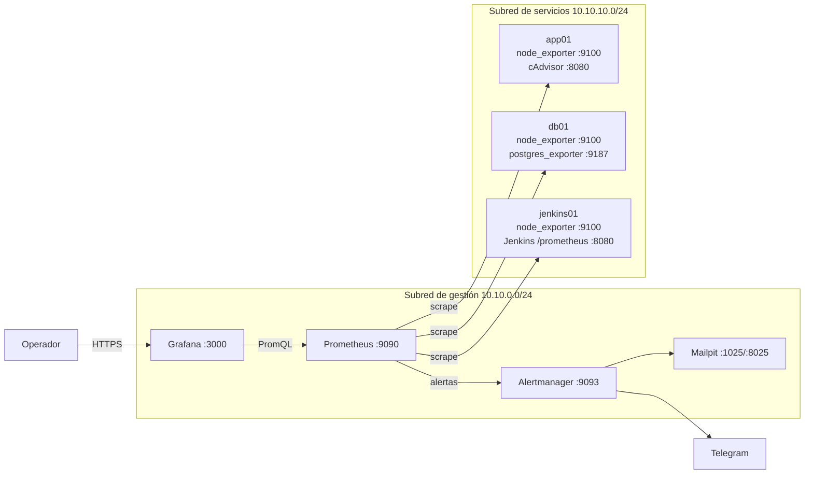
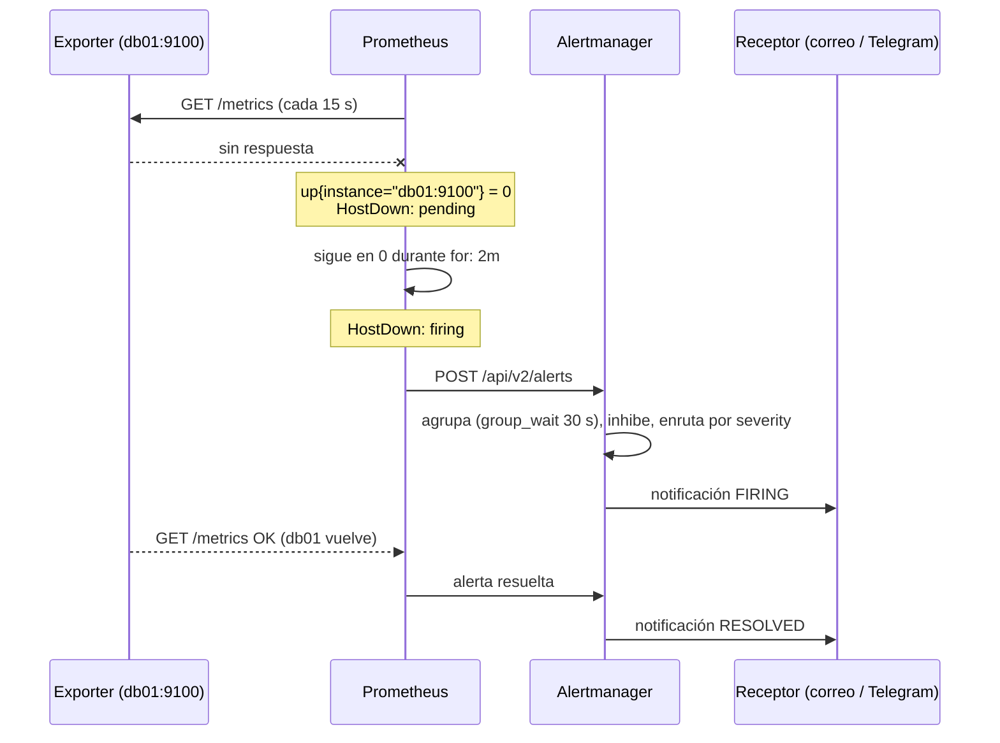
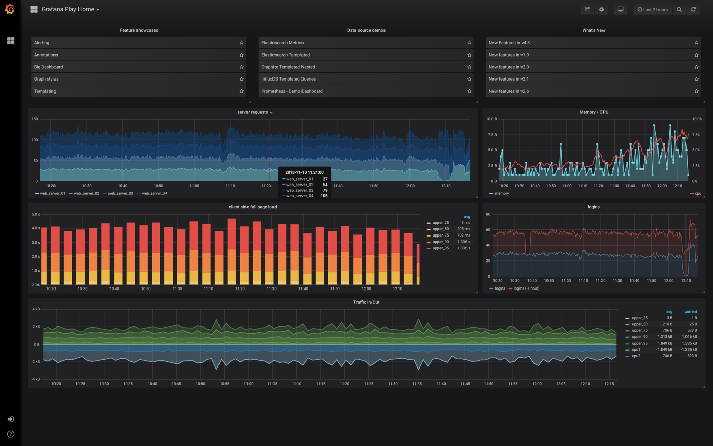

# UT7 · Monitorización del entorno

<p class="ut-meta">6 h en el centro + 12 h en la formación en empresa · Sesiones 38 a 40 · RA4 CE i, j, k</p>

Última unidad del centro. En la UT6 dejasteis Jenkins ejecutando pipelines contra la plataforma de OpenTofu y Ansible, y activasteis el plugin que expone sus métricas en `/prometheus`. Ahora toca cerrar el círculo: una plataforma que no se vigila no está desplegada, está abandonada. En tres sesiones vais a montar Prometheus, Alertmanager y Grafana en la VM `mon01` de la subred de gestión, recoger datos de los hosts, de los contenedores y del orquestador de CI, dibujar paneles con los KPI del entorno y hacer que una alerta llegue a un buzón o a un chat. La sesión 40 es la práctica evaluable, la 41 (24 de marzo de 2027) el examen de la segunda evaluación, y las 12 horas de monitorización avanzada se hacen en la empresa. Los logs quedan para el módulo 5169.

## Introducción

Esta unidad se lee en el orden en que se da: primero los conceptos y el plan, y después cada sesión con la teoría que se explica en clase seguida de su hoja de práctica. Los apartados que van más allá de lo que se hace en el aula están en la página Para ampliar.

### Qué tienes que saber hacer al terminar

- Elegir un gestor de ingesta con criterio y justificar por qué Prometheus encaja en un entorno de contenedores; recolectar métricas de hosts (node_exporter), de contenedores (cAdvisor) y del orquestador de CI (plugin de Jenkins) (CE 4i).
- Escribir consultas PromQL que calculen KPI reales (CPU, memoria, disco, disponibilidad, tasa de fallos, p95), construir paneles en Grafana con unidades y umbrales, definir reglas de alerta y enrutarlas a correo, Telegram o webhook con Alertmanager (CE 4j).
- Asegurar la pila: red de gestión y cortafuegos, TLS y autenticación en Prometheus y Grafana, roles de usuario, secretos fuera del repositorio, retención y copia de seguridad de dashboards (CE 4k).

### Los conceptos de la unidad

El problema: el jueves a las tres de la tarde el disco de `db01` se llena, PostgreSQL deja de aceptar escrituras, la API de `app01` devuelve errores 500 y nadie se entera hasta que el viernes un usuario escribe quejándose. Tenéis la plataforma desplegada, configurada y alimentada por Jenkins, pero nadie la mira. Lo que queremos al terminar es que un programa mire por vosotros: que lea cada 15 segundos cómo están hosts, contenedores y Jenkins, que lo dibuje en un panel que se entiende de un vistazo y que, cuando algo se tuerza, un correo o un Telegram llegue antes que la queja.

| Herramienta o concepto | Qué es, en una frase | Para qué la usamos en esta unidad |
|----|----|----|
| Prometheus | Servidor que pasa lista cada 15 segundos a cada máquina y guarda sus números con fecha y hora | Recoger y almacenar las métricas del entorno |
| Exporter (node_exporter, cAdvisor, plugin de Jenkins) | Programa que traduce el estado de algo a una página de texto que Prometheus sabe leer | Uno por cada cosa vigilada |
| Formato de exposición | Cómo se escribe esa página: una métrica por línea, con nombre, etiquetas y valor | Saber leer lo que Prometheus lee y comprobar un exporter con `curl` |
| PromQL | Lenguaje de consulta de Prometheus, el SQL de las series temporales | Calcular los KPI, los paneles y las reglas de alerta |
| Reglas de alerta | Fichero YAML que dice "si esta consulta da cierto durante tanto tiempo, avisa" | Detectar hosts caídos, discos llenos, CPU alta y builds fallidas |
| Alertmanager | Recibe las alertas de Prometheus y decide a quién avisar, por dónde y cuándo callar | Enviar por correo, Telegram o webhook sin recibir 15 correos por una misma caída |
| Grafana y su provisioning | Interfaz web que dibuja consultas en paneles; el provisioning son ficheros que lee al arrancar en lugar de configurar por clics | El panel de KPI de operaciones, el dashboard 1860 y todo en Git |
| Docker Compose y Mailpit | Compose describe varios contenedores para levantarlos de una vez; Mailpit es un correo falso con interfaz web | Desplegar la pila en `mon01` y ver las notificaciones sin SMTP real |
| file_sd | Prometheus lee la lista de máquinas a vigilar de un fichero que escribe otro programa (Ansible) | Que los targets salgan del inventario y no se editen a mano |
| TLS, basic auth y proxy inverso nginx | El cifrado, la contraseña y la puerta de entrada de la UT3 | Que nadie fuera de la red de gestión lea los exporters ni entre en Grafana |

Cómo está organizada la unidad: sigue las sesiones en orden, y cada sesión trae primero la teoría que se explica y después su hoja de práctica. En la sesión 38 se justifica la elección de Prometheus, se despliega la pila en `mon01` y se conectan los exporters de hosts, contenedores y Jenkins: al acabar hay datos y todos los targets en UP. En la sesión 39 se explotan esos datos con PromQL, se dibujan los cinco KPI en Grafana por provisioning y se escriben las reglas de alerta y las rutas de Alertmanager hasta ver llegar un correo. La sesión 40 asegura la pila (red, TLS, autenticación, secretos) y es la práctica evaluable. Las 12 horas de monitorización avanzada se hacen en la formación en empresa; lo que se espera de ellas está en [En la empresa: monitorización avanzada](../ampliacion.md#en-la-empresa-monitorizacion-avanzada), junto con el apartado de [retención y almacenamiento](../ampliacion.md#retencion-y-almacenamiento) a largo plazo.

!!! info "Dónde se usa esto en la otra asignatura"
    Si sigues el módulo 5169, llevas desde octubre con Prometheus, Alertmanager y Grafana en el `mon01` provisional del bridge del aula, con Loki añadido en la [UT1 Observabilidad](https://victor-educ.github.io/apuntes-5169/ut/ut1-observabilidad/), las reglas y rutas de la UT2 Alarmas y los exporters detrás del firewall desde la UT3. Entre finales de febrero y marzo, en la [UT8 Terminación segura](https://victor-educ.github.io/apuntes-5169/ut/ut8-terminacion-segura/), desconfiguraste esa pila; lo que hacemos aquí es el ensayo inverso: la instalación definitiva, dentro de la subred de gestión de la VPC y desplegada como parte de la plataforma.
    Vocabulario, formato de exposición y PromQL básico te van a sonar; léelos en diagonal. Lo que 5169 no cubre y aquí se evalúa: la comparativa de gestores de ingesta (CE 4i), Jenkins como target, `file_sd` desde el inventario de Ansible, el dashboard 1860 y la seguridad de la pila vista desde el despliegue (proxy inverso, `web.yml`, secretos fuera del repositorio).
    Si no sigues 5169, no necesitas nada de allí: la unidad se explica desde cero.

### Plan de sesiones

Cada sesión de dos horas empieza con una explicación corta y sigue con laboratorio. La columna "Se explica" es lo que cuento yo al principio (con su duración aproximada); la columna "Se practica" es lo que hacéis vosotros con el material de práctica de esta unidad. Las sesiones marcadas solo como práctica no traen teoría nueva.

| Sesión | Fecha | Tipo | Se explica | Se practica |
|---:|-------|------|------------|-------------|
| [38](#sesion-38-ingesta-de-metricas) | 10 mar | Teoría y práctica | Métricas, logs y trazas; modelo pull; exporters; comparativa de gestores de ingesta (30 min). | Pila Prometheus, Alertmanager y Grafana en mon01; node_exporter, cAdvisor y el plugin de Jenkins; todos los targets en UP y las siete consultas PromQL. |
| [39](#sesion-39-visualizacion-y-alertas) | 12 mar | Teoría y práctica | PromQL básico, reglas de alerta, rutas de Alertmanager (20 min). | Panel propio con cinco KPI, dashboard 1860, dos alertas y envío por correo; provocar HostDown y ver la notificación y la resolución. |
| [40](#sesion-40-practica-evaluable) | 17 mar | Práctica evaluable | Aclaración del enunciado (10 min). | Asegurar la pila (TLS, autenticación, firewall a los exporters) y entregar el repositorio monitoring con panel y alerta funcionando. |

## Sesión 38 · Ingesta de métricas

<p class="ut-meta">10 de marzo · Teoría y práctica · Explicación unos 30 min · Práctica unos 90 min</p>

Al terminar la sesión, Prometheus corre en `mon01` y lee de node_exporter en las cuatro máquinas, de cAdvisor en `app01` y del plugin de Jenkins, con todos los targets en UP y las consultas de la tabla devolviendo datos. En clase se explican los tres apartados siguientes: qué son métricas, logs y trazas, por qué elegimos Prometheus frente a las otras opciones (esa justificación se pide en la práctica) y cómo se despliega la pila con sus exporters. El formato de exposición, el modelo de datos y la chuleta de exporters son material de consulta para la hoja A7.1.

### Monitorización y observabilidad

Monitorizar es recoger datos del sistema de forma continua para saber si funciona y avisar cuando deja de hacerlo. La palabra observabilidad, que oiréis más en la empresa, va un paso más allá: poder preguntarle al sistema por qué va mal sin desplegar código nuevo para averiguarlo. Se apoya en tres tipos de datos, los llamados tres pilares:

- **Métricas**: números en el tiempo (CPU, memoria, peticiones por segundo, latencia). Ocupan poco (un par de bytes por muestra comprimida), se agregan bien y son la base de gráficos y alertas. Responden a "cuánto" y "cuándo".
- **Logs**: líneas de texto de lo que pasó, con marca de tiempo. Caras de guardar y buscar a gran volumen, pero son lo único que dice "qué" pasó en una petición concreta. Para diagnosticar.
- **Trazas**: recorrido de una petición por varios servicios, con el tiempo en cada uno. Para sistemas distribuidos donde una petición toca cinco microservicios y hay que saber cuál añadió los 800 ms.

Cómo se combinan: una alerta de métricas dice que el p95 de latencia ha subido de 200 ms a 2 s desde las 10:14; las trazas dicen que el tiempo se va en la base de datos; los logs de PostgreSQL enseñan la consulta que se quedó sin índice tras el último despliegue. En esta UT nos centramos en el primer pilar, el más barato y el que sostiene las alertas. Logs en el 5169; trazas (OpenTelemetry, Tempo, Jaeger) solo como mención.

| Término | Qué es |
|----|----|
| Exporter | Programa que expone métricas de algo (el sistema, Docker, una BD) en formato Prometheus |
| Scrape | Lectura periódica que Prometheus hace de cada exporter |
| Target | Cada endpoint concreto que Prometheus lee (host:puerto/ruta) |
| Serie temporal | Una métrica con sus etiquetas (`node_cpu_seconds_total{cpu="0",mode="idle"}`) |
| Muestra (sample) | Un valor con su marca de tiempo dentro de una serie |
| KPI | Indicador clave: la métrica o fórmula que resume si el servicio va bien (disponibilidad, latencia p95, errores por minuto) |
| Umbral | Valor a partir del cual una métrica se considera anómala |
| Alerta | Regla que se activa cuando un umbral se supera durante un tiempo |

### Elegir el gestor de ingesta

Antes de instalar nada hay que decidir con qué se recogen los datos, y esa decisión se os pide justificada en la práctica. No hay una herramienta mejor en abstracto: depende de qué hay que vigilar (contenedores, servidores físicos, un servicio de nube) y de quién lo mantiene. La tabla resume las cuatro opciones que veréis en cualquier empresa.

|  | Prometheus + Grafana | Zabbix | ELK / OpenSearch | Servicios en nube (CloudWatch, Azure Monitor) |
|----|----|----|----|----|
| Modelo | Pull: Prometheus lee a los exporters | Agente que envía | Logs y métricas por Beats | Integrado en la plataforma |
| Punto fuerte | Estándar en contenedores y Kubernetes; PromQL | Todo en uno, plantillas para hardware | Logs | Sin instalar nada |
| Punto débil | Retención larga requiere Thanos/Mimir | Menos natural con contenedores | Pesado | Coste y dependencia |

Criterio (CE 4i): **recolectar** de todo el entorno (hosts, contenedores, orquestador) y **visualizar**. Prometheus + Grafana cumple ambas y es el estándar en contenedores: cualquier imagen seria (nginx, PostgreSQL, Traefik, Jenkins, el propio Docker) expone métricas en su formato o tiene un exporter mantenido. Zabbix sigue siendo razonable en un CPD clásico con switches, SAI y servidores físicos; no lo descartéis si la empresa ya lo tiene. Los servicios de nube son cómodos hasta que llega la factura.

#### Pull frente a push, y cuándo usar Pushgateway

Prometheus va a buscar los datos (pull): cada `scrape_interval` hace un GET a `/metrics` de cada target y guarda lo que le devuelven. Consecuencias prácticas:

- Si un target no responde, Prometheus lo sabe en el acto (`up == 0`). En un modelo push, un agente muerto deja de enviar y nadie se entera hasta que alguien mira.
- Puedes abrir `http://app01:9100/metrics` en el navegador y ver exactamente lo que Prometheus ve.
- Qué se vigila está en un solo sitio (`prometheus.yml`), no repartido en cien agentes, y el exporter no necesita credenciales ni saber dónde está el servidor.

La pega: Prometheus tiene que llegar por red a cada target, lo que obliga a abrir puertos (y a protegerlos). Y hay cosas que no se pueden leer: un trabajo de cron que dura 20 segundos no está vivo cuando Prometheus pasa a preguntar. Para eso existe **Pushgateway**: el trabajo empuja sus métricas (`curl --data-binary @- http://pushgateway:9091/metrics/job/backup/instance/db01`) y Prometheus lee del gateway como de un exporter más. Solo para lotes cortos: usarlo como buzón general es un error clásico, porque el gateway nunca olvida (la métrica de un host que ya no existe sigue ahí) y pierdes la detección de caída por `up`.

<figure markdown="span">
  { width="640" }
  <figcaption>Arquitectura de Prometheus: el servidor lee de los exporters y de Pushgateway, evalúa reglas, envía a Alertmanager y sirve datos a Grafana. Fuente: Proyecto Prometheus, Apache 2.0.</figcaption>
</figure>

### Pila de monitorización

Aquí es donde por fin se instala algo: cuatro contenedores en una VM (Prometheus, Alertmanager, Grafana y un correo de pruebas) más un exporter en cada máquina vigilada. Al terminar, Prometheus tiene datos de hosts, contenedores y Jenkins; el resto de la unidad los explota.

La pila se despliega con Docker Compose en la VM `mon01` (en el laboratorio, `10.10.0.20` en la subred de gestión `10.10.0.0/24`; los hosts vigilados `app01`, `db01` y `jenkins01` viven en `10.10.10.0/24` y tienen una pata en gestión). En el compose fijaos en los volúmenes con nombre (los datos sobreviven a un `docker compose down`), en la configuración montada en solo lectura y en los flags de retención.

```yaml
# compose.yml (VM mon01, subred de gestión)
services:
  prometheus:
    image: prom/prometheus:v3.5.0
    volumes:
      - ./prometheus.yml:/etc/prometheus/prometheus.yml:ro
      - ./alerts.yml:/etc/prometheus/alerts.yml:ro
      - ./targets:/etc/prometheus/targets:ro
      - prom_data:/prometheus
    command:
      - --config.file=/etc/prometheus/prometheus.yml
      - --storage.tsdb.retention.time=30d
      - --storage.tsdb.retention.size=8GB
      - --web.enable-lifecycle
    ports: ["9090:9090"]
    restart: unless-stopped
  alertmanager:
    image: prom/alertmanager:v0.28.1
    volumes:
      - ./alertmanager.yml:/etc/alertmanager/alertmanager.yml:ro
      - am_data:/alertmanager
    ports: ["9093:9093"]
    restart: unless-stopped
  grafana:
    image: grafana/grafana:12.1.0
    environment:
      GF_SECURITY_ADMIN_PASSWORD: "${GRAFANA_PASS}"
      GF_USERS_ALLOW_SIGN_UP: "false"
    volumes:
      - graf_data:/var/lib/grafana
      - ./grafana/provisioning:/etc/grafana/provisioning:ro
      - ./grafana/dashboards:/var/lib/grafana/dashboards:ro
    ports: ["3000:3000"]
    restart: unless-stopped
  mailpit:
    image: axllent/mailpit
    ports: ["8025:8025"]   # interfaz web; SMTP en 1025 solo dentro de la red de compose
volumes: { prom_data: {}, am_data: {}, graf_data: {} }
```

Fijad siempre las versiones (nada de `latest` en una pila que tiene que ser reproducible). `--web.enable-lifecycle` permite recargar la configuración con `curl -X POST http://localhost:9090/-/reload` sin reiniciar el contenedor. La retención por tiempo y por tamaño se combinan: lo primero que se cumpla borra bloques antiguos. Mailpit lo veréis en el apartado de alertas.

En cada máquina a vigilar:

- **node_exporter** (puerto 9100): CPU, memoria, disco, red, carga, systemd del host. Se instala como binario con su unidad de systemd o, si el host ya tiene Docker, como contenedor con `--pid=host` y los volúmenes `/proc`, `/sys` y `/` montados en solo lectura. Prefiero el binario: un exporter que depende de Docker no os podrá decir que Docker se ha caído.
- **cAdvisor** (puerto 8080): CPU, memoria, red y disco por contenedor, leyendo los cgroups (el mecanismo del kernel con el que Docker limita y contabiliza los recursos de cada contenedor). Va como contenedor (`gcr.io/cadvisor/cadvisor`) con `/var/run/docker.sock`, `/sys` y `/var/lib/docker` montados. Es glotón: con muchos contenedores conviene arrancarlo con `--docker_only=true --housekeeping_interval=30s`.
- Jenkins expone `/prometheus` con el plugin Prometheus metrics (lo instalasteis en UT6). Por defecto antepone el prefijo `default_` a los nombres; se cambia en Manage Jenkins → System → Prometheus.

```yaml
# prometheus.yml
global:
  scrape_interval: 15s
  evaluation_interval: 15s
rule_files: ["alerts.yml"]
alerting:
  alertmanagers:
    - static_configs: [{ targets: ["alertmanager:9093"] }]
scrape_configs:
  - job_name: prometheus
    static_configs: [{ targets: ["localhost:9090"] }]
  - job_name: node
    static_configs: [{ targets: ["app01:9100", "db01:9100", "jenkins01:9100", "mon01:9100"] }]
  - job_name: cadvisor
    static_configs: [{ targets: ["app01:8080"] }]
  - job_name: jenkins
    metrics_path: /prometheus
    static_configs: [{ targets: ["jenkins01:8080"] }]
```

Con `scrape_interval: 15s` y un entorno de cuatro hosts (unas 1 000 series por node_exporter, otras 2 000 de cAdvisor con veinte contenedores, 300 de Jenkins) estáis en torno a 7 000 series activas y 470 muestras por segundo: unos 60 MB al día en disco, menos de 2 GB en los 30 días de retención. Comprobadlo con `du -sh` sobre `prom_data` al cabo de una semana.



#### Descubrimiento de targets

`static_configs` sirve para un laboratorio de cuatro máquinas. En cuanto los hosts los crea OpenTofu y los configura Ansible, editar `prometheus.yml` a mano es un paso atrás. Dos alternativas que escalan:

**file_sd_configs**: Prometheus vigila uno o varios ficheros JSON o YAML y recarga los targets cuando cambian, sin reiniciar ni señal. El fichero lo puede escribir Ansible con una plantilla desde el inventario, o el propio pipeline de OpenTofu desde sus outputs.

```yaml
# en prometheus.yml
  - job_name: node
    file_sd_configs:
      - files: ["/etc/prometheus/targets/node_*.yml"]
        refresh_interval: 1m
```

```yaml
# targets/node_lab.yml (generado por Ansible)
- targets: ["app01:9100", "db01:9100"]
  labels: { env: lab, rol: servicio }
- targets: ["jenkins01:9100"]
  labels: { env: lab, rol: ci }
```

Fijaos en que aquí añadimos etiquetas propias (`env`, `rol`) a todas las series de esos targets; luego se usan en consultas y en el enrutado de alertas.

**docker_sd_configs**: Prometheus habla con el socket de Docker (o con un `tcp://` protegido con TLS) y descubre los contenedores en marcha, exponiendo sus etiquetas como `__meta_docker_container_label_*`. Con `relabel_configs` se decide qué contenedores se leen (por ejemplo, los que tienen la etiqueta `prometheus.scrape=true`) y en qué puerto. Es la antesala de `kubernetes_sd_configs`, que funciona igual. En el laboratorio usaremos `file_sd`.

### El formato de exposición

*Material de consulta: no se explica en clase; lo necesitas para la hoja de práctica de esta sesión.*

Para entender lo que Prometheus guarda hay que ver primero lo que lee: cada exporter publica una página de texto que podéis abrir con el navegador, y conviene saber leerla porque es lo primero que se mira cuando un panel sale vacío.

Un `/metrics` es texto plano, una métrica por línea, con dos líneas de comentario opcionales (`HELP` y `TYPE`) que la documentan. Esto es un extracto real de lo que devuelve `curl -s http://app01:9100/metrics` (node_exporter expone entre 500 y 1500 líneas según el hardware):

```text
# HELP node_cpu_seconds_total Seconds the CPUs spent in each mode.
# TYPE node_cpu_seconds_total counter
node_cpu_seconds_total{cpu="0",mode="idle"} 118372.63
node_cpu_seconds_total{cpu="0",mode="iowait"} 41.2
node_cpu_seconds_total{cpu="0",mode="system"} 1204.77
node_cpu_seconds_total{cpu="0",mode="user"} 3521.12
node_cpu_seconds_total{cpu="1",mode="idle"} 118401.02
# HELP node_memory_MemAvailable_bytes Memory information field MemAvailable_bytes.
# TYPE node_memory_MemAvailable_bytes gauge
node_memory_MemAvailable_bytes 6.1478912e+09
# HELP node_filesystem_avail_bytes Filesystem space available to non-root users in bytes.
# TYPE node_filesystem_avail_bytes gauge
node_filesystem_avail_bytes{device="/dev/sda1",fstype="ext4",mountpoint="/"} 2.4512e+10
# HELP http_request_duration_seconds Duración de las peticiones (ejemplo de una app instrumentada)
# TYPE http_request_duration_seconds histogram
http_request_duration_seconds_bucket{handler="/api",le="0.1"} 240
http_request_duration_seconds_bucket{handler="/api",le="0.5"} 310
http_request_duration_seconds_bucket{handler="/api",le="1"} 318
http_request_duration_seconds_bucket{handler="/api",le="+Inf"} 320
http_request_duration_seconds_sum{handler="/api"} 41.2
http_request_duration_seconds_count{handler="/api"} 320
```

Los cuatro tipos:

- **Counter**: solo sube (o se pone a cero cuando el proceso reinicia). Segundos de CPU, bytes enviados, peticiones servidas, builds fallidas. El valor bruto no dice nada; lo que interesa es su velocidad, y para eso está `rate()`.
- **Gauge**: sube y baja. Memoria disponible, temperatura, número de contenedores en ejecución. Se lee tal cual.
- **Histogram**: cuenta observaciones en cubos (`_bucket` con etiqueta `le`, "less or equal") acumulativos, más `_sum` y `_count`. En el ejemplo, 240 peticiones tardaron 0,1 s o menos, 310 tardaron 0,5 s o menos (incluye las 240 anteriores) y hubo 320 en total. Con esto se calculan percentiles en el servidor con `histogram_quantile`, y se pueden sumar histogramas de varias instancias.
- **Summary**: el cliente calcula los percentiles y los expone ya hechos (`{quantile="0.95"}`). Es más preciso pero no se puede agregar entre instancias: la media de dos p95 no es el p95 global. En la práctica se prefiere histogram.

Prometheus 3 acepta también OpenMetrics (una versión estandarizada de este mismo texto) y nombres en UTF-8, pero lo que veréis en los exporters es esto.

### Modelo de datos y cardinalidad

*Material de consulta: no se explica en clase; lo necesitas para la hoja de práctica de esta sesión.*

Este apartado explica de qué depende que Prometheus vaya ligero o se muera por falta de memoria, y la respuesta no es "cuántos datos guarda" sino "cuántas series distintas". Entender la diferencia evita el error más caro de esta tecnología.

Una serie temporal es la combinación única de nombre de métrica y conjunto de pares etiqueta=valor. `node_cpu_seconds_total` en un host de 4 núcleos con 8 modos de CPU son 32 series, no una. Prometheus añade automáticamente `job` (el nombre del bloque de scrape) e `instance` (host:puerto) a todo lo que lee, y guarda cada serie como una secuencia de (timestamp, valor) comprimida en su TSDB (la base de datos de series temporales que lleva integrada).

El coste de Prometheus está en el número de series, no en el de muestras: cada serie activa consume memoria en el "head block" (unos pocos KB) y entrada de índice; cada muestra nueva de una serie existente cuesta un par de bytes. Por eso una etiqueta con muchos valores distintos es venenosa: a ese número de valores distintos se le llama cardinalidad. Ejemplo real: un desarrollador con buena intención añade `user_id` a `http_requests_total`. Con 50 000 usuarios, 20 rutas y 5 códigos de estado son 5 millones de series potenciales en lugar de 100; la memoria se dispara, las consultas que tardaban 50 ms tardan 30 s y el proceso muere por OOM (el kernel lo mata al quedarse sin memoria). Lo mismo con IPs de cliente, sesiones, IDs de contenedor efímeros o marcas de tiempo en una etiqueta. La regla: una etiqueta debe tener pocos valores posibles (método HTTP, código de estado, host, servicio). Lo que identifica a un usuario va al log, no a la métrica. Para vigilarlo, `prometheus_tsdb_head_series` da las series activas y Status → TSDB Status en la interfaz enseña las diez métricas y etiquetas con más cardinalidad.

### Exporters que os vais a encontrar

*Material de consulta: no se explica en clase; lo necesitas para la hoja de práctica de esta sesión.*

En el laboratorio instaláis tres exporters, pero en la empresa cada servicio tiene el suyo y la pregunta es siempre la misma: qué puerto abre, qué mide y qué necesita. Esta tabla es la chuleta de los más habituales; el párrafo de después explica el único que mide desde fuera.

| Exporter | Puerto | Para qué | Comentario |
|----|----|----|----|
| node_exporter | 9100 | Sistema operativo del host | El primero que se instala en cualquier máquina Linux |
| cAdvisor | 8080 | Contenedores por cgroup | Mantenido por Google; en Kubernetes va dentro del kubelet |
| blackbox_exporter | 9115 | Sondas desde fuera: HTTP, TCP, ICMP, DNS | Prometheus le pasa la URL como parámetro; mide lo que ve el usuario (código, latencia, caducidad del certificado TLS) |
| postgres_exporter | 9187 | Conexiones, transacciones, tamaño, réplica de PostgreSQL | Necesita un usuario de solo lectura en la BD, con `pg_monitor` |
| nginx-prometheus-exporter | 9113 | Conexiones activas y peticiones de nginx | Lee `stub_status`; para métricas por ruta hace falta el módulo VTS o Traefik |
| Plugin Prometheus de Jenkins | 8080 (`/prometheus`) | Builds, duración, cola, ejecutores | Prefijo `default_`; se puede exigir API key en el endpoint |

Blackbox cambia el punto de vista: los demás miden desde dentro ("el proceso usa 300 MB"); blackbox mide desde fuera ("la URL responde 200 en 120 ms y el certificado caduca en 41 días"), que es lo que le importa al que paga. Un job de blackbox contra la aplicación es el SLI de disponibilidad más honesto que podéis tener, y `probe_ssl_earliest_cert_expiry - time() < 14*86400` es una alerta que ha salvado más de un fin de semana.

### A7.1 Ingesta (sesión 38)

**Objetivo.** Al terminar, Prometheus corre en `mon01`, lee de sí mismo, de node_exporter en las cuatro máquinas, de cAdvisor en `app01` y de Jenkins, todos los targets están en UP y las nueve consultas de la tabla devuelven datos.

**Antes de empezar.**

- Las VM `mon01` (`10.10.0.20`), `app01`, `db01` y `jenkins01` de la UT6 encendidas, con Docker en `mon01` y en `app01`, y Jenkins arrancado en `jenkins01`.
- Resolución de nombres entre ellas (`/etc/hosts` o el DNS del laboratorio): desde `mon01`, `ping -c1 app01` responde.
- Un repositorio nuevo `monitoring` en tu cuenta de GitHub, clonado en `mon01` en `~/monitoring`; en la sesión 40 se entrega.
- Explicado en clase: [Elegir el gestor de ingesta](#elegir-el-gestor-de-ingesta), el modelo pull y los exporters de [Pila de monitorización](#pila-de-monitorizacion). Para consultar durante la práctica: [El formato de exposición](#el-formato-de-exposicion) y [Descubrimiento de targets](#descubrimiento-de-targets).

**Pasos.**

1. En `~/monitoring` de `mon01`, crea `compose.yml` y `prometheus.yml` copiando los del apartado [Pila de monitorización](#pila-de-monitorizacion) tal cual. Crea también los ficheros que el compose monta, aunque de momento estén vacíos, porque si no Docker crea directorios con ese nombre:

    ```bash
    mkdir -p ~/monitoring/targets ~/monitoring/grafana/provisioning ~/monitoring/grafana/dashboards
    cd ~/monitoring
    printf 'groups: []\n' > alerts.yml
    printf 'route:\n  receiver: mail\nreceivers:\n  - name: mail\n' > alertmanager.yml
    echo 'GRAFANA_PASS=cambiame' > .env && echo '.env' >> .gitignore
    docker compose up -d && docker compose ps
    ```

2. Abre `http://mon01:9090/targets`. El job `prometheus` tiene que estar en UP; los demás en DOWN todavía, es normal.
3. Instala node_exporter como binario en `app01`, `db01`, `jenkins01` y `mon01`. Sustituye la IP de `--web.listen-address` por la de la interfaz de gestión de cada host (`ip -br a` te la da; en `mon01` es `10.10.0.20`):

    ```bash
    VER=1.9.1
    curl -sSL https://github.com/prometheus/node_exporter/releases/download/v${VER}/node_exporter-${VER}.linux-amd64.tar.gz | sudo tar xz -C /usr/local/bin --strip-components=1 node_exporter-${VER}.linux-amd64/node_exporter
    sudo useradd -rs /usr/sbin/nologin node_exporter 2>/dev/null
    sudo tee /etc/systemd/system/node_exporter.service <<'EOF'
    [Unit]
    Description=Prometheus node_exporter
    After=network-online.target
    [Service]
    User=node_exporter
    ExecStart=/usr/local/bin/node_exporter --web.listen-address=10.10.0.11:9100
    Restart=on-failure
    [Install]
    WantedBy=multi-user.target
    EOF
    sudo systemctl daemon-reload && sudo systemctl enable --now node_exporter
    curl -s http://10.10.0.11:9100/metrics | grep '^node_cpu_seconds_total' | head -3
    ```

4. En `app01`, arranca cAdvisor como contenedor:

    ```bash
    docker run -d --name cadvisor --restart unless-stopped -p 10.10.0.11:8080:8080 \
      -v /:/rootfs:ro -v /var/run:/var/run:ro -v /sys:/sys:ro -v /var/lib/docker:/var/lib/docker:ro \
      gcr.io/cadvisor/cadvisor:v0.52.1 --docker_only=true --housekeeping_interval=30s
    curl -s http://10.10.0.11:8080/metrics | grep -c '^container_cpu_usage_seconds_total'
    ```

5. En Jenkins, comprueba que el plugin Prometheus metrics de la UT6 responde: `curl -s http://jenkins01:8080/prometheus | grep '^default_jenkins_builds' | head`. Si Jenkins pide autenticación en esa ruta, en Manage Jenkins → System → Prometheus desactiva "Use authenticated endpoint" (en la sesión 40 lo volveremos a cerrar) y anota el prefijo: el laboratorio asume `default_`.
6. Pasa el job `node` de `static_configs` a `file_sd_configs`. En `prometheus.yml` sustituye el bloque del job `node` por el de [Descubrimiento de targets](#descubrimiento-de-targets) y crea el fichero de targets con las etiquetas `env` y `rol`:

    ```yaml
    # targets/node_lab.yml
    - targets: ["app01:9100", "db01:9100"]
      labels: { env: lab, rol: servicio }
    - targets: ["jenkins01:9100"]
      labels: { env: lab, rol: ci }
    - targets: ["mon01:9100"]
      labels: { env: lab, rol: gestion }
    ```

    Comprueba la sintaxis y recarga sin reiniciar:

    ```bash
    docker compose exec prometheus promtool check config /etc/prometheus/prometheus.yml
    curl -X POST http://localhost:9090/-/reload
    ```

7. En `http://mon01:9090/targets` espera un minuto (el `refresh_interval` de `file_sd`) y confirma que todos los endpoints están en UP. Si alguno está en DOWN, el mensaje de error de esa fila y la lista de [Errores frecuentes](#errores-frecuentes-en-el-laboratorio) te dicen dónde mirar; lo habitual en esta sesión es un exporter escuchando en otra interfaz.
8. En la pestaña Graph (`http://mon01:9090/graph`) ejecuta una a una las nueve consultas de [Consultas del laboratorio](#consultas-del-laboratorio) y apunta en una tabla el valor de cada una para un host. Las de cAdvisor (`{name="app"}`) necesitan que el contenedor de tu aplicación se llame así; si no, cambia el valor de `name` por el tuyo (`docker ps --format '{{.Names}}'` en `app01`). La de Jenkins dará 0 si no hay builds fallidas en la última hora; lanza un job que falle a propósito para verla subir.
9. Añade una consulta propia con `topk` o `predict_linear`. Ejemplos de partida: `topk(3, instance:node_cpu_utilisation:ratio)` no funciona todavía (la regla de grabación llega en la sesión 39), así que usa `topk(2, 1 - avg by (instance) (rate(node_cpu_seconds_total{mode="idle"}[5m])))` o el `predict_linear` del disco con una ventana de `[1h]`.
10. Haz commit de `compose.yml`, `prometheus.yml`, `alerts.yml`, `alertmanager.yml` y `targets/` en el repositorio `monitoring` (sin `.env`).

**Comprobación.** En `http://mon01:9090/targets` los cuatro jobs (`prometheus`, `node`, `cadvisor`, `jenkins`) sin ninguna fila en DOWN, y las series del job `node` llevan las etiquetas `env` y `rol` (en Graph, `up{rol="ci"}` devuelve una serie). `prometheus_tsdb_head_series` está entre 3 000 y 10 000.

**Entrega.** En una carpeta `A7.1` de Aules: captura de la página Targets con todo en UP, el fichero `targets/node_lab.yml` y una tabla (Markdown o captura) con las diez consultas y su resultado. El repositorio `monitoring` con el primer commit.

**Si te sobra tiempo.** Abre Status → TSDB Status y anota qué métrica tiene más series y por qué. Instala `postgres_exporter` en `db01` (puerto 9187, usuario de solo lectura con `pg_monitor`) y añádelo a un job `postgres`.

## Sesión 39 · Visualización y alertas

<p class="ut-meta">12 de marzo · Teoría y práctica · Explicación unos 20 min · Práctica unos 100 min</p>

Con los datos ya guardados, esta sesión los convierte en paneles y avisos: un dashboard propio con los cinco KPI cargado por provisioning, el 1860 importado y la alerta `HostDown` llegando a Mailpit en FIRING y en RESOLVED. En clase se explica PromQL básico, las reglas de grabación y alerta y las rutas de Alertmanager, en el orden en que un dato recorre el sistema. Grafana (paneles, variables, provisioning) y el vocabulario de KPI, SLI y SLO son material de consulta para la hoja A7.2.

### PromQL a fondo

PromQL es el lenguaje de consulta de Prometheus, y es lo que escribiréis en los paneles de Grafana y en las reglas de alerta. Practicad en la pestaña Graph de `http://mon01:9090` antes de tocar Grafana.

#### Selectores

`node_memory_MemAvailable_bytes` devuelve una serie por host (un vector instantáneo: un valor por serie, en el instante de la consulta). Se filtra con etiquetas entre llaves: `{instance="db01:9100"}`, `{mountpoint!="/boot"}`, `{device=~"sd.*"}` (expresión regular, anclada a la cadena completa), `{mode!~"idle|iowait"}`. Si añadís un rango, `node_cpu_seconds_total[5m]`, obtenéis un vector de rangos (todas las muestras de los últimos 5 minutos por serie), que no se puede graficar directamente pero es lo que consumen `rate`, `increase` y compañía.

#### rate, irate, increase

Un contador solo tiene sentido derivado. `rate(x[5m])` calcula el incremento por segundo promediado en la ventana, y sabe tratar los reinicios (si el contador vuelve a cero, no os devuelve un negativo). `increase(x[1h])` es lo mismo multiplicado por la ventana: cuántas unidades subió en la última hora, útil para "builds fallidas en la última hora". `irate(x[5m])` usa solo las dos últimas muestras de la ventana: reacciona al instante y es adecuado para mirar picos en una gráfica de segundos, pero es ruidoso y no vale para alertas, donde queréis la tendencia y no el último parpadeo. Regla práctica: la ventana de `rate` debe contener al menos cuatro muestras (con 15 s de scrape, 1 m como mínimo; 5 m es lo habitual).

#### Agregaciones

`sum`, `avg`, `min`, `max`, `count`, `topk(3, ...)`, `quantile`. Con `by (etiquetas)` conserváis esas etiquetas y agrupáis por ellas; con `without (etiquetas)` las quitáis y conserváis el resto. `sum by (instance) (rate(node_network_receive_bytes_total[5m]))` da el tráfico entrante por host sumando todas sus interfaces; `sum without (cpu) (rate(node_cpu_seconds_total[5m]))` agrupa por todo menos el núcleo, es decir, por host y modo.

#### Operadores y coincidencia de vectores

Aritméticos (`+ - * / %`), de comparación (`== != > < >= <=`) y lógicos (`and or unless`). Cuando operáis dos vectores, Prometheus empareja series con las mismas etiquetas: `node_filesystem_avail_bytes / node_filesystem_size_bytes` funciona porque ambas tienen `instance`, `device`, `mountpoint` y `fstype` idénticos. Si las etiquetas no coinciden, el resultado está vacío y nadie os avisa; se arregla con `on (instance)` o `ignoring (fstype)`. Los operadores de comparación filtran por defecto (`up == 0` devuelve solo las series que valen 0); con `bool` devuelven 1 o 0 sin filtrar, lo que sirve para contar: `count(up == bool 0)`.

#### histogram_quantile

`histogram_quantile(0.95, sum by (le) (rate(http_request_duration_seconds_bucket[5m])))` da el p95 de latencia de los últimos 5 minutos, agregado entre todas las instancias. El `sum by (le)` es obligatorio: hay que quedarse solo con la etiqueta `le` para que la función reconstruya el histograma. Si queréis el p95 por ruta, `sum by (le, handler)`. El resultado es una interpolación lineal dentro del cubo, así que la precisión depende de los cubos: si el último finito es `le="1"` y vuestro p95 real es 3 s, obtendréis 1 s. Hablad con quien instrumenta la aplicación.

#### offset y funciones de tiempo

`node_memory_MemAvailable_bytes offset 1d` devuelve el valor de hace 24 h; restándolo al actual veis la deriva diaria. `predict_linear(node_filesystem_avail_bytes{mountpoint="/"}[6h], 4*3600) < 0` es la alerta que de verdad queréis para el disco: no "está al 10 %" sino "al ritmo actual se llena en 4 horas". `changes(process_start_time_seconds[1h]) > 2` detecta un servicio en bucle de reinicios. `absent(up{job="node"})` avisa si un job ha desaparecido entero de la configuración, cosa que `up == 0` no puede ver porque no hay series.

#### Consultas del laboratorio

| Qué | Consulta |
|----|----|
| CPU usada (%) por host | `100 - avg by(instance)(rate(node_cpu_seconds_total{mode="idle"}[5m])) * 100` |
| Memoria disponible (%) | `node_memory_MemAvailable_bytes / node_memory_MemTotal_bytes * 100` |
| Disco libre (%) | `node_filesystem_avail_bytes{mountpoint="/"} / node_filesystem_size_bytes{mountpoint="/"} * 100` |
| CPU de un contenedor | `rate(container_cpu_usage_seconds_total{name="app"}[5m])` |
| Memoria de un contenedor | `container_memory_working_set_bytes{name="app"}` |
| Host caído | `up == 0` |
| Ejecuciones de Jenkins fallidas | `increase(default_jenkins_builds_failed_build_count[1h])` |
| Latencia p95 de la aplicación | `histogram_quantile(0.95, sum by (le) (rate(http_request_duration_seconds_bucket[5m])))` |
| Disco que se llena en 4 h | `predict_linear(node_filesystem_avail_bytes{mountpoint="/"}[6h], 4*3600) < 0` |

Sobre la CPU de un contenedor: `rate(container_cpu_usage_seconds_total[5m])` devuelve núcleos usados (0,5 = medio núcleo). Si queréis porcentaje respecto al límite del contenedor, dividid por `container_spec_cpu_quota / container_spec_cpu_period`. Y `container_memory_working_set_bytes` es la métrica que usa el kernel para decidir el OOM kill, no `container_memory_usage_bytes`, que incluye caché de página recuperable.

Los cinco KPI mínimos del entorno del curso: disponibilidad de cada host (`up`), CPU y memoria del host, memoria del contenedor de la aplicación, espacio en disco de la BD, y tasa de fallo de pipelines.

### Reglas: grabación y alerta

Con los datos guardados, este apartado convierte consultas en decisiones automáticas: una regla es una consulta PromQL que Prometheus ejecuta sola y cuyo resultado o se guarda como métrica nueva (grabación) o dispara un aviso (alerta). Al acabar sabréis escribir el `alerts.yml` que pide la práctica.

Las reglas viven en ficheros YAML que Prometheus evalúa cada `evaluation_interval`. Hay dos tipos y se mezclan en los mismos grupos.

**Reglas de grabación** precalculan una expresión y la guardan como una serie nueva. Sirven para consultas caras que se repiten en muchos paneles (el porcentaje de CPU por host, con su `rate` y su `avg by`, se calcula una vez en lugar de cada 5 s por cada navegador con el dashboard abierto) y para dar nombres estables a los KPI. La convención de nombre es `nivel:métrica:operación`.

El `alerts.yml` completo del laboratorio: un grupo `kpi` con dos reglas de grabación y un grupo `infra` con cuatro alertas. Fijaos en que `DiskLow` y `HighCPU` usan las series grabadas justo encima, en el `for` distinto de cada una y en las etiquetas `severity` y `equipo`, que son las que Alertmanager usa para enrutar.

```yaml
# alerts.yml
groups:
  - name: kpi
    interval: 30s
    rules:
      - record: instance:node_cpu_utilisation:ratio
        expr: 1 - avg by (instance) (rate(node_cpu_seconds_total{mode="idle"}[5m]))
      - record: instance:node_filesystem_root_avail:ratio
        expr: node_filesystem_avail_bytes{mountpoint="/"} / node_filesystem_size_bytes{mountpoint="/"}

  - name: infra
    rules:
      - alert: HostDown
        expr: up == 0
        for: 2m
        labels: { severity: critical }
        annotations:
          summary: "{{ $labels.instance }} no responde"
          description: "El job {{ $labels.job }} lleva 2 minutos sin poder leer {{ $labels.instance }}."
      - alert: DiskLow
        expr: instance:node_filesystem_root_avail:ratio < 0.10
        for: 10m
        labels: { severity: warning }
        annotations:
          summary: "Disco < 10 % en {{ $labels.instance }}"
          description: "Queda un {{ $value | humanizePercentage }} libre en la raíz de {{ $labels.instance }}."
      - alert: HighCPU
        expr: instance:node_cpu_utilisation:ratio > 0.85
        for: 15m
        labels: { severity: warning }
        annotations:
          summary: "CPU al {{ $value | humanizePercentage }} en {{ $labels.instance }} durante 15 min"
      - alert: JenkinsBuildsFailing
        expr: increase(default_jenkins_builds_failed_build_count[1h]) > 3
        for: 0m
        labels: { severity: warning, equipo: dev }
        annotations:
          summary: "Más de 3 builds fallidas en la última hora"
```

Cada alerta pasa por tres estados: inactive, pending (la expresión es cierta pero aún no ha durado `for`) y firing. El `for` es lo que evita que un pico de dos segundos despierte a alguien; ajustadlo a la gravedad (2 m para un host caído, 15 m para CPU alta). Las **labels** de la alerta se suman a las de la serie y son lo que usa Alertmanager para enrutar (`severity`, `equipo`, `env`). Las **annotations** son texto para humanos y admiten plantillas Go: `$labels.x`, `$value` y funciones como `humanize`, `humanizePercentage`, `humanizeDuration`. Comprobad la sintaxis antes de recargar con `promtool check rules alerts.yml` (el binario va dentro de la imagen: `docker compose exec prometheus promtool check rules /etc/prometheus/alerts.yml`).

### Alertmanager: agrupar, enrutar, silenciar

Prometheus decide *qué* está mal; Alertmanager decide *a quién* y *cómo* se lo cuenta. Recibe las alertas en firing por HTTP, las deduplica (si tenéis dos Prometheus en alta disponibilidad enviando lo mismo, llega una notificación), las agrupa, aplica inhibiciones y silencios, y las entrega a los receptores según un árbol de rutas. El fichero tiene tres partes: `route` (el árbol, con la ruta por defecto y dos ramas por etiqueta), `receivers` (los tres destinos) e `inhibit_rules`; la lista de después lo explica pieza a pieza.

```yaml
# alertmanager.yml
global:
  smtp_smarthost: "mailpit:1025"
  smtp_from: "alertas@lab.local"
  smtp_require_tls: false
route:
  receiver: mail
  group_by: [alertname, env]
  group_wait: 30s
  group_interval: 5m
  repeat_interval: 4h
  routes:
    - matchers: [severity = "critical"]
      receiver: telegram
      continue: true
    - matchers: [equipo = "dev"]
      receiver: webhook-dev
receivers:
  - name: mail
    email_configs:
      - to: "ops@lab.local"
  - name: telegram
    telegram_configs:
      - bot_token_file: /etc/alertmanager/tg_token
        chat_id: -100123456
        parse_mode: HTML
  - name: webhook-dev
    webhook_configs:
      - url: "http://jenkins01:8080/generic-webhook-trigger/invoke?token=alertas"
inhibit_rules:
  - source_matchers: [alertname = "HostDown"]
    target_matchers: [severity = "warning"]
    equal: [instance]
```

Lo que hace cada pieza:

- **group_by**: alertas con las mismas etiquetas de agrupación van en una única notificación; si caen 15 hosts a la vez, recibís un correo con 15 líneas, no 15 correos. `group_wait` es cuánto espera a que lleguen "las hermanas" antes de la primera notificación de un grupo; `group_interval`, cuánto espera antes de avisar de cambios en un grupo ya notificado; `repeat_interval`, cada cuánto repite si nada cambia.
- **Rutas**: se recorren en orden y la primera que coincide gana, salvo que tenga `continue: true`. En el ejemplo, una alerta critical va a Telegram y además cae en la ruta por defecto (correo); una warning del equipo de desarrollo va al webhook y ya.
- **Inhibición**: si `HostDown` está en firing para `db01`, se callan las warnings del mismo `instance` (no tiene sentido avisar de disco bajo en un host que no responde).
- **Silencios**: desde la interfaz (`http://mon01:9093`) o con `amtool silence add instance=db01:9100 --duration=2h --comment="mantenimiento"`; son la herramienta para las ventanas de mantenimiento. Un silencio sin comentario ni caducidad es una alerta perdida.
- **Receivers**: correo (Mailpit en el laboratorio, el relay corporativo en la empresa), Telegram (bot creado con BotFather; el `chat_id` negativo es un grupo), Slack, PagerDuty, Opsgenie y el genérico webhook, que envía un JSON a cualquier URL. Con el webhook podéis disparar un job de Jenkins que reinicie un servicio.

Mailpit (sucesor mantenido de MailHog, que ya no se actualiza) acepta cualquier correo en el puerto 1025 y lo enseña en `http://mon01:8025`, sin depender de un SMTP real. La alerta se envía también cuando se resuelve (`send_resolved: true` por defecto), así que en la actividad veréis dos correos: FIRING y RESOLVED.



### Grafana

*Material de consulta: no se explica en clase; lo necesitas para la hoja de práctica de esta sesión.*

Prometheus tiene una interfaz suficiente para depurar, no para que operaciones la mire a las 9 de la mañana. Grafana es la capa de visualización: se conecta a Prometheus (y a Loki, PostgreSQL, CloudWatch, Elasticsearch o casi cualquier cosa) y monta paneles a partir de consultas.

<figure markdown="span">
  { width="640" }
  <figcaption>Un dashboard de Grafana con series temporales, gauges y stats de un host. Fuente: Joel Kennedy, dominio público, vía Wikimedia Commons.</figcaption>
</figure>

- **Fuente de datos**: Prometheus en `http://prometheus:9090` (nombre del servicio de compose; Grafana y Prometheus comparten red). Se añade en Connections → Data sources o, mejor, por provisioning.
- **Dashboards**: un dashboard por audiencia. Operaciones: hosts y contenedores. Equipo de desarrollo: pipelines.
- **Paneles**: Time series para evolución, Stat para un número grande con color, Gauge para porcentajes con umbral, Table para listados (targets caídos). En cada uno, poned la **unidad** (percent, bytes(IEC), seconds) para que Grafana escale los ejes y formatee 6.1e+09 como 5,73 GiB; definid **umbrales** (verde hasta 70, naranja hasta 85, rojo) para que el color diga lo mismo que dirá la alerta; y usad la **leyenda** con `{{instance}}` en lugar de la serie completa.
- **Variables**: un desplegable `$instance` definido como `label_values(node_uname_info, instance)` convierte un dashboard por host en uno para todos; las consultas pasan a ser `...{instance=~"$instance"}`. Con `env` y `rol` de `file_sd` podéis filtrar por entorno.
- **Importar 1860**: Dashboards → New → Import, id 1860, elegir la fuente Prometheus. Es enorme (más de 40 paneles); lo usaremos como cantera de consultas y cada uno se queda con los cinco paneles que importan.

#### Provisioning: dashboards en Git

Todo lo que se hace clicando en Grafana se pierde con el volumen. Grafana lee fuentes de datos y dashboards de ficheros al arrancar, y eso se versiona.

```yaml
# grafana/provisioning/datasources/prometheus.yml
apiVersion: 1
datasources:
  - name: Prometheus
    type: prometheus
    access: proxy
    url: http://prometheus:9090
    isDefault: true
    editable: false
```

```yaml
# grafana/provisioning/dashboards/lab.yml
apiVersion: 1
providers:
  - name: lab
    folder: Laboratorio
    type: file
    allowUiUpdates: false
    options:
      path: /var/lib/grafana/dashboards
```

En `grafana/dashboards/` van los JSON exportados desde Share → Export (marcad "Export for sharing externally" para que la fuente de datos quede como variable y sirva en otra instancia). El flujo en la empresa: se edita en una Grafana de pruebas, se exporta, se hace commit y la de producción lo carga por provisioning.

#### Grafana Alerting o alertas en Prometheus

Grafana 12 tiene su propio motor de alertas, equivalente a Alertmanager (lleva uno embebido), sobre cualquier fuente de datos y configurado desde la interfaz. Para la infraestructura prefiero las reglas en Prometheus: se evalúan junto a los datos, siguen funcionando si Grafana se cae, se validan con `promtool` y viven en Git. Grafana Alerting encaja para alertas de negocio que cruzan fuentes (una consulta SQL contra la base de pedidos) o cuando quien las mantiene no toca YAML. Elegid una de las dos para cada tipo de alerta; duplicarlas acaba en dos notificaciones y nadie sabe cuál es la buena.

### KPI, SLI y SLO

*Material de consulta: no se explica en clase; lo necesitas para la hoja de práctica de esta sesión.*

Hasta aquí, CPU, memoria y disco, que le importan al técnico. Este apartado da el vocabulario para traducirlo a lo que le importa a quien paga el servicio ("¿funciona?", "¿cuánto puede fallar al mes?") y es la base de los KPI de negocio de la empresa.

Un KPI es lo que le enseñáis a alguien que no es técnico para que sepa si el servicio va bien. En la jerga de SRE (Site Reliability Engineering, la forma de operar servicios que popularizó Google) se concreta en tres términos:

- **SLI** (indicador): una medición. "Fracción de peticiones HTTP que responden con código distinto de 5xx en menos de 500 ms", o "fracción de sondas de blackbox que devuelven 200".
- **SLO** (objetivo): el valor que os comprometéis a cumplir con ese SLI en una ventana. "99,5 % en 30 días".
- **SLA** (acuerdo): el contrato con el cliente, con penalización. Siempre más laxo que el SLO interno.

De ahí sale el **error budget**: con un SLO de 99,5 % en 30 días tenéis derecho a un 0,5 % de fallo, 3 h 36 min de indisponibilidad al mes (30 × 24 × 60 × 0,005 = 216 min). Con 99,9 % bajan a 43 min; con 99,99 %, a 4 min, que no permite ni un reinicio de VM. El presupuesto es una herramienta de decisión: si a mitad de mes lleváis 200 minutos gastados, se congelan los despliegues arriesgados; si vais sobrados, se asume más riesgo. El SLI de disponibilidad con blackbox:

```promql
avg_over_time(probe_success{job="blackbox-app"}[30d])
```

Las alertas basadas en el presupuesto (burn rate en varias ventanas) son las que usaréis en la empresa en lugar de "CPU > 85 %": avisan cuando el ritmo de gasto del error budget lo agotaría antes de fin de mes. El SRE Workbook, enlazado en [Para ampliar](../ampliacion.md#ut7-monitorizacion-del-entorno), explica el método.

### A7.2 Paneles y alertas (sesión 39)

**Objetivo.** Un dashboard propio con los cinco KPI cargado por provisioning, el 1860 importado, y la alerta `HostDown` que llega a Mailpit en FIRING y en RESOLVED al apagar y encender `db01`.

**Antes de empezar.**

- La pila de la A7.1 levantada en `mon01` con todos los targets en UP.
- Permiso para apagar `db01` unos minutos (avisa si compartes la VM con otro grupo).
- Explicado en clase: [PromQL a fondo](#promql-a-fondo), [Reglas: grabación y alerta](#reglas-grabacion-y-alerta) y [Alertmanager](#alertmanager-agrupar-enrutar-silenciar). Para consultar durante la práctica: [Grafana](#grafana) y [Provisioning](#provisioning-dashboards-en-git).

**Pasos.**

1. Fuente de datos por provisioning: crea `grafana/provisioning/datasources/prometheus.yml` y `grafana/provisioning/dashboards/lab.yml` con el contenido del apartado [Provisioning](#provisioning-dashboards-en-git). Reinicia Grafana (`docker compose restart grafana`) y entra en `http://mon01:3000` con `admin` y la contraseña del `.env`. En Connections → Data sources tiene que aparecer Prometheus marcado como default y no editable.
2. Importa el dashboard 1860: Dashboards → New → Import, id `1860`, fuente Prometheus. Ábrelo, elige un host en el desplegable y localiza el panel de CPU: Edit te enseña la consulta que usa. Quédate con la idea, no con los 40 paneles.
3. Crea un dashboard nuevo llamado `KPI operaciones` con estos cinco paneles, tomando las consultas de [Consultas del laboratorio](#consultas-del-laboratorio):

    | Panel | Tipo | Consulta | Unidad y umbrales |
    |----|----|----|----|
    | Hosts caídos | Stat | `count(up == bool 0)` | ninguna; verde 0, rojo desde 1 |
    | CPU por host | Time series | `100 - avg by(instance)(rate(node_cpu_seconds_total{mode="idle",instance=~"$instance"}[5m])) * 100` | percent; verde, naranja 70, rojo 85 |
    | Memoria disponible | Gauge | `node_memory_MemAvailable_bytes{instance=~"$instance"} / node_memory_MemTotal_bytes * 100` | percent; rojo hasta 10, naranja hasta 20, verde |
    | Memoria del contenedor app | Time series | `container_memory_working_set_bytes{name="app"}` | bytes(IEC) |
    | Disco libre en db01 | Gauge | `node_filesystem_avail_bytes{instance="db01:9100",mountpoint="/"} / node_filesystem_size_bytes{instance="db01:9100",mountpoint="/"} * 100` | percent; rojo hasta 10 |

    Añade un sexto con `increase(default_jenkins_builds_failed_build_count[1h])` si te da tiempo. En cada panel, pestaña Legend, escribe `{{instance}}`.

4. La variable: Dashboard settings → Variables → New, nombre `instance`, tipo Query, consulta `label_values(node_uname_info, instance)`, marca "Multi-value" e "Include All". Guarda y comprueba que el desplegable filtra los paneles de CPU y memoria.
5. Exporta el JSON: Share → Export → marca "Export for sharing externally" → Save to file. Cópialo a `~/monitoring/grafana/dashboards/kpi-operaciones.json` en `mon01`, reinicia Grafana y verifica que el dashboard aparece en la carpeta Laboratorio con el candado de "provisioned" (no se puede guardar desde la interfaz). A partir de aquí se edita el fichero, no la interfaz.
6. Reglas: sustituye el `alerts.yml` vacío por el completo del apartado [Reglas: grabación y alerta](#reglas-grabacion-y-alerta). Valida y recarga:

    ```bash
    docker compose exec prometheus promtool check rules /etc/prometheus/alerts.yml
    curl -X POST http://localhost:9090/-/reload
    ```

    En `http://mon01:9090/alerts` tienen que verse las cuatro alertas en inactive, y en Graph la serie `instance:node_cpu_utilisation:ratio` con un valor por host al cabo de un minuto.

7. Alertmanager: sustituye el `alertmanager.yml` mínimo por el del apartado [Alertmanager](#alertmanager-agrupar-enrutar-silenciar). Si no tienes bot de Telegram, borra el receiver `telegram` y la ruta `severity = "critical"` (o deja la ruta y apunta el receiver a `mail`); el webhook a Jenkins puedes dejarlo, fallará sin ruido. Con bot: crea el fichero `tg_token` con el token, móntalo en el contenedor y añádelo a `.gitignore`. Valida y reinicia:

    ```bash
    docker compose exec alertmanager amtool check-config /etc/alertmanager/alertmanager.yml
    docker compose restart alertmanager
    ```

8. Provoca `HostDown`: apaga `db01` (`sudo poweroff`) y anota la hora. Sigue el camino: en Prometheus → Alerts la alerta pasa a pending y, a los 2 minutos, a firing; en `http://mon01:9093` aparece agrupada; a los 30 segundos de `group_wait`, en `http://mon01:8025` hay un correo con asunto `[FIRING:1] HostDown`. Mientras `db01` está caído, en Alertmanager la alerta `DiskLow` o `HighCPU` de `db01`, si estuviera activa, aparece como inhibida.
9. Enciende `db01`. Cuando el target vuelva a UP, Prometheus manda la resolución y en Mailpit llega `[RESOLVED] HostDown`. Captura los dos correos.
10. Silencio: en `http://mon01:9093` → Silences → New, matcher `instance=db01:9100`, duración 30 min, comentario `mantenimiento A7.2`. Apaga `db01` otra vez y comprueba que la alerta pasa a firing en Prometheus pero Alertmanager la marca como silenciada y no llega correo. Enciende `db01` y expira el silencio.
11. Commit en `monitoring` de `alerts.yml`, `alertmanager.yml` (revisa que no lleve token: `grep -i token alertmanager.yml` solo debe mostrar `bot_token_file`), `grafana/provisioning/` y `grafana/dashboards/`.

**Comprobación.** El dashboard `KPI operaciones` se carga desde fichero y muestra datos en los cinco paneles con unidades y colores; `http://mon01:9090/alerts` lista las cuatro reglas; en Mailpit hay al menos un FIRING y un RESOLVED de `HostDown`; `amtool silence query` en el contenedor muestra el silencio expirado.

**Entrega.** En Aules, carpeta `A7.2`: `kpi-operaciones.json`, `alerts.yml`, `alertmanager.yml` sin secretos y las capturas de los correos FIRING y RESOLVED. El commit correspondiente en `monitoring`.

**Si te sobra tiempo.** Añade la alerta `DiskFillingIn4h` con el `predict_linear` de la tabla y llena el disco de `db01` con `fallocate -l 2G /tmp/relleno` para verla en pending. Con Telegram, comprueba que una alerta critical llega a los dos sitios (correo y chat) gracias a `continue: true`.

## Sesión 40 · Práctica evaluable

<p class="ut-meta">17 de marzo · Práctica evaluable · Explicación unos 10 min · Práctica unos 110 min</p>

La pila funciona; ahora hay que dejarla como se dejaría en una empresa: exporters solo alcanzables desde `mon01`, Prometheus con autenticación, Grafana tras nginx con TLS y usuarios por rol, y ningún secreto en el repositorio. Los diez minutos de explicación son la aclaración del enunciado sobre el apartado de seguridad que sigue; el resto de la sesión es la práctica evaluable y su entrega.

### Seguridad de la monitorización

Los datos de monitorización revelan la topología completa (hosts, versiones de kernel, servicios, rutas) y pueden contener secretos (un `/metrics` mal hecho que expone la cadena de conexión en una etiqueta, y los hay). Los exporters abren un puerto HTTP sin autenticación en cada máquina, y Grafana expuesta es un panel con credenciales que consulta cualquier dato de la fuente. Este es el CE 4k.

**Red**: Prometheus y Grafana en la subred de gestión (`10.10.0.0/24`), no enrutable desde la DMZ (la zona donde viven los servicios expuestos, como en la UT3) ni desde la red de usuarios. Cada exporter escucha solo en la interfaz de gestión (`node_exporter --web.listen-address=10.10.0.11:9100`), y una regla de cortafuegos en cada host permite únicamente a `mon01` llegar a los puertos 9100 y 8080. Nadie más. Con nftables en el propio host (política `drop` en `input`, como dejasteis en la UT3):

```bash
nft add rule inet filter input ip saddr 10.10.0.20 tcp dport { 9100, 8080 } accept
# y sin regla de accept para esos puertos desde ningún otro origen
```

Si el filtrado lo hace OPNsense entre subredes, la regla equivalente es en la interfaz de gestión: origen `mon01`, destino `red de servicios`, puertos 9100 y 8080, permitir; y la regla por defecto deniega. La práctica pide la prueba de que desde `app01` no se lee el exporter de `db01`: `curl -m 3 http://db01:9100/metrics` tiene que fallar por timeout.

**TLS y autenticación en Prometheus**: desde la versión 2.24 el servidor (y todos los exporters oficiales, que comparten el mismo toolkit) aceptan un `--web.config.file` con TLS y usuarios de basic auth. Las contraseñas van en bcrypt (`htpasswd -nBC 10 admin` os da el hash).

```yaml
# web.yml (para Prometheus y para node_exporter)
tls_server_config:
  cert_file: /etc/prometheus/certs/mon01.crt
  key_file: /etc/prometheus/certs/mon01.key
basic_auth_users:
  scraper: "$2y$10$Q8v7...hash bcrypt..."
```

Si ponéis basic auth en los exporters, Prometheus tiene que presentarla al leer: en cada `scrape_config`, `scheme: https`, `tls_config: { ca_file: /etc/prometheus/certs/ca.crt }` y `basic_auth: { username: scraper, password_file: /etc/prometheus/secrets/scraper.pass }`. La CA es la de la UT3; si no, `openssl` con una CA propia y el certificado del servidor con el nombre `mon01` en SAN (el campo del certificado donde van los nombres de host que cubre). Alertmanager y Grafana también hablan con Prometheus: hay que darles las mismas credenciales.

**Grafana tras nginx con TLS**: Grafana no se expone en el 3000; se pone nginx delante en el 443 con el certificado, y Grafana escucha solo en la red interna de compose. Es el mismo patrón de proxy inverso de la UT3.

```nginx
server {
    listen 443 ssl;
    server_name grafana.lab.local;
    ssl_certificate     /etc/nginx/certs/grafana.crt;
    ssl_certificate_key /etc/nginx/certs/grafana.key;
    location / {
        proxy_pass http://grafana:3000;
        proxy_set_header Host $host;
        proxy_set_header X-Forwarded-Proto https;
    }
    location /api/live/ {
        proxy_pass http://grafana:3000;
        proxy_http_version 1.1;
        proxy_set_header Upgrade $http_upgrade;
        proxy_set_header Connection "upgrade";
    }
}
```

En Grafana hay que declarar la URL pública para que enlaces y cookies funcionen: `GF_SERVER_ROOT_URL=https://grafana.lab.local`, `GF_SERVER_DOMAIN=grafana.lab.local`. Y los **roles**: Viewer (mira, no edita: operaciones de primer nivel, dirección), Editor (crea y edita dashboards: el equipo técnico), Admin de organización (fuentes de datos, usuarios, alertas). El Server Admin es la cuenta `admin` inicial y no se usa a diario. En la empresa el acceso va por LDAP, OAuth o SAML (el directorio o el proveedor de identidad corporativo, sin usuarios locales) con grupos mapeados a esos roles; en el laboratorio creáis tres usuarios locales y desactiváis el registro (`GF_USERS_ALLOW_SIGN_UP=false`).

**Repositorio de datos**: volúmenes `prom_data` y `graf_data` con permisos restringidos en el host (usuario `nobody` para Prometheus, `472` para Grafana), retención definida (30 días) y copia de seguridad: los dashboards como JSON en Git (ya lo tenéis con provisioning) y, si el histórico importa, snapshots de la TSDB con `curl -XPOST http://localhost:9090/api/v1/admin/tsdb/snapshot` (requiere `--web.enable-admin-api`) copiados fuera de la máquina.

**Secretos**: el token de Telegram, la contraseña de Grafana y la del scraper no van en `compose.yml` ni en `prometheus.yml`. Van en un `.env` (en `.gitignore`) o en ficheros montados en solo lectura y referenciados con `*_file` (`bot_token_file`, `password_file`, `GF_SECURITY_ADMIN_PASSWORD__FILE`). Antes del commit, `git diff --cached | grep -iE "token|pass"` os ahorra un disgusto. Comprobad que ningún exporter filtra secretos en las etiquetas: `curl -s http://db01:9187/metrics | grep -i pass` debe devolver nada.

Asegura la pila: Grafana tras nginx con TLS y usuarios por rol, Prometheus con basic auth, regla de firewall que restrinja el acceso a los exporters a `mon01`, secretos fuera del repositorio. Entrega el repositorio `monitoring` (compose, `prometheus.yml`, `alerts.yml`, `alertmanager.yml`, provisioning y dashboard JSON, README con la configuración de seguridad) y una prueba de que desde `app01` no se puede leer el exporter de `db01`.

Checklist de entrega:

- [ ] `docker compose up -d` en `mon01` levanta la pila sin editar nada a mano (los secretos vienen de `.env` o ficheros `*_file`, documentados en el README).
- [ ] Todos los targets en UP, incluidos hosts, cAdvisor y Jenkins; el job `node` usa `file_sd`.
- [ ] Dashboard con los cinco KPI cargado por provisioning; un usuario Viewer no puede editarlo.
- [ ] `https://grafana.lab.local` con certificado válido para la CA del laboratorio; el puerto 3000 no responde desde fuera de `mon01`.
- [ ] `http://mon01:9090` pide usuario y contraseña (o va por TLS con `web.yml`).
- [ ] Salida de `curl -m 3 http://db01:9100/metrics` desde `app01` (timeout) y desde `mon01` (métricas), junto con la regla de cortafuegos que lo hace posible.
- [ ] Alerta `HostDown` con notificación FIRING y RESOLVED capturadas.
- [ ] `git log` limpio: ningún token ni contraseña en el historial.

| Criterio | RA4 | Peso |
|----|----|----|
| Gestor de ingesta seleccionado y justificado; datos recolectados de hosts, contenedores y orquestador | i | 30 % |
| Paneles con KPI, alertas y envío funcionando | j | 40 % |
| Comunicaciones, accesos y repositorio de datos asegurados | k | 30 % |

## Errores frecuentes en el laboratorio

- **Target en DOWN con "connection refused"**. El exporter no escucha en esa interfaz, o escucha en `127.0.0.1`. `ss -ltnp | grep 9100` en el host lo aclara. Si es "context deadline exceeded", el paquete llega pero nadie contesta: cortafuegos (y en la práctica evaluable, eso es lo que queréis ver desde `app01`, no desde `mon01`).
- **Target en DOWN por "server returned HTTP status 401"**. Habéis puesto basic auth en el exporter y no en el `scrape_config`, o al revés. Lo mismo con `x509: certificate signed by unknown authority`: falta el `ca_file`.
- **Prometheus no recarga las reglas**. `alerts.yml` tiene un error de sintaxis y Prometheus sigue con la configuración anterior sin decir nada en la interfaz. `docker compose logs prometheus | tail` y `promtool check rules` antes de recargar.
- **Consulta vacía en Grafana pero funciona en Prometheus**. Casi siempre es el rango de tiempo del dashboard (últimas 6 h con un Prometheus que lleva 10 minutos) o una variable `$instance` sin valor. Comprobad con el inspector del panel (Query inspector) la consulta exacta que se envía.
- **`rate()` devuelve vacío**. La ventana es menor que dos scrapes (`[15s]` con scrape de 15 s), o aplicáis `rate` a un gauge. Para gauges, `delta` o `deriv`.
- **Alerta que no llega**. Recorred el camino: en Prometheus, Alerts, ¿está en firing? En Alertmanager, ¿aparece? Si aparece pero no notifica: `docker compose logs alertmanager` dirá si el SMTP rechaza (`smtp_require_tls: false` con Mailpit) o si Telegram devuelve 400 (el bot no está en el grupo o el `chat_id` no lleva el `-100`). Si no aparece, revisad el bloque `alerting` de `prometheus.yml` y que el contenedor resuelva el nombre `alertmanager`.
- **cAdvisor sin métricas de contenedores**. Falta el montaje de `/var/lib/docker` o del socket, o el host usa cgroups v2 con una versión antigua de cAdvisor. Actualizad la imagen.
- **Grafana en bucle de redirección o "origin not allowed" tras el proxy**. Falta `GF_SERVER_ROOT_URL` o el proxy no envía `Host` y `X-Forwarded-Proto`. Sin la sección `/api/live/` con websocket aparece el aviso de "Live" en la esquina, molesto pero inofensivo.
- **La memoria de Prometheus crece sin parar**. Cardinalidad. En Status → TSDB Status mirad qué etiqueta tiene miles de valores y dejad de exponerla o eliminadla con `metric_relabel_configs` (`action: labeldrop`).

Los enlaces para ampliar y los apartados que van más allá de lo que se hace en clase están en [Para ampliar](../ampliacion.md#ut7-monitorizacion-del-entorno).
