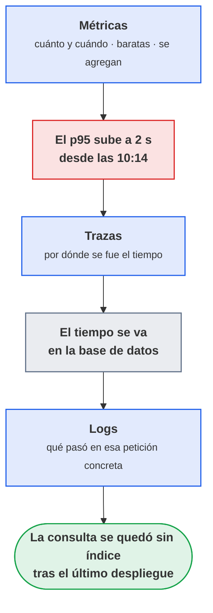
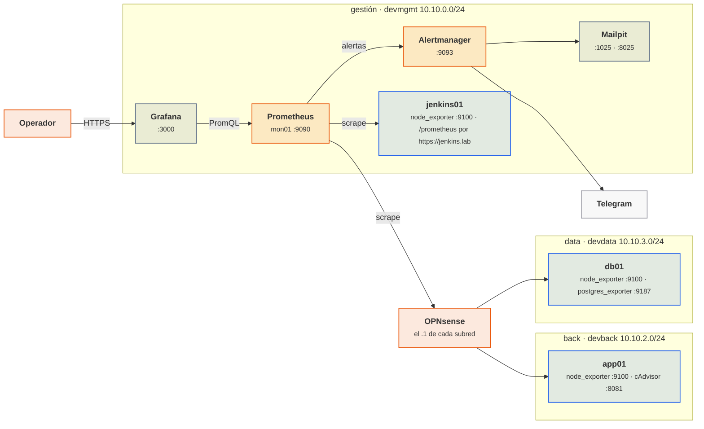

# UT7 · Monitorización del entorno

<p class="ut-meta">6 h en el centro + 12 h en la formación en empresa · Sesiones 42 a 44 · RA4 CE i, j, k</p>

Última unidad del centro. En la UT6 quedó Jenkins ejecutando pipelines contra la plataforma de OpenTofu y Ansible, pero sin nadie que mirase si de verdad funcionan. Ahora toca cerrar el círculo: una plataforma que no se vigila no está desplegada, está abandonada. En tres sesiones se montan Prometheus, Alertmanager y Grafana en la VM `mon01` de la subred de gestión, se recogen datos de los hosts, de los contenedores y del orquestador de CI, se dibujan paneles con los KPI del entorno y se consigue que una alerta llegue a un buzón o a un chat. La sesión 44 es la práctica evaluable, la 45 (16 de abril de 2027) el examen de la segunda evaluación, y las 12 horas de monitorización avanzada se hacen en la empresa. Los logs quedan para el módulo 5169.

!!! otra "Cómo se reparte la monitorización entre las dos asignaturas"
    El módulo 5169 ya ha explicado a fondo el instrumental: PromQL y las ventanas de `rate` en su [UT2, sesión 8 del 29 de octubre](https://victor-educ.github.io/apuntes-5169/ut/ut2-alarmas/#rate-increase-y-la-ventana); las [reglas de grabación](https://victor-educ.github.io/apuntes-5169/ut/ut2-alarmas/#agregacion-y-correlacion-recording-rules) el 5 de noviembre y las [reglas de alerta](https://victor-educ.github.io/apuntes-5169/ut/ut2-alarmas/#reglas-de-alerta) el 10; [Alertmanager entero](https://victor-educ.github.io/apuntes-5169/ut/ut2-alarmas/#alertmanager) el 12; Grafana desde su [UT1](https://victor-educ.github.io/apuntes-5169/ut/ut1-observabilidad/); y los [indicadores SLI, SLO y presupuesto de error](https://victor-educ.github.io/apuntes-5169/ut/ut4-kpi-pruebas/#indicadores-formulas-y-umbrales) el 17 de diciembre.
    Aquí esos cinco temas son repaso y ocupan diez minutos de clase entre todos: cada apartado dice de dónde viene y deja solo lo que su hoja de práctica necesita.
    Lo propio de esta unidad, y lo que se evalúa en ella, es el despliegue: elegir el gestor de ingesta y justificarlo, montar la pila definitiva dentro de la subred de gestión de la VPC, sacar los targets del inventario de Ansible con `file_sd`, recoger las métricas del orquestador de integración continua y asegurar la pila desde el lado de quien la despliega (cortafuegos, TLS, autenticación, secretos y acceso al repositorio de datos).

## Introducción

Esta unidad se lee en el orden en que se da: primero los conceptos y el plan, y después cada sesión con la teoría que se explica en clase seguida de su hoja de práctica. Los apartados que van más allá de lo que se hace en el aula están en la página Para ampliar.

### Qué tienes que saber hacer al terminar

- Elegir un gestor de ingesta con criterio y justificar por qué Prometheus encaja en un entorno de contenedores; recolectar métricas de hosts (node_exporter), de contenedores (cAdvisor) y del orquestador de integración continua (plugin de Jenkins), e interpretar qué dicen esas métricas sobre la salud de la CI (CE 4i).
- Escribir consultas PromQL que calculen KPI reales (CPU, memoria, disco, disponibilidad, tasa de fallos, p95), construir paneles en Grafana con unidades y umbrales, definir reglas de alerta y enrutarlas a correo, Telegram o webhook con Alertmanager (CE 4j).
- Asegurar la pila: red de gestión y cortafuegos, TLS y autenticación en Prometheus y Grafana, roles de usuario, secretos fuera del repositorio, retención y copia de seguridad de dashboards (CE 4k).

### Los conceptos de la unidad

El problema: el jueves a las tres de la tarde el disco de `db01` se llena, PostgreSQL deja de aceptar escrituras, la API de `app01` devuelve errores 500 y nadie se entera hasta que el viernes un usuario escribe quejándose. La plataforma está desplegada, configurada y alimentada por Jenkins, pero nadie la mira. Lo que se busca al terminar es que un programa mire por su cuenta: que lea cada 15 segundos cómo están hosts, contenedores y Jenkins, que lo dibuje en un panel que se entiende de un vistazo y que, cuando algo se tuerza, un correo o un Telegram llegue antes que la queja.

| Herramienta o concepto | Qué es, en una frase | Para qué se usa en esta unidad |
|----|----|----|
| Prometheus | Servidor que pasa lista cada 15 segundos a cada máquina y guarda sus números con fecha y hora | Recoger y almacenar las métricas del entorno |
| Exporter (node_exporter, cAdvisor, plugin de Jenkins) | Programa que traduce el estado de algo a una página de texto que Prometheus sabe leer | Uno por cada cosa vigilada |
| Formato de exposición | Cómo se escribe esa página: una métrica por línea, con nombre, etiquetas y valor | Saber leer lo que Prometheus lee y comprobar un exporter con `curl` |
| PromQL | Lenguaje de consulta de Prometheus, el SQL de las series temporales | Calcular los KPI, los paneles y las reglas de alerta |
| Reglas de alerta | Fichero YAML que dice "si esta consulta da cierto durante tanto tiempo, avisa" | Detectar hosts caídos, discos llenos, CPU alta y builds fallidas |
| Alertmanager | Recibe las alertas de Prometheus y decide a quién avisar, por dónde y cuándo callar | Enviar por correo, Telegram o webhook sin recibir 15 correos por una misma caída |
| Grafana y su provisioning | Interfaz web que dibuja consultas en paneles; el provisioning son ficheros que lee al arrancar en lugar de configurar por clics | El panel de KPI de operaciones cargado desde fichero y todo en Git |
| Docker Compose y Mailpit | Compose describe varios contenedores para levantarlos de una vez; Mailpit es un correo falso con interfaz web | Desplegar la pila en `mon01` y ver las notificaciones sin SMTP real |
| file_sd | Prometheus lee la lista de máquinas a vigilar de un fichero que escribe otro programa (Ansible) | Que los targets salgan del inventario y no se editen a mano |
| TLS, basic auth y proxy inverso nginx | El cifrado, la contraseña y la puerta de entrada de la UT3 | Que nadie fuera de la red de gestión lea los exporters ni entre en Grafana |

Cómo está organizada la unidad: sigue las sesiones en orden, y cada sesión trae primero la teoría que se explica y después su hoja de práctica. En la sesión 42 se justifica la elección de Prometheus, se despliega la pila en `mon01` y se conectan los exporters de hosts, contenedores y Jenkins: al acabar hay datos y todos los targets en UP. En la sesión 43 se explotan esos datos: diez minutos de repaso de lo que el módulo 5169 ya explicó (PromQL, reglas, Alertmanager, Grafana e indicadores), quince para las métricas del propio orquestador, y después los cinco KPI en Grafana por provisioning y las reglas y rutas hasta ver llegar un correo. La sesión 44 asegura la pila (red, TLS, autenticación, accesos, secretos) y es la práctica evaluable. Las 12 horas de monitorización avanzada se hacen en la formación en empresa; lo que se espera de ellas está en [En la empresa: monitorización avanzada](../ampliacion.md#en-la-empresa-monitorizacion-avanzada), junto con el apartado de [retención y almacenamiento](../ampliacion.md#retencion-y-almacenamiento) a largo plazo.

!!! otra "Dónde se usa esto en la otra asignatura"
    Quien cursa el módulo 5169 lleva desde octubre con Prometheus, Alertmanager y Grafana en el `mon01` provisional del bridge del aula, con Loki añadido en la [UT1 Observabilidad](https://victor-educ.github.io/apuntes-5169/ut/ut1-observabilidad/), las reglas y rutas de la UT2 Alarmas y los exporters detrás del firewall desde la UT3. En marzo, en la [UT8 Terminación segura](https://victor-educ.github.io/apuntes-5169/ut/ut8-terminacion-segura/), se desconfiguró de esa pila todo lo que vigilaba el entorno `pre`: la de `dev` sigue en pie y corriendo en `mon01`. Lo que se hace aquí es el ensayo inverso sobre ella: la instalación definitiva, dentro de la subred de gestión de la VPC y desplegada como parte de la plataforma.
    Los apuntes de 5169 son públicos y los enlaces de esta unidad llevan al apartado concreto donde cada cosa está explicada entera, así que no hace falta tener el material de clase a mano.

### Plan de sesiones

Cada sesión de 110 minutos empieza con una explicación corta y sigue con laboratorio. La columna «Se explica» recoge los apartados de teoría que se desarrollan en clase, con su duración aproximada; la columna «Se practica», el trabajo de laboratorio de esa sesión. Las sesiones marcadas solo como práctica no traen teoría nueva.

| Sesión | Fecha | Tipo | Se explica | Se practica |
|---:|-------|------|------------|-------------|
| [42](#sesion-42-ingesta-de-metricas) | 7 abr | Teoría y práctica | Métricas, logs y trazas; modelo pull; exporters; comparativa de gestores de ingesta (25 min). | Pila Prometheus, Alertmanager y Grafana en mon01; node_exporter, cAdvisor y el plugin de Jenkins; todos los targets en UP y las consultas que prueban las tres fuentes. |
| [43](#sesion-43-visualizacion-y-alertas) | 9 abr | Teoría y práctica | Repaso de PromQL, reglas y Alertmanager; métricas del orquestador de CI (25 min). | Panel propio con cinco KPI cargado por provisioning, reglas de alerta y envío por correo; provocar HostDown y ver la notificación y la resolución. |
| [44](#sesion-44-practica-evaluable) | 14 abr | Práctica evaluable | Seguridad de la monitorización: red, TLS, accesos y repositorio de datos (15 min). | Cortafuegos que reserva los exporters a mon01, Grafana tras nginx con TLS y entrega del repositorio monitoring sin secretos. |

## Sesión 42 · Ingesta de métricas

<p class="ut-meta" markdown>7 de abril · Teoría y práctica · <span class="dur" tabindex="0" aria-label="Monitorización y observabilidad · 5 min&#10;Elegir el gestor de ingesta · 10 min&#10;Pila de monitorización y exporters · 10 min&#10;A7.1 Ingesta · 85 min" data-dur="Monitorización y observabilidad · 5 min&#10;Elegir el gestor de ingesta · 10 min&#10;Pila de monitorización y exporters · 10 min&#10;A7.1 Ingesta · 85 min">:material-school:<i class="dur-barra" style="--teoria:23%"></i>:material-flask:</span></p>

Al terminar la sesión, Prometheus corre en `mon01` y lee de node_exporter en las cuatro máquinas, de cAdvisor en `app01` y del plugin de Jenkins, con todos los targets en UP y las consultas de la tabla devolviendo datos. En clase se explican los tres apartados siguientes: qué son métricas, logs y trazas, por qué se elige Prometheus frente a las otras opciones (esa justificación se pide en la práctica) y cómo se despliega la pila con sus exporters. El formato de exposición, el modelo de datos y la chuleta de exporters son material de consulta para la hoja A7.1.

### Monitorización y observabilidad

Monitorizar es recoger datos del sistema de forma continua para saber si funciona y avisar cuando deja de hacerlo. La palabra observabilidad, más frecuente en la empresa, va un paso más allá: poder preguntarle al sistema por qué va mal sin desplegar código nuevo para averiguarlo. Se apoya en tres tipos de datos, los llamados tres pilares:

- **Métricas**: números en el tiempo (CPU, memoria, peticiones por segundo, latencia). Ocupan poco (un par de bytes por muestra comprimida), se agregan bien y son la base de gráficos y alertas. Responden a "cuánto" y "cuándo".
- **Logs**: líneas de texto de lo que pasó, con marca de tiempo. Caras de guardar y buscar a gran volumen, pero son lo único que dice "qué" pasó en una petición concreta. Para diagnosticar.
- **Trazas**: recorrido de una petición por varios servicios, con el tiempo en cada uno. Para sistemas distribuidos donde una petición toca cinco microservicios y hay que saber cuál añadió los 800 ms.

Cómo se combinan: una alerta de métricas dice que el p95 de latencia ha subido de 200 ms a 2 s desde las 10:14; las trazas dicen que el tiempo se va en la base de datos; los logs de PostgreSQL enseñan la consulta que se quedó sin índice tras el último despliegue. En esta UT el foco está en el primer pilar, el más barato y el que sostiene las alertas. Logs en el 5169; trazas (OpenTelemetry, Tempo, Jaeger) solo como mención.



<p class="pie" markdown>Cada pilar responde a una pregunta distinta y ninguno sirve solo. La alerta avisa, la traza localiza y el log explica.</p>


| Término | Qué es |
|----|----|
| Exporter | Programa que expone métricas de algo (el sistema, Docker, una BD) en formato Prometheus |
| Scrape | Lectura periódica que Prometheus hace de cada exporter |
| Target | Cada endpoint concreto que Prometheus lee (host:puerto/ruta) |
| Serie temporal | Una métrica con sus etiquetas (`node_cpu_seconds_total{cpu="0",mode="idle"}`) |
| Muestra (sample) | Un valor con su marca de tiempo dentro de una serie |
| KPI | Indicador clave: la métrica o fórmula que resume si el servicio va bien (disponibilidad, latencia p95, errores por minuto) |
| Umbral | Valor a partir del cual una métrica se considera anómala |
| Alerta | Regla que se activa cuando un umbral se supera durante un tiempo |

### Elegir el gestor de ingesta

Antes de instalar nada hay que decidir con qué se recogen los datos, y esa decisión se pide justificada en la práctica. No hay una herramienta mejor en abstracto: depende de qué hay que vigilar (contenedores, servidores físicos, un servicio de nube) y de quién lo mantiene. La tabla resume las cuatro opciones más habituales en las empresas.

|  | Prometheus + Grafana | Zabbix | Elastic (ELK) / OpenSearch | Servicios en nube (CloudWatch, Azure Monitor) |
|----|----|----|----|----|
| Modelo | Pull: Prometheus lee a los exporters | Agente que envía | Logs y métricas por Beats | Integrado en la plataforma |
| Punto fuerte | Estándar en contenedores y Kubernetes; PromQL | Todo en uno, plantillas para hardware | Logs | Sin instalar nada |
| Punto débil | Retención larga requiere Thanos/Mimir | Menos natural con contenedores | Pesado | Coste y dependencia |

Criterio (CE 4i): **recolectar** de todo el entorno (hosts, contenedores, orquestador) y **visualizar**. Prometheus + Grafana cumple ambas y es el estándar en contenedores: cualquier imagen seria (nginx, PostgreSQL, Traefik, Jenkins, el propio Docker) expone métricas en su formato o tiene un exporter mantenido. Zabbix sigue siendo razonable en un centro de datos clásico con switches, sistemas de alimentación ininterrumpida y servidores físicos, y conviene no descartarlo si la empresa ya lo tiene. Los servicios de nube son cómodos hasta que llega la factura.

#### Pull frente a push, y cuándo usar Pushgateway

Prometheus va a buscar los datos (pull): cada `scrape_interval` hace un GET a `/metrics` de cada target y guarda lo que le devuelven. Consecuencias prácticas:

- Si un target no responde, Prometheus lo sabe en el acto (`up == 0`). En un modelo push, un agente muerto deja de enviar y nadie se entera hasta que alguien mira.
- Se puede abrir `http://app01.dev.lab:9100/metrics` en el navegador y ver exactamente lo que Prometheus ve.
- Qué se vigila está en un solo sitio (`prometheus.yml`), no repartido en cien agentes, y el exporter no necesita credenciales ni saber dónde está el servidor.

La pega: Prometheus tiene que llegar por red a cada target, lo que obliga a abrir puertos (y a protegerlos). Y hay cosas que no se pueden leer: un trabajo de cron que dura 20 segundos no está vivo cuando Prometheus pasa a preguntar. Para eso existe **Pushgateway**: el trabajo empuja sus métricas (`curl --data-binary @- http://pushgateway:9091/metrics/job/backup/instance/db01`) y Prometheus lee del gateway como de un exporter más. Solo para lotes cortos: usarlo como buzón general es un error clásico, porque el gateway nunca olvida (la métrica de un host que ya no existe sigue ahí) y se pierde la detección de caída por `up`.

<figure markdown="span">
  { width="640" }
  <figcaption>Arquitectura de Prometheus: el servidor lee de los exporters y de Pushgateway, evalúa reglas, envía a Alertmanager y sirve datos a Grafana. Fuente: Proyecto Prometheus, Apache 2.0.</figcaption>
</figure>

### Pila de monitorización

Aquí es donde por fin se instala algo: cuatro contenedores en una VM (Prometheus, Alertmanager, Grafana y un correo de pruebas) más un exporter en cada máquina vigilada. Al terminar, Prometheus tiene datos de hosts, contenedores y Jenkins; el resto de la unidad los explota.

La pila se despliega con Docker Compose en la VM `mon01`, que en el laboratorio es la `10.10.0.20` de la VNet `devmgmt` (`10.10.0.0/24`). Los hosts vigilados no comparten esa red: `jenkins01` sí está en gestión (`10.10.0.10`), pero `app01` vive en `devback` (`10.10.2.10`) y `db01` en `devdata` (`10.10.3.10`), cada uno con una sola tarjeta, la de su zona. No hay ninguna pata de gestión en `app01` ni en `db01`, así que cada scrape de Prometheus sale de gestión y **atraviesa el cortafuegos** del entorno. Las reglas que permiten ese paso son justamente las que se trabajan en la [UT3 de Mantenimiento del sistema de contenedores](https://victor-educ.github.io/apuntes-5169/ut/ut3-seguridad-monitorizacion/); aquí se dan por hechas y en la sesión 44 se cierran a conciencia.

En el compose conviene fijarse en los volúmenes con nombre (los datos sobreviven a un `docker compose down`), en la configuración montada en solo lectura y en los flags de retención.

```yaml
# compose.yml (VM mon01, subred de gestión)
services:
  prometheus:
    image: prom/prometheus:v3.5.0
    volumes:
      - ./prometheus.yml:/etc/prometheus/prometheus.yml:ro
      - ./alerts.yml:/etc/prometheus/alerts.yml:ro
      - ./targets:/etc/prometheus/targets:ro
      - ./certs:/etc/prometheus/certs:ro
      - prom_data:/prometheus
    command:
      - --config.file=/etc/prometheus/prometheus.yml
      - --storage.tsdb.retention.time=30d
      - --storage.tsdb.retention.size=8GB
      - --web.enable-lifecycle
    ports: ["9090:9090"]
    restart: unless-stopped
  alertmanager:
    image: prom/alertmanager:v0.28.1
    volumes:
      - ./alertmanager.yml:/etc/alertmanager/alertmanager.yml:ro
      - am_data:/alertmanager
    ports: ["9093:9093"]
    restart: unless-stopped
  grafana:
    image: grafana/grafana:12.1.0
    environment:
      GF_SECURITY_ADMIN_PASSWORD: "${GRAFANA_PASS}"
      GF_USERS_ALLOW_SIGN_UP: "false"
    volumes:
      - graf_data:/var/lib/grafana
      - ./grafana/provisioning:/etc/grafana/provisioning:ro
      - ./grafana/dashboards:/var/lib/grafana/dashboards:ro
    ports: ["3000:3000"]
    restart: unless-stopped
  mailpit:
    image: axllent/mailpit:v1.22.3
    ports: ["8025:8025"]   # interfaz web; SMTP en 1025 solo dentro de la red de compose
    restart: unless-stopped
volumes: { prom_data: {}, am_data: {}, graf_data: {} }
```

Las versiones se fijan siempre (nada de `latest` en una pila que tiene que ser reproducible). `--web.enable-lifecycle` permite recargar la configuración con `curl -X POST http://localhost:9090/-/reload` sin reiniciar el contenedor. La retención por tiempo y por tamaño se combinan: lo primero que se cumpla borra bloques antiguos. Mailpit aparece en el apartado de alertas.

En cada máquina a vigilar:

- **node_exporter** (puerto 9100): CPU, memoria, disco, red, carga, systemd del host. Se instala con el paquete `prometheus-node-exporter` de Debian, que ya trae su unidad de systemd y su usuario de servicio, o con el binario oficial si hace falta una versión más nueva que la del repositorio; también existe como contenedor con `--pid=host` y los volúmenes `/proc`, `/sys` y `/` montados en solo lectura. Conviene dejarlo fuera de Docker: un exporter que depende de Docker no puede avisar de que Docker se ha caído.
- **cAdvisor**: CPU, memoria, red y disco por contenedor, leyendo los cgroups (el mecanismo del kernel con el que Docker limita y contabiliza los recursos de cada contenedor). Va como contenedor (`gcr.io/cadvisor/cadvisor`) con `/var/run/docker.sock`, `/sys` y `/var/lib/docker` montados. Dentro de la red de Docker escucha en el 8080, pero en `app01` ese puerto del host lo ocupa la API del curso, así que **se publica en el 8081** (`-p 10.10.2.10:8081:8080`). Es glotón: con muchos contenedores conviene arrancarlo con `--docker_only=true --housekeeping_interval=30s`.
- Jenkins expone `/prometheus` con el plugin **Prometheus metrics**, que no viene de serie y que en la UT6 no se instaló: se añade en esta unidad al `plugins.txt` de la imagen propia. Como Jenkins va detrás de su nginx, la ruta pública es `https://jenkins.lab/prometheus` y el 8080 del contenedor no se publica. Por defecto el plugin antepone el prefijo `default_` a los nombres; se cambia en Manage Jenkins → System → Prometheus.

```yaml
# prometheus.yml
global:
  scrape_interval: 15s
  evaluation_interval: 15s
rule_files: ["alerts.yml"]
alerting:
  alertmanagers:
    - static_configs: [{ targets: ["alertmanager:9093"] }]
scrape_configs:
  - job_name: prometheus
    static_configs: [{ targets: ["localhost:9090"] }]
  - job_name: node
    static_configs:
      - targets: ["app01.dev.lab:9100", "db01.dev.lab:9100", "jenkins01.lab:9100", "mon01.lab:9100"]
  - job_name: cadvisor
    static_configs: [{ targets: ["app01.dev.lab:8081"] }]
  - job_name: jenkins
    scheme: https                      # Jenkins solo se publica por su nginx, en el 443
    metrics_path: /prometheus
    tls_config: { ca_file: /etc/prometheus/certs/ca.crt }
    static_configs: [{ targets: ["jenkins.lab:443"] }]
```

Con `scrape_interval: 15s` y un entorno de cuatro hosts (unas 1 000 series por node_exporter, otras 2 000 de cAdvisor con veinte contenedores, 300 de Jenkins) el entorno queda en torno a 7 000 series activas y 470 muestras por segundo: unos 60 MB al día en disco, menos de 2 GB en los 30 días de retención. Se comprueba con `du -sh` sobre `prom_data` al cabo de una semana.



<p class="pie" markdown>Prometheus va a buscar (*pull*): las flechas de scrape salen de la gestión hacia `app01` y `db01` atravesando el cortafuegos, nunca al revés. Eso decide las reglas que se permiten en la UT3 de Mantenimiento y que la sesión 44 deja cerradas.</p>

#### Descubrimiento de targets

`static_configs` sirve para un laboratorio de cuatro máquinas. En cuanto los hosts los crea OpenTofu y los configura Ansible, editar `prometheus.yml` a mano es un paso atrás. Dos alternativas que escalan:

**file_sd_configs**: Prometheus vigila uno o varios ficheros JSON o YAML y recarga los targets cuando cambian, sin reiniciar ni señal. El fichero lo puede escribir Ansible con una plantilla desde el inventario, o el propio pipeline de OpenTofu desde sus outputs.

```yaml
# en prometheus.yml
  - job_name: node
    file_sd_configs:
      - files: ["/etc/prometheus/targets/node_*.yml"]
        refresh_interval: 1m
```

```yaml
# targets/node_lab.yml (aquí se escribe a mano; en producción lo genera Ansible)
- targets: ["app01.dev.lab:9100", "db01.dev.lab:9100"]
  labels: { env: dev, rol: servicio }
- targets: ["jenkins01.lab:9100"]
  labels: { env: dev, rol: ci }
```

Conviene fijarse en que aquí se añaden etiquetas propias (`env`, `rol`) a todas las series de esos targets; luego se usan en consultas y en el enrutado de alertas.

**docker_sd_configs**: Prometheus habla con el socket de Docker (o con un `tcp://` protegido con TLS) y descubre los contenedores en marcha, exponiendo sus etiquetas como `__meta_docker_container_label_*`. Con `relabel_configs` se decide qué contenedores se leen (por ejemplo, los que tienen la etiqueta `prometheus.scrape=true`) y en qué puerto. Es la antesala de `kubernetes_sd_configs`, que funciona igual. En el laboratorio se usa `file_sd`.

### El formato de exposición

!!! consulta "Material de consulta"
    Esto no se explica en clase: hace falta para la hoja de práctica de esta sesión.

Para entender lo que Prometheus guarda hay que ver primero lo que lee: cada exporter publica una página de texto que se puede abrir con el navegador, y conviene saber leerla porque es lo primero que se mira cuando un panel sale vacío.

Un `/metrics` es texto plano, una métrica por línea, con dos líneas de comentario opcionales (`HELP` y `TYPE`) que la documentan. Esto es un extracto real de lo que devuelve `curl -s http://app01.dev.lab:9100/metrics` (node_exporter expone entre 500 y 1500 líneas según el hardware):

```text
# HELP node_cpu_seconds_total Seconds the CPUs spent in each mode.
# TYPE node_cpu_seconds_total counter
node_cpu_seconds_total{cpu="0",mode="idle"} 118372.63
node_cpu_seconds_total{cpu="0",mode="iowait"} 41.2
node_cpu_seconds_total{cpu="0",mode="system"} 1204.77
node_cpu_seconds_total{cpu="0",mode="user"} 3521.12
node_cpu_seconds_total{cpu="1",mode="idle"} 118401.02
# HELP node_memory_MemAvailable_bytes Memory information field MemAvailable_bytes.
# TYPE node_memory_MemAvailable_bytes gauge
node_memory_MemAvailable_bytes 6.1478912e+09
# HELP node_filesystem_avail_bytes Filesystem space available to non-root users in bytes.
# TYPE node_filesystem_avail_bytes gauge
node_filesystem_avail_bytes{device="/dev/sda1",fstype="ext4",mountpoint="/"} 2.4512e+10
# HELP http_request_duration_seconds Duración de las peticiones (ejemplo de una app instrumentada)
# TYPE http_request_duration_seconds histogram
http_request_duration_seconds_bucket{handler="/api",le="0.1"} 240
http_request_duration_seconds_bucket{handler="/api",le="0.5"} 310
http_request_duration_seconds_bucket{handler="/api",le="1"} 318
http_request_duration_seconds_bucket{handler="/api",le="+Inf"} 320
http_request_duration_seconds_sum{handler="/api"} 41.2
http_request_duration_seconds_count{handler="/api"} 320
```

Los cuatro tipos:

- **Counter**: solo sube (o se pone a cero cuando el proceso reinicia). Segundos de CPU, bytes enviados, peticiones servidas, builds fallidas. El valor bruto no dice nada; lo que interesa es su velocidad, y para eso está `rate()`.
- **Gauge**: sube y baja. Memoria disponible, temperatura, número de contenedores en ejecución. Se lee tal cual.
- **Histogram**: cuenta observaciones en cubos (`_bucket` con etiqueta `le`, "less or equal") acumulativos, más `_sum` y `_count`. En el ejemplo, 240 peticiones tardaron 0,1 s o menos, 310 tardaron 0,5 s o menos (incluye las 240 anteriores) y hubo 320 en total. Con esto se calculan percentiles en el servidor con `histogram_quantile`, y se pueden sumar histogramas de varias instancias.
- **Summary**: el cliente calcula los percentiles y los expone ya hechos (`{quantile="0.95"}`). Es más preciso pero no se puede agregar entre instancias: la media de dos p95 no es el p95 global. En la práctica se prefiere histogram.

Prometheus 3 acepta también OpenMetrics, una versión estandarizada de este mismo texto, pero lo que se ve en los exporters es esto.

### Modelo de datos y cardinalidad

!!! consulta "Material de consulta"
    Esto no se explica en clase: hace falta para la hoja de práctica de esta sesión.

Este apartado explica de qué depende que Prometheus vaya ligero o se muera por falta de memoria, y la respuesta no es "cuántos datos guarda" sino "cuántas series distintas". Entender la diferencia evita el error más caro de esta tecnología.

Una serie temporal es la combinación única de nombre de métrica y conjunto de pares etiqueta=valor. `node_cpu_seconds_total` en un host de 4 núcleos con 8 modos de CPU son 32 series, no una. Prometheus añade automáticamente `job` (el nombre del bloque de scrape) e `instance` (host:puerto) a todo lo que lee, y guarda cada serie como una secuencia de (timestamp, valor) comprimida en su TSDB (la base de datos de series temporales que lleva integrada).

El coste de Prometheus está en el número de series, no en el de muestras: cada serie activa consume memoria en el "head block" (unos pocos KB) y entrada de índice; cada muestra nueva de una serie existente cuesta un par de bytes. Por eso una etiqueta con muchos valores distintos es venenosa: a ese número de valores distintos se le llama cardinalidad. Ejemplo real: un desarrollador con buena intención añade `user_id` a `http_requests_total`. Con 50 000 usuarios, 20 rutas y 5 códigos de estado son 5 millones de series potenciales en lugar de 100; la memoria se dispara, las consultas que tardaban 50 ms tardan 30 s y el proceso muere por OOM (el kernel lo mata al quedarse sin memoria). Lo mismo con IPs de cliente, sesiones, IDs de contenedor efímeros o marcas de tiempo en una etiqueta. La regla: una etiqueta debe tener pocos valores posibles (método HTTP, código de estado, host, servicio). Lo que identifica a un usuario va al log, no a la métrica. Para vigilarlo, `prometheus_tsdb_head_series` da las series activas y Status → TSDB Status en la interfaz enseña las diez métricas y etiquetas con más cardinalidad.

### Exporters más habituales

!!! consulta "Material de consulta"
    Esto no se explica en clase: hace falta para la hoja de práctica de esta sesión.

En el laboratorio se instalan tres exporters, pero en la empresa cada servicio tiene el suyo y la pregunta es siempre la misma: qué puerto abre, qué mide y qué necesita. Esta tabla es la chuleta de los más habituales; el párrafo de después explica el único que mide desde fuera.

| Exporter | Puerto | Para qué | Comentario |
|----|----|----|----|
| node_exporter | 9100 | Sistema operativo del host | El primero que se instala en cualquier máquina Linux |
| cAdvisor | 8080 dentro de Docker, 8081 publicado en `app01` | Contenedores por cgroup | Mantenido por Google; en Kubernetes va dentro del kubelet |
| blackbox_exporter | 9115 | Sondas desde fuera: HTTP, TCP, ICMP, DNS | Prometheus le pasa la URL como parámetro; mide lo que ve el usuario (código, latencia, caducidad del certificado TLS) |
| postgres_exporter | 9187 | Conexiones, transacciones, tamaño, réplica de PostgreSQL | Necesita un usuario de solo lectura en la BD, con `pg_monitor` |
| nginx-prometheus-exporter | 9113 | Conexiones activas y peticiones de nginx | Lee `stub_status`; para métricas por ruta hace falta un módulo de terceros o Traefik |
| Plugin Prometheus de Jenkins | 443 (`https://jenkins.lab/prometheus`) | Builds, duración, cola, ejecutores | Prefijo `default_`; se puede exigir API key en el endpoint |

Blackbox cambia el punto de vista: los demás miden desde dentro ("el proceso usa 300 MB"); blackbox mide desde fuera ("la URL responde 200 en 120 ms y el certificado caduca en 41 días"), que es lo que le importa al que paga. Un job de blackbox contra la aplicación es el SLI de disponibilidad más honesto que se puede tener, y `probe_ssl_earliest_cert_expiry - time() < 14*86400` es una alerta que ha salvado más de un fin de semana.

### A7.1 Ingesta (sesión 42)

<span class="et et-obj">Objetivo</span> Al terminar, Prometheus corre en `mon01`, lee de sí mismo, de node_exporter en las cuatro máquinas, de cAdvisor en `app01` y de Jenkins, todos los targets están en UP y las consultas de comprobación devuelven datos de las tres fuentes.

<span class="et et-pre">Antes de empezar</span>

- Las VM `mon01` (`10.10.0.20`, en `devmgmt`), `jenkins01` (`10.10.0.10`, en `devmgmt`), `app01` (`10.10.2.10`, en `devback`) y `db01` (`10.10.3.10`, en `devdata`) encendidas, con Docker en `mon01` y en `app01`, y Jenkins arrancado en `jenkins01`.
- El cortafuegos del entorno deja pasar de `mon01` a los puertos de los exporters de `app01` y de `db01`; si no, no hay scrape posible. Desde `mon01`, `ping -c1 app01.dev.lab` responde y los nombres los resuelve OPNsense, que es el `.1` de cada subred desde la sesión 14.
- El fichero `ca.crt` de la CA del aula que creaste en la UT6, copiado a `~/monitoring/certs/ca.crt` en `mon01`: es lo que hace que Prometheus se fíe de `https://jenkins.lab`.
- El repositorio `monitoring` de 5169, que aquí se reescribe como despliegue definitivo, clonado en `mon01` en `~/monitoring`; en la sesión 44 se entrega. Trabaja en una rama nueva para no pisar lo que allí funciona.
- `mon01` lleva desde octubre la pila de 5169 en `/opt/monitoring` (Prometheus 9090, Alertmanager 9093, Grafana 3000, Mailpit 8025 y Loki): haz `docker compose down` ahí antes de empezar o el primer `docker compose up -d` falla con `port is already allocated`. El contenedor `cadvisor` que `app01` tiene publicado en el 8081 desde aquella pila, en cambio, se aprovecha tal cual: no lo borres.
- Explicado en clase: [Elegir el gestor de ingesta](#elegir-el-gestor-de-ingesta), el modelo pull y los exporters de [Pila de monitorización](#pila-de-monitorizacion). Para consultar durante la práctica: [El formato de exposición](#el-formato-de-exposicion) y [Descubrimiento de targets](#descubrimiento-de-targets).

<span class="et et-pas">Pasos</span>

1. En `~/monitoring` de `mon01`, crea `compose.yml` y `prometheus.yml` copiando los del apartado [Pila de monitorización](#pila-de-monitorizacion) tal cual. Crea también los ficheros que el compose monta, aunque de momento estén vacíos, porque si no Docker crea directorios con ese nombre:

    ```bash
    mkdir -p ~/monitoring/targets ~/monitoring/certs ~/monitoring/grafana/provisioning ~/monitoring/grafana/dashboards
    cd ~/monitoring
    printf 'groups: []\n' > alerts.yml
    printf 'route:\n  receiver: mail\nreceivers:\n  - name: mail\n' > alertmanager.yml
    echo 'GRAFANA_PASS=cambiame' > .env && echo '.env' >> .gitignore
    docker compose up -d && docker compose ps
    ```

2. Abre `http://mon01.lab:9090/targets`. El job `prometheus` tiene que estar en UP; los demás en DOWN todavía, es normal.
3. Deja node_exporter escuchando en las cuatro máquinas. Instalarlo solo hace falta en `jenkins01`, que es nueva: en `app01`, `db01` y `mon01` ya está puesto desde la UT3 de Mantenimiento y ahí basta con cambiar la dirección de escucha y reiniciar el servicio. Ojo con esas tres: allí se le pusieron TLS y autenticación básica, y sustituir `/etc/default/prometheus-node-exporter` deja sin cifrar lo que se endureció el 3 de diciembre, así que anótalo y recupéralo al acabar la unidad. Lo único que se toca es la dirección en la que escucha: **la de la zona de cada host**, nunca `0.0.0.0` (`app01` la `10.10.2.10`, `db01` la `10.10.3.10`, `jenkins01` la `10.10.0.10` y `mon01` la `10.10.0.20`; `ip -br a` te la confirma).

    ```bash
    # solo en jenkins01: las VM del laboratorio no bajan binarios de Internet, así que
    # se usa el paquete de Debian, que ya trae la unidad de systemd y su usuario propio
    sudo apt-get update && sudo apt-get install -y prometheus-node-exporter
    # en las cuatro, cambiando la IP por la de la zona del host
    echo 'ARGS="--web.listen-address=10.10.2.10:9100"' | sudo tee /etc/default/prometheus-node-exporter
    sudo systemctl restart prometheus-node-exporter
    curl -s http://10.10.2.10:9100/metrics | grep '^node_cpu_seconds_total' | head -3
    ```

    !!! truco "Si necesitas una versión más nueva que la de Debian"
        El binario oficial se descarga **una sola vez** en la máquina que tenga salida (el puesto de administración, `10.10.0.50`) y se reparte con `scp`, sin pedir Internet a las VM de servicio: `curl -sSLO https://github.com/prometheus/node_exporter/releases/download/v1.9.1/node_exporter-1.9.1.linux-amd64.tar.gz`, `tar xzf` para sacar el binario, y `for h in app01.dev.lab db01.dev.lab jenkins01.lab mon01.lab; do scp node_exporter ops@$h:/tmp/; done`. En cada host, `sudo install -m 0755 /tmp/node_exporter /usr/local/bin/` y una unidad de systemd propia con el mismo `--web.listen-address`.

4. cAdvisor en `app01` ya corre desde la pila de 5169. Compruébalo desde `mon01` antes de tocar nada: si contesta, este paso está hecho y el job `cadvisor` de `prometheus.yml` lo va a encontrar.

    ```bash
    curl -s http://10.10.2.10:8081/metrics | grep -c '^container_cpu_usage_seconds_total'
    ```

    Solo si no contesta, o si en `app01` `docker inspect cadvisor --format '{{.HostConfig.PortBindings}}'` enseña que publica en todas las interfaces en lugar de en la IP de la zona, recréalo. Dentro de la red de Docker sigue escuchando en el 8080, pero se publica en el **8081** de la IP de `app01`, porque el 8080 del host lo ocupa la API del curso:

    ```bash
    docker rm -f cadvisor
    docker run -d --name cadvisor --restart unless-stopped -p 10.10.2.10:8081:8080 \
      -v /:/rootfs:ro -v /var/run:/var/run:ro -v /sys:/sys:ro -v /var/lib/docker:/var/lib/docker:ro \
      gcr.io/cadvisor/cadvisor:v0.52.1 --docker_only=true --housekeeping_interval=30s
    ```

5. Instala el plugin **Prometheus metrics** en Jenkins. No se instaló en la UT6, así que hay que añadirlo ahora, y se añade donde está el resto: en el `plugins.txt` de la imagen propia del repositorio `jenkins-config`, para que un Jenkins reconstruido desde cero siga exponiendo sus métricas. En `jenkins01`:

    ```bash
    cd ~/jenkins-config
    echo 'prometheus' >> plugins.txt
    docker compose up -d --build
    ```

    Cuando arranque, comprueba la ruta por el nombre público, que es el único publicado (el 8080 del contenedor no sale de la red del compose): `curl -s https://jenkins.lab/prometheus | grep '^default_jenkins_builds' | head`. Si Jenkins pide autenticación en esa ruta, en Manage Jenkins → System → Prometheus desactiva "Use authenticated endpoint" y anota el prefijo: el laboratorio asume `default_`. Haz commit de `plugins.txt` en `jenkins-config`.
6. Pasa el job `node` de `static_configs` a `file_sd_configs`. En `prometheus.yml` sustituye el bloque del job `node` por el de [Descubrimiento de targets](#descubrimiento-de-targets) y crea el fichero de targets con las etiquetas `env` y `rol`:

    ```yaml
    # targets/node_lab.yml
    - targets: ["app01.dev.lab:9100", "db01.dev.lab:9100"]
      labels: { env: dev, rol: servicio }
    - targets: ["jenkins01.lab:9100"]
      labels: { env: dev, rol: ci }
    - targets: ["mon01.lab:9100"]
      labels: { env: dev, rol: gestion }
    ```

    Comprueba la sintaxis y recarga sin reiniciar:

    ```bash
    docker compose exec prometheus promtool check config /etc/prometheus/prometheus.yml
    curl -X POST http://localhost:9090/-/reload
    ```

7. En `http://mon01.lab:9090/targets` espera un minuto (el `refresh_interval` de `file_sd`) y confirma que todos los endpoints están en UP. Si alguno está en DOWN, el mensaje de error de esa fila y la lista de [Errores frecuentes](#errores-frecuentes-en-el-laboratorio) te dicen dónde mirar; lo habitual en esta sesión son dos cosas: un exporter escuchando en otra interfaz, o el cortafuegos del entorno bloqueando el camino de gestión a `back` o a `data`.
8. En la pestaña Graph (`http://mon01.lab:9090/graph`) prueba que llegan datos de las tres fuentes con cuatro consultas de [Consultas del laboratorio](#consultas-del-laboratorio): CPU usada por host, disco libre, CPU de un contenedor y ejecuciones de Jenkins fallidas. Apunta en una tabla el valor de cada una para un host. La de cAdvisor (`{name="app"}`) necesita que el contenedor de tu aplicación se llame así; si no, cambia el valor de `name` por el tuyo (`docker ps --format '{{.Names}}'` en `app01`). La de Jenkins dará 0 si no hay builds fallidas en la última hora, que también es un resultado válido: para ver un número distinto de cero consulta `default_jenkins_builds_success_build_count`, que cuenta las ejecuciones correctas de la UT6.
9. Haz commit de `compose.yml`, `prometheus.yml`, `alerts.yml`, `alertmanager.yml` y `targets/` en el repositorio `monitoring` (sin `.env`).

<span class="et et-com">Comprobación</span> En `http://mon01.lab:9090/targets` los cuatro jobs (`prometheus`, `node`, `cadvisor`, `jenkins`) sin ninguna fila en DOWN, y las series del job `node` llevan las etiquetas `env` y `rol` (en Graph, `up{rol="ci"}` devuelve una serie). `prometheus_tsdb_head_series` está entre 3 000 y 10 000.

<span class="et et-ent">Entrega</span> En una carpeta `A7.1` de Aules: captura de la página Targets con todo en UP, el fichero `targets/node_lab.yml` y una tabla (Markdown o captura) con las cuatro consultas y su resultado. El repositorio `monitoring` con el primer commit.

<span class="et et-ext">Si te sobra tiempo</span> Ejecuta las cinco consultas que te has dejado de [Consultas del laboratorio](#consultas-del-laboratorio) y añade una propia con `topk` o `predict_linear`: `topk(3, instance:node_cpu_utilisation:ratio)` no funciona todavía (la regla de grabación llega en la sesión 43), así que parte de `topk(2, 1 - avg by (instance) (rate(node_cpu_seconds_total{mode="idle"}[5m])))` o del `predict_linear` del disco con una ventana de `[1h]`. Lanza en Jenkins un job que falle a propósito y mira subir `increase(default_jenkins_builds_failed_build_count[1h])`. Abre Status → TSDB Status y anota qué métrica tiene más series y por qué. Instala `postgres_exporter` en `db01` (puerto 9187, usuario de solo lectura con `pg_monitor`) y añádelo a un job `postgres`.

## Sesión 43 · Visualización y alertas

<p class="ut-meta" markdown>9 de abril · Teoría y práctica · <span class="dur" tabindex="0" aria-label="Repaso: PromQL, reglas, Alertmanager, Grafana y KPI · 10 min&#10;Métricas del orquestador: Jenkins en Prometheus · 15 min&#10;A7.2 Paneles y alertas · 85 min" data-dur="Repaso: PromQL, reglas, Alertmanager, Grafana y KPI · 10 min&#10;Métricas del orquestador: Jenkins en Prometheus · 15 min&#10;A7.2 Paneles y alertas · 85 min">:material-school:<i class="dur-barra" style="--teoria:23%"></i>:material-flask:</span></p>

Con los datos ya guardados, esta sesión los convierte en paneles y avisos: un dashboard propio con los cinco KPI cargado por provisioning y la alerta `HostDown` llegando a Mailpit en FIRING y en RESOLVED. Los cinco primeros apartados son repaso y en clase ocupan diez minutos entre todos: PromQL, las reglas, Alertmanager, Grafana y el vocabulario de indicadores se explicaron a fondo en el módulo 5169 entre octubre y diciembre, y aquí queda solo lo que la hoja A7.2 necesita, con el enlace al apartado donde está entero. Los quince minutos restantes van a lo que aquel módulo no toca y aquí se evalúa: qué publica el orquestador de integración continua y qué dicen esos números sobre la salud de la CI.

### PromQL: repaso y consultas del laboratorio

!!! otra "Esto es un repaso"
    PromQL se explicó a fondo en la [UT2 de Mantenimiento, sesión 8 del 29 de octubre](https://victor-educ.github.io/apuntes-5169/ut/ut2-alarmas/#rate-increase-y-la-ventana): selectores, expresiones regulares sobre etiquetas, `rate`, `increase`, `irate`, cómo se elige la ventana y los operadores con etiquetas. Allí está entero; la [chuleta de comandos de 5169](https://victor-educ.github.io/apuntes-5169/chuleta/) tiene además las consultas sueltas para copiar.

De todo aquello, esta sesión usa tres cosas y conviene tenerlas frescas antes de abrir Grafana.

| Lo que se usa hoy | Qué conviene recordar | Dónde aparece |
|----|----|----|
| `rate(x[5m])` e `increase(x[1h])` sobre contadores | La ventana tiene que contener al menos cuatro muestras: con scrape de 15 s, 5 m es lo habitual. `irate` sirve para mirar picos, no para alertar | Panel de CPU, alerta `JenkinsBuildsFailing` |
| Comparaciones con y sin `bool` | `up == 0` filtra y devuelve solo las series que valen cero; `up == bool 0` devuelve 1 o 0 en todas, que es lo que permite sumarlas: `sum(up == bool 0)`. `count(up == bool 0)` contaría todas las series, caídas o no | Panel de hosts caídos (`sum(up == bool 0)`), alerta `HostDown` |
| `histogram_quantile` y `predict_linear` | El `sum by (le)` delante de `histogram_quantile` es obligatorio: sin él la función no reconstruye el histograma. `predict_linear` ajusta una recta sobre un rango y avisa antes de llegar al límite, no cuando ya se ha llegado | Latencia p95 y disco que se llena, en la tabla siguiente |

Conviene probar cada consulta en la pestaña Graph de `http://mon01.lab:9090` antes de llevarla a un panel: lo que no devuelve nada ahí tampoco lo hará en Grafana.

#### Consultas del laboratorio

| Qué | Consulta |
|----|----|
| CPU usada (%) por host | `100 - avg by(instance)(rate(node_cpu_seconds_total{mode="idle"}[5m])) * 100` |
| Memoria disponible (%) | `node_memory_MemAvailable_bytes / node_memory_MemTotal_bytes * 100` |
| Disco libre (%) | `node_filesystem_avail_bytes{mountpoint="/"} / node_filesystem_size_bytes{mountpoint="/"} * 100` |
| CPU de un contenedor | `rate(container_cpu_usage_seconds_total{name="app"}[5m])` |
| Memoria de un contenedor | `container_memory_working_set_bytes{name="app"}` |
| Host caído | `up == 0` |
| Ejecuciones de Jenkins fallidas | `increase(default_jenkins_builds_failed_build_count[1h])` |
| Latencia p95 de la aplicación | `histogram_quantile(0.95, sum by (le) (rate(http_request_duration_seconds_bucket[5m])))` |
| Disco que se llena en 4 h | `predict_linear(node_filesystem_avail_bytes{mountpoint="/"}[6h], 4*3600) < 0` |

Sobre la CPU de un contenedor: `rate(container_cpu_usage_seconds_total[5m])` devuelve núcleos usados (0,5 = medio núcleo). Para el porcentaje respecto al límite del contenedor hay que dividir por `container_spec_cpu_quota / container_spec_cpu_period`. Y `container_memory_working_set_bytes` es la métrica que usa el kernel para decidir el OOM kill, no `container_memory_usage_bytes`, que incluye caché de página recuperable.

Los cinco KPI mínimos del entorno del curso: disponibilidad de cada host (`up`), CPU y memoria del host, memoria del contenedor de la aplicación, espacio en disco de la BD, y tasa de fallo de pipelines.

### Reglas: grabación y alerta

!!! otra "Esto es un repaso"
    Las reglas de grabación se trabajaron en la [UT2 de Mantenimiento, sesión 10 del 5 de noviembre](https://victor-educ.github.io/apuntes-5169/ut/ut2-alarmas/#agregacion-y-correlacion-recording-rules), con 15 minutos de teoría y 95 de laboratorio, y las reglas de alerta, con sus estados, etiquetas y anotaciones, en la [sesión 11 del 10 de noviembre](https://victor-educ.github.io/apuntes-5169/ut/ut2-alarmas/#reglas-de-alerta). Aquí queda lo justo para escribir el `alerts.yml` que pide la hoja.

Una regla es una consulta PromQL que Prometheus ejecuta sola cada `evaluation_interval`. Si el resultado se guarda como serie nueva es una regla de grabación, y se nombra `nivel:métrica:operación`; si dispara un aviso es una alerta. Los dos tipos conviven en el mismo fichero. Este es el `alerts.yml` completo del laboratorio: un grupo `kpi` con dos reglas de grabación y un grupo `infra` con cuatro alertas.

```yaml
# alerts.yml
groups:
  - name: kpi
    interval: 30s
    rules:
      - record: instance:node_cpu_utilisation:ratio
        expr: 1 - avg by (instance) (rate(node_cpu_seconds_total{mode="idle"}[5m]))
      - record: instance:node_filesystem_root_avail:ratio
        expr: node_filesystem_avail_bytes{mountpoint="/"} / node_filesystem_size_bytes{mountpoint="/"}

  - name: infra
    rules:
      - alert: HostDown
        expr: up == 0
        for: 2m
        labels: { severity: critical }
        annotations:
          summary: "{{ $labels.instance }} no responde"
          description: "El job {{ $labels.job }} lleva 2 minutos sin poder leer {{ $labels.instance }}."
      - alert: DiskLow
        expr: instance:node_filesystem_root_avail:ratio < 0.10
        for: 10m
        labels: { severity: warning }
        annotations:
          summary: "Disco < 10 % en {{ $labels.instance }}"
          description: "Queda un {{ $value | humanizePercentage }} libre en la raíz de {{ $labels.instance }}."
      - alert: HighCPU
        expr: instance:node_cpu_utilisation:ratio > 0.85
        for: 15m
        labels: { severity: warning }
        annotations:
          summary: "CPU al {{ $value | humanizePercentage }} en {{ $labels.instance }} durante 15 min"
      - alert: JenkinsBuildsFailing
        expr: increase(default_jenkins_builds_failed_build_count[1h]) > 3
        for: 0m
        labels: { severity: warning, equipo: dev }
        annotations:
          summary: "Más de 3 builds fallidas en la última hora"
```

Tres detalles que la hoja necesita. `DiskLow` y `HighCPU` consultan las series grabadas justo encima, así que sin el grupo `kpi` no hay alerta. El `for` es lo que evita que un pico de dos segundos despierte a alguien, y se ajusta a la gravedad: 2 minutos para un host caído, 15 para CPU alta. Y las etiquetas `severity` y `equipo` son exactamente las que Alertmanager usa para enrutar. Antes de recargar conviene validar con `docker compose exec prometheus promtool check rules /etc/prometheus/alerts.yml`: un error de sintaxis deja a Prometheus con la configuración anterior sin decir nada en la interfaz.

### Alertmanager: agrupar, enrutar, silenciar

!!! otra "Esto es un repaso"
    Alertmanager se dio entero en la [UT2 de Mantenimiento, sesión 12 del 12 de noviembre](https://victor-educ.github.io/apuntes-5169/ut/ut2-alarmas/#alertmanager), con 25 minutos de teoría y 85 de laboratorio: el [árbol de rutas](https://victor-educ.github.io/apuntes-5169/ut/ut2-alarmas/#el-arbol-de-rutas), la agrupación, la inhibición, los silencios y las plantillas de los mensajes. Aquí basta con reconocer las piezas del fichero que se copia en la hoja.

Prometheus decide qué está mal; Alertmanager decide a quién y cómo se lo cuenta. Este es el `alertmanager.yml` del laboratorio.

```yaml
# alertmanager.yml
global:
  smtp_smarthost: "mailpit:1025"
  smtp_from: "alertas@lab"
  smtp_require_tls: false
route:
  receiver: mail
  group_by: [alertname, env]
  group_wait: 30s
  group_interval: 5m
  repeat_interval: 4h
  routes:
    - matchers: [severity = "critical"]
      receiver: telegram
      continue: true
    - matchers: [equipo = "dev"]
      receiver: webhook-dev
receivers:
  - name: mail
    email_configs:
      - to: "ops@lab"
  - name: telegram
    telegram_configs:
      - bot_token_file: /etc/alertmanager/tg_token
        chat_id: -100123456
        parse_mode: HTML
  - name: webhook-dev
    webhook_configs:
      - url: "https://jenkins.lab/generic-webhook-trigger/invoke?token=alertas"
inhibit_rules:
  - source_matchers: [alertname = "HostDown"]
    target_matchers: [severity = "warning"]
    equal: [instance]
```

| Pieza | Qué hace en este fichero |
|----|----|
| `group_by` y los tiempos | Agrupa por `alertname` y `env`: si caen quince hosts llega un correo con quince líneas, no quince correos. `group_wait` (30 s) es lo que espera antes del primer aviso de un grupo y `repeat_interval` (4 h) cada cuánto insiste si nada cambia. Entre el fallo y el correo pasan el `for` de la regla y ese `group_wait`, así que una alerta nunca llega al instante |
| `routes` y `receivers` | Las rutas se recorren en orden y la primera que coincide gana, salvo que lleve `continue: true`: una alerta `critical` va a Telegram y además al correo de la ruta por defecto; una `warning` del equipo de desarrollo va solo al webhook |
| `inhibit_rules` y silencios | Si `HostDown` está en firing para `db01`, se callan las warnings del mismo `instance`: no tiene sentido avisar de disco bajo en un host que no responde. Los silencios se ponen a mano para las ventanas de mantenimiento, desde `http://mon01.lab:9093` o con `amtool silence add instance=db01.dev.lab:9100 --duration=2h --comment="mantenimiento"`; sin comentario ni caducidad, un silencio es una alerta perdida |

Mailpit acepta cualquier correo en el puerto 1025 y lo enseña en `http://mon01.lab:8025`, sin depender de un SMTP real. La notificación se manda también al resolverse (`send_resolved: true` por defecto), así que en la hoja aparecen dos correos: FIRING y RESOLVED.

### Grafana

!!! otra "Esto es un repaso"
    En el módulo 5169 se trabaja con Grafana desde la [UT1 Observabilidad](https://victor-educ.github.io/apuntes-5169/ut/ut1-observabilidad/), y los roles y el acceso detrás de nginx se ven en su [UT3](https://victor-educ.github.io/apuntes-5169/ut/ut3-seguridad-monitorizacion/#grafana-detras-de-nginx-con-tls-y-roles). Lo que aquí se añade es una sola idea: que el dashboard no se haga a clics, sino que salga de un fichero versionado.

<figure markdown="span">
  { width="640" }
  <figcaption>Un dashboard de Grafana con series temporales, gauges y stats de un host. Fuente: Joel Kennedy, dominio público, vía Wikimedia Commons.</figcaption>
</figure>

Lo que la hoja pide de la interfaz cabe en cuatro reglas. La **unidad** de cada panel (percent, bytes(IEC), seconds) hace que Grafana escale los ejes y escriba 5,73 GiB en lugar de 6.1e+09. Los **umbrales** de color dicen lo mismo que dirá la alerta (verde hasta 70, naranja hasta 85, rojo). La **leyenda** se escribe como `{{instance}}` y no como la serie entera. Y una **variable** `$instance`, definida con `label_values(node_uname_info, instance)`, convierte un dashboard por host en uno para todos: las consultas pasan a ser `...{instance=~"$instance"}`. El dashboard 1860 se importa por su identificador (Dashboards → New → Import) y sirve de cantera de consultas cuando sobra tiempo: tiene más de cuarenta paneles y nadie mira cuarenta paneles.

#### Provisioning: dashboards en Git

Todo lo que se hace clicando en Grafana se pierde con el volumen. Grafana lee fuentes de datos y dashboards de ficheros al arrancar, y eso se versiona.

```yaml
# grafana/provisioning/datasources/prometheus.yml
apiVersion: 1
datasources:
  - name: Prometheus
    type: prometheus
    access: proxy
    url: http://prometheus:9090
    isDefault: true
    editable: false
```

```yaml
# grafana/provisioning/dashboards/lab.yml
apiVersion: 1
providers:
  - name: lab
    folder: Laboratorio
    type: file
    allowUiUpdates: false
    options:
      path: /var/lib/grafana/dashboards
```

En `grafana/dashboards/` van los JSON exportados desde Share → Export (conviene marcar "Export for sharing externally" para que la fuente de datos quede como variable y el fichero sirva en otra instancia). El flujo en la empresa: se edita en una Grafana de pruebas, se exporta, se hace commit y la de producción lo carga por provisioning.

Grafana 12 trae además su propio motor de alertas, equivalente a Alertmanager y configurable desde la interfaz. En esta unidad las reglas viven en Prometheus porque se evalúan junto a los datos, siguen funcionando si Grafana se cae, se validan con `promtool` y van en Git; Grafana Alerting encaja cuando la alerta cruza varias fuentes de datos o cuando quien la mantiene no toca YAML. Conviene elegir una de las dos para cada tipo de alerta: duplicarlas acaba en dos notificaciones y nadie sabe cuál es la buena.

### KPI, SLI y SLO

!!! otra "Esto es un repaso"
    Los indicadores se trabajan enteros en la [UT4 de Mantenimiento, sesión 21 del 17 de diciembre](https://victor-educ.github.io/apuntes-5169/ut/ut4-kpi-pruebas/#indicadores-formulas-y-umbrales), con 25 minutos de teoría y 85 de laboratorio: las fórmulas de los nueve indicadores del servicio, cómo se fijan los umbrales y [el presupuesto de error con números](https://victor-educ.github.io/apuntes-5169/ut/ut4-kpi-pruebas/#el-presupuesto-de-error-con-numeros). Aquí solo se fija el vocabulario, porque las tres siglas se confunden a diario.

| Término | Qué es | En el entorno del curso |
|----|----|----|
| SLI (indicador de nivel de servicio) | La medición: una consulta que devuelve una fracción de éxito | `avg_over_time(probe_success{job="blackbox-app"}[30d])` |
| SLO (objetivo de nivel de servicio) | El objetivo interno que se asume para ese SLI en una ventana | 99,5 % en 30 días |
| SLA (acuerdo de nivel de servicio) | El contrato con el cliente, con penalización si no se cumple | Siempre más laxo que el SLO interno |

El desarrollo del presupuesto de error, con los minutos de caída que permite cada objetivo y las alertas por ritmo de consumo (*burn rate*), está en [Para ampliar](../ampliacion.md#error-budget-y-burn-rate): ninguna hoja de esta unidad lo usa y en el módulo 5169 se trabaja entero, con números y con su alerta.

### Métricas del orquestador: Jenkins en Prometheus

El criterio de evaluación 4i no habla solo de hosts y contenedores: pide recoger métricas del **orquestador**, y el orquestador es Jenkins. Es la parte más propia de esta asignatura, porque la otra vigila el servicio y aquí se vigila la máquina que lo despliega. Una integración continua se degrada mucho antes de caerse: los builds tardan cada vez más, la cola no se vacía entre ejecuciones, un agente se queda colgado y nadie lo nota hasta que alguien espera cuarenta minutos por un despliegue. Nada de eso aparece en `node_exporter`.

El plugin **Prometheus metrics** que se instaló en la A7.1 publica `https://jenkins.lab/prometheus` con el prefijo `default_`. Los nombres cambian algo entre versiones del plugin, así que lo primero es ver qué hay en el Jenkins propio:

```bash
curl -s https://jenkins.lab/prometheus | grep -E '^default_jenkins_(queue|executor|builds|health)' \
  | cut -d'{' -f1 | sort -u
```

| Métrica | Qué mide | Qué dice de la salud de la CI |
|----|----|----|
| `default_jenkins_queue_size_value` | Trabajos esperando en la cola | Si no vuelve a cero entre ejecuciones, faltan ejecutores o hay un job atascado |
| `default_jenkins_queue_buildable_value` | De la cola, los que ya podrían arrancar | Distingue esperar por dependencias de esperar por sitio; lo segundo se arregla con más ejecutores |
| `default_jenkins_executor_count_value` y `default_jenkins_executor_in_use_value` | Ejecutores definidos y ocupados, por etiqueta de agente | Una ocupación sostenida por encima del 80 % anticipa la cola de la fila anterior |
| `default_jenkins_builds_duration_milliseconds_summary` | Duración de las ejecuciones, por job | Una duración que crece semana a semana es el síntoma más barato de un pipeline que se está pudriendo |
| `default_jenkins_builds_success_build_count` y `default_jenkins_builds_failed_build_count` | Contadores de ejecuciones por resultado | Con `increase(...[1h])` sale la tasa de fallo, que es el número que mira el equipo de desarrollo |
| `default_jenkins_health_check_score` | Puntuación de las comprobaciones internas de Jenkins (disco del controlador, plugins, conexión con los agentes) | Por debajo de 1 hay algo roto en el propio Jenkins, no en los pipelines |

Las tres consultas que se llevan a un panel:

```promql
default_jenkins_queue_size_value
sum(default_jenkins_executor_in_use_value) / sum(default_jenkins_executor_count_value)
rate(default_jenkins_builds_duration_milliseconds_summary_sum[1h])
  / rate(default_jenkins_builds_duration_milliseconds_summary_count[1h])
```

La tercera es la duración media de una ejecución en la última hora: un `summary` publica `_sum` y `_count`, y el cociente de sus dos `rate` da la media sin que importe cuántas builds haya habido. La alerta `JenkinsBuildsFailing` del `alerts.yml` es la traducción a notificación de la fila de los contadores.

!!! empresa "Qué se mira en producción"
    Un panel de integración continua en una empresa no enseña CPU: enseña cuánto se tarda desde que alguien sube un cambio hasta que está desplegado, qué parte de las ejecuciones falla y cuánto se tarda en recuperarse de un despliegue malo. Las métricas del plugin son la materia prima de esos tres números, y la cola y los ejecutores son lo que explica por qué el primero sube.

!!! ojo "El endpoint también es una puerta"
    `/prometheus` publica nombres de jobs, de ramas y de agentes, que son información de la empresa. Por eso va detrás del nginx de Jenkins, sin publicar el 8080 del contenedor. En el laboratorio la A7.1 deja el endpoint sin autenticar para que el scrape funcione a la primera; en producción se activa el endpoint autenticado y la credencial se declara en el `scrape_config`, con el mismo criterio que se aplica a toda la pila en [Seguridad de la monitorización](#seguridad-de-la-monitorizacion).

### A7.2 Paneles y alertas (sesión 43)

<span class="et et-obj">Objetivo</span> Un dashboard propio con los cinco KPI cargado por provisioning, y la alerta `HostDown` que llega a Mailpit en FIRING y en RESOLVED al apagar y encender `db01`.

<span class="et et-pre">Antes de empezar</span>

- La pila de la A7.1 levantada en `mon01` con todos los targets en UP.
- Permiso para apagar `db01` unos minutos (avisa si compartes la VM con otro grupo).
- Explicado en clase: [Métricas del orquestador](#metricas-del-orquestador-jenkins-en-prometheus), y el repaso de [PromQL](#promql-repaso-y-consultas-del-laboratorio), [Reglas: grabación y alerta](#reglas-grabacion-y-alerta) y [Alertmanager](#alertmanager-agrupar-enrutar-silenciar). Para consultar durante la práctica: [Consultas del laboratorio](#consultas-del-laboratorio), [Grafana](#grafana) y [Provisioning](#provisioning-dashboards-en-git).

<span class="et et-pas">Pasos</span>

1. Fuente de datos por provisioning: crea `grafana/provisioning/datasources/prometheus.yml` y `grafana/provisioning/dashboards/lab.yml` con el contenido del apartado [Provisioning](#provisioning-dashboards-en-git). Reinicia Grafana (`docker compose restart grafana`) y entra en `http://mon01.lab:3000` con `admin` y la contraseña del `.env`. En Connections → Data sources tiene que aparecer Prometheus marcado como default y no editable.
2. Crea un dashboard nuevo llamado `KPI operaciones` con estos cinco paneles, tomando las consultas de [Consultas del laboratorio](#consultas-del-laboratorio):

    | Panel | Tipo | Consulta | Unidad y umbrales |
    |----|----|----|----|
    | Hosts caídos | Stat | `sum(up == bool 0)` | ninguna; verde 0, rojo desde 1 |
    | CPU por host | Time series | `100 - avg by(instance)(rate(node_cpu_seconds_total{mode="idle",instance=~"$instance"}[5m])) * 100` | percent; verde, naranja 70, rojo 85 |
    | Memoria disponible | Gauge | `node_memory_MemAvailable_bytes{instance=~"$instance"} / node_memory_MemTotal_bytes * 100` | percent; rojo hasta 10, naranja hasta 20, verde |
    | Memoria del contenedor app | Time series | `container_memory_working_set_bytes{name="app"}` | bytes(IEC) |
    | Disco libre en db01 | Gauge | `node_filesystem_avail_bytes{instance="db01.dev.lab:9100",mountpoint="/"} / node_filesystem_size_bytes{instance="db01.dev.lab:9100",mountpoint="/"} * 100` | percent; rojo hasta 10 |

    En cada panel, pestaña Legend, escribe `{{instance}}`.

3. La variable: Dashboard settings → Variables → New, nombre `instance`, tipo Query, consulta `label_values(node_uname_info, instance)`, marca "Multi-value" e "Include All". Guarda y comprueba que el desplegable filtra los paneles de CPU y memoria.
4. Exporta el JSON: Share → Export → marca "Export for sharing externally" → Save to file. Cópialo a `~/monitoring/grafana/dashboards/kpi-operaciones.json` en `mon01`, reinicia Grafana y verifica que el dashboard aparece en la carpeta Laboratorio con el candado de "provisioned" (no se puede guardar desde la interfaz). A partir de aquí se edita el fichero, no la interfaz.
5. Reglas: sustituye el `alerts.yml` vacío por el completo del apartado [Reglas: grabación y alerta](#reglas-grabacion-y-alerta). Valida y recarga:

    ```bash
    docker compose exec prometheus promtool check rules /etc/prometheus/alerts.yml
    curl -X POST http://localhost:9090/-/reload
    ```

    En `http://mon01.lab:9090/alerts` tienen que verse las cuatro alertas en inactive, y en Graph la serie `instance:node_cpu_utilisation:ratio` con un valor por host al cabo de un minuto.

6. Alertmanager: sustituye el `alertmanager.yml` mínimo por el del apartado [Alertmanager](#alertmanager-agrupar-enrutar-silenciar) y quítale el receiver `telegram` y su ruta `severity = "critical"`, que quedan para la ampliación; el webhook a Jenkins puedes dejarlo, fallará sin ruido. Valida y reinicia:

    ```bash
    docker compose exec alertmanager amtool check-config /etc/alertmanager/alertmanager.yml
    docker compose restart alertmanager
    ```

7. Provoca `HostDown`: apaga `db01` (`sudo poweroff`) y anota la hora. Sigue el camino: en Prometheus → Alerts la alerta pasa a pending y, a los 2 minutos, a firing; en `http://mon01.lab:9093` aparece agrupada; a los 30 segundos de `group_wait`, en `http://mon01.lab:8025` hay un correo con asunto `[FIRING:1] HostDown`. Mientras `db01` está caído, en Alertmanager la alerta `DiskLow` o `HighCPU` de `db01`, si estuviera activa, aparece como inhibida.
8. Enciende `db01`. Cuando el target vuelva a UP, Prometheus manda la resolución y en Mailpit llega `[RESOLVED] HostDown`. Captura los dos correos.
9. Commit en `monitoring` de `alerts.yml`, `alertmanager.yml` (revisa que no lleve ningún secreto: `grep -i token alertmanager.yml` no debe devolver nada, y si hiciste la parte de Telegram de la ampliación, solo la línea `bot_token_file`), `grafana/provisioning/` y `grafana/dashboards/`.

<span class="et et-com">Comprobación</span> El dashboard `KPI operaciones` se carga desde fichero y muestra datos en los cinco paneles con unidades y colores; `http://mon01.lab:9090/alerts` lista las cuatro reglas; en Mailpit hay al menos un FIRING y un RESOLVED de `HostDown`.

<span class="et et-ent">Entrega</span> En Aules, carpeta `A7.2`: `kpi-operaciones.json`, `alerts.yml`, `alertmanager.yml` sin secretos y las capturas de los correos FIRING y RESOLVED. El commit correspondiente en `monitoring`.

<span class="et et-ext">Si te sobra tiempo</span> Pon un silencio: en `http://mon01.lab:9093` → Silences → New, matcher `instance=db01.dev.lab:9100`, duración 30 min, comentario `mantenimiento A7.2`; apaga `db01` otra vez y comprueba que la alerta pasa a firing en Prometheus pero Alertmanager la marca como silenciada y no llega correo. Importa el dashboard 1860 (Dashboards → New → Import, id `1860`, fuente Prometheus), localiza su panel de CPU y mira con Edit la consulta que usa: es una buena cantera, aunque nadie mire cuarenta paneles. Añade un sexto panel con la salud de la CI tomando las consultas de [Métricas del orquestador](#metricas-del-orquestador-jenkins-en-prometheus): la cola de Jenkins, la ocupación de los ejecutores o `increase(default_jenkins_builds_failed_build_count[1h])`. Añade la alerta `DiskFillingIn4h` con el `predict_linear` de la tabla y llena el disco de `db01` con `fallocate -l 2G /tmp/relleno` para verla en pending. Y si tienes bot de Telegram, crea el fichero `tg_token`, móntalo en el contenedor, añádelo a `.gitignore`, recupera el receiver y la ruta que quitaste y comprueba que una alerta critical llega a los dos sitios gracias a `continue: true`.

## Sesión 44 · Práctica evaluable

<p class="ut-meta" markdown>14 de abril · Práctica evaluable · <span class="dur" tabindex="0" aria-label="Seguridad de la monitorización · 15 min&#10;Práctica evaluable y entrega · 95 min" data-dur="Seguridad de la monitorización · 15 min&#10;Práctica evaluable y entrega · 95 min">:material-school:<i class="dur-barra" style="--teoria:14%"></i>:material-flask:</span></p>

La pila funciona; ahora hay que dejarla como se dejaría en una empresa: exporters alcanzables solo desde `mon01`, Grafana tras nginx con TLS y ningún secreto en el repositorio. Los quince minutos de explicación son el apartado que sigue, que cubre entero el CE 4k y sirve además de guion del enunciado; el resto de la sesión es la práctica evaluable y su entrega. El apartado va más allá de lo que se puede evaluar en hora y media: lo que puntúa es el subconjunto de tres tareas del final, y así está escrito en el enunciado.

### Seguridad de la monitorización

Los datos de monitorización revelan la topología completa (hosts, versiones de kernel, servicios, rutas) y pueden contener secretos (un `/metrics` mal hecho que expone la cadena de conexión en una etiqueta, y los hay). Los exporters abren un puerto HTTP sin autenticación en cada máquina, y Grafana expuesta es un panel con credenciales que consulta cualquier dato de la fuente. Este es el CE 4k.

Quien despliega la monitorización toma cuatro decisiones, y son las cuatro que se piden aquí: **quién puede llegar** a cada exporter y a cada interfaz, **cómo se cifra y se autentica** cada salto, **quién entra en Grafana y con qué papel**, y **quién puede llegar al repositorio de datos** y a sus copias. El apartado las recorre en ese orden; la parte de red y la de Grafana son las que se evalúan en la práctica, y las otras dos quedan como ampliación del enunciado.

**Red**: Prometheus y Grafana viven en la subred de gestión (`10.10.0.0/24`), que no se alcanza desde la DMZ (la zona donde viven los servicios expuestos, como en la UT3) ni desde la red de usuarios. En el otro sentido sí hay camino, porque los scrapes salen de gestión hacia `back` y hacia `data` atravesando el cortafuegos del entorno: es el permiso que se trabaja en la UT3 de Mantenimiento y que aquí se estrecha hasta lo imprescindible. Cada exporter escucha solo en la dirección de su zona (`--web.listen-address=10.10.2.10:9100` en `app01`, `10.10.3.10:9100` en `db01`), y una regla de cortafuegos en cada host permite únicamente a `mon01` llegar a los puertos de los exporters. Nadie más. Con nftables en el propio host (política `drop` en `input`, como quedó en la UT3):

```bash
# en app01 (node_exporter y cAdvisor publicado en el 8081)
nft add rule inet filter input ip saddr 10.10.0.20 tcp dport { 9100, 8081 } accept
# en db01 (node_exporter y postgres_exporter)
nft add rule inet filter input ip saddr 10.10.0.20 tcp dport { 9100, 9187 } accept
# y sin regla de accept para esos puertos desde ningún otro origen
```

Si el filtrado lo hace OPNsense entre zonas, las reglas equivalentes van en la interfaz de gestión: origen `mon01` (`10.10.0.20`), destino `devback` los puertos 9100 y 8081, destino `devdata` los puertos 9100 y 9187, permitir; y la regla por defecto deniega. La práctica pide la prueba de que desde `app01` no se lee el exporter de `db01`: `curl -m 3 http://db01.dev.lab:9100/metrics` tiene que fallar por timeout.

**TLS y autenticación en Prometheus**: desde la versión 2.24 el servidor (y todos los exporters oficiales, que comparten el mismo toolkit) aceptan un `--web.config.file` con TLS y usuarios de basic auth. Las contraseñas van en bcrypt (`htpasswd -nBC 10 admin` genera el hash).

```yaml
# web.yml (para Prometheus y para node_exporter)
tls_server_config:
  cert_file: /etc/prometheus/certs/mon01.crt
  key_file: /etc/prometheus/certs/mon01.key
basic_auth_users:
  scraper: "$2y$10$Q8v7...hash bcrypt..."
```

Si se pone basic auth en los exporters, Prometheus tiene que presentarla al leer: en cada `scrape_config`, `scheme: https`, `tls_config: { ca_file: /etc/prometheus/certs/ca.crt }` y `basic_auth: { username: scraper, password_file: /etc/prometheus/secrets/scraper.pass }`. La CA es la de la UT3; si no, `openssl` con una CA propia y el certificado del servidor con el nombre `mon01` en SAN (el campo del certificado donde van los nombres de host que cubre). Alertmanager y Grafana también hablan con Prometheus: hay que darles las mismas credenciales.

**Grafana tras nginx con TLS**: Grafana no se expone en el 3000; se pone nginx delante en el 443 con el certificado, y Grafana escucha solo en la red interna de compose. Es el mismo patrón de proxy inverso de la UT3.

```nginx
server {
    listen 443 ssl;
    server_name grafana.lab;
    ssl_certificate     /etc/nginx/certs/grafana.crt;
    ssl_certificate_key /etc/nginx/certs/grafana.key;
    location / {
        proxy_pass http://grafana:3000;
        proxy_set_header Host $host;
        proxy_set_header X-Forwarded-Proto https;
    }
    location /api/live/ {
        proxy_pass http://grafana:3000;
        proxy_http_version 1.1;
        proxy_set_header Upgrade $http_upgrade;
        proxy_set_header Connection "upgrade";
    }
}
```

En Grafana hay que declarar la URL pública para que enlaces y cookies funcionen: `GF_SERVER_ROOT_URL=https://grafana.lab`, `GF_SERVER_DOMAIN=grafana.lab`. Y los **roles**: Viewer (mira, no edita: operaciones de primer nivel, dirección), Editor (crea y edita dashboards: el equipo técnico), Admin de organización (fuentes de datos, usuarios, alertas). El Server Admin es la cuenta `admin` inicial y no se usa a diario. En la empresa el acceso va por el directorio corporativo o el proveedor de identidad de la empresa (LDAP, OAuth), sin usuarios locales y con los grupos asociados a esos roles; en el laboratorio se crean tres usuarios locales y se desactiva el registro (`GF_USERS_ALLOW_SIGN_UP=false`).

**Repositorio de datos**: los volúmenes `prom_data` y `graf_data` son el repositorio, y quien llega a ellos tiene el histórico entero sin pasar por ninguna contraseña. Permisos restringidos en el host (usuario `nobody` para Prometheus, `472` para Grafana), retención definida (30 días) y copia de seguridad: los dashboards como JSON en Git, que ya lo dejó el provisioning, y, si el histórico importa, snapshots de la TSDB con `curl -XPOST http://localhost:9090/api/v1/admin/tsdb/snapshot` copiados fuera de la máquina.

Dos cosas que se olvidan. La primera, que el snapshot necesita `--web.enable-admin-api`, y esa misma API permite borrar series enteras con una petición HTTP: se activa el rato que dura la copia y se vuelve a quitar, nunca se deja puesta "por comodidad". La segunda, que la base de datos de Grafana dentro de `graf_data` guarda los usuarios, los tokens de servicio y las credenciales de las fuentes de datos cifradas con la clave secreta de la instancia: una copia de ese volumen vale tanto como la contraseña de administración si la clave viaja al lado. Las copias se guardan con las mismas restricciones de acceso que el original, y quien pueda restaurarlas debe estar en la misma lista corta que quien puede entrar en `mon01`.

**Secretos**: el token de Telegram, la contraseña de Grafana y la del scraper no van en `compose.yml` ni en `prometheus.yml`. Van en un `.env` (en `.gitignore`) o en ficheros montados en solo lectura y referenciados con `*_file` (`bot_token_file`, `password_file`, `GF_SECURITY_ADMIN_PASSWORD__FILE`). Antes del commit, `git diff --cached | grep -iE "token|pass"` ahorra un disgusto. Conviene comprobar que ningún exporter filtra secretos en las etiquetas: `curl -s http://db01.dev.lab:9187/metrics | grep -i pass` debe devolver nada.

El enunciado son tres tareas, en este orden, y están medidas para los noventa y cinco minutos de trabajo. Lo demás del apartado anterior (TLS y basic auth en Prometheus y en los exporters, los tres usuarios por rol, los snapshots de la TSDB) queda como ampliación al final del enunciado y no puntúa.

1. **Cortafuegos a los exporters.** Deja los puertos de los exporters de `app01` y de `db01` alcanzables solo desde `mon01`, con la regla de nftables en cada host o con las reglas equivalentes en OPNsense. Guarda la prueba en dos partes: `curl -m 3 http://db01.dev.lab:9100/metrics` desde `app01`, que tiene que agotar el tiempo, y desde `mon01`, que tiene que devolver métricas, junto con la regla que lo explica. Comprueba después que ningún target se ha caído en `http://mon01.lab:9090/targets`.
2. **Grafana tras nginx con TLS.** Emite un certificado para `grafana.lab` con la CA del aula de la UT6, añade el servicio nginx al compose con el `server` del apartado anterior, quita la publicación del puerto 3000 de Grafana y declara `GF_SERVER_ROOT_URL` y `GF_SERVER_DOMAIN`. Entra por `https://grafana.lab` con el candado y confirma que el 3000 ya no responde desde fuera de `mon01`.
3. **Repositorio sin secretos y README.** Deja el repositorio `monitoring` con el compose, `prometheus.yml`, `alerts.yml`, `alertmanager.yml`, el provisioning y el JSON del dashboard, más un `README.md` que explique de dónde sale cada secreto (`.env` y ficheros `*_file`) y qué hace cada pieza de la configuración de seguridad. Antes del commit, `git diff --cached | grep -iE "token|pass"`.

Si te sobra tiempo, por este orden: crea un usuario Viewer en Grafana y comprueba que no puede editar el dashboard provisionado; pon basic auth y TLS en Prometheus con el `web.yml` del apartado anterior, ajustando el `scrape_config` para que se autentique; y saca un snapshot de la TSDB con `--web.enable-admin-api`.

Checklist de entrega:

- [ ] `docker compose up -d` en `mon01` levanta la pila sin editar nada a mano (los secretos vienen de `.env` o ficheros `*_file`, documentados en el README).
- [ ] Todos los targets en UP, incluidos hosts, cAdvisor y Jenkins; el job `node` usa `file_sd`.
- [ ] Dashboard con los cinco KPI cargado por provisioning.
- [ ] `https://grafana.lab` con certificado válido para la CA del laboratorio; el puerto 3000 no responde desde fuera de `mon01`.
- [ ] Salida de `curl -m 3 http://db01.dev.lab:9100/metrics` desde `app01` (timeout) y desde `mon01` (métricas), junto con la regla de cortafuegos que lo hace posible.
- [ ] Alerta `HostDown` con notificación FIRING y RESOLVED capturadas.
- [ ] `git log` limpio: ningún token ni contraseña en el historial.

| Criterio | RA4 | Peso |
|----|----|----|
| Gestor de ingesta seleccionado y justificado; datos recolectados de hosts, contenedores y orquestador | i | 30 % |
| Paneles con KPI, alertas y envío funcionando | j | 40 % |
| Comunicaciones, accesos y repositorio de datos asegurados | k | 30 % |

## Errores frecuentes en el laboratorio

- **Target en DOWN con "connection refused"**. El exporter no escucha en esa interfaz, o escucha en `127.0.0.1`. `ss -ltnp | grep 9100` en el host lo aclara. Si es "context deadline exceeded", el paquete llega pero nadie contesta: cortafuegos (y en la práctica evaluable, eso es justo lo que se busca ver desde `app01`, no desde `mon01`).
- **Target en DOWN por "server returned HTTP status 401"**. Hay basic auth en el exporter y no en el `scrape_config`, o al revés. Lo mismo con `x509: certificate signed by unknown authority`: falta el `ca_file`.
- **Prometheus no recarga las reglas**. `alerts.yml` tiene un error de sintaxis y Prometheus sigue con la configuración anterior sin decir nada en la interfaz. `docker compose logs prometheus | tail` y `promtool check rules` antes de recargar.
- **Consulta vacía en Grafana pero funciona en Prometheus**. Casi siempre es el rango de tiempo del dashboard (últimas 6 h con un Prometheus que lleva 10 minutos) o una variable `$instance` sin valor. El inspector del panel (Query inspector) muestra la consulta exacta que se envía.
- **`rate()` devuelve vacío**. La ventana es menor que dos scrapes (`[15s]` con scrape de 15 s), o se está aplicando `rate` a un gauge. Para gauges, `delta` o `deriv`.
- **Alerta que no llega**. Conviene recorrer el camino: en Prometheus, Alerts, ¿está en firing? En Alertmanager, ¿aparece? Si aparece pero no notifica: `docker compose logs alertmanager` dirá si el SMTP rechaza (`smtp_require_tls: false` con Mailpit) o si Telegram devuelve 400 (el bot no está en el grupo o el `chat_id` no lleva el `-100`). Si no aparece, se revisa el bloque `alerting` de `prometheus.yml` y que el contenedor resuelva el nombre `alertmanager`.
- **cAdvisor sin métricas de contenedores**. Falta el montaje de `/var/lib/docker` o del socket, o el host usa cgroups v2 con una versión antigua de cAdvisor. Hay que actualizar la imagen.
- **Grafana en bucle de redirección o "origin not allowed" tras el proxy**. Falta `GF_SERVER_ROOT_URL` o el proxy no envía `Host` y `X-Forwarded-Proto`. Sin la sección `/api/live/` con websocket aparece el aviso de "Live" en la esquina, molesto pero inofensivo.
- **La memoria de Prometheus crece sin parar**. Cardinalidad. En Status → TSDB Status se ve qué etiqueta tiene miles de valores; se deja de exponer o se elimina con `metric_relabel_configs` (`action: labeldrop`).

Los enlaces para ampliar y los apartados que van más allá de lo que se hace en clase están en [Para ampliar](../ampliacion.md#ut7-monitorizacion-del-entorno).
