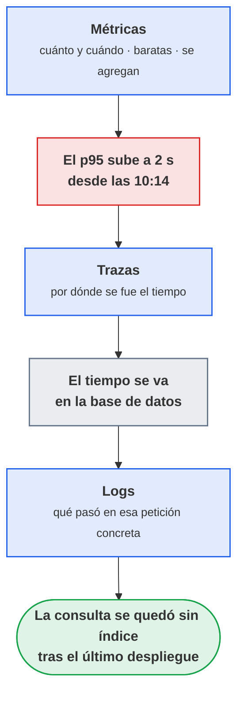
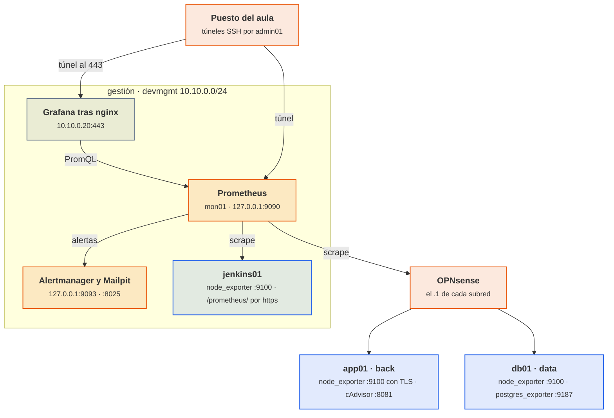
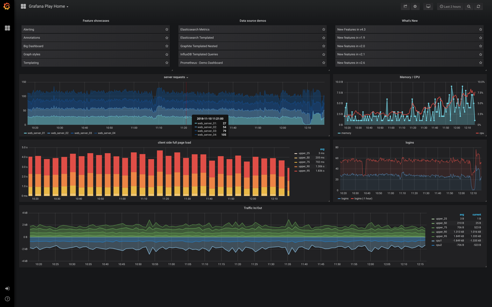

# UT7 · Monitorización del entorno

<p class="ut-meta">4 h en el centro + 12 h en la formación en empresa · Sesiones 39 y 40 · RA4 CE i, j, k</p>

Última unidad del centro. En la UT6 quedó Jenkins construyendo y desplegando el servicio, pero sin nadie que mire si de verdad funciona. Ahora toca cerrar el círculo: una plataforma que no se vigila no está desplegada, está abandonada. La pila de monitorización ya existe: Prometheus, Alertmanager y Grafana corren en la VM `mon01` desde octubre, montados y asegurados en el módulo 5169. Esta unidad no levanta otra. Trabaja sobre esa misma pila y en el mismo repositorio `monitoring`, y le añade lo que es propio del despliegue: la elección justificada del gestor de ingesta, los targets generados con Ansible desde el inventario, las métricas del orquestador de integración continua, el panel de KPI de la plataforma con sus alertas y la seguridad de todo lo que se añade. Son dos sesiones, la 39 (12 de marzo) y la 40 (17 de marzo). La práctica evaluable no tiene sesión propia: recoge lo que dejan las dos hojas y se entrega por Aules antes del examen de la segunda evaluación, el 24 de marzo de 2027 (sesión 41), que entra UT5, UT6 y UT7. Las 12 horas de monitorización avanzada se hacen en la empresa. Los logs quedan para el módulo 5169.

!!! otra "Cómo se reparte la monitorización entre las dos asignaturas"
    El módulo 5169 ya ha explicado a fondo el instrumental: PromQL y las ventanas de `rate` en su [UT2, sesión 8 del 29 de octubre](https://victor-educ.github.io/apuntes-5169/ut/ut2-alarmas/#rate-increase-y-la-ventana); las [reglas de grabación](https://victor-educ.github.io/apuntes-5169/ut/ut2-alarmas/#agregacion-y-correlacion-recording-rules) el 5 de noviembre y las [reglas de alerta](https://victor-educ.github.io/apuntes-5169/ut/ut2-alarmas/#reglas-de-alerta) el 10; [Alertmanager entero](https://victor-educ.github.io/apuntes-5169/ut/ut2-alarmas/#alertmanager) el 12; Grafana desde su [UT1](https://victor-educ.github.io/apuntes-5169/ut/ut1-observabilidad/); la [seguridad de la pila](https://victor-educ.github.io/apuntes-5169/ut/ut3-seguridad-monitorizacion/) entre el 26 de noviembre y el 3 de diciembre; y los [indicadores SLI, SLO y presupuesto de error](https://victor-educ.github.io/apuntes-5169/ut/ut4-kpi-pruebas/#indicadores-formulas-y-umbrales) el 17 de diciembre.
    Aquí todo eso es repaso: cada apartado abre con el enlace a la sesión donde se explicó y deja solo lo que su hoja de práctica necesita.
    Lo propio de esta unidad, y lo que se evalúa en ella, es el despliegue: elegir el gestor de ingesta y justificarlo, sacar los targets del inventario de Ansible con `file_sd`, recoger las métricas del orquestador de integración continua, construir el panel y las alertas de la plataforma, y asegurar lo que se añade a la pila (el endpoint de métricas de Jenkins y los secretos del repositorio).

## Introducción

Esta unidad se lee en el orden en que se da: primero los conceptos y el plan, y después cada sesión con la teoría que se explica en clase seguida de su hoja de práctica. Los apartados que van más allá de lo que se hace en el aula están en la página Para ampliar.

### Qué tienes que saber hacer al terminar

- Elegir un gestor de ingesta con criterio y justificar por qué Prometheus encaja en un entorno de contenedores; recolectar métricas de hosts (node_exporter), de contenedores (cAdvisor) y del orquestador de integración continua (plugin de Jenkins) con targets que salen del inventario de Ansible, e interpretar qué dicen esas métricas sobre la salud de la CI (CE 4i).
- Llevar las consultas PromQL de los KPI de la plataforma a un panel de Grafana con unidades y umbrales guardado en Git, y escribir reglas de alerta que Alertmanager entrega por correo (CE 4j).
- Asegurar lo que la unidad añade a la pila (métricas del orquestador solo para `mon01`, secretos fuera del repositorio) y comprobar que lo que dejó el módulo 5169 sigue activo (CE 4k).

### Los conceptos de la unidad

El problema: el jueves a las tres de la tarde el disco de `db01` se llena, PostgreSQL deja de aceptar escrituras, la API de `app01` devuelve errores 500 y nadie se entera hasta que el viernes un usuario escribe quejándose. La plataforma está desplegada, configurada y alimentada por Jenkins, pero nadie la mira. Lo que se busca al terminar es que un programa mire por su cuenta: que lea cada 15 segundos cómo están hosts, contenedores y Jenkins, que lo dibuje en un panel que se entiende de un vistazo y que, cuando algo se tuerza, un correo o un Telegram llegue antes que la queja.

| Herramienta o concepto | Qué es, en una frase | Para qué se usa en esta unidad |
|----|----|----|
| Prometheus | Servidor que pasa lista cada 15 segundos a cada máquina y guarda sus números con fecha y hora | Recoger y almacenar las métricas del entorno |
| Exporter (node_exporter, cAdvisor, plugin de Jenkins) | Programa que traduce el estado de algo a una página de texto que Prometheus sabe leer | Uno por cada cosa vigilada |
| PromQL | Lenguaje de consulta de Prometheus, el SQL de las series temporales | Calcular los KPI, los paneles y las reglas de alerta |
| Reglas de alerta | Fichero YAML que dice "si esta consulta da cierto durante tanto tiempo, avisa" | Detectar que Jenkins se cae o que fallan las ejecuciones |
| Alertmanager | Recibe las alertas de Prometheus y decide a quién avisar, por dónde y cuándo callar | El de la pila de 5169 entrega las alertas de esta unidad sin tocar su configuración |
| Grafana | Interfaz web que dibuja consultas en paneles | El panel de KPI de la plataforma, exportado a JSON y guardado en Git |
| Mailpit | Correo falso con interfaz web, dentro de la pila | Ver las notificaciones sin SMTP real |
| file_sd | Prometheus lee la lista de máquinas a vigilar de un fichero que escribe otro programa (Ansible) | Que los targets salgan del inventario y no se editen a mano |
| Túnel SSH | Una conexión SSH que lleva un puerto de `mon01` hasta el puesto | Llegar a Prometheus, Alertmanager y Mailpit, que desde diciembre solo escuchan en `127.0.0.1` de `mon01` |

Cómo está organizada la unidad: sigue las sesiones en orden, y cada sesión trae primero la teoría que se explica y después su hoja de práctica. En la sesión 39 se justifica la elección de Prometheus, se ve cómo es la pila de `mon01` y qué le añade la unidad, y se conectan a ella los targets que genera Ansible y las métricas de Jenkins: al acabar, todos los targets de dev están en UP. En la sesión 40 se explotan esos datos: el repaso de lo que el módulo 5169 ya explicó se lee antes de clase, y la explicación son diez minutos para las métricas del propio orquestador y diez para la seguridad de lo que se ha añadido; después, el panel de KPI de la plataforma, las reglas propias hasta ver llegar un correo y el cierre del endpoint de métricas de Jenkins. La [práctica evaluable](#practica-evaluable) recoge lo que dejan las dos hojas y se entrega por Aules antes del examen del 24 de marzo. Las 12 horas de monitorización avanzada se hacen en la formación en empresa; su programa y sus evidencias están en [En la empresa: monitorización avanzada](../ampliacion.md#en-la-empresa-monitorizacion-avanzada), junto con el apartado de [retención y almacenamiento](../ampliacion.md#retencion-y-almacenamiento) a largo plazo.

!!! otra "Dónde se usa esto en la otra asignatura"
    Quien cursa el módulo 5169 lleva desde octubre con Prometheus, Alertmanager y Grafana en `mon01`, en `/opt/monitoring`, con Loki añadido en la [UT1 Observabilidad](https://victor-educ.github.io/apuntes-5169/ut/ut1-observabilidad/), las reglas y rutas de la UT2 Alarmas y los exporters cerrados y cifrados en la [UT3](https://victor-educ.github.io/apuntes-5169/ut/ut3-seguridad-monitorizacion/). Esta unidad trabaja sobre esa misma pila y en el mismo repositorio `monitoring`, y no la para nunca: en ella viven también MinIO, con el estado de OpenTofu y las copias, y todo lo que Mantenimiento necesita hasta su examen del 23 de marzo.
    Por eso lo que se añade aquí va en ficheros propios que Mantenimiento no toca (`targets/ut7-*.yml`, `rules/ut7-*.yml`, `grafana/ut7/` y `docs/ut7.md`), y los únicos ficheros compartidos que se editan son `compose.yml`, para montar esos directorios, y `prometheus.yml`, para los jobs.
    Su [UT8 Terminación segura](https://victor-educ.github.io/apuntes-5169/ut/ut8-terminacion-segura/) se solapa con esta unidad: el 18 de marzo, al día siguiente de la segunda sesión de aquí y antes de que se cierre la entrega, retira de la pila los targets, las reglas y los paneles del entorno `pre`. Lo que se retira allí lleva la etiqueta `env="pre"`; lo que se añade aquí, `env="dev"`. Si desaparece un target, la primera pregunta es de cuál de los dos era.
    Cada asignatura corrige su propia etiqueta de git del mismo repositorio: `entrega-5169-ut8` la de Mantenimiento y `entrega-5166-ut7` la de esta unidad. Los apuntes de 5169 son públicos y los enlaces de esta unidad llevan al apartado concreto donde cada cosa está explicada entera.

### Plan de sesiones

Cada sesión de 110 minutos empieza con una explicación corta y sigue con laboratorio. La columna «Se explica» recoge los apartados de teoría que se desarrollan en clase, con su duración aproximada; la columna «Se practica», el trabajo de laboratorio de esa sesión.

| Sesión | Fecha | Tipo | Se explica | Se practica |
|---:|-------|------|------------|-------------|
| [39](#sesion-39-ingesta-de-metricas) | 12 mar | Teoría y práctica | Métricas, logs y trazas (5 min); elegir el gestor de ingesta y el modelo pull (5 min); la pila del curso en mon01 y lo que le añade la unidad (10 min). | Targets de node_exporter generados con Ansible desde el inventario, plugin de Jenkins con su versión y su job; todos los targets de dev en UP, una consulta por fuente y la justificación del gestor de ingesta. |
| [40](#sesion-40-visualizacion-alertas-y-seguridad) | 17 mar | Teoría y práctica | Métricas del orquestador de CI (10 min); seguridad de lo que añade la unidad (10 min). El repaso de PromQL, reglas, Alertmanager y Grafana se lee antes de clase. | Panel de KPI de la plataforma con tres paneles en Git, reglas propias y la alerta JenkinsDown en Mailpit; métricas de Jenkins solo para mon01, comprobación de lo que dejó Mantenimiento y repositorio sin secretos con su etiqueta de entrega. |

La [práctica evaluable](#practica-evaluable) no tiene sesión propia: sale de pasos obligatorios de las dos hojas y se entrega por Aules antes del examen del 24 de marzo.

## Sesión 39 · Ingesta de métricas

<p class="ut-meta" markdown>12 de marzo · Teoría y práctica · <span class="dur" tabindex="0" aria-label="Monitorización y observabilidad · 5 min&#10;Elegir el gestor de ingesta · 5 min&#10;La pila del curso en mon01 · 10 min&#10;A7.1 Ingesta · 90 min" data-dur="Monitorización y observabilidad · 5 min&#10;Elegir el gestor de ingesta · 5 min&#10;La pila del curso en mon01 · 10 min&#10;A7.1 Ingesta · 90 min">:material-school:<i class="dur-barra" style="--teoria:18%"></i>:material-flask:</span></p>

Al terminar la sesión, Prometheus lee de node_exporter en las cuatro máquinas de dev con targets que genera Ansible desde el inventario, de cAdvisor en `app01` y del plugin de Jenkins, con todos los targets de dev en UP y una consulta con datos por cada fuente. En clase se explican los tres apartados siguientes: qué son métricas, logs y trazas, por qué se elige Prometheus frente a las otras opciones (esa justificación se escribe en la hoja) y cómo es la pila del curso con lo que esta unidad le añade. Después va [Descubrimiento de targets](#descubrimiento-de-targets), material de consulta con los tres ficheros que copia la hoja A7.1. El formato de `/metrics`, los tipos de métrica y la cardinalidad son repaso del módulo 5169.

### Monitorización y observabilidad

Monitorizar es recoger datos del sistema de forma continua para saber si funciona y avisar cuando deja de hacerlo. La palabra observabilidad, más frecuente en la empresa, va un paso más allá: poder preguntarle al sistema por qué va mal sin desplegar código nuevo para averiguarlo. Se apoya en tres tipos de datos, los llamados tres pilares:

- **Métricas**: números en el tiempo (CPU, memoria, peticiones por segundo, latencia). Ocupan poco (un par de bytes por muestra comprimida), se agregan bien y son la base de gráficos y alertas. Responden a "cuánto" y "cuándo".
- **Logs**: líneas de texto de lo que pasó, con marca de tiempo. Caras de guardar y buscar a gran volumen, pero son lo único que dice "qué" pasó en una petición concreta. Para diagnosticar.
- **Trazas**: recorrido de una petición por varios servicios, con el tiempo en cada uno. Para sistemas distribuidos donde una petición toca cinco microservicios y hay que saber cuál añadió los 800 ms.

Cómo se combinan: una alerta de métricas dice que el p95 de latencia ha subido de 200 ms a 2 s desde las 10:14; las trazas dicen que el tiempo se va en la base de datos; los logs de PostgreSQL enseñan la consulta que se quedó sin índice tras el último despliegue. En esta UT el foco está en el primer pilar, el más barato y el que sostiene las alertas. Logs en el 5169; trazas (OpenTelemetry, Tempo, Jaeger) solo como mención.


```mermaid
flowchart TB
    M["<b>Métricas</b><br><small>cuánto y cuándo · baratas · se agregan</small>"]:::dato
    T["<b>Trazas</b><br><small>por dónde se fue el tiempo</small>"]:::dato
    L["<b>Logs</b><br><small>qué pasó en esa petición concreta</small>"]:::dato
    P1["<b>El p95 sube a 2 s<br>desde las 10:14</b>"]:::riesgo
    P2["<b>El tiempo se va<br>en la base de datos</b>"]:::pieza
    P3(["<b>La consulta se quedó sin índice<br>tras el último despliegue</b>"]):::ok
    M --> P1 --> T
    T --> P2 --> L
    L --> P3
    classDef act fill:#ea580c22,stroke:#ea580c,stroke-width:1.5px
    classDef pieza fill:#64748b22,stroke:#64748b,stroke-width:1.5px
    classDef dato fill:#2563eb22,stroke:#2563eb,stroke-width:1.5px
    classDef infra fill:#a1a1aa14,stroke:#a1a1aa,stroke-width:1.5px
    classDef ok fill:#16a34a22,stroke:#16a34a,stroke-width:1.5px
    classDef riesgo fill:#dc262622,stroke:#dc2626,stroke-width:1.5px
```

<p class="pie" markdown>Cada pilar responde a una pregunta distinta y ninguno sirve solo. La alerta avisa, la traza localiza y el log explica.</p>


| Término | Qué es |
|----|----|
| Exporter | Programa que expone métricas de algo (el sistema, Docker, una BD) en formato Prometheus |
| Scrape | Lectura periódica que Prometheus hace de cada exporter |
| Target | Cada endpoint concreto que Prometheus lee (host:puerto/ruta) |
| Serie temporal | Una métrica con sus etiquetas (`node_cpu_seconds_total{cpu="0",mode="idle"}`) |
| Muestra (sample) | Un valor con su marca de tiempo dentro de una serie |
| KPI | Indicador clave: la métrica o fórmula que resume si el servicio va bien (disponibilidad, latencia p95, errores por minuto) |
| Umbral | Valor a partir del cual una métrica se considera anómala |
| Alerta | Regla que se activa cuando un umbral se supera durante un tiempo |

### Elegir el gestor de ingesta

Antes de instalar nada hay que decidir con qué se recogen los datos, y esa decisión se pide justificada en la práctica. No hay una herramienta mejor en abstracto: depende de qué hay que vigilar (contenedores, servidores físicos, un servicio de nube) y de quién lo mantiene. La tabla resume las cuatro opciones más habituales en las empresas.

|  | Prometheus + Grafana | Zabbix | Elastic (ELK) / OpenSearch | Servicios en nube (CloudWatch, Azure Monitor) |
|----|----|----|----|----|
| Modelo | Pull: Prometheus lee a los exporters | Agente que envía | Logs y métricas por Beats | Integrado en la plataforma |
| Punto fuerte | Estándar en contenedores y Kubernetes; PromQL | Todo en uno, plantillas para hardware | Logs | Sin instalar nada |
| Punto débil | Retención larga requiere Thanos/Mimir | Menos natural con contenedores | Pesado | Coste y dependencia |

Criterio (CE 4i): **recolectar** de todo el entorno (hosts, contenedores, orquestador) y **visualizar**. Prometheus + Grafana cumple ambas y es el estándar en contenedores: cualquier imagen seria (nginx, PostgreSQL, Traefik, Jenkins, el propio Docker) expone métricas en su formato o tiene un exporter mantenido. Zabbix sigue siendo razonable en un centro de datos clásico con switches, sistemas de alimentación ininterrumpida y servidores físicos, y conviene no descartarlo si la empresa ya lo tiene. Los servicios de nube son cómodos hasta que llega la factura.

#### Pull frente a push, y cuándo usar Pushgateway

Prometheus va a buscar los datos (pull): cada `scrape_interval` hace un GET a `/metrics` de cada target y guarda lo que le devuelven. Consecuencias prácticas:

- Si un target no responde, Prometheus lo sabe en el acto (`up == 0`). En un modelo push, un agente muerto deja de enviar y nadie se entera hasta que alguien mira.
- Desde `mon01` se puede pedir con `curl` el `/metrics` de un exporter y ver exactamente lo que Prometheus ve.
- Qué se vigila está en un solo sitio (`prometheus.yml`), no repartido en cien agentes, y el exporter no necesita credenciales ni saber dónde está el servidor.

La pega: Prometheus tiene que llegar por red a cada target, lo que obliga a abrir puertos (y a protegerlos). Y hay cosas que no se pueden leer: un trabajo de cron que dura 20 segundos no está vivo cuando Prometheus pasa a preguntar. Para eso existe **Pushgateway**: el trabajo empuja sus métricas (`curl --data-binary @- http://pushgateway:9091/metrics/job/backup/instance/db01`) y Prometheus lee del gateway como de un exporter más. Solo para lotes cortos: usarlo como buzón general es un error clásico, porque el gateway nunca olvida (la métrica de un host que ya no existe sigue ahí) y se pierde la detección de caída por `up`.

<figure markdown="span">
  { width="640" }
  <figcaption>Arquitectura de Prometheus: el servidor lee de los exporters y de Pushgateway, evalúa reglas, envía a Alertmanager y sirve datos a Grafana. Fuente: Proyecto Prometheus, Apache 2.0.</figcaption>
</figure>

### La pila del curso en mon01

La pila ya existe y no se vuelve a montar. El módulo 5169 la levantó en octubre en `mon01` (`10.10.0.20`, en la VNet `devmgmt`), en `/opt/monitoring`, que es la copia de trabajo del repositorio `monitoring`, y la cerró en su UT3: Prometheus, Alertmanager y Mailpit escuchan solo en `127.0.0.1` de `mon01`, Grafana está detrás de un nginx en `10.10.0.20:443` y Loki pide certificado de cliente. En el mismo compose corre MinIO, con el estado de OpenTofu y las copias. Por eso en esta unidad nunca se hace `docker compose down`: se añaden ficheros propios y, como mucho, se recrea un solo servicio.

!!! otra "Repaso"
    Cómo se montó la pila y qué hace cada contenedor está en la [UT1 de Mantenimiento](https://victor-educ.github.io/apuntes-5169/ut/ut1-observabilidad/), que explica también el formato de `/metrics`, los cuatro tipos de métrica y la cardinalidad; cómo se cerró, en su [UT3](https://victor-educ.github.io/apuntes-5169/ut/ut3-seguridad-monitorizacion/). Lo que esos temas tienen de propio del despliegue está en Para ampliar: [la pila en un solo compose](../ampliacion.md#la-pila-en-un-solo-compose), [el formato de exposición](../ampliacion.md#el-formato-de-exposicion), [el modelo de datos y la cardinalidad](../ampliacion.md#modelo-de-datos-y-cardinalidad) y [los exporters más habituales](../ampliacion.md#exporters-mas-habituales).

A la pila se llega por túnel SSH desde el puesto del aula, con el puesto de administración como salto. `ssh -L 9090:127.0.0.1:9090 -L 9093:127.0.0.1:9093 -L 8025:127.0.0.1:8025 -J ops@<IP de aula de admin01> ops@10.10.0.20` deja Prometheus en `http://localhost:9090`, Alertmanager en el 9093 y Mailpit en el 8025 mientras esa sesión siga abierta. Grafana va por otro túnel al 443, `ssh -L 8443:10.10.0.20:443 ops@<IP de aula de admin01>`, con la línea `127.0.0.1 grafana.lab` en el fichero hosts del puesto y la CA del curso importada en el navegador: queda en `https://grafana.lab:8443`. Desde una shell en `mon01`, `curl http://localhost:9090/...` llega directo, y `amtool` se usa con `docker compose exec alertmanager`. Las órdenes completas están en el [laboratorio de Mantenimiento](https://victor-educ.github.io/apuntes-5169/laboratorio/).

Los hosts vigilados no comparten red con `mon01`, salvo `jenkins01`: `app01` vive en `devback` (`10.10.2.10`) y `db01` en `devdata` (`10.10.3.10`), cada uno con una sola tarjeta, así que su scrape sale de gestión y **atraviesa el cortafuegos** con las reglas que abrió la UT3 de Mantenimiento. Lo que ya se lee y lo que añade esta unidad:

- **node_exporter** (puerto 9100) viene en la plantilla 9000 desde la A1.3: todas las VM llevan el paquete `prometheus-node-exporter` y no se instala nada. Lo que cambia es de dónde sale la lista de targets, como se explica a continuación.
- **cAdvisor** (`app01`, 8081) y **postgres_exporter** (`db01`, 9187) ya los lee la pila de Mantenimiento con sus jobs. No se tocan.
- **Jenkins** expone `/prometheus/` con el plugin **Prometheus metrics**, que en la UT6 no se instaló: se añade en esta unidad al `plugins.txt` de la imagen propia con su versión fijada (`id:version`, como el resto del fichero). Como Jenkins va detrás de su nginx, la ruta es `https://jenkins.lab/prometheus/` y el 8080 del contenedor no se publica. El plugin antepone el prefijo `default_` a los nombres.

`static_configs` obliga a editar `prometheus.yml` cada vez que nace o muere una máquina. Con **file_sd_configs**, Prometheus vigila uno o varios ficheros YAML y recarga los targets cuando cambian, sin reiniciar ni señal; quien escribe esos ficheros es Ansible, desde el mismo inventario con el que se configuran las máquinas, y así la lista de lo vigilado no se desincroniza de lo desplegado. En el laboratorio son dos ficheros, `targets/ut7-node.yml` y `targets/ut7-node-tls.yml`, y dos jobs: `node` por HTTP y `node-tls` para `app01`, el único cuyo exporter cifró de forma obligatoria la UT3 de Mantenimiento. Los ficheros completos están en [Descubrimiento de targets](#descubrimiento-de-targets).

Para que Prometheus vea esos ficheros, y las reglas propias de la sesión 40, su servicio del `compose.yml` gana dos volúmenes. Es el único cambio en el compose de toda la unidad:

```yaml
# /opt/monitoring/compose.yml, servicio prometheus: dos líneas más en volumes
    volumes:
      # ... los que ya tenía, sin tocarlos
      - ./targets:/etc/prometheus/targets:ro
      - ./rules:/etc/prometheus/rules:ro
```

Se aplica con `docker compose up -d --no-deps prometheus`, que recrea solo ese contenedor: el histórico sigue en su volumen y el resto de la pila, MinIO incluido, no se entera.


```mermaid
flowchart TB
    OPS["<b>Puesto del aula</b><br><small>túneles SSH por admin01</small>"]:::act
    subgraph gestion["gestión · devmgmt 10.10.0.0/24"]
        P["<b>Prometheus</b><br><small>mon01 · 127.0.0.1:9090</small>"]:::act
        AM["<b>Alertmanager y Mailpit</b><br><small>127.0.0.1:9093 · :8025</small>"]:::act
        G["<b>Grafana tras nginx</b><br><small>10.10.0.20:443</small>"]:::pieza
        J["<b>jenkins01</b><br><small>node_exporter :9100 · /prometheus/ por https</small>"]:::dato
    end
    FW["<b>OPNsense</b><br><small>el .1 de cada subred</small>"]:::act
    A["<b>app01 · back</b><br><small>node_exporter :9100 con TLS · cAdvisor :8081</small>"]:::dato
    D["<b>db01 · data</b><br><small>node_exporter :9100 · postgres_exporter :9187</small>"]:::dato
    P -- scrape --> J
    P -- scrape --> FW
    FW --> A
    FW --> D
    P -- alertas --> AM
    G -- PromQL --> P
    OPS -- túnel --> P
    OPS -- túnel al 443 --> G
    classDef act fill:#ea580c22,stroke:#ea580c,stroke-width:1.5px
    classDef pieza fill:#64748b22,stroke:#64748b,stroke-width:1.5px
    classDef dato fill:#2563eb22,stroke:#2563eb,stroke-width:1.5px
```

<p class="pie" markdown>Prometheus va a buscar (*pull*): los scrapes salen de gestión hacia `app01` y `db01` atravesando el cortafuegos, y hacia `jenkins01` sin pasar por él, porque está en la misma subred; por eso en `jenkins01` el filtro va en el propio host. Desde el puesto solo se llega a la pila por túnel o por el 443 de Grafana.</p>

### Descubrimiento de targets

!!! consulta "Material de consulta"
    Esto no se explica en clase más allá de lo dicho en el apartado anterior: son los tres ficheros que la hoja A7.1 copia tal cual.

El inventario de dev vive en el repositorio `iac-lab` del puesto de administración. Los grupos dan la etiqueta `rol` y la variable `node_tls` marca el único exporter cifrado. `web01` no está porque la matriz de reglas no deja a `mon01` llegar a front:

```ini
# iac-lab/ansible/dev.ini: las máquinas de dev que vigila Prometheus
[gestion]
mon01     ansible_host=10.10.0.20

[ci]
jenkins01 ansible_host=10.10.0.10

[servicio]
app01     ansible_host=10.10.2.10 node_tls=true
db01      ansible_host=10.10.3.10

[all:vars]
ansible_user=ops
```

El playbook solo se conecta a `mon01`: de las demás máquinas le basta lo que dice el inventario. Crea el directorio `targets/` si no existe y escribe en él un fichero para los exporters por HTTP y otro para los cifrados:

```yaml
# iac-lab/ansible/ut7-targets.yml: escribe los targets de node_exporter en mon01
- name: Targets de Prometheus desde el inventario
  hosts: mon01
  become: true
  tasks:
    - name: Directorio de targets en la copia de trabajo de monitoring
      ansible.builtin.file: { path: /opt/monitoring/targets, state: directory, owner: ops, group: ops, mode: "0755" }
    - name: Un fichero para los exporters por HTTP y otro para los cifrados
      ansible.builtin.copy:
        dest: "/opt/monitoring/targets/ut7-{{ item.fichero }}.yml"
        owner: ops
        group: ops
        mode: "0644"
        content: |
          # Generado por ansible/ut7-targets.yml de iac-lab. No se edita a mano.
          
          - targets: ["{{ hostvars[h].ansible_host }}:9100"]
            labels: { host: {{ h }}, env: dev, rol: {{ hostvars[h].group_names | first }} }
          
      loop:
        - { fichero: node, tls: false }
        - { fichero: node-tls, tls: true }
```

En `prometheus.yml`, los jobs de node_exporter de dev leen esos ficheros, y se añade el de Jenkins:

```yaml
# prometheus.yml: jobs de esta unidad (sustituyen a los static_configs de dev de node_exporter)
  - job_name: node
    file_sd_configs:
      - files: [/etc/prometheus/targets/ut7-node.yml]
        refresh_interval: 1m
  - job_name: node-tls
    scheme: https
    tls_config:
      ca_file: /etc/prometheus/tls/ca.crt
    basic_auth:
      username: prometheus
      password_file: /etc/prometheus/secrets/node_exporter.pass
    file_sd_configs:
      - files: [/etc/prometheus/targets/ut7-node-tls.yml]
        refresh_interval: 1m
  - job_name: jenkins
    scheme: https                      # Jenkins solo se publica por su nginx, en el 443
    metrics_path: /prometheus/
    tls_config: { ca_file: /etc/prometheus/tls/ca.crt }
    static_configs:
      - targets: ["jenkins.lab:443"]
        labels: { host: jenkins01, env: dev, service: jenkins }
```

El `tls_config` y el `basic_auth` de `node-tls` son los que dejó la A3.2 de Mantenimiento, con la contraseña en un fichero fuera del repositorio y la CA del curso montada en `/etc/prometheus/tls/`; aquí solo cambia de dónde sale el target, y el job `jenkins` reutiliza esa misma CA porque el certificado de `jenkins.lab` lo firmó ella. Las etiquetas que pone el fichero de targets (`host`, `env`, `rol`) acaban en todas las series de esos hosts: sirven para filtrar en las consultas (`env="dev"` separa lo de esta unidad de lo que retira la UT8 de Mantenimiento) y para enrutar alertas. Prometheus también sabe descubrir contenedores preguntando al socket de Docker (`docker_sd_configs`); en el laboratorio se usa `file_sd`, y la alternativa está en [Para ampliar](../ampliacion.md#descubrimiento-con-docker_sd_configs).

### A7.1 Ingesta (sesión 39)

<span class="et et-obj">Objetivo</span> Al terminar, los targets de node_exporter de dev salen de unos ficheros que genera Ansible desde el inventario, Prometheus lee además cAdvisor y las métricas de Jenkins, todos los targets de dev están en UP, hay una consulta con datos por cada fuente y la elección del gestor de ingesta queda justificada por escrito.

<span class="et et-pre">Antes de empezar</span>

- Encendidas `mon01` (`10.10.0.20`), `jenkins01` (`10.10.0.10`), `app01` (`10.10.2.10`), `db01` (`10.10.3.10`) y el puesto de administración (`10.10.0.50`), con Jenkins arrancado. node_exporter ya corre en todas porque viene en la plantilla, y no hay que instalarlo en ninguna.
- La pila de Mantenimiento en marcha en `/opt/monitoring` de `mon01`, que es la copia de trabajo del repositorio `monitoring`. No la pares en ningún momento: en ella viven también MinIO y lo que la UT8 de Mantenimiento necesita hasta el 23 de marzo.
- El túnel a Prometheus, Alertmanager y Mailpit abierto desde el puesto del aula, con la orden de [La pila del curso en mon01](#la-pila-del-curso-en-mon01), y `http://localhost:9090` respondiendo en el navegador. Deja esa terminal abierta toda la sesión.
- `jenkins.lab` en el DNS de OPNsense desde la A6.1, que es el que usa el contenedor de Prometheus (no lee el `/etc/hosts` de `mon01`). Compruébalo en `mon01`: `cd /opt/monitoring && docker compose exec prometheus nslookup jenkins.lab` devuelve `10.10.0.10`; si no, dalo de alta en OPNsense (Services → Dnsmasq DHCP & DNS → Hosts, como en la A6.1).
- Explicado en clase: [Elegir el gestor de ingesta](#elegir-el-gestor-de-ingesta) y [La pila del curso en mon01](#la-pila-del-curso-en-mon01). Para copiar durante la práctica: los tres bloques de [Descubrimiento de targets](#descubrimiento-de-targets).

<span class="et et-pas">Pasos</span>

1. Empieza por lo que más tarda. En `jenkins01`, añade el plugin **Prometheus metrics** a la imagen propia de `jenkins-config`, con su versión fijada como el resto del fichero (mírala ese día en plugins.jenkins.io), haz ya el commit y lanza la reconstrucción; si tu `plugins.txt` ya lo lleva, salta al paso 2. La reconstrucción descarga el plugin y sus dependencias: déjala corriendo y sigue con el paso 2.

    ```bash
    cd ~/jenkins-config
    echo 'prometheus:<versión>' >> plugins.txt
    git add plugins.txt && git commit -m "UT7: plugin Prometheus metrics" && git push
    docker compose up -d --build
    ```

2. En el puesto de administración, genera los targets desde el inventario. En `iac-lab`, copia `ansible/dev.ini` y `ansible/ut7-targets.yml` de [Descubrimiento de targets](#descubrimiento-de-targets) tal cual, ejecuta el playbook y haz commit de los dos ficheros:

    ```bash
    cd ~/iac-lab
    ansible-playbook -i ansible/dev.ini ansible/ut7-targets.yml
    git add ansible/dev.ini ansible/ut7-targets.yml && git commit -m "UT7: targets de Prometheus" && git push
    ```

    El playbook crea `/opt/monitoring/targets/` en `mon01` y deja en él dos ficheros: `ut7-node.yml`, con `mon01`, `jenkins01` y `db01`, y `ut7-node-tls.yml`, solo con `app01`.

3. En `mon01`, prepara la pila para leer los ficheros de esta unidad: crea el resto de sus directorios, añade al servicio `prometheus` del `compose.yml` las dos líneas de volumen de [La pila del curso en mon01](#la-pila-del-curso-en-mon01) y recrea solo ese servicio.

    ```bash
    cd /opt/monitoring
    mkdir -p rules grafana/ut7 docs
    # aquí, las dos líneas de volumen en compose.yml; después:
    docker compose up -d --no-deps prometheus
    ```

4. En `mon01`, cambia en `prometheus.yml` los jobs de node_exporter de dev por los del último bloque de [Descubrimiento de targets](#descubrimiento-de-targets):

    - el job `node` pasa de `static_configs` a `file_sd_configs`; si tiene además un grupo con `env: pre`, déjalo, que lo retira la UT8 de Mantenimiento el 18 de marzo;
    - el job `node-tls` que dejó la A3.2 de Mantenimiento cambia su `static_configs` por el `file_sd_configs` de `ut7-node-tls.yml` y conserva el `scheme`, el `tls_config` y el `basic_auth` que ya tenía;
    - el job `jenkins` se copia tal cual.

    Valida y recarga sin reiniciar:

    ```bash
    docker compose exec prometheus promtool check config /etc/prometheus/prometheus.yml
    curl -X POST http://localhost:9090/-/reload
    ```

5. En `http://localhost:9090/targets`, por el túnel, espera un minuto (el `refresh_interval` de `file_sd`) y comprueba que los targets de dev de `node`, `node-tls`, `cadvisor` y `jenkins` están en UP. Los que lleven `env="pre"` pueden salir en DOWN: pre se destruyó el 11 de marzo y no cuentan. Si alguno de dev está en DOWN, el error de esa fila y [Errores frecuentes](#errores-frecuentes-en-el-laboratorio) te dicen dónde mirar; si es el de `jenkins`, mira antes si la reconstrucción del paso 1 ha terminado.
6. En la pestaña Graph comprueba que llegan datos de las tres fuentes con una consulta por fuente, y captura el resultado de cada una:

    | Fuente | Consulta |
    |----|----|
    | Hosts: CPU usada (%) | `100 - avg by (host) (rate(node_cpu_seconds_total{mode="idle",env="dev"}[5m])) * 100` |
    | Contenedor de la API: memoria | `container_memory_working_set_bytes{service="app"}` |
    | Orquestador: ejecuciones correctas | `default_jenkins_builds_success_build_count` |

7. Justifica la elección del gestor de ingesta en `docs/ut7.md`, un fichero nuevo del repositorio `monitoring` que es solo de esta unidad: de cinco a diez líneas con los dos criterios del CE 4i (recolectar de hosts, contenedores y orquestador, y visualizar), por qué Prometheus los cumple en este entorno y en qué caso elegirías Zabbix o un servicio de nube. Sale de la tabla de [Elegir el gestor de ingesta](#elegir-el-gestor-de-ingesta).
8. Haz commit en `/opt/monitoring` de `compose.yml`, `prometheus.yml`, `targets/` y `docs/ut7.md`, y súbelo con `git push`. Los ficheros de `targets/` se versionan porque son lo desplegado, pero no se editan a mano: si cambia el inventario, se vuelve a lanzar el playbook.

<span class="et et-com">Comprobación</span> En `http://localhost:9090/targets`, los jobs `node`, `node-tls`, `cadvisor` y `jenkins` sin ninguna fila de dev en DOWN, y la fila de `app01` en `node-tls` con un endpoint que empieza por `https://`. En Graph, `up{rol="ci"}` devuelve una serie, la de `jenkins01`, y las tres consultas del paso 6 devuelven datos. Los ficheros de `targets/` empiezan por la línea que dice que los genera Ansible.

<span class="et et-ent">Entrega</span> En una carpeta `A7.1` de Aules: captura de la página Targets con los jobs de dev en UP, las capturas de las tres consultas y el enlace al commit de `monitoring` con `targets/`, `prometheus.yml` y `docs/ut7.md`. Todo ello va después a la práctica evaluable.

<span class="et et-ext">Si te sobra tiempo</span> Lanza en Jenkins un job que falle a propósito y mira subir `increase(default_jenkins_builds_failed_build_count[1h])`, que es la consulta del panel de la sesión 40. Abre Status → TSDB Status y anota qué métrica tiene más series y por qué; lo que significa ese número está en [el modelo de datos y la cardinalidad](../ampliacion.md#modelo-de-datos-y-cardinalidad).

## Sesión 40 · Visualización, alertas y seguridad

<p class="ut-meta" markdown>17 de marzo · Teoría y práctica · <span class="dur" tabindex="0" aria-label="Métricas del orquestador: Jenkins en Prometheus · 10 min&#10;Seguridad de lo que añade la unidad · 10 min&#10;A7.2 Paneles, alertas y seguridad · 90 min" data-dur="Métricas del orquestador: Jenkins en Prometheus · 10 min&#10;Seguridad de lo que añade la unidad · 10 min&#10;A7.2 Paneles, alertas y seguridad · 90 min">:material-school:<i class="dur-barra" style="--teoria:18%"></i>:material-flask:</span></p>

Con los datos ya en Prometheus, esta sesión los convierte en un panel y en avisos, y asegura lo que la unidad ha añadido a la pila. El repaso de lo que el módulo 5169 explicó a fondo entre octubre y diciembre (PromQL, reglas, Alertmanager y Grafana) se lee antes de la sesión y no ocupa minutos de clase: recoge solo lo que la hoja A7.2 necesita, con el enlace al apartado donde está entero, y las consultas y el fichero de reglas que se copian van a continuación como material de consulta. La explicación son veinte minutos. Diez van a lo que aquel módulo no toca: qué publica el orquestador de integración continua y qué dicen esos números sobre la salud de la CI. Los otros diez, a la seguridad de lo nuevo: el endpoint de métricas de Jenkins, el exporter de `jenkins01` y los secretos del repositorio.

### Repaso: PromQL, reglas, Alertmanager y Grafana

!!! otra "Repaso"
    PromQL se explicó a fondo en la [UT2 de Mantenimiento, sesión 8 del 29 de octubre](https://victor-educ.github.io/apuntes-5169/ut/ut2-alarmas/#rate-increase-y-la-ventana): selectores, `rate`, `increase`, cómo se elige la ventana y los operadores con etiquetas. Las [reglas de grabación](https://victor-educ.github.io/apuntes-5169/ut/ut2-alarmas/#agregacion-y-correlacion-recording-rules) se trabajaron el 5 de noviembre, las [reglas de alerta](https://victor-educ.github.io/apuntes-5169/ut/ut2-alarmas/#reglas-de-alerta) el 10, con sus estados, etiquetas y anotaciones, y [Alertmanager](https://victor-educ.github.io/apuntes-5169/ut/ut2-alarmas/#alertmanager) el 12, con el [árbol de rutas](https://victor-educ.github.io/apuntes-5169/ut/ut2-alarmas/#el-arbol-de-rutas), la agrupación, la inhibición y los silencios. Grafana se usa desde la [UT1 Observabilidad](https://victor-educ.github.io/apuntes-5169/ut/ut1-observabilidad/), y sus roles y el acceso detrás de nginx se ven en la [UT3](https://victor-educ.github.io/apuntes-5169/ut/ut3-seguridad-monitorizacion/). La [chuleta de comandos de 5169](https://victor-educ.github.io/apuntes-5169/chuleta/) tiene las consultas sueltas para copiar. Este apartado se lee antes de la sesión y no ocupa minutos de clase.

De todo aquello, la hoja usa tres cosas y conviene tenerlas frescas antes de abrir Grafana.

| Lo que se usa hoy | Qué conviene recordar | Dónde aparece |
|----|----|----|
| `rate(x[5m])` e `increase(x[1h])` sobre contadores | La ventana tiene que contener al menos cuatro muestras: con scrape de 15 s, 5 m es lo habitual. `irate` sirve para mirar picos, no para alertar | Panel de ejecuciones fallidas y alerta `JenkinsBuildsFailing` |
| Comparaciones con y sin `bool` | `up == 0` filtra y devuelve solo las series que valen cero; `up == bool 0` devuelve 1 o 0 en todas, que es lo que permite sumarlas: `sum(up == bool 0)`. `count(up == bool 0)` contaría todas las series, caídas o no | Panel de hosts caídos, alerta `JenkinsDown` |
| Las etiquetas de una alerta | Son lo único que mira Alertmanager para decidir a quién avisar; en la pila del curso son cinco (`severity`, `team`, `service`, `origen`, `env`) | [Reglas de esta unidad](#reglas-de-esta-unidad) |

Conviene probar cada consulta en la pestaña Graph de Prometheus antes de llevarla a un panel: lo que no devuelve nada ahí tampoco lo hará en Grafana.

Las alertas de esta unidad no tocan nada de Mantenimiento: sus reglas van en un fichero propio y las entrega el Alertmanager de la pila con su árbol de rutas de la UT2, que decide solo por las etiquetas. Una `warning` va al receptor `mail`, que entrega en Mailpit, y `amtool config routes test` dice a qué receptor iría un conjunto de etiquetas sin provocar nada. Entre el fallo y el correo pasan el `for` de la regla, la siguiente evaluación y los 30 s de `group_wait`, así que una alerta nunca llega al instante; la notificación de resolución sale con el siguiente `group_interval`, que en ese árbol es de 5 minutos.

Del panel, la hoja pide tres cosas de la interfaz. La **unidad** de cada panel (percent, bytes(IEC), seconds) hace que Grafana escale los ejes y escriba 5,73 GiB en lugar de 6.1e+09. Los **umbrales** de color dicen lo mismo que dirá la alerta: el panel de ejecuciones fallidas se pone rojo desde 4, que es cuando salta `JenkinsBuildsFailing` (más de 3 en una hora). La **leyenda** se escribe como `{{host}}` y no como la serie entera.

### Consultas, reglas y panel de la unidad

!!! consulta "Material de consulta"
    Esto no se explica en clase: son las consultas y el fichero de reglas que copia la hoja A7.2, con lo que hace falta para guardar el panel en Git.

#### Consultas del laboratorio

| Qué | Consulta |
|----|----|
| CPU usada (%) por host | `100 - avg by (host) (rate(node_cpu_seconds_total{mode="idle",env="dev"}[5m])) * 100` |
| Memoria disponible (%) | `node_memory_MemAvailable_bytes{env="dev"} / node_memory_MemTotal_bytes{env="dev"} * 100` |
| Disco libre (%) | `node_filesystem_avail_bytes{mountpoint="/",env="dev"} / node_filesystem_size_bytes{mountpoint="/",env="dev"} * 100` |
| Hosts caídos | `sum(up{job=~"node.*",env="dev"} == bool 0)` |
| CPU del contenedor de la API | `rate(container_cpu_usage_seconds_total{service="app"}[5m])` |
| Memoria del contenedor de la API | `container_memory_working_set_bytes{service="app"}` |
| Ejecuciones correctas de Jenkins | `default_jenkins_builds_success_build_count` |
| Ejecuciones fallidas de Jenkins en la última hora | `sum(increase(default_jenkins_builds_failed_build_count[1h]))` |
| Disco que se llena en 4 h | `predict_linear(node_filesystem_avail_bytes{mountpoint="/",env="dev"}[6h], 4*3600) < 0` |

Las consultas de contenedor filtran por `service="app"` y no por el nombre del contenedor, que es `servicio-app-1` y cambia si se recrea con otro proyecto. El job `cadvisor` de Mantenimiento copia en el scrape la etiqueta de compose (`container_label_com_docker_compose_service`) a `service` y descarta las demás `container_label_*`, como se explica en su [UT1](https://victor-educ.github.io/apuntes-5169/ut/ut1-observabilidad/#etiquetas-y-cardinalidad): un filtro por la etiqueta larga devuelve vacío. `rate(container_cpu_usage_seconds_total[5m])` devuelve núcleos usados (0,5 = medio núcleo), y `container_memory_working_set_bytes` es la métrica que usa el kernel para decidir a qué contenedor mata cuando falta memoria, no `container_memory_usage_bytes`, que incluye caché de página recuperable.

Los tres KPI del panel de la plataforma salen de esta tabla, uno por cada fuente que vigila la unidad: hosts caídos, memoria del contenedor de la API y ejecuciones fallidas de Jenkins. La CPU por host es el primer panel que se añade cuando sobra tiempo.

#### Reglas de esta unidad

Las reglas de Mantenimiento, entre ellas `HostDown`, viven en su repositorio `alerting` y no se tocan. Las de esta unidad van en su propio fichero, `rules/ut7-plataforma.yml`, que Prometheus carga con una entrada más en `rule_files` de `prometheus.yml` (`rules/ut7-*.yml`). Son dos, y las dos sobre el orquestador, que es lo que Mantenimiento no vigila:

```yaml
# rules/ut7-plataforma.yml
groups:
  - name: ut7-plataforma
    rules:
      - alert: JenkinsDown
        expr: up{job="jenkins"} == 0
        for: 1m
        labels: { severity: warning, team: ops, service: jenkins, origen: prometheus, env: dev }
        annotations:
          summary: "Prometheus no puede leer las métricas de Jenkins"
          description: "{{ $labels.instance }} lleva un minuto sin responder: Jenkins parado o su nginx caído."
      - alert: JenkinsBuildsFailing
        expr: sum(increase(default_jenkins_builds_failed_build_count[1h])) > 3
        for: 0m
        labels: { severity: warning, team: dev, service: jenkins, origen: prometheus, env: dev }
        annotations:
          summary: "Más de 3 ejecuciones fallidas de Jenkins en la última hora"
```

Las cinco etiquetas son las de la matriz de la UT2 de Mantenimiento; `service: jenkins` es un valor nuevo de esa matriz. El `for` evita que un reinicio de diez segundos despierte a nadie. Antes de recargar conviene validar con `promtool check config`, que revisa también los ficheros de `rule_files`: un error de sintaxis deja a Prometheus con la configuración anterior sin decir nada en la interfaz.

#### El panel en Grafana

<figure markdown="span">
  { width="640" }
  <figcaption>Un dashboard de Grafana con series temporales, gauges y stats de un host. Fuente: Joel Kennedy, dominio público, vía Wikimedia Commons.</figcaption>
</figure>

Todo lo que se hace clicando en Grafana se pierde con su volumen, así que el panel se exporta a JSON desde Share → Export, marcando "Export for sharing externally" para que la fuente de datos quede como variable y el fichero sirva en otra instancia, y se guarda en el repositorio, en `grafana/ut7/`. El paso siguiente, que Grafana lo cargue solo al arrancar, es el provisioning: un fichero de proveedor y el directorio montado en el contenedor de Grafana.

```yaml
# grafana/provisioning/dashboards/ut7.yml
apiVersion: 1
providers:
  - name: ut7
    folder: UT7
    type: file
    allowUiUpdates: false
    options:
      path: /var/lib/grafana/dashboards/ut7
```

Como obliga a recrear Grafana, en la hoja queda para cuando sobra tiempo, igual que una **variable** `$host` definida con `label_values(node_uname_info{env="dev"}, host)`, que convierte un panel por host en uno para todos (las consultas pasan a ser `...{host=~"$host"}`). El dashboard 1860 se importa por su identificador (Dashboards → New → Import) y sirve de cantera de consultas: tiene más de cuarenta paneles y nadie mira cuarenta paneles. Por qué las alertas de la unidad viven en Prometheus y no en el motor de alertas de Grafana está en [Para ampliar](../ampliacion.md#grafana-alerting-o-reglas-de-prometheus).

Tres siglas que se confunden a diario y que el módulo 5169 trabaja enteras en su [UT4, sesión 21 del 17 de diciembre](https://victor-educ.github.io/apuntes-5169/ut/ut4-kpi-pruebas/#indicadores-formulas-y-umbrales):

| Término | Qué es | En el entorno del curso |
|----|----|----|
| SLI (indicador de nivel de servicio) | La medición: una consulta que devuelve una fracción de éxito | `avg_over_time(up{job="app"}[30d])`, la fracción del tiempo en que la API ha respondido a Prometheus |
| SLO (objetivo de nivel de servicio) | El objetivo interno que se asume para ese SLI en una ventana | 99,5 % en 30 días |
| SLA (acuerdo de nivel de servicio) | El contrato con el cliente, con penalización si no se cumple | Siempre más laxo que el SLO interno |

El presupuesto de error, con los minutos de caída que permite cada objetivo y las alertas por ritmo de consumo (*burn rate*), está en [Para ampliar](../ampliacion.md#error-budget-y-burn-rate).

### Métricas del orquestador: Jenkins en Prometheus

El criterio de evaluación 4i no habla solo de hosts y contenedores: pide recoger métricas del **orquestador**, y el orquestador es Jenkins. Es la parte más propia de esta asignatura, porque la otra vigila el servicio y aquí se vigila la máquina que lo despliega. Una integración continua se degrada mucho antes de caerse: los builds tardan cada vez más, la cola no se vacía entre ejecuciones, un agente se queda colgado y nadie lo nota hasta que alguien espera cuarenta minutos por un despliegue. Nada de eso aparece en `node_exporter`.

El plugin **Prometheus metrics** que se instaló en la A7.1 publica `https://jenkins.lab/prometheus/` con el prefijo `default_`. Los nombres cambian algo entre versiones del plugin, así que lo primero es ver qué hay en el Jenkins propio. En la pestaña Graph de Prometheus basta con teclear `default_jenkins_` para que el autocompletado los liste, o, desde una shell en `mon01`:

```bash
curl -s http://localhost:9090/api/v1/label/__name__/values \
  | grep -oE 'default_jenkins_(queue|executor|builds|health)[a-z_]*' | sort -u
```

| Métrica | Qué mide | Qué dice de la salud de la CI |
|----|----|----|
| `default_jenkins_queue_size_value` | Trabajos esperando en la cola | Si no vuelve a cero entre ejecuciones, faltan ejecutores o hay un job atascado |
| `default_jenkins_queue_buildable_value` | De la cola, los que ya podrían arrancar | Distingue esperar por dependencias de esperar por sitio; lo segundo se arregla con más ejecutores |
| `default_jenkins_executor_count_value` y `default_jenkins_executor_in_use_value` | Ejecutores definidos y ocupados, por etiqueta de agente | Una ocupación sostenida por encima del 80 % anticipa la cola de la fila anterior |
| `default_jenkins_builds_duration_milliseconds_summary` | Duración de las ejecuciones, por job | Una duración que crece semana a semana es el síntoma más barato de un pipeline que se está pudriendo |
| `default_jenkins_builds_success_build_count` y `default_jenkins_builds_failed_build_count` | Contadores de ejecuciones por resultado | Con `increase(...[1h])` sale la tasa de fallo, que es el número que mira el equipo de desarrollo |
| `default_jenkins_health_check_score` | Puntuación de las comprobaciones internas de Jenkins (disco del controlador, plugins, conexión con los agentes) | Por debajo de 1 hay algo roto en el propio Jenkins, no en los pipelines |

Las tres consultas que se llevan a un panel:

```promql
default_jenkins_queue_size_value
sum(default_jenkins_executor_in_use_value) / sum(default_jenkins_executor_count_value)
rate(default_jenkins_builds_duration_milliseconds_summary_sum[1h])
  / rate(default_jenkins_builds_duration_milliseconds_summary_count[1h])
```

La tercera es la duración media de una ejecución en la última hora: un `summary` publica `_sum` y `_count`, y el cociente de sus dos `rate` da la media sin que importe cuántas builds haya habido. La alerta `JenkinsBuildsFailing` de [Reglas de esta unidad](#reglas-de-esta-unidad) es la traducción a notificación de la fila de los contadores.

!!! empresa "Qué se mira en producción"
    Un panel de integración continua en una empresa no enseña CPU: enseña cuánto se tarda desde que alguien sube un cambio hasta que está desplegado, qué parte de las ejecuciones falla y cuánto se tarda en recuperarse de un despliegue malo. Las métricas del plugin son la materia prima de esos tres números, y la cola y los ejecutores son lo que explica por qué el primero sube.

!!! ojo "El endpoint también es una puerta"
    `/prometheus/` publica nombres de jobs, de ramas y de agentes, que son información de la empresa. Por eso va detrás del nginx de Jenkins, sin publicar el 8080 del contenedor. La A7.1 lo deja abierto para que el scrape funcione a la primera, y la A7.2 lo cierra a todos menos a `mon01` con el bloque de [Seguridad de lo que añade la unidad](#seguridad-de-lo-que-anade-la-unidad).

### Seguridad de lo que añade la unidad

!!! otra "Repaso"
    La seguridad de la pila se explicó y se evaluó en la [UT3 de Mantenimiento](https://victor-educ.github.io/apuntes-5169/ut/ut3-seguridad-monitorizacion/), del 26 de noviembre al 3 de diciembre: exporters en la IP de su zona y cerrados con nftables en cada host y con OPNsense, TLS y basic auth en el node_exporter de `app01`, Grafana detrás de nginx con usuarios nominales, Prometheus y Alertmanager solo por túnel, y una política de protección con cinco reglas. Aquí no se repite: sigue en pie, y la hoja comprueba que los cambios de esta unidad no la han roto.

Manda la quinta regla de aquella política: cualquier puerto nuevo que se vigila entra con su protección. Esta unidad añade dos puertas, las dos en `jenkins01`, y las dos en la subred de gestión, la misma que `mon01`. Ese tráfico no pasa por OPNsense, así que el filtro va en el propio host. El orden importa: primero las métricas del orquestador, que publican información de la empresa y son lo que ninguna protección de Mantenimiento cubre; después el exporter, que solo alcanza quien ya está en la subred de gestión, la zona más cerrada del laboratorio. En la A7.2 lo primero es obligatorio y lo segundo queda para cuando sobra tiempo.

**Las métricas del orquestador.** Se cierran en el nginx de Jenkins, que ya está delante, con un `location` propio que solo deja pasar a `mon01`. Con prefijos, nginx elige el `location` más largo que coincide, así que el resto de Jenkins sigue igual:

```nginx
# en el server de jenkins.lab del nginx.conf de jenkins-config
    location /prometheus/ {
        allow 10.10.0.20;          # mon01
        deny  all;
        proxy_pass http://jenkins:8080;
        proxy_set_header Host $host;
        proxy_set_header X-Forwarded-Proto https;
    }
```

El 403 que devuelve a cualquier otro origen es la evidencia. En producción se añade una segunda capa: el plugin exige autenticación en el endpoint (Manage Jenkins → System → Prometheus), Prometheus se presenta con un usuario de Jenkins que solo tiene los permisos de lectura y de métricas, y su token va en un `password_file`, igual que la contraseña de `node-tls`.

**El exporter de `jenkins01`.** El 9100 escucha en todas las interfaces y cualquiera de la subred de gestión lo lee. Basta una regla en la tabla `inet fw`, la misma que usan los hosts de la UT3 de Mantenimiento:

```text
#!/usr/sbin/nft -f
# /etc/nftables.conf de jenkins01: solo mon01 lee el node_exporter
table inet fw
flush table inet fw

table inet fw {
    chain input {
        type filter hook input priority filter; policy accept;
        tcp dport 9100 ip saddr != 10.10.0.20 log prefix "mon-denegado: " drop
    }
}
```

Aquí la política es `accept` a propósito: en `jenkins01` lo único que escucha como servicio del propio host, aparte de SSH, es node_exporter, y el 443 de Jenkins lo publica Docker por la cadena `forward`, que esta tabla no toca. Cerrar el host entero con política `drop`, como `app01`, es lo que se haría en producción, pero no cambia nada de lo que hay que proteger hoy. Las dos primeras líneas crean la tabla si no existe y la vacían, así que el fichero se puede recargar sin duplicar reglas. Sustituye al `/etc/nftables.conf` de Debian, que empieza por `flush ruleset`: cargado tal cual, borraría también las reglas de Docker y dejaría a Jenkins sin publicar.

**Secretos y repositorio.** Nada de lo que añade la unidad lleva un secreto dentro: la contraseña de `node-tls` está en `secrets/node_exporter.pass` de `/opt/monitoring`, un directorio que el `.gitignore` deja fuera del repositorio desde la UT3 de Mantenimiento, y el job la lee con `password_file` en `/etc/prometheus/secrets/` del contenedor; la CA del curso es pública. Lo que se comprueba es que siga así en todo el historial, con gitleaks (repaso de la [sesión 28](ut5-iac.md#gitignore-y-pre-commit)) sobre una copia recién clonada, y que `docs/ut7.md` diga de dónde sale cada secreto. Un secreto que llegó al historial se cambia: borrarlo en un commit nuevo no lo saca de los anteriores.

TLS y basic auth en Prometheus y en los exporters, y los permisos, la retención y las copias de los volúmenes de la pila, no cambian nada de lo que se hace en la UT7 y se desarrollan en Para ampliar: [TLS y basic auth en Prometheus y los exporters](../ampliacion.md#tls-y-basic-auth-en-prometheus-y-los-exporters) y [el repositorio de datos de la pila](../ampliacion.md#el-repositorio-de-datos-de-la-pila).

### A7.2 Paneles, alertas y seguridad (sesión 40)

<span class="et et-obj">Objetivo</span> Al terminar, el panel `KPI plataforma` enseña datos de hosts, del contenedor de la API y de Jenkins y está guardado en Git; las reglas de la unidad están cargadas y `JenkinsDown` ha llegado a Mailpit en FIRING y en RESOLVED; las métricas de Jenkins solo las lee `mon01`, lo que dejó Mantenimiento sigue cerrado y el repositorio `monitoring` está sin secretos y con la etiqueta de entrega puesta.

<span class="et et-pre">Antes de empezar</span>

- Lo de la A7.1 en marcha: targets de dev en UP y su commit subido.
- Los dos túneles de [La pila del curso en mon01](#la-pila-del-curso-en-mon01) abiertos desde el puesto del aula: el de Prometheus, Alertmanager y Mailpit, y el de Grafana en `https://grafana.lab:8443`. En Grafana, un usuario que pueda crear paneles (Editor).
- Permiso para parar un par de minutos el nginx de Jenkins (avisa si compartes `jenkins01`).
- Leído antes de clase: el [repaso](#repaso-promql-reglas-alertmanager-y-grafana). Explicado en clase: las [métricas del orquestador](#metricas-del-orquestador-jenkins-en-prometheus) y la [seguridad de lo que añade la unidad](#seguridad-de-lo-que-anade-la-unidad). Para copiar durante la práctica: [Consultas del laboratorio](#consultas-del-laboratorio), [Reglas de esta unidad](#reglas-de-esta-unidad) y el bloque `location` del apartado de seguridad.

<span class="et et-pas">Pasos</span>

1. En Grafana, crea el dashboard `KPI plataforma` en una carpeta `UT7` con estos tres paneles, uno por fuente, tomando las consultas de [Consultas del laboratorio](#consultas-del-laboratorio). En el de serie temporal, pestaña Legend, escribe `{{host}}`.

    | Panel | Tipo | Consulta | Unidad y umbrales |
    |----|----|----|----|
    | Hosts caídos | Stat | `sum(up{job=~"node.*",env="dev"} == bool 0)` | ninguna; verde 0, rojo desde 1 |
    | Memoria del contenedor de la API | Time series | `container_memory_working_set_bytes{service="app"}` | bytes(IEC) |
    | Ejecuciones fallidas de Jenkins (1 h) | Stat | `sum(increase(default_jenkins_builds_failed_build_count[1h]))` | ninguna; verde 0, naranja 1, rojo desde 4 |

2. Exporta el JSON (Share → Export, marca "Export for sharing externally", Save to file) y llévalo al repositorio con el nombre que se queda: `scp -J ops@<IP de aula de admin01> <fichero exportado> ops@10.10.0.20:/opt/monitoring/grafana/ut7/kpi-plataforma.json`.
3. Reglas: en `mon01`, crea `/opt/monitoring/rules/ut7-plataforma.yml` copiando el de [Reglas de esta unidad](#reglas-de-esta-unidad) y añade `"rules/ut7-*.yml"` a la lista `rule_files` de `prometheus.yml`, sin quitar lo que ya tiene. `promtool check config` valida también los ficheros de reglas que carga; si sale limpio, recarga:

    ```bash
    cd /opt/monitoring
    docker compose exec prometheus promtool check config /etc/prometheus/prometheus.yml
    curl -X POST http://localhost:9090/-/reload
    ```

    En `http://localhost:9090/alerts` aparecen `JenkinsDown` y `JenkinsBuildsFailing` en inactive. Las dos son `warning`, y el árbol de la UT2 de Mantenimiento las manda al receptor `mail`, que es Mailpit; si tu árbol es distinto, [Errores frecuentes](#errores-frecuentes-en-el-laboratorio) dice cómo averiguar a dónde irán.

4. Provoca `JenkinsDown`. En `jenkins01`, `cd ~/jenkins-config && docker compose stop nginx`, y anota la hora: sin su nginx, Prometheus no puede leer `https://jenkins.lab/prometheus/`. Sigue el camino: en `http://localhost:9090/alerts` la alerta pasa a pending y, al minuto, a firing; en `http://localhost:9093` aparece; y medio minuto después llega a `http://localhost:8025` un correo `[FIRING:1] JenkinsDown`. Arranca nginx con `docker compose start nginx`: cuando el target vuelva a UP, el correo `[RESOLVED]` puede tardar hasta cinco minutos, el `group_interval` del árbol. Mientras llega, sigue con el paso 5 en la misma máquina, y al final captura los dos correos.
5. Cierra el endpoint de métricas de Jenkins a `mon01`: añade al `nginx.conf` de `jenkins-config` el bloque `location /prometheus/` de [Seguridad de lo que añade la unidad](#seguridad-de-lo-que-anade-la-unidad), dentro del `server` de `jenkins.lab`, reinicia solo nginx y haz commit. Se reinicia en vez de recargar porque `nginx.conf` está montado como fichero suelto: si el editor lo reescribe entero, el contenedor sigue viendo el antiguo hasta que vuelve a arrancar.

    ```bash
    docker compose restart nginx && docker compose ps nginx      # nginx tiene que salir Up
    git add nginx.conf && git commit -m "UT7: /prometheus/ solo para mon01" && git push
    ```

    Si nginx no queda en Up, `docker compose logs nginx` dice en qué línea está el error.

6. Secretos y etiqueta de entrega. En `mon01`, añade a `docs/ut7.md` un apartado «Secretos» de dos o tres líneas: la única credencial que usa lo de esta unidad es la contraseña de `node-tls`, que está en `secrets/node_exporter.pass`, fuera del repositorio por el `.gitignore`, y no hay ninguna en `prometheus.yml`, en `rules/` ni en el JSON del panel. Después, commit, subida y etiqueta:

    ```bash
    cd /opt/monitoring
    git add prometheus.yml rules/ grafana/ut7/ docs/ut7.md && git commit -m "UT7: panel, reglas y secretos"
    git push && git tag entrega-5166-ut7 && git push origin entrega-5166-ut7
    ```

7. Desde el puesto de administración, comprueba la puerta nueva y una de las que cerró Mantenimiento, pasa gitleaks por una copia recién clonada del repositorio y guarda la salida de todo:

    ```bash
    curl -s -o /dev/null -w '%{http_code}\n' --cacert ~/ca/ca.crt https://jenkins.lab/prometheus/   # 403
    curl -m 3 http://10.10.3.10:9100/metrics    # tiempo agotado: lo cerró la UT3 de Mantenimiento
    git clone https://gitea.lab/ops/monitoring.git /tmp/monitoring
    gitleaks detect -v --source /tmp/monitoring     # o gitleaks git -v /tmp/monitoring, según tu versión
    ```

    gitleaks tiene que terminar sin hallazgos; si encuentra algo, corrígelo y mueve la etiqueta como dice la [práctica evaluable](#practica-evaluable). Vuelve a `http://localhost:9090/targets`: `jenkins` y los de `node` siguen en UP, y la fila de `app01` en `node-tls` sigue en `https://`. La puerta se ha cerrado para todos menos para `mon01`.

<span class="et et-com">Comprobación</span> El dashboard `KPI plataforma` muestra datos en los tres paneles y su JSON está en `grafana/ut7/`; `http://localhost:9090/alerts` lista las dos reglas de la unidad; en Mailpit hay un FIRING y un RESOLVED de `JenkinsDown`; desde el puesto de administración, 403 en `/prometheus/` y tiempo agotado en el 9100 de `db01`, con todos los targets de dev en UP; gitleaks sin hallazgos y la etiqueta `entrega-5166-ut7` en Gitea.

<span class="et et-ent">Entrega</span> En Aules, carpeta `A7.2`: las capturas del panel y de los dos correos, la salida del paso 7 y el enlace a la etiqueta `entrega-5166-ut7`, que ya lleva dentro `kpi-plataforma.json` y `rules/ut7-plataforma.yml`. Con la carpeta de la A7.1, es lo que recoge la práctica evaluable.

<span class="et et-ext">Si te sobra tiempo</span> Cierra el 9100 de `jenkins01` al resto de la subred de gestión: escribe `/etc/nftables.conf` copiando el fichero de `jenkins01` de [Seguridad de lo que añade la unidad](#seguridad-de-lo-que-anade-la-unidad) sin cambiar nada, valídalo con `sudo nft -c -f /etc/nftables.conf`, cárgalo con `sudo systemctl enable nftables && sudo nft -f /etc/nftables.conf`, y comprueba desde el puesto de administración que `curl -m 3 http://10.10.0.10:9100/metrics` agota el tiempo mientras el target de `jenkins01` sigue en UP. Añade al dashboard el panel de CPU por host de [Consultas del laboratorio](#consultas-del-laboratorio) (percent; verde, naranja 70, rojo 85) con la variable `$host` de [El panel en Grafana](#el-panel-en-grafana) (Multi-value e Include All), y otro con la cola o la ocupación de los ejecutores de [Métricas del orquestador](#metricas-del-orquestador-jenkins-en-prometheus). Importa el dashboard 1860 (Dashboards → New → Import, id `1860`, fuente Prometheus), localiza su panel de CPU y mira con Edit la consulta que usa. Y haz que Grafana cargue el panel desde el repositorio: el proveedor de [El panel en Grafana](#el-panel-en-grafana) en `grafana/provisioning/dashboards/ut7.yml` y `./grafana/ut7` montado en `/var/lib/grafana/dashboards/ut7` del servicio `grafana`, con `docker compose up -d --no-deps grafana`.

## Práctica evaluable

La práctica evaluable de la unidad no tiene sesión propia ni pide trabajo nuevo: recoge lo que dejan las hojas A7.1 y A7.2 y se entrega por Aules **antes del examen del 24 de marzo**. Se entrega el enlace a la etiqueta `entrega-5166-ut7` del repositorio `monitoring` en Gitea, más las carpetas `A7.1` y `A7.2` con las evidencias de las dos hojas. Si después de poner la etiqueta corriges algo, la mueves: `git tag -f entrega-5166-ut7 && git push -f origin entrega-5166-ut7`. El módulo 5169 corrige otra etiqueta del mismo repositorio (`entrega-5169-ut8`); aquí solo se mira lo que añade esta unidad.

Checklist de entrega:

- [ ] `docs/ut7.md` con la justificación del gestor de ingesta (de la A7.1, paso 7).
- [ ] Plugin de Jenkins con su versión fijada en el `plugins.txt` de `jenkins-config` (de la A7.1, paso 1).
- [ ] Targets de node_exporter generados con Ansible: `ansible/dev.ini` y `ansible/ut7-targets.yml` en `iac-lab`, y `targets/ut7-node.yml` y `targets/ut7-node-tls.yml` en `monitoring` (de la A7.1, pasos 2 y 8).
- [ ] Captura de Targets con `node`, `node-tls`, `cadvisor` y `jenkins` de dev en UP, y las capturas de las tres consultas (de la A7.1, pasos 5 y 6).
- [ ] `grafana/ut7/kpi-plataforma.json` con los tres paneles (de la A7.2, pasos 1 y 2).
- [ ] `rules/ut7-plataforma.yml` cargado y los correos FIRING y RESOLVED de `JenkinsDown` (de la A7.2, pasos 3 y 4).
- [ ] `/prometheus/` de Jenkins solo para `mon01` y el exporter de `db01` todavía cerrado: la salida de los dos `curl` con todos los targets en UP (de la A7.2, pasos 5 y 7).
- [ ] Repositorio sin secretos: el apartado «Secretos» de `docs/ut7.md`, gitleaks sin hallazgos y la etiqueta `entrega-5166-ut7` (de la A7.2, pasos 6 y 7).

| Criterio | RA4 | Peso |
|----|----|----|
| Gestor de ingesta justificado; datos de hosts, contenedores y orquestador con targets que salen del inventario (A7.1) | i | 30 % |
| Panel de KPI de la plataforma y alertas que llegan por correo (A7.2, del panel a `JenkinsDown`) | j | 40 % |
| Métricas del orquestador solo para `mon01`, lo que dejó Mantenimiento comprobado y repositorio sin secretos (A7.2, del cierre de `/prometheus/` a gitleaks) | k | 30 % |

## Errores frecuentes en el laboratorio

- **Target en DOWN con "connection refused"**. El exporter no escucha en esa interfaz, o escucha en `127.0.0.1`. `ss -ltnp | grep 9100` en el host lo aclara. Si es "context deadline exceeded", el paquete llega pero nadie contesta: cortafuegos (y en el paso 7 de la A7.2, eso es justo lo que se busca ver desde el puesto de administración, no desde `mon01`).
- **Target en DOWN por "server returned HTTP status 401"**. Hay basic auth en el exporter y no en el `scrape_config`, o al revés. Lo mismo con `x509: certificate signed by unknown authority`: falta el `ca_file`, o el certificado no es de la CA del curso.
- **Un target del job `node` en DOWN con "server returned HTTP status 400"**. Ese exporter habla HTTPS: en Mantenimiento se cifró algo más que el de `app01`. Se marca con `node_tls=true` en `dev.ini` y se vuelve a lanzar el playbook: pasa a `ut7-node-tls.yml` y lo lee `node-tls`, siempre que su certificado lleve la IP entre sus nombres alternativos (SAN) y el usuario sea el mismo `prometheus`; si no, necesita un job cifrado propio.
- **El target de `jenkins` en DOWN con "no such host"**. `jenkins.lab` no está en el DNS de OPNsense: el contenedor de Prometheus no lee el `/etc/hosts` de `mon01`. Se da de alta el nombre en OPNsense, no en `mon01`.
- **El target de `jenkins` en DOWN con "server returned HTTP status 403" después de la A7.2**. El `allow` del `location /prometheus/` no coincide con la dirección desde la que llega Prometheus, o el bloque quedó fuera del `server` de `jenkins.lab`. `docker compose logs nginx` en `jenkins01` enseña la IP que se ha denegado.
- **Jenkins deja de responder en el 443 al activar nftables en `jenkins01`**. Se cargó un fichero que empieza por `flush ruleset`, el de Debian por defecto, y se llevó las reglas de Docker. Se escribe el fichero de la unidad y `sudo systemctl restart docker` regenera las suyas.
- **Prometheus no recarga las reglas**. `rules/ut7-plataforma.yml` tiene un error de sintaxis y Prometheus sigue con la configuración anterior sin decir nada en la interfaz. `docker compose logs prometheus | tail` lo enseña, y `promtool check config` antes de recargar lo habría evitado.
- **Consulta vacía en Grafana pero funciona en Prometheus**. Casi siempre es el rango de tiempo del dashboard o una variable `$host` sin valor. El inspector del panel (Query inspector) muestra la consulta exacta que se envía.
- **`rate()` devuelve vacío**. La ventana es menor que dos scrapes (`[15s]` con scrape de 15 s), o se está aplicando `rate` a un gauge. Para gauges, `delta` o `deriv`.
- **Alerta que no llega**. Conviene recorrer el camino: en Prometheus, Alerts, ¿está en firing? En Alertmanager, ¿aparece? Si aparece pero no notifica, el árbol de rutas dice a qué receptor ha ido: en `mon01`, `docker compose exec alertmanager amtool config routes test --config.file=/etc/alertmanager/alertmanager.yml severity=warning team=ops service=jenkins` lo contesta sin provocar nada, y `docker compose logs alertmanager` dice si el receptor la ha rechazado. El RESOLVED tarda más que el FIRING: sale con el siguiente `group_interval`.
- **Grafana avisa de "origin not allowed" por el túnel del 8443**. La URL pública de Grafana es `https://grafana.lab/` y el navegador llega por otro puerto; afecta a las funciones en vivo, no a los paneles, y se puede ignorar.
- **La memoria de Prometheus crece sin parar**. Cardinalidad. En Status → TSDB Status se ve qué etiqueta tiene miles de valores; se deja de exponer o se elimina con `metric_relabel_configs` (`action: labeldrop`).

Los enlaces para ampliar y los apartados que van más allá de lo que se hace en clase están en [Para ampliar](../ampliacion.md#ut7-monitorizacion-del-entorno).
